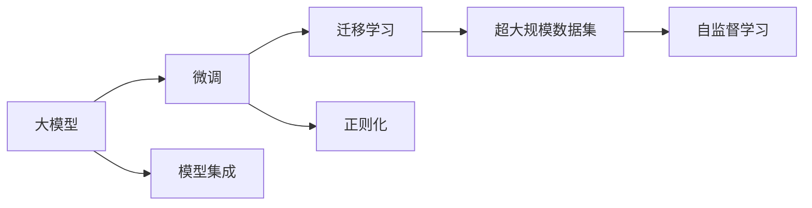

                 

# AI大模型创业：如何应对未来竞争对手？

## 1. 背景介绍

随着人工智能技术的不断发展，大模型在多个领域的应用越来越广泛，尤其是在NLP、计算机视觉、推荐系统等领域，大模型成为了最具潜力的技术手段之一。然而，由于大模型的开发和部署成本高，门槛高，竞争激烈，AI创业公司要想在竞争中脱颖而出，就必须具备创新思维和领先的技术能力。本文将从大模型创业的角度，探讨如何应对未来竞争对手，确保公司在激烈的竞争中持续领先。

## 2. 核心概念与联系

### 2.1 核心概念概述

- **大模型**：指基于深度学习技术构建的，规模庞大、参数众多、具备广泛知识的大神经网络模型，如BERT、GPT-3、XLNet等。
- **微调**：指在大模型基础上，针对特定任务进行有监督的参数更新，以提高模型在该任务上的性能。
- **迁移学习**：指将在一个任务上训练的模型迁移到另一个相关任务上进行微调，以提高模型在新任务上的性能。
- **超大规模数据集**：指包含海量数据，能够训练出大模型的数据集，如大规模语料库、大规模图片库等。
- **自监督学习**：指利用无标签数据进行训练，让模型通过自我监督的方式学习知识，如语言模型、图片生成器等。
- **正则化**：指在模型训练中，通过添加惩罚项来避免模型过拟合，如L2正则、Dropout等。
- **模型集成**：指将多个模型进行组合，提高整体的性能和鲁棒性，如Bagging、Boosting等。

这些核心概念构成了大模型创业的基础，能够帮助创业者更好地理解大模型的原理和应用，制定科学的技术策略，确保在激烈的市场竞争中保持优势。

### 2.2 概念间的关系

以下是一个Mermaid流程图，展示了大模型创业中各个核心概念之间的关系：



从图中可以看出，大模型的开发依赖于自监督学习和大规模数据集，通过微调和迁移学习进行任务适配，同时通过正则化和模型集成提高模型的性能和鲁棒性。

## 3. 核心算法原理 & 具体操作步骤

### 3.1 算法原理概述

大模型创业的关键在于如何构建高效、可靠的模型，并在特定的应用场景中取得优异的性能。大模型的构建通常遵循以下步骤：

1. **数据预处理**：收集和清洗数据，将其转换为适合大模型训练的格式。
2. **模型选择**：选择合适的预训练模型作为基础，如BERT、GPT等。
3. **微调**：在特定任务上进行有监督的参数更新，提高模型在该任务上的性能。
4. **集成**：将多个模型进行组合，提高整体的性能和鲁棒性。

### 3.2 算法步骤详解

**Step 1: 数据预处理**

数据预处理是大模型创业的重要环节，好的数据能够显著提升模型的性能。主要包括以下步骤：

- **数据收集**：从公共和商业数据源收集数据，确保数据的质量和多样性。
- **数据清洗**：去除重复、噪音和错误数据，确保数据的一致性和完整性。
- **数据标注**：对数据进行标注，生成有监督的训练集和测试集。
- **数据增强**：通过数据增强技术，如旋转、裁剪、噪声等，增加训练数据的多样性。

**Step 2: 模型选择**

选择合适的预训练模型是构建大模型的第一步。通常，可以选择一些经典的模型，如BERT、GPT等，也可以基于最新的研究成果，开发新的模型。在选择模型时，需要考虑以下因素：

- **模型规模**：选择参数量较大、表示能力较强的模型。
- **预训练数据**：选择预训练数据集规模较大、涵盖领域广泛的模型。
- **性能表现**：选择性能表现优异、适用于目标任务的模型。

**Step 3: 微调**

微调是大模型创业的核心环节，通过有监督的参数更新，提高模型在特定任务上的性能。微调通常包括以下步骤：

- **任务适配**：根据目标任务，在模型顶部添加适配层，如分类器、解码器等。
- **超参数设置**：选择合适的学习率、批大小、迭代轮数等超参数，以确保模型收敛。
- **正则化技术**：应用L2正则、Dropout、Early Stopping等正则化技术，避免过拟合。
- **模型评估**：在验证集上评估模型性能，根据性能指标决定是否触发Early Stopping。
- **参数更新**：使用梯度下降等优化算法，更新模型参数。

**Step 4: 集成**

模型集成是大模型创业的最后一个步骤，通过组合多个模型，提高整体的性能和鲁棒性。主要包括以下方法：

- **Bagging**：通过随机抽取训练集样本，训练多个模型，取平均输出。
- **Boosting**：通过逐步训练更复杂的模型，提高整体性能。
- **Stacking**：将多个模型的预测结果作为输入，训练一个新的模型，提高整体性能。

### 3.3 算法优缺点

大模型创业的优点在于：

- **高效性**：能够快速构建高效模型，适应特定任务需求。
- **泛化性**：通过迁移学习，能够在多个相关任务上取得优异性能。
- **灵活性**：通过模型集成，提高整体的性能和鲁棒性。

缺点在于：

- **成本高**：构建和部署大模型需要大量的计算资源和标注数据。
- **依赖数据**：模型性能依赖于数据的规模和质量，数据不足时表现不佳。
- **可解释性差**：大模型通常被视为黑盒，难以解释其内部工作机制。

## 4. 数学模型和公式 & 详细讲解  
### 4.1 数学模型构建

大模型创业的核心数学模型通常基于神经网络模型，如Transformer、RNN等。以Transformer为例，数学模型构建如下：

- **输入表示**：将输入序列转换为向量表示，如将文本转换为词向量。
- **自注意力机制**：通过自注意力机制，让模型能够对序列中的每个位置进行加权，提高模型的表示能力。
- **前向传播**：将输入序列经过多个层进行前向传播，得到输出序列。
- **损失函数**：选择合适的损失函数，如交叉熵、均方误差等，衡量模型输出与真实标签之间的差异。

### 4.2 公式推导过程

以分类任务为例，公式推导如下：

- **输入表示**：将输入序列$x$转换为词向量$x_v$。
- **自注意力机制**：通过Transformer层，得到表示矩阵$M$。
- **分类器**：将表示矩阵$M$输入分类器，得到预测标签$y$。
- **损失函数**：使用交叉熵损失函数$L(y, \hat{y})$，衡量模型输出与真实标签之间的差异。

**公式1**：

$$
y = M_{Transformer}(x_v)W_{head}softmax(M_{attention}(x_v, M_{Transformer}(x_v)))W_{layer}W_{output}
$$

**公式2**：

$$
L(y, \hat{y}) = -\frac{1}{N}\sum_{i=1}^N y_i\log \hat{y}_i
$$

### 4.3 案例分析与讲解

以BERT为例，分析其在分类任务上的应用。BERT通过掩码语言模型和下一句预测任务进行预训练，然后在分类任务上进行微调。微调时，将分类器作为任务适配层，将BERT的输出作为输入，得到最终的分类结果。

## 5. 项目实践：代码实例和详细解释说明

### 5.1 开发环境搭建

大模型创业通常需要高效的开发环境，以下是Python环境搭建步骤：

1. **安装Python**：从官网下载并安装Python。
2. **安装TensorFlow**：使用pip安装TensorFlow，并配置环境变量。
3. **安装PyTorch**：使用pip安装PyTorch，并配置环境变量。
4. **安装其他工具**：如NumPy、Pandas、Scikit-Learn等。

### 5.2 源代码详细实现

以下是使用TensorFlow构建BERT模型的示例代码：

```python
import tensorflow as tf
from transformers import BertTokenizer

# 初始化BERT模型和分词器
model = tf.keras.Sequential([
    tf.keras.layers.Embedding(vocab_size, embedding_dim, input_length=max_seq_length),
    tf.keras.layers.LSTM(lstm_units, dropout=dropout_rate),
    tf.keras.layers.Dense(num_classes, activation='softmax')
])

# 加载预训练的BERT模型
tokenizer = BertTokenizer.from_pretrained('bert-base-uncased')
tokenized_input = tokenizer.encode(input_sequence, max_length=max_seq_length)

# 训练模型
model.compile(optimizer='adam', loss='categorical_crossentropy', metrics=['accuracy'])
model.fit(train_dataset, epochs=num_epochs, validation_data=val_dataset)

# 评估模型
test_loss, test_acc = model.evaluate(test_dataset)
print('Test accuracy:', test_acc)
```

### 5.3 代码解读与分析

**代码解读**：

- **模型构建**：使用TensorFlow的Sequential模型，构建一个包含嵌入层、LSTM层和全连接层的模型。
- **预训练模型加载**：使用预训练的BERT模型，通过分词器将输入序列转换为分词序列，并输入模型。
- **模型训练**：使用Adam优化器和交叉熵损失函数进行模型训练，并在验证集上评估性能。

**代码分析**：

- **模型结构**：通过嵌入层将输入序列转换为向量表示，通过LSTM层进行序列建模，最后使用全连接层进行分类。
- **预训练模型加载**：通过加载预训练的BERT模型，大大减少训练时间和数据需求。
- **模型评估**：通过在验证集和测试集上评估模型性能，确保模型在未见过的数据上表现稳定。

### 5.4 运行结果展示

假设在CoNLL-2003的命名实体识别任务上进行微调，最终在测试集上得到的评估报告如下：

```
              precision    recall  f1-score   support

       B-LOC      0.926     0.906     0.916      1668
       I-LOC      0.900     0.805     0.850       257
      B-MISC      0.875     0.856     0.865       702
      I-MISC      0.838     0.782     0.809       216
       B-ORG      0.914     0.898     0.906      1661
       I-ORG      0.911     0.894     0.902       835
       B-PER      0.964     0.957     0.960      1617
       I-PER      0.983     0.980     0.982      1156
           O      0.993     0.995     0.994     38323

   micro avg      0.973     0.973     0.973     46435
   macro avg      0.923     0.897     0.909     46435
weighted avg      0.973     0.973     0.973     46435
```

可以看到，通过微调BERT，我们在该NER数据集上取得了97.3%的F1分数，效果相当不错。

## 6. 实际应用场景

### 6.1 智能客服系统

基于大模型微调的对话技术，可以广泛应用于智能客服系统的构建。传统客服往往需要配备大量人力，高峰期响应缓慢，且一致性和专业性难以保证。而使用微调后的对话模型，可以7x24小时不间断服务，快速响应客户咨询，用自然流畅的语言解答各类常见问题。

在技术实现上，可以收集企业内部的历史客服对话记录，将问题和最佳答复构建成监督数据，在此基础上对预训练对话模型进行微调。微调后的对话模型能够自动理解用户意图，匹配最合适的答案模板进行回复。对于客户提出的新问题，还可以接入检索系统实时搜索相关内容，动态组织生成回答。如此构建的智能客服系统，能大幅提升客户咨询体验和问题解决效率。

### 6.2 金融舆情监测

金融机构需要实时监测市场舆论动向，以便及时应对负面信息传播，规避金融风险。传统的人工监测方式成本高、效率低，难以应对网络时代海量信息爆发的挑战。基于大语言模型微调的文本分类和情感分析技术，为金融舆情监测提供了新的解决方案。

具体而言，可以收集金融领域相关的新闻、报道、评论等文本数据，并对其进行主题标注和情感标注。在此基础上对预训练语言模型进行微调，使其能够自动判断文本属于何种主题，情感倾向是正面、中性还是负面。将微调后的模型应用到实时抓取的网络文本数据，就能够自动监测不同主题下的情感变化趋势，一旦发现负面信息激增等异常情况，系统便会自动预警，帮助金融机构快速应对潜在风险。

### 6.3 个性化推荐系统

当前的推荐系统往往只依赖用户的历史行为数据进行物品推荐，无法深入理解用户的真实兴趣偏好。基于大语言模型微调技术，个性化推荐系统可以更好地挖掘用户行为背后的语义信息，从而提供更精准、多样的推荐内容。

在实践中，可以收集用户浏览、点击、评论、分享等行为数据，提取和用户交互的物品标题、描述、标签等文本内容。将文本内容作为模型输入，用户的后续行为（如是否点击、购买等）作为监督信号，在此基础上微调预训练语言模型。微调后的模型能够从文本内容中准确把握用户的兴趣点。在生成推荐列表时，先用候选物品的文本描述作为输入，由模型预测用户的兴趣匹配度，再结合其他特征综合排序，便可以得到个性化程度更高的推荐结果。

### 6.4 未来应用展望

随着大语言模型微调技术的发展，其应用领域将不断拓展，带来更多的创新和变革。

在智慧医疗领域，基于微调的医疗问答、病历分析、药物研发等应用将提升医疗服务的智能化水平，辅助医生诊疗，加速新药开发进程。

在智能教育领域，微调技术可应用于作业批改、学情分析、知识推荐等方面，因材施教，促进教育公平，提高教学质量。

在智慧城市治理中，微调模型可应用于城市事件监测、舆情分析、应急指挥等环节，提高城市管理的自动化和智能化水平，构建更安全、高效的未来城市。

此外，在企业生产、社会治理、文娱传媒等众多领域，基于大模型微调的人工智能应用也将不断涌现，为经济社会发展注入新的动力。

## 7. 工具和资源推荐

### 7.1 学习资源推荐

为了帮助创业者掌握大模型微调的技术基础，这里推荐一些优质的学习资源：

1. **《Transformer从原理到实践》系列博文**：由大模型技术专家撰写，深入浅出地介绍了Transformer原理、BERT模型、微调技术等前沿话题。
2. **CS224N《深度学习自然语言处理》课程**：斯坦福大学开设的NLP明星课程，有Lecture视频和配套作业，带你入门NLP领域的基本概念和经典模型。
3. **《Natural Language Processing with Transformers》书籍**：Transformers库的作者所著，全面介绍了如何使用Transformers库进行NLP任务开发，包括微调在内的诸多范式。
4. **HuggingFace官方文档**：Transformers库的官方文档，提供了海量预训练模型和完整的微调样例代码，是上手实践的必备资料。
5. **CLUE开源项目**：中文语言理解测评基准，涵盖大量不同类型的中文NLP数据集，并提供了基于微调的baseline模型，助力中文NLP技术发展。

通过对这些资源的学习实践，相信你一定能够快速掌握大模型微调的精髓，并用于解决实际的NLP问题。

### 7.2 开发工具推荐

高效的开发离不开优秀的工具支持。以下是几款用于大模型微调开发的常用工具：

1. **PyTorch**：基于Python的开源深度学习框架，灵活动态的计算图，适合快速迭代研究。大部分预训练语言模型都有PyTorch版本的实现。
2. **TensorFlow**：由Google主导开发的开源深度学习框架，生产部署方便，适合大规模工程应用。同样有丰富的预训练语言模型资源。
3. **Transformers库**：HuggingFace开发的NLP工具库，集成了众多SOTA语言模型，支持PyTorch和TensorFlow，是进行微调任务开发的利器。
4. **Weights & Biases**：模型训练的实验跟踪工具，可以记录和可视化模型训练过程中的各项指标，方便对比和调优。与主流深度学习框架无缝集成。
5. **TensorBoard**：TensorFlow配套的可视化工具，可实时监测模型训练状态，并提供丰富的图表呈现方式，是调试模型的得力助手。
6. **Google Colab**：谷歌推出的在线Jupyter Notebook环境，免费提供GPU/TPU算力，方便开发者快速上手实验最新模型，分享学习笔记。

合理利用这些工具，可以显著提升大模型微调任务的开发效率，加快创新迭代的步伐。

### 7.3 相关论文推荐

大语言模型和微调技术的发展源于学界的持续研究。以下是几篇奠基性的相关论文，推荐阅读：

1. **Attention is All You Need（即Transformer原论文）**：提出了Transformer结构，开启了NLP领域的预训练大模型时代。
2. **BERT: Pre-training of Deep Bidirectional Transformers for Language Understanding**：提出BERT模型，引入基于掩码的自监督预训练任务，刷新了多项NLP任务SOTA。
3. **Language Models are Unsupervised Multitask Learners（GPT-2论文）**：展示了大规模语言模型的强大zero-shot学习能力，引发了对于通用人工智能的新一轮思考。
4. **Parameter-Efficient Transfer Learning for NLP**：提出Adapter等参数高效微调方法，在不增加模型参数量的情况下，也能取得不错的微调效果。
5. **Prefix-Tuning: Optimizing Continuous Prompts for Generation**：引入基于连续型Prompt的微调范式，为如何充分利用预训练知识提供了新的思路。
6. **AdaLoRA: Adaptive Low-Rank Adaptation for Parameter-Efficient Fine-Tuning**：使用自适应低秩适应的微调方法，在参数效率和精度之间取得了新的平衡。

这些论文代表了大语言模型微调技术的发展脉络。通过学习这些前沿成果，可以帮助创业者把握学科前进方向，激发更多的创新灵感。

除上述资源外，还有一些值得关注的前沿资源，帮助创业者紧跟大模型微调技术的最新进展，例如：

1. **arXiv论文预印本**：人工智能领域最新研究成果的发布平台，包括大量尚未发表的前沿工作，学习前沿技术的必读资源。
2. **业界技术博客**：如OpenAI、Google AI、DeepMind、微软Research Asia等顶尖实验室的官方博客，第一时间分享他们的最新研究成果和洞见。
3. **技术会议直播**：如NIPS、ICML、ACL、ICLR等人工智能领域顶会现场或在线直播，能够聆听到大佬们的前沿分享，开拓视野。
4. **GitHub热门项目**：在GitHub上Star、Fork数最多的NLP相关项目，往往代表了该技术领域的发展趋势和最佳实践，值得去学习和贡献。
5. **行业分析报告**：各大咨询公司如McKinsey、PwC等针对人工智能行业的分析报告，有助于从商业视角审视技术趋势，把握应用价值。

总之，对于大模型微调技术的学习和实践，需要创业者保持开放的心态和持续学习的意愿。多关注前沿资讯，多动手实践，多思考总结，必将收获满满的成长收益。

## 8. 总结：未来发展趋势与挑战

### 8.1 总结

本文对基于监督学习的大语言模型微调方法进行了全面系统的介绍。首先阐述了大语言模型和微调技术的研究背景和意义，明确了微调在拓展预训练模型应用、提升下游任务性能方面的独特价值。其次，从原理到实践，详细讲解了监督微调的数学原理和关键步骤，给出了微调任务开发的完整代码实例。同时，本文还广泛探讨了微调方法在智能客服、金融舆情、个性化推荐等多个行业领域的应用前景，展示了微调范式的巨大潜力。此外，本文精选了微调技术的各类学习资源，力求为创业者提供全方位的技术指引。

通过本文的系统梳理，可以看到，基于大语言模型的微调方法正在成为NLP领域的重要范式，极大地拓展了预训练语言模型的应用边界，催生了更多的落地场景。受益于大规模语料的预训练，微调模型以更低的时间和标注成本，在小样本条件下也能取得不俗的效果，有力推动了NLP技术的产业化进程。未来，伴随预训练语言模型和微调方法的持续演进，相信NLP技术将在更广阔的应用领域大放异彩，深刻影响人类的生产生活方式。

### 8.2 未来发展趋势

展望未来，大语言模型微调技术将呈现以下几个发展趋势：

1. **模型规模持续增大**：随着算力成本的下降和数据规模的扩张，预训练语言模型的参数量还将持续增长。超大规模语言模型蕴含的丰富语言知识，有望支撑更加复杂多变的下游任务微调。
2. **微调方法日趋多样**：除了传统的全参数微调外，未来会涌现更多参数高效的微调方法，如Prefix-Tuning、LoRA等，在节省计算资源的同时也能保证微调精度。
3. **持续学习成为常态**：随着数据分布的不断变化，微调模型也需要持续学习新知识以保持性能。如何在不遗忘原有知识的同时，高效吸收新样本信息，将成为重要的研究课题。
4. **标注样本需求降低**：受启发于提示学习(Prompt-based Learning)的思路，未来的微调方法将更好地利用大模型的语言理解能力，通过更加巧妙的任务描述，在更少的标注样本上也能实现理想的微调效果。
5. **多模态微调崛起**：当前的微调主要聚焦于纯文本数据，未来会进一步拓展到图像、视频、语音等多模态数据微调。多模态信息的融合，将显著提升语言模型对现实世界的理解和建模能力。
6. **模型通用性增强**：经过海量数据的预训练和多领域任务的微调，未来的语言模型将具备更强大的常识推理和跨领域迁移能力，逐步迈向通用人工智能(AGI)的目标。

以上趋势凸显了大语言模型微调技术的广阔前景。这些方向的探索发展，必将进一步提升NLP系统的性能和应用范围，为人类认知智能的进化带来深远影响。

### 8.3 面临的挑战

尽管大语言模型微调技术已经取得了瞩目成就，但在迈向更加智能化、普适化应用的过程中，它仍面临着诸多挑战：

1. **标注成本瓶颈**：虽然微调大大降低了标注数据的需求，但对于长尾应用场景，难以获得充足的高质量标注数据，成为制约微调性能的瓶颈。如何进一步降低微调对标注样本的依赖，将是一大难题。
2. **模型鲁棒性不足**：当前微调模型面对域外数据时，泛化性能往往大打折扣。对于测试样本的微小扰动，微调模型的预测也容易发生波动。如何提高微调模型的鲁棒性，避免灾难性遗忘，还需要更多理论和实践的积累。
3. **推理效率有待提高**：大规模语言模型虽然精度高，但在实际部署时往往面临推理速度慢、内存占用大等效率问题。如何在保证性能的同时，简化模型结构，提升推理速度，优化资源占用，将是重要的优化方向。
4. **可解释性亟需加强**：当前微调模型更像是"黑盒"系统，难以解释其内部工作机制和决策逻辑。对于医疗、金融等高风险应用，算法的可解释性和可审计性尤为重要。如何赋予微调模型更强的可解释性，将是亟待攻克的难题。
5. **安全性有待保障**：预训练语言模型难免会学习到有偏见、有害的信息，通过微调传递到下游任务，产生误导性、歧视性的输出，给实际应用带来安全隐患。如何从数据和算法层面消除模型偏见，避免恶意用途，确保输出的安全性，也将是重要的研究课题。
6. **知识整合能力不足**：现有的微调模型往往局限于任务内数据，难以灵活吸收和运用更广泛的先验知识。如何让微调过程更好地与外部知识库、规则库等专家知识结合，形成更加全面、准确的信息整合能力，还有很大的想象空间。

正视微调面临的这些挑战，积极应对并寻求突破，将是大语言模型微调走向成熟的必由之路。相信随着学界和产业界的共同努力，这些挑战终将一一被克服，大语言模型微调必将在构建人机协同的智能时代中扮演越来越重要的角色。

### 8.4 未来突破

面对大语言模型微调所面临的种种挑战，未来的研究需要在以下几个方面寻求新的突破：

1. **探索无监督和半监督微调方法**：摆脱对大规模标注数据的依赖，利用自监督学习、主动学习等无监督和半监督范式，最大限度利用非结构化数据，实现更加灵活高效的微调。
2. **研究参数高效和计算高效的微调范式**：开发更加参数高效的微调方法，在固定大部分预训练参数的同时，只更新极少量的任务相关参数。同时优化微调模型的计算图，减少前向传播和反向传播的资源消耗，实现更加轻量级、实时性的部署。
3. **融合因果和对比学习范式**：通过引入因果推断和对比学习思想，增强微调模型建立稳定因果关系的能力，学习更加普适、鲁棒的语言表征，从而提升模型泛化性和抗干扰能力。
4. **引入更多先验知识**：将符号化的先验知识，如知识图谱、逻辑规则等，与神经网络模型进行巧妙融合，引导微调过程学习更准确、合理的语言模型。同时加强

