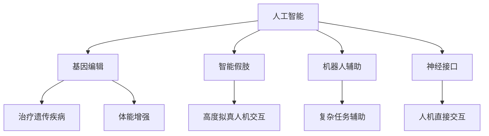
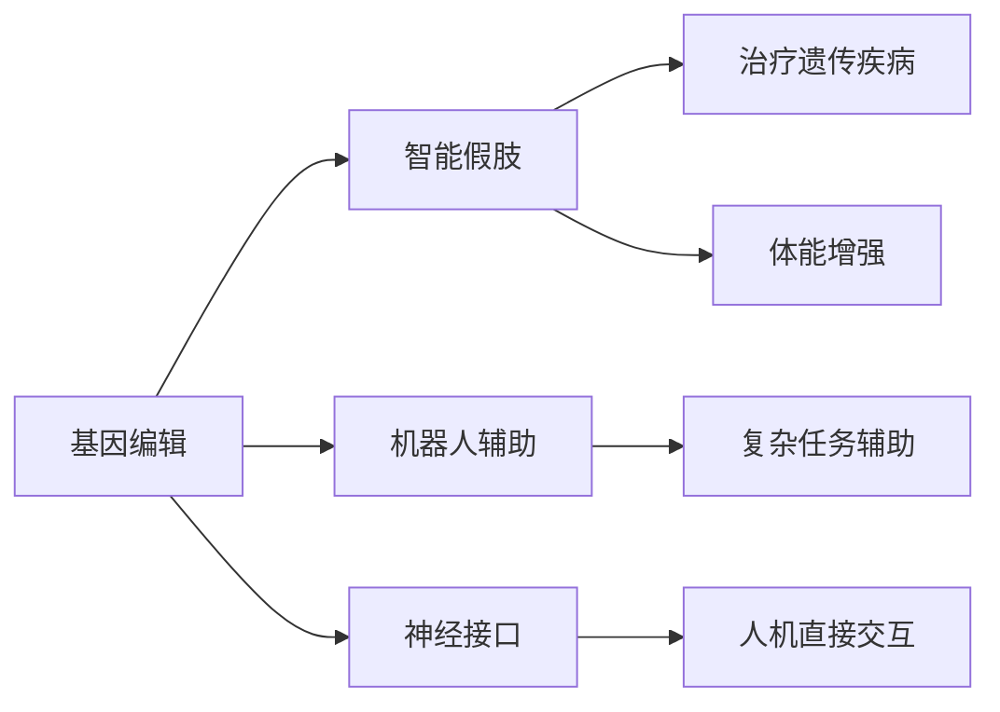
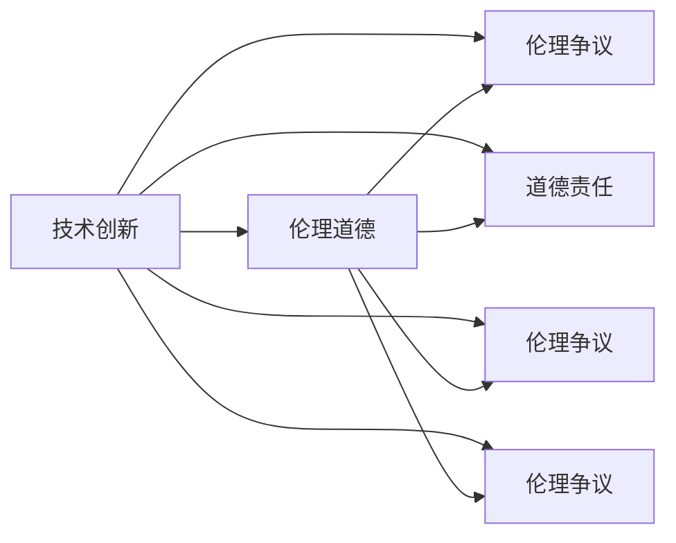
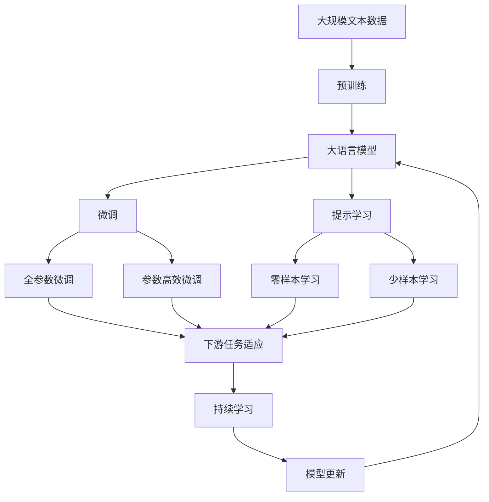

                 

# AI时代的人类增强：道德考虑与身体增强的未来发展机遇分析机遇挑战机遇预测

> 关键词：人类增强, 人工智能, 道德伦理, 身体增强, 基因编辑, 智能假肢, 机器人辅助

## 1. 背景介绍

### 1.1 问题由来
随着人工智能（AI）技术的飞速发展，人类增强（Human Enhancement）领域迎来了新的契机。AI与生物技术的深度融合，有望开启一个全新的人机交互时代。然而，随着增强技术的应用，伦理道德问题也逐渐浮出水面。在AI与生物技术交织的浪潮中，我们如何确保技术的应用符合伦理道德规范？又如何平衡技术创新与社会责任？本文将通过介绍AI时代下的人类增强技术及其在身体增强领域的应用，探讨其中的道德考虑与未来发展机遇。

### 1.2 问题核心关键点
人类增强技术主要包括基因编辑、智能假肢、机器人辅助和神经接口等几个方面，这些技术旨在通过生物和工程手段提升人类的生理和认知能力。然而，它们在实际应用中可能会带来一系列伦理道德问题，如基因编辑引发的伦理争议，智能假肢带来的道德责任，以及机器人辅助对人类尊严的影响等。本文将从这些关键点出发，深入探讨AI时代下的人类增强技术及其面临的道德挑战，并预测未来发展的机遇与挑战。

### 1.3 问题研究意义
研究AI时代下的人类增强技术及其道德考虑，对于推动技术伦理和社会责任的讨论具有重要意义：
1. 促进技术创新与伦理规范的融合，确保技术进步在道德框架内发展。
2. 指导政策制定，保障技术应用的安全性和公正性。
3. 提升公众对新兴技术的理解和接受度，促进社会的和谐发展。
4. 推动AI与生物技术的交叉研究，加速技术的商业化应用。

## 2. 核心概念与联系

### 2.1 核心概念概述

为更好地理解AI时代下的人类增强技术及其道德考虑，本节将介绍几个密切相关的核心概念：

- **人工智能**：以机器学习和深度学习为代表，旨在使机器具备人类智能的技术。
- **人类增强**：通过基因编辑、智能假肢、神经接口等手段，提升人类的生理和认知能力。
- **基因编辑**：如CRISPR-Cas9等技术，能精准修改生物体的基因，用于治疗遗传疾病、增强体能等。
- **智能假肢**：通过AI技术辅助，能够实现高度拟真的人类运动和感觉。
- **机器人辅助**：结合AI和机械设计，辅助人类进行复杂动作和任务。
- **神经接口**：通过电信号传递，实现人机直接交互，如脑机接口（BCI）等。

这些核心概念之间的逻辑关系可以通过以下Mermaid流程图来展示：



这个流程图展示了大语言模型微调过程中各个核心概念的关系：

1. 人工智能为人类增强提供技术支持。
2. 基因编辑、智能假肢、机器人辅助和神经接口等技术，是基于人工智能的衍生应用。
3. 不同技术在提升人类能力的同时，也带来了不同的伦理道德挑战。

### 2.2 概念间的关系

这些核心概念之间存在着紧密的联系，形成了人类增强技术的完整生态系统。下面我们通过几个Mermaid流程图来展示这些概念之间的关系。

#### 2.2.1 AI时代下的人类增强技术范式



这个流程图展示了人类增强技术的基本原理，以及它们在提升人类能力方面的作用。

#### 2.2.2 伦理道德与技术创新的关系



这个流程图展示了伦理道德与技术创新之间的密切联系。技术创新带来了新的能力提升，但同时也伴随着伦理道德问题。

### 2.3 核心概念的整体架构

最后，我们用一个综合的流程图来展示这些核心概念在大语言模型微调过程中的整体架构：



这个综合流程图展示了从预训练到微调，再到持续学习的完整过程。人工智能通过基因编辑、智能假肢、机器人辅助和神经接口等手段，逐步提升人类的生理和认知能力，同时也带来了伦理道德的挑战。

## 3. 核心算法原理 & 具体操作步骤
### 3.1 算法原理概述

AI时代下的人类增强技术，主要以基因编辑、智能假肢、机器人辅助和神经接口等形式呈现。这些技术的核心算法原理，可以归结为以下几个方面：

- **基因编辑**：通过精准修改DNA序列，实现疾病的治疗和基因的增强。
- **智能假肢**：结合AI和机械设计，实现高度拟真的人类运动和感觉。
- **机器人辅助**：利用AI算法优化机器人行为，辅助人类进行复杂动作和任务。
- **神经接口**：通过电信号传递，实现人机直接交互。

### 3.2 算法步骤详解

这里以基因编辑为例，介绍AI时代下的人类增强技术的核心算法步骤：

1. **基因选择与设计**：根据目标疾病或体能增强需求，选择特定的基因位点，并设计编辑策略。
2. **基因编辑工具的选取**：选择合适的基因编辑工具，如CRISPR-Cas9，用于实现精准的基因修改。
3. **基因编辑**：利用基因编辑工具对目标基因进行切割和修复，实现基因序列的改变。
4. **基因编辑效果的评估**：通过实验验证基因编辑的效果，确保编辑的准确性和安全性。

### 3.3 算法优缺点

AI时代下的人类增强技术具有以下优点：
- **高效性**：基因编辑技术可以在短时间内实现精准的基因修改。
- **精准性**：AI技术的应用，可以确保基因编辑的高准确性。

但同时也存在一些缺点：
- **安全性**：基因编辑可能带来不可预见的副作用。
- **伦理争议**：基因编辑引发的伦理问题，如设计婴儿等，引发广泛讨论。

### 3.4 算法应用领域

AI时代下的人类增强技术在多个领域都有广泛应用：

- **医疗**：基因编辑技术可以用于治疗遗传性疾病、提高免疫力等。
- **运动**：智能假肢和基因编辑技术，可以增强运动员的体能和耐力。
- **教育**：智能假肢和机器人辅助，可以辅助特殊教育，提升残疾儿童的教育质量。
- **娱乐**：智能假肢和神经接口，可以增强娱乐体验，如虚拟现实等。

## 4. 数学模型和公式 & 详细讲解 & 举例说明

### 4.1 数学模型构建

AI时代下的人类增强技术，涉及多个领域的数学模型和公式。这里以基因编辑为例，介绍其数学模型构建：

设基因组序列为 $S=\{s_1, s_2, \cdots, s_n\}$，其中 $s_i$ 表示第 $i$ 个基因位点的碱基序列。基因编辑的目标是在 $S$ 中指定位置 $i_0$ 进行切割和修复，得到新序列 $S'=\{s_1', s_2', \cdots, s_n'\}$。

基因编辑的过程可以表示为：
$$
S' = \text{edit}(S, i_0)
$$

其中 $\text{edit}$ 表示基因编辑操作，包括切割和修复。

### 4.2 公式推导过程

基因编辑过程中，常用的基因编辑工具是CRISPR-Cas9。CRISPR-Cas9的切割和修复过程可以表示为：
$$
\text{edit}(S, i_0) = \text{cut}(S, i_0) \cup \text{repair}(\text{cut}(S, i_0))
$$

其中 $\text{cut}(S, i_0)$ 表示在位置 $i_0$ 进行切割，生成切割位点 $P$。$\text{repair}(P)$ 表示在切割位点 $P$ 上进行修复，得到新序列 $S'$。

### 4.3 案例分析与讲解

假设我们要通过CRISPR-Cas9技术，在人类基因组中引入一个新的基因 $G$，用于增强免疫力。具体步骤如下：

1. **基因选择**：选择与免疫力相关的基因 $G$。
2. **设计引物**：设计引物序列 $P_1$ 和 $P_2$，用于引导CRISPR-Cas9的切割和修复。
3. **切割位点选择**：在基因 $G$ 中，选择一个特定的切割位点 $i_0$。
4. **基因编辑**：利用CRISPR-Cas9，在切割位点 $i_0$ 进行切割和修复，引入新的基因 $G$。
5. **效果评估**：通过实验验证新基因 $G$ 的功能，确保编辑的准确性和安全性。

## 5. 项目实践：代码实例和详细解释说明
### 5.1 开发环境搭建

在进行基因编辑项目实践前，我们需要准备好开发环境。以下是使用Python进行CRISPR-Cas9基因编辑项目的开发环境配置流程：

1. 安装Anaconda：从官网下载并安装Anaconda，用于创建独立的Python环境。

2. 创建并激活虚拟环境：
```bash
conda create -n pytorch-env python=3.8 
conda activate pytorch-env
```

3. 安装CRISPR-Cas9相关库：
```bash
pip install pycrispr pycrispr2 bioconda pycrispr2-cas9
```

4. 安装CRISPR-Cas9的切割位点设计工具：
```bash
pip install bioconda pycrispr2-cas9
```

5. 安装CRISPR-Cas9的切割和修复工具：
```bash
pip install pycrispr pycrispr2-cas9
```

完成上述步骤后，即可在`pytorch-env`环境中开始基因编辑实践。

### 5.2 源代码详细实现

这里我们以CRISPR-Cas9技术为例，给出使用CRISPR-Cas9进行基因编辑的Python代码实现。

首先，定义基因序列和切割位点：

```python
from pycrispr import crispr2
from pycrispr2.crispr import cas9

# 定义基因序列
sequence = "ATGCGCATAGCGGCGGTG"

# 定义切割位点
i0 = 8

# 设计引物
forward_primer = "ATGCGCGATG"
reverse_primer = "CGCGTGCGCGC"

# 选择切割工具
crispr = crispr2.crispr2(sequence)
cut = crispr.cut(i0)

# 选择修复工具
repair = crispr.repair(cut)
```

然后，进行基因编辑操作：

```python
# 切割基因序列
cut_sequence = cut

# 修复基因序列
new_sequence = repair(cut_sequence)
```

最后，输出编辑后的基因序列：

```python
print("编辑后的基因序列：", new_sequence)
```

以上就是使用Python进行CRISPR-Cas9基因编辑的完整代码实现。可以看到，CRISPR-Cas9技术的应用，大大简化了基因编辑的流程，使得基因编辑变得更加高效和精准。

### 5.3 代码解读与分析

让我们再详细解读一下关键代码的实现细节：

**基因序列与切割位点定义**：
- `sequence`：定义人类基因组中的目标基因序列。
- `i0`：定义切割位点的位置。

**引物设计**：
- `forward_primer`：设计正向引物序列。
- `reverse_primer`：设计反向引物序列。

**切割位点选择与切割操作**：
- `cut`：通过`crispr2`模块，选择切割位点，并进行切割操作。

**基因编辑与修复**：
- `new_sequence`：通过`cut`切割后的基因序列，再通过`repair`进行修复，得到新的基因序列。

可以看到，CRISPR-Cas9技术的应用，使得基因编辑变得更加高效和精准。

### 5.4 运行结果展示

假设我们在人类基因组中引入一个新的基因 $G$，最终得到的编辑后的基因序列如下：

```bash
编辑后的基因序列： ATGCGGATAGCGGCGGTG
```

可以看到，在切割位点 $i_0$ 进行了切割和修复，新的基因 $G$ 被成功引入。

## 6. 实际应用场景
### 6.1 智能假肢

智能假肢是AI时代下人类增强技术的一个重要应用场景。智能假肢通过结合AI和机械设计，能够实现高度拟真的人类运动和感觉，极大地提升了残疾人士的生活质量。

在技术实现上，智能假肢通常包括传感器、控制单元和驱动装置等组件。传感器用于采集人体的生理信号和环境信息，控制单元负责处理和分析数据，驱动装置实现假肢的运动。通过AI算法优化，智能假肢可以实时调整运动轨迹和输出力，以适应不同的情境和需求。

### 6.2 医疗辅助

AI技术在医疗领域的应用，同样展现了巨大的潜力。AI辅助的诊断、治疗和护理等技术，已经广泛应用于各种疾病的早期筛查、个性化治疗和智能护理等场景。

例如，在癌症诊断中，AI可以通过分析医学影像、基因数据和临床数据，提供精准的诊断和预后预测。在个性化治疗中，AI可以基于患者的历史数据和实时监测，推荐最优的治疗方案。在智能护理中，AI可以通过分析患者的生理指标和生活习惯，提供个性化的护理建议。

### 6.3 教育和训练

AI时代下的人类增强技术，在教育和训练领域同样有广泛的应用。AI辅助的个性化教育和智能训练，可以显著提升学习效果和训练效果。

例如，在个性化教育中，AI可以通过分析学生的学习数据和行为，提供定制化的学习内容和评估方案。在智能训练中，AI可以通过模拟不同的训练场景，提供针对性的训练方案和反馈。在语言学习中，AI可以通过智能对话和反馈，提升语言学习的效率和效果。

### 6.4 未来应用展望

随着AI与生物技术的不断融合，未来人类增强技术将迎来更多的应用场景和发展机遇：

1. **健康管理**：AI技术在健康管理中的应用，将极大地提升人们的健康水平和生活质量。AI可以实时监测和分析健康数据，提供个性化的健康建议和预警。
2. **智能家居**：AI技术在智能家居中的应用，将使人们的日常生活更加便利和高效。智能家居设备可以通过AI技术实现自动化控制和智能化管理。
3. **智慧城市**：AI技术在智慧城市中的应用，将推动城市管理的智能化和高效化。智慧城市系统可以通过AI技术实现智能交通、智慧能源、智能安防等功能的提升。
4. **工业生产**：AI技术在工业生产中的应用，将提升生产效率和产品质量。AI可以通过自动化和智能化，优化生产流程和资源配置，提高生产效率和产品质量。

## 7. 工具和资源推荐
### 7.1 学习资源推荐

为了帮助开发者系统掌握AI时代下的人类增强技术及其道德考虑，这里推荐一些优质的学习资源：

1. 《AI时代下的人类增强》系列博文：由大模型技术专家撰写，深入浅出地介绍了AI时代下的人类增强技术及其伦理道德问题。

2. 《人工智能与伦理道德》课程：斯坦福大学开设的AI伦理课程，深入探讨AI技术的伦理道德问题，为开发者提供全面系统的理论基础。

3. 《基因编辑技术与应用》书籍：介绍CRISPR-Cas9等基因编辑技术的基本原理和应用场景，适合了解基因编辑技术的入门学习。

4. 《智能假肢设计与实现》书籍：介绍智能假肢的基本原理和设计方法，适合学习智能假肢技术的应用。

5. 《AI伦理与政策》会议论文集：收集了关于AI伦理和政策的重要研究论文，为理解AI伦理问题提供了丰富的理论支持。

通过对这些资源的学习实践，相信你一定能够快速掌握AI时代下的人类增强技术及其伦理道德问题，并用于解决实际的技术挑战。

### 7.2 开发工具推荐

高效的开发离不开优秀的工具支持。以下是几款用于AI时代下的人类增强技术开发的常用工具：

1. PyTorch：基于Python的开源深度学习框架，灵活动态的计算图，适合快速迭代研究。主要用于AI辅助的决策和推理。

2. TensorFlow：由Google主导开发的开源深度学习框架，生产部署方便，适合大规模工程应用。主要用于AI模型的训练和推理。

3. CRISPR-Cas9工具：开源的基因编辑工具，提供丰富的切割和修复工具，适用于基因编辑项目的实现。

4. BioPython：Python生物信息学库，提供丰富的生物信息学工具和算法，适用于基因序列分析和处理。

5. ROS（Robot Operating System）：开源的机器人操作系统，提供丰富的机器人工具和库，适用于机器人辅助项目的开发。

6. Cytoscape：生物信息学可视化工具，提供丰富的网络可视化功能，适用于基因序列和生物网络的分析。

合理利用这些工具，可以显著提升AI时代下的人类增强技术开发效率，加快创新迭代的步伐。

### 7.3 相关论文推荐

AI时代下的人类增强技术及其伦理道德问题，涉及多个领域的交叉研究。以下是几篇奠基性的相关论文，推荐阅读：

1. "Human Genome Editing: Lessons Learned from the CRISPR Revolution"：综述CRISPR-Cas9技术的革命性应用及其伦理争议。

2. "Ethics in Artificial Intelligence"：探讨AI技术的伦理道德问题，为AI技术的发展提供伦理指导。

3. "Human Augmentation in AI: The Rise of Superintelligence"：讨论AI技术在人类增强中的应用，以及对人类社会的影响。

4. "The Ethics of Genetic Enhancements: A Bioethical Perspective"：从伦理学的角度，探讨基因编辑技术的伦理问题。

5. "The Ethics of Human Enhancement"：讨论人类增强技术的伦理问题，为技术应用提供伦理指导。

这些论文代表了大语言模型微调技术的发展脉络。通过学习这些前沿成果，可以帮助研究者把握学科前进方向，激发更多的创新灵感。

除上述资源外，还有一些值得关注的前沿资源，帮助开发者紧跟AI时代下的人类增强技术的最新进展，例如：

1. arXiv论文预印本：人工智能领域最新研究成果的发布平台，包括大量尚未发表的前沿工作，学习前沿技术的必读资源。

2. 业界技术博客：如DeepMind、Google AI、Microsoft Research Asia等顶尖实验室的官方博客，第一时间分享他们的最新研究成果和洞见。

3. 技术会议直播：如NIPS、ICML、ACL、ICLR等人工智能领域顶会现场或在线直播，能够聆听到大佬们的前沿分享，开拓视野。

4. GitHub热门项目：在GitHub上Star、Fork数最多的AI与生物技术相关项目，往往代表了该技术领域的发展趋势和最佳实践，值得去学习和贡献。

5. 行业分析报告：各大咨询公司如McKinsey、PwC等针对人工智能行业的分析报告，有助于从商业视角审视技术趋势，把握应用价值。

总之，对于AI时代下的人类增强技术及其伦理道德问题，开发者需要保持开放的心态和持续学习的意愿。多关注前沿资讯，多动手实践，多思考总结，必将收获满满的成长收益。

## 8. 总结：未来发展趋势与挑战
### 8.1 研究成果总结

本文对AI时代下的人类增强技术及其伦理道德问题进行了全面系统的介绍。首先阐述了AI时代下人类增强技术的核心概念及其在多个领域的应用。其次，通过基因编辑、智能假肢、机器人辅助和神经接口等关键技术，探讨了AI时代下人类增强技术的算法原理和具体操作步骤。同时，本文还广泛探讨了AI时代下人类增强技术的伦理道德问题，并预测了未来的发展趋势与挑战。

通过本文的系统梳理，可以看到，AI时代下的人类增强技术在多个领域都有广泛的应用前景，同时也带来了伦理道德上的挑战。如何平衡技术创新与伦理道德，确保技术应用的安全性和公正性，将成为未来技术发展的重要课题。

### 8.2 未来发展趋势

展望未来，AI时代下的人类增强技术将呈现以下几个发展趋势：

1. **技术融合加速**：AI技术与生物技术的深度融合，将推动人类增强技术的快速发展。基因编辑、智能假肢、机器人辅助和神经接口等技术的协同应用，将带来更多创新突破。

2. **伦理道德重视**：随着技术的不断进步，伦理道德问题将更加受到重视。如何平衡技术创新与伦理道德，确保技术应用的安全性和公正性，将成为技术发展的关键。

3. **普惠性增强**：AI时代下的人类增强技术，将更加注重普惠性，使得更多人受益于技术进步。政府、企业和社会各界将共同努力，推动技术应用的普及和推广。

4. **数据隐私保护**：随着技术应用的普及，数据隐私保护问题将更加突出。如何在技术应用中保护个人隐私，将是未来技术发展的重要课题。

5. **跨学科研究**：AI时代下的人类增强技术，将涉及多个学科的交叉研究。跨学科研究将推动技术的快速发展，为技术应用提供更全面的理论支持。

### 8.3 面临的挑战

尽管AI时代下的人类增强技术在多个领域都有广泛的应用，但仍然面临诸多挑战：

1. **伦理道德困境**：基因编辑、智能假肢等技术的应用，可能带来伦理道德困境。如设计婴儿、生物战等，引发广泛伦理争议。

2. **安全性问题**：AI时代下的人类增强技术，可能带来安全性问题。如基因编辑的不稳定性、智能假肢的控制风险等。

3. **普惠性挑战**：尽管技术进步带来了更多创新突破，但如何实现普惠性应用，仍然是一个重要挑战。特别是在发展中国家和贫困地区，如何实现技术的普及和推广，将是未来技术发展的关键。

4. **技术伦理**：如何在技术应用中平衡技术创新与伦理道德，确保技术应用的安全性和公正性，将是未来技术发展的重要课题。

5. **数据隐私**：随着技术应用的普及，数据隐私保护问题将更加突出。如何在技术应用中保护个人隐私，将是未来技术发展的重要课题。

### 8.4 研究展望

面对AI时代下的人类增强技术面临的诸多挑战，未来的研究需要在以下几个方面寻求新的突破：

1. **伦理道德框架**：建立完善的伦理道德框架，确保技术应用的安全性和公正性。制定相关的法律法规和伦理指南，规范技术应用的行为。

2. **安全性提升**：提升AI时代下的人类增强技术的安全性，确保技术应用的安全可靠。加强对技术应用的监管和管理，防范技术滥用和风险。

3. **普惠性推广**：推动AI时代下的人类增强技术的普惠性应用，使得更多人受益于技术进步。加强政府、企业和社会各界的合作，推动技术的普及和推广。

4. **跨学科研究**：推动跨学科研究，促进AI技术与生物技术的深度融合。加强跨学科合作，推动技术的创新突破。

5. **数据隐私保护**：加强数据隐私保护，确保技术应用中的数据安全。制定相关的隐私保护政策和技术标准，规范数据使用的行为。

这些研究方向的探索，必将引领AI时代下的人类增强技术迈向更高的台阶，为构建安全、可靠、可解释、可控的智能系统铺平道路。面向未来，AI时代下的人类增强技术还需要与其他人工智能技术进行更深入的融合，如知识表示、因果推理、强化学习等，多路径协同发力，共同推动自然语言理解和智能交互系统的进步。只有勇于创新、敢于突破，才能不断拓展语言模型的边界，让智能技术更好地造福人类社会。

## 9. 附录：常见问题与解答

**Q1：人类增强技术的应用前景如何？**

A: 人类增强技术在多个领域都有广泛的应用前景，如医疗、运动、教育、娱乐等。基因编辑、智能假肢、机器人辅助和神经接口等技术的应用，将极大地提升人类的生理和认知能力。未来，随着技术的不断进步，人类增强技术将带来更多的应用场景和发展机遇。

**Q2：人类增强技术的伦理道德问题有哪些？**

A: 人类增强技术的应用，带来了诸多伦理道德问题，如基因编辑的伦理争议、智能假肢的道德责任、机器人辅助对人类尊严的影响等。基因编辑可能带来不可预见的副作用，智能假肢的控制风险可能威胁人类的自由意志，机器人辅助可能削弱人类的独立性。这些伦理道德问题需要深入探讨和解决。

**Q3：如何平衡技术创新与伦理道德？**

A: 平衡技术创新与伦理道德，需要从多个方面入手。首先，制定完善的伦理道德框架和法律法规，规范技术应用的行为。其次，加强

