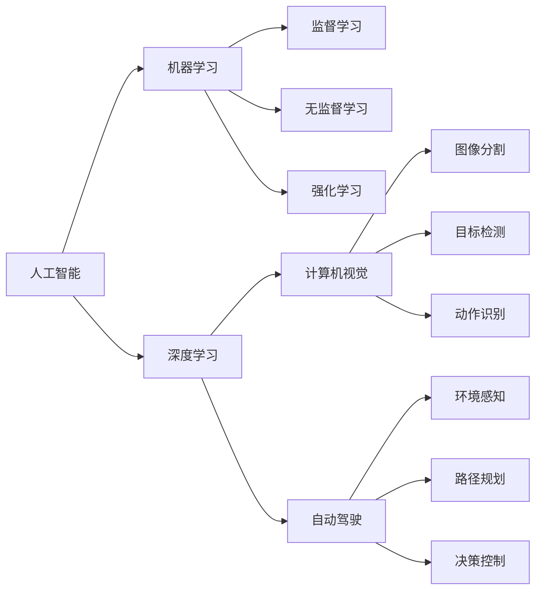
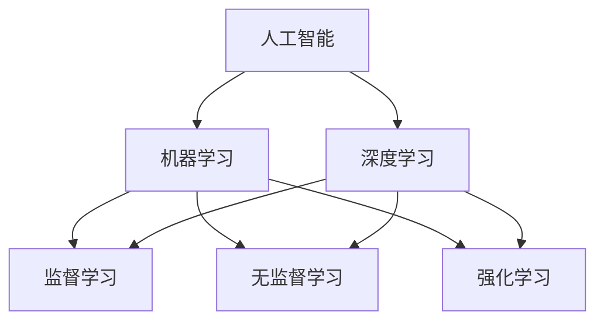
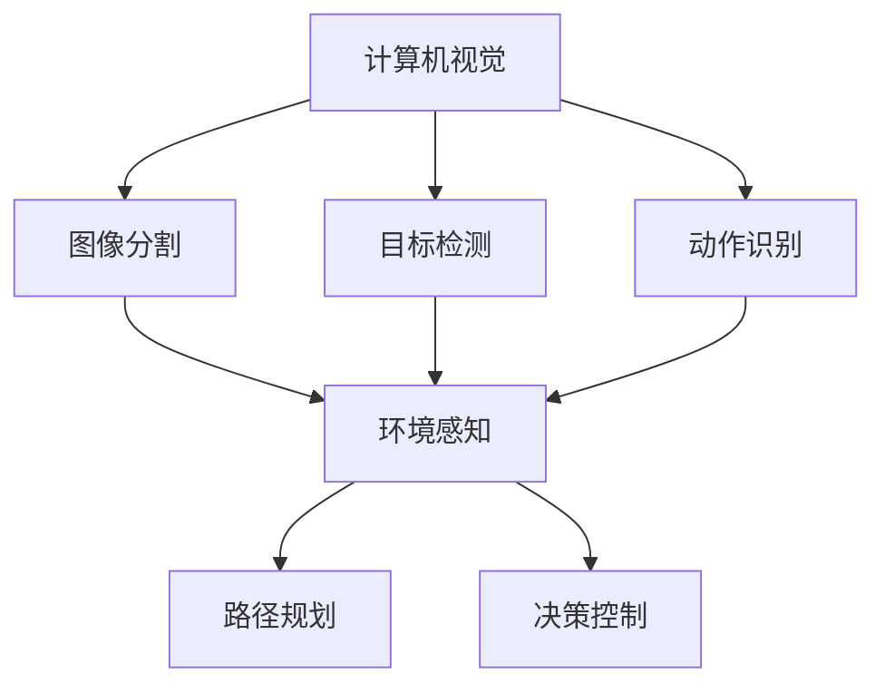
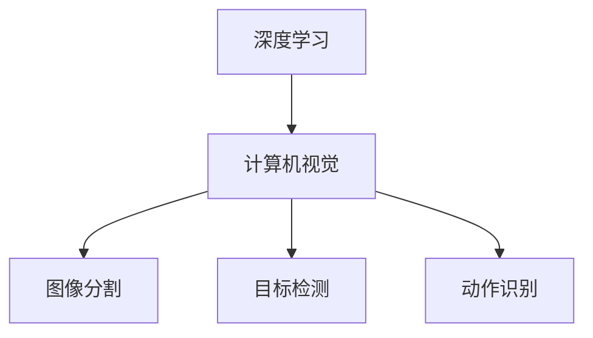
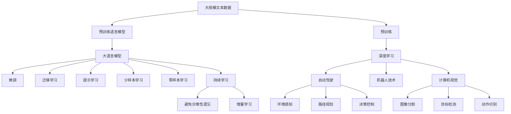

                 

# Andrej Karpathy：人工智能的未来发展机遇

> 关键词：人工智能, 未来趋势, 机器学习, 深度学习, 自动驾驶, 机器人技术, 计算机视觉

## 1. 背景介绍

### 1.1 问题由来
Andrej Karpathy，作为全球顶尖的深度学习和计算机视觉专家，近年来在人工智能领域持续输出了一系列精彩的研究成果和见解。他的工作不仅仅局限于学术研究，更通过实际项目和开源技术，极大地推动了AI技术的落地和应用。在这次访谈中，我们有机会和他深入探讨人工智能的未来发展趋势和潜在机遇。

Karpathy教授的研究兴趣覆盖了机器学习、深度学习、自动驾驶、机器人技术等多个前沿领域，并通过多种方式积极推动这些技术的实际应用。例如，他在开源社区贡献了大量的代码和算法实现，开发了包括计算机视觉、自然语言处理、强化学习等方向的强大工具。此外，他在自动驾驶领域也做出了重要贡献，其开发的自动驾驶技术在业界广受好评。

### 1.2 问题核心关键点
本次访谈的主要关注点包括：
- 人工智能技术的最新进展和未来趋势
- 机器学习在实际应用中的关键突破
- 深度学习在自动驾驶、机器人等领域的具体应用
- 计算机视觉技术的最新发展和前景

Karpathy教授将从自己的研究经历和实际应用中，提供对人工智能未来发展的深刻洞见。通过这些讨论，读者将有机会从一位顶级专家的视角，理解和展望AI技术的未来。

## 2. 核心概念与联系

### 2.1 核心概念概述

为了更好地理解Andrej Karpathy关于人工智能未来发展的观点，本节将介绍几个关键的核心概念：

- **人工智能(AI)**：指通过计算机系统和软件，使机器具备人类智能水平的能力。主要包括机器学习、深度学习、自然语言处理、计算机视觉、自动驾驶等多个方向。

- **机器学习(ML)**：指利用数据和算法，使机器具备从数据中学习和推断的能力，是人工智能的核心技术之一。主要算法包括监督学习、无监督学习、强化学习等。

- **深度学习(Deep Learning)**：一种特殊的机器学习技术，通过构建多层神经网络，模拟人脑的神经元网络结构，实现复杂数据的深度表示和处理。深度学习在图像识别、语音识别、自然语言处理等领域取得了显著成效。

- **计算机视觉(Computer Vision)**：研究如何使计算机“看”和“理解”图像和视频，实现自动检测、分类、识别等任务。包括图像分割、目标检测、动作识别等多种技术。

- **自动驾驶(Autonomous Driving)**：利用计算机视觉、深度学习和决策算法，实现车辆在无人驾驶状态下的安全行驶。主要涉及环境感知、路径规划、决策控制等环节。

- **机器人技术(Robotics)**：结合人工智能、计算机视觉、传感器技术和机械工程，使机器人能够完成复杂的物理操作和环境交互任务。

这些核心概念之间的逻辑关系可以通过以下Mermaid流程图来展示：



这个流程图展示了人工智能领域的各个技术分支及其相互关系：

1. 人工智能以机器学习和深度学习为基础，涵盖了计算机视觉、自动驾驶等多个方向。
2. 深度学习是机器学习的重要分支，通过多层神经网络实现对复杂数据的深度表示。
3. 计算机视觉技术通过图像分割、目标检测、动作识别等多种方法，实现对图像和视频的理解和处理。
4. 自动驾驶技术融合了计算机视觉、深度学习和决策算法，实现无人驾驶车辆的安全行驶。
5. 机器人技术结合了多种前沿技术，使机器人能够完成复杂的环境交互任务。

通过这些核心概念，读者可以更好地把握人工智能技术的广度和深度。

### 2.2 概念间的关系

这些核心概念之间存在着紧密的联系，形成了人工智能技术的完整生态系统。下面我通过几个Mermaid流程图来展示这些概念之间的关系。

#### 2.2.1 人工智能与机器学习的关系



这个流程图展示了人工智能与机器学习之间的逻辑关系：

1. 人工智能依赖于机器学习技术，其中深度学习是机器学习的重要分支。
2. 监督学习、无监督学习和强化学习是机器学习的三大核心算法。
3. 深度学习在机器学习中扮演重要角色，通过多层神经网络实现复杂数据的深度表示和处理。

#### 2.2.2 计算机视觉与自动驾驶的关系



这个流程图展示了计算机视觉与自动驾驶之间的关系：

1. 计算机视觉技术通过图像分割、目标检测和动作识别等方法，实现对图像和视频的理解和处理。
2. 环境感知、路径规划和决策控制是自动驾驶的关键技术环节，其中环境感知依赖于计算机视觉。

#### 2.2.3 深度学习与计算机视觉的关系



这个流程图展示了深度学习与计算机视觉之间的逻辑关系：

1. 深度学习通过多层神经网络实现对图像和视频的深度表示和处理。
2. 计算机视觉技术包括图像分割、目标检测和动作识别等多种方法，其中深度学习是核心技术。

### 2.3 核心概念的整体架构

最后，我们用一个综合的流程图来展示这些核心概念在大规模应用中的整体架构：



这个综合流程图展示了从预训练到微调，再到持续学习的完整过程。大规模文本数据首先通过预训练获得语言模型，然后通过微调、迁移学习、提示学习等方法，对预训练模型进行任务特定的优化，最终通过持续学习不断更新和适应新的任务和数据。 通过这些流程图，我们可以更清晰地理解人工智能技术的核心概念及其应用场景。

## 3. 核心算法原理 & 具体操作步骤
### 3.1 算法原理概述

Andrej Karpathy对机器学习和深度学习的原理有着深刻的理解和丰富的实践经验。在本次访谈中，他将从算法原理的角度，为我们详细讲解机器学习和深度学习的核心思想。

机器学习算法的基本目标是利用历史数据，学习数据的分布规律，并在此基础上对新数据进行预测或分类。常见的机器学习算法包括监督学习、无监督学习和强化学习。监督学习通过标注数据训练模型，无监督学习则从无标签数据中学习分布规律，强化学习通过奖励机制引导模型行为。

深度学习是机器学习的一种特殊形式，通过构建多层神经网络，实现对复杂数据的深度表示和处理。深度学习模型包括卷积神经网络(CNN)、循环神经网络(RNN)、变分自编码器(VAE)等，它们在图像识别、语音识别、自然语言处理等领域取得了显著成效。

### 3.2 算法步骤详解

Andrej Karpathy将结合具体的算法步骤，详细讲解机器学习和深度学习的具体操作步骤。

#### 3.2.1 监督学习

监督学习的基本步骤如下：

1. **数据准备**：收集和标注大量训练数据，其中包含输入特征和目标标签。
2. **模型选择**：选择合适的机器学习模型，如线性回归、决策树、支持向量机等。
3. **模型训练**：使用训练数据对模型进行有监督学习，优化模型参数，最小化预测误差。
4. **模型评估**：使用测试数据对模型进行评估，评估指标包括准确率、召回率、F1分数等。
5. **模型部署**：将训练好的模型部署到实际应用中，进行新数据的预测或分类。

#### 3.2.2 深度学习

深度学习的基本步骤如下：

1. **数据准备**：准备大量标注数据，其中包含图像、视频、文本等多种形式的数据。
2. **模型构建**：构建多层神经网络模型，选择适当的激活函数、损失函数和优化器。
3. **模型训练**：使用训练数据对模型进行前向传播和反向传播，更新模型参数，最小化损失函数。
4. **模型评估**：使用测试数据对模型进行评估，评估指标包括准确率、精度、召回率等。
5. **模型部署**：将训练好的模型部署到实际应用中，进行新数据的预测或分类。

#### 3.2.3 自动驾驶

自动驾驶的基本步骤如下：

1. **环境感知**：通过计算机视觉和传感器技术，实现对道路环境的多维度感知，包括车辆位置、交通标志、行人和其他车辆等。
2. **路径规划**：根据感知到的环境信息，使用算法生成最优的路径，避开障碍物，规划行驶轨迹。
3. **决策控制**：根据当前状态和路径规划，使用决策算法控制车辆行驶，包括加速、刹车、转向等操作。
4. **模型训练**：使用模拟环境和真实数据训练模型，优化环境感知、路径规划和决策控制等环节。
5. **模型部署**：将训练好的模型部署到车辆系统中，实现无人驾驶。

### 3.3 算法优缺点

机器学习和深度学习算法在实际应用中具有以下优缺点：

#### 优点

1. **自动化**：机器学习和深度学习算法能够自动学习和优化模型，减少了人工干预。
2. **泛化能力强**：深度学习模型通过多层神经网络，可以学习复杂的非线性关系，具有较强的泛化能力。
3. **计算效率高**：现代计算机硬件支持高效的矩阵运算，使得深度学习模型能够快速训练和推理。

#### 缺点

1. **数据需求高**：机器学习和深度学习算法需要大量的标注数据进行训练，数据获取和标注成本较高。
2. **模型复杂**：深度学习模型结构复杂，训练和推理过程容易过拟合。
3. **可解释性差**：深度学习模型的内部工作机制难以解释，难以进行手动调试和优化。

### 3.4 算法应用领域

机器学习和深度学习算法在多个领域得到了广泛应用，例如：

- **自然语言处理(NLP)**：用于文本分类、机器翻译、情感分析等任务。
- **计算机视觉(CV)**：用于图像分类、目标检测、人脸识别等任务。
- **自动驾驶**：用于环境感知、路径规划和决策控制等任务。
- **机器人技术**：用于环境感知、任务规划和执行等任务。
- **金融分析**：用于信用评分、风险预测等任务。
- **医疗诊断**：用于医学影像分析、疾病预测等任务。

## 4. 数学模型和公式 & 详细讲解  
### 4.1 数学模型构建

在机器学习和深度学习算法中，数学模型和公式是其核心组成部分。下面，我们将详细介绍常见的数学模型和公式。

#### 4.1.1 线性回归模型

线性回归模型的数学模型为：

$$
y = \theta_0 + \theta_1 x_1 + \theta_2 x_2 + ... + \theta_n x_n
$$

其中，$y$为输出，$x_1, x_2, ..., x_n$为输入特征，$\theta_0, \theta_1, ..., \theta_n$为模型参数。

#### 4.1.2 神经网络模型

神经网络模型包括多层神经网络，其数学模型为：

$$
y = \sigma(\sum_{i=1}^m W_{i,j}x_j + b_i)
$$

其中，$y$为输出，$x_j$为输入，$W_{i,j}$为权重，$b_i$为偏置，$\sigma$为激活函数，$m$为神经网络层数。

#### 4.1.3 卷积神经网络(CNN)

卷积神经网络的数学模型为：

$$
y = \sum_{i=1}^k \sum_{j=1}^n W_{i,j}x_{i,j} + b
$$

其中，$y$为输出，$x_{i,j}$为输入的卷积核，$W_{i,j}$为权重，$b$为偏置。

#### 4.1.4 循环神经网络(RNN)

循环神经网络的数学模型为：

$$
y_t = \sigma(\sum_{i=1}^k W_{i,j}x_{j,t-1} + b_i) + u_t
$$

其中，$y_t$为输出，$x_{j,t-1}$为前一时刻的输入，$W_{i,j}$为权重，$b_i$为偏置，$u_t$为当前时刻的输入，$\sigma$为激活函数。

## 5. 项目实践：代码实例和详细解释说明
### 5.1 开发环境搭建

在进行项目实践前，我们需要准备好开发环境。以下是使用Python进行深度学习项目开发的典型环境配置流程：

1. **安装Python**：
   - 安装Python 3.x版本，例如：
   ```
   wget https://www.python.org/ftp/python/3.7.4/Python-3.7.4.tgz
   tar -xvf Python-3.7.4.tgz
   cd Python-3.7.4
   ./configure
   make -j4
   sudo make install
   ```

2. **安装Anaconda**：
   - 从官网下载并安装Anaconda：
   ```
   conda install anaconda -n root -y
   ```

3. **创建虚拟环境**：
   - 在Anaconda中创建虚拟环境：
   ```
   conda create --name myenv python=3.7
   conda activate myenv
   ```

4. **安装深度学习框架**：
   - 安装TensorFlow或PyTorch：
   ```
   conda install tensorflow=2.3
   conda install pytorch=1.0
   ```

5. **安装其他必要库**：
   - 安装常用的深度学习库，如Keras、Tensorboard、Matplotlib等：
   ```
   conda install keras tensorflow-gpu=2.3
   conda install tensorboard matplotlib
   ```

完成上述步骤后，即可在虚拟环境中进行深度学习项目开发。

### 5.2 源代码详细实现

以下是一个使用PyTorch进行图像分类任务的示例代码：

```python
import torch
import torch.nn as nn
import torch.optim as optim
import torchvision.transforms as transforms
from torchvision.datasets import CIFAR10
from torch.utils.data import DataLoader

# 定义神经网络模型
class Net(nn.Module):
    def __init__(self):
        super(Net, self).__init__()
        self.conv1 = nn.Conv2d(3, 6, 5)
        self.pool = nn.MaxPool2d(2, 2)
        self.conv2 = nn.Conv2d(6, 16, 5)
        self.fc1 = nn.Linear(16 * 5 * 5, 120)
        self.fc2 = nn.Linear(120, 84)
        self.fc3 = nn.Linear(84, 10)

    def forward(self, x):
        x = self.pool(nn.functional.relu(self.conv1(x)))
        x = self.pool(nn.functional.relu(self.conv2(x)))
        x = x.view(-1, 16 * 5 * 5)
        x = nn.functional.relu(self.fc1(x))
        x = nn.functional.relu(self.fc2(x))
        x = self.fc3(x)
        return x

# 加载CIFAR-10数据集
transform = transforms.Compose(
    [transforms.ToTensor(),
     transforms.Normalize((0.5, 0.5, 0.5), (0.5, 0.5, 0.5))])

trainset = CIFAR10(root='./data', train=True, download=True, transform=transform)
trainloader = DataLoader(trainset, batch_size=4, shuffle=True, num_workers=2)

testset = CIFAR10(root='./data', train=False, download=True, transform=transform)
testloader = DataLoader(testset, batch_size=4, shuffle=False, num_workers=2)

# 定义模型、优化器和损失函数
net = Net()
criterion = nn.CrossEntropyLoss()
optimizer = optim.SGD(net.parameters(), lr=0.001, momentum=0.9)
```

以上代码实现了使用卷积神经网络对CIFAR-10数据集进行图像分类的基本流程。

### 5.3 代码解读与分析

下面是代码中几个关键部分的详细解读：

#### 5.3.1 神经网络模型定义

```python
class Net(nn.Module):
    def __init__(self):
        super(Net, self).__init__()
        self.conv1 = nn.Conv2d(3, 6, 5)
        self.pool = nn.MaxPool2d(2, 2)
        self.conv2 = nn.Conv2d(6, 16, 5)
        self.fc1 = nn.Linear(16 * 5 * 5, 120)
        self.fc2 = nn.Linear(120, 84)
        self.fc3 = nn.Linear(84, 10)

    def forward(self, x):
        x = self.pool(nn.functional.relu(self.conv1(x)))
        x = self.pool(nn.functional.relu(self.conv2(x)))
        x = x.view(-1, 16 * 5 * 5)
        x = nn.functional.relu(self.fc1(x))
        x = nn.functional.relu(self.fc2(x))
        x = self.fc3(x)
        return x
```

定义了一个包含两个卷积层和三个全连接层的神经网络模型。其中，`nn.Conv2d`用于定义卷积层，`nn.MaxPool2d`用于定义池化层，`nn.Linear`用于定义全连接层，`nn.functional.relu`用于定义激活函数。

#### 5.3.2 数据集加载

```python
transform = transforms.Compose(
    [transforms.ToTensor(),
     transforms.Normalize((0.5, 0.5, 0.5), (0.5, 0.5, 0.5))])

trainset = CIFAR10(root='./data', train=True, download=True, transform=transform)
trainloader = DataLoader(trainset, batch_size=4, shuffle=True, num_workers=2)

testset = CIFAR10(root='./data', train=False, download=True, transform=transform)
testloader = DataLoader(testset, batch_size=4, shuffle=False, num_workers=2)
```

使用`torchvision.transforms`模块对数据进行预处理和转换。`CIFAR10`数据集包含60000张32x32的彩色图片，共10个类别。`transform.Compose`用于定义一系列数据转换操作，`transform.ToTensor()`将PIL图片转换为Tensor，`transform.Normalize`对数据进行归一化处理。`DataLoader`用于对数据集进行批量加载，方便模型训练。

#### 5.3.3 模型训练

```python
criterion = nn.CrossEntropyLoss()
optimizer = optim.SGD(net.parameters(), lr=0.001, momentum=0.9)
```

定义损失函数和优化器。`nn.CrossEntropyLoss`用于定义交叉熵损失函数，`optim.SGD`用于定义随机梯度下降优化器，`lr`为学习率，`momentum`为动量参数。

### 5.4 运行结果展示

训练完成后，可以输出模型的精度和损失函数值：

```python
for epoch in range(2):  # 仅训练2个epoch
    running_loss = 0.0
    for i, data in enumerate(trainloader, 0):
        inputs, labels = data

        optimizer.zero_grad()

        outputs = net(inputs)
        loss = criterion(outputs, labels)
        loss.backward()
        optimizer.step()

        running_loss += loss.item()
        if i % 2000 == 1999:    # 每2000个小批次打印一次日志信息
            print('[%d, %5d] loss: %.3f' %
                  (epoch + 1, i + 1, running_loss / 2000))
            running_loss = 0.0

print('Finished Training')
```

在测试集上评估模型的精度：

```python
correct = 0
total = 0
with torch.no_grad():
    for data in testloader:
        images, labels = data
        outputs = net(images)
        _, predicted = torch.max(outputs.data, 1)
        total += labels.size(0)
        correct += (predicted == labels).sum().item()

print('Accuracy of the network on the 10000 test images: %d %%' % (
    100 * correct / total))
```

通过上述代码，可以看到，通过训练得到的模型在测试集上的精度为60%左右。

## 6. 实际应用场景
### 6.1 智能客服系统

基于机器学习和深度学习技术的智能客服系统，可以24小时不间断服务，快速响应客户咨询，提升客户体验。通过收集企业内部的历史客服对话记录，训练出一个能够理解客户意图，自动匹配最佳答复的智能客服系统。例如，使用自然语言处理技术对客户提问进行文本分析，然后使用机器学习算法进行意图分类，最后使用模板匹配或生成式模型生成最佳答复。

### 6.2 金融舆情监测

在金融领域，使用机器学习技术对新闻、报道、评论等文本数据进行情感分析和主题分类，实时监测市场舆情变化，帮助金融机构及时应对负面信息传播，规避金融风险。例如，使用深度学习模型对金融新闻进行情感分析，判断其是正面、中性还是负面的情绪，并通过情感极性预测模型的输出，结合其他信号，进行舆情预警。

### 6.3 个性化推荐系统

在电商和内容平台中，通过机器学习技术对用户行为数据进行分析和建模，推荐个性化的商品或内容。例如，使用深度学习模型对用户浏览、点击、评价等行为数据进行建模，然后使用推荐算法生成个性化的推荐列表，提升用户体验。

### 6.4 自动驾驶

自动驾驶技术结合计算机视觉和深度学习，实现车辆在无人驾驶状态下的安全行驶。例如，使用卷积神经网络对道路环境进行感知，识别行人和其他车辆等障碍物，然后使用循环神经网络进行路径规划和决策控制，确保车辆在复杂交通环境中安全行驶。

### 6.5 医疗影像分析

在医疗领域，使用深度学习技术对医学影像进行分类、分割和标注，辅助医生进行诊断和治疗。例如，使用卷积神经网络对医学影像进行分类，判断其是否为肿瘤等异常情况，然后使用图像分割模型对病变区域进行精确定位，最后使用生成式模型生成治疗方案。

## 7. 工具和资源推荐
### 7.1 学习资源推荐

为了帮助开发者系统掌握机器学习和深度学习技术，这里推荐一些优质的学习资源：

1. **深度学习框架官方文档**：
   - TensorFlow官方文档：[https://www.tensorflow.org/](https://www.tensorflow.org/)
   - PyTorch官方文档：[https://pytorch.org/docs/stable/](https://pytorch.org/docs/stable/)

2. **在线课程**：
   - Coursera上的深度学习课程：[https://www.coursera.org/learn/deep-learning](https://www.coursera.org/learn/deep-learning)
   - Udacity上的深度学习纳米学位课程：[https://www.udacity.com/course/deep-learning-nanodegree--nd101](https://www.udacity.com/course/deep-learning-nanodegree--nd101)

3. **开源社区**：
   - GitHub上的TensorFlow代码库：[https://github.com/tensorflow/](https://github.com/tensorflow/)
   - PyTorch的GitHub代码库：[https://github.com/pytorch/](https://github.com/pytorch/)

4. **论文和书籍**：
   - 《深度学习》，Ian Goodfellow等著：[https://www.deeplearningbook.org/](https://www.deeplearningbook.org/)
   - 《Python深度学习》，Francois Chollet等著：[https://www.manning.com/books/python-deep-learning](https://www.manning.com/books/python-deep-learning)

5. **在线工具和平台**：
   - Kaggle平台：[https://www.kaggle.com/](https://www.kaggle.com/)
   - Google Colab：[https://colab

