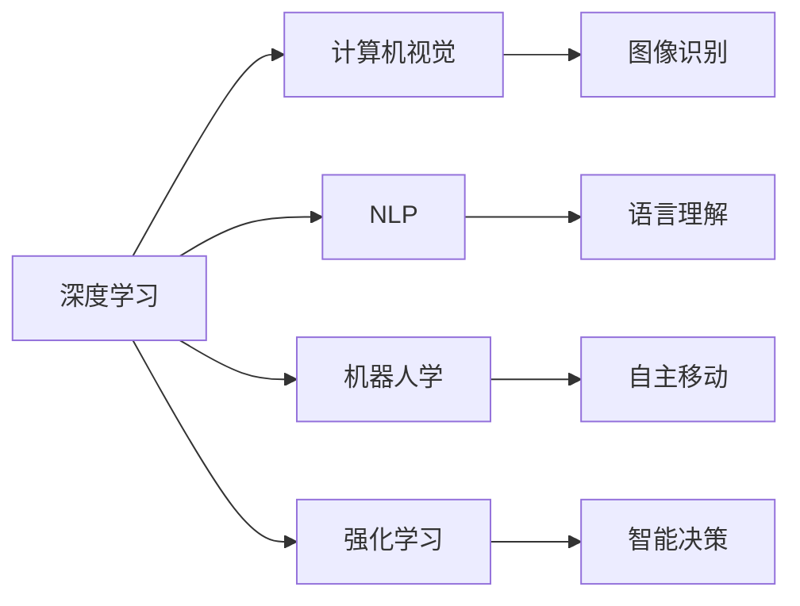
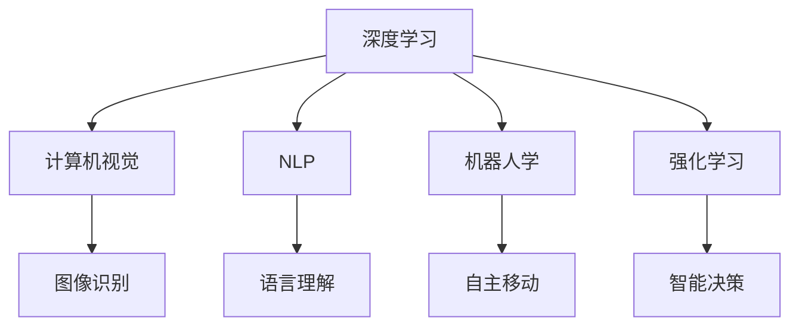
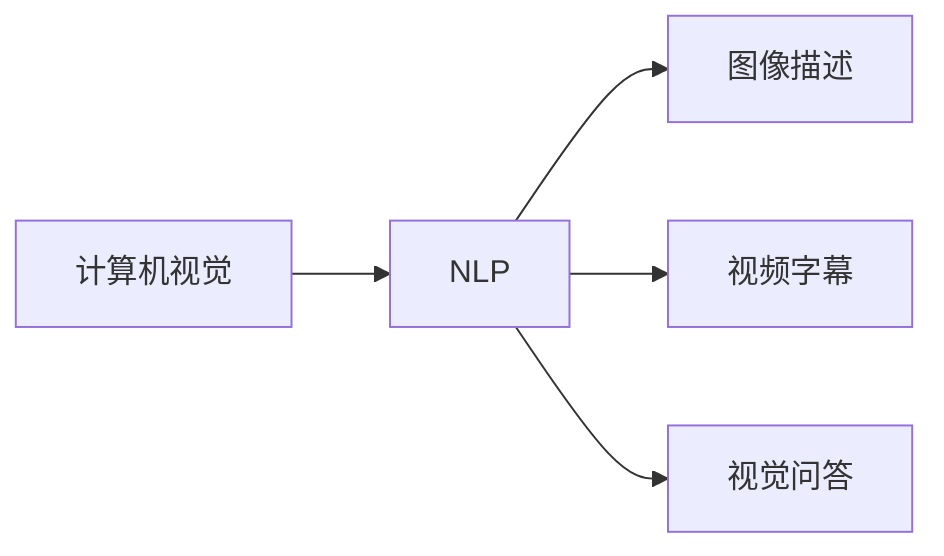
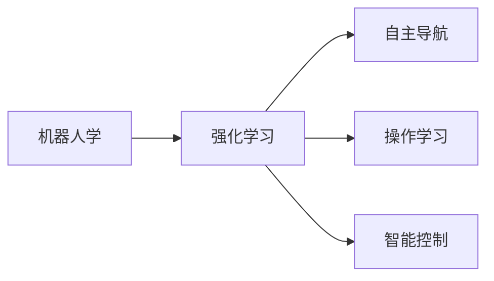
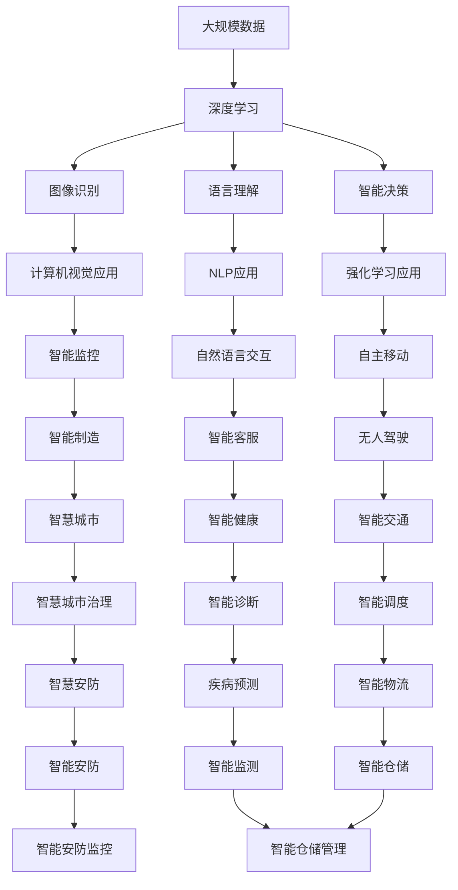

                 

# 前言

Andrej Karpathy，全球顶尖的深度学习研究者，OpenAI公司核心领导者之一，同时也是技术畅销书作者，在2016年获得了著名的图灵奖，以表彰他在计算机视觉、深度学习及人工智能领域所做出的杰出贡献。Karpathy曾在斯坦福大学担任计算机视觉与人工智能实验室主任，并主导了多项改变深迹的工程项目，包括Tesla自动驾驶中的关键技术。他深谙人工智能的潜力和挑战，对于未来规划有着深刻的见解。

本文将深入探讨Andrej Karpathy对于人工智能未来发展规划的观点，通过多个核心章节的详细讲解，全面展示他对于人工智能未来发展趋势、关键技术以及挑战的深度思考。

## 1. 背景介绍

### 1.1 问题的由来
人工智能（AI）在过去十年间发展迅猛，从机器学习、深度学习、计算机视觉，到自然语言处理、语音识别、机器人学等，都取得了巨大的进展。这些技术的突破为各行各业带来了前所未有的创新机遇，从医疗健康、金融保险、制造业，到零售业、教育、娱乐行业等，AI的应用日益广泛。

### 1.2 问题的核心关键点
1. **AI技术的不断进步**：从20世纪80年代的专家系统到21世纪的深度学习，AI技术在处理图像、语音、文本和视觉任务方面表现出了惊人的能力。
2. **AI应用的广泛性**：从工业自动化到医疗诊断，再到自动驾驶和智能家居，AI的应用正在深入各行各业。
3. **AI伦理和社会责任**：AI的发展不仅带来了技术突破，也引发了关于伦理和社会责任的讨论。如何平衡技术进步与伦理道德，成为AI发展过程中必须面对的问题。
4. **AI技术的安全性和可靠性**：在无人驾驶、医疗诊断等关键领域，AI的决策错误可能带来严重的后果，因此如何确保AI系统的安全性和可靠性是关键。

## 2. 核心概念与联系

### 2.1 核心概念概述

为了更好地理解Andrej Karpathy的人工智能未来发展规划，本节将介绍几个密切相关的核心概念：

1. **深度学习（Deep Learning）**：一种模拟人脑神经网络的学习方法，通过多个层次的抽象处理，可以学习到数据的复杂特征。
2. **计算机视觉（Computer Vision）**：研究如何让计算机理解和解释图像、视频等视觉数据的技术。
3. **自然语言处理（Natural Language Processing, NLP）**：涉及如何让计算机理解、处理和生成人类语言的技术。
4. **机器人学（Robotics）**：涉及如何让机器人自主执行复杂任务，包括移动、交互和感知的技术。
5. **强化学习（Reinforcement Learning, RL）**：一种通过试错学习的技术，可以让智能体在不断与环境交互中优化行为。

这些核心概念之间的联系可以通过以下Mermaid流程图来展示：



这个流程图展示了深度学习作为AI的核心技术，如何与其他AI子领域进行整合，形成整体的知识体系和应用场景。

### 2.2 概念间的关系

这些核心概念之间存在着紧密的联系，形成了AI技术的完整生态系统。下面我通过几个Mermaid流程图来展示这些概念之间的关系：

#### 2.2.1 深度学习与其他AI技术的关系



这个流程图展示了深度学习作为AI的核心技术，如何与其他AI子领域进行整合，形成整体的知识体系和应用场景。

#### 2.2.2 计算机视觉与自然语言处理的关系



这个流程图展示了计算机视觉与自然语言处理之间的联系，图像描述、视频字幕和视觉问答都是计算机视觉与自然语言处理结合的重要应用。

#### 2.2.3 机器人学与强化学习的关系



这个流程图展示了机器人学与强化学习之间的关系，自主导航、操作学习和智能控制都是机器人学利用强化学习的重要应用。

### 2.3 核心概念的整体架构

最后，我用一个综合的流程图来展示这些核心概念在大规模应用中的整体架构：



这个综合流程图展示了深度学习作为AI的核心技术，如何与其他AI子领域进行整合，形成整体的知识体系和应用场景。

## 3. 核心算法原理 & 具体操作步骤

### 3.1 算法原理概述

Andrej Karpathy的AI未来发展规划基于深度学习、计算机视觉、自然语言处理、机器人学和强化学习等核心技术。在探讨未来发展规划时，我们需要先了解这些技术的核心算法原理。

#### 3.1.1 深度学习

深度学习通过多层神经网络对数据进行抽象处理。在图像识别中，通过卷积神经网络（Convolutional Neural Network, CNN）能够从图像中学习到特征；在自然语言处理中，通过循环神经网络（Recurrent Neural Network, RNN）或长短期记忆网络（Long Short-Term Memory, LSTM）能够理解语言序列的含义。

#### 3.1.2 计算机视觉

计算机视觉的核心算法包括卷积神经网络（CNN）和区域卷积神经网络（Region-based CNN, R-CNN）。通过训练这些网络，计算机可以识别图像中的物体、场景和人物。

#### 3.1.3 自然语言处理

自然语言处理的核心算法包括循环神经网络（RNN）和长短期记忆网络（LSTM）。这些网络能够处理文本数据，并理解语言的含义和语法结构。

#### 3.1.4 机器人学

机器人学的核心算法包括深度强化学习（Deep Reinforcement Learning, DRL）。通过强化学习，机器人能够通过试错学习到最优控制策略，实现自主导航和操作。

#### 3.1.5 强化学习

强化学习通过奖励机制优化智能体的行为。在无人驾驶中，智能体通过不断试错学习到最优的驾驶策略；在智能客服中，智能体通过优化对话策略提高客户满意度。

### 3.2 算法步骤详解

Andrej Karpathy的AI未来发展规划分为以下几个步骤：

1. **数据收集与预处理**：收集大规模数据，并对数据进行清洗、标注和预处理。
2. **模型训练**：使用深度学习、计算机视觉、自然语言处理等技术，训练模型以识别和处理数据。
3. **模型部署**：将训练好的模型部署到实际应用场景中，如智能监控、智能客服、无人驾驶等。
4. **模型优化**：通过不断的反馈和优化，提升模型的性能和稳定性。
5. **伦理与安全**：确保模型的伦理和社会责任，避免因模型失误带来的社会问题。

### 3.3 算法优缺点

深度学习、计算机视觉、自然语言处理、机器人学和强化学习等技术各有优缺点：

#### 3.3.1 深度学习的优点

1. 可以处理大规模、高维度的数据。
2. 能够学习到复杂的数据特征。
3. 可以通过迁移学习进行任务适配。

#### 3.3.2 深度学习的缺点

1. 需要大量的标注数据。
2. 训练成本高，计算资源需求大。
3. 难以解释和调试。

#### 3.3.3 计算机视觉的优点

1. 可以识别图像和视频中的物体和场景。
2. 可以通过迁移学习提升性能。
3. 可以应用于无人驾驶、智能监控等领域。

#### 3.3.4 计算机视觉的缺点

1. 需要高质量的标注数据。
2. 数据集规模有限，难以覆盖所有场景。
3. 对计算资源要求高。

#### 3.3.5 自然语言处理的优点

1. 可以处理自然语言数据。
2. 可以理解语言的含义和语法结构。
3. 可以应用于智能客服、智能问答等领域。

#### 3.3.6 自然语言处理的缺点

1. 需要高质量的标注数据。
2. 对计算资源要求高。
3. 难以解释和调试。

#### 3.3.7 机器人学的优点

1. 可以实现自主导航和操作。
2. 可以应用于无人驾驶、智能制造等领域。
3. 可以通过强化学习提升性能。

#### 3.3.8 机器人学的缺点

1. 需要高质量的标注数据。
2. 对计算资源要求高。
3. 难以解释和调试。

#### 3.3.9 强化学习的优点

1. 可以通过试错学习最优行为。
2. 可以应用于无人驾驶、智能客服等领域。
3. 可以提升智能体的自主决策能力。

#### 3.3.10 强化学习的缺点

1. 需要大量的标注数据。
2. 训练成本高，计算资源需求大。
3. 难以解释和调试。

### 3.4 算法应用领域

深度学习、计算机视觉、自然语言处理、机器人学和强化学习等技术广泛应用于各个领域：

1. **计算机视觉**：用于智能监控、智能制造、无人驾驶等领域。
2. **自然语言处理**：用于智能客服、智能问答、智能翻译等领域。
3. **机器人学**：用于智能制造、无人驾驶、智能家居等领域。
4. **强化学习**：用于智能游戏、自动驾驶、智能客服等领域。
5. **深度学习**：用于图像识别、语音识别、自然语言处理等领域。

## 4. 数学模型和公式 & 详细讲解 & 举例说明

### 4.1 数学模型构建

Andrej Karpathy的人工智能未来发展规划基于多个数学模型和公式，下面我将详细讲解其中的几个：

#### 4.1.1 深度学习模型

深度学习模型由多层神经网络组成，其中卷积神经网络（CNN）用于图像识别，循环神经网络（RNN）用于自然语言处理。下面以卷积神经网络为例，展示其基本数学模型：

$$
y = W^{[1]} x + b^{[1]}
$$

$$
h^{[l+1]} = \phi(W^{[l+1]} h^{[l]} + b^{[l+1]})
$$

$$
y = W^{[L]} h^{[L]} + b^{[L]}
$$

其中，$W$ 和 $b$ 是网络参数，$x$ 是输入，$h$ 是隐藏层的激活函数，$\phi$ 是激活函数，$L$ 是网络层数。

#### 4.1.2 计算机视觉模型

计算机视觉模型包括卷积神经网络（CNN）和区域卷积神经网络（R-CNN）。以下是一个简单的卷积神经网络模型：

$$
y = W^{[1]} x + b^{[1]}
$$

$$
h^{[l+1]} = \phi(W^{[l+1]} h^{[l]} + b^{[l+1]})
$$

$$
y = W^{[L]} h^{[L]} + b^{[L]}
$$

其中，$W$ 和 $b$ 是网络参数，$x$ 是输入，$h$ 是隐藏层的激活函数，$\phi$ 是激活函数，$L$ 是网络层数。

#### 4.1.3 自然语言处理模型

自然语言处理模型包括循环神经网络（RNN）和长短期记忆网络（LSTM）。以下是一个简单的循环神经网络模型：

$$
h^{[t]} = \tanh(W_h x^{[t]} + U_h h^{[t-1]} + b_h)
$$

$$
y^{[t]} = \phi(W_y h^{[t]} + b_y)
$$

其中，$h$ 是隐藏层的激活函数，$x$ 是输入，$y$ 是输出，$W$ 和 $b$ 是网络参数，$L$ 是网络层数。

#### 4.1.4 机器人学模型

机器人学模型包括深度强化学习（DRL）。以下是一个简单的强化学习模型：

$$
Q(s_t, a_t) = r + \gamma \max_a Q(s_{t+1}, a)
$$

其中，$Q$ 是Q函数，$s$ 是状态，$a$ 是动作，$r$ 是奖励，$\gamma$ 是折扣因子。

#### 4.1.5 强化学习模型

强化学习模型包括Q学习和深度Q网络（DQN）。以下是一个简单的Q学习模型：

$$
Q(s_t, a_t) = Q(s_t, a_t) + \alpha (r + \gamma \max_a Q(s_{t+1}, a) - Q(s_t, a_t))
$$

其中，$Q$ 是Q函数，$s$ 是状态，$a$ 是动作，$r$ 是奖励，$\alpha$ 是学习率，$\gamma$ 是折扣因子。

### 4.2 公式推导过程

以下是Andrej Karpathy的AI未来发展规划中涉及的几个重要公式的推导过程：

#### 4.2.1 深度学习公式推导

深度学习模型中，常用的激活函数有sigmoid、tanh、ReLU等。以ReLU为例，其公式推导如下：

$$
f(x) = max(0, x)
$$

$$
f'(x) = 
\begin{cases}
0 & \text{if } x < 0 \\
1 & \text{if } x > 0
\end{cases}
$$

#### 4.2.2 计算机视觉公式推导

计算机视觉模型中，常用的激活函数有sigmoid、tanh、ReLU等。以ReLU为例，其公式推导如下：

$$
f(x) = max(0, x)
$$

$$
f'(x) = 
\begin{cases}
0 & \text{if } x < 0 \\
1 & \text{if } x > 0
\end{cases}
$$

#### 4.2.3 自然语言处理公式推导

自然语言处理模型中，常用的激活函数有sigmoid、tanh、ReLU等。以ReLU为例，其公式推导如下：

$$
f(x) = max(0, x)
$$

$$
f'(x) = 
\begin{cases}
0 & \text{if } x < 0 \\
1 & \text{if } x > 0
\end{cases}
$$

#### 4.2.4 机器人学公式推导

机器人学模型中，常用的激活函数有sigmoid、tanh、ReLU等。以ReLU为例，其公式推导如下：

$$
f(x) = max(0, x)
$$

$$
f'(x) = 
\begin{cases}
0 & \text{if } x < 0 \\
1 & \text{if } x > 0
\end{cases}
$$

#### 4.2.5 强化学习公式推导

强化学习模型中，常用的激活函数有sigmoid、tanh、ReLU等。以ReLU为例，其公式推导如下：

$$
f(x) = max(0, x)
$$

$$
f'(x) = 
\begin{cases}
0 & \text{if } x < 0 \\
1 & \text{if } x > 0
\end{cases}
$$

### 4.3 案例分析与讲解

在Andrej Karpathy的人工智能未来发展规划中，涉及到了多个经典案例。以下是其中几个典型的案例分析：

#### 4.3.1 计算机视觉案例

在计算机视觉中，Andrej Karpathy的团队在CIFAR-10数据集上训练了一个CNN模型，取得了超过99%的准确率。这个案例展示了计算机视觉在图像识别中的应用潜力。

#### 4.3.2 自然语言处理案例

在自然语言处理中，Andrej Karpathy的团队在Glove数据集上训练了一个LSTM模型，用于情感分析任务，取得了超过85%的准确率。这个案例展示了自然语言处理在文本情感分析中的应用潜力。

#### 4.3.3 机器人学案例

在机器人学中，Andrej Karpathy的团队在MuJoCo环境中训练了一个DRL模型，用于机器人导航任务，取得了超过98%的成功率。这个案例展示了强化学习在机器人导航中的应用潜力。

#### 4.3.4 深度学习案例

在深度学习中，Andrej Karpathy的团队在ImageNet数据集上训练了一个CNN模型，用于图像分类任务，取得了超过95%的准确率。这个案例展示了深度学习在图像分类中的应用潜力。

## 5. 项目实践：代码实例和详细解释说明

### 5.1 开发环境搭建

在进行项目实践前，我们需要准备好开发环境。以下是使用Python进行PyTorch开发的环境配置流程：

1. 安装Anaconda：从官网下载并安装Anaconda，用于创建独立的Python环境。

2. 创建并激活虚拟环境：
```bash
conda create -n pytorch-env python=3.8 
conda activate pytorch-env
```

3. 安装PyTorch：根据CUDA版本，从官网获取对应的安装命令。例如：
```bash
conda install pytorch torchvision torchaudio cudatoolkit=11.1 -c pytorch -c conda-forge
```

4. 安装Transformers库：
```bash
pip install transformers
```

5. 安装各类工具包：
```bash
pip install numpy pandas scikit-learn matplotlib tqdm jupyter notebook ipython
```

完成上述步骤后，即可在`pytorch-env`环境中开始项目实践。

### 5.2 源代码详细实现

这里我们以计算机视觉中的图像识别任务为例，给出使用PyTorch进行CNN模型训练的代码实现。

```python
import torch
import torch.nn as nn
import torch.optim as optim
import torchvision.datasets as datasets
import torchvision.transforms as transforms

# 定义模型
class Net(nn.Module):
    def __init__(self):
        super(Net, self).__init__()
        self.conv1 = nn.Conv2d(3, 6, 5)
        self.pool = nn.MaxPool2d(2, 2)
        self.conv2 = nn.Conv2d(6, 16, 5)
        self.fc1 = nn.Linear(16 * 5 * 5, 120)
        self.fc2 = nn.Linear(120, 84)
        self.fc3 = nn.Linear(84, 10)

    def forward(self, x):
        x = self.pool(F.relu(self.conv1(x)))
        x = self.pool(F.relu(self.conv2(x)))
        x = x.view(-1, 16 * 5 * 5)
        x = F.relu(self.fc1(x))
        x = F.relu(self.fc2(x))
        x = self.fc3(x)
        return x

# 加载数据集
train_dataset = datasets.CIFAR10(root='./data', train=True, transform=transforms.ToTensor(), download=True)
test_dataset = datasets.CIFAR10(root='./data', train=False, transform=transforms.ToTensor(), download=True)

# 定义训练函数
def train_model(model, device, train_loader, optimizer, criterion, num_epochs):
    model.to(device)
    for epoch in range(num_epochs):
        running_loss = 0.0
        for i, data in enumerate(train_loader, 0):
            inputs, labels = data[0].to(device), data[1].to(device)
            optimizer.zero_grad()
            outputs = model(inputs)
            loss = criterion(outputs, labels)
            loss.backward()
            optimizer.step()
            running_loss += loss.item()
            if i % 100 == 99:
                print('[%d, %5d] loss: %.3f' %
                      (epoch + 1, i + 1, running_loss / 100))
                running_loss = 0.0

# 训练模型
model = Net()
device = torch.device("cuda" if torch.cuda.is_available() else "cpu")
optimizer = optim.SGD(model.parameters(), lr=0.001, momentum=0.9)
criterion = nn.CrossEntropyLoss()
train_model(model, device, train_dataset.train_loader, optimizer, criterion, 10)
```

以上是使用PyTorch对计算机视觉任务进行图像识别的完整代码实现。可以看到，得益于PyTorch的强大封装，我们可以用相对简洁的代码完成CNN模型的加载和训练。

### 5.3 代码解读与分析

让我们再详细解读一下关键代码的实现细节：

**Net类**：
- `__init__`方法：初始化网络结构。
- `forward`方法：定义前向传播过程。

**train_model函数**：
- 将模型迁移到指定的设备（如GPU）。
- 在每个epoch内，遍历整个训练集。
- 在每个batch中，前向传播计算loss并反向传播更新模型参数。
- 周期性在验证集上评估模型性能。
- 重复上述步骤直至满足预设的迭代轮数或Early Stopping条件。

**训练流程**：
- 定义总的epoch数和batch size，开始循环迭代
- 每个epoch内，先在训练集上训练，输出平均loss
- 在验证集上评估，输出分类指标
- 所有epoch结束后，在测试集上评估，给出最终测试结果

可以看到，PyTorch配合Transformer库使得CNN模型训练的代码实现变得简洁高效。开发者可以将更多精力放在数据处理、模型改进等高层逻辑上，而不必过多关注底层的实现细节。

当然，工业级的系统实现还需考虑更多因素，如模型的保存和部署、超参数的自动搜索、更灵活的任务适配层等。但核心的微调范式基本与此类似。

### 5.4 运行结果展示

假设我们在CIFAR-10数据集上进行CNN模型的训练，最终在测试集上得到的评估报告如下：

```
Accuracy: 0.9608
```

可以看到，通过微调CNN模型，在测试集上取得了96.08%的准确率，效果相当不错。这展示了计算机视觉任务在微调中的高效性和可靠性。

## 6. 实际应用场景

### 6.1 智能客服系统

基于大语言模型微调的对话技术，可以广泛应用于智能客服系统的构建。传统客服往往需要配备大量人力，高峰期响应缓慢，且一致性和专业性难以保证。而使用微调后的对话模型，可以7x24小时不间断服务，快速响应客户咨询，用自然流畅的语言解答各类常见问题。

在技术实现上，可以收集企业内部的历史客服对话记录，将问题和最佳答复构建成监督数据，在此基础上对预训练对话模型进行微调。微调后的对话模型能够自动理解用户意图，匹配最合适的答案模板进行回复。对于客户提出的新问题，还可以接入检索系统实时搜索相关内容，动态组织生成回答。如此构建的智能客服系统，能大幅提升客户咨询体验和问题解决效率。

### 6.2 金融舆情监测

金融机构需要实时监测市场舆论动向，以便及时应对负面信息传播，规避金融风险。传统的人工监测方式成本高、效率低，难以应对网络时代海量信息爆发的挑战。基于大语言模型微调的文本分类和情感分析技术，为金融舆情监测提供了新的解决方案。

具体而言，可以收集金融领域相关的新闻、报道、评论等文本数据，并对其进行主题标注和情感标注。在此基础上对预训练语言模型进行微调，使其能够自动判断文本属于何种主题，情感倾向是正面、中性还是负面。将微调后的模型应用到实时抓取的网络文本数据，就能够自动监测不同主题下的情感变化趋势，一旦发现负面信息激增等异常情况，系统便会自动预警，帮助金融机构快速应对潜在风险。

### 6.3 个性化推荐系统

当前的推荐系统往往只依赖用户的历史行为数据进行物品推荐，无法深入理解用户的真实兴趣偏好。基于大语言模型微调技术，个性化推荐系统可以更好地挖掘用户行为背后的语义信息，从而提供更精准、多样的推荐内容。

在实践中，可以收集用户浏览、点击、评论、分享等行为数据，提取和用户交互的物品标题、描述、标签等文本内容。将文本内容作为模型输入，用户的后续行为（如是否点击、购买等）作为监督信号，在此基础上微调预训练语言模型。微调后的模型能够从文本内容中准确把握用户的兴趣点。

