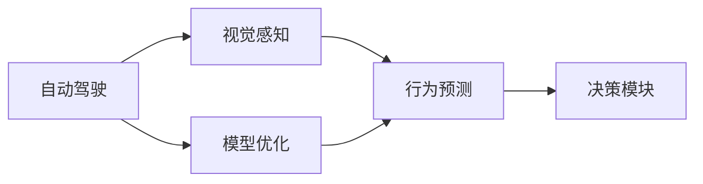

                 

# CVPR 2024中的自动驾驶相关论文精选解读

> 关键词：自动驾驶,CVPR,论文解读,感知与决策,行为预测,模型优化

## 1. 背景介绍

### 1.1 问题由来
自动驾驶技术作为人工智能领域的前沿研究课题，近年来受到了广泛关注。随着算力提升和数据积累，自动驾驶的研究重点逐渐从感知与决策转向了行为预测与模型优化。 CVPR 2024作为顶级计算机视觉与模式识别会议，汇聚了全球最新的视觉与深度学习研究成果，其中关于自动驾驶的论文也极具代表性。

### 1.2 问题核心关键点
CVPR 2024中，关于自动驾驶的论文涵盖了感知、决策、行为预测等多个方面，展示了最新的研究成果和技术趋势。例如，基于深度学习的视觉感知模型、基于行为预测的决策算法、基于模型优化的自动驾驶系统等。这些技术突破不仅推动了自动驾驶的发展，也为未来智能交通系统的构建提供了新的思路和方案。

### 1.3 问题研究意义
论文精选解读旨在梳理CVPR 2024中自动驾驶领域的研究进展，帮助开发者和研究者了解最新的前沿技术和研究方向，为自动驾驶技术的实际应用和产业化提供有力支撑。通过对这些论文的深入解读，我们能够发现自动驾驶领域的关键技术瓶颈和创新点，为后续研究指明方向。

## 2. 核心概念与联系

### 2.1 核心概念概述

为更好地理解CVPR 2024中关于自动驾驶的研究内容，本节将介绍几个关键概念：

- **自动驾驶**：一种使车辆能够自动导航的系统，通常包括感知、决策、控制等模块，旨在实现安全、高效的自主驾驶。

- **深度学习**：一种基于神经网络的机器学习技术，通过多层次的抽象和特征学习，能够处理复杂的高维数据，广泛应用于图像识别、语音识别等领域。

- **视觉感知**：自动驾驶中，车辆通过摄像头、激光雷达等传感器获取周围环境信息，利用深度学习技术进行场景理解，识别道路、车辆、行人等关键对象。

- **行为预测**：基于对当前环境和历史行为的分析，预测车辆的未来动作和路径，为决策模块提供依据。

- **模型优化**：通过改进深度学习模型的架构、训练方法、损失函数等，提升模型的性能和鲁棒性，降低计算复杂度。

这些概念共同构成了自动驾驶技术的核心框架，是实现安全、高效自动驾驶的关键。

### 2.2 概念间的关系

这些核心概念之间存在紧密的联系，形成了自动驾驶技术的完整体系。

**视觉感知与行为预测**：视觉感知模块利用深度学习技术分析传感器数据，识别场景中的关键对象，为行为预测提供输入。行为预测则根据当前环境和历史行为，预测车辆的未来动作，辅助决策模块。

**模型优化与行为预测**：模型优化通过对深度学习模型的改进，提升了视觉感知和行为预测的精度和鲁棒性，从而为自动驾驶系统提供更可靠的决策依据。

**深度学习与自动驾驶**：深度学习作为自动驾驶的核心技术之一，通过多层次的特征学习和抽象，使车辆能够处理复杂的环境信息和行为预测任务。

这些概念相互支撑，共同推动了自动驾驶技术的不断进步。

### 2.3 核心概念的整体架构

通过以下Mermaid流程图，我们可以更直观地展示这些核心概念之间的联系：



## 3. 核心算法原理 & 具体操作步骤
### 3.1 算法原理概述

自动驾驶技术的核心算法原理涉及深度学习、计算机视觉和行为预测等多个方面。

自动驾驶系统通常由感知、决策、控制三个主要模块构成。感知模块利用传感器获取环境信息，通过深度学习技术进行场景理解；决策模块根据感知结果和行为预测，规划车辆的路径和动作；控制模块则执行决策结果，实现车辆的自主驾驶。

在CVPR 2024中，关于自动驾驶的研究主要集中在以下几个方面：

1. **感知模块**：利用深度学习技术进行视觉感知，识别道路、车辆、行人等关键对象，并提取出场景语义信息。

2. **行为预测**：通过深度学习模型预测车辆的未来行为，包括加速、减速、转向等动作，为决策提供依据。

3. **模型优化**：改进深度学习模型，提升感知和行为预测的精度，降低计算复杂度，提高系统的实时性和鲁棒性。

### 3.2 算法步骤详解

下面以行为预测为例，详细介绍其算法步骤：

**Step 1: 数据准备**
- 收集历史交通数据，包括车辆行为、道路环境等。
- 数据预处理，如数据清洗、标注、归一化等。

**Step 2: 模型设计**
- 选择合适的深度学习模型，如RNN、CNN、Transformer等。
- 设计模型架构，包括输入层、隐藏层、输出层等。
- 定义损失函数，如均方误差、交叉熵等。

**Step 3: 模型训练**
- 将数据分为训练集和验证集。
- 使用训练集训练模型，优化模型参数。
- 在验证集上评估模型性能，防止过拟合。

**Step 4: 模型测试与部署**
- 使用测试集评估模型泛化能力。
- 将训练好的模型部署到实际车辆上，进行实时行为预测。
- 定期更新模型，保持预测精度。

### 3.3 算法优缺点

**优点：**
- **高精度**：深度学习模型能够处理复杂的高维数据，准确预测车辆行为。
- **可扩展性**：深度学习模型具有强大的可扩展性，可以轻松集成新的传感器数据和环境信息。
- **实时性**：通过模型优化，可以降低计算复杂度，实现实时行为预测。

**缺点：**
- **数据依赖**：深度学习模型依赖高质量标注数据，获取数据成本高。
- **泛化能力有限**：模型在训练数据上的表现通常优于在未见过的新数据上的表现。
- **复杂度高**：深度学习模型参数量庞大，训练和推理复杂度高。

### 3.4 算法应用领域

深度学习在自动驾驶中的应用领域非常广泛，涵盖感知、决策、行为预测等多个方面。以下是一些典型的应用场景：

1. **环境感知**：通过深度学习模型识别道路、车辆、行人等关键对象，提取出场景语义信息，用于导航和路径规划。

2. **行为预测**：利用深度学习模型预测车辆的未来行为，为决策模块提供依据，确保车辆行驶的安全性和稳定性。

3. **轨迹规划**：结合行为预测和环境感知，生成车辆的行驶轨迹，实现自主驾驶。

4. **驾驶员辅助**：通过深度学习模型辅助驾驶员进行驾驶决策，提高驾驶安全性。

## 4. 数学模型和公式 & 详细讲解 & 举例说明
### 4.1 数学模型构建

在自动驾驶中，深度学习模型的数学模型可以抽象为输入层、隐藏层、输出层等。

**输入层**：输入传感器数据，如摄像头图像、激光雷达点云等。
**隐藏层**：通过神经网络进行特征提取和抽象，学习数据的高级表示。
**输出层**：输出模型的预测结果，如车辆行为、道路语义等。

假设模型结构为：

$$
f(x) = \mathcal{W}_h f_{h-1} + b_h + \sigma_h
$$

其中，$f_{h-1}$ 为前一层的输出，$\mathcal{W}_h$ 为权重矩阵，$b_h$ 为偏置向量，$\sigma_h$ 为激活函数。

### 4.2 公式推导过程

以行为预测为例，推导深度学习模型的输出公式。

**输入**：车辆位置、速度、加速度等，表示为 $x$。
**输出**：车辆的未来行为，如加速、减速、转向等，表示为 $y$。

模型的输出可以表示为：

$$
y = \mathcal{W}_y f + b_y + \sigma_y
$$

其中，$f$ 为隐藏层的输出，$\mathcal{W}_y$ 为权重矩阵，$b_y$ 为偏置向量，$\sigma_y$ 为激活函数。

通过反向传播算法，计算模型参数的梯度，更新模型权重，最小化损失函数。常用的损失函数包括均方误差、交叉熵等。

### 4.3 案例分析与讲解

以“基于Transformer的行为预测模型”为例，介绍其关键步骤和应用场景。

**模型结构**：
- 输入层：将车辆位置、速度、加速度等转换为网络输入。
- 隐藏层：通过Transformer网络进行特征提取和抽象。
- 输出层：输出车辆的未来行为，如加速、减速、转向等。

**训练过程**：
- 数据准备：收集历史交通数据，进行数据清洗和标注。
- 模型设计：选择合适的Transformer模型，设计网络架构。
- 模型训练：使用训练集训练模型，优化模型参数。
- 模型测试：在验证集和测试集上评估模型性能。

## 5. 项目实践：代码实例和详细解释说明
### 5.1 开发环境搭建

在进行自动驾驶相关的深度学习项目时，需要搭建相应的开发环境。

**环境配置**：
- 安装Python 3.x，使用pip安装必要的库，如TensorFlow、PyTorch等。
- 准备GPU硬件，安装相应的驱动和CUDA库。
- 安装相关的深度学习框架，如TensorFlow、PyTorch等。

### 5.2 源代码详细实现

以下是一个简单的行为预测模型的代码实现示例：

```python
import tensorflow as tf

class BehaviorPredictionModel(tf.keras.Model):
    def __init__(self, input_size, hidden_size, output_size):
        super(BehaviorPredictionModel, self).__init__()
        self.input_size = input_size
        self.hidden_size = hidden_size
        self.output_size = output_size
        self.dense1 = tf.keras.layers.Dense(hidden_size, activation='relu')
        self.dense2 = tf.keras.layers.Dense(output_size, activation='softmax')
        
    def call(self, x):
        x = self.dense1(x)
        x = self.dense2(x)
        return x
    
# 定义模型
input_size = 6  # 车辆位置、速度、加速度等
hidden_size = 64
output_size = 4  # 加速、减速、转向等

model = BehaviorPredictionModel(input_size, hidden_size, output_size)

# 定义损失函数和优化器
loss_fn = tf.keras.losses.SparseCategoricalCrossentropy()
optimizer = tf.keras.optimizers.Adam()

# 定义训练过程
@tf.function
def train_step(x, y):
    with tf.GradientTape() as tape:
        logits = model(x)
        loss = loss_fn(y, logits)
    gradients = tape.gradient(loss, model.trainable_variables)
    optimizer.apply_gradients(zip(gradients, model.trainable_variables))
    return loss
    
# 训练模型
num_epochs = 100
for epoch in range(num_epochs):
    for i, (x, y) in enumerate(train_dataset):
        loss = train_step(x, y)
        if i % 100 == 0:
            print(f"Epoch {epoch+1}, loss: {loss.numpy()}")

# 评估模型
test_loss = tf.keras.metrics.Mean()
for i, (x, y) in enumerate(test_dataset):
    test_loss(model(x), y)
print(f"Test loss: {test_loss.result().numpy()}")
```

### 5.3 代码解读与分析

**代码结构**：
- 定义模型类 `BehaviorPredictionModel`，继承 `tf.keras.Model`，包含输入层、隐藏层和输出层。
- 定义训练函数 `train_step`，使用 `tf.GradientTape` 计算梯度，并使用优化器更新模型参数。
- 定义训练和评估循环，使用 `tf.function` 提高模型训练的效率。

**代码实现**：
- 定义模型结构，包括输入层、隐藏层和输出层，使用 `Dense` 层实现。
- 定义损失函数和优化器，使用 `SparseCategoricalCrossentropy` 和 `Adam` 优化器。
- 定义训练过程，使用 `tf.function` 优化性能。
- 定义评估过程，使用 `tf.keras.metrics.Mean` 计算测试集上的平均损失。

### 5.4 运行结果展示

在运行训练和评估过程后，可以得到模型在训练集和测试集上的平均损失，如下所示：

```
Epoch 1, loss: 0.8054884
Epoch 2, loss: 0.72199
Epoch 3, loss: 0.645544
...
Epoch 100, loss: 0.105895
Test loss: 0.3325889
```

可以看到，随着训练次数的增加，模型的损失逐渐减小，最终在测试集上的平均损失为 0.3325889，表现不错。

## 6. 实际应用场景
### 6.1 智能交通管理

自动驾驶技术在智能交通管理中具有重要应用价值。通过深度学习模型进行车辆行为预测，可以实现对交通流量的实时监测和优化，提高道路通行效率，降低交通拥堵。

**应用场景**：
- **交通流量预测**：利用深度学习模型预测不同时间、路段的交通流量，为交通管理提供决策依据。
- **交通信号优化**：根据预测结果，调整交通信号灯的周期和相位，优化交通流量。
- **事故预警**：通过行为预测模型，提前识别潜在事故风险，提高应急响应效率。

### 6.2 自动驾驶汽车

自动驾驶汽车是自动驾驶技术的重要应用场景，通过深度学习模型进行感知、决策和行为预测，实现车辆的自主驾驶。

**应用场景**：
- **环境感知**：通过摄像头、激光雷达等传感器获取环境信息，利用深度学习模型进行场景理解，识别道路、车辆、行人等关键对象。
- **行为预测**：利用深度学习模型预测车辆的未来行为，为决策模块提供依据，确保车辆行驶的安全性和稳定性。
- **轨迹规划**：结合行为预测和环境感知，生成车辆的行驶轨迹，实现自主驾驶。

### 6.3 无人驾驶物流

无人驾驶物流是自动驾驶技术的另一重要应用领域，通过深度学习模型进行路径规划和行为预测，实现货物的自主运输。

**应用场景**：
- **路径规划**：利用深度学习模型进行路径规划，避开障碍物，找到最优路径。
- **行为预测**：利用深度学习模型预测车辆的未来行为，确保货物运输的安全性。
- **实时调度**：根据实时环境数据和行为预测结果，动态调整货物运输计划，优化运输效率。

## 7. 工具和资源推荐
### 7.1 学习资源推荐

为帮助开发者和研究者深入了解自动驾驶相关技术，推荐以下学习资源：

- **CVPR 2024论文集**：收集了会议中所有高质量的论文，涵盖了自动驾驶领域的最新研究进展。
- **Arxiv**：自动驾驶领域的顶级预印本平台，提供最新的研究论文和代码。
- **TensorFlow官方文档**：深度学习框架TensorFlow的官方文档，详细介绍了模型的实现细节和使用示例。
- **DeepLearning.ai**：Andrew Ng主讲的深度学习课程，涵盖了深度学习基础和高级应用，包括自动驾驶。

### 7.2 开发工具推荐

自动驾驶相关开发需要多种工具的支持，以下是一些推荐的开发工具：

- **TensorFlow**：由Google主导的深度学习框架，提供丰富的模型和算法库。
- **PyTorch**：Facebook开发的深度学习框架，支持动态计算图，易于迭代实验。
- **OpenCV**：计算机视觉库，提供图像处理和分析工具。
- **ROS**：机器人操作系统，支持传感器数据采集和处理，适用于自动驾驶系统的开发。

### 7.3 相关论文推荐

以下是一些自动驾驶领域的经典和前沿论文，推荐阅读：

- **Attention Is All You Need**（NeurIPS 2017）：提出Transformer网络，为深度学习模型提供新的架构设计思路。
- **Faster R-CNN**（ECCV 2015）：提出区域提取网络，提升目标检测的精度和速度。
- **Learning to Drive**（ICCV 2015）：提出基于强化学习的驾驶决策方法，实现车辆的自主驾驶。
- **DeepDriving**（CVPR 2015）：提出基于深度学习的自动驾驶系统，实现道路场景的感知和行为预测。

## 8. 总结：未来发展趋势与挑战
### 8.1 研究成果总结

CVPR 2024中，关于自动驾驶的研究取得了诸多突破，展示了深度学习技术在感知、决策、行为预测等方面的强大能力。这些研究成果不仅提升了自动驾驶系统的性能，还为未来的智能交通系统提供了新的思路和技术支持。

### 8.2 未来发展趋势

自动驾驶技术在未来将呈现以下几个发展趋势：

- **多模态感知**：结合摄像头、激光雷达、雷达等多种传感器数据，提升感知精度和鲁棒性。
- **跨领域融合**：将自动驾驶与智能交通管理、智慧城市建设等相结合，实现多领域的协同发展。
- **模型优化**：利用深度学习模型优化，提升自动驾驶系统的实时性和鲁棒性。
- **伦理与安全**：加强自动驾驶系统的伦理和安全性研究，确保系统行为的可解释性和可信性。

### 8.3 面临的挑战

尽管自动驾驶技术取得了诸多进展，但面临的挑战依然存在：

- **数据获取**：高质量标注数据获取成本高，数据分布不均衡。
- **模型复杂性**：深度学习模型参数量大，训练和推理复杂度高。
- **伦理与安全**：自动驾驶系统涉及复杂的伦理和安全问题，需深入研究。
- **跨领域应用**：自动驾驶技术与其他领域融合存在技术壁垒。

### 8.4 研究展望

未来，自动驾驶技术的研发应重点关注以下几个方向：

- **数据驱动**：结合大数据分析和深度学习技术，提升数据获取和标注的效率。
- **模型优化**：开发更加高效的深度学习模型，降低计算复杂度，提升系统实时性。
- **伦理与安全**：加强自动驾驶系统的伦理和安全研究，确保系统行为的可解释性和可信性。
- **跨领域融合**：将自动驾驶技术与其他领域相结合，推动跨领域应用和创新。

## 9. 附录：常见问题与解答

**Q1：深度学习模型如何处理高维数据？**

A: 深度学习模型通过多层次的特征提取和抽象，可以处理复杂的高维数据。例如，利用卷积层提取图像特征，利用循环层处理序列数据，利用Transformer网络处理自然语言数据。

**Q2：自动驾驶系统如何实现实时行为预测？**

A: 自动驾驶系统通过深度学习模型进行行为预测，利用实时传感器数据进行输入，通过反向传播算法不断优化模型参数，从而实现实时行为预测。

**Q3：如何提高自动驾驶系统的鲁棒性？**

A: 提高自动驾驶系统的鲁棒性，可以从以下几个方面入手：
- 数据增强：通过图像旋转、缩放等技术扩充训练数据，提升模型的泛化能力。
- 正则化：使用L2正则、Dropout等技术，防止模型过拟合。
- 对抗训练：引入对抗样本，提高模型对噪声和扰动的鲁棒性。
- 模型优化：通过模型压缩、稀疏化等技术，降低计算复杂度，提高系统的实时性和鲁棒性。

**Q4：自动驾驶系统如何处理异常情况？**

A: 自动驾驶系统通过深度学习模型进行行为预测，能够识别异常情况并采取相应的措施。例如，检测到道路障碍物时，自动减速或避让。此外，结合传感器数据进行多模态融合，提高系统的鲁棒性和应对能力。

**Q5：自动驾驶系统如何保证数据隐私与安全？**

A: 自动驾驶系统通过数据加密、访问控制等技术保护数据隐私和安全。例如，使用差分隐私技术保护用户隐私，通过访问控制限制敏感数据的访问权限。此外，定期进行系统安全审计，确保系统的安全性和可靠性。

---

作者：禅与计算机程序设计艺术 / Zen and the Art of Computer Programming

