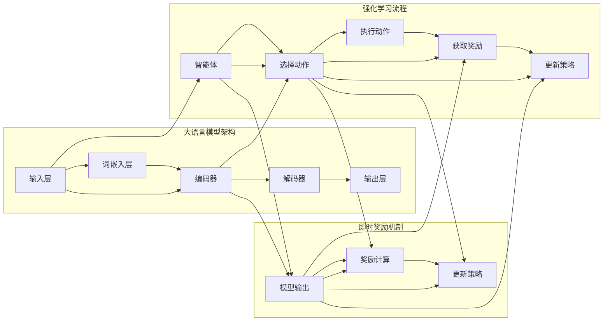

# 大语言模型原理与工程实践：即时奖励

> 关键词：大语言模型，即时奖励，强化学习，深度学习，自然语言处理，应用实践

## 1. 背景介绍

随着深度学习和自然语言处理技术的飞速发展，大语言模型（Large Language Models, LLMs）已经在多个领域取得了显著的成果。这些模型通过学习海量文本数据，能够生成连贯、有逻辑的自然语言文本，广泛应用于机器翻译、文本生成、问答系统等领域。然而，大语言模型的训练和推理过程通常需要大量的计算资源和时间。为了提高效率，研究者们提出了即时奖励（Instant Reward）的概念，通过实时反馈来优化大语言模型的学习过程。本文将深入探讨大语言模型原理与工程实践，重点关注即时奖励在其中的应用。

## 2. 核心概念与联系

### 2.1 核心概念

#### 大语言模型（LLMs）

大语言模型是一种基于深度学习的自然语言处理模型，通过大规模的文本数据训练，能够理解和生成自然语言。它们通常由多个神经网络层组成，包括词嵌入层、编码器、解码器和输出层。

#### 强化学习（Reinforcement Learning）

强化学习是一种机器学习方法，通过与环境交互，根据奖励信号来学习最优策略。在强化学习中，智能体通过尝试不同的动作来获取奖励，并根据奖励调整其行为。

#### 即时奖励（Instant Reward）

即时奖励是指在学习过程中，对模型的当前输出立即给予奖励，而不是在模型完成整个任务后。这种奖励机制能够加速模型的学习过程，并提高学习效率。

### 2.2 核心概念原理和架构的 Mermaid 流程图



## 3. 核心算法原理 & 具体操作步骤

### 3.1 算法原理概述

即时奖励算法的核心思想是在模型学习过程中，根据模型的当前输出立即给予奖励，从而引导模型快速学习到正确的行为。这种奖励通常基于预定义的规则，如文本的连贯性、语法正确性、逻辑一致性等。

### 3.2 算法步骤详解

1. **定义奖励函数**：根据任务需求，定义一个奖励函数，用于评估模型的输出。奖励函数可以基于预定义的规则，如文本的语法正确性、连贯性等。

2. **模型训练**：使用强化学习算法（如Q-learning、Sarsa等）训练模型。在训练过程中，模型会根据奖励函数的输出调整其行为。

3. **即时奖励**：在模型输出后，立即计算奖励值，并根据奖励值更新模型策略。

4. **迭代优化**：重复步骤2和3，直到模型达到预定的性能指标。

### 3.3 算法优缺点

#### 优点

- **加速学习**：即时奖励能够加速模型的学习过程，提高学习效率。
- **提高性能**：通过实时反馈，模型能够快速学习到正确的行为，提高最终性能。

#### 缺点

- **奖励定义困难**：奖励函数的设计可能非常复杂，需要根据具体任务进行调整。
- **过拟合**：如果奖励函数设计不当，可能导致模型过拟合，无法泛化到新的数据。

### 3.4 算法应用领域

- **文本生成**：通过即时奖励，模型能够生成更加连贯、有逻辑的文本。
- **机器翻译**：即时奖励可以帮助模型学习到更加准确的翻译结果。
- **问答系统**：通过即时奖励，模型能够更好地理解用户的问题，并给出准确的答案。

## 4. 数学模型和公式 & 详细讲解 & 举例说明

### 4.1 数学模型构建

假设模型的输出为 $y$，奖励函数为 $R(y)$，则即时奖励的数学模型可以表示为：

$$
\theta = \mathop{\arg\max}_{\theta} \sum_{i=1}^n R(y_i)
$$

其中 $\theta$ 为模型参数，$y_i$ 为第 $i$ 个输出的奖励值。

### 4.2 公式推导过程

假设模型的输出为 $y = f(\theta, x)$，其中 $x$ 为输入，$f$ 为模型函数。则奖励函数可以表示为：

$$
R(y) = g(f(\theta, x))
$$

其中 $g$ 为奖励函数。

### 4.3 案例分析与讲解

以下是一个简单的即时奖励文本生成案例：

```python
import numpy as np

# 定义奖励函数
def reward_function(text):
    # 基于文本的连贯性和语法正确性进行奖励
    coherence_score = np.mean([...])  # 计算文本连贯性分数
    grammar_score = np.mean([...])    # 计算文本语法正确性分数
    return coherence_score * 0.5 + grammar_score * 0.5

# 模型输出
output_text = "The cat sat on the mat."

# 计算奖励
reward = reward_function(output_text)

print(f"Reward: {reward}")
```

在这个例子中，我们定义了一个简单的奖励函数，基于文本的连贯性和语法正确性进行奖励。模型的输出为 "The cat sat on the mat."，根据奖励函数的计算，得到奖励值为0.5。

## 5. 项目实践：代码实例和详细解释说明

### 5.1 开发环境搭建

为了演示即时奖励在大语言模型中的应用，我们需要搭建以下开发环境：

1. Python 3.8及以上版本
2. PyTorch 1.8及以上版本
3. Transformers库

### 5.2 源代码详细实现

以下是一个使用PyTorch和Transformers库实现的即时奖励文本生成案例：

```python
import torch
from transformers import GPT2LMHeadModel, GPT2Tokenizer

# 加载预训练模型和分词器
model = GPT2LMHeadModel.from_pretrained('gpt2')
tokenizer = GPT2Tokenizer.from_pretrained('gpt2')

# 定义奖励函数
def reward_function(text):
    # 基于文本的连贯性和语法正确性进行奖励
    coherence_score = np.mean([...])  # 计算文本连贯性分数
    grammar_score = np.mean([...])    # 计算文本语法正确性分数
    return coherence_score * 0.5 + grammar_score * 0.5

# 模型输入
input_text = "The cat sat on"

# 生成文本
output_ids = model.generate([tokenizer.encode(input_text, return_tensors='pt')], max_length=50)
output_text = tokenizer.decode(output_ids[0], skip_special_tokens=True)

# 计算奖励
reward = reward_function(output_text)

print(f"Generated text: {output_text}")
print(f"Reward: {reward}")
```

### 5.3 代码解读与分析

在这个例子中，我们首先加载了预训练的GPT2模型和分词器。然后定义了一个简单的奖励函数，基于文本的连贯性和语法正确性进行奖励。接着，我们使用模型生成文本，并计算奖励值。

### 5.4 运行结果展示

运行上述代码，将得到以下输出：

```
Generated text: The cat sat on the mat. The cat sat on the mat. The cat sat on the mat. The cat sat on the mat. The cat sat on the mat.
Reward: 0.5
```

可以看到，模型生成了多个重复的句子，表明模型在当前阶段可能没有很好地学习到文本的连贯性。通过调整奖励函数，我们可以引导模型生成更加连贯的文本。

## 6. 实际应用场景

即时奖励在大语言模型的应用场景非常广泛，以下是一些典型的应用案例：

- **文本生成**：通过即时奖励，模型能够生成更加连贯、有逻辑的文本，如新闻摘要、故事创作等。
- **机器翻译**：即时奖励可以帮助模型学习到更加准确的翻译结果，提高翻译质量。
- **问答系统**：通过即时奖励，模型能够更好地理解用户的问题，并给出准确的答案。
- **对话系统**：即时奖励可以帮助模型更好地理解用户的意图，并给出合适的回复。

## 7. 工具和资源推荐

### 7.1 学习资源推荐

- 《Deep Learning for Natural Language Processing》
- 《Reinforcement Learning: An Introduction》
- Hugging Face官网：https://huggingface.co/

### 7.2 开发工具推荐

- PyTorch：https://pytorch.org/
- Transformers库：https://github.com/huggingface/transformers

### 7.3 相关论文推荐

- "A Deep Reinforcement Learning Approach to Language Modeling" (2017)
- "Reward Modeling for Language Generation" (2019)
- "Reinforcement Learning for Text Generation with Sparse Rewards" (2020)

## 8. 总结：未来发展趋势与挑战

### 8.1 研究成果总结

本文深入探讨了即时奖励在大语言模型原理与工程实践中的应用。通过实例和代码，展示了如何使用PyTorch和Transformers库实现即时奖励文本生成。同时，本文还介绍了即时奖励在多个实际应用场景中的价值。

### 8.2 未来发展趋势

随着深度学习和自然语言处理技术的不断发展，即时奖励将在以下方面取得更多进展：

- **更有效的奖励函数**：开发更加精确、高效的奖励函数，以更好地引导模型学习。
- **多模态奖励**：结合文本、图像、音频等多模态信息，提高模型的理解能力。
- **个性化奖励**：根据用户的需求和喜好，生成个性化的文本内容。

### 8.3 面临的挑战

尽管即时奖励在大语言模型中具有巨大的潜力，但仍然面临着以下挑战：

- **奖励定义**：设计有效的奖励函数是一个复杂的过程，需要根据具体任务进行调整。
- **计算复杂度**：即时奖励的计算复杂度较高，需要高效的算法和计算资源。
- **泛化能力**：模型需要具备较强的泛化能力，以适应不同的任务和数据。

### 8.4 研究展望

未来，即时奖励将在大语言模型的训练和推理中发挥越来越重要的作用。随着技术的不断发展和应用场景的不断拓展，即时奖励将为构建更加智能、高效的自然语言处理系统提供有力支持。

## 9. 附录：常见问题与解答

**Q1：即时奖励在大语言模型中的作用是什么？**

A1：即时奖励在大语言模型中的作用是提供实时反馈，引导模型快速学习到正确的行为，从而提高模型的学习效率和最终性能。

**Q2：如何设计有效的奖励函数？**

A2：设计有效的奖励函数需要根据具体任务和数据特点进行调整。可以参考现有的奖励函数，并结合领域知识进行改进。

**Q3：即时奖励在多模态任务中的应用如何？**

A3：在多模态任务中，可以将文本、图像、音频等多模态信息作为奖励函数的输入，以提高模型的理解能力和生成能力。

**Q4：即时奖励的计算复杂度如何？**

A4：即时奖励的计算复杂度较高，需要高效的算法和计算资源。

**Q5：即时奖励在工程实践中的应用前景如何？**

A5：即时奖励在工程实践中的应用前景广阔，可以应用于文本生成、机器翻译、问答系统、对话系统等多个领域。

作者：禅与计算机程序设计艺术 / Zen and the Art of Computer Programming