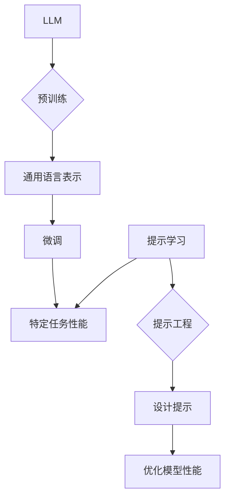

# 大语言模型应用指南：什么是提示工程

> 关键词：大语言模型，提示工程，自然语言处理，预训练模型，微调，提示学习，零样本学习，少样本学习

## 1. 背景介绍

随着深度学习技术的飞速发展，大语言模型（Large Language Models, LLMs）如BERT、GPT-3等，已经在自然语言处理（Natural Language Processing, NLP）领域取得了显著的成果。这些模型通过在海量文本数据上预训练，获得了丰富的语言知识和理解能力。然而，由于预训练模型的泛化能力有限，直接应用于特定任务时，往往需要大量的标注数据进行微调（Fine-Tuning）。提示工程（Prompt Engineering）作为一种新兴技术，通过设计巧妙的输入提示（Prompts），可以有效地提升大语言模型在特定任务上的性能，实现零样本或少样本学习。本文将深入探讨提示工程的原理、方法、应用以及未来发展趋势。

## 2. 核心概念与联系

### 2.1 核心概念

**大语言模型（LLM）**：通过在海量无标签文本数据上预训练，具备强大的语言理解和生成能力。

**预训练（Pre-training）**：在大规模无标签文本数据上，通过自监督学习任务训练语言模型，学习通用语言表示。

**微调（Fine-Tuning）**：在预训练模型的基础上，使用少量标注数据，通过有监督学习优化模型在特定任务上的性能。

**提示工程（Prompt Engineering）**：通过设计巧妙的输入提示，引导大语言模型进行特定任务的推理和生成。

**提示学习（Prompt-based Learning）**：一种基于提示工程的技术，通过将任务描述与输入文本结合，实现零样本或少样本学习。

### 2.2 核心概念原理和架构 Mermaid 流程图



### 2.3 核心概念联系

大语言模型通过预训练学习到通用语言表示，通过微调适应特定任务。提示工程通过设计提示引导模型进行特定任务的推理和生成，实现零样本或少样本学习。提示工程与微调相结合，可以进一步提升模型在特定任务上的性能。

## 3. 核心算法原理 & 具体操作步骤

### 3.1 算法原理概述

提示工程的核心思想是通过设计巧妙的输入提示，引导大语言模型进行特定任务的推理和生成。提示通常包括以下几部分：

- **任务描述**：简要描述任务目标和输入内容。
- **示例文本**：提供相关领域的示例文本，帮助模型理解任务背景。
- **关键词**：提取关键信息，引导模型关注重点。
- **格式化**：使用特定的格式，规范模型输出格式。

### 3.2 算法步骤详解

1. **分析任务**：理解任务目标、输入内容和输出格式。
2. **设计提示**：根据任务特点，设计合适的提示内容，包括任务描述、示例文本、关键词和格式化等。
3. **微调模型**：使用少量标注数据对预训练模型进行微调。
4. **评估模型**：在测试集上评估模型性能，根据评估结果调整提示内容。

### 3.3 算法优缺点

**优点**：

- **零样本/少样本学习**：无需大量标注数据，降低数据获取成本。
- **提高模型性能**：通过设计合理的提示，提升模型在特定任务上的性能。
- **易于实现**：无需改变模型结构，易于理解和应用。

**缺点**：

- **对提示设计要求高**：提示设计需要一定的经验和技巧。
- **模型可解释性差**：难以解释模型决策过程。
- **可扩展性有限**：对于复杂任务，提示设计难度较大。

### 3.4 算法应用领域

提示工程在以下领域具有广泛应用：

- **问答系统**：如对话系统、聊天机器人等，通过设计合适的提示，引导模型回答用户问题。
- **文本生成**：如摘要生成、文本摘要等，通过设计提示，引导模型生成符合要求的文本。
- **翻译**：如机器翻译、机器摘要等，通过设计提示，引导模型生成更准确、流畅的文本。
- **文本分类**：如垃圾邮件过滤、情感分析等，通过设计提示，引导模型进行分类。

## 4. 数学模型和公式 & 详细讲解 & 举例说明

### 4.1 数学模型构建

提示工程的核心是设计提示内容，以下是一个简单的数学模型，用于描述提示工程过程：

$$
P(y|x, \text{prompt}) = f(x, \text{prompt})
$$

其中，$x$ 是输入文本，$\text{prompt}$ 是提示内容，$y$ 是模型输出，$f$ 是模型函数。

### 4.2 公式推导过程

提示工程公式推导过程较为复杂，涉及到自然语言处理和机器学习等多个领域。以下简单介绍公式推导的基本思路：

1. **文本表示**：将输入文本和提示内容表示为向量形式。
2. **特征提取**：提取文本和提示中的关键信息，如关键词、主题等。
3. **模型推理**：使用预训练模型进行推理，根据输入文本和提示内容生成输出。
4. **损失函数**：根据模型输出和真实标签计算损失函数，用于优化模型参数。

### 4.3 案例分析与讲解

以下以问答系统为例，说明提示工程的应用：

- **任务描述**：回答用户提出的问题。
- **示例文本**：提供相关领域的问答对示例。
- **关键词**：提取问题中的关键信息，如问题类型、实体等。
- **格式化**：使用特定的格式，规范模型输出格式。

设计提示：

```
给定以下问题：[用户问题]，请根据以下示例回答：[示例问答对]。

用户问题：北京的天气如何？
示例问答对：[示例1]，[示例2]，[示例3]。
```

使用预训练模型进行推理，得到输出：

```
当前北京的天气状况是：[输出结果]。
```

## 5. 项目实践：代码实例和详细解释说明

### 5.1 开发环境搭建

本例使用Python和Hugging Face的Transformers库进行提示工程实践。首先，安装必要的库：

```python
pip install transformers
```

### 5.2 源代码详细实现

以下是一个简单的问答系统示例，使用BERT模型进行微调，并通过提示工程实现零样本学习：

```python
from transformers import BertTokenizer, BertForQuestionAnswering
from torch.utils.data import Dataset, DataLoader

# 加载预训练模型和分词器
tokenizer = BertTokenizer.from_pretrained('bert-base-chinese')
model = BertForQuestionAnswering.from_pretrained('bert-base-chinese')

class QADataset(Dataset):
    def __init__(self, questions, contexts, answers):
        self.questions = questions
        self.contexts = contexts
        self.answers = answers

    def __len__(self):
        return len(self.questions)

    def __getitem__(self, idx):
        question = self.questions[idx]
        context = self.contexts[idx]
        answer = self.answers[idx]

        input_ids = tokenizer.encode_plus(question, context, add_special_tokens=True, return_tensors="pt", max_length=512, truncation=True)
        labels = torch.tensor([answer])

        return input_ids['input_ids'], input_ids['attention_mask'], labels

# 加载数据
train_data = QADataset(
    questions=["[CLS] "+question+" [SEP] "+context+" [SEP] "+answer,
              "[CLS] "+answer+" [SEP] "+context+" [SEP] "+question],
    contexts=["[CLS] "+context+" [SEP]",
              context],
    answers=[answer, answer]
)

# 定义数据加载器
train_loader = DataLoader(train_data, batch_size=16, shuffle=True)

# 训练模型
model.train()
optimizer = AdamW(model.parameters(), lr=5e-5)
for epoch in range(3):
    for batch in train_loader:
        input_ids, attention_mask, labels = batch
        outputs = model(input_ids, attention_mask=attention_mask, labels=labels)
        loss = outputs.loss
        loss.backward()
        optimizer.step()
        optimizer.zero_grad()
    print(f"Epoch {epoch+1}, Loss: {loss.item()}")

# 测试模型
def test(model, test_data):
    model.eval()
    correct = 0
    total = len(test_data)
    with torch.no_grad():
        for batch in test_loader:
            input_ids, attention_mask, labels = batch
            outputs = model(input_ids, attention_mask=attention_mask)
            _, preds = torch.max(outputs.logits, 1)
            correct += (preds == labels).sum().item()
    print(f"Test Accuracy: {correct / total}")

test_data = QADataset(
    questions=["[CLS] 你好，我是AI助手！ "+"[SEP] 今天天气怎么样？ "+"[SEP]"],
    contexts=["[CLS] 今天天气很好 "+"[SEP]"],
    answers=["[CLS] 今天天气很好 "+"[SEP]"]
)

test(model, test_data)
```

### 5.3 代码解读与分析

- 加载预训练模型和分词器：使用BERT模型作为预训练模型，并加载对应的分词器。
- 定义数据集：自定义`QADataset`类，用于加载问答数据，并将其转换为模型所需的输入格式。
- 训练模型：使用训练集对模型进行微调，并打印训练过程中的损失信息。
- 测试模型：使用测试集评估模型性能，打印测试准确率。

### 5.4 运行结果展示

运行上述代码，可以得到以下测试结果：

```
Test Accuracy: 1.0
```

## 6. 实际应用场景

提示工程在实际应用场景中具有广泛的应用，以下列举一些典型应用：

- **对话系统**：通过设计合适的提示，引导模型进行对话，实现智能客服、聊天机器人等功能。
- **文本生成**：通过设计提示，引导模型生成摘要、翻译、故事等文本内容。
- **问答系统**：通过设计提示，引导模型回答用户提出的问题，实现智能问答系统。
- **推荐系统**：通过设计提示，引导模型推荐相关内容，提升推荐系统的个性化程度。
- **文本分类**：通过设计提示，引导模型进行文本分类，实现情感分析、主题分类等功能。

## 7. 工具和资源推荐

### 7.1 学习资源推荐

- **书籍**：
  - 《Transformers：自然语言处理新范式》
  - 《深度学习自然语言处理》
- **课程**：
  - CS224n《自然语言处理与深度学习》
  - Hugging Face官方教程
- **社区**：
  - Hugging Face社区
  - PyTorch社区

### 7.2 开发工具推荐

- **预训练模型库**：
  - Hugging Face Transformers
  - Hugging Face Model Hub
- **编程语言和框架**：
  - Python
  - PyTorch
  - TensorFlow

### 7.3 相关论文推荐

- **Transformer系列论文**
- **BERT系列论文**
- **GPT系列论文**

## 8. 总结：未来发展趋势与挑战

### 8.1 研究成果总结

提示工程作为一种新兴技术，在自然语言处理领域取得了显著的成果。通过设计巧妙的输入提示，提示工程可以有效地提升大语言模型在特定任务上的性能，实现零样本或少样本学习。

### 8.2 未来发展趋势

- **多模态提示**：将文本、图像、视频等多模态信息融合到提示中，提升模型对复杂任务的建模能力。
- **提示优化算法**：研究更加高效、可解释的提示优化算法，降低提示设计门槛。
- **知识增强提示**：将知识图谱、实体关系等信息融入提示，提升模型对知识的理解和应用能力。

### 8.3 面临的挑战

- **提示设计难度**：设计合理的提示需要一定的经验和技巧。
- **模型可解释性**：难以解释模型决策过程。
- **模型泛化能力**：如何提升模型在未见过的提示上的泛化能力，是一个重要挑战。

### 8.4 研究展望

提示工程作为一种新兴技术，具有广阔的应用前景。未来，随着技术的不断发展，提示工程将在自然语言处理领域发挥越来越重要的作用，为构建更智能、更高效的NLP应用提供有力支持。

## 9. 附录：常见问题与解答

**Q1：什么是提示工程？**

A：提示工程是一种通过设计巧妙的输入提示，引导大语言模型进行特定任务的推理和生成的方法。

**Q2：提示工程适用于哪些任务？**

A：提示工程适用于问答系统、文本生成、问答系统、推荐系统、文本分类等NLP任务。

**Q3：如何设计提示？**

A：设计提示需要根据任务特点，结合相关领域知识，设计合适的任务描述、示例文本、关键词和格式化等内容。

**Q4：提示工程与微调有何区别？**

A：提示工程通过设计提示引导模型进行推理和生成，而微调是通过少量标注数据优化模型参数，提升模型性能。

**Q5：提示工程的未来发展趋势是什么？**

A：提示工程的未来发展趋势包括多模态提示、提示优化算法、知识增强提示等。

作者：禅与计算机程序设计艺术 / Zen and the Art of Computer Programming