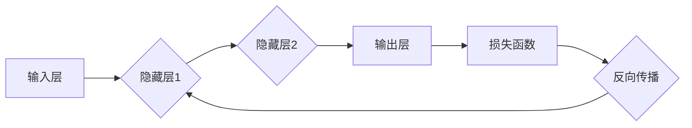

## 神经网络：机器学习的新范式

> 关键词：神经网络、机器学习、深度学习、卷积神经网络、循环神经网络、反向传播、激活函数、梯度下降

## 1. 背景介绍

机器学习作为人工智能领域的核心技术之一，近年来取得了令人瞩目的进展。其中，神经网络作为一种模仿人脑结构和功能的算法，在图像识别、自然语言处理、语音识别等领域展现出强大的学习能力和应用潜力。

传统的机器学习算法通常依赖于人工特征工程，需要专家对数据进行预处理和特征提取。而神经网络则能够自动学习数据中的特征，无需人工干预，这使得其在处理复杂数据和模式识别方面具有显著优势。

随着计算能力的提升和海量数据的积累，深度学习——基于多层神经网络的机器学习范式——迅速发展起来，取得了突破性的成果。从AlphaGo战胜世界围棋冠军到自动驾驶汽车的快速发展，深度学习已经渗透到我们生活的方方面面。

## 2. 核心概念与联系

### 2.1 神经网络结构

神经网络由大量相互连接的神经元组成，这些神经元按层级结构排列，通常分为输入层、隐藏层和输出层。

* **输入层:**接收原始数据，每个神经元对应一个输入特征。
* **隐藏层:**对输入数据进行处理和转换，隐藏层可以有多个，每个隐藏层包含多个神经元。
* **输出层:**输出最终结果，每个神经元对应一个输出类别或值。

神经元之间通过连接权重进行信息传递，每个连接权重代表神经元之间强度。

### 2.2 激活函数

激活函数是神经网络中一个重要的组成部分，它决定了神经元的输出是否被激活。常见的激活函数包括 sigmoid 函数、ReLU 函数、tanh 函数等。

激活函数的作用是引入非线性，使神经网络能够学习复杂的数据模式。

### 2.3 反向传播算法

反向传播算法是训练神经网络的关键算法，它通过计算误差并反向传播到各层神经元，调整连接权重，使得神经网络的输出更接近真实值。

反向传播算法的核心思想是利用梯度下降法，不断更新连接权重，最小化误差函数。

**Mermaid 流程图**



## 3. 核心算法原理 & 具体操作步骤

### 3.1 算法原理概述

神经网络的训练过程本质上是一个优化问题，目标是找到最优的连接权重，使得神经网络的输出与真实值之间的误差最小。

反向传播算法通过以下步骤实现：

1. **前向传播:** 将输入数据传递到神经网络，计算输出结果。
2. **误差计算:** 计算输出结果与真实值的误差。
3. **反向传播:** 将误差反向传播到各层神经元，计算每个神经元的梯度。
4. **权重更新:** 根据梯度更新连接权重，使得误差最小化。

### 3.2 算法步骤详解

1. **初始化连接权重:** 将连接权重随机初始化。
2. **前向传播:** 将输入数据传递到神经网络，逐层计算神经元的激活值。
3. **损失函数计算:** 计算输出结果与真实值的误差，使用损失函数衡量误差大小。
4. **反向传播:** 计算损失函数对每个连接权重的梯度。
5. **权重更新:** 使用梯度下降法更新连接权重，减小误差。
6. **重复步骤2-5:** 迭代训练，直到误差达到预设阈值或训练次数达到上限。

### 3.3 算法优缺点

**优点:**

* **自动特征学习:** 不需要人工特征工程，能够自动学习数据中的特征。
* **处理复杂数据:** 能够处理高维、非线性数据，学习复杂的数据模式。
* **泛化能力强:** 训练好的神经网络能够对新的数据进行泛化。

**缺点:**

* **训练时间长:** 训练深度神经网络需要大量的计算资源和时间。
* **参数量大:** 深度神经网络参数量巨大，需要大量的训练数据才能有效训练。
* **可解释性差:** 神经网络的决策过程难以解释，缺乏透明度。

### 3.4 算法应用领域

神经网络在各个领域都有广泛的应用，例如:

* **图像识别:** 人脸识别、物体检测、图像分类
* **自然语言处理:** 机器翻译、文本摘要、情感分析
* **语音识别:** 语音转文本、语音助手
* **推荐系统:** 商品推荐、内容推荐
* **医疗诊断:** 病情预测、疾病诊断

## 4. 数学模型和公式 & 详细讲解 & 举例说明

### 4.1 数学模型构建

神经网络的数学模型可以表示为一个多层感知机 (Multilayer Perceptron, MLP)。

MLP 由多个神经元层组成，每个神经元接收来自上一层的输入信号，并通过激活函数进行处理，输出到下一层。

**公式:**

* **神经元输出:**

$$
y_i = f( \sum_{j=1}^{n} w_{ij} x_j + b_i)
$$

其中:

* $y_i$ 是第 $i$ 个神经元的输出
* $x_j$ 是第 $j$ 个输入神经元的输出
* $w_{ij}$ 是第 $i$ 个神经元与第 $j$ 个输入神经元的连接权重
* $b_i$ 是第 $i$ 个神经元的偏置
* $f$ 是激活函数

### 4.2 公式推导过程

**损失函数:**

常用的损失函数包括均方误差 (MSE) 和交叉熵 (Cross-Entropy)。

* **均方误差:**

$$
L = \frac{1}{N} \sum_{i=1}^{N} (y_i - \hat{y}_i)^2
$$

其中:

* $L$ 是损失函数值
* $N$ 是样本数量
* $y_i$ 是真实值
* $\hat{y}_i$ 是预测值

**梯度下降:**

梯度下降法用于更新连接权重，使得损失函数最小化。

* **权重更新规则:**

$$
w_{ij} = w_{ij} - \alpha \frac{\partial L}{\partial w_{ij}}
$$

其中:

* $\alpha$ 是学习率

### 4.3 案例分析与讲解

**图像分类:**

假设我们训练一个神经网络进行图像分类，目标是将图像分类为猫或狗。

* **输入数据:** 图像像素值
* **输出数据:** 猫或狗的类别标签

我们可以使用卷积神经网络 (CNN) 进行图像分类。CNN 利用卷积操作提取图像特征，并通过多个隐藏层进行分类。

**训练过程:**

1. 将图像数据分成训练集和测试集。
2. 使用训练集训练CNN模型，计算损失函数值。
3. 使用梯度下降法更新连接权重，减小损失函数值。
4. 使用测试集评估模型性能，计算准确率等指标。

## 5. 项目实践：代码实例和详细解释说明

### 5.1 开发环境搭建

* **操作系统:** Linux, macOS, Windows
* **编程语言:** Python
* **深度学习框架:** TensorFlow, PyTorch

### 5.2 源代码详细实现

```python
import tensorflow as tf

# 定义模型结构
model = tf.keras.models.Sequential([
    tf.keras.layers.Conv2D(32, (3, 3), activation='relu', input_shape=(28, 28, 1)),
    tf.keras.layers.MaxPooling2D((2, 2)),
    tf.keras.layers.Conv2D(64, (3, 3), activation='relu'),
    tf.keras.layers.MaxPooling2D((2, 2)),
    tf.keras.layers.Flatten(),
    tf.keras.layers.Dense(10, activation='softmax')
])

# 编译模型
model.compile(optimizer='adam',
              loss='sparse_categorical_crossentropy',
              metrics=['accuracy'])

# 加载数据
(x_train, y_train), (x_test, y_test) = tf.keras.datasets.mnist.load_data()

# 数据预处理
x_train = x_train.astype('float32') / 255.0
x_test = x_test.astype('float32') / 255.0
x_train = x_train.reshape((x_train.shape[0], 28, 28, 1))
x_test = x_test.reshape((x_test.shape[0], 28, 28, 1))

# 训练模型
model.fit(x_train, y_train, epochs=5)

# 评估模型
loss, accuracy = model.evaluate(x_test, y_test)
print('Test loss:', loss)
print('Test accuracy:', accuracy)
```

### 5.3 代码解读与分析

* **模型定义:** 使用 TensorFlow 的 Keras API 定义了一个卷积神经网络模型。
* **模型编译:** 使用 Adam 优化器、均方误差损失函数和准确率指标编译模型。
* **数据加载:** 使用 MNIST 数据集加载训练数据和测试数据。
* **数据预处理:** 将数据类型转换为浮点数，并归一化到 0 到 1 之间。
* **模型训练:** 使用 `fit()` 方法训练模型，指定训练轮数 (epochs)。
* **模型评估:** 使用 `evaluate()` 方法评估模型在测试集上的性能。

### 5.4 运行结果展示

训练完成后，模型会输出测试集上的损失值和准确率。

## 6. 实际应用场景

### 6.1 图像识别

* **人脸识别:** 用于解锁手机、身份验证、人脸搜索等应用。
* **物体检测:** 用于自动驾驶汽车、安防监控、工业自动化等应用。
* **图像分类:** 用于医疗影像诊断、产品分类、场景识别等应用。

### 6.2 自然语言处理

* **机器翻译:** 将文本从一种语言翻译成另一种语言。
* **文本摘要:** 自动生成文本的简短摘要。
* **情感分析:** 分析文本的情感倾向，例如正面、负面或中性。

### 6.3 语音识别

* **语音转文本:** 将语音转换为文本。
* **语音助手:** 例如 Siri、Alexa、Google Assistant 等。

### 6.4 其他应用

* **推荐系统:** 根据用户的历史行为推荐商品、内容等。
* **医疗诊断:** 辅助医生进行疾病诊断。
* **金融预测:** 预测股票价格、风险评估等。

### 6.5 未来应用展望

随着人工智能技术的不断发展，神经网络将在更多领域得到应用，例如:

* **个性化教育:** 根据学生的学习情况提供个性化的学习方案。
* **智能医疗:** 辅助医生进行诊断、治疗和预防疾病。
* **自动驾驶:** 实现完全自动驾驶汽车。

## 7. 工具和资源推荐

### 7.1 学习资源推荐

* **书籍:**
    * 《深度学习》
    * 《神经网络与深度学习》
    * 《动手学深度学习》
* **在线课程:**
    * Coursera: 深度学习 Specialization
    * Udacity: Deep Learning Nanodegree
    * fast.ai: Practical Deep Learning for Coders

### 7.2 开发工具推荐

* **深度学习框架:** TensorFlow, PyTorch, Keras
* **编程语言:** Python
* **数据可视化工具:** Matplotlib, Seaborn

### 7.3 相关论文推荐

* **AlexNet:** ImageNet Classification with Deep Convolutional Neural Networks
* **VGGNet:** Very Deep Convolutional Networks for Large-Scale Image Recognition
* **ResNet:** Deep Residual Learning for Image Recognition
*