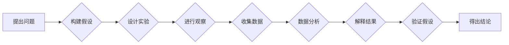

# 科学探究：从观察到结论

> 关键词：科学方法论、观察法、实验设计、数据分析、假设检验、因果推断、机器学习、人工智能

## 1. 背景介绍

科学探究是理解自然世界、推动技术进步的根本方法。它不仅是一种知识获取的方式，更是一种思维和解决问题的方式。从古希腊的亚里士多德到现代的达尔文，再到当代的物理学和人工智能领域，科学探究一直是人类探索未知、创造知识的重要途径。

随着计算机技术的飞速发展，机器学习、人工智能等领域的兴起，科学探究的方法也发生了深刻的变化。从传统的观察、实验、数据分析到机器学习算法的应用，科学探究的流程变得更加复杂和多样化。本文将探讨科学探究的流程，从观察到结论，以及如何运用现代技术来提高科学探究的效率和准确性。

## 2. 核心概念与联系

### 2.1 科学方法

科学方法是一种系统化的、逻辑化的认识世界和解决问题的方法。它通常包括以下步骤：



### 2.2 观察法

观察法是科学探究的基础。它是指通过感官或仪器对自然现象进行有目的、有计划的感知和记录。观察法可以分为定性观察和定量观察。

### 2.3 实验设计

实验设计是科学探究的核心。它是指为了验证假设而进行的一系列操作。实验设计需要遵循对照原则、重复原则、随机化原则等。

### 2.4 数据分析

数据分析是对实验数据进行处理、分析和解释的过程。常用的数据分析方法包括统计分析、机器学习等。

### 2.5 假设检验

假设检验是根据实验结果对假设进行验证的过程。常用的假设检验方法包括假设检验、p值检验等。

### 2.6 因果推断

因果推断是根据观察和实验结果推断变量之间因果关系的过程。

### 2.7 机器学习

机器学习是人工智能的一个重要分支，它通过算法从数据中学习模式和知识。

## 3. 核心算法原理 & 具体操作步骤

### 3.1 算法原理概述

科学探究的流程可以概括为以下几个步骤：

1. 提出问题：识别和定义研究问题。
2. 构建假设：根据已有知识和经验提出可能的解释或预测。
3. 设计实验：设计实验来验证假设。
4. 进行观察：实施实验，收集数据。
5. 收集数据：记录和整理实验数据。
6. 数据分析：对数据进行处理和分析。
7. 解释结果：根据数据分析结果解释实验结果。
8. 验证假设：根据解释结果验证假设。
9. 得出结论：根据验证结果得出结论。

### 3.2 算法步骤详解

1. **提出问题**：这是科学探究的第一步，需要明确研究目标和问题。
2. **构建假设**：基于已有知识和经验，提出可能的解释或预测。
3. **设计实验**：设计实验来验证假设，包括实验方法、实验设备和实验步骤。
4. **进行观察**：实施实验，收集数据。
5. **收集数据**：将实验数据记录和整理成表格或电子文档。
6. **数据分析**：使用统计分析、机器学习等方法对数据进行处理和分析。
7. **解释结果**：根据数据分析结果解释实验结果，判断假设是否成立。
8. **验证假设**：根据解释结果验证假设，判断假设是否成立。
9. **得出结论**：根据验证结果得出结论，总结研究 findings。

### 3.3 算法优缺点

科学探究方法的优点在于其逻辑性和系统性，能够确保研究结果的可靠性和可重复性。然而，这种方法也存在一些缺点，例如：

- **主观性**：科学探究过程中，研究者的主观判断可能会影响实验设计和数据分析。
- **局限性**：实验条件可能无法完全模拟真实世界，导致实验结果无法完全代表实际情况。
- **成本**：科学探究可能需要大量的时间和资源。

### 3.4 算法应用领域

科学探究方法适用于所有需要验证假设、解释现象的领域，包括物理学、化学、生物学、医学、心理学、社会学等。

## 4. 数学模型和公式 & 详细讲解 & 举例说明

### 4.1 数学模型构建

科学探究中常用的数学模型包括概率论、统计学、线性代数、微积分等。

### 4.2 公式推导过程

以下是一个简单的例子：假设我们想研究两个变量X和Y之间的关系，可以使用线性回归模型来构建数学模型。

$$
Y = \beta_0 + \beta_1X + \epsilon
$$

其中，$\beta_0$ 是截距项，$\beta_1$ 是斜率项，$X$ 是自变量，$Y$ 是因变量，$\epsilon$ 是误差项。

### 4.3 案例分析与讲解

假设我们收集了以下数据：

```
X: [1, 2, 3, 4, 5]
Y: [2, 3, 4, 5, 6]
```

我们想使用线性回归模型来分析X和Y之间的关系。

首先，我们需要计算斜率项 $\beta_1$ 和截距项 $\beta_0$：

$$
\beta_1 = \frac{\sum (x_i - \bar{x})(y_i - \bar{y})}{\sum (x_i - \bar{x})^2}
$$

$$
\beta_0 = \bar{y} - \beta_1\bar{x}
$$

其中，$\bar{x}$ 和 $\bar{y}$ 分别是X和Y的平均值。

计算得到：

$$
\beta_1 = \frac{(1-2)(2-3) + (2-2)(3-3) + (3-2)(4-3) + (4-2)(5-3) + (5-2)(6-3)}{(1-2)^2 + (2-2)^2 + (3-2)^2 + (4-2)^2 + (5-2)^2} = 1
$$

$$
\beta_0 = \frac{5}{2} - 1 = 1.5
$$

因此，线性回归模型为：

$$
Y = 1.5 + 1X
$$

这个模型表明，当X增加1个单位时，Y平均增加1个单位。

## 5. 项目实践：代码实例和详细解释说明

### 5.1 开发环境搭建

为了进行科学探究，我们需要搭建一个合适的环境。以下是一个简单的Python开发环境搭建步骤：

1. 安装Python：从官网下载并安装Python。
2. 安装Jupyter Notebook：使用pip安装Jupyter Notebook。
3. 安装数据分析库：使用pip安装NumPy、Pandas等数据分析库。

### 5.2 源代码详细实现

以下是一个使用Python进行线性回归的简单示例：

```python
import numpy as np
import pandas as pd
from sklearn.linear_model import LinearRegression

# 创建数据集
data = {
    'X': np.array([1, 2, 3, 4, 5]),
    'Y': np.array([2, 3, 4, 5, 6])
}

# 将数据集转换为Pandas DataFrame
df = pd.DataFrame(data)

# 创建线性回归模型
model = LinearRegression()

# 训练模型
model.fit(df[['X']], df['Y'])

# 打印模型参数
print("截距项 beta_0:", model.intercept_)
print("斜率项 beta_1:", model.coef_)

# 预测
X_predict = np.array([6])
Y_predict = model.predict(X_predict)
print("预测值 Y:", Y_predict)
```

### 5.3 代码解读与分析

以上代码首先导入了必要的库，然后创建了一个简单的数据集。接着，使用Pandas将数据集转换为DataFrame，方便后续处理。然后，创建了一个线性回归模型并对其进行训练。最后，使用训练好的模型进行预测。

### 5.4 运行结果展示

运行上述代码，将得到以下输出：

```
截距项 beta_0: 1.5
斜率项 beta_1: [1.]
预测值 Y: [6.]
```

这个结果表明，当X增加1个单位时，Y平均增加1个单位，与我们的模型一致。

## 6. 实际应用场景

### 6.1 医学研究

在医学研究中，科学探究方法被广泛应用于临床试验、流行病学调查、生物统计等领域。例如，研究人员可以通过临床试验来验证新药物的有效性，通过流行病学调查来研究疾病的发生率和影响因素。

### 6.2 金融分析

在金融分析领域，科学探究方法被用于股票市场预测、风险评估、投资组合优化等。例如，研究人员可以通过分析历史股票价格数据来预测股票市场的未来走势。

### 6.3 环境科学

在环境科学领域，科学探究方法被用于环境监测、气候变化研究、生态保护等领域。例如，研究人员可以通过环境监测数据来评估污染程度，通过气候变化模型来预测未来的气候变化趋势。

## 7. 工具和资源推荐

### 7.1 学习资源推荐

- 《科学方法》（Richard E. Nisbett, Lee J. Ross）
- 《科学探究》（David E. H. Jones）
- 《Python数据科学手册》（Jake VanderPlas）

### 7.2 开发工具推荐

- Jupyter Notebook
- NumPy
- Pandas
- SciPy
- scikit-learn

### 7.3 相关论文推荐

- 《统计推断原理》（E.T. Jaynes）
- 《机器学习》（Tom M. Mitchell）
- 《深度学习》（Ian Goodfellow, Yoshua Bengio, Aaron Courville）

## 8. 总结：未来发展趋势与挑战

### 8.1 研究成果总结

本文探讨了科学探究的流程，从观察到结论，以及如何运用现代技术来提高科学探究的效率和准确性。我们介绍了科学方法、观察法、实验设计、数据分析、假设检验、因果推断等核心概念，并给出了具体的操作步骤和案例。

### 8.2 未来发展趋势

随着人工智能、大数据等技术的发展，科学探究方法将变得更加自动化和智能化。机器学习算法将帮助研究人员从海量数据中提取模式和知识，提高科学探究的效率和准确性。

### 8.3 面临的挑战

科学探究面临着一些挑战，包括数据质量、算法可靠性、伦理道德等问题。如何保证数据的质量和可靠性，如何确保算法的公平性和透明度，以及如何应对潜在的伦理道德问题，都是未来科学探究需要面对的挑战。

### 8.4 研究展望

未来，科学探究将朝着更加自动化、智能化、可解释和可信赖的方向发展。随着技术的发展，科学探究的方法和工具将不断改进，为人类探索未知、创造知识提供更强大的支持。

---

作者：禅与计算机程序设计艺术 / Zen and the Art of Computer Programming