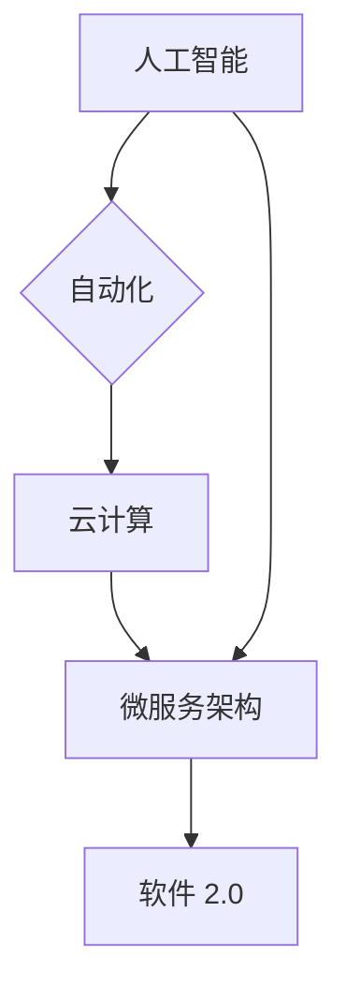

## 软件 2.0 的价值：提升效率、创造价值

> 关键词：软件 2.0,人工智能,自动化,效率提升,价值创造,机器学习,深度学习,云计算

### 1. 背景介绍

软件已经深刻地改变了我们的生活，从智能手机到自动驾驶汽车，再到医疗诊断和金融交易，软件无处不在。然而，传统的软件开发模式面临着越来越多的挑战：

* **开发周期长:** 软件开发周期漫长，从需求分析到测试部署往往需要数月甚至数年，难以满足快速变化的市场需求。
* **维护成本高:** 软件的维护成本不断上升，随着软件功能的复杂化和规模化，修复bug、升级功能和安全更新都需要大量的人力和时间投入。
* **缺乏灵活性:** 传统软件难以适应不断变化的环境和用户需求，需要重新开发才能实现功能更新或个性化定制。

这些挑战催生了软件 2.0 的概念。软件 2.0 旨在通过人工智能、自动化和云计算等新技术，构建更加智能、高效、灵活的软件系统。

### 2. 核心概念与联系

软件 2.0 的核心概念包括：

* **人工智能 (AI):**  AI 赋予软件智能化能力，使其能够学习、推理和决策，从而实现更智能的自动化和个性化服务。
* **自动化:** 自动化技术可以将重复性任务自动化，提高开发效率和降低人工成本。
* **云计算:** 云计算提供弹性、可扩展的计算资源，支持软件的快速部署和规模化扩展。
* **微服务架构:** 微服务架构将大型软件系统分解成多个小型、独立的服务，提高系统的可维护性和扩展性。

这些概念相互关联，共同构成了软件 2.0 的基础架构。



### 3. 核心算法原理 & 具体操作步骤

#### 3.1  算法原理概述

软件 2.0 的核心算法主要包括机器学习、深度学习和自然语言处理等。

* **机器学习:**  机器学习算法通过训练数据学习模式和规律，从而能够对新数据进行预测和分类。
* **深度学习:** 深度学习是机器学习的一种高级形式，它使用多层神经网络来模拟人类大脑的学习过程，能够处理更复杂的数据和任务。
* **自然语言处理:** 自然语言处理算法能够理解和处理人类语言，例如文本分析、机器翻译和语音识别。

#### 3.2  算法步骤详解

以机器学习算法为例，其基本步骤包括：

1. **数据收集和预处理:** 收集相关数据并进行清洗、转换和特征提取。
2. **模型选择:** 根据任务需求选择合适的机器学习算法模型。
3. **模型训练:** 使用训练数据训练模型参数，使其能够学习数据中的模式和规律。
4. **模型评估:** 使用测试数据评估模型的性能，例如准确率、召回率和F1-score。
5. **模型部署:** 将训练好的模型部署到实际应用场景中，用于预测和分类新数据。

#### 3.3  算法优缺点

**优点:**

* **自动化决策:**  算法能够自动学习和决策，提高效率和准确性。
* **个性化服务:** 算法可以根据用户数据提供个性化的服务和体验。
* **数据驱动:** 算法基于数据进行决策，更加客观和科学。

**缺点:**

* **数据依赖:** 算法的性能依赖于训练数据的质量和数量。
* **黑盒效应:** 一些算法的决策过程难以解释，难以理解其背后的逻辑。
* **伦理问题:**  算法可能存在偏见和歧视，需要谨慎使用和监管。

#### 3.4  算法应用领域

机器学习、深度学习和自然语言处理算法广泛应用于各个领域，例如：

* **医疗保健:** 疾病诊断、药物研发、个性化治疗。
* **金融服务:** 风险评估、欺诈检测、投资决策。
* **电商:** 商品推荐、客户服务、价格优化。
* **交通运输:** 自动驾驶、交通流量预测、物流优化。

### 4. 数学模型和公式 & 详细讲解 & 举例说明

#### 4.1  数学模型构建

机器学习算法通常使用数学模型来表示数据之间的关系。例如，线性回归模型使用线性方程来预测连续变量的值：

$$y = mx + c$$

其中，y 是预测值，x 是输入变量，m 是斜率，c 是截距。

#### 4.2  公式推导过程

模型参数的学习过程通常使用梯度下降算法。梯度下降算法通过不断调整模型参数，使模型预测值与实际值之间的误差最小化。

梯度下降公式如下：

$$w = w - \alpha \frac{\partial Loss(w)}{\partial w}$$

其中，w 是模型参数，α 是学习率，Loss(w) 是损失函数，表示模型预测值与实际值之间的误差。

#### 4.3  案例分析与讲解

例如，假设我们使用线性回归模型预测房价。输入变量包括房屋面积、房间数量和地理位置等。

通过训练数据，模型会学习到房价与这些变量之间的关系，并得到相应的参数m和c。

然后，我们可以使用这个模型预测新房子的价格。

### 5. 项目实践：代码实例和详细解释说明

#### 5.1  开发环境搭建

* Python 3.x
* TensorFlow 或 PyTorch 等深度学习框架
* Jupyter Notebook 或 VS Code 等代码编辑器

#### 5.2  源代码详细实现

```python
import tensorflow as tf

# 定义模型
model = tf.keras.models.Sequential([
  tf.keras.layers.Dense(64, activation='relu', input_shape=(3,)),
  tf.keras.layers.Dense(1)
])

# 编译模型
model.compile(optimizer='adam', loss='mse')

# 训练模型
model.fit(X_train, y_train, epochs=10)

# 评估模型
loss = model.evaluate(X_test, y_test)
```

#### 5.3  代码解读与分析

* 首先，我们使用 TensorFlow 库定义了一个简单的线性回归模型。
* 模型包含两层神经网络，第一层有64个神经元，使用ReLU激活函数，输入形状为3。
* 第二层只有一个神经元，用于预测房价。
* 然后，我们使用Adam优化器和均方误差损失函数编译模型。
* 接着，我们使用训练数据训练模型10个epochs。
* 最后，我们使用测试数据评估模型的性能。

#### 5.4  运行结果展示

训练完成后，我们可以使用模型预测新房子的价格。

### 6. 实际应用场景

软件 2.0 的应用场景非常广泛，例如：

* **智能客服:** 使用自然语言处理技术，自动回复用户咨询，提高客服效率。
* **个性化推荐:** 使用机器学习算法，根据用户行为和偏好，推荐个性化的商品或服务。
* **自动驾驶:** 使用深度学习算法，训练车辆识别道路、障碍物和交通信号，实现自动驾驶功能。

### 6.4  未来应用展望

软件 2.0 的未来发展趋势包括：

* **更智能的算法:**  开发更智能、更强大的机器学习和深度学习算法，能够处理更复杂的数据和任务。
* **更广泛的应用:**  软件 2.0 将应用于更多领域，例如教育、医疗保健、农业等。
* **更安全的系统:**  开发更安全的软件系统，防止数据泄露和恶意攻击。

### 7. 工具和资源推荐

#### 7.1  学习资源推荐

* **在线课程:** Coursera, edX, Udacity 等平台提供机器学习、深度学习和自然语言处理等课程。
* **书籍:** 《深度学习》、《机器学习实战》等书籍。
* **开源项目:** TensorFlow, PyTorch, scikit-learn 等开源项目。

#### 7.2  开发工具推荐

* **Python:**  机器学习和深度学习的常用编程语言。
* **Jupyter Notebook:**  交互式代码编辑器，方便进行机器学习实验和原型开发。
* **VS Code:**  功能强大的代码编辑器，支持多种编程语言和插件。

#### 7.3  相关论文推荐

* **《ImageNet Classification with Deep Convolutional Neural Networks》**
* **《Attention Is All You Need》**
* **《BERT: Pre-training of Deep Bidirectional Transformers for Language Understanding》**

### 8. 总结：未来发展趋势与挑战

#### 8.1  研究成果总结

软件 2.0 的研究取得了显著成果，人工智能、自动化和云计算等新技术为软件开发带来了革命性的变革。

#### 8.2  未来发展趋势

软件 2.0 将朝着更智能、更安全、更可扩展的方向发展，并应用于更多领域。

#### 8.3  面临的挑战

软件 2.0 的发展也面临着一些挑战，例如算法的解释性、数据安全和伦理问题等。

#### 8.4  研究展望

未来，我们需要继续研究更智能、更安全、更可解释的软件 2.0 算法，并制定相应的规范和标准，确保软件 2.0 的健康发展。

### 9. 附录：常见问题与解答

* **什么是软件 2.0?**

软件 2.0 是一种利用人工智能、自动化和云计算等新技术构建更加智能、高效、灵活的软件系统。

* **软件 2.0 的优势是什么?**

软件 2.0 可以提高开发效率、降低维护成本、增强软件的智能化和灵活性。

* **软件 2.0 的应用场景有哪些?**

软件 2.0 应用于各个领域，例如智能客服、个性化推荐、自动驾驶等。

* **如何学习软件 2.0 的相关知识?**

可以通过在线课程、书籍、开源项目等方式学习软件 2.0 的相关知识。


作者：禅与计算机程序设计艺术 / Zen and the Art of Computer Programming 
