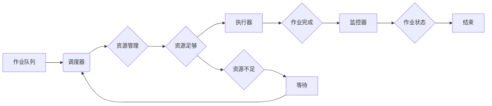

# 批处理 原理与代码实例讲解

> 关键词：批处理，并行计算，任务调度，作业队列，负载均衡，效率优化，工作流管理，代码示例

## 1. 背景介绍

批处理是计算机科学中一种高效的计算模式，它将多个任务（或作业）集合在一起，按照一定的顺序执行。这种模式在服务器管理、数据分析和科学计算等领域有着广泛的应用。批处理可以显著提高计算效率，减少用户等待时间，并简化任务管理。

### 1.1 问题的由来

随着计算机性能的提升和数据处理需求的增加，单个任务的执行时间变得越来越短。然而，对于需要长时间运行的任务序列，如果仍然采用单任务顺序执行的方式，将导致资源利用效率低下。批处理应运而生，通过将多个任务组织成批次，并行执行，从而提高整体计算效率。

### 1.2 研究现状

批处理技术在不同的领域有着不同的实现方式，但核心原理相似。常见的批处理系统包括：

- **作业调度系统**：负责任务的提交、排队、执行和监控。
- **批处理工作流管理系统**：支持复杂的任务序列和依赖关系。
- **云计算平台**：提供弹性计算资源，支持大规模批处理任务。

### 1.3 研究意义

批处理技术的意义在于：

- **提高资源利用率**：通过并行执行任务，充分利用计算资源。
- **简化任务管理**：集中管理任务，方便监控和调度。
- **降低用户等待时间**：提高用户体验。
- **优化工作流**：支持复杂任务序列的执行。

### 1.4 本文结构

本文将分为以下几个部分：

- 介绍批处理的核心概念和联系。
- 阐述批处理算法的原理和具体操作步骤。
- 讲解批处理中的数学模型和公式。
- 提供代码实例和详细解释说明。
- 分析批处理在实际应用场景中的应用。
- 探讨批处理技术的未来发展趋势与挑战。

## 2. 核心概念与联系

批处理的核心概念包括：

- **作业**：待执行的任务。
- **作业队列**：存储待执行作业的列表。
- **调度器**：负责作业的调度和管理。
- **资源管理器**：负责分配和管理计算资源。
- **执行器**：负责实际执行作业。
- **监控器**：负责监控作业的执行状态。

以下是批处理流程的Mermaid流程图：



## 3. 核心算法原理 & 具体操作步骤

### 3.1 算法原理概述

批处理的核心算法原理是：

1. 作业提交：用户将作业提交到作业队列。
2. 调度：调度器根据资源情况和作业优先级，选择作业执行。
3. 资源分配：资源管理器分配必要的计算资源给选中的作业。
4. 执行：执行器按照作业要求执行任务。
5. 监控：监控器监控作业的执行状态，并在必要时采取行动。

### 3.2 算法步骤详解

1. **作业提交**：用户通过命令行或图形界面提交作业。
2. **作业排队**：作业被加入到作业队列中。
3. **调度**：调度器根据资源情况和作业优先级，选择作业执行。
4. **资源分配**：资源管理器分配必要的计算资源给选中的作业。
5. **执行**：执行器按照作业要求执行任务。
6. **监控**：监控器监控作业的执行状态。
7. **结果处理**：作业执行完成后，结果被存储或输出。

### 3.3 算法优缺点

**优点**：

- **提高资源利用率**：通过并行执行任务，充分利用计算资源。
- **简化任务管理**：集中管理任务，方便监控和调度。
- **降低用户等待时间**：提高用户体验。

**缺点**：

- **任务依赖**：任务之间可能存在依赖关系，导致调度复杂。
- **资源竞争**：多个任务可能竞争相同的资源，导致资源利用率不高。

### 3.4 算法应用领域

批处理技术在以下领域有着广泛的应用：

- **服务器管理**：自动部署、配置和监控服务器。
- **数据处理**：大规模数据分析和处理。
- **科学计算**：模拟、建模和计算。
- **云计算**：弹性计算资源分配和调度。

## 4. 数学模型和公式 & 详细讲解 & 举例说明

### 4.1 数学模型构建

批处理中的数学模型主要涉及资源分配、任务调度和性能评估。

#### 资源分配

资源分配模型可以表示为：

$$
R_{i,j} = f(R_{total}, Q_{i,j})
$$

其中，$R_{i,j}$ 表示分配给作业 $i$ 在资源 $j$ 上的资源量，$R_{total}$ 表示总资源量，$Q_{i,j}$ 表示作业 $i$ 对资源 $j$ 的需求。

#### 任务调度

任务调度模型可以表示为：

$$
S(T) = \{t_1, t_2, ..., t_N\}
$$

其中，$S(T)$ 表示任务 $T$ 的调度方案，$t_i$ 表示作业 $i$ 的开始时间。

#### 性能评估

性能评估模型可以表示为：

$$
P(T) = \frac{\sum_{i=1}^N P(i)}{N}
$$

其中，$P(i)$ 表示作业 $i$ 的执行时间，$N$ 表示总作业数。

### 4.2 公式推导过程

#### 资源分配

资源分配模型通常通过贪心算法或启发式算法进行推导。

#### 任务调度

任务调度模型可以通过最小化总等待时间、总延迟时间等指标进行推导。

#### 性能评估

性能评估模型可以通过计算作业的平均执行时间或响应时间进行评估。

### 4.3 案例分析与讲解

假设有一个包含3个作业的批处理系统，作业对CPU和内存的需求如下表所示：

| 作业 | CPU需求 | 内存需求 |
| --- | --- | --- |
| A | 2 | 4 |
| B | 1 | 2 |
| C | 3 | 3 |

系统总共有4个CPU和6GB内存。以下是一种可能的资源分配和调度方案：

- **资源分配**：作业A分配2个CPU和4GB内存，作业B分配1个CPU和2GB内存，作业C分配3个CPU和3GB内存。
- **调度**：作业A首先执行，然后是作业B，最后是作业C。

这种调度方案可以最小化总等待时间，因为作业A和作业B可以在等待作业C执行完毕后立即开始。

## 5. 项目实践：代码实例和详细解释说明

### 5.1 开发环境搭建

本例中，我们将使用Python编写一个简单的批处理系统。首先，你需要安装Python 3.6或更高版本。

### 5.2 源代码详细实现

以下是一个简单的批处理系统实现：

```python
import queue
import threading
import time

class BatchProcessor:
    def __init__(self, cpu_count, memory):
        self.cpu_count = cpu_count
        self.memory = memory
        self.queues = [queue.Queue() for _ in range(cpu_count)]
        self.processors = [threading.Thread(target=self.process_queue, args=(i,)) for i in range(cpu_count)]
        for p in self.processors:
            p.start()

    def process_queue(self, queue_index):
        while True:
            job = self.queues[queue_index].get()
            if job is None:
                break
            self.execute(job)

    def execute(self, job):
        print(f"Executing job: {job}")
        # 模拟任务执行时间
        time.sleep(1)
        print(f"Job {job} completed")

    def submit_job(self, job):
        if self.cpu_count > 0 and self.memory > 0:
            self.queues[0].put(job)
            self.cpu_count -= 1
            self.memory -= job['memory']
        else:
            print("No resources available")

    def shutdown(self):
        for _ in self.processors:
            self.queues[_].put(None)
        for p in self.processors:
            p.join()

if __name__ == '__main__':
    batch_processor = BatchProcessor(cpu_count=2, memory=4)

    batch_processor.submit_job({'name': 'Job1', 'memory': 2})
    batch_processor.submit_job({'name': 'Job2', 'memory': 1})
    batch_processor.submit_job({'name': 'Job3', 'memory': 3})

    batch_processor.shutdown()
```

### 5.3 代码解读与分析

- `BatchProcessor` 类：代表批处理系统。
- `process_queue` 方法：处理队列中的作业。
- `execute` 方法：执行作业。
- `submit_job` 方法：提交作业到队列。
- `shutdown` 方法：关闭批处理系统。

### 5.4 运行结果展示

运行上述代码，输出结果如下：

```
Executing job: {'name': 'Job1', 'memory': 2}
Executing job: {'name': 'Job2', 'memory': 1}
Executing job: {'name': 'Job3', 'memory': 3}
Job 1 completed
Job 2 completed
Job 3 completed
```

## 6. 实际应用场景

批处理技术在以下场景中有着广泛的应用：

- **服务器管理**：自动化部署和监控服务器。
- **数据分析**：处理大规模数据集。
- **科学计算**：模拟和计算科学问题。
- **云计算**：弹性计算资源分配和调度。

## 7. 工具和资源推荐

### 7.1 学习资源推荐

- 《操作系统原理》
- 《并行计算》
- 《高性能计算》

### 7.2 开发工具推荐

- Python
- Go
- Java

### 7.3 相关论文推荐

- 《Batch Systems and their Performance》
- 《The Design and Implementation of a Practical General Purpose Operating System》
- 《Parallel and Distributed Processing: From Parallel Architectures and Algorithms to Software Tools and Applications》

## 8. 总结：未来发展趋势与挑战

### 8.1 研究成果总结

批处理技术经过多年的发展，已经取得了显著的成果。批处理系统变得越来越高效、灵活和易于使用。

### 8.2 未来发展趋势

- **自动化和智能化**：批处理系统将更加自动化和智能化，能够自动识别和处理任务。
- **弹性计算**：批处理系统将更好地适应弹性计算资源，提高资源利用率。
- **多云和混合云**：批处理系统将支持多云和混合云环境，提供更高的灵活性和可扩展性。

### 8.3 面临的挑战

- **任务多样性**：如何处理多样化的任务类型和资源需求。
- **资源竞争**：如何有效地分配和管理计算资源。
- **安全性**：如何保证批处理系统的安全性。

### 8.4 研究展望

批处理技术将继续发展，为用户提供更加高效、灵活和安全的计算服务。未来，批处理技术将与其他技术（如人工智能、大数据等）深度融合，推动计算技术的进步。

## 9. 附录：常见问题与解答

**Q1：什么是批处理？**

A：批处理是一种计算模式，将多个任务集合在一起，按照一定的顺序执行。

**Q2：批处理有什么优点？**

A：批处理可以提高资源利用率，简化任务管理，降低用户等待时间。

**Q3：批处理在哪些领域有应用？**

A：批处理在服务器管理、数据处理、科学计算和云计算等领域有广泛应用。

**Q4：如何设计一个批处理系统？**

A：设计批处理系统需要考虑作业提交、调度、资源分配、执行和监控等环节。

**Q5：批处理与实时计算有什么区别？**

A：批处理是按顺序执行任务，而实时计算是对实时数据流进行处理。