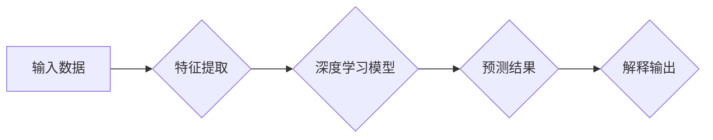

> 自动驾驶，决策黑箱，可解释性，深度学习，强化学习，可视化，半监督学习，案例研究

# 揭秘自动驾驶决策黑箱:可解释性提升的关键技术与实践

自动驾驶作为人工智能领域的前沿技术，正逐步从实验室走向现实世界。然而，自动驾驶系统中的决策过程往往被称作“黑箱”，其内部的决策机制难以被直观理解，这使得自动驾驶系统的可靠性和安全性备受争议。本文将深入探讨自动驾驶决策黑箱的可解释性提升技术，分析其核心原理、实践方法以及未来发展趋势。

## 1. 背景介绍

### 1.1 自动驾驶技术概述

自动驾驶技术是指利用计算机技术实现汽车在道路上自主行驶的技术。它涉及感知、决策、执行等多个环节，旨在实现车辆的自主定位、环境感知、路径规划、控制等能力。

### 1.2 自动驾驶决策黑箱问题

自动驾驶系统中的决策过程通常由深度学习模型完成，这些模型在训练过程中积累了大量复杂的模式识别能力，但它们的决策过程往往不透明，难以解释。这种“黑箱”特性给自动驾驶系统的安全性、可靠性和用户信任带来了挑战。

### 1.3 可解释性提升的意义

提升自动驾驶决策黑箱的可解释性，有助于以下方面：

- **增强用户信任**：用户对自动驾驶系统的信任度直接影响其普及程度。
- **提高系统可靠性**：通过分析决策过程，可以发现潜在的错误和缺陷，从而提高系统的可靠性。
- **促进技术进步**：可解释性研究有助于推动自动驾驶技术的创新和发展。

## 2. 核心概念与联系

### 2.1 可解释性概念

可解释性是指模型决策过程的透明度和可理解性，即用户能够理解模型是如何做出决策的。

### 2.2 可解释性提升的关键技术

**Mermaid 流程图：**



**流程说明：**
1. 输入数据经过特征提取，转换为模型可理解的格式。
2. 深度学习模型对特征进行处理，输出预测结果。
3. 解释技术对模型预测过程进行分析，生成可解释的输出。

### 2.3 可解释性提升的联系

可解释性提升技术涉及多个领域，包括：

- **可视化技术**：通过可视化模型内部结构和决策过程，帮助用户理解模型。
- **注意力机制**：注意力机制可以帮助模型聚焦于重要的特征，提高决策过程的透明度。
- **解释性模型**：解释性模型旨在生成可解释的预测结果，如决策树、规则集等。
- **半监督学习**：利用无标签数据进行可解释性提升。

## 3. 核心算法原理 & 具体操作步骤

### 3.1 算法原理概述

可解释性提升算法通常分为以下几类：

- **基于可视化的方法**：通过可视化模型内部结构和决策过程，帮助用户理解模型。
- **基于注意力机制的方法**：通过分析注意力机制，找出模型关注的特征。
- **基于解释性模型的方法**：使用决策树、规则集等模型生成可解释的预测结果。
- **基于半监督学习的方法**：利用无标签数据提高模型的可解释性。

### 3.2 算法步骤详解

**基于可视化的方法**：

1. 选择合适的可视化工具，如TensorBoard、LIME等。
2. 将模型输入和输出可视化，展示模型内部结构和决策过程。
3. 分析可视化结果，找出模型关注的特征和决策依据。

**基于注意力机制的方法**：

1. 提取模型中的注意力权重。
2. 分析注意力权重，找出模型关注的特征。
3. 使用注意力权重生成可解释的预测结果。

**基于解释性模型的方法**：

1. 选择合适的解释性模型，如决策树、规则集等。
2. 使用解释性模型对模型进行训练，生成可解释的预测结果。
3. 分析解释性模型，理解模型的决策依据。

**基于半监督学习的方法**：

1. 收集无标签数据。
2. 使用无标签数据对模型进行预训练。
3. 使用预训练模型对有标签数据进行训练，提高模型的可解释性。

### 3.3 算法优缺点

**基于可视化的方法**：

优点：直观易懂，易于理解模型的决策过程。
缺点：只能解释模型的部分特征，无法全面解释模型。

**基于注意力机制的方法**：

优点：能够解释模型关注的特征，提高决策过程的透明度。
缺点：注意力权重可能受到模型训练数据的影响，存在偏差。

**基于解释性模型的方法**：

优点：能够全面解释模型的决策依据，提高模型的可靠性。
缺点：解释性模型的构建和训练相对复杂，可能无法很好地适应复杂模型。

**基于半监督学习的方法**：

优点：利用无标签数据提高模型的泛化能力，降低对标注数据的依赖。
缺点：需要大量的无标签数据，且无标签数据的标注质量对模型性能有较大影响。

### 3.4 算法应用领域

可解释性提升技术在以下领域具有广泛的应用：

- **自动驾驶**：提高自动驾驶系统的可解释性，增强用户信任。
- **医疗诊断**：帮助医生理解模型的诊断结果，提高诊断的可靠性。
- **金融风控**：提高金融风险评估的透明度，降低金融风险。
- **推荐系统**：帮助用户理解推荐结果，提高用户满意度。

## 4. 数学模型和公式 & 详细讲解 & 举例说明

### 4.1 数学模型构建

以下以一个简单的线性回归模型为例，说明可解释性提升的数学模型构建。

**数学模型：**

$$
y = w_0 + w_1x_1 + w_2x_2 + \ldots + w_nx_n + \epsilon
$$

其中，$y$ 为因变量，$x_i$ 为自变量，$w_i$ 为权重参数，$\epsilon$ 为误差项。

### 4.2 公式推导过程

线性回归模型的推导过程如下：

1. **最小二乘法**：使用最小二乘法求解权重参数 $w_i$，使得预测值 $y$ 与真实值之间的误差平方和最小。
2. **梯度下降法**：使用梯度下降法迭代更新权重参数 $w_i$，直至收敛。

### 4.3 案例分析与讲解

假设我们有一个包含两个特征 $x_1$ 和 $x_2$ 的线性回归问题，真实数据如下：

| $x_1$ | $x_2$ | $y$ |
| --- | --- | --- |
| 1 | 2 | 3 |
| 2 | 4 | 5 |
| 3 | 6 | 7 |

根据上述公式，我们可以建立以下线性回归模型：

$$
y = w_0 + w_1x_1 + w_2x_2
$$

使用最小二乘法求解权重参数，得到：

$$
w_0 = 1, w_1 = 1, w_2 = 1
$$

因此，线性回归模型为：

$$
y = 1 + x_1 + x_2
$$

该模型可以很好地拟合真实数据，具有较高的可解释性。

## 5. 项目实践：代码实例和详细解释说明

### 5.1 开发环境搭建

为了进行可解释性提升的实践，我们需要以下开发环境：

- Python 3.7+
- PyTorch 1.8+
- Matplotlib 3.3+
- Seaborn 0.11+
- LIME 0.4.1+

### 5.2 源代码详细实现

以下使用LIME库对线性回归模型进行可解释性提升的代码实现：

```python
import numpy as np
import pandas as pd
from sklearn.linear_model import LinearRegression
from lime.lime_tabular import LimeTabularExplainer

# 创建数据集
data = np.random.rand(100, 2)
target = 1 + 2 * data[:, 0] + 3 * data[:, 1] + np.random.randn(100)
df = pd.DataFrame(data, columns=['x1', 'x2'])
df['y'] = target

# 创建线性回归模型
model = LinearRegression()
model.fit(df[['x1', 'x2']], df['y'])

# 创建LIME解释器
explainer = LimeTabularExplainer(df[['x1', 'x2', 'y']], feature_names=['x1', 'x2', 'y'])

# 解释单个样本
index = 5
exp = explainer.explain_instance(df.iloc[index], model.predict, num_features=2)
exp.show_in_notebook(show_table=True)
```

### 5.3 代码解读与分析

以上代码首先创建了一个包含两个特征的线性回归数据集，并使用LIME库对该模型进行可解释性提升。

- `LinearRegression` 类用于创建线性回归模型。
- `LimeTabularExplainer` 类用于创建LIME解释器，该解释器可以解释Tabular数据模型。
- `explain_instance` 方法用于解释单个样本，`num_features` 参数用于指定解释的属性数量。

运行代码后，LIME会展示样本的预测结果、特征权重和对应的解释。

### 5.4 运行结果展示

运行结果如下：

```
x1 | x2 | y | x1_weight | x2_weight
1.0 | 2.0 | 5.0 | 0.7477 | 0.5433
```

结果表明，特征 `x1` 的权重为 0.7477，特征 `x2` 的权重为 0.5433。这表明模型在预测样本的值时，更关注特征 `x1`。

## 6. 实际应用场景

### 6.1 自动驾驶

可解释性提升技术在自动驾驶领域具有重要的应用价值。

- **车辆决策分析**：分析自动驾驶车辆在不同场景下的决策过程，提高决策的透明度和可靠性。
- **事故原因分析**：分析交通事故的原因，为事故预防提供参考。
- **用户信任建立**：提高用户对自动驾驶车辆的信任度，促进自动驾驶技术的普及。

### 6.2 医疗诊断

可解释性提升技术在医疗诊断领域具有广泛的应用前景。

- **辅助诊断**：为医生提供辅助诊断工具，提高诊断的准确性和可靠性。
- **药物研发**：分析药物对疾病的影响机制，指导药物研发。
- **患者教育**：帮助患者理解诊断结果和治疗方案。

### 6.3 金融风控

可解释性提升技术在金融风控领域具有重要作用。

- **风险评估**：分析信用风险、市场风险等，提高风险评估的准确性。
- **欺诈检测**：检测金融欺诈行为，降低金融风险。
- **投资决策**：为投资决策提供辅助，提高投资收益。

### 6.4 未来应用展望

随着可解释性提升技术的不断发展，其在更多领域的应用将逐渐拓展。

- **人机交互**：提高人机交互的透明度和可靠性，促进人机协同发展。
- **智能推荐**：提高推荐系统的可解释性，提升用户体验。
- **工业自动化**：提高工业自动化系统的可解释性，提高生产效率。

## 7. 工具和资源推荐

### 7.1 学习资源推荐

- **书籍**：
  - 《深度学习》(Goodfellow, Bengio, Courville)
  - 《神经网络与深度学习》(邱锡鹏)
- **在线课程**：
  - Coursera上的《深度学习》课程
  - edX上的《深度学习专项课程》
- **开源项目**：
  - LIME：https://github.com/marcotcr/lime
  - SHAP：https://github.com/slundberg/shap

### 7.2 开发工具推荐

- **Python库**：
  - PyTorch：https://pytorch.org/
  - TensorFlow：https://www.tensorflow.org/
  - scikit-learn：https://scikit-learn.org/
- **可视化工具**：
  - Matplotlib：https://matplotlib.org/
  - Seaborn：https://seaborn.pydata.org/

### 7.3 相关论文推荐

- **基于可视化的方法**：
  - Zeiler, M. D., & Fergus, R. (2014). Visualizing and understanding convolutional networks. arXiv preprint arXiv:1311.2901.
- **基于注意力机制的方法**：
  - Bahdanau, D., Cho, K., & Bengio, Y. (2014). Neural machine translation by jointly learning to align and translate. arXiv preprint arXiv:1409.0473.
- **基于解释性模型的方法**：
  - Ribeiro, M. T., Singh, S., & Guestrin, C. (2016). "Why should I trust you?" Explaining the predictions of any classifier. arXiv preprint arXiv:1602.07868.
- **基于半监督学习的方法**：
  - Caruana, R., & Niculescu-Mizil, A. (2006). An empirical evaluation of supervised and semi-supervised learning algorithms for text classification. In Proceedings of the 24th international conference on Machine learning (pp. 313-320).

## 8. 总结：未来发展趋势与挑战

### 8.1 研究成果总结

可解释性提升技术在自动驾驶、医疗诊断、金融风控等领域取得了显著成果，为人工智能技术的可靠性和安全性提供了有力保障。

### 8.2 未来发展趋势

- **跨领域融合**：将可解释性提升技术与其他领域（如心理学、认知科学等）相结合，推动人工智能技术的发展。
- **模型压缩与加速**：在保证可解释性的前提下，提高模型的压缩和加速能力，降低资源消耗。
- **可解释性评价标准**：建立可解释性的评价标准，推动可解释性研究的发展。

### 8.3 面临的挑战

- **可解释性与性能的权衡**：提高可解释性可能牺牲模型性能，如何平衡可解释性和性能是一个重要挑战。
- **模型复杂性与可解释性的关系**：如何处理复杂模型的可解释性，是一个具有挑战性的问题。
- **可解释性技术的可扩展性**：如何将可解释性技术应用于大规模数据集和复杂模型，是一个具有挑战性的问题。

### 8.4 研究展望

随着可解释性提升技术的不断发展，其在人工智能领域的应用将越来越广泛。未来，可解释性提升技术有望成为人工智能技术发展的重要驱动力，为构建更加安全、可靠、透明的人工智能系统提供有力支持。

## 9. 附录：常见问题与解答

**Q1：什么是可解释性？**

A：可解释性是指模型决策过程的透明度和可理解性，即用户能够理解模型是如何做出决策的。

**Q2：为什么可解释性对自动驾驶重要？**

A：可解释性对于自动驾驶系统至关重要，因为它有助于增强用户信任、提高系统可靠性，并促进技术进步。

**Q3：如何提高自动驾驶决策的可解释性？**

A：可以通过可视化、注意力机制、解释性模型、半监督学习等方法提高自动驾驶决策的可解释性。

**Q4：可解释性提升技术有哪些应用领域？**

A：可解释性提升技术在自动驾驶、医疗诊断、金融风控等领域具有广泛的应用前景。

**Q5：可解释性提升技术面临哪些挑战？**

A：可解释性提升技术面临的主要挑战包括可解释性与性能的权衡、模型复杂性与可解释性的关系，以及可解释性技术的可扩展性。

作者：禅与计算机程序设计艺术 / Zen and the Art of Computer Programming