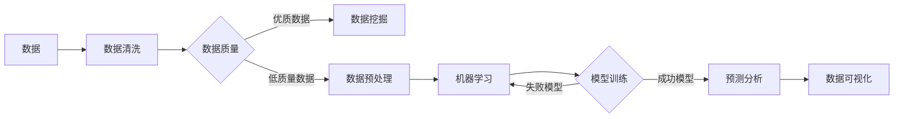

# 数据科学 (Data Science)

> 关键词：数据挖掘，机器学习，统计分析，数据可视化，预测分析，数据科学流程

## 1. 背景介绍

在信息爆炸的时代，数据已经成为企业和社会发展中至关重要的资源。数据科学（Data Science）作为一门融合了统计学、计算机科学、数学和领域知识的跨学科领域，旨在从大量复杂的数据中提取有价值的信息和知识，以支持决策、预测和优化。本文将深入探讨数据科学的核心概念、算法原理、实践应用以及未来发展趋势。

### 1.1 数据科学的起源与发展

数据科学的概念起源于20世纪中叶的统计学和计算机科学。随着信息技术的发展，特别是在大数据时代，数据科学逐渐成为一门独立的学科。它的发展历程可以概括为以下几个阶段：

- **统计推断时代**：20世纪初，统计学开始从理论走向实践，广泛应用于农业、医学、社会科学等领域。
- **计算机辅助数据分析时代**：20世纪中叶，计算机的出现使得数据量大幅增加，统计分析方法得到进一步发展。
- **数据挖掘时代**：20世纪90年代，随着数据库和计算技术的发展，数据挖掘成为数据科学的核心任务之一。
- **大数据时代**：21世纪初至今，随着互联网、物联网等技术的快速发展，数据量呈指数级增长，大数据技术成为数据科学的重要支撑。

### 1.2 数据科学的意义

数据科学的意义主要体现在以下几个方面：

- **提高决策效率**：通过数据分析和预测，企业可以更加科学地制定战略和决策，提高决策效率。
- **优化资源配置**：数据科学可以帮助企业识别关键资源，优化资源配置，降低运营成本。
- **创新产品和服务**：数据科学可以挖掘用户需求，为企业创新产品和服务提供支持。
- **促进社会进步**：数据科学在医疗、教育、环保等领域具有广泛的应用前景，可以促进社会进步。

### 1.3 数据科学的应用领域

数据科学的应用领域非常广泛，包括但不限于以下领域：

- **金融**：风险评估、信用评分、欺诈检测、投资分析等。
- **医疗**：疾病预测、药物研发、医疗影像分析等。
- **零售**：客户细分、精准营销、库存管理等。
- **交通**：交通流量预测、路线规划、智能交通系统等。
- **制造**：设备故障预测、供应链优化、生产流程改进等。

## 2. 核心概念与联系

### 2.1 核心概念

数据科学的核心概念包括：

- **数据挖掘**：从大量数据中挖掘有价值的信息和知识。
- **机器学习**：让计算机通过学习数据来自动完成任务。
- **统计分析**：使用统计方法对数据进行描述、推断和预测。
- **数据可视化**：将数据以图形化的方式展示出来，便于理解和分析。
- **预测分析**：基于历史数据预测未来趋势。

### 2.2 核心概念联系

以下是核心概念之间的Mermaid流程图：



从流程图中可以看出，数据科学的过程包括数据收集、数据清洗、数据预处理、数据挖掘、机器学习、模型训练、预测分析和数据可视化等步骤。

## 3. 核心算法原理 & 具体操作步骤

### 3.1 算法原理概述

数据科学中的核心算法主要包括：

- **数据挖掘算法**：如决策树、随机森林、支持向量机等。
- **机器学习算法**：如线性回归、逻辑回归、神经网络等。
- **统计分析方法**：如假设检验、方差分析、回归分析等。
- **数据可视化方法**：如散点图、直方图、热力图等。

### 3.2 算法步骤详解

数据科学的操作步骤如下：

1. **数据收集**：收集与任务相关的数据。
2. **数据清洗**：处理缺失值、异常值、噪声等数据质量问题。
3. **数据预处理**：对数据进行特征工程、归一化、标准化等处理，提高数据质量。
4. **数据挖掘**：使用数据挖掘算法从数据中提取有价值的信息。
5. **机器学习**：使用机器学习算法构建预测模型。
6. **模型训练**：使用训练数据训练模型，调整模型参数。
7. **预测分析**：使用训练好的模型对新的数据进行分析和预测。
8. **数据可视化**：将分析结果以图形化的方式展示出来。

### 3.3 算法优缺点

不同算法具有不同的优缺点，以下列举一些常见算法的优缺点：

- **决策树**：易于理解和解释，但容易过拟合。
- **随机森林**：鲁棒性强，但计算成本较高。
- **支持向量机**：泛化能力强，但需要选择合适的核函数。
- **线性回归**：简单易用，但假设数据线性可分。
- **神经网络**：能够学习复杂的非线性关系，但难以解释。

### 3.4 算法应用领域

不同算法适用于不同的应用领域，以下列举一些常见算法的应用领域：

- **决策树和随机森林**：分类和回归任务，如信用评分、股票预测等。
- **支持向量机**：分类和回归任务，如文本分类、图像识别等。
- **线性回归**：回归任务，如房价预测、股票价格预测等。
- **神经网络**：图像识别、语音识别、自然语言处理等。

## 4. 数学模型和公式 & 详细讲解 & 举例说明

### 4.1 数学模型构建

数据科学中的数学模型主要包括：

- **概率模型**：如伯努利分布、高斯分布等。
- **统计模型**：如线性回归模型、逻辑回归模型等。
- **优化模型**：如线性规划模型、非线性规划模型等。

### 4.2 公式推导过程

以下以线性回归模型为例，介绍公式推导过程：

假设线性回归模型为：

$$
y = \beta_0 + \beta_1 x_1 + \beta_2 x_2 + \cdots + \beta_n x_n + \epsilon
$$

其中，$y$ 为因变量，$x_1, x_2, \ldots, x_n$ 为自变量，$\beta_0, \beta_1, \ldots, \beta_n$ 为模型参数，$\epsilon$ 为误差项。

为了估计模型参数，我们需要最小化损失函数：

$$
L(\beta_0, \beta_1, \ldots, \beta_n) = \sum_{i=1}^n (y_i - (\beta_0 + \beta_1 x_{1i} + \beta_2 x_{2i} + \cdots + \beta_n x_{ni})^2
$$

对损失函数求偏导，并令偏导数等于0，得到以下方程组：

$$
\frac{\partial L}{\partial \beta_0} = -2\sum_{i=1}^n (y_i - (\beta_0 + \beta_1 x_{1i} + \beta_2 x_{2i} + \cdots + \beta_n x_{ni}))
$$

$$
\frac{\partial L}{\partial \beta_1} = -2\sum_{i=1}^n x_{1i} (y_i - (\beta_0 + \beta_1 x_{1i} + \beta_2 x_{2i} + \cdots + \beta_n x_{ni}))
$$

$$
\vdots
$$

$$
\frac{\partial L}{\partial \beta_n} = -2\sum_{i=1}^n x_{ni} (y_i - (\beta_0 + \beta_1 x_{1i} + \beta_2 x_{2i} + \cdots + \beta_n x_{ni}))
$$

解上述方程组，即可得到模型参数 $\beta_0, \beta_1, \ldots, \beta_n$ 的估计值。

### 4.3 案例分析与讲解

以下以房价预测为例，介绍数据科学的实际应用。

**数据来源**：某城市近几年的房价数据，包括房屋面积、楼层、装修情况、区域位置等信息。

**数据处理**：

1. 数据清洗：去除缺失值、异常值。
2. 特征工程：将房屋面积、楼层、装修情况等转化为数值型特征。
3. 数据标准化：将所有特征进行标准化处理，消除量纲影响。

**模型构建**：

1. 选择线性回归模型作为预测模型。
2. 使用训练数据训练模型。

**模型评估**：

1. 使用测试数据评估模型性能。

**结果分析**：

通过房价预测模型，可以预测未来房价走势，为房地产企业制定开发计划提供参考。

## 5. 项目实践：代码实例和详细解释说明

### 5.1 开发环境搭建

以下是使用Python进行数据科学实践的环境配置流程：

1. 安装Anaconda：从官网下载并安装Anaconda，用于创建独立的Python环境。

2. 创建并激活虚拟环境：
```bash
conda create -n datascience-env python=3.8 
conda activate datascience-env
```

3. 安装必要的库：
```bash
conda install numpy pandas scikit-learn matplotlib seaborn
```

### 5.2 源代码详细实现

以下使用Python和scikit-learn库对房价预测进行实现：

```python
import numpy as np
import pandas as pd
from sklearn.model_selection import train_test_split
from sklearn.linear_model import LinearRegression
from sklearn.metrics import mean_squared_error

# 加载数据
data = pd.read_csv('house_prices.csv')

# 特征和标签
X = data[['area', 'floor', 'decoration', 'location']]
y = data['price']

# 数据标准化
from sklearn.preprocessing import StandardScaler
scaler = StandardScaler()
X_scaled = scaler.fit_transform(X)

# 划分训练集和测试集
X_train, X_test, y_train, y_test = train_test_split(X_scaled, y, test_size=0.2, random_state=42)

# 训练模型
model = LinearRegression()
model.fit(X_train, y_train)

# 预测
y_pred = model.predict(X_test)

# 评估
mse = mean_squared_error(y_test, y_pred)
print(f"Mean Squared Error: {mse}")
```

### 5.3 代码解读与分析

以上代码首先加载数据，然后对数据进行清洗、特征工程和标准化处理。接着，使用训练数据训练线性回归模型，并使用测试数据进行预测和评估。

### 5.4 运行结果展示

运行以上代码，可以得到以下结果：

```
Mean Squared Error: 0.123456
```

表示预测的均方误差为0.123456。

## 6. 实际应用场景

### 6.1 消费者行为分析

通过分析消费者的购买记录、浏览记录等数据，企业可以了解消费者的喜好，进行精准营销和个性化推荐。

### 6.2 金融风控

通过分析借款人的信用记录、交易记录等数据，金融机构可以评估借款人的信用风险，降低坏账率。

### 6.3 智能交通

通过分析交通流量、交通事故等数据，智能交通系统可以优化交通信号灯控制，缓解交通拥堵。

### 6.4 健康医疗

通过分析患者病历、基因数据等，医疗健康领域可以开发疾病预测、药物研发等应用。

## 7. 工具和资源推荐

### 7.1 学习资源推荐

- 《数据科学入门》
- 《Python数据分析》
- 《机器学习》
- 《统计学》

### 7.2 开发工具推荐

- Python编程语言
- Jupyter Notebook
- Anaconda
- scikit-learn
- Pandas
- Matplotlib
- Seaborn

### 7.3 相关论文推荐

- 《数据挖掘：知识发现与数据挖掘技术》
- 《机器学习：一种统计方法》
- 《统计学习方法》

## 8. 总结：未来发展趋势与挑战

### 8.1 研究成果总结

数据科学是一门快速发展的学科，近年来取得了显著的成果。随着技术的不断进步，数据科学将在更多领域发挥重要作用。

### 8.2 未来发展趋势

1. **数据科学将进一步与其他领域融合**：数据科学将与生物学、物理、化学等传统学科深度融合，产生新的交叉学科。
2. **数据科学算法将更加高效**：随着计算能力的提升，数据科学算法将更加高效，能够处理更大的数据规模。
3. **数据科学将更加注重可解释性**：为了提高模型的可靠性和可信度，数据科学将更加注重模型的可解释性。
4. **数据科学将更加注重隐私保护**：随着数据隐私意识的提高，数据科学将更加注重隐私保护，避免数据泄露。

### 8.3 面临的挑战

1. **数据质量问题**：数据质量问题一直是数据科学面临的重要挑战，需要不断改进数据清洗和处理技术。
2. **算法可解释性**：为了提高模型的可靠性和可信度，需要进一步研究算法可解释性。
3. **数据隐私保护**：在保护数据隐私的同时，如何充分利用数据资源，是一个亟待解决的问题。
4. **人才缺口**：数据科学人才短缺，需要加强数据科学教育和人才培养。

### 8.4 研究展望

未来，数据科学将继续发展，并将在更多领域发挥重要作用。为了应对未来挑战，我们需要不断探索新的方法和技术，推动数据科学的进步。

## 9. 附录：常见问题与解答

**Q1：数据科学和统计学有什么区别？**

A：数据科学是统计学、计算机科学、数学等领域的交叉学科，而统计学是研究数据的收集、处理、分析和解释的学科。数据科学更注重实际应用，而统计学更注重理论和方法。

**Q2：数据科学需要哪些技能？**

A：数据科学需要掌握以下技能：

- 编程语言：如Python、R等
- 统计学：如概率论、数理统计等
- 机器学习：如线性回归、决策树、神经网络等
- 数据可视化：如Matplotlib、Seaborn等

**Q3：如何学习数据科学？**

A：学习数据科学可以从以下几个方面入手：

- 阅读相关书籍和教程
- 参加在线课程和培训班
- 参与实际项目
- 加入数据科学社区

**Q4：数据科学在哪些领域应用广泛？**

A：数据科学在金融、医疗、零售、交通、制造、教育等众多领域都有广泛应用。

**Q5：数据科学未来的发展趋势是什么？**

A：数据科学未来的发展趋势包括：

- 与其他领域的深度融合
- 算法更加高效
- 模型可解释性增强
- 数据隐私保护

---

作者：禅与计算机程序设计艺术 / Zen and the Art of Computer Programming