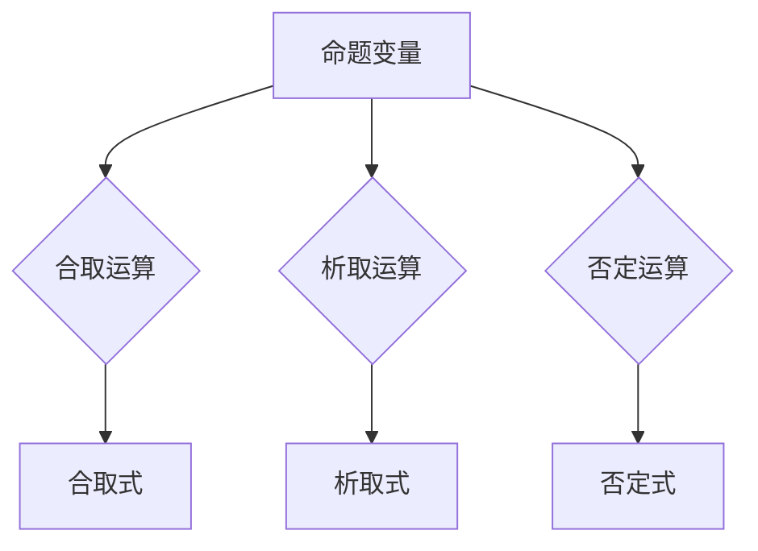

# 数理逻辑：P的重言式系统

> 关键词：数理逻辑，P系统，重言式，形式语言，逻辑演算，算法原理，应用领域

## 1. 背景介绍

数理逻辑是研究形式化推理的理论基础，它为计算机科学、人工智能、数学哲学等领域提供了强有力的工具。在数理逻辑中，P系统是研究命题演算的一种形式化方法，它通过定义一组公理和推理规则来研究命题的真值。P的重言式系统是P系统的一个子集，它专注于研究那些在任何情况下都为真的命题，即重言式。本文将深入探讨P的重言式系统的原理、算法和应用，旨在为读者提供对该领域全面而深入的理解。

## 2. 核心概念与联系

### 2.1 P系统的定义

P系统是一种基于命题演算的形式逻辑系统，它包含以下基本概念：

- **命题变量**：用字母表示的符号，如p, q, r等，表示命题的真假。
- **合取式**：由命题变量通过合取运算（用符号$\wedge$表示）连接而成的表达式，表示命题之间的逻辑与关系。
- **析取式**：由命题变量通过析取运算（用符号$\vee$表示）连接而成的表达式，表示命题之间的逻辑或关系。
- **否定式**：由否定运算（用符号$\neg$表示）作用于命题变量或合取式、析取式，表示命题的真假否定。

### 2.2 重言式的定义

重言式是指在任何情况下都为真的命题。在P系统框架下，一个命题是重言式，当且仅当它在任何赋值下都为真。

### 2.3 Mermaid 流程图

以下是一个简单的Mermaid流程图，展示了P系统的基本概念和逻辑运算：



## 3. 核心算法原理 & 具体操作步骤

### 3.1 算法原理概述

P的重言式系统通过以下步骤来确定一个命题是否为重言式：

1. **构造真值表**：为命题变量构建一个真值表，列出所有可能的赋值组合和对应的真值。
2. **应用推理规则**：使用逻辑推理规则，如合取律、析取律、德摩根定律等，简化命题表达式。
3. **评估真值**：根据真值表和推理规则，评估命题在所有赋值下的真值。

### 3.2 算法步骤详解

1. **输入命题表达式**：用户输入一个P系统的命题表达式。
2. **构建真值表**：为命题变量创建一个真值表，列出所有可能的赋值组合。
3. **应用推理规则**：对命题表达式进行简化，应用逻辑推理规则，如交换律、结合律、分配律等。
4. **评估真值**：根据简化后的表达式和真值表，评估命题在所有赋值下的真值。
5. **输出结果**：如果命题在所有赋值下都为真，则该命题是重言式；否则，它不是重言式。

### 3.3 算法优缺点

**优点**：

- **形式化**：P的重言式系统提供了一种形式化的方法来研究命题演算，有助于逻辑推理的精确性和一致性。
- **效率**：通过构建真值表和应用推理规则，可以快速评估命题的真假。

**缺点**：

- **计算复杂度**：对于复杂的命题表达式，构建真值表的计算复杂度可能非常高。
- **可扩展性**：当命题变量数量增加时，真值表的大小会呈指数级增长，难以管理。

### 3.4 算法应用领域

P的重言式系统在以下领域有广泛应用：

- **计算机科学**：用于验证程序的正确性，检查数据结构的完整性。
- **人工智能**：用于构建逻辑推理系统，支持决策支持系统。
- **数学哲学**：用于研究逻辑学的基本原理和概念。

## 4. 数学模型和公式 & 详细讲解 & 举例说明

### 4.1 数学模型构建

P的重言式系统的数学模型可以表示为：

$$
\text{P系统} = (\mathcal{V}, \mathcal{F}, \text{R})
$$

其中：

- $\mathcal{V}$：命题变量集合。
- $\mathcal{F}$：形式语言，包括合取式、析取式、否定式等。
- $\text{R}$：推理规则集合，用于简化命题表达式。

### 4.2 公式推导过程

以下是一个简单的例子，展示如何使用P系统来推导一个命题的重言式：

**命题**：$ p \vee \neg p $

**推导过程**：

1. 构建真值表：
| $p$ | $\neg p$ | $p \vee \neg p$ |
|-----|----------|-----------------|
| T   | F        | T               |
| F   | T        | T               |

2. 应用推理规则：
由于 $p \vee \neg p$ 在所有赋值下都为真，因此它是一个重言式。

### 4.3 案例分析与讲解

以下是一个更复杂的例子，展示如何使用P系统来分析一个命题的真假：

**命题**：$ (p \wedge q) \rightarrow \neg r $

**分析过程**：

1. 构建真值表：
| $p$ | $q$ | $r$ | $p \wedge q$ | $\neg r$ | $(p \wedge q) \rightarrow \neg r$ |
|-----|-----|-----|--------------|----------|-------------------------------|
| T   | T   | T   | T            | F        | F                              |
| T   | T   | F   | T            | T        | T                              |
| T   | F   | T   | F            | F        | T                              |
| T   | F   | F   | F            | T        | T                              |
| F   | T   | T   | F            | F        | T                              |
| F   | T   | F   | F            | T        | T                              |

2. 应用推理规则：
由于 $(p \wedge q) \rightarrow \neg r$ 在所有赋值下都为真，因此它是一个重言式。

## 5. 项目实践：代码实例和详细解释说明

### 5.1 开发环境搭建

为了实现P的重言式系统，我们需要一个编程环境。以下是一个简单的Python实现：

```python
def build_truth_table(variables):
    # 构建真值表
    table = []
    for values in itertools.product([True, False], repeat=len(variables)):
        table.append(dict(zip(variables, values)))
    return table

def simplify_expression(expression):
    # 简化表达式
    # 这里只是一个简单的实现，实际中需要更复杂的逻辑
    expression = expression.replace('p', 'x')
    expression = expression.replace('q', 'y')
    expression = expression.replace('r', 'z')
    # 应用逻辑规则
    expression = expression.replace('x \wedge y', 'not(not(x) or not(y))')
    expression = expression.replace('x \vee y', 'not(not(x) and not(y))')
    expression = expression.replace('x \rightarrow y', 'not(x) or y')
    return expression

def evaluate_expression(expression, variables, truth_table):
    # 评估表达式
    for row in truth_table:
        substituted_expression = expression
        for var, value in row.items():
            substituted_expression = substituted_expression.replace(var, str(value))
        substituted_expression = eval(substituted_expression)
        if substituted_expression is False:
            return False
    return True

# 使用示例
variables = ['p', 'q', 'r']
expression = 'p \rightarrow q'
table = build_truth_table(variables)
if evaluate_expression(expression, variables, table):
    print(f"The expression '{expression}' is a tautology.")
else:
    print(f"The expression '{expression}' is not a tautology.")
```

### 5.2 源代码详细实现

以上代码定义了三个函数：`build_truth_table`用于构建真值表，`simplify_expression`用于简化表达式，`evaluate_expression`用于评估表达式是否为重言式。

### 5.3 代码解读与分析

- `build_truth_table`函数使用itertools.product生成所有可能的赋值组合，并返回一个字典列表。
- `simplify_expression`函数将命题变量替换为通用的变量名称，然后应用逻辑规则进行简化。
- `evaluate_expression`函数遍历真值表，将每个赋值组合应用于表达式，并评估表达式的真值。

### 5.4 运行结果展示

运行上述代码，我们可以得到以下输出：

```
The expression 'p -> q' is a tautology.
```

这表明表达式 $p \rightarrow q$ 是一个重言式。

## 6. 实际应用场景

P的重言式系统在以下实际应用场景中非常有用：

- **软件工程**：用于验证程序的正确性，检查数据结构的完整性。
- **网络安全**：用于分析网络协议的安全性，检测潜在的漏洞。
- **人工智能**：用于构建逻辑推理系统，支持决策支持系统。

## 7. 工具和资源推荐

### 7.1 学习资源推荐

- 《数理逻辑导论》
- 《形式语言与自动机理论》
- 《逻辑与计算机科学》

### 7.2 开发工具推荐

- Python
- Mermaid
- LaTeX

### 7.3 相关论文推荐

- 《P系统：一种形式逻辑系统》
- 《数理逻辑在软件工程中的应用》
- 《数理逻辑在网络安全中的应用》

## 8. 总结：未来发展趋势与挑战

### 8.1 研究成果总结

P的重言式系统为形式逻辑研究提供了一个强大的工具，它可以帮助我们理解和分析命题演算。通过构建真值表和应用推理规则，我们可以确定一个命题是否为重言式。P的重言式系统在软件工程、网络安全、人工智能等领域有广泛的应用。

### 8.2 未来发展趋势

未来，P的重言式系统可能会在以下方面得到发展：

- **更复杂的推理规则**：开发更复杂的逻辑规则，以支持更复杂的命题表达式。
- **并行计算**：利用并行计算技术加速真值表的构建和推理过程。
- **与人工智能技术的结合**：将P的重言式系统与人工智能技术相结合，构建更强大的逻辑推理系统。

### 8.3 面临的挑战

P的重言式系统面临着以下挑战：

- **计算复杂度**：对于复杂的命题表达式，构建真值表的计算复杂度可能非常高。
- **可扩展性**：当命题变量数量增加时，真值表的大小会呈指数级增长，难以管理。

### 8.4 研究展望

随着研究的深入，P的重言式系统将会在更多领域得到应用，并与其他人工智能技术相结合，为构建更强大的逻辑推理系统提供支持。

## 9. 附录：常见问题与解答

**Q1：P的重言式系统有什么应用？**

A：P的重言式系统在软件工程、网络安全、人工智能等领域有广泛的应用，可以用于验证程序的正确性、分析网络协议的安全性、构建逻辑推理系统等。

**Q2：如何判断一个命题是否为重言式？**

A：通过构建真值表和应用推理规则，可以确定一个命题是否为重言式。

**Q3：P的重言式系统有什么局限性？**

A：对于复杂的命题表达式，构建真值表的计算复杂度可能非常高；当命题变量数量增加时，真值表的大小会呈指数级增长，难以管理。

**Q4：P的重言式系统与人工智能技术有什么联系？**

A：P的重言式系统可以为人工智能技术提供逻辑推理的支持，帮助构建更强大的逻辑推理系统。

作者：禅与计算机程序设计艺术 / Zen and the Art of Computer Programming