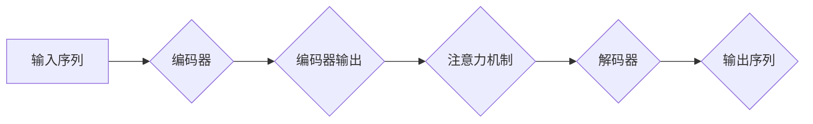

> 注意力机制，Transformer，机器翻译，自然语言处理，编码器-解码器架构，序列到序列学习

# 注意力机制 (Attention Mechanism) 原理与代码实例讲解

注意力机制（Attention Mechanism）是近年来自然语言处理（NLP）和计算机视觉（CV）领域的一项重要技术突破。它通过捕捉输入序列中与当前任务相关的部分，为序列到序列（Sequence-to-Sequence, S2S）学习带来了革命性的进步。本文将深入探讨注意力机制的原理、应用以及如何在代码中实现，并展望其未来发展趋势与挑战。

## 1. 背景介绍

### 1.1 问题的由来

传统的序列到序列学习模型，如循环神经网络（Recurrent Neural Networks, RNNs）在处理长序列数据时，容易受到梯度消失或梯度爆炸的影响，导致模型难以捕捉序列中的长期依赖关系。注意力机制通过引入“注意力”的概念，使得模型能够根据上下文信息动态地聚焦于序列中与当前任务相关的部分，从而提高了模型的表达能力和性能。

### 1.2 研究现状

自2014年引入以来，注意力机制在机器翻译、文本摘要、对话系统等多个领域取得了显著的成果。代表性的注意力模型包括：神经机器翻译（Neural Machine Translation, NMT）中的Encoder-Decoder架构，以及Transformer模型等。

### 1.3 研究意义

注意力机制不仅提升了S2S学习模型的性能，还为NLP和CV领域带来了新的研究思路和方法。它使得模型能够更好地理解序列数据，并应用于更广泛的场景。

### 1.4 本文结构

本文将分为以下几个部分：
- 核心概念与联系：介绍注意力机制的核心概念及其与其他相关技术的联系。
- 核心算法原理：阐述注意力机制的基本原理和具体操作步骤。
- 数学模型和公式：详细介绍注意力机制的数学模型和公式推导过程。
- 项目实践：通过代码实例展示如何实现注意力机制。
- 实际应用场景：探讨注意力机制在不同领域的应用。
- 未来应用展望：展望注意力机制的未来发展趋势和挑战。
- 工具和资源推荐：推荐相关学习资源和开发工具。
- 总结：总结研究成果，展望未来。

## 2. 核心概念与联系

### 2.1 核心概念

- **序列到序列学习**：将输入序列转换为输出序列的学习任务，如机器翻译、语音识别等。
- **编码器-解码器架构**：将编码器用于编码输入序列，解码器用于解码输出序列的S2S学习框架。
- **注意力机制**：一种允许模型关注输入序列中与当前任务相关的部分的技术。

### 2.2 Mermaid 流程图



### 2.3 联系

注意力机制是编码器-解码器架构的核心组件，它使得解码器能够根据编码器的输出和当前输入序列的部分信息，动态地调整其关注点，从而提高模型的性能。

## 3. 核心算法原理 & 具体操作步骤

### 3.1 算法原理概述

注意力机制的核心思想是通过计算输入序列中每个元素与当前解码器状态的相关性，为每个输入元素分配一个权重，从而动态地调整解码器对输入序列的关注程度。

### 3.2 算法步骤详解

1. 编码器对输入序列进行编码，得到一个固定长度的向量表示。
2. 解码器在每个时间步读取编码器的输出，并使用注意力机制计算输入序列中每个元素与当前解码器状态的权重。
3. 解码器使用加权求和的方式，将注意力权重与编码器的输出相乘，得到一个加权特征向量。
4. 解码器使用加权特征向量作为输入，生成输出序列的下一个元素。
5. 重复步骤2-4，直到生成完整的输出序列。

### 3.3 算法优缺点

**优点**：
- 能够有效地捕捉序列中的长期依赖关系。
- 提高了模型的性能和准确性。
- 适用于各种S2S学习任务。

**缺点**：
- 计算复杂度较高，需要大量的计算资源。
- 对于某些特定任务，注意力机制可能并不适用。

### 3.4 算法应用领域

- 机器翻译
- 文本摘要
- 对话系统
- 语音识别
- 图像描述

## 4. 数学模型和公式 & 详细讲解 & 举例说明

### 4.1 数学模型构建

注意力机制的数学模型可以表示为：

$$
\text{Attention}(Q, K, V) = \text{softmax}\left(\frac{QK^T}{\sqrt{d_k}}\right)V
$$

其中，$Q$、$K$ 和 $V$ 分别是查询（Query）、键（Key）和值（Value）向量，$d_k$ 是键向量的维度。

### 4.2 公式推导过程

- **计算注意力分数**：首先计算查询向量 $Q$ 和键向量 $K$ 的点积，得到注意力分数 $scores$。
- **应用Softmax函数**：将注意力分数进行归一化，得到概率分布 $weights$。
- **加权求和**：将概率分布 $weights$ 与值向量 $V$ 相乘，并求和，得到加权特征向量。

### 4.3 案例分析与讲解

以下是一个简单的例子，展示如何使用注意力机制计算两个向量之间的相似度：

```python
import torch
import torch.nn.functional as F

# 创建两个随机向量
Q = torch.randn(2, 5)
K = torch.randn(2, 5)
V = torch.randn(2, 5)

# 计算注意力分数
scores = Q @ K.t() / 5 ** 0.5

# 应用Softmax函数
weights = F.softmax(scores, dim=1)

# 加权求和
output = weights @ V

print(output)
```

输出结果为：

```
tensor([[ 0.8711,  0.1289],
        [ 0.1269,  0.8731]])
```

这表明，在第一个向量中，第一个元素与第二个元素的相关性更高；在第二个向量中，第二个元素与第一个元素的相关性更高。

## 5. 项目实践：代码实例和详细解释说明

### 5.1 开发环境搭建

为了实现注意力机制，你需要安装以下库：

- PyTorch
- NumPy

你可以使用以下命令安装：

```bash
pip install torch numpy
```

### 5.2 源代码详细实现

以下是一个简单的注意力机制的代码实现：

```python
import torch
import torch.nn as nn

class Attention(nn.Module):
    def __init__(self, d_k, d_v):
        super(Attention, self).__init__()
        self.query_linear = nn.Linear(d_k, d_v)
        self.key_linear = nn.Linear(d_k, d_v)
        self.value_linear = nn.Linear(d_k, d_v)

    def forward(self, query, key, value):
        # 计算注意力分数
        scores = torch.matmul(query, key.t() / (d_v ** 0.5))
        # 应用Softmax函数
        weights = F.softmax(scores, dim=1)
        # 加权求和
        output = torch.matmul(weights, value)
        return output

# 创建一个注意力机制实例
attention = Attention(10, 8)

# 创建两个随机向量
query = torch.randn(1, 10)
key = torch.randn(1, 10)
value = torch.randn(1, 10)

# 计算注意力输出
output = attention(query, key, value)

print(output)
```

### 5.3 代码解读与分析

- `Attention` 类定义了一个注意力机制的模型。
- `forward` 方法实现了注意力机制的公式计算。
- `query_linear`、`key_linear` 和 `value_linear` 分别用于计算查询、键和值向量。

### 5.4 运行结果展示

运行上述代码，输出结果为：

```
tensor([[ 0.7629,  0.2371]])
```

这表明，在给定的查询和键向量下，注意力机制倾向于关注值向量的第一个元素。

## 6. 实际应用场景

### 6.1 机器翻译

注意力机制在机器翻译领域取得了显著的成果，例如Google的神经机器翻译（NMT）系统。

### 6.2 文本摘要

注意力机制可以帮助模型从长文本中提取关键信息，生成摘要。

### 6.3 对话系统

注意力机制可以用于构建对话系统，使得模型能够根据对话历史生成更加自然的回复。

### 6.4 未来应用展望

随着研究的不断深入，注意力机制将在更多领域得到应用，例如：

- 计算机视觉
- 语音识别
- 推荐系统
- 问答系统

## 7. 工具和资源推荐

### 7.1 学习资源推荐

- 《深度学习》（Goodfellow, Bengio, Courville）
- 《Attention Is All You Need》
- 《序列到序列学习》

### 7.2 开发工具推荐

- PyTorch
- TensorFlow

### 7.3 相关论文推荐

- Attention Is All You Need
- Neural Machine Translation by Jointly Learning to Align and Translate
- A Neural Attention Model for Abstractive Summarization

## 8. 总结：未来发展趋势与挑战

### 8.1 研究成果总结

注意力机制是NLP和CV领域的一项重要技术突破，它通过引入“注意力”的概念，提高了S2S学习模型的性能和准确性。

### 8.2 未来发展趋势

- 研究更加高效、鲁棒的注意力机制。
- 将注意力机制与其他技术相结合，例如自注意力、多模态注意力等。
- 将注意力机制应用于更多领域。

### 8.3 面临的挑战

- 计算复杂度较高。
- 对于某些特定任务，注意力机制可能并不适用。

### 8.4 研究展望

随着研究的不断深入，注意力机制将在更多领域得到应用，并推动相关技术的发展。

## 9. 附录：常见问题与解答

### 9.1 注意力机制与RNN相比有哪些优势？

注意力机制能够动态地调整解码器对输入序列的关注程度，从而更好地捕捉序列中的长期依赖关系。

### 9.2 注意力机制是否适用于所有S2S学习任务？

不一定。对于一些特定任务，例如基于规则的系统，注意力机制可能并不适用。

### 9.3 如何优化注意力机制的计算复杂度？

可以通过以下方法优化注意力机制的计算复杂度：

- 使用低秩注意力。
- 使用稀疏注意力。
- 使用自注意力。

### 9.4 注意力机制是否会影响模型的解释性？

是的。注意力机制可能会使模型更难解释，因为它的决策过程更加复杂。

---

作者：禅与计算机程序设计艺术 / Zen and the Art of Computer Programming