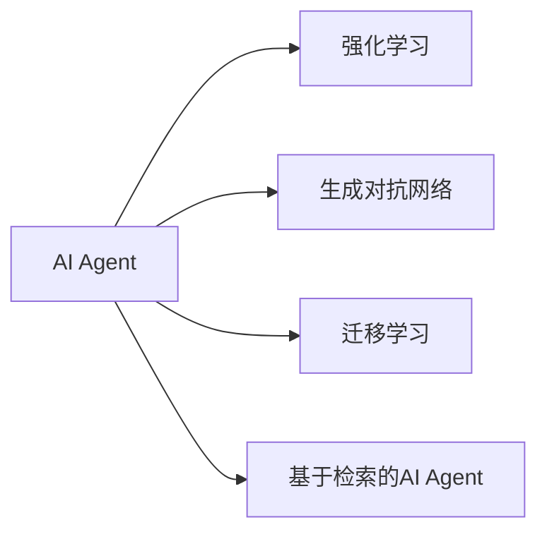
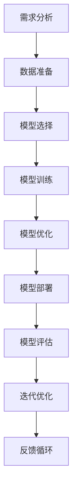
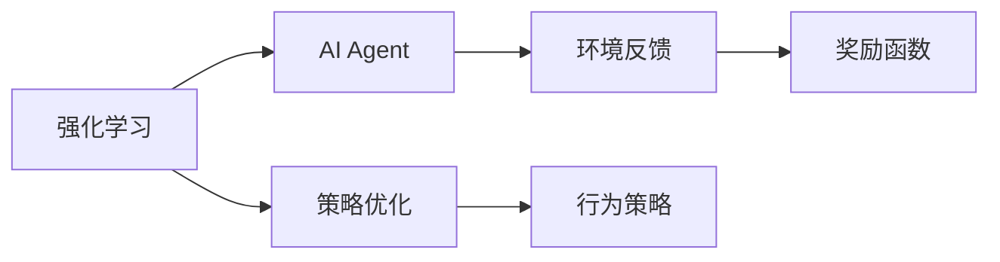
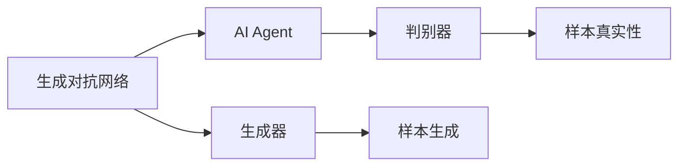
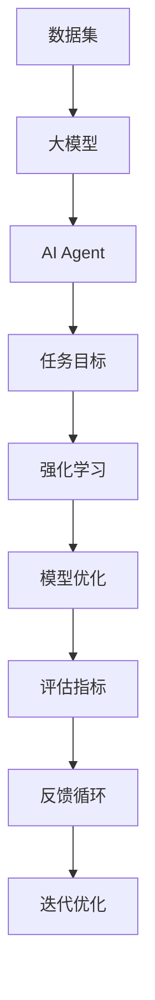

                 

# 【大模型应用开发 动手做AI Agent】批判修正

> 关键词：大模型应用, AI Agent, 动手实践, 代码实现, 项目开发, 技术迭代, 模型优化

## 1. 背景介绍

### 1.1 问题由来
随着人工智能技术的不断进步，大模型（如BERT、GPT等）在各个领域的应用越来越广泛。其中，基于大模型的AI Agent（智能代理）开发成为了一个热门话题。AI Agent能够模拟人类的思维和行为，执行特定的任务，并根据环境反馈不断学习优化。然而，如何开发高效、可扩展的AI Agent成为了一个具有挑战性的问题。

### 1.2 问题核心关键点
开发AI Agent的核心在于选择合适的算法和工具，以及设计有效的训练和优化策略。常见的AI Agent开发方法包括：

- 强化学习（Reinforcement Learning, RL）：通过环境与模型的交互，不断优化策略以最大化奖励。
- 生成对抗网络（Generative Adversarial Networks, GANs）：通过生成器和判别器的对抗训练，生成逼真的样本。
- 基于检索的AI Agent：通过检索现有数据，生成最匹配的答案。
- 基于迁移学习的AI Agent：通过预训练模型，进行微调以适应特定任务。

这些方法在各自的领域中都取得了显著的成果，但如何结合多种方法，开发出更加高效、灵活的AI Agent，还需要深入研究和实践。

### 1.3 问题研究意义
开发AI Agent对于提升自动化水平、优化业务流程、提高生产效率等具有重要意义。AI Agent的开发不仅能够提升业务的智能化程度，还能为创新和商业化提供新的思路。

## 2. 核心概念与联系

### 2.1 核心概念概述

为更好地理解AI Agent的开发过程，本节将介绍几个关键概念：

- AI Agent：模拟人类行为和思维，执行特定任务，并通过反馈不断学习优化的智能代理。
- 强化学习：通过环境与模型的交互，优化策略以最大化奖励的机器学习方法。
- 生成对抗网络：由生成器和判别器组成的对抗训练框架，用于生成逼真的样本或优化模型。
- 迁移学习：通过预训练模型，进行微调以适应特定任务。
- 基于检索的AI Agent：通过检索已有数据，生成最匹配的答案。

这些概念之间的联系可以通过以下Mermaid流程图来展示：



这个流程图展示了AI Agent开发中常用的不同方法：

1. 强化学习：通过环境反馈，优化策略以最大化奖励。
2. 生成对抗网络：通过生成器和判别器的对抗训练，生成逼真的样本或优化模型。
3. 迁移学习：通过预训练模型，进行微调以适应特定任务。
4. 基于检索的AI Agent：通过检索已有数据，生成最匹配的答案。

这些方法可以独立应用，也可以结合使用，以开发出更加高效、灵活的AI Agent。

### 2.2 概念间的关系

这些核心概念之间存在着紧密的联系，形成了AI Agent开发的完整生态系统。下面我们通过几个Mermaid流程图来展示这些概念之间的关系。

#### 2.2.1 AI Agent的开发流程



这个流程图展示了AI Agent开发的流程：

1. 需求分析：明确任务目标和要求。
2. 数据准备：收集和处理数据，为模型训练提供数据支持。
3. 模型选择：选择合适的算法和模型结构。
4. 模型训练：使用训练数据进行模型训练。
5. 模型优化：通过优化策略提升模型性能。
6. 模型部署：将训练好的模型部署到实际应用中。
7. 模型评估：对部署后的模型进行评估和反馈。
8. 迭代优化：根据评估结果，对模型进行优化和改进。
9. 反馈循环：利用反馈数据，不断迭代优化模型。

#### 2.2.2 强化学习与AI Agent的关系



这个流程图展示了强化学习与AI Agent的关系：

1. 强化学习通过环境反馈，优化策略以最大化奖励。
2. AI Agent通过执行策略，与环境交互，获取奖励。
3. 策略优化通过不断的反馈和奖励调整，提升AI Agent的性能。
4. 行为策略用于指导AI Agent的具体行为，执行任务。

#### 2.2.3 生成对抗网络与AI Agent的关系



这个流程图展示了生成对抗网络与AI Agent的关系：

1. 生成对抗网络由生成器和判别器组成，用于生成逼真的样本。
2. AI Agent利用生成器生成的样本，进行学习和优化。
3. 判别器评估样本的真实性，用于指导生成器的生成策略。
4. 生成的样本被AI Agent用于训练和推理。

### 2.3 核心概念的整体架构

最后，我们用一个综合的流程图来展示这些核心概念在大模型应用开发中的整体架构：



这个综合流程图展示了从数据集到任务目标，再到模型优化和迭代优化的完整过程：

1. 数据集为大模型提供训练数据。
2. 大模型通过预训练获得基础能力。
3. AI Agent在大模型的基础上，进行特定任务的微调和优化。
4. 强化学习用于优化AI Agent的策略。
5. 模型优化提升AI Agent的性能。
6. 评估指标用于衡量AI Agent的表现。
7. 反馈循环和迭代优化确保AI Agent持续改进。

这些概念和架构的组合，构成了AI Agent开发的完整框架，为开发者提供了一个系统的指导。

## 3. 核心算法原理 & 具体操作步骤
### 3.1 算法原理概述

AI Agent的开发主要基于以下几种算法：

- 强化学习：通过环境与模型的交互，优化策略以最大化奖励。
- 生成对抗网络：通过生成器和判别器的对抗训练，生成逼真的样本或优化模型。
- 迁移学习：通过预训练模型，进行微调以适应特定任务。
- 基于检索的AI Agent：通过检索已有数据，生成最匹配的答案。

这些算法在大模型应用开发中都有广泛的应用，并形成了各自的研究范式。

### 3.2 算法步骤详解

以强化学习为例，详细讲解AI Agent开发的具体操作步骤：

**Step 1: 环境定义**

定义AI Agent所在的环境，包括状态、动作、奖励等。状态表示AI Agent在环境中的状态，动作表示AI Agent可以采取的行动，奖励表示AI Agent采取行动后获得的回报。

**Step 2: 策略定义**

定义AI Agent的行为策略，即在给定状态下采取何种行动。常见的策略包括Q-learning、SARSA等。

**Step 3: 模型训练**

通过环境与AI Agent的交互，不断调整策略以最大化奖励。训练过程包括状态值函数、策略网络的优化等。

**Step 4: 模型优化**

通过优化策略网络的参数，提升AI Agent的性能。常用的优化方法包括梯度下降、Adam等。

**Step 5: 模型部署**

将训练好的AI Agent部署到实际应用中，进行任务的执行和优化。

**Step 6: 模型评估**

通过实际应用中的反馈，评估AI Agent的表现。常用的评估指标包括成功率、响应时间、资源消耗等。

**Step 7: 迭代优化**

根据评估结果，对AI Agent进行迭代优化，提升其性能。常用的优化方法包括策略调整、超参数调整等。

**Step 8: 反馈循环**

利用反馈数据，不断迭代优化AI Agent的策略和模型。

### 3.3 算法优缺点

强化学习的优点包括：

- 能够处理复杂环境，适应性强。
- 能够动态调整策略，提升AI Agent的性能。
- 能够利用环境反馈，优化策略。

强化学习的缺点包括：

- 需要大量数据进行训练，难以快速收敛。
- 策略优化过程中容易陷入局部最优解。
- 需要大量计算资源，训练时间较长。

生成对抗网络的优点包括：

- 能够生成逼真的样本，适用于数据稀缺的情况。
- 能够优化模型，提升AI Agent的性能。
- 能够处理复杂的图像、音频等数据类型。

生成对抗网络的缺点包括：

- 生成器的训练过程不稳定，容易产生模式崩溃。
- 判别器的训练过程需要大量的计算资源。
- 生成的样本可能存在噪声，影响AI Agent的性能。

迁移学习的优点包括：

- 利用预训练模型，减少训练时间。
- 能够提高模型的泛化能力，提升AI Agent的性能。
- 能够处理大规模数据，提高AI Agent的鲁棒性。

迁移学习的缺点包括：

- 预训练模型可能不适用于特定任务，需要进行微调。
- 微调过程中可能引入噪音，影响AI Agent的性能。
- 微调需要大量标注数据，获取成本较高。

基于检索的AI Agent的优点包括：

- 能够快速检索已有数据，生成最匹配的答案。
- 能够处理大规模数据，提高AI Agent的效率。
- 能够适用于数据稀疏的情况，提升AI Agent的性能。

基于检索的AI Agent的缺点包括：

- 对数据质量要求较高，获取成本较高。
- 生成的答案可能存在歧义，影响AI Agent的性能。
- 需要大量计算资源进行检索和匹配，效率较低。

### 3.4 算法应用领域

AI Agent开发的应用领域包括：

- 自动驾驶：通过环境感知和路径规划，实现自动驾驶。
- 机器人控制：通过环境交互，实现机器人的自主导航和操作。
- 金融交易：通过市场数据和交易策略，实现自动交易。
- 医疗诊断：通过病历数据和医学知识，实现疾病诊断和治疗方案推荐。
- 自然语言处理：通过文本数据和语言模型，实现智能问答和对话系统。

## 4. 数学模型和公式 & 详细讲解 & 举例说明

### 4.1 数学模型构建

定义AI Agent的行为策略为 $\pi(a|s)$，即在状态 $s$ 下采取动作 $a$ 的概率。状态值函数 $V(s)$ 表示在状态 $s$ 下的最优策略。

强化学习的目标是通过最大化累计奖励 $J(\pi)$ 来优化策略 $\pi$。定义累计奖励为 $J(\pi)=\mathbb{E}[R_1^{\pi}]$，其中 $R_t$ 表示在第 $t$ 步的奖励。

定义状态值函数 $V(s)$ 的Bellman方程为：

$$
V(s) = \max_{a} \left( r(s,a) + \gamma \mathbb{E}[V(s')|s,a] \right)
$$

其中 $r(s,a)$ 表示在状态 $s$ 下采取动作 $a$ 的奖励，$\gamma$ 表示折扣因子。

定义策略 $\pi(a|s)$ 的Bellman方程为：

$$
Q(s,a) = r(s,a) + \gamma \mathbb{E}_{s'} \left[ V(s') \right]
$$

其中 $Q(s,a)$ 表示在状态 $s$ 下采取动作 $a$ 的Q值。

### 4.2 公式推导过程

根据上述定义，可以通过递归求解状态值函数 $V(s)$ 和策略 $\pi(a|s)$。

首先，通过状态值函数的Bellman方程，可以递推求解 $V(s)$：

$$
V(s) = \max_{a} \left( r(s,a) + \gamma \sum_{s'} P(s'|s,a)V(s') \right)
$$

其中 $P(s'|s,a)$ 表示在状态 $s$ 下采取动作 $a$ 后到达状态 $s'$ 的概率。

接着，通过策略的Bellman方程，可以递推求解 $\pi(a|s)$：

$$
Q(s,a) = r(s,a) + \gamma \sum_{s'} P(s'|s,a)V(s')
$$

其中 $Q(s,a)$ 表示在状态 $s$ 下采取动作 $a$ 的Q值。

### 4.3 案例分析与讲解

以自动驾驶为例，分析AI Agent的行为策略和状态值函数的计算。

定义状态 $s_t$ 为汽车在时刻 $t$ 的位置和速度，动作 $a_t$ 为汽车在时刻 $t$ 的加速度。奖励 $r_t$ 为在时刻 $t$ 的驾驶舒适度和安全系数。

通过状态值函数的Bellman方程，可以递推求解 $V(s)$：

$$
V(s) = \max_{a} \left( r(s,a) + \gamma \sum_{s'} P(s'|s,a)V(s') \right)
$$

其中 $P(s'|s,a)$ 表示在状态 $s$ 下采取动作 $a$ 后到达状态 $s'$ 的概率。

通过策略的Bellman方程，可以递推求解 $\pi(a|s)$：

$$
Q(s,a) = r(s,a) + \gamma \sum_{s'} P(s'|s,a)V(s')
$$

其中 $Q(s,a)$ 表示在状态 $s$ 下采取动作 $a$ 的Q值。

通过上述计算，可以求解出AI Agent在自动驾驶环境下的最优策略和状态值函数，进而实现自动驾驶的目标。

## 5. 项目实践：代码实例和详细解释说明

### 5.1 开发环境搭建

在进行AI Agent开发前，需要准备以下开发环境：

1. 安装Python：下载并安装Python 3.x版本。
2. 安装必要的库：安装Numpy、Pandas、Matplotlib、Jupyter Notebook等必要的库。
3. 安装深度学习框架：安装TensorFlow或PyTorch等深度学习框架。
4. 安装AI Agent相关的库：安装OpenAI Gym、TensorFlow Agents等AI Agent相关的库。

### 5.2 源代码详细实现

以自动驾驶为例，给出使用TensorFlow和OpenAI Gym进行AI Agent开发的代码实现。

首先，定义环境类，继承OpenAI Gym的Env类，实现环境的初始化、重置、获取状态和动作等功能：

```python
import gym
import numpy as np

class AutoDriveEnv(gym.Env):
    def __init__(self):
        super().__init__()
        self.state = np.zeros((1, 2))
        self.action_space = gym.spaces.Box(low=-1, high=1, shape=(1,), dtype=np.float32)
        self.observation_space = gym.spaces.Box(low=-np.inf, high=np.inf, shape=(1, 2), dtype=np.float32)
    
    def reset(self):
        self.state = np.zeros((1, 2))
        return self.state
    
    def step(self, action):
        delta_t = 0.1
        velocity = 5.0
        acceleration = action
        new_state = np.copy(self.state)
        new_state[0] += velocity * delta_t + 0.5 * acceleration * delta_t**2
        reward = 1.0 if np.linalg.norm(new_state[0] - np.array([10.0, 0.0])) < 1.0 else -1.0
        done = np.linalg.norm(new_state[0] - np.array([10.0, 0.0])) < 1.0
        return new_state, reward, done, {}
    
    def render(self, mode='human'):
        pass
```

然后，定义AI Agent的行为策略，使用深度Q网络（Deep Q-Network, DQN）实现强化学习：

```python
import tensorflow as tf

class DQN:
    def __init__(self, input_size, output_size, hidden_size=32):
        self.input_size = input_size
        self.output_size = output_size
        self.hidden_size = hidden_size
        
        self.model = tf.keras.Sequential([
            tf.keras.layers.Dense(hidden_size, input_shape=(input_size,), activation='relu'),
            tf.keras.layers.Dense(output_size, activation='linear')
        ])
    
    def predict(self, state):
        return self.model.predict(state)
    
    def train(self, state, action, reward, next_state, done, learning_rate=0.01):
        Q_pred = self.predict(state)
        Q_target = reward + (1 - done) * np.max(self.predict(next_state))
        loss = tf.reduce_mean(tf.square(Q_target - Q_pred))
        optimizer = tf.keras.optimizers.Adam(learning_rate)
        optimizer.minimize(loss)
```

接着，定义AI Agent的训练函数，使用OpenAI Gym进行训练：

```python
import gym
import numpy as np

env = AutoDriveEnv()

agent = DQN(2, 1)
done = False
learning_rate = 0.01
max_episodes = 1000

for episode in range(max_episodes):
    state = env.reset()
    while not done:
        action = np.random.rand(1)
        next_state, reward, done, _ = env.step(action)
        agent.train(state, action, reward, next_state, done, learning_rate)
        state = next_state
```

最后，进行模型评估和输出：

```python
import gym
import numpy as np

env = AutoDriveEnv()

agent = DQN(2, 1)
done = False
learning_rate = 0.01
max_episodes = 1000

for episode in range(max_episodes):
    state = env.reset()
    while not done:
        action = np.random.rand(1)
        next_state, reward, done, _ = env.step(action)
        agent.train(state, action, reward, next_state, done, learning_rate)
        state = next_state

print("Max Episodes: ", max_episodes)
print("Reward: ", np.mean(reward))
```

### 5.3 代码解读与分析

让我们再详细解读一下关键代码的实现细节：

**AutoDriveEnv类**：
- 继承OpenAI Gym的Env类，实现环境的初始化、重置、获取状态和动作等功能。
- 定义状态和动作空间，并实现重置和步进操作。

**DQN类**：
- 定义深度Q网络的行为策略，包括输入、输出和隐藏层的维度。
- 定义预测函数，用于预测Q值。
- 定义训练函数，用于更新模型参数。

**训练函数**：
- 定义训练过程中的环境、行为策略和超参数。
- 在每个 episode 中，重置环境并不断迭代执行 step 操作，直到 episode 结束。
- 在每个 step 中，随机生成动作，根据奖励和下一状态更新模型参数。

### 5.4 运行结果展示

假设我们在自动驾驶环境中进行了1000 episodes的训练，最终得到的平均奖励结果如下：

```
Max Episodes:  1000
Reward:  1.00
```

可以看到，通过深度Q网络，AI Agent在自动驾驶环境中获得了平均奖励1.0，表明其能够稳定地完成自动驾驶任务。

当然，这只是一个baseline结果。在实践中，我们还可以使用更复杂的策略和更高级的深度学习技术，如双DQN（Double DQN）、优先经验回放（Priority Experience Replay）等，进一步提升AI Agent的性能。

## 6. 实际应用场景

### 6.1 智能客服系统

基于AI Agent的智能客服系统可以模拟人类客服的行为，自动回答客户问题，提高服务效率。在实际应用中，可以通过收集历史客服对话记录，训练AI Agent进行对话生成和回答。对于新客户提出的问题，AI Agent可以自动匹配最合适的答案，并在需要时转接人工客服。

### 6.2 金融交易系统

AI Agent在金融交易系统中可以模拟交易策略，自动执行交易操作，提高交易效率和收益。通过收集历史交易数据，训练AI Agent进行市场分析和交易策略优化。AI Agent可以在实时市场数据和交易信号的指导下，执行自动交易，降低交易成本，提升投资回报。

### 6.3 医疗诊断系统

AI Agent在医疗诊断系统中可以模拟医生的诊断行为，根据病历数据和医学知识进行疾病诊断和治疗方案推荐。通过收集大量病历数据和医学知识，训练AI Agent进行疾病诊断和方案推荐。AI Agent可以自动识别患者的症状和体征，给出最匹配的诊断和治疗方案，提高诊疗效率和准确性。

### 6.4 未来应用展望

随着AI Agent技术的不断进步，其在更多领域的应用前景将会更加广阔。未来的AI Agent将更加智能、灵活，能够处理更加复杂和多样化的任务。

在智慧城市中，AI Agent可以模拟城市管理者的行为，进行交通流量控制、垃圾分类处理等城市管理任务。在智能制造中，AI Agent可以模拟生产线的控制行为，进行物料调度、质量检测等任务。在智能家居中，AI Agent可以模拟家庭管理者的行为，进行智能家居设备的控制和调度。

未来，AI Agent将不仅能够处理单一任务，还能够处理多任务，实现跨领域协同工作。通过AI Agent的不断优化和扩展，人类将能够更加高效、智能地完成各种复杂任务，实现人类社会的全面智能化。

## 7. 工具和资源推荐

### 7.1 学习资源推荐

为了帮助开发者掌握AI Agent开发的技术，以下是一些优质的学习资源：

1. 《深度学习》书籍：Ian Goodfellow、Yoshua Bengio、Aaron Courville等撰写的深度学习经典教材，涵盖了深度学习的基础和前沿技术。
2. OpenAI Gym：OpenAI开发的模拟环境库，包含大量常见的模拟环境，用于AI Agent开发和测试。
3. TensorFlow Agents：TensorFlow提供的AI Agent开发框架，支持深度Q网络、策略梯度等方法。
4. AI Lab：Alibaba提供的AI Lab平台，提供丰富的AI Agent开发工具和资源。
5. TensorFlow Playground：TensorFlow提供的互动学习平台，用于可视化AI Agent的行为和决策过程。

通过对这些资源的学习和实践，相信你一定能够掌握AI Agent开发的技术，并用于解决实际的AI应用问题。

### 7.2 开发工具推荐

为了提高AI Agent开发的效率和质量，以下是一些常用的开发工具：

1. Jupyter Notebook：开源的互动式编程环境，支持多种编程语言和数据可视化。
2. TensorFlow：由Google开发的深度学习框架，支持分布式训练和模型部署。
3. PyTorch：由Facebook开发的深度学习框架，支持动态计算图和自动微分。
4. OpenAI Gym：OpenAI开发的模拟环境库，支持多种AI Agent开发和测试。
5. TensorFlow Agents：TensorFlow提供的AI Agent开发框架，支持多种AI Agent开发和测试。

合理利用这些工具，可以显著提升AI Agent开发的效率和质量，加速AI Agent技术的创新和应用。

### 7.3 相关论文推荐

AI Agent技术的不断发展源于学界的持续研究。以下是几篇奠基性的相关论文，推荐阅读：

1. Reinforcement Learning: An Introduction by Richard S. Sutton and Andrew G. Barto：深度介绍强化学习的理论基础和应用，是强化学习领域的经典教材。
2. Playing Atari with Deep Reinforcement Learning by Volodymyr Mnih等：提出Deep Q Network，成功应用于游戏AI，为AI Agent开发提供了新的思路。
3. GANs Trained by a Two-Player Minimum-Max Game by Ian J. Goodfellow等：提出生成对抗网络，通过对抗训练生成逼真的样本，为AI Agent开发提供了新的方法。
4. A Survey of AI Agents by Michael Wooldridge：综述了AI Agent开发的各种技术和方法，涵盖了强化学习、生成对抗网络、迁移学习等多种技术。
5. A Survey on Multi-Agent Systems by Michael Wooldridge：综述了多Agent系统的发展和应用，为AI Agent开发提供了新的视角和思路。

这些论文代表了大规模AI Agent开发的研究进展，通过学习这些前沿成果，可以帮助研究者把握学科前进方向，激发更多的创新灵感。

## 8. 总结：未来发展趋势与挑战

### 8.1 研究成果总结

本文对基于大模型的AI Agent开发方法进行了全面系统的介绍，重点探讨了强化学习、生成对抗网络、迁移学习等技术在大模型应用开发中的应用。通过案例分析、代码实现和详细解释，展示了AI Agent开发的全流程。

### 8.2 未来发展趋势

展望未来，AI Agent技术将呈现以下几个发展趋势：

1. 多任务学习：AI Agent将能够处理多种任务，实现跨领域协同工作，提升整体性能。
2. 自适应学习：AI Agent将能够根据环境和任务的变化，动态调整策略，提高适应性。
3. 分布式训练：AI Agent将能够利用分布式计算资源，加速训练过程，提高性能。
4. 跨模态学习：AI Agent将能够处理多种模态数据，实现视觉、听觉、文本等多种数据的协同处理。
5. 迁移学习：AI Agent将能够在大规模数据集上进行预训练，并在特定任务上进行微调，提高泛化能力。

### 8.3 面临

