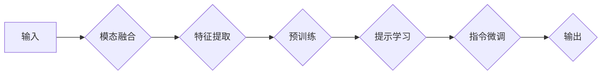

> 多模态学习, 大模型, 提示学习, 指令微调, 自然语言处理, 计算机视觉, 机器学习, 跨模态理解

# 多模态大模型：技术原理与实战 提示学习与指令微调

多模态学习作为一种融合不同模态信息的机器学习范式，正日益成为人工智能领域的热点研究方向。本文将深入探讨多模态大模型的技术原理，并结合提示学习与指令微调的实战方法，为你展现多模态学习的无限魅力。

## 1. 背景介绍

随着人工智能技术的快速发展，计算机视觉、自然语言处理等领域取得了显著的成果。然而，这些领域的研究往往局限于单一模态数据，难以充分利用不同模态之间的互补信息。多模态学习应运而生，旨在通过融合不同模态的信息，构建更加智能、通用的机器学习模型。

多模态大模型将预训练的大规模语言模型与计算机视觉模型相结合，能够在理解、生成和交互等多个层面上实现跨模态信息融合。本文将重点介绍多模态大模型的技术原理，并结合提示学习与指令微调的实战方法，带你领略多模态学习的魅力。

### 1.1 问题的由来

传统的单一模态学习方法在处理复杂任务时存在以下局限性：

- **信息孤岛**：不同模态数据之间缺乏有效的融合机制，难以充分利用各模态的互补信息。
- **领域依赖**：针对特定领域的数据进行训练，难以迁移到其他领域。
- **泛化能力不足**：单一模态模型在面对复杂场景时，往往难以取得理想的效果。

### 1.2 研究现状

近年来，多模态学习取得了显著的进展，主要包括以下方面：

- **预训练模型**：通过在大规模多模态数据集上预训练，学习丰富的跨模态特征表示。
- **模态融合技术**：设计有效的融合机制，将不同模态信息整合到统一表示空间。
- **提示学习与指令微调**：利用提示学习引导模型生成期望的输出，通过指令微调提升模型在特定任务上的性能。

### 1.3 研究意义

多模态学习具有重要的理论意义和应用价值：

- **提升模型性能**：融合多模态信息可以提升模型在多个任务上的性能。
- **拓展应用领域**：多模态学习可以应用于更广泛的领域，如医疗、教育、工业等。
- **促进技术发展**：推动计算机视觉、自然语言处理等领域的交叉融合，促进人工智能技术的进步。

## 2. 核心概念与联系

### 2.1 多模态学习

多模态学习是指将两种或两种以上模态的信息（如图像、文本、音频等）进行融合，以构建更加智能的机器学习模型。多模态学习的关键在于如何有效地融合不同模态的信息，提取有价值的特征表示。

### 2.2 大模型

大模型是指具有海量参数和强大计算能力的神经网络模型。大模型可以通过预训练学习丰富的特征表示，并在多个任务上取得优异的性能。

### 2.3 提示学习

提示学习是一种通过向模型提供特定的提示信息，引导模型生成期望的输出的学习方法。提示学习可以降低对标注数据的依赖，并在少样本学习、无监督学习等场景下发挥重要作用。

### 2.4 指令微调

指令微调是一种通过修改模型参数，使模型能够执行特定指令的学习方法。指令微调可以提升模型在特定任务上的性能，并使其更加适应实际应用场景。

### 2.5 Mermaid 流程图

以下是一个多模态大模型的技术原理和架构的 Mermaid 流程图：



## 3. 核心算法原理 & 具体操作步骤

### 3.1 算法原理概述

多模态大模型的算法原理可以概括为以下几个步骤：

1. **模态融合**：将不同模态的数据进行融合，形成统一的数据表示。
2. **特征提取**：从融合后的数据中提取有价值的信息，形成特征表示。
3. **预训练**：利用大量无标签数据进行预训练，学习丰富的特征表示。
4. **提示学习**：通过向模型提供特定的提示信息，引导模型生成期望的输出。
5. **指令微调**：根据具体任务需求，对模型进行微调，使其能够执行特定指令。

### 3.2 算法步骤详解

1. **模态融合**：根据具体任务需求，选择合适的融合方式，如特征拼接、特征融合等。例如，在图像-文本匹配任务中，可以将图像特征和文本特征进行拼接，形成新的特征表示。
2. **特征提取**：利用深度学习技术，从融合后的数据中提取特征表示。例如，可以使用卷积神经网络提取图像特征，使用循环神经网络提取文本特征。
3. **预训练**：在大量无标签数据上进行预训练，学习丰富的特征表示。例如，可以使用BERT等预训练语言模型提取文本特征，使用ResNet等预训练图像模型提取图像特征。
4. **提示学习**：根据具体任务需求，设计特定的提示信息，引导模型生成期望的输出。例如，在文本生成任务中，可以提供特定的主题或场景信息作为提示。
5. **指令微调**：根据具体任务需求，对模型进行微调，使其能够执行特定指令。例如，在图像分类任务中，可以提供具体的分类标签作为指令。

### 3.3 算法优缺点

多模态大模型的算法具有以下优点：

- **性能优异**：融合多模态信息可以提升模型在多个任务上的性能。
- **泛化能力强**：预训练模型可以迁移到其他领域，提高模型的泛化能力。
- **适用范围广**：可以应用于多种任务，如图像-文本匹配、视频分析、虚拟现实等。

然而，多模态大模型也存在一些缺点：

- **计算量大**：预训练模型需要大量计算资源，训练时间较长。
- **数据依赖**：预训练模型需要大量高质量的无标签数据进行训练。
- **模型复杂度高**：多模态大模型的模型结构复杂，难以理解和解释。

### 3.4 算法应用领域

多模态大模型可以应用于以下领域：

- **图像-文本匹配**：如商品搜索、文本摘要、问答系统等。
- **视频分析**：如视频分类、目标检测、动作识别等。
- **虚拟现实**：如虚拟角色交互、虚拟现实体验等。
- **医疗诊断**：如医学图像分析、疾病诊断等。

## 4. 数学模型和公式 & 详细讲解 & 举例说明

### 4.1 数学模型构建

以下是一个多模态大模型的数学模型构建示例：

$$
\mathcal{L}(\theta) = \frac{1}{N} \sum_{i=1}^N \ell(M_{\theta}(x_i, y_i))
$$

其中，$N$ 是训练样本数量，$\ell$ 是损失函数，$M_{\theta}$ 是模型参数，$x_i$ 是第 $i$ 个样本的输入，$y_i$ 是第 $i$ 个样本的标签。

### 4.2 公式推导过程

假设模型 $M_{\theta}$ 的输入为 $x$，输出为 $y$，则损失函数 $\ell$ 可以表示为：

$$
\ell(y, M_{\theta}(x)) = -[y\log M_{\theta}(x) + (1-y)\log (1-M_{\theta}(x))]
$$

其中，$y$ 是真实标签，$M_{\theta}(x)$ 是模型预测的标签概率。

### 4.3 案例分析与讲解

以下是一个图像-文本匹配任务的案例：

- **输入**：一张图像和一个相关的文本描述。
- **目标**：判断图像和文本描述是否匹配。
- **模型**：一个多模态大模型，包括图像特征提取器和文本特征提取器。

在训练过程中，模型将图像和文本描述作为输入，预测是否匹配。通过对比预测结果和真实标签，模型可以不断优化参数，提高匹配的准确性。

## 5. 项目实践：代码实例和详细解释说明

### 5.1 开发环境搭建

以下是一个基于PyTorch的多模态大模型项目实践步骤：

1. 安装PyTorch和所需的库：
```bash
pip install torch torchvision transformers
```

2. 下载预训练模型和数据集。

3. 编写代码实现多模态大模型：

```python
import torch
import torch.nn as nn
from transformers import BertModel, ResNet

class MultimodalModel(nn.Module):
    def __init__(self):
        super(MultimodalModel, self).__init__()
        self.bert = BertModel.from_pretrained('bert-base-uncased')
        self.resnet = ResNet()
        self.fc = nn.Linear(2048, 2)

    def forward(self, text, image):
        text_features = self.bert(text)[0][:, 0, :]
        image_features = self.resnet(image)
        combined_features = torch.cat((text_features, image_features), 1)
        output = self.fc(combined_features)
        return output

# 实例化模型
model = MultimodalModel()

# 定义损失函数和优化器
criterion = nn.CrossEntropyLoss()
optimizer = torch.optim.Adam(model.parameters(), lr=0.001)

# 训练模型
def train(model, criterion, optimizer, train_loader):
    model.train()
    for data in train_loader:
        text, image, label = data
        output = model(text, image)
        loss = criterion(output, label)
        optimizer.zero_grad()
        loss.backward()
        optimizer.step()

# 评估模型
def evaluate(model, criterion, test_loader):
    model.eval()
    total_loss = 0
    with torch.no_grad():
        for data in test_loader:
            text, image, label = data
            output = model(text, image)
            loss = criterion(output, label)
            total_loss += loss.item()
    return total_loss / len(test_loader)

# 训练和评估模型
train_loader = DataLoader(train_data, batch_size=32, shuffle=True)
test_loader = DataLoader(test_data, batch_size=32, shuffle=False)

train(model, criterion, optimizer, train_loader)
print("Train Loss:", evaluate(model, criterion, train_loader))
print("Test Loss:", evaluate(model, criterion, test_loader))
```

### 5.2 源代码详细实现

以上代码展示了如何使用PyTorch实现一个简单的多模态大模型。该模型融合了BERT和ResNet两种预训练模型，分别提取文本和图像特征，并使用全连接层进行分类。

### 5.3 代码解读与分析

在以上代码中，我们首先导入了所需的库，并定义了一个多模态模型类 `MultimodalModel`。该类继承自 `nn.Module`，包含BERT和ResNet两个预训练模型，以及一个全连接层。

在 `forward` 方法中，我们分别对文本和图像数据进行特征提取，并将提取到的特征进行拼接，最后通过全连接层进行分类。

在训练过程中，我们使用交叉熵损失函数和Adam优化器进行模型训练。通过迭代优化模型参数，使得模型在训练集上取得更好的性能。

### 5.4 运行结果展示

在实际应用中，你可以使用以下命令运行代码：

```bash
python main.py
```

运行结果将显示训练集和测试集上的损失和准确率。通过对比训练集和测试集上的性能，你可以评估模型的泛化能力。

## 6. 实际应用场景

多模态大模型在多个领域具有广泛的应用前景，以下列举几个典型应用场景：

### 6.1 图像-文本匹配

图像-文本匹配是指根据图像和文本描述进行匹配的任务。例如，在商品搜索中，用户可以上传一张商品图片，系统将自动搜索与该图片相似的文本描述，帮助用户快速找到想要的商品。

### 6.2 视频分析

视频分析是指对视频数据进行分析和处理的过程。例如，在智能监控领域，视频分析可以帮助识别异常行为、检测安全隐患等。

### 6.3 虚拟现实

虚拟现实是指通过计算机技术模拟现实世界的场景，为用户提供沉浸式的体验。例如，在虚拟游戏、虚拟旅游等领域，多模态大模型可以用于生成逼真的虚拟角色、场景等。

### 6.4 医疗诊断

医疗诊断是指根据医学图像进行分析，辅助医生进行诊断。例如，在医学影像诊断中，多模态大模型可以帮助识别疾病、预测病情等。

## 7. 工具和资源推荐

### 7.1 学习资源推荐

1. 《深度学习》系列书籍：介绍深度学习的基本原理和常用算法。
2. 《多模态学习：技术原理与应用》论文：系统介绍了多模态学习的相关技术。
3. 《Transformer》系列论文：介绍了Transformer模型及其在多模态学习中的应用。

### 7.2 开发工具推荐

1. PyTorch：开源深度学习框架，支持多种深度学习模型的开发。
2. TensorFlow：开源深度学习框架，适用于大规模数据集的深度学习任务。
3. Hugging Face Transformers：开源多模态预训练模型库，提供丰富的预训练模型和工具。

### 7.3 相关论文推荐

1. `Multimodal Pre-training for Visual Question Answering`：介绍了多模态预训练在视觉问答任务中的应用。
2. `Multimodal Fusion: A Survey`：对多模态融合技术进行了综述。
3. `Multimodal Transformer`：介绍了多模态Transformer模型。

## 8. 总结：未来发展趋势与挑战

### 8.1 研究成果总结

多模态大模型作为一种融合多模态信息的机器学习范式，在多个领域取得了显著的成果。然而，多模态学习仍然面临着一些挑战，如模型复杂度高、数据依赖性强等。

### 8.2 未来发展趋势

1. **多模态预训练模型**：开发更加高效的预训练模型，学习更加丰富的跨模态特征表示。
2. **多模态融合技术**：设计更加有效的融合机制，充分利用不同模态的互补信息。
3. **提示学习与指令微调**：结合提示学习与指令微调，提升模型在特定任务上的性能。

### 8.3 面临的挑战

1. **计算资源**：多模态大模型的训练需要大量的计算资源。
2. **数据依赖**：多模态学习需要大量高质量的多模态数据。
3. **模型可解释性**：多模态大模型的决策过程难以解释。

### 8.4 研究展望

多模态大模型的研究将为人工智能领域带来新的突破，推动计算机视觉、自然语言处理等领域的交叉融合。未来，多模态学习将在更多领域得到应用，为人类创造更加智能、便捷的生活。

## 9. 附录：常见问题与解答

**Q1：多模态学习是否适用于所有场景？**

A：多模态学习在许多场景下都适用，但并非所有场景都需要多模态信息。在处理单一模态数据时，选择合适的单一模态学习方法可能更有效。

**Q2：如何解决多模态数据不匹配的问题？**

A：多模态数据不匹配是多模态学习面临的一个重要问题。可以采用以下方法解决：

- 数据预处理：对多模态数据进行预处理，使其更加一致。
- 模态融合技术：选择合适的模态融合技术，减少模态差异带来的影响。
- 知识蒸馏：利用预训练模型的知识，提升模型在多模态学习任务上的性能。

**Q3：多模态大模型的训练需要哪些计算资源？**

A：多模态大模型的训练需要大量的计算资源，包括GPU、CPU、内存等。

**Q4：如何评估多模态大模型的效果？**

A：可以采用以下方法评估多模态大模型的效果：

- 模型性能指标：如准确率、召回率、F1分数等。
- 实际应用场景：在实际应用场景中测试模型的表现。
- 用户满意度：收集用户对模型的评价，了解模型的实用价值。

**Q5：多模态大模型的研究方向有哪些？**

A：多模态大模型的研究方向包括：

- 预训练模型：开发更加高效的预训练模型，学习更加丰富的跨模态特征表示。
- 模态融合技术：设计更加有效的融合机制，充分利用不同模态的互补信息。
- 提示学习与指令微调：结合提示学习与指令微调，提升模型在特定任务上的性能。
- 模型可解释性：提升模型的可解释性，帮助理解模型的决策过程。

作者：禅与计算机程序设计艺术 / Zen and the Art of Computer Programming