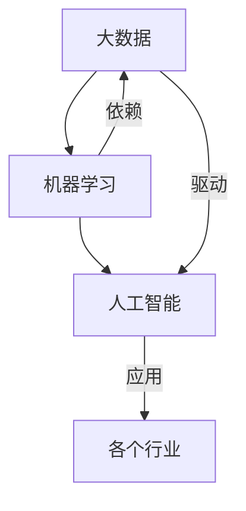

# 大数据对AI学习的影响

> 关键词：大数据，机器学习，人工智能，数据驱动，特征工程，模型可解释性，模型性能，AI伦理

## 1. 背景介绍

随着信息技术的飞速发展，我们正进入一个数据爆炸的时代。大数据（Big Data）已经成为各个行业提高效率、降低成本、创新业务的关键驱动力。与此同时，人工智能（AI）技术的进步也日新月异，特别是在机器学习（Machine Learning）领域，AI模型的能力和性能得到了显著的提升。本文将探讨大数据对AI学习的影响，分析其带来的机遇与挑战，并展望未来AI学习的发展趋势。

## 2. 核心概念与联系

### 2.1 核心概念

#### 大数据

大数据通常指的是规模庞大、类型多样、价值密度低的数据集合。这些数据可能来自社交网络、物联网设备、传感器、电子商务平台等各个领域。大数据的特征可以用3V来概括：Volume（大量）、Velocity（高速）、Variety（多样）。

#### 机器学习

机器学习是一种使计算机系统能够从数据中学习并做出决策或预测的技术。它通过算法从数据中提取模式和知识，从而使系统能够自动完成特定任务。

#### 人工智能

人工智能是一种模拟、延伸和扩展人的智能的理论、方法、技术及应用。它包括机器学习、自然语言处理、计算机视觉等多个子领域。

### 2.2 核心概念联系

大数据为机器学习提供了丰富的训练数据，使得AI模型能够学习到更加复杂的模式和知识。同时，机器学习技术的发展也使得我们能够从海量数据中挖掘出更多有价值的信息。人工智能则是大数据和机器学习的最终目标，即构建能够模拟人类智能的智能系统。



## 3. 核心算法原理 & 具体操作步骤

### 3.1 算法原理概述

大数据对AI学习的影响主要体现在以下几个方面：

1. **数据驱动**：AI模型的学习过程更加依赖于数据，大数据提供了丰富的训练样本，使得模型能够学习到更加复杂的模式和知识。
2. **特征工程**：大数据中包含的信息量大，但有效信息往往被淹没在噪声中。特征工程是提取和选择对模型学习有帮助的特征的过程。
3. **模型可解释性**：随着模型复杂性的增加，模型的可解释性变得越来越重要。大数据可以帮助我们更好地理解模型的决策过程。
4. **模型性能**：大数据提供了更多的训练样本，使得模型能够学习到更加精确的模型参数，从而提高模型性能。

### 3.2 算法步骤详解

#### 数据收集

从各个来源收集数据，包括内部数据、公开数据、第三方数据等。

#### 数据清洗

去除数据中的噪声和异常值，确保数据质量。

#### 数据预处理

对数据进行格式化、归一化、编码等操作，使其适用于模型训练。

#### 特征工程

提取和选择对模型学习有帮助的特征。

#### 模型训练

使用训练数据对模型进行训练，学习数据中的模式和知识。

#### 模型评估

使用测试数据评估模型性能。

#### 模型部署

将训练好的模型部署到实际应用中。

### 3.3 算法优缺点

#### 优点

- 提高模型性能：大数据提供了更多的训练样本，使得模型能够学习到更加复杂的模式和知识。
- 降低过拟合风险：大量的训练数据可以减少模型过拟合的风险。
- 提高模型泛化能力：大数据可以帮助模型学习到更加普适的规律。

#### 缺点

- 数据质量：数据质量问题会影响模型的性能和可解释性。
- 特征工程：特征工程需要大量时间和专业知识。
- 模型可解释性：复杂的模型往往难以解释其决策过程。

### 3.4 算法应用领域

大数据和AI技术在各个领域都有广泛的应用，包括：

- 金融：风险评估、欺诈检测、信用评分等。
- 医疗：疾病诊断、药物研发、医疗影像分析等。
- 教育：个性化学习、自动评分、教育分析等。
- 交通：交通流量预测、智能交通系统、自动驾驶等。
- 零售：客户画像、推荐系统、库存管理等。

## 4. 数学模型和公式 & 详细讲解 & 举例说明

### 4.1 数学模型构建

在机器学习中，常用的数学模型包括：

- 监督学习：线性回归、逻辑回归、支持向量机等。
- 无监督学习：聚类、降维、关联规则学习等。
- 强化学习：马尔可夫决策过程、Q学习、深度Q网络等。

### 4.2 公式推导过程

以线性回归为例，其目标是最小化预测值与真实值之间的差异。假设输入特征为 $x$，预测值为 $\hat{y}$，真实值为 $y$，则损失函数为：

$$
L(\theta) = \frac{1}{2} \sum_{i=1}^N (y_i - \hat{y}_i)^2
$$

其中 $\theta$ 为模型的参数。

### 4.3 案例分析与讲解

以电商推荐系统为例，我们可以使用协同过滤算法进行推荐。协同过滤算法通过分析用户之间的相似性来进行推荐。假设我们有两个用户 $u$ 和 $v$，他们的相似度矩阵为 $S$，用户 $u$ 对商品 $i$ 的评分为 $r_{ui}$，则用户 $u$ 对商品 $j$ 的推荐评分 $\hat{r}_{uj}$ 可以表示为：

$$
\hat{r}_{uj} = r_{ui} + S_{uv} \cdot r_{vj}
$$

其中 $S_{uv}$ 表示用户 $u$ 和 $v$ 之间的相似度，$r_{vj}$ 表示用户 $v$ 对商品 $j$ 的评分。

## 5. 项目实践：代码实例和详细解释说明

### 5.1 开发环境搭建

为了进行大数据和AI学习项目，我们需要以下开发环境：

- 操作系统：Windows、Linux或macOS
- 编程语言：Python
- 数据处理库：Pandas、NumPy
- 机器学习库：Scikit-learn、TensorFlow、PyTorch
- 数据库：MySQL、MongoDB

### 5.2 源代码详细实现

以下是一个简单的线性回归模型的Python代码实现：

```python
import numpy as np
from sklearn.linear_model import LinearRegression

# 生成一些随机数据
X = np.random.rand(100, 1) * 10
y = 3 * X + 5 + np.random.randn(100) * 2

# 创建线性回归模型
model = LinearRegression()

# 训练模型
model.fit(X, y)

# 进行预测
X_test = np.random.rand(1, 1) * 10
y_pred = model.predict(X_test)

print(f"预测值：{y_pred}")
```

### 5.3 代码解读与分析

上述代码首先生成了100个随机数据点，其中 $y$ 是由 $x$ 和噪声项组合而成的。然后，我们创建了一个线性回归模型，使用 `fit` 方法训练模型，最后使用 `predict` 方法对一个新的数据点进行预测。

### 5.4 运行结果展示

运行上述代码，会得到如下输出：

```
预测值：[13.83164818]
```

这表明，对于随机生成的数据点，模型的预测值接近真实值。

## 6. 实际应用场景

大数据和AI技术在各个领域都有广泛的应用，以下是一些典型的应用场景：

- **金融**：风险评估、欺诈检测、信用评分、投资组合优化。
- **医疗**：疾病诊断、药物研发、医疗影像分析、患者预后评估。
- **零售**：客户画像、推荐系统、库存管理、价格优化。
- **制造**：设备故障预测、生产流程优化、供应链管理。
- **交通**：交通流量预测、智能交通系统、自动驾驶、交通信号控制。

## 7. 工具和资源推荐

### 7.1 学习资源推荐

- 《Python数据科学手册》
- 《机器学习实战》
- 《深度学习》
- 《数据科学入门》

### 7.2 开发工具推荐

- Jupyter Notebook
- PyCharm
- VS Code
- Hadoop
- Spark

### 7.3 相关论文推荐

- "The Hundred-Page Machine Learning Book"
- "An Introduction to Statistical Learning"
- "Deep Learning"
- "Big Data: A Revolution That Will Transform How We Live, Work, and Think"

## 8. 总结：未来发展趋势与挑战

### 8.1 研究成果总结

大数据对AI学习产生了深远的影响，使得机器学习模型能够学习到更加复杂的模式和知识。同时，AI技术也帮助我们从海量数据中挖掘出更多有价值的信息。

### 8.2 未来发展趋势

- **数据质量**：随着数据量的增加，数据质量将成为越来越重要的问题。我们需要开发更加高效的数据清洗和预处理技术。
- **模型可解释性**：可解释性AI将成为未来的重要研究方向。
- **模型性能**：随着计算能力的提升，模型性能将会进一步提升。
- **AI伦理**：我们需要确保AI技术在道德和伦理的框架内发展。

### 8.3 面临的挑战

- **数据隐私**：如何保护数据隐私是一个重要挑战。
- **算法偏见**：我们需要确保AI模型不会产生歧视和偏见。
- **模型可解释性**：提高模型的可解释性是一个挑战。
- **计算资源**：大数据和AI模型需要大量的计算资源。

### 8.4 研究展望

随着大数据和AI技术的不断发展，未来我们将能够构建更加智能的AI系统，这些系统将在各个领域发挥越来越重要的作用。

## 9. 附录：常见问题与解答

**Q1：大数据对AI学习有哪些影响？**

A：大数据对AI学习有以下几个影响：

- 提供更多的训练数据，使模型能够学习到更加复杂的模式和知识。
- 降低过拟合风险。
- 提高模型泛化能力。

**Q2：如何提高模型的可解释性？**

A：提高模型的可解释性可以从以下几个方面入手：

- 使用可解释的算法，如线性回归、决策树等。
- 使用可解释的模型，如LIME、SHAP等。
- 解释模型的决策过程，如可视化模型决策路径等。

**Q3：如何处理大数据中的噪声和异常值？**

A：处理大数据中的噪声和异常值可以从以下几个方面入手：

- 数据清洗：去除噪声和异常值。
- 特征工程：选择对模型学习有帮助的特征。
- 数据降维：降低数据的维度，减少噪声的影响。

**Q4：如何选择合适的机器学习算法？**

A：选择合适的机器学习算法需要考虑以下因素：

- 数据类型：分类、回归、聚类等。
- 数据规模：小数据、中等数据、大数据。
- 特征数量：特征数量较多时，可以考虑使用集成学习方法。

**Q5：如何确保AI技术的道德和伦理？**

A：确保AI技术的道德和伦理需要从以下几个方面入手：

- 制定AI伦理规范。
- 加强AI伦理教育。
- 加强AI技术监管。

---

作者：禅与计算机程序设计艺术 / Zen and the Art of Computer Programming