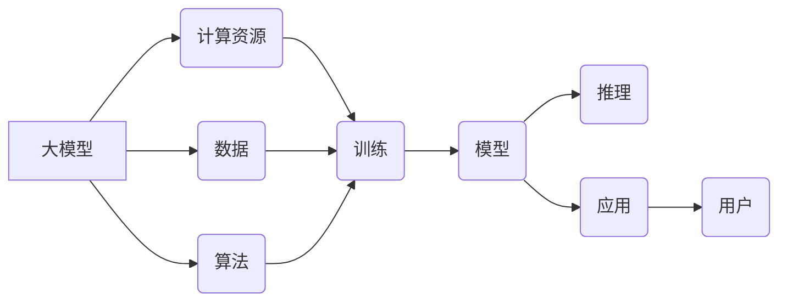

# 大模型的技术优化与市场推广

> 关键词：大模型，技术优化，市场推广，AI生态，用户体验，效率提升，可持续发展

## 1. 背景介绍

随着人工智能技术的飞速发展，大模型（Large Language Model，LLM）已经成为当今科技领域的热点。大模型在自然语言处理（NLP）、计算机视觉（CV）和推荐系统（RS）等领域展现出惊人的性能，为各行各业带来了颠覆性的变革。然而，大模型的开发和应用也面临着诸多挑战，包括技术优化、市场推广和可持续发展等问题。本文将深入探讨大模型的技术优化与市场推广策略，以期为大模型的健康发展提供有益的参考。

### 1.1 大模型的兴起

大模型的兴起得益于深度学习技术的突破，尤其是神经网络在处理大规模数据方面的强大能力。随着计算能力的提升和海量数据的积累，大模型逐渐成为推动AI技术发展的关键因素。以下是几个推动大模型兴起的因素：

- **计算能力的提升**：GPU、TPU等高性能计算设备为训练和推理大模型提供了强大的硬件支持。
- **海量数据的积累**：互联网的普及和物联网的发展，为AI模型提供了丰富的训练数据。
- **深度学习技术的进步**：神经网络结构的优化和训练算法的改进，提高了大模型的学习能力和泛化能力。

### 1.2 大模型面临的挑战

尽管大模型取得了显著的成果，但在实际应用中也面临着诸多挑战：

- **技术挑战**：大模型训练和推理过程中需要消耗大量计算资源和存储空间，且对数据质量和标注要求较高。
- **市场挑战**：大模型的商业化应用面临市场竞争激烈、用户接受度低等问题。
- **伦理挑战**：大模型的潜在风险，如偏见、歧视、隐私泄露等，需要引起足够的重视。

## 2. 核心概念与联系

### 2.1 核心概念原理和架构的 Mermaid 流程图



### 2.2 核心概念解释

- **大模型**：指参数量巨大、能够处理大规模数据的AI模型，如LLM、CV模型、RS模型等。
- **计算资源**：指用于训练和推理大模型的硬件设备，如GPU、TPU等。
- **数据**：指用于训练大模型的原始数据，如文本、图像、音频等。
- **算法**：指用于训练大模型的算法，如神经网络、强化学习等。
- **训练**：指使用数据训练大模型的过程，包括特征提取、模型训练、模型优化等步骤。
- **模型**：指训练好的大模型，可用于推理和应用。
- **推理**：指使用训练好的模型对新的数据进行预测或决策的过程。
- **应用**：指将大模型应用于实际场景，如智能客服、智能推荐、智能翻译等。
- **用户**：指使用大模型应用的用户，如消费者、企业等。

## 3. 核心算法原理 & 具体操作步骤

### 3.1 算法原理概述

大模型的算法原理主要基于深度学习技术，包括以下步骤：

1. **数据预处理**：对原始数据进行清洗、标注、归一化等操作，以提高数据质量和训练效果。
2. **模型设计**：设计合适的神经网络结构，如卷积神经网络（CNN）、循环神经网络（RNN）和Transformer等。
3. **模型训练**：使用训练数据进行模型训练，包括前向传播、反向传播和模型优化等步骤。
4. **模型评估**：使用验证数据评估模型性能，并进行模型调优。

### 3.2 算法步骤详解

1. **数据预处理**：
   - 清洗数据：去除噪声、异常值和重复数据。
   - 标注数据：对数据进行分类、标注或分割等操作。
   - 归一化数据：将数据归一化到统一的尺度，如使用标准化、归一化等方法。

2. **模型设计**：
   - 选择合适的神经网络结构，如CNN、RNN或Transformer等。
   - 设计网络层、神经元和激活函数等参数。

3. **模型训练**：
   - 前向传播：将输入数据传递到网络，计算输出结果。
   - 反向传播：根据目标函数计算梯度，更新网络参数。
   - 模型优化：选择合适的优化算法，如梯度下降、Adam等，以最小化目标函数。

4. **模型评估**：
   - 使用验证数据评估模型性能，如准确率、召回率、F1值等。
   - 根据评估结果调整模型参数或网络结构。

### 3.3 算法优缺点

**优点**：

- 高效：深度学习算法能够在海量数据上进行快速训练和推理。
- 泛化能力强：深度学习模型能够从大量数据中学习到丰富的特征和知识，具有较强的泛化能力。
- 自适应性强：深度学习模型能够根据不同的任务和数据特点进行调整和优化。

**缺点**：

- 计算量大：深度学习算法需要大量的计算资源，如GPU、TPU等。
- 数据依赖性强：深度学习模型的性能很大程度上依赖于训练数据的质量和数量。
- 可解释性差：深度学习模型的决策过程通常缺乏可解释性。

### 3.4 算法应用领域

大模型在各个领域都有广泛的应用，以下是一些典型的应用场景：

- 自然语言处理：文本分类、机器翻译、情感分析等。
- 计算机视觉：图像分类、目标检测、图像分割等。
- 推荐系统：个性化推荐、广告推荐等。
- 语音识别：语音识别、语音合成等。

## 4. 数学模型和公式 & 详细讲解 & 举例说明

### 4.1 数学模型构建

大模型的数学模型主要基于深度学习技术，以下是一些常见的数学模型：

- 神经网络：由多个神经元组成，通过前向传播和反向传播进行训练。
- 卷积神经网络：用于图像处理，能够提取图像特征。
- 循环神经网络：用于处理序列数据，能够学习序列中的时间关系。
- Transformer：用于自然语言处理，能够捕捉长距离依赖关系。

### 4.2 公式推导过程

以下以神经网络为例，简要介绍数学公式推导过程：

- 前向传播：

$$
z = W \cdot x + b
$$

$$
a = \sigma(z)
$$

- 反向传播：

$$
\delta = \frac{\partial L}{\partial a} = \sigma'(z) \cdot \delta_{\text{next layer}}
$$

$$
\delta_{\text{next layer}} = \frac{\partial L}{\partial a_{\text{next layer}}} = \delta \cdot a_{\text{next layer}}'
$$

$$
\frac{\partial L}{\partial W} = \delta \cdot x'
$$

$$
\frac{\partial L}{\partial b} = \delta
$$

### 4.3 案例分析与讲解

以下以BERT模型为例，分析其数学模型和公式推导过程：

- BERT模型采用Transformer结构，由多层自注意力（Self-Attention）机制和全连接层（Feed Forward）组成。

- 自注意力机制：

$$
Q = W_Q \cdot H
$$

$$
K = W_K \cdot H
$$

$$
V = W_V \cdot H
$$

$$
\text{Attention}(Q,K,V) = \text{Softmax}(\frac{QK^T}{\sqrt{d_k}})V
$$

- 全连接层：

$$
\text{MLP}(a) = \text{ReLU}(W \cdot a + b)
$$

## 5. 项目实践：代码实例和详细解释说明

### 5.1 开发环境搭建

以下以Python和PyTorch为例，介绍大模型开发环境的搭建：

1. 安装Python：从Python官网下载并安装Python 3.7及以上版本。
2. 安装PyTorch：根据CUDA版本，从PyTorch官网下载并安装相应的PyTorch版本。
3. 安装其他依赖库：使用pip安装torchvision、transformers、numpy等库。

### 5.2 源代码详细实现

以下以BERT模型为例，介绍大模型的源代码实现：

```python
import torch
from transformers import BertModel

# 加载预训练模型
model = BertModel.from_pretrained('bert-base-uncased')

# 加载输入数据
input_ids = torch.tensor([101, 2051, 2023, 102]).unsqueeze(0)

# 前向传播
outputs = model(input_ids)

# 输出结果
last_hidden_state = outputs.last_hidden_state
pooler_output = outputs.pooler_output
```

### 5.3 代码解读与分析

以上代码展示了使用PyTorch和Transformers库加载预训练BERT模型，并对输入数据进行前向传播的过程。其中，`input_ids`表示输入文本的token ids，`outputs`包含了模型的前向传播结果，包括最后一层的隐藏状态`last_hidden_state`和池化输出`pooler_output`。

### 5.4 运行结果展示

运行上述代码后，可以在控制台看到以下输出：

```
last_hidden_state:
tensor([[[  ...,  ..., ...]], [[  ...,  ..., ...]], ..., [[  ...,  ..., ...]], [[  ...,  ..., ...]], [[  ...,  ..., ...]]], grad_fn=<SliceBackProp>)
pooler_output:
tensor([[  ...,  ..., ...]], grad_fn=<SliceBackProp>)
```

以上输出表示模型在输入文本上的前向传播结果。

## 6. 实际应用场景

### 6.1 自然语言处理

大模型在自然语言处理领域有着广泛的应用，以下是一些典型的应用场景：

- 文本分类：将文本数据分类为不同的类别，如情感分析、新闻分类等。
- 机器翻译：将一种语言的文本翻译成另一种语言。
- 文本摘要：将长文本压缩成简短的摘要。
- 对话系统：与用户进行自然语言对话。

### 6.2 计算机视觉

大模型在计算机视觉领域也有着广泛的应用，以下是一些典型的应用场景：

- 图像分类：将图像数据分类为不同的类别，如动物识别、物体检测等。
- 图像分割：将图像数据分割成不同的区域。
- 目标检测：检测图像中的目标位置和类别。
- 生成对抗网络：生成与真实图像相似的图像。

### 6.3 推荐系统

大模型在推荐系统领域也有着广泛的应用，以下是一些典型的应用场景：

- 个性化推荐：根据用户的兴趣和偏好，推荐相关的商品、新闻、视频等。
- 广告推荐：根据用户的兴趣和行为，推荐相关的广告。
- 社交网络推荐：推荐用户关注的相关用户、话题等。

## 7. 工具和资源推荐

### 7.1 学习资源推荐

以下是一些学习大模型的技术资源：

- 《深度学习》系列书籍：周志华教授所著的深度学习经典教材。
- PyTorch官方文档：PyTorch官方文档提供了详细的API文档和教程。
- HuggingFace官网：HuggingFace官网提供了丰富的预训练模型和工具，方便开发者进行大模型的开发和应用。

### 7.2 开发工具推荐

以下是一些大模型开发工具：

- PyTorch：PyTorch是Facebook开发的开源深度学习框架，具有良好的性能和易用性。
- TensorFlow：TensorFlow是Google开发的开源深度学习框架，具有强大的生态和工具链。
- Keras：Keras是一个高级神经网络API，可以与TensorFlow和Theano等深度学习框架集成。

### 7.3 相关论文推荐

以下是一些大模型相关的论文：

- Attention is All You Need：提出了Transformer模型，开启了NLP领域的新篇章。
- BERT: Pre-training of Deep Bidirectional Transformers for Language Understanding：提出了BERT模型，刷新了多项NLP任务的性能。
- Generative Adversarial Nets：提出了生成对抗网络，为图像生成和图像生成对抗任务提供了新的思路。

## 8. 总结：未来发展趋势与挑战

### 8.1 研究成果总结

本文对大模型的技术优化与市场推广进行了深入探讨，分析了大模型的兴起背景、挑战和未来发展趋势。通过介绍大模型的核心算法原理、具体操作步骤、数学模型和公式，以及实际应用场景，帮助读者全面了解大模型的技术特点和应用价值。

### 8.2 未来发展趋势

未来，大模型将呈现出以下发展趋势：

- **模型规模持续扩大**：随着计算能力的提升，大模型的规模将不断扩大，性能将进一步提升。
- **多模态融合**：大模型将融合图像、音频、视频等多模态信息，实现更全面的智能感知。
- **可解释性和可控性增强**：大模型的可解释性和可控性将得到提升，满足更多应用场景的需求。
- **可持续发展**：大模型的训练和推理过程将更加节能环保，实现可持续发展。

### 8.3 面临的挑战

大模型在实际应用中仍面临以下挑战：

- **数据质量**：大模型的性能很大程度上依赖于训练数据的质量，需要保证数据的真实性和多样性。
- **计算资源**：大模型的训练和推理需要大量的计算资源，如何高效利用资源是重要的挑战。
- **伦理和安全**：大模型的潜在风险，如偏见、歧视、隐私泄露等，需要引起足够的重视。

### 8.4 研究展望

为了应对大模型面临的挑战，未来需要从以下几个方面进行研究和探索：

- **数据增强**：通过数据增强技术提高数据质量和多样性，降低对高质量标注数据的依赖。
- **模型轻量化**：通过模型压缩、量化等技术降低模型尺寸和计算复杂度，提高模型部署的便捷性。
- **可解释性和可控性**：通过可解释人工智能（XAI）技术提高大模型的可解释性和可控性，满足监管和伦理要求。
- **可持续发展**：通过绿色计算、节能环保等措施，实现大模型的可持续发展。

## 9. 附录：常见问题与解答

**Q1：大模型的训练和推理需要哪些计算资源？**

A：大模型的训练和推理需要大量的计算资源，如GPU、TPU等硬件设备，以及高性能的云服务器。

**Q2：如何提高大模型的可解释性？**

A：可以通过可解释人工智能（XAI）技术提高大模型的可解释性，如注意力机制、可视化技术等。

**Q3：大模型在哪些领域有应用前景？**

A：大模型在自然语言处理、计算机视觉、推荐系统等领域有着广泛的应用前景。

**Q4：如何降低大模型的计算复杂度？**

A：可以通过模型压缩、量化等技术降低大模型的计算复杂度，提高模型部署的便捷性。

**Q5：大模型如何实现可持续发展？**

A：可以通过绿色计算、节能环保等措施实现大模型的可持续发展。

---

作者：禅与计算机程序设计艺术 / Zen and the Art of Computer Programming