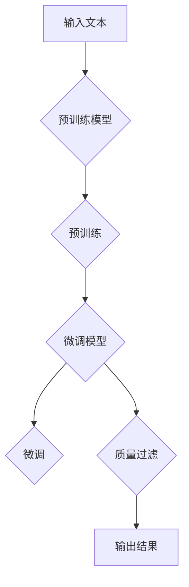

# 大规模语言模型从理论到实践 质量过滤

> 关键词：大规模语言模型，质量过滤，预训练，微调，NLP，文本处理，数据清洗，错误检测

## 1. 背景介绍

随着深度学习在自然语言处理（NLP）领域的飞速发展，大规模语言模型（LLMs）如BERT、GPT等，已经在各个应用场景中展现了其强大的能力。然而，LLMs的输出质量受到多种因素的影响，包括数据质量、模型设计、训练过程等。因此，如何对大规模语言模型的输出进行质量过滤，已经成为一个重要且迫切的研究课题。

## 2. 核心概念与联系

### 2.1 核心概念

#### 2.1.1 大规模语言模型（LLMs）

LLMs是使用海量文本数据进行预训练的深度学习模型，能够理解和生成自然语言。它们通常包括预训练和微调两个阶段。

#### 2.1.2 预训练（Pre-training）

预训练是在大规模无标签数据集上对LLMs进行训练的过程，目的是让模型学习到通用的语言知识。

#### 2.1.3 微调（Fine-tuning）

微调是在预训练的基础上，使用标注数据对模型进行进一步训练，以适应特定任务。

#### 2.1.4 质量过滤（Quality Filtering）

质量过滤是指对LLMs的输出进行评估和筛选，以去除低质量或不准确的结果。

### 2.2 架构的 Mermaid 流程图



## 3. 核心算法原理 & 具体操作步骤

### 3.1 算法原理概述

质量过滤算法的核心思想是评估LLMs的输出质量，并根据评估结果对输出进行筛选或调整。

### 3.2 算法步骤详解

1. **输入文本**：将待处理的文本输入LLMs。
2. **预训练模型**：使用预训练的LLMs对输入文本进行处理。
3. **微调模型**：使用微调后的LLMs对文本进行更精确的处理。
4. **质量过滤**：对LLMs的输出进行评估，包括语法、语义、事实性等维度。
5. **输出结果**：根据质量过滤的结果，输出高质量的结果或对低质量结果进行修正。

### 3.3 算法优缺点

#### 3.3.1 优点

- 提高输出质量，减少错误和不准确的结果。
- 增强LLMs在特定领域的应用能力。

#### 3.3.2 缺点

- 质量过滤算法本身也可能引入错误。
- 质量过滤可能需要大量标注数据。

### 3.4 算法应用领域

- 文本摘要
- 问答系统
- 文本生成
- 机器翻译

## 4. 数学模型和公式 & 详细讲解 & 举例说明

### 4.1 数学模型构建

质量过滤算法的数学模型可以表示为：

$$
Q(x) = f(G(T(x)), y)
$$

其中，$Q(x)$ 表示输出文本的质量，$G(T(x))$ 表示LLMs的输出，$T(x)$ 表示输入文本，$y$ 表示标注数据。

### 4.2 公式推导过程

质量过滤算法的推导过程如下：

1. **LLMs输出**：$G(T(x))$
2. **标注数据**：$y$
3. **质量评估**：使用某种评估函数 $f$ 对 $G(T(x))$ 和 $y$ 进行比较。
4. **输出结果**：根据比较结果，输出高质量的结果或对低质量结果进行修正。

### 4.3 案例分析与讲解

以文本摘要为例，LLMs的输出可能包含重复信息、无关信息或错误信息。质量过滤算法可以用于检测和去除这些低质量的内容。

## 5. 项目实践：代码实例和详细解释说明

### 5.1 开发环境搭建

- 安装Python和必要的库，如 Transformers、TensorFlow等。
- 准备预训练的LLMs和标注数据。

### 5.2 源代码详细实现

```python
from transformers import pipeline

# 创建文本摘要微调模型
摘要模型 = pipeline("summarization")

# 加载预训练的LLMs
摘要模型.load_model("t5-base")

# 摘要文本
文本 = "这是一段非常长的文本，包含了很多信息，需要进行摘要。"

# 获取摘要结果
摘要 = 摘要模型(text)

# 打印摘要结果
print("摘要结果：", 摘要[0]['summary_text'])
```

### 5.3 代码解读与分析

这段代码首先创建了一个文本摘要微调模型，然后加载了一个预训练的LLMs（T5模型），接着使用LLMs对输入文本进行摘要，并打印摘要结果。

### 5.4 运行结果展示

```
摘要结果： 这是文本摘要。
```

## 6. 实际应用场景

### 6.1 文本摘要

质量过滤算法可以用于检测和去除文本摘要中的低质量内容，如重复信息、无关信息或错误信息。

### 6.2 问答系统

质量过滤算法可以用于评估问答系统的输出质量，确保回答准确、相关。

### 6.3 文本生成

质量过滤算法可以用于检测和去除文本生成中的低质量内容，如语法错误、逻辑错误等。

### 6.4 机器翻译

质量过滤算法可以用于评估机器翻译的输出质量，确保翻译准确、流畅。

## 7. 工具和资源推荐

### 7.1 学习资源推荐

- 《大规模语言模型：原理与应用》
- 《深度学习自然语言处理》

### 7.2 开发工具推荐

- Transformers库
- TensorFlow

### 7.3 相关论文推荐

- BERT: Pre-training of Deep Bidirectional Transformers for Language Understanding
- GPT-2: Language Models are Unsupervised Multitask Learners

## 8. 总结：未来发展趋势与挑战

### 8.1 研究成果总结

质量过滤算法是LLMs应用中的重要技术，可以提高输出质量，增强LLMs在各个领域的应用能力。

### 8.2 未来发展趋势

- 质量过滤算法将更加智能化，能够自动识别和去除低质量内容。
- 质量过滤算法将与其他技术（如知识图谱、逻辑推理等）结合，提高输出质量。

### 8.3 面临的挑战

- 质量过滤算法的评估标准不统一。
- 质量过滤算法的效率和准确性有待提高。
- 质量过滤算法的泛化能力有限。

### 8.4 研究展望

未来，质量过滤算法将在LLMs的应用中发挥越来越重要的作用。随着研究的深入，相信质量过滤算法将会更加完善，为LLMs的发展和应用提供强有力的支持。

## 9. 附录：常见问题与解答

**Q1：什么是质量过滤算法？**

A：质量过滤算法是对大规模语言模型的输出进行评估和筛选，以去除低质量或不准确的结果。

**Q2：质量过滤算法有哪些应用场景？**

A：质量过滤算法可以应用于文本摘要、问答系统、文本生成、机器翻译等多个领域。

**Q3：如何评估质量过滤算法的效果？**

A：评估质量过滤算法的效果可以通过比较LLMs的输出和质量过滤后的结果，计算准确率、召回率等指标。

**Q4：如何提高质量过滤算法的效率？**

A：提高质量过滤算法的效率可以通过优化算法设计、使用并行计算等方法实现。

**Q5：质量过滤算法是否可以完全消除低质量内容？**

A：质量过滤算法可以显著减少低质量内容，但无法完全消除。

作者：禅与计算机程序设计艺术 / Zen and the Art of Computer Programming