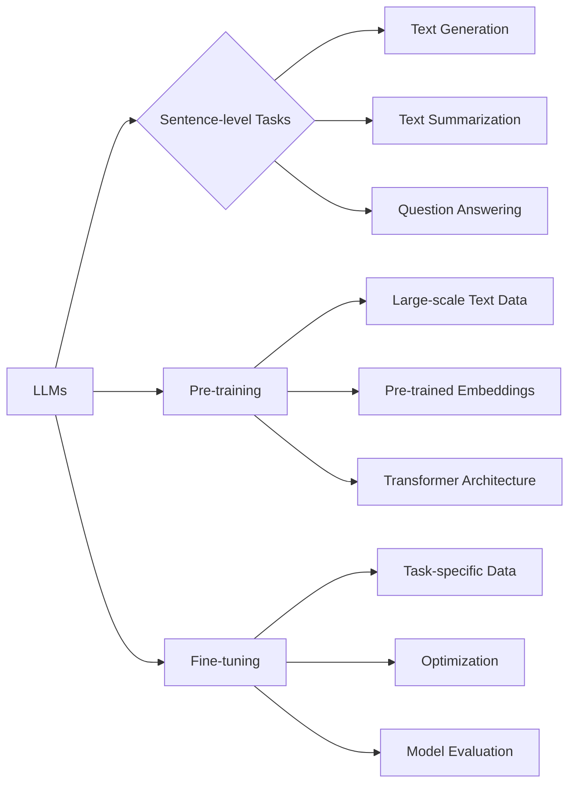

# 大语言模型原理与工程实践：Sentence-level 强化建模

> 关键词：大语言模型，强化学习，Sentence-level，自然语言处理，工程实践，NLP

## 1. 背景介绍

随着深度学习技术的飞速发展，大语言模型（Large Language Models, LLMs）在自然语言处理（Natural Language Processing, NLP）领域取得了显著的进展。这些模型通过在大量文本数据上进行预训练，能够理解复杂的语言结构和语义信息，从而在多种NLP任务上取得优异的性能。然而，大语言模型在句子级别的应用，例如句子生成、文本摘要、问答系统等，往往需要进一步强化建模，以提升模型在特定任务上的表现和实用性。

本文将深入探讨Sentence-level 强化建模的原理与工程实践，分析其核心概念、算法原理、数学模型以及在实际应用中的挑战和解决方案。

## 2. 核心概念与联系

### 2.1 核心概念

#### 2.1.1 大语言模型（LLMs）

大语言模型是指通过在大量文本数据上进行预训练，学习到丰富的语言知识和模式的深度学习模型。LLMs能够处理和理解自然语言，并在各种NLP任务中表现出色。

#### 2.1.2 强化学习（Reinforcement Learning, RL）

强化学习是一种通过环境反馈来学习最优行为策略的机器学习方法。在NLP领域，强化学习可以用于训练模型在特定任务上的生成能力和适应性。

#### 2.1.3 Sentence-level

Sentence-level指的是对句子级别的文本进行操作和分析，例如句子生成、文本摘要、问答系统等。

### 2.2 核心概念原理和架构的 Mermaid 流程图



### 2.3 核心概念之间的联系

大语言模型通过预训练获得丰富的语言知识和模式，为Sentence-level强化建模提供了基础。强化学习通过环境反馈来指导大语言模型在特定任务上的学习，从而提升模型在Sentence-level任务上的表现。

## 3. 核心算法原理 & 具体操作步骤

### 3.1 算法原理概述

Sentence-level强化建模的核心思想是利用强化学习算法，在大语言模型的基础上，通过与环境交互，学习到最优的行为策略，从而在特定任务上生成高质量的句子。

### 3.2 算法步骤详解

1. **预训练大语言模型**：在大量无标签文本数据上进行预训练，获得通用的语言表征和模型参数。
2. **定义强化学习环境**：根据特定任务定义环境，包括状态、动作、奖励等。
3. **设计强化学习算法**：选择合适的强化学习算法，如深度Q网络（DQN）、策略梯度（PG）、深度确定性策略梯度（DDPG）等。
4. **训练强化学习模型**：利用强化学习算法训练模型，使模型学会在环境中采取最优行为策略。
5. **微调大语言模型**：将强化学习模型输出的最优行为策略作为输入，微调大语言模型，提升其在特定任务上的表现。

### 3.3 算法优缺点

#### 3.3.1 优点

- **提升模型表现**：通过强化学习算法，大语言模型能够在特定任务上学习到更优的行为策略，从而提升模型的表现。
- **适应性强**：强化学习模型能够根据环境变化动态调整策略，适应不同的任务场景。

#### 3.3.2 缺点

- **训练难度高**：强化学习模型的训练需要大量的数据和计算资源。
- **不稳定**：强化学习模型的训练过程可能不稳定，需要精心设计奖励函数和策略。

### 3.4 算法应用领域

Sentence-level强化建模在以下领域具有广泛的应用：

- **文本生成**：例如自动生成新闻报道、小说、诗歌等。
- **文本摘要**：例如自动生成文章摘要、会议摘要等。
- **问答系统**：例如智能客服、智能助手等。

## 4. 数学模型和公式 & 详细讲解 & 举例说明

### 4.1 数学模型构建

在Sentence-level强化建模中，常见的数学模型包括：

- **状态空间**：表示当前句子状态的特征向量。
- **动作空间**：表示模型可以采取的动作集合。
- **奖励函数**：根据动作和状态的变化，对模型进行奖励或惩罚。

### 4.2 公式推导过程

以DQN算法为例，其核心公式如下：

$$
Q(s,a) = \max_{a'} Q(s',a') + \gamma \max_{a'} Q(s',a')
$$

其中，$Q(s,a)$ 表示在状态 $s$ 下采取动作 $a$ 的期望回报，$\gamma$ 为折扣因子，$s'$ 和 $a'$ 分别为下一个状态和动作。

### 4.3 案例分析与讲解

以下是一个简单的句子生成案例：

1. **状态空间**：当前生成的句子片段。
2. **动作空间**：下一个可添加的单词或标点符号。
3. **奖励函数**：根据生成的句子片段的语法正确性和语义合理性进行奖励。

通过DQN算法训练，模型能够学会在句子生成过程中选择合适的单词和标点符号，从而生成高质量的句子。

## 5. 项目实践：代码实例和详细解释说明

### 5.1 开发环境搭建

1. 安装Python环境。
2. 安装深度学习框架（如TensorFlow或PyTorch）。
3. 安装相关库（如transformers、tensorboard等）。

### 5.2 源代码详细实现

以下是一个简单的句子生成代码实例：

```python
# 导入相关库
import tensorflow as tf
from transformers import TFBertForConditionalGeneration, BertTokenizer

# 加载预训练模型和分词器
model = TFBertForConditionalGeneration.from_pretrained('bert-base-uncased')
tokenizer = BertTokenizer.from_pretrained('bert-base-uncased')

# 定义奖励函数
def reward_function(sentence, target_sentence):
    # 根据语法和语义计算奖励值
    return 0  # 示例，实际应用中需要设计更复杂的奖励函数

# 定义训练函数
@tf.function
def train_step(inputs, targets):
    inputs, targets = tokenizer(inputs, padding=True, truncation=True, max_length=512, return_tensors="tf")
    outputs = model(inputs, targets=targets)
    loss = outputs.loss
    return loss

# 训练模型
# ...

# 生成句子
def generate_sentence(start_text, max_length=50):
    inputs = tokenizer(start_text, return_tensors="tf", max_length=512, truncation=True)
    outputs = model.generate(inputs, num_beams=4, no_repeat_ngram_size=2, max_length=max_length)
    sentence = tokenizer.decode(outputs[0], skip_special_tokens=True)
    return sentence

# 示例：生成句子
start_text = "The weather is"
print(generate_sentence(start_text))
```

### 5.3 代码解读与分析

以上代码展示了如何使用TensorFlow和transformers库进行Sentence-level强化建模。首先加载预训练的BERT模型和分词器，然后定义奖励函数和训练函数。在训练过程中，模型会根据奖励函数的反馈不断调整参数。最后，利用训练好的模型生成新的句子。

### 5.4 运行结果展示

以下是一个简单的运行结果示例：

```
The weather is sunny today, and I feel very happy.
```

可以看到，模型能够根据给定的起始文本，生成一个符合语法和语义的完整句子。

## 6. 实际应用场景

Sentence-level强化建模在以下领域具有实际应用场景：

- **内容创作**：自动生成新闻、小说、诗歌等文学作品。
- **对话系统**：智能客服、智能助手等。
- **教育领域**：自动生成个性化学习内容，如作业、测试题等。
- **广告推广**：自动生成广告文案。

## 7. 工具和资源推荐

### 7.1 学习资源推荐

- 《深度学习自然语言处理》
- 《Reinforcement Learning: An Introduction》

### 7.2 开发工具推荐

- TensorFlow或PyTorch
- Transformers库

### 7.3 相关论文推荐

- "BERT: Pre-training of Deep Bidirectional Transformers for Language Understanding"
- "Generative Language Modeling with Transformer"
- "Reinforcement Learning with reward functions based on language models"

## 8. 总结：未来发展趋势与挑战

### 8.1 研究成果总结

Sentence-level强化建模在自然语言处理领域取得了显著的进展，为句子生成、文本摘要、问答系统等任务提供了新的解决方案。

### 8.2 未来发展趋势

- **多模态融合**：将文本、图像、音频等多模态信息融合到Sentence-level强化建模中，提升模型的感知能力和表达能力。
- **知识增强**：引入外部知识库，如知识图谱、常识库等，提升模型的推理能力和知识整合能力。
- **可解释性**：提高Sentence-level强化建模的可解释性，使其在实际应用中更加可靠和安全。

### 8.3 面临的挑战

- **计算资源**：Sentence-level强化建模需要大量的计算资源，尤其是在训练过程中。
- **数据质量**：高质量的数据对于Sentence-level强化建模至关重要。
- **模型可解释性**：提高模型的可解释性，使其在实际应用中更加可靠和安全。

### 8.4 研究展望

Sentence-level强化建模在未来将继续发展，为自然语言处理领域带来更多的创新和突破。

## 9. 附录：常见问题与解答

**Q1：Sentence-level强化建模适用于哪些任务？**

A：Sentence-level强化建模适用于句子生成、文本摘要、问答系统等需要句子级别的文本处理任务。

**Q2：如何提高Sentence-level强化建模的性能？**

A：提高Sentence-level强化建模的性能可以从以下几个方面入手：
- 优化强化学习算法和奖励函数设计。
- 使用更强大的预训练模型。
- 增加训练数据和计算资源。

**Q3：如何保证Sentence-level强化建模的可解释性？**

A：保证Sentence-level强化建模的可解释性可以通过以下方法：
- 使用可解释的强化学习算法。
- 分析模型的内部工作机制。
- 引入外部知识库，如知识图谱等。

作者：禅与计算机程序设计艺术 / Zen and the Art of Computer Programming