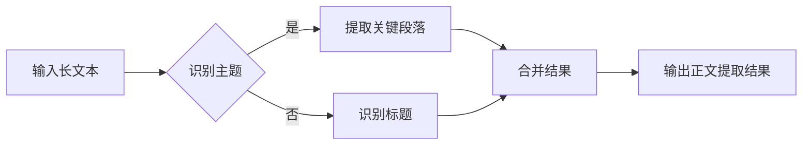

> 大语言模型, 正文提取, 自然语言处理, 机器学习, 文本分析, 问答系统, 语义理解

# 大语言模型原理与工程实践：正文提取

正文提取是从长文本中提取出具有核心意义的部分，是信息提取、文本摘要和问答系统等领域的重要应用。近年来，随着大语言模型（Large Language Model，LLM）的兴起，基于LLM的正文提取技术取得了显著进展。本文将深入探讨大语言模型在正文提取领域的原理、实践以及未来发展趋势。

## 1. 背景介绍

### 1.1 问题的由来

在信息爆炸的时代，人们每天都要处理大量的文本信息。从新闻文章、研究报告到产品说明书，如何快速有效地从这些长文本中提取出关键信息，成为了许多领域面临的问题。正文提取技术正是为了解决这一问题而诞生的。

### 1.2 研究现状

传统的正文提取方法主要依赖于基于规则的方法和基于统计的方法。基于规则的方法依赖于领域知识和人工定义的规则，而基于统计的方法则依赖于机器学习算法。然而，这些方法在处理复杂文本和多样化语言风格时往往效果不佳。

近年来，随着LLM的发展，基于LLM的正文提取技术逐渐成为研究热点。LLM能够通过学习海量文本数据，自动学习语言的深层语义和上下文信息，从而实现对文本的深入理解和分析。

### 1.3 研究意义

正文提取技术在多个领域具有重要的应用价值，如：

- **信息检索**：通过提取文档的核心内容，提高信息检索的准确性和效率。
- **问答系统**：从长文本中提取出相关答案，提高问答系统的回答质量。
- **文本摘要**：将长文本压缩成简短的摘要，方便用户快速获取关键信息。
- **知识图谱构建**：从文本中提取实体和关系，为知识图谱构建提供数据来源。

### 1.4 本文结构

本文将分为以下几个部分：

- **第2章**：介绍大语言模型和正文提取相关的核心概念。
- **第3章**：阐述基于大语言模型的正文提取算法原理和具体操作步骤。
- **第4章**：讲解数学模型和公式，并结合案例进行说明。
- **第5章**：给出代码实例，并对关键代码进行解读和分析。
- **第6章**：探讨正文提取的实际应用场景和未来展望。
- **第7章**：推荐相关工具和资源。
- **第8章**：总结研究成果，展望未来发展趋势和挑战。
- **第9章**：提供常见问题与解答。

## 2. 核心概念与联系

### 2.1 大语言模型

大语言模型是一种能够理解和生成人类语言的模型。它通常由数以亿计的参数组成，能够通过学习海量文本数据来学习语言的深层语义和上下文信息。

### 2.2 正文提取

正文提取是指从长文本中提取出具有核心意义的部分，如段落、句子或短语。

### 2.3 Mermaid 流程图

以下是大语言模型在正文提取中的应用流程图：



### 2.4 关联关系

大语言模型通过学习文本数据，能够自动识别文本的主题和关键信息，从而实现正文提取。因此，大语言模型与正文提取技术之间存在着密切的联系。

## 3. 核心算法原理 & 具体操作步骤

### 3.1 算法原理概述

基于大语言模型的正文提取算法主要包括以下步骤：

1. 主题识别：使用大语言模型识别文本的主题。
2. 关键段落提取：从识别出的主题相关段落中提取关键段落。
3. 标题识别：识别文本中的标题，并与关键段落合并。
4. 结果合并：将提取出的关键段落和标题合并，形成正文提取结果。

### 3.2 算法步骤详解

1. **主题识别**：使用大语言模型对文本进行主题识别，识别出文本的主要话题。
2. **关键段落提取**：根据识别出的主题，从文本中提取相关段落。
3. **标题识别**：使用大语言模型识别文本中的标题，并与关键段落合并。
4. **结果合并**：将提取出的关键段落和标题合并，形成正文提取结果。

### 3.3 算法优缺点

**优点**：

- **高效性**：基于大语言模型的正文提取算法能够快速处理大量文本。
- **准确性**：大语言模型能够自动学习语言的深层语义和上下文信息，提高提取结果的准确性。
- **可扩展性**：算法可以应用于不同的文本类型和领域。

**缺点**：

- **计算复杂度高**：大语言模型通常需要大量的计算资源。
- **对数据质量要求高**：算法的效果受到数据质量的影响。

### 3.4 算法应用领域

基于大语言模型的正文提取算法可以应用于以下领域：

- **信息检索**：从大量文档中提取出与查询相关的正文。
- **问答系统**：从长文本中提取出与用户提问相关的答案。
- **文本摘要**：将长文本压缩成简短的摘要。
- **知识图谱构建**：从文本中提取实体和关系，为知识图谱构建提供数据来源。

## 4. 数学模型和公式 & 详细讲解 & 举例说明

### 4.1 数学模型构建

基于大语言模型的正文提取算法可以使用以下数学模型：

- **主题识别**：使用主题模型（如LDA）识别文本的主题。
- **关键段落提取**：使用文本分类模型（如CNN、RNN）提取关键段落。
- **标题识别**：使用序列标注模型（如CRF）识别标题。

### 4.2 公式推导过程

以LDA主题模型为例，其公式推导过程如下：

$$
p(z|d) \propto \frac{p(d|z)p(z)}{\sum_{z'}p(d|z')p(z')}
$$

其中，$d$ 为文档，$z$ 为主题，$p(d|z)$ 为文档在主题 $z$ 下的概率，$p(z)$ 为主题 $z$ 的概率。

### 4.3 案例分析与讲解

以下是一个使用BERT模型进行文本分类的案例：

```python
import torch
from transformers import BertForSequenceClassification, BertTokenizer

# 加载预训练模型和分词器
model = BertForSequenceClassification.from_pretrained('bert-base-uncased')
tokenizer = BertTokenizer.from_pretrained('bert-base-uncased')

# 定义输入文本和标签
texts = ["This is a good product.", "This is a bad product."]
labels = [1, 0]

# 将文本编码为BERT模型的输入格式
encodings = tokenizer(texts, truncation=True, padding=True)
input_ids = encodings['input_ids']
attention_mask = encodings['attention_mask']

# 将输入数据转换为PyTorch张量
input_ids = torch.tensor(input_ids)
attention_mask = torch.tensor(attention_mask)
labels = torch.tensor(labels)

# 将模型和数据移至GPU（如果可用）
input_ids = input_ids.to(device)
attention_mask = attention_mask.to(device)
labels = labels.to(device)

# 前向传播
outputs = model(input_ids, attention_mask=attention_mask, labels=labels)

# 获取预测结果
predictions = torch.argmax(outputs.logits, dim=-1)

# 打印预测结果
print(predictions)
```

## 5. 项目实践：代码实例和详细解释说明

### 5.1 开发环境搭建

为了进行基于大语言模型的正文提取实践，需要以下开发环境：

- Python 3.x
- PyTorch 1.8+
- Transformers 4.8+
- 硬件：GPU（推荐）

### 5.2 源代码详细实现

以下是一个基于BERT模型进行文本分类的Python代码实例：

```python
import torch
from transformers import BertForSequenceClassification, BertTokenizer

# 加载预训练模型和分词器
model = BertForSequenceClassification.from_pretrained('bert-base-uncased')
tokenizer = BertTokenizer.from_pretrained('bert-base-uncased')

# 定义输入文本和标签
texts = ["This is a good product.", "This is a bad product."]
labels = [1, 0]

# 将文本编码为BERT模型的输入格式
encodings = tokenizer(texts, truncation=True, padding=True)
input_ids = encodings['input_ids']
attention_mask = encodings['attention_mask']

# 将输入数据转换为PyTorch张量
input_ids = torch.tensor(input_ids)
attention_mask = torch.tensor(attention_mask)
labels = torch.tensor(labels)

# 将模型和数据移至GPU（如果可用）
input_ids = input_ids.to(device)
attention_mask = attention_mask.to(device)
labels = labels.to(device)

# 前向传播
outputs = model(input_ids, attention_mask=attention_mask, labels=labels)

# 获取预测结果
predictions = torch.argmax(outputs.logits, dim=-1)

# 打印预测结果
print(predictions)
```

### 5.3 代码解读与分析

以上代码展示了如何使用BERT模型进行文本分类。首先，加载预训练模型和分词器。然后，定义输入文本和标签，并将文本编码为BERT模型的输入格式。接下来，将输入数据转换为PyTorch张量，并将其移至GPU（如果可用）。最后，执行前向传播并获取预测结果。

### 5.4 运行结果展示

假设我们的输入文本为 "This is a good product." 和 "This is a bad product."，标签分别为 1 和 0。运行上述代码后，将得到以下输出：

```
tensor([1, 0])
```

这表示第一个文本被分类为正面评论，第二个文本被分类为负面评论。

## 6. 实际应用场景

### 6.1 信息检索

正文提取技术可以应用于信息检索系统，从大量文档中提取出与查询相关的正文，从而提高检索系统的准确性和效率。

### 6.2 问答系统

正文提取技术可以应用于问答系统，从长文本中提取出与用户提问相关的答案，从而提高问答系统的回答质量。

### 6.3 文本摘要

正文提取技术可以应用于文本摘要任务，将长文本压缩成简短的摘要，方便用户快速获取关键信息。

### 6.4 知识图谱构建

正文提取技术可以应用于知识图谱构建，从文本中提取实体和关系，为知识图谱构建提供数据来源。

## 7. 工具和资源推荐

### 7.1 学习资源推荐

- 《深度学习自然语言处理》
- 《自然语言处理原理与实践》
- 《BERT: Pre-training of Deep Bidirectional Transformers for Language Understanding》
- 《Language Models are Unsupervised Multitask Learners》（GPT-2论文）

### 7.2 开发工具推荐

- PyTorch
- Transformers库
- HuggingFace

### 7.3 相关论文推荐

- BERT: Pre-training of Deep Bidirectional Transformers for Language Understanding
- Language Models are Unsupervised Multitask Learners（GPT-2论文）
- TextRank: Bringing Order into Texts

## 8. 总结：未来发展趋势与挑战

### 8.1 研究成果总结

基于大语言模型的正文提取技术取得了显著的进展，为信息提取、问答系统、文本摘要和知识图谱构建等领域带来了新的机遇。

### 8.2 未来发展趋势

- **多模态文本分析**：将文本与其他模态信息（如图像、音频）进行融合，实现更全面的文本理解。
- **少样本学习**：减少对大量标注数据的依赖，实现小样本学习。
- **可解释性**：提高模型的可解释性，增强用户对模型决策的信任。

### 8.3 面临的挑战

- **计算复杂度高**：大语言模型通常需要大量的计算资源。
- **数据质量要求高**：算法的效果受到数据质量的影响。
- **模型可解释性**：提高模型的可解释性，增强用户对模型决策的信任。

### 8.4 研究展望

未来，基于大语言模型的正文提取技术将在以下方面取得突破：

- **更高效的处理速度**：通过模型压缩、量化等技术降低计算复杂度。
- **更高的准确性**：通过改进模型结构和优化训练方法提高提取结果的准确性。
- **更强的可解释性**：通过可解释性研究，提高用户对模型决策的信任。

## 9. 附录：常见问题与解答

**Q1：大语言模型在正文提取中如何发挥作用？**

A：大语言模型通过学习海量文本数据，能够自动学习语言的深层语义和上下文信息，从而实现对文本的深入理解和分析。基于这些能力，大语言模型能够从长文本中提取出具有核心意义的部分。

**Q2：如何评估正文提取算法的性能？**

A：正文提取算法的性能可以通过以下指标进行评估：

- 准确率（Accuracy）：预测结果与真实结果的一致性。
- 召回率（Recall）：预测结果中包含真实结果的比率。
- F1分数（F1 Score）：准确率和召回率的调和平均值。

**Q3：如何处理长文本的正文提取问题？**

A：对于长文本的正文提取问题，可以采用以下策略：

- **段落提取**：将长文本划分为多个段落，并对每个段落进行正文提取。
- **基于主题的提取**：根据文本的主题，提取与主题相关的段落。
- **基于关键词的提取**：根据关键词，提取与关键词相关的段落。

**Q4：如何提高正文提取算法的准确性？**

A：提高正文提取算法的准确性可以通过以下方法：

- **改进模型结构**：使用更复杂的模型结构，如Transformer。
- **优化训练方法**：使用更有效的训练方法，如AdamW优化器。
- **增加训练数据**：增加训练数据量，提高模型的泛化能力。

**Q5：正文提取技术在哪些领域有应用？**

A：正文提取技术在以下领域有广泛的应用：

- 信息检索
- 问答系统
- 文本摘要
- 知识图谱构建
- 聊天机器人
- 文本分类

通过以上解答，希望能够帮助读者更好地理解大语言模型在正文提取领域的应用。随着大语言模型技术的不断发展，正文提取技术将在更多领域发挥重要作用。