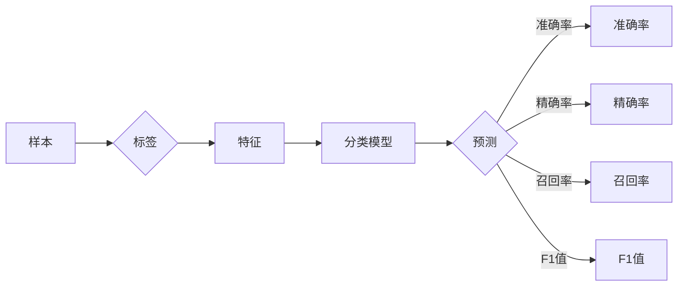

# 分类算法:监督学习中常用的分类算法及其优缺点

## 1. 背景介绍

### 1.1 问题的由来

分类算法是机器学习领域中最经典和广泛应用的算法之一。在现实世界中，我们经常需要对未知样本进行分类，例如垃圾邮件检测、图像分类、情感分析等。分类算法通过对已知样本的学习，自动建立分类模型，从而对未知样本进行预测。

### 1.2 研究现状

随着机器学习技术的不断发展，涌现出许多分类算法。这些算法在性能和适用场景上各有优劣，如何选择合适的分类算法成为研究者和工程师面临的重要问题。

### 1.3 研究意义

选择合适的分类算法对于模型的性能和应用效果至关重要。本文将详细介绍监督学习中常用的分类算法及其优缺点，帮助读者更好地理解和选择合适的分类算法。

### 1.4 本文结构

本文将分为以下几个部分：

- 核心概念与联系：介绍分类算法相关的基本概念和联系。
- 核心算法原理 & 具体操作步骤：详细介绍常用分类算法的原理和操作步骤。
- 数学模型和公式 & 详细讲解 & 举例说明：阐述分类算法的数学模型和公式，并结合实例进行讲解。
- 项目实践：给出分类算法的代码实例和详细解释说明。
- 实际应用场景：探讨分类算法在实际应用场景中的应用。
- 工具和资源推荐：推荐分类算法相关的学习资源、开发工具和参考文献。
- 总结：总结分类算法的研究成果、未来发展趋势和面临的挑战。

## 2. 核心概念与联系

为了更好地理解分类算法，首先介绍以下几个核心概念：

- 样本：指待分类的数据点，通常由一组特征组成。
- 标签：指样本所属的类别。
- 特征：指描述样本的属性或指标。
- 分类模型：指根据样本特征预测标签的函数。
- 准确率(Accuracy)：指模型预测正确的样本比例。
- 精确率(Precision)：指模型预测为正类的样本中，真正例的比例。
- 召回率(Recall)：指模型预测为正类的样本中，所有正例的比例。
- F1值(F1 Score)：指精确率和召回率的调和平均，综合考虑了精确率和召回率。

这些概念之间的关系可以用以下Mermaid流程图表示：



## 3. 核心算法原理 & 具体操作步骤

### 3.1 算法原理概述

监督学习中的分类算法主要分为以下几类：

- 线性模型：基于线性函数对样本进行分类，如逻辑回归、支持向量机(SVM)等。
- 决策树：通过一系列决策规则对样本进行分类，如CART、ID3等。
- 随机森林：基于集成学习的决策树模型，具有较好的泛化能力。
- K最近邻(KNN)：基于距离相似度对样本进行分类。
- 神经网络：基于神经元之间的连接和激活函数对样本进行分类，如多层感知器、卷积神经网络(CNN)等。

### 3.2 算法步骤详解

以下以逻辑回归为例，介绍分类算法的具体操作步骤：

1. 数据预处理：将样本数据转换为数值型，并划分训练集和测试集。
2. 模型初始化：初始化模型参数，如权重和偏置。
3. 梯度下降：使用梯度下降法更新模型参数，最小化损失函数。
4. 评估模型：在测试集上评估模型性能，如准确率、精确率、召回率和F1值等。

### 3.3 算法优缺点

以下是几种常用分类算法的优缺点：

- 逻辑回归：
  - 优点：简单易理解，计算效率高，对异常值不敏感。
  - 缺点：只能处理线性可分的问题，对非线性问题效果较差。
- 支持向量机(SVM)：
  - 优点：能够处理非线性问题，具有较好的泛化能力。
  - 缺点：对参数选择敏感，计算复杂度高。
- 决策树：
  - 优点：易于理解和解释，对异常值不敏感。
  - 缺点：容易过拟合，容易产生过多的规则。
- 随机森林：
  - 优点：具有较好的泛化能力，对参数选择不敏感。
  - 缺点：难以解释，容易过拟合。
- K最近邻(KNN)：
  - 优点：简单易实现，对异常值不敏感。
  - 缺点：计算复杂度高，对参数选择敏感，难以解释。
- 神经网络：
  - 优点：能够处理非线性问题，泛化能力强。
  - 缺点：需要大量的数据和计算资源，难以解释。

### 3.4 算法应用领域

以上分类算法在以下领域有广泛的应用：

- 逻辑回归：用于二分类问题，如垃圾邮件检测、情感分析等。
- 支持向量机(SVM)：用于分类和回归问题，如文本分类、图像分类等。
- 决策树：用于分类和回归问题，如医疗诊断、贷款审批等。
- 随机森林：用于分类和回归问题，如股票预测、风险评估等。
- K最近邻(KNN)：用于分类和回归问题，如图像识别、异常检测等。
- 神经网络：用于分类和回归问题，如语音识别、图像识别等。

## 4. 数学模型和公式 & 详细讲解 & 举例说明

### 4.1 数学模型构建

以下以逻辑回归为例，介绍分类算法的数学模型：

- 假设样本特征为 $x = (x_1, x_2, ..., x_n)$，标签为 $y \in \{0, 1\}$。
- 模型输出为 $\hat{y} = \sigma(w^T x + b)$，其中 $w$ 为模型参数，$b$ 为偏置项，$\sigma$ 为 sigmoid 函数。

### 4.2 公式推导过程

以下是逻辑回归损失函数的推导过程：

- 损失函数：$L(\theta) = -\sum_{i=1}^n [y_i \log \hat{y}_i + (1 - y_i) \log (1 - \hat{y}_i)]$
- 梯度：$\nabla_{\theta} L(\theta) = \frac{\partial L}{\partial w} = \frac{\partial}{\partial w} \sum_{i=1}^n [y_i \log \hat{y}_i + (1 - y_i) \log (1 - \hat{y}_i)]$
- 利用链式法则，得到 $\nabla_{\theta} L(\theta) = \sum_{i=1}^n [y_i - \hat{y}_i] x_i$

### 4.3 案例分析与讲解

以下以逻辑回归为例，分析一个简单的垃圾邮件检测案例：

- 数据集：包含1000封邮件，其中500封是垃圾邮件，500封是正常邮件。
- 特征：邮件的长度、邮件中的单词数量、邮件中包含的数字数量等。
- 目标：判断邮件是否为垃圾邮件。

通过逻辑回归模型对数据进行训练，可以得到一个分类模型。在实际应用中，当接收到一封新的邮件时，只需将其特征输入到训练好的模型中，即可得到该邮件是否为垃圾邮件的预测结果。

### 4.4 常见问题解答

**Q1：如何选择合适的模型参数？**

A：选择合适的模型参数可以通过交叉验证、网格搜索等方法进行。具体方法取决于所使用的算法和任务。

**Q2：如何处理不平衡数据集？**

A：对于不平衡数据集，可以采用过采样、欠采样、合成样本等方法进行处理。

**Q3：如何提高模型的泛化能力？**

A：提高模型的泛化能力可以通过以下方法：

- 使用更复杂的模型结构。
- 使用正则化技术，如L1正则化、L2正则化等。
- 使用更多的训练数据。

## 5. 项目实践：代码实例和详细解释说明

### 5.1 开发环境搭建

在进行项目实践之前，首先需要搭建开发环境。以下以Python为例，介绍如何搭建开发环境：

1. 安装Python：从Python官网下载并安装Python 3.x版本。
2. 安装NumPy：使用pip安装NumPy库：`pip install numpy`
3. 安装Matplotlib：使用pip安装Matplotlib库：`pip install matplotlib`

### 5.2 源代码详细实现

以下以逻辑回归为例，给出Python代码实现：

```python
import numpy as np
import matplotlib.pyplot as plt

# 逻辑回归函数
def logistic_regression(X, y, w, b):
    return sigmoid(np.dot(X, w) + b)

# sigmoid函数
def sigmoid(x):
    return 1 / (1 + np.exp(-x))

# 损失函数
def loss_function(X, y, w, b):
    return -np.sum(y * np.log(sigmoid(np.dot(X, w) + b)) + (1 - y) * np.log(1 - sigmoid(np.dot(X, w) + b)))

# 梯度函数
def gradient(X, y, w, b):
    return np.dot(X.T, (sigmoid(np.dot(X, w) + b) - y)) + (1 / len(X)) * w

# 梯度下降法
def gradient_descent(X, y, w, b, learning_rate, num_iterations):
    for _ in range(num_iterations):
        loss = loss_function(X, y, w, b)
        gradient_w = gradient(X, y, w, b)
        gradient_b = np.sum(sigmoid(np.dot(X, w) + b) - y)
        w -= learning_rate * gradient_w
        b -= learning_rate * gradient_b
    return w, b

# 生成模拟数据
np.random.seed(42)
X = np.random.randn(100, 2)
y = np.array([1 if np.sum(X[i]) > 0 else 0 for i in range(100)])

# 模型参数
w = np.zeros((2, 1))
b = 0

# 梯度下降法训练模型
w, b = gradient_descent(X, y, w, b, learning_rate=0.01, num_iterations=10000)

# 绘制决策边界
x_min, x_max = X[:, 0].min() - 1, X[:, 0].max() + 1
y_min, y_max = X[:, 1].min() - 1, X[:, 1].max() + 1
xx, yy = np.meshgrid(np.arange(x_min, x_max, 0.1), np.arange(y_min, y_max, 0.1))
Z = np.dot(np.c_[xx.ravel(), yy.ravel()], w) + b
Z = Z.reshape(xx.shape)

plt.scatter(X[:, 0], X[:, 1], c=y, cmap=plt.cm.Paired)
plt.contour(xx, yy, Z, levels=1, cmap=plt.cm.Paired)
plt.xlabel('Feature 1')
plt.ylabel('Feature 2')
plt.show()
```

### 5.3 代码解读与分析

以上代码实现了逻辑回归算法，并绘制了决策边界。

- `logistic_regression`函数：计算逻辑回归模型的输出。
- `sigmoid`函数：计算sigmoid函数。
- `loss_function`函数：计算损失函数。
- `gradient`函数：计算梯度。
- `gradient_descent`函数：使用梯度下降法更新模型参数。
- 生成模拟数据：生成模拟的二分类数据集。
- 模型参数：初始化模型参数。
- 梯度下降法训练模型：使用梯度下降法训练模型。
- 绘制决策边界：绘制逻辑回归模型的决策边界。

### 5.4 运行结果展示

运行以上代码，将得到以下结果：

- 一个展示决策边界的散点图，其中蓝色点表示正类，红色点表示负类。
- 决策边界为一条直线，将样本空间分割成两部分。

## 6. 实际应用场景

分类算法在许多实际应用场景中都有广泛的应用，以下列举几个例子：

- 垃圾邮件检测：使用分类算法检测邮件是否为垃圾邮件。
- 图像分类：使用分类算法对图像进行分类，如人脸识别、物体识别等。
- 语音识别：使用分类算法将语音信号转换为文本。
- 情感分析：使用分类算法分析文本的情感倾向。
- 医疗诊断：使用分类算法进行疾病诊断。

## 7. 工具和资源推荐

### 7.1 学习资源推荐

以下是学习分类算法的推荐资源：

- 《统计学习方法》：介绍了常用的机器学习算法，包括分类算法。
- 《Python机器学习》：介绍了Python在机器学习领域的应用，包括分类算法。
- 《Scikit-Learn实战》：介绍了Scikit-Learn库在机器学习领域的应用，包括分类算法。
- 《机器学习实战》：介绍了机器学习的基本概念和方法，包括分类算法。

### 7.2 开发工具推荐

以下是开发分类算法的推荐工具：

- Scikit-Learn：Python机器学习库，提供了常用的分类算法。
- TensorFlow：开源机器学习框架，提供了常用的分类算法。
- PyTorch：开源机器学习框架，提供了常用的分类算法。

### 7.3 相关论文推荐

以下是相关分类算法的推荐论文：

- 《A Tutorial on Support Vector Machines for Pattern Recognition》：介绍了支持向量机(SVM)。
- 《A Study of Selecting Training Instances for Support Vector Machine》
- 《Random Forests》
- 《The Learning with Local and Global Consistency》

### 7.4 其他资源推荐

以下是其他分类算法的资源：

- [Scikit-Learn官方文档](https://scikit-learn.org/stable/)
- [TensorFlow官方文档](https://www.tensorflow.org/)
- [PyTorch官方文档](https://pytorch.org/docs/stable/)

## 8. 总结：未来发展趋势与挑战

### 8.1 研究成果总结

本文详细介绍了监督学习中常用的分类算法及其优缺点，包括线性模型、决策树、随机森林、K最近邻和神经网络等。通过分析这些算法的原理、步骤、优缺点和应用领域，帮助读者更好地理解和选择合适的分类算法。

### 8.2 未来发展趋势

未来分类算法的研究和发展趋势主要包括以下几个方面：

- 深度学习：深度学习算法在分类任务中取得了显著成果，未来将进一步拓展其在分类领域的应用。
- 集成学习：集成学习算法在分类任务中具有良好的性能，未来将与其他机器学习技术结合，进一步提高分类精度。
- 可解释性：提高分类算法的可解释性，使模型决策过程更加透明，有助于提高模型的可靠性和可信度。
- 可扩展性：提高分类算法的可扩展性，使其能够处理大规模数据和高维数据。

### 8.3 面临的挑战

分类算法在发展过程中也面临着以下挑战：

- 数据不平衡：如何处理不平衡数据集，提高模型对少数类的分类性能。
- 模型可解释性：如何提高模型的可解释性，使模型决策过程更加透明。
- 模型泛化能力：如何提高模型的泛化能力，使其能够适应不同的数据分布和任务。
- 模型公平性：如何确保模型在各个群体中的公平性，避免歧视和偏见。

### 8.4 研究展望

未来分类算法的研究将朝着以下方向发展：

- 深度学习：研究更高效的深度学习模型，提高分类精度和效率。
- 集成学习：研究更有效的集成学习算法，提高分类精度和泛化能力。
- 可解释性：研究可解释性机器学习技术，提高模型的可信度和可靠性。
- 可扩展性：研究可扩展的机器学习技术，使其能够处理大规模数据和高维数据。

通过不断探索和研究，相信分类算法将会在更多领域发挥重要作用，为人类社会带来更多便利。


## 9. 附录：常见问题与解答

**Q1：如何选择合适的分类算法？**

A：选择合适的分类算法需要考虑以下因素：

- 数据特点：数据类型、数据分布、数据量等。
- 任务类型：分类任务、回归任务等。
- 模型性能：准确率、精确率、召回率、F1值等。
- 计算复杂度：计算资源消耗、训练时间等。

**Q2：如何处理不平衡数据集？**

A：处理不平衡数据集的方法包括：

- 过采样：增加少数类的样本数量。
- 欠采样：减少多数类的样本数量。
- 合成样本：生成新的样本，使数据集达到平衡。

**Q3：如何提高模型的泛化能力？**

A：提高模型的泛化能力的方法包括：

- 使用更复杂的模型结构。
- 使用正则化技术，如L1正则化、L2正则化等。
- 使用更多的训练数据。

**Q4：如何提高模型的可解释性？**

A：提高模型的可解释性的方法包括：

- 解释模型输出：解释模型输出的原因。
- 可视化模型：将模型可视化，以便更好地理解模型的决策过程。
- 解释模型参数：解释模型参数的含义。

**Q5：如何处理高维数据？**

A：处理高维数据的方法包括：

- 主成分分析(PCA)：降低数据维度。
- 特征选择：选择与目标相关的特征。
- 特征嵌入：将高维特征转换为低维特征。

作者：禅与计算机程序设计艺术 / Zen and the Art of Computer Programming