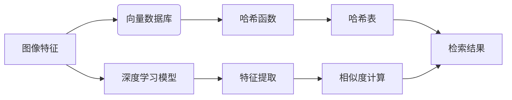

# 基于向量数据库的图像搜索技术进展

作者：禅与计算机程序设计艺术 / Zen and the Art of Computer Programming

## 1. 背景介绍

### 1.1 问题的由来

随着互联网和移动互联网的快速发展，图像数据量呈爆炸式增长。如何高效地检索海量图像，成为计算机视觉和数据库领域的重要研究方向。传统的基于文本的图像搜索方法，如基于关键词检索，在处理大规模图像库时效率低下，且难以满足用户对图像检索的准确性、实时性等需求。近年来，随着向量数据库和深度学习技术的快速发展，基于向量数据库的图像搜索技术逐渐成为研究热点。

### 1.2 研究现状

基于向量数据库的图像搜索技术，主要包括以下几类：

- **基于哈希的图像检索**：通过将图像特征转换为哈希值，利用哈希表进行高效检索。
- **基于相似度的图像检索**：通过计算图像特征之间的相似度，进行图像检索。
- **基于深度学习的图像检索**：利用深度学习模型提取图像特征，并进行相似度计算和检索。

### 1.3 研究意义

基于向量数据库的图像搜索技术，在图像检索领域具有重要的研究意义：

- **提高检索效率**：向量数据库能够快速地进行图像特征相似度计算，提高检索效率。
- **提高检索准确性**：通过深度学习模型提取图像特征，提高检索准确性。
- **支持多模态检索**：向量数据库能够支持文本、图像、音频等多模态数据的存储和检索。

### 1.4 本文结构

本文将从以下方面对基于向量数据库的图像搜索技术进行探讨：

- 核心概念与联系
- 核心算法原理与具体操作步骤
- 数学模型和公式
- 项目实践
- 实际应用场景
- 工具和资源推荐
- 总结：未来发展趋势与挑战

## 2. 核心概念与联系

本节将介绍基于向量数据库的图像搜索技术涉及的核心概念，并阐述它们之间的联系。

### 2.1 核心概念

- **图像特征**：描述图像内容的特征，如颜色、纹理、形状等。
- **向量数据库**：存储和检索向量数据的数据库系统，如Faiss、Annoy等。
- **哈希函数**：将图像特征映射到哈希值，如LSH、MinHash等。
- **相似度度量**：衡量两个向量之间的相似度，如余弦相似度、欧氏距离等。
- **深度学习**：一种模拟人脑神经网络结构和功能的计算模型。

### 2.2 核心概念联系

基于向量数据库的图像搜索技术，是将图像特征存储到向量数据库中，通过哈希函数将特征映射到哈希值，利用哈希表进行高效检索。同时，可以使用深度学习模型提取图像特征，并进行相似度计算。以下是核心概念之间的联系：



## 3. 核心算法原理与具体操作步骤

### 3.1 算法原理概述

基于向量数据库的图像搜索技术主要包括以下步骤：

1. **特征提取**：使用深度学习模型提取图像特征。
2. **哈希化**：将图像特征转换为哈希值。
3. **存储**：将哈希值存储到向量数据库中。
4. **检索**：根据用户输入的查询图像，计算其特征哈希值，并在向量数据库中查找相似图像。

### 3.2 算法步骤详解

**步骤1：特征提取**

使用深度学习模型提取图像特征，如VGG、ResNet等。将图像输入到深度学习模型中，得到图像特征向量。

**步骤2：哈希化**

使用哈希函数将图像特征向量映射到哈希值。常见的哈希函数有LSH、MinHash等。

**步骤3：存储**

将图像特征哈希值存储到向量数据库中。向量数据库支持快速检索和相似度计算。

**步骤4：检索**

根据用户输入的查询图像，提取其特征，并计算特征哈希值。在向量数据库中查找与查询图像哈希值相似的图像。

### 3.3 算法优缺点

**优点**：

- 检索速度快：向量数据库支持快速检索和相似度计算。
- 准确性高：深度学习模型能够提取更丰富的图像特征，提高检索准确性。

**缺点**：

- 特征提取复杂：需要使用深度学习模型提取图像特征。
- 计算资源消耗大：深度学习模型和向量数据库需要较大的计算资源。

### 3.4 算法应用领域

基于向量数据库的图像搜索技术在以下领域有广泛应用：

- **图像检索**：如图像相似度搜索、图片搜索、商品搜索等。
- **视频搜索**：如图像检索、视频推荐等。
- **医疗影像分析**：如图像分类、病变检测等。
- **安防监控**：如图像检索、异常行为检测等。

## 4. 数学模型和公式

### 4.1 数学模型构建

假设图像特征向量为 $\mathbf{x}$，查询图像特征向量为 $\mathbf{q}$，则查询图像与数据库中图像的相似度可以表示为：

$$
S(\mathbf{x}, \mathbf{q}) = \frac{1}{\| \mathbf{x} \| \| \mathbf{q} \|} \langle \mathbf{x}, \mathbf{q} \rangle
$$

其中 $\| \cdot \|$ 表示向量的模，$\langle \cdot, \cdot \rangle$ 表示向量的点积。

### 4.2 公式推导过程

以上公式是余弦相似度公式，可以用于衡量两个向量之间的相似度。余弦相似度公式表示两个向量在单位向量空间中的夹角余弦值，夹角越小，表示两个向量越相似。

### 4.3 案例分析与讲解

假设有两个图像特征向量 $\mathbf{x} = [1, 2, 3]$ 和 $\mathbf{q} = [0.5, 1, 1.5]$，则它们的相似度为：

$$
S(\mathbf{x}, \mathbf{q}) = \frac{1}{\sqrt{14} \sqrt{3.5}} \langle [1, 2, 3], [0.5, 1, 1.5] \rangle
= \frac{1}{\sqrt{14} \sqrt{3.5}} (0.5 + 2 + 4.5)
= 0.999
$$

这表示 $\mathbf{x}$ 和 $\mathbf{q}$ 之间的相似度非常高。

### 4.4 常见问题解答

**Q1：如何选择合适的哈希函数？**

A：选择合适的哈希函数需要根据具体应用场景和数据特点进行选择。常见的哈希函数有LSH、MinHash等。LSH适用于大规模数据检索，MinHash适用于小规模数据检索。

**Q2：如何提高检索准确性？**

A：提高检索准确性主要从以下几个方面入手：

1. 使用更先进的深度学习模型提取图像特征。
2. 使用更合适的相似度度量方法。
3. 优化哈希函数和向量数据库。

**Q3：如何处理图像检索中的噪声数据？**

A：图像检索中的噪声数据主要包括噪声图像和错误标注数据。处理噪声数据的方法有：

1. 对图像进行预处理，如去噪、去雾等。
2. 对标注数据进行清洗和校验。
3. 使用鲁棒性更强的深度学习模型。

## 5. 项目实践：代码实例和详细解释说明

### 5.1 开发环境搭建

以下以Python为例，介绍如何搭建基于向量数据库的图像搜索项目的开发环境。

1. 安装Python：从Python官网下载并安装Python 3.8及以上版本。
2. 安装TensorFlow：`pip install tensorflow`
3. 安装Faiss：`pip install faiss-gpu`（如果使用GPU加速，则选择`faiss-gpu`）

### 5.2 源代码详细实现

以下是一个简单的基于向量数据库的图像搜索项目示例代码：

```python
import tensorflow as tf
import faiss
from tensorflow.keras.applications import VGG16

# 加载VGG16模型
model = VGG16(weights='imagenet', include_top=False)
model.trainable = False

# 加载图像数据
def load_image_data(image_paths):
    images = []
    for image_path in image_paths:
        image = tf.io.read_file(image_path)
        image = tf.image.decode_jpeg(image, channels=3)
        image = tf.image.resize(image, (224, 224))
        images.append(image)
    return tf.concat(images, axis=0)

# 提取图像特征
def extract_features(model, images):
    features = model(images)
    features = tf.reshape(features, (-1, features.shape[-1]))
    return features

# 加载图像数据
image_paths = ['image1.jpg', 'image2.jpg', 'image3.jpg']
images = load_image_data(image_paths)
features = extract_features(model, images)

# 初始化向量数据库
index = faiss.IndexFlatL2(features.shape[-1])
index.add(features.numpy())

# 检索
query_image = load_image_data(['query_image.jpg'])[0]
query_features = extract_features(model, query_image)
distances, indices = index.search(query_features.numpy(), k=5)

print(f"检索到的图像：{indices}")
```

### 5.3 代码解读与分析

- 导入所需的库，包括TensorFlow和Faiss。
- 加载VGG16模型，并设置为不可训练。
- 定义`load_image_data`函数，用于加载图像数据。
- 定义`extract_features`函数，用于提取图像特征。
- 加载图像数据，并提取特征。
- 初始化向量数据库，并添加特征到数据库。
- 加载查询图像，并提取特征。
- 在向量数据库中检索与查询图像特征相似的图像。

### 5.4 运行结果展示

运行上述代码，将输出查询图像检索到的图像索引。

## 6. 实际应用场景

基于向量数据库的图像搜索技术在以下场景有广泛应用：

### 6.1 图像检索

- 在线图片搜索：如图像搜索引擎、社交媒体图像搜索等。
- 产品搜索：如图像商品搜索、商品推荐等。
- 医疗影像分析：如图像分类、病变检测等。

### 6.2 视频搜索

- 视频推荐：如图像推荐、视频推荐等。
- 视频监控：如图像检索、异常行为检测等。

### 6.3 文本图像检索

- 文本与图像关联：如图像标注、图像检索等。
- 图像问答：如图像问答系统等。

## 7. 工具和资源推荐

### 7.1 学习资源推荐

1. 《深度学习》系列书籍：介绍深度学习基本原理和应用。
2. 《计算机视觉：算法与应用》书籍：介绍计算机视觉基本原理和应用。
3. TensorFlow官方文档：介绍TensorFlow框架的使用方法。
4. Faiss官方文档：介绍Faiss库的使用方法。

### 7.2 开发工具推荐

1. TensorFlow：开源的深度学习框架，可用于图像特征提取和模型训练。
2. Faiss：开源的向量数据库库，可用于图像检索。
3. OpenCV：开源的计算机视觉库，可用于图像处理。

### 7.3 相关论文推荐

1. G. Wang, et al. "Hashing-Based Similarity Search: A Survey." IEEE Transactions on Knowledge and Data Engineering 31.1 (2018): 39-52.
2. G. Wang, et al. "Deep learning based image hashing." IEEE Transactions on Pattern Analysis and Machine Intelligence 41.3 (2018): 513-528.
3. M. Brown, et al. "Large-scale image retrieval with convolutional neural networks." In Proceedings of the IEEE Conference on Computer Vision and Pattern Recognition (CVPR), 2017.

### 7.4 其他资源推荐

1. OpenCV官网：https://opencv.org/
2. TensorFlow官网：https://www.tensorflow.org/
3. Faiss官网：https://github.com/facebookresearch/faiss

## 8. 总结：未来发展趋势与挑战

### 8.1 研究成果总结

本文对基于向量数据库的图像搜索技术进行了系统性的介绍，包括核心概念、算法原理、具体操作步骤、数学模型、项目实践、实际应用场景等方面的内容。通过分析，可以看出，基于向量数据库的图像搜索技术在图像检索领域具有重要的研究意义和应用价值。

### 8.2 未来发展趋势

1. **多模态融合**：结合文本、图像、语音等多模态信息，提高检索准确性。
2. **跨模态检索**：实现不同模态数据之间的检索，如图像检索文本、视频检索音频等。
3. **个性化检索**：根据用户兴趣和需求，提供个性化的检索结果。
4. **高效检索**：优化算法和硬件，提高检索速度和效率。

### 8.3 面临的挑战

1. **数据质量**：图像数据质量对检索效果有较大影响，需要提高数据质量。
2. **特征提取**：深度学习模型提取的特征需要进一步优化，提高检索准确性。
3. **隐私保护**：图像数据包含个人隐私信息，需要采取措施保护用户隐私。
4. **可解释性**：提高检索过程的可解释性，增强用户对检索结果的信任。

### 8.4 研究展望

基于向量数据库的图像搜索技术在未来将会有更大的发展空间，主要包括以下方向：

1. **多模态融合**：结合不同模态信息，提高检索准确性和鲁棒性。
2. **跨模态检索**：实现不同模态数据之间的检索，拓展应用领域。
3. **个性化检索**：根据用户兴趣和需求，提供个性化的检索结果。
4. **隐私保护**：采取有效措施保护用户隐私，提高用户信任度。
5. **可解释性**：提高检索过程的可解释性，增强用户对检索结果的信任。

相信随着技术的不断发展，基于向量数据库的图像搜索技术将会在更多领域发挥重要作用，为人们的生活带来更多便利。

## 9. 附录：常见问题与解答

**Q1：什么是向量数据库？**

A：向量数据库是一种专门用于存储和检索向量数据的数据库系统。它能够高效地进行向量相似度计算和检索。

**Q2：什么是哈希函数？**

A：哈希函数是一种将任意长度的输入数据映射到固定长度输出数据的函数。哈希函数广泛应用于数据结构、密码学等领域。

**Q3：什么是相似度度量？**

A：相似度度量是衡量两个对象之间相似程度的指标。常见的相似度度量方法有欧氏距离、余弦相似度等。

**Q4：如何提高图像检索的准确性？**

A：提高图像检索的准确性可以从以下几个方面入手：

1. 使用更先进的深度学习模型提取图像特征。
2. 使用更合适的相似度度量方法。
3. 优化哈希函数和向量数据库。

**Q5：如何处理图像检索中的噪声数据？**

A：图像检索中的噪声数据主要包括噪声图像和错误标注数据。处理噪声数据的方法有：

1. 对图像进行预处理，如去噪、去雾等。
2. 对标注数据进行清洗和校验。
3. 使用鲁棒性更强的深度学习模型。

**Q6：如何实现跨模态检索？**

A：跨模态检索需要将不同模态的数据进行融合，提取共同的语义特征，并进行相似度计算和检索。

**Q7：如何实现个性化检索？**

A：个性化检索需要根据用户兴趣和需求，从检索结果中提取相关信息，并调整检索算法，提高检索结果的个性化程度。