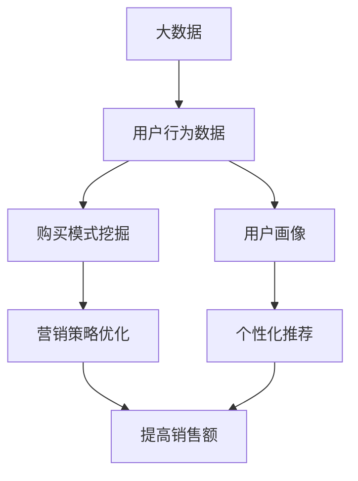

# 基于大数据的电子产品购买消费行为的分析研究

## 1. 背景介绍

### 1.1 问题的由来

在当今时代,电子商务的快速发展极大地改变了人们的购物方式。消费者可以通过网络便捷地购买各种商品,而企业也可以利用互联网平台更好地了解客户需求并进行营销。然而,随着电子商务的不断壮大,海量的用户行为数据也随之产生。如何高效地分析和利用这些大数据,深入挖掘消费者的购买行为模式,成为企业提高竞争力和实现精准营销的关键。

### 1.2 研究现状

近年来,基于大数据的消费行为分析研究备受关注。学术界和工业界都在积极探索利用机器学习、数据挖掘等技术来分析用户购买记录、浏览历史、评论数据等,以发现潜在的消费模式。一些主流的电子商务平台已经开始应用这些技术来优化产品推荐、个性化营销等策略。然而,由于数据量庞大、高维度和噪声等因素,准确分析消费者购买行为仍然是一个具有挑战性的问题。

### 1.3 研究意义

深入分析消费者的购买行为对于企业的决策至关重要。通过对大数据的深入挖掘,企业可以更好地了解客户的需求和偏好,从而制定有针对性的营销策略,提高产品的销售额和用户的满意度。此外,消费行为分析还可以帮助企业发现新的商机,优化产品设计和服务质量。对于消费者而言,准确的购买行为分析也有助于提供个性化的推荐和优惠,提升购物体验。

### 1.4 本文结构

本文将围绕基于大数据的电子产品购买消费行为分析这一主题,详细介绍相关的核心概念、算法原理、数学模型、实践案例以及应用场景等内容。文章结构安排如下:

- 第2部分阐述核心概念及其相互联系
- 第3部分详细解释核心算法的原理和具体操作步骤
- 第4部分构建数学模型,推导公式并举例说明
- 第5部分提供项目实践的代码实例及解释
- 第6部分探讨实际应用场景及未来展望
- 第7部分推荐相关工具和学习资源
- 第8部分总结研究成果、发展趋势和面临的挑战
- 第9部分列出常见问题及解答

## 2. 核心概念与联系

分析基于大数据的电子产品购买消费行为涉及以下几个核心概念:

1. **大数据(Big Data)**: 指无法使用传统数据库软件工具在合理时间内对其进行捕获、管理和处理的海量数据集。电子商务平台上产生的用户行为数据就属于典型的大数据。

2. **用户行为数据(User Behavior Data)**: 用户在电子商务平台上产生的各种行为数据,包括浏览记录、购买记录、评论数据等,是分析消费行为的基础数据源。

3. **用户画像(User Profile)**: 通过分析用户行为数据,对用户的基本属性、兴趣爱好、消费习惯等进行全面描述,形成用户的个性化画像。

4. **购买模式挖掘(Purchase Pattern Mining)**: 应用数据挖掘、机器学习等技术,从海量用户行为数据中发现潜在的购买模式和规律,如用户对某类产品的偏好、购买时间规律等。

5. **个性化推荐(Personalized Recommendation)**: 根据用户画像和购买模式,为用户提供个性化的产品推荐,提高用户的购买意愿和满意度。

6. **营销策略优化(Marketing Strategy Optimization)**: 基于对消费者购买行为的深入分析,优化营销策略,如定价、促销活动、广告投放等,从而提高销售额和用户体验。

上述核心概念相互关联、环环相扣。大数据为分析消费行为提供了数据基础,用户行为数据可以用于构建用户画像和挖掘购买模式,而用户画像和购买模式则支撑了个性化推荐和营销策略优化,最终实现提高销售额和用户满意度的目标。

## 3. 核心算法原理 & 具体操作步骤

### 3.1 算法原理概述

分析电子产品购买消费行为的核心算法主要包括以下几个方面:

1. **协同过滤算法(Collaborative Filtering)**:基于用户之间的相似性或商品之间的相似性,为用户推荐可能感兴趣的商品。常用的协同过滤算法有基于用户的协同过滤、基于物品的协同过滤、基于模型的协同过滤等。

2. **关联规则挖掘算法(Association Rule Mining)**: 发现数据集中有趣、频繁、潜在有用的关联规则,如"购买了商品A的用户也倾向于购买商品B"。常用的关联规则算法有Apriori算法、FP-Growth算法等。

3. **聚类分析算法(Clustering Analysis)**: 根据用户的购买行为、浏览记录等数据,将相似的用户或商品进行分组,用于发现潜在的用户群体和商品类别。常用的聚类算法有K-Means算法、层次聚类算法等。

4. **时间序列分析算法(Time Series Analysis)**: 分析用户购买行为随时间的变化规律,发现周期性、趋势性等模式,用于预测未来的销售情况。常用的时间序列分析算法有ARIMA模型、指数平滑模型等。

5. **深度学习算法(Deep Learning)**: 利用神经网络等深度学习模型从海量用户行为数据中自动提取特征,建立购买行为预测模型。常用的深度学习算法有卷积神经网络(CNN)、循环神经网络(RNN)等。

上述算法各有侧重,需要根据具体的分析目标和数据特征选择合适的算法或算法组合。下面将详细介绍其中的关联规则挖掘算法的原理和步骤。

### 3.2 算法步骤详解

#### 3.2.1 Apriori算法

Apriori算法是关联规则挖掘中最经典的算法之一,其基本思想是反复扫描数据集,生成频繁项集,再从频繁项集中产生关联规则。算法步骤如下:

1. **初始化**: 设定最小支持度阈值min_sup。扫描数据集,统计每个项的支持度,去掉小于min_sup的项,得到频繁1-项集。

2. **连接步骤(Join Step)**: 对频繁k-项集,应用自连接操作,生成候选(k+1)-项集。

3. **剪枝步骤(Prune Step)**: 从候选(k+1)-项集中删除任何非频繁(k+1)-项集,得到频繁(k+1)-项集。

4. **重复**: 重复步骤2和步骤3,直到无法进一步生成更大的频繁项集为止。

5. **生成规则**: 对每个频繁项集,根据最小置信度阈值min_conf生成关联规则。

其中,支持度和置信度的定义如下:

- 支持度(Support) = 包含该项集的记录数 / 总记录数
- 置信度(Confidence) = 包含X∪Y的记录数 / 包含X的记录数

#### 3.2.2 FP-Growth算法

FP-Growth算法是另一种高效的关联规则挖掘算法,它通过构建FP-树(Frequent Pattern Tree)来发现频繁项集,避免了Apriori算法中大量候选项集的生成和测试。算法步骤如下:

1. **构建FP-树**: 扫描数据集两次,第一次统计每个项的支持度,去掉小于min_sup的项;第二次根据剩余项的支持度顺序构建FP-树。

2. **挖掘频繁项集**: 从FP-树中挖掘频繁项集,具体做法是从树的每个路径中提取条件模式基,然后对每个条件模式基构建条件FP-树,再从条件FP-树中挖掘频繁项集。

3. **生成规则**: 对每个频繁项集,根据min_conf生成关联规则。

FP-Growth算法通过压缩数据集,减少了大量I/O操作,在处理大型数据集时性能优于Apriori算法。

### 3.3 算法优缺点

#### 3.3.1 Apriori算法

**优点**:
- 算法简单,容易实现
- 可以挖掘出所有频繁项集

**缺点**:
- 需要多次扫描数据集,I/O开销大
- 当数据集较大时,需要大量内存存储候选项集
- 对于数据维度较高的数据集效率低下

#### 3.3.2 FP-Growth算法

**优点**:
- 只需扫描数据集两次,I/O开销小
- 利用FP-树压缩数据集,节省内存空间
- 对于数据维度较高的数据集效率较高

**缺点**:
- 构建FP-树的过程较为复杂
- 对于数据集中存在大量频繁项集的情况,FP-树可能过于庞大,效率降低

### 3.4 算法应用领域

关联规则挖掘算法在电子商务领域有广泛的应用,主要包括:

1. **购物篮分析(Market Basket Analysis)**: 发现用户在同一次购物中同时购买的商品组合,用于商品组合销售、交叉营销等。

2. **网页链接分析(Web Link Analysis)**: 分析用户浏览网页的模式,优化网页设计和链接结构。

3. **产品捆绑销售(Product Bundling)**: 发现用户倾向于一起购买的商品,进行捆绑销售。

4. **目录设计(Catalog Design)**: 根据用户的购买模式,优化产品目录的结构和布局。

5. **推荐系统(Recommender Systems)**: 结合协同过滤等算法,为用户推荐可能感兴趣的商品。

除了电子商务领域,关联规则挖掘算法还可应用于金融风险分析、网络入侵检测、基因组学等诸多领域。

## 4. 数学模型和公式 & 详细讲解 & 举例说明

### 4.1 数学模型构建

在分析电子产品购买消费行为时,我们可以构建一些数学模型来描述和预测用户的购买行为。常用的数学模型包括:

1. **协同过滤模型**
2. **关联规则模型**
3. **聚类模型**
4. **时间序列模型**
5. **深度学习模型**

这些模型各有侧重,适用于不同的分析目标和数据特征。下面以关联规则模型为例,详细介绍其数学表示和公式推导过程。

### 4.2 公式推导过程

在关联规则挖掘中,我们通常使用支持度(Support)和置信度(Confidence)两个指标来衡量规则的重要性。

假设我们有一个包含n条记录的数据集D,记录中包含m个不同的项(Item)。令项集X和Y分别表示一个或多个项的集合,则X→Y表示一条关联规则"如果购买了X,则也会购买Y"。

#### 4.2.1 支持度

支持度表示包含项集X∪Y的记录数占总记录数的比例,用于衡量项集X∪Y在数据集中出现的频率。支持度的公式定义如下:

$$\operatorname{Support}(X \cup Y) = \frac{\operatorname{count}(X \cup Y)}{N}$$

其中,count(X∪Y)表示包含项集X∪Y的记录数,N表示总记录数。

支持度的取值范围为[0,1],支持度越高,表示项集X∪Y在数据集中出现的频率越高。在关联规则挖掘中,我们通常设置一个最小支持度阈值min_sup,只保留支持度不小于min_sup的项集,作为频繁项集。

#### 4.2.2 置信度

置信度表示包含项集X∪Y的记录数占包含项集X的记录数的比例,用于衡量规