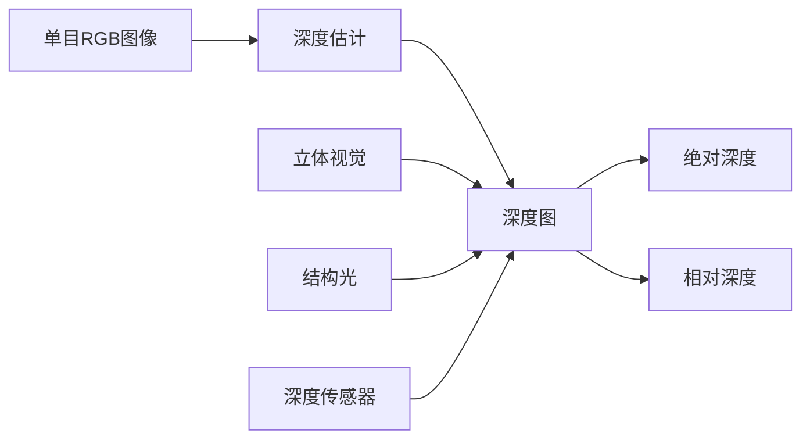

# 基于深度学习的单目图像深度估计

关键词：单目深度估计, 深度学习, 卷积神经网络, 深度图, 计算机视觉

## 1. 背景介绍

### 1.1 问题的由来
单目图像深度估计是计算机视觉领域的一个重要研究问题。它旨在从单个RGB图像中估计场景的深度信息,即恢复图像中每个像素点到相机的距离。深度信息在三维重建、自动驾驶、增强现实等许多应用中起着至关重要的作用。传统的深度估计方法主要依赖双目视觉或结构光等特殊硬件设备,但这些方法成本高、不方便。因此,如何从单目图像准确高效地估计深度,成为一个亟待解决的问题。

### 1.2 研究现状
近年来,随着深度学习的蓬勃发展,利用卷积神经网络(CNN)从单目图像估计深度取得了显著进展。Eigen等人在2014年首次将CNN应用于单目深度估计,开创了这一研究方向。此后,各种基于深度学习的方法不断涌现,如利用全卷积网络、多尺度融合、条件随机场(CRF)优化等,单目深度估计的性能不断提升。目前,一些先进的方法如BTS、AdaBins已经能在KITTI等公开数据集上取得与激光雷达相媲美的估计精度。

### 1.3 研究意义
单目深度估计具有广阔的应用前景。首先,它能极大降低深度传感的硬件成本,一个普通的RGB相机即可获得深度信息,这将大幅拓展计算机视觉技术的应用范围。其次,单目深度估计是场景理解、三维感知的基础,是实现AR/VR、自动驾驶等高级应用不可或缺的一环。此外,该技术还可应用于手机人像虚化、3D物体检测等,为拍照、游戏、购物等日常应用带来革命性的用户体验提升。因此,单目深度估计具有重要的理论和实用价值。

### 1.4 本文结构
本文将全面介绍基于深度学习的单目图像深度估计技术。第2节阐述深度估计中的一些核心概念。第3节详细讲解深度估计的CNN算法原理和具体步骤。第4节介绍建模深度估计问题常用的数学模型和损失函数。第5节通过代码实例演示如何用PyTorch实现一个深度估计模型。第6节讨论单目深度估计的实际应用场景。第7节推荐一些学习资源和开发工具。第8节总结全文并展望未来的研究方向。

## 2. 核心概念与联系

在深入研究单目深度估计之前,我们先来了解几个核心概念:

- 单目图像(Monocular Image):只使用单个摄像头拍摄得到的RGB图像,不包含任何深度信息。
- 深度图(Depth Map):与RGB图对应的深度信息,通常表示为一张灰度图,像素值表示该点到相机的距离。
- 绝对深度(Absolute Depth):深度值的真实物理尺度,如5米、0.3米等。
- 相对深度(Relative Depth):深度值的相对大小关系,常用于训练模型,如更暗的像素表示更近。
- 立体视觉(Stereo Vision):利用两个摄像头获取视差信息,三角测量计算深度。
- 结构光(Structured Light):投射特定光纹到物体表面,通过变形分析物体的深度。
- 深度传感器(Depth Sensor):直接测量深度的特殊硬件,如Kinect、激光雷达等。

它们的关系如下:单目RGB图像是深度估计的输入,深度图是期望的输出。立体视觉、结构光、深度传感器是传统的深度获取手段,但成本高、受限制多。深度学习则希望只根据单目图像直接预测深度图,可以表示为绝对深度值,但训练时常用相对深度。



## 3. 核心算法原理 & 具体操作步骤

### 3.1 算法原理概述
基于深度学习的单目深度估计的核心思想是:利用卷积神经网络(CNN)直接从RGB图像学习到深度图的映射关系。给定一张RGB图像,首先用CNN提取其高维特征,然后逐步恢复出每个像素的深度值。整个过程是端到端的,只需要RGB图像作为输入,就可以一次性预测出完整的深度图。

### 3.2 算法步骤详解
具体来说,单目深度估计CNN的主要步骤如下:

1. 特征提取:用一个主干网络(如ResNet)对RGB图像做特征提取,得到高维特征图。

2. 上采样恢复:通过反卷积/上采样逐步恢复特征图的分辨率,直到与原图一致。

3. 跳跃连接:在上采样过程中,引入浅层的高分辨率特征图,补充空间细节信息。

4. 多尺度预测:在不同上采样阶段预测不同尺度的深度图,融合多尺度信息。

5. 深度优化:引入额外的优化模块(如CRF),对深度图做全局优化提升质量。

6. 损失函数:设计有效的损失函数(如平滑L1),衡量深度图的预测误差。

7. 训练过程:用成对的RGB图和真值深度图训练CNN模型,最小化预测误差。

8. 推理预测:用训练好的模型对新的RGB图像进行深度估计,得到深度图输出。

### 3.3 算法优缺点
基于深度学习的单目深度估计具有以下优点:
- 端到端:一个CNN模型即可完成从RGB到深度的估计,无需人工设计特征。
- 泛化能力强:可以处理各种场景的图像,不要求场景先验知识。
- 精度高:在公开数据集上可以达到媲美深度传感器的估计精度。

同时也存在一些局限:
- 数据依赖:需要大量带有真值深度的RGB图像做监督训练,获取成本高。
- 预测不确定性:估计结果容易受图像噪声、模糊、遮挡等因素影响。
- 物理尺度模糊:像素值与真实深度的绝对尺度难以准确对齐。

### 3.4 算法应用领域
单目深度估计是一种通用的技术,在众多领域都有重要应用:
- 自动驾驶:感知车前方的深度信息,实现避障、车距保持等。
- 增强现实:根据深度图渲染虚拟物体,使其与真实场景无缝融合。
- 三维重建:从图像序列估计连续的深度图,并重建三维模型。
- 机器人视觉:感知机器人周围环境的三维结构,实现导航、抓取等。
- 人机交互:根据手势的深度变化实现体感操控。

## 4. 数学模型和公式 & 详细讲解 & 举例说明

### 4.1 数学模型构建
单目深度估计可以表述为一个回归问题。给定一张RGB图像 $I\in \mathbb{R}^{H\times W\times 3}$,我们希望预测其对应的深度图 $D\in \mathbb{R}^{H\times W}$。设计一个深度估计模型 $f_\theta$,参数为 $\theta$,则深度估计过程可以表示为:

$$
\hat{D} = f_\theta(I)
$$

其中 $\hat{D}$ 是估计的深度图。我们希望学习模型参数 $\theta$,使估计的深度图 $\hat{D}$ 尽可能接近真值深度图 $D$。

### 4.2 公式推导过程
为了衡量估计深度图与真值的差异,引入损失函数 $L$。一个常用的损失函数是平均绝对误差(MAE):

$$
L(\hat{D},D) = \frac{1}{HW}\sum_{i,j}|\hat{D}_{i,j} - D_{i,j}|
$$

即逐像素计算估计值与真值的绝对差,再求平均。另一个常用的是平滑L1损失:

$$
L(\hat{D},D) = \frac{1}{HW}\sum_{i,j} smooth_{L1}(\hat{D}_{i,j} - D_{i,j})
$$

其中

$$
smooth_{L1}(x) = \begin{cases}
0.5x^2 & |x|<1 \\
|x|-0.5 & otherwise
\end{cases}
$$

相比于MAE,平滑L1在零点附近更加平滑,梯度变化更稳定。

模型训练的目标就是最小化损失函数:

$$
\theta^* = \arg\min_\theta \sum_{(I,D)\in \mathcal{T}}L(f_\theta(I),D)
$$

其中 $\mathcal{T}$ 是RGB图像和深度图构成的训练集。这个最小化问题可以通过梯度下降等优化算法求解。

### 4.3 案例分析与讲解
下面我们以KITTI数据集为例,展示如何构建数学模型并训练单目深度估计模型。

KITTI是一个大规模的自动驾驶场景数据集,包含了大量汽车行驶在公路上的视频序列。其中一部分图像提供了对应的深度图真值,可用于训练和评估深度估计模型。

假设我们从KITTI中采样了一个包含N张图像的训练集 $\mathcal{T}=\{(I_1,D_1),...,(I_N,D_N)\}$。我们使用如下的平滑L1损失函数:

$$
L = \frac{1}{N}\sum_{i=1}^N \frac{1}{HW}\sum_{j,k} smooth_{L1}(f_\theta(I_i)_{j,k} - D_{i,j,k})
$$

即对每张图像计算平滑L1损失,再对所有图像求平均。

在训练过程中,每次随机采样一批图像 $\{(I_{i_1},D_{i_1}),...,(I_{i_B},D_{i_B})\}$,输入深度估计CNN $f_\theta$,计算损失函数 $L$,并通过反向传播算法更新参数 $\theta$:

$$
\theta \leftarrow \theta - \eta \frac{\partial L}{\partial \theta}
$$

其中 $\eta$ 是学习率。反复迭代,直到损失函数收敛或达到预设的训练轮数。

在测试阶段,给定一张新的图像 $I$,直接用训练好的模型预测其深度图:

$$
\hat{D} = f_{\theta^*}(I)
$$

评估指标可以使用MAE、平均相对误差(MRE)、根均方误差(RMSE)等。

### 4.4 常见问题解答
Q: 预测的深度图存在大量空洞和噪点怎么办?
A: 可以在网络输出后增加CRF等优化模块,利用图像的上下文信息平滑深度图。也可以引入额外的边缘引导损失函数,使深度图边缘与RGB图像对齐。

Q: 深度图的远近尺度关系不准怎么办?
A: 可以将深度值取对数,使其分布更加均匀。在损失函数中引入尺度不变误差,惩罚相对尺度的偏差。还可以利用立体视觉得到一些稀疏的绝对深度值,在训练时加入这些绝对尺度的监督。

Q: 物体边缘的深度值漂移严重怎么办?
A: 在数据增强时加入更多遮挡、截断的物体,提高模型在物体边缘的鲁棒性。在训练时加大这些难例的权重,使模型更关注边缘区域。后处理时也可以用图像分割引导深度图修复。

## 5. 项目实践：代码实例和详细解释说明

### 5.1 开发环境搭建
- 操作系统: Ubuntu 18.04
- 深度学习框架: PyTorch 1.9.0
- Python: 3.8
- CUDA: 11.1
- 硬件: 4 × NVIDIA 2080Ti GPU
- 数据集: KITTI

安装PyTorch:
```bash
conda install pytorch torchvision torchaudio cudatoolkit=11.1 -c pytorch -c conda-forge
```

###