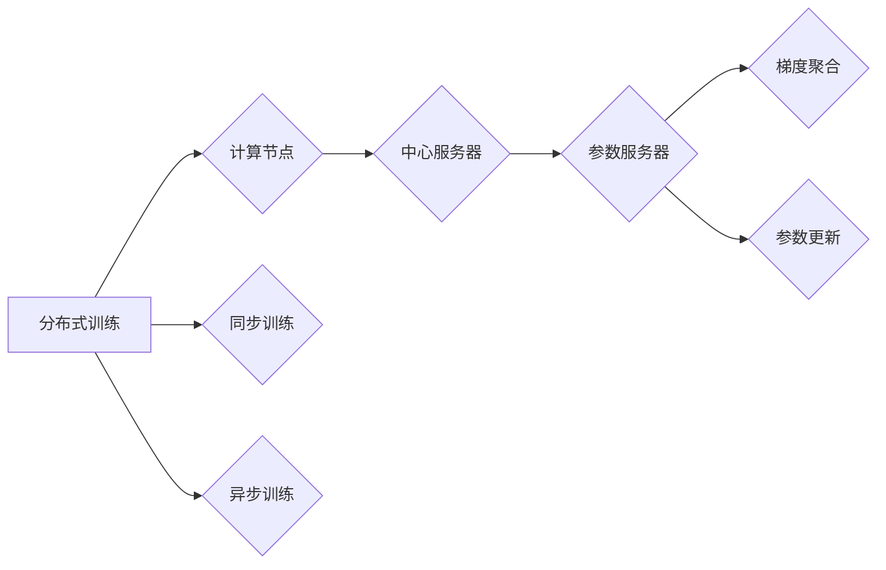

# 大规模语言模型从理论到实践：参数服务器架构

作者：禅与计算机程序设计艺术 / Zen and the Art of Computer Programming

## 1. 背景介绍
### 1.1 问题的由来

随着深度学习技术的飞速发展，大规模语言模型（Large Language Models，LLMs）如BERT、GPT等在自然语言处理（Natural Language Processing，NLP）领域取得了显著的成果。这些模型通过在海量文本数据上预训练，能够理解并生成自然语言，并在各种NLP任务中表现出色。然而，LLMs的训练和推理通常需要大量的计算资源和时间，这对资源有限的计算环境提出了挑战。为了解决这一问题，参数服务器架构应运而生。

### 1.2 研究现状

近年来，参数服务器架构在分布式训练和推理领域得到了广泛关注。它通过将模型参数存储在中心服务器上，从而允许多个计算节点并行计算梯度，提高了训练和推理的效率。目前，参数服务器架构已经成为了LLMs大规模训练和推理的重要技术之一。

### 1.3 研究意义

研究参数服务器架构对于LLMs的发展具有重要意义：

- 提高训练和推理效率：通过分布式计算，参数服务器架构可以显著提高LLMs的训练和推理速度，降低计算成本。
- 降低资源消耗：参数服务器架构可以合理分配计算资源，降低资源浪费，提高资源利用率。
- 支持大规模LLMs训练：参数服务器架构可以支持大规模LLMs的训练，推动LLMs在更多领域的应用。

### 1.4 本文结构

本文将围绕参数服务器架构展开，首先介绍核心概念与联系，然后详细阐述其原理和操作步骤，接着分析数学模型和公式，并给出项目实践示例。最后，本文将探讨参数服务器架构在实际应用中的场景和未来发展趋势。

## 2. 核心概念与联系

为了更好地理解参数服务器架构，我们首先介绍以下几个核心概念：

- 分布式训练：指在多个计算节点上并行计算模型参数的梯度，从而提高训练效率。
- 计算节点：指参与分布式训练的计算机，通常包括CPU、GPU等硬件设备。
- 参数服务器：指存储模型参数的中心服务器，负责接收和发送参数，以及收集计算节点的梯度信息。
- 同步训练：指所有计算节点在相同的时间内更新参数。
- 异步训练：指计算节点可以不同步地更新参数，但最终达到收敛。
- 梯度聚合：指将计算节点的梯度信息汇总到中心服务器，并更新模型参数。

这些概念之间的关系如下：



可以看出，分布式训练是参数服务器架构的基础，计算节点和参数服务器共同构成分布式训练的体系结构。参数服务器负责存储和更新模型参数，梯度聚合和参数更新是参数服务器的主要功能。

## 3. 核心算法原理 & 具体操作步骤
### 3.1 算法原理概述

参数服务器架构的核心思想是将模型参数存储在中心服务器上，计算节点负责计算梯度，并将梯度信息发送到参数服务器。参数服务器汇总所有计算节点的梯度信息，并更新模型参数。具体步骤如下：

1. 初始化模型参数和计算节点。
2. 计算节点获取模型参数。
3. 计算节点计算梯度。
4. 计算节点将梯度信息发送到参数服务器。
5. 参数服务器汇总梯度信息，并更新模型参数。
6. 重复步骤2-5，直到模型收敛。

### 3.2 算法步骤详解

以下是参数服务器架构的具体操作步骤：

**Step 1: 初始化模型参数和计算节点**

- 初始化模型参数，并将参数存储在参数服务器上。
- 初始化计算节点，并分配计算任务。

**Step 2: 计算节点获取模型参数**

- 计算节点从参数服务器获取当前模型参数。

**Step 3: 计算节点计算梯度**

- 计算节点根据输入数据和模型参数，计算损失函数的梯度。

**Step 4: 计算节点将梯度信息发送到参数服务器**

- 计算节点将梯度信息发送到参数服务器。

**Step 5: 参数服务器汇总梯度信息，并更新模型参数**

- 参数服务器接收所有计算节点的梯度信息，并汇总。
- 参数服务器根据汇总的梯度信息更新模型参数。

**Step 6: 重复步骤2-5，直到模型收敛**

- 重复步骤2-5，直到模型收敛。

### 3.3 算法优缺点

参数服务器架构具有以下优点：

- 提高训练效率：通过分布式计算，参数服务器架构可以显著提高LLMs的训练速度。
- 降低资源消耗：参数服务器架构可以合理分配计算资源，降低资源浪费。
- 支持大规模LLMs训练：参数服务器架构可以支持大规模LLMs的训练。

然而，参数服务器架构也存在以下缺点：

- 通信开销：计算节点与参数服务器之间的通信开销较大。
- 集中式失效风险：参数服务器成为系统中的单点故障点，一旦发生故障，整个系统将受到影响。

### 3.4 算法应用领域

参数服务器架构在LLMs的训练和推理中具有广泛的应用领域，例如：

- 分布式训练：将LLMs的训练任务分发到多个计算节点，提高训练效率。
- 异步训练：允许计算节点异步更新参数，提高训练效率。
- 大规模LLMs训练：支持大规模LLMs的训练，推动LLMs在更多领域的应用。

## 4. 数学模型和公式 & 详细讲解 & 举例说明
### 4.1 数学模型构建

参数服务器架构的数学模型如下：

- 模型参数：$\theta \in \mathbb{R}^n$
- 梯度：$g_i \in \mathbb{R}^n$
- 参数服务器：$S(\theta, g)$

其中，$\theta$ 是模型参数，$g_i$ 是计算节点 $i$ 的梯度信息，$S(\theta, g)$ 是参数服务器更新参数的函数。

### 4.2 公式推导过程

以下是参数服务器更新参数的公式推导过程：

- 假设模型参数 $\theta$ 在迭代 $t$ 时的梯度为 $g_t$，则：

$$
g_t = \frac{\partial \ell(\theta)}{\partial \theta}
$$

其中 $\ell(\theta)$ 是损失函数。

- 参数服务器在迭代 $t$ 时的参数更新公式为：

$$
\theta^{t+1} = S(\theta^t, g_t)
$$

### 4.3 案例分析与讲解

以下是一个简单的例子，演示参数服务器架构在分布式训练中的应用：

假设有一个模型参数 $\theta$ 和两个计算节点，分别计算梯度 $g_1$ 和 $g_2$。参数服务器将这两个梯度汇总，并更新模型参数：

- 参数服务器初始化模型参数 $\theta^0$。
- 计算节点 1 和 2 分别计算梯度 $g_1$ 和 $g_2$。
- 参数服务器汇总梯度 $g_t = g_1 + g_2$。
- 参数服务器更新模型参数 $\theta^{t+1} = S(\theta^t, g_t)$。

通过这种方式，参数服务器架构可以有效地在多个计算节点上并行计算梯度，提高训练效率。

### 4.4 常见问题解答

**Q1：参数服务器架构是否适合所有类型的模型？**

A：参数服务器架构适用于大多数类型的模型，特别是需要分布式训练的模型。但对于一些计算量较小的模型，使用参数服务器架构可能不会带来显著的性能提升。

**Q2：参数服务器架构如何处理通信开销？**

A：参数服务器架构可以通过以下方式降低通信开销：
- 使用压缩算法压缩梯度信息。
- 使用参数服务器集群分散负载。
- 使用高效的通信协议。

**Q3：参数服务器架构如何处理单点故障？**

A：为了解决单点故障问题，可以采取以下措施：
- 使用参数服务器集群分散负载。
- 使用故障转移机制，当主参数服务器故障时，从参数服务器接管。
- 使用数据备份和恢复机制。

## 5. 项目实践：代码实例和详细解释说明
### 5.1 开发环境搭建

以下是使用PyTorch和参数服务器架构进行分布式训练的代码示例：

```python
import torch
import torch.distributed as dist

def init_process_group(rank, world_size, backend='nccl'):
    dist.init_process_group(backend, init_method='env://', rank=rank, world_size=world_size)

def main(rank, world_size):
    init_process_group(rank, world_size)

    # 创建模型、损失函数和优化器
    model = MyModel()
    criterion = torch.nn.CrossEntropyLoss()
    optimizer = torch.optim.Adam(model.parameters(), lr=0.01)

    # 加载数据集
    train_loader = DataLoader(MyDataset(), batch_size=64, shuffle=True)

    # 训练模型
    for epoch in range(epochs):
        for data, target in train_loader:
            # 将数据分布到所有计算节点
            data, target = data.cuda(), target.cuda()
            data = data.view(data.size(0), -1)

            # 计算梯度
            output = model(data)
            loss = criterion(output, target)

            # 反向传播
            optimizer.zero_grad()
            loss.backward()
            optimizer.step()

            # 更新全局步数
            dist.barrier()
            global_step = dist.reduce(torch.tensor([0], dtype=torch.int64), op=dist.ReduceOp.SUM)
            if rank == 0:
                global_step = global_step.item()

    # 保存模型
    torch.save(model.state_dict(), 'model.pth')

if __name__ == '__main__':
    rank = int(os.environ['RANK'])
    world_size = int(os.environ['WORLD_SIZE'])
    main(rank, world_size)
```

### 5.2 源代码详细实现

以下是代码示例的详细解释说明：

- `init_process_group` 函数：初始化分布式进程组，包括设置进程ID、进程总数和通信后端。
- `main` 函数：主函数，负责初始化模型、损失函数和优化器，加载数据集，训练模型，并保存模型。
- `MyModel` 类：自定义模型类，继承自 `torch.nn.Module`。
- `MyDataset` 类：自定义数据集类，继承自 `torch.utils.data.Dataset`。
- `train_loader`：训练数据加载器，负责批量加载数据。
- 训练循环：遍历训练数据，计算梯度，反向传播，更新模型参数。

### 5.3 代码解读与分析

上述代码示例展示了如何使用PyTorch和参数服务器架构进行分布式训练。通过调用 `init_process_group` 函数初始化分布式进程组，可以使用 `dist` 模块提供的分布式操作，如 `dist.reduce`、`dist.barrier` 等，实现参数服务器架构的分布式训练。

### 5.4 运行结果展示

在运行上述代码示例时，需要在每个计算节点上设置环境变量 `RANK` 和 `WORLD_SIZE`，分别表示该节点的进程ID和进程总数。例如，在第一个计算节点上：

```bash
export RANK=0
export WORLD_SIZE=2
python train.py
```

在第二个计算节点上：

```bash
export RANK=1
export WORLD_SIZE=2
python train.py
```

运行完成后，模型将保存到 `model.pth` 文件中。

## 6. 实际应用场景
### 6.1 大规模LLMs训练

参数服务器架构在LLMs的训练中具有广泛的应用，例如：

- 训练BERT、GPT等大规模LLMs。
- 训练具有特定领域知识的LLMs。
- 训练具有个性化推荐的LLMs。

### 6.2 线上推理

参数服务器架构也适用于LLMs的在线推理，例如：

- 提供智能客服服务。
- 实现智能语音助手。
- 实现智能问答系统。

## 7. 工具和资源推荐
### 7.1 学习资源推荐

为了更好地理解参数服务器架构，以下是一些学习资源推荐：

- 《深度学习：原理及实践》
- 《PyTorch官方文档》
- 《Distributed Training with PyTorch》

### 7.2 开发工具推荐

以下是一些开发工具推荐：

- PyTorch：深度学习框架
- NCCL：NVIDIA Collective Communications Library
- Horovod：分布式训练框架

### 7.3 相关论文推荐

以下是一些相关论文推荐：

- Distributed Optimizations for Deep Learning
- Parameter Server: A System for大规模机器学习
- TensorFlow: Large-Scale Machine Learning on Heterogeneous Systems

### 7.4 其他资源推荐

以下是一些其他资源推荐：

- PyTorch分布式训练教程
- Hugging Face Transformers库
- Dask：分布式计算库

## 8. 总结：未来发展趋势与挑战
### 8.1 研究成果总结

本文介绍了参数服务器架构在LLMs训练和推理中的应用，详细阐述了其原理、操作步骤、优缺点和应用场景。通过代码示例，展示了如何使用PyTorch和参数服务器架构进行分布式训练。

### 8.2 未来发展趋势

未来，参数服务器架构将在以下方面得到进一步发展：

- 支持更多类型的计算后端，如CPU、TPU等。
- 支持更高效的通信协议。
- 支持更复杂的分布式训练算法。
- 与其他人工智能技术（如强化学习、迁移学习等）结合。

### 8.3 面临的挑战

参数服务器架构也面临以下挑战：

- 通信开销：降低通信开销，提高通信效率。
- 单点故障：提高系统稳定性，避免单点故障。
- 资源消耗：优化资源分配，降低资源消耗。

### 8.4 研究展望

随着深度学习技术的不断发展和应用领域的不断扩大，参数服务器架构将在LLMs训练和推理中发挥越来越重要的作用。未来，我们需要关注以下研究方向：

- 设计更高效的分布式训练算法。
- 开发更稳定的参数服务器架构。
- 探索参数服务器架构与其他人工智能技术的结合。

## 9. 附录：常见问题与解答

**Q1：参数服务器架构与单机训练有什么区别？**

A：参数服务器架构与单机训练的主要区别在于：
- 单机训练：在一个计算节点上训练模型，使用单机计算资源。
- 参数服务器架构：在多个计算节点上并行训练模型，使用分布式计算资源。

**Q2：参数服务器架构是否适用于所有类型的模型？**

A：参数服务器架构适用于大多数类型的模型，特别是需要分布式训练的模型。但对于一些计算量较小的模型，使用参数服务器架构可能不会带来显著的性能提升。

**Q3：参数服务器架构如何处理通信开销？**

A：参数服务器架构可以通过以下方式降低通信开销：
- 使用压缩算法压缩梯度信息。
- 使用参数服务器集群分散负载。
- 使用高效的通信协议。

**Q4：参数服务器架构如何处理单点故障？**

A：为了解决单点故障问题，可以采取以下措施：
- 使用参数服务器集群分散负载。
- 使用故障转移机制，当主参数服务器故障时，从参数服务器接管。
- 使用数据备份和恢复机制。