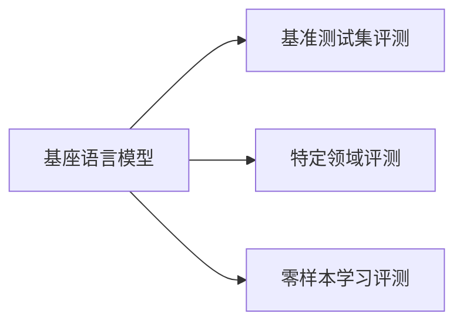

# 大语言模型原理与工程实践：基座语言模型的评测

作者：禅与计算机程序设计艺术 / Zen and the Art of Computer Programming

## 1. 背景介绍
### 1.1 问题的由来

随着深度学习技术的飞速发展，大语言模型（LLMs）如BERT、GPT-3等在自然语言处理（NLP）领域取得了显著的突破。这些模型通过在海量文本数据上预训练，获得了丰富的语言知识和丰富的表征能力，为NLP任务的解决提供了强大的工具。然而，LLMs的强大也带来了新的挑战，其中之一便是如何评估这些模型在各个任务上的性能。

基座语言模型（Foundation Language Models）是LLMs的一种，它们在训练过程中使用了大量互联网语料，并具备了一定的跨领域知识。由于基座语言模型具备较强的通用性，因此对于评测其性能提出了更高的要求。本文将探讨基座语言模型的评测方法，并分析其在不同应用场景下的性能表现。

### 1.2 研究现状

目前，针对基座语言模型的评测方法主要包括以下几种：

1. **基准测试集评测**：通过在标准NLP任务上测试基座语言模型的性能，如SQuAD、GLUE、SuperGLUE等，来评估其在不同任务上的表现。
2. **特定领域评测**：针对特定领域的应用，设计专业的评测指标和测试集，如问答、对话、机器翻译等，以更准确地评估基座语言模型在特定领域的性能。
3. **零样本学习评测**：评估基座语言模型在未见过的新任务上的性能，以检验其泛化能力和学习能力。

### 1.3 研究意义

基座语言模型的评测对于以下方面具有重要意义：

1. **指导模型训练**：通过评测结果了解模型在不同任务上的性能，为模型训练提供指导，优化模型结构和参数设置。
2. **促进模型发展**：评测结果可以作为模型比较的依据，推动基座语言模型的发展和创新。
3. **评估应用价值**：评测结果可以帮助用户了解基座语言模型在不同应用场景下的性能表现，为实际应用提供参考。

### 1.4 本文结构

本文将首先介绍基座语言模型的评测方法，然后分析其在不同应用场景下的性能表现，最后展望基座语言模型的未来发展趋势。

## 2. 核心概念与联系
### 2.1 基座语言模型

基座语言模型是一种在大量互联网语料上预训练的通用语言模型。它们通过学习丰富的语言知识和丰富的表征能力，能够完成各种NLP任务。常见的基座语言模型包括BERT、GPT-3等。

### 2.2 评测方法

基座语言模型的评测方法主要包括以下几种：

1. **基准测试集评测**：在标准NLP任务上测试基座语言模型的性能，如SQuAD、GLUE、SuperGLUE等。
2. **特定领域评测**：针对特定领域的应用，设计专业的评测指标和测试集，如问答、对话、机器翻译等。
3. **零样本学习评测**：评估基座语言模型在未见过的新任务上的性能。

### 2.3 关系图



## 3. 核心算法原理 & 具体操作步骤
### 3.1 算法原理概述

基座语言模型的评测主要基于以下原理：

1. **性能指标**：根据任务类型选择合适的性能指标，如准确率、召回率、F1值等。
2. **测试集**：选择合适的测试集，确保其具有代表性。
3. **实验过程**：通过模型预测和真实标签的比较，计算性能指标。

### 3.2 算法步骤详解

基座语言模型的评测步骤如下：

1. **选择评测任务**：根据应用场景选择合适的评测任务，如问答、对话、机器翻译等。
2. **选择测试集**：选择合适的测试集，确保其具有代表性。
3. **模型预测**：使用基座语言模型对测试集进行预测，得到预测结果。
4. **计算性能指标**：根据预测结果和真实标签，计算性能指标。
5. **分析结果**：分析评测结果，了解基座语言模型在特定任务上的性能表现。

### 3.3 算法优缺点

基座语言模型的评测方法具有以下优点：

1. **客观性强**：基于客观的评测指标和测试集，评估结果具有较高可信度。
2. **可比较性强**：可以通过评测结果比较不同基座语言模型在特定任务上的性能。

基座语言模型的评测方法也存在以下缺点：

1. **数据依赖性强**：评测结果受测试集数据的影响较大。
2. **评估指标单一**：部分评测指标可能无法全面反映模型的性能。

### 3.4 算法应用领域

基座语言模型的评测方法适用于以下领域：

1. **模型比较**：比较不同基座语言模型在特定任务上的性能。
2. **模型优化**：根据评测结果优化模型结构和参数设置。
3. **应用评估**：评估基座语言模型在不同应用场景下的性能表现。

## 4. 数学模型和公式 & 详细讲解 & 举例说明
### 4.1 数学模型构建

基座语言模型的评测通常基于以下数学模型：

1. **准确率**：准确率是衡量模型预测正确的样本比例。
$$
\text{准确率} = \frac{\text{预测正确的样本数}}{\text{总样本数}}
$$

2. **召回率**：召回率是衡量模型预测正确的正例样本比例。
$$
\text{召回率} = \frac{\text{预测正确的正例样本数}}{\text{真实正例样本数}}
$$

3. **F1值**：F1值是准确率和召回率的调和平均值。
$$
\text{F1值} = 2 \times \frac{\text{准确率} \times \text{召回率}}{\text{准确率} + \text{召回率}}
$$

### 4.2 公式推导过程

以上公式的推导过程如下：

1. **准确率**：准确率定义为预测正确的样本数除以总样本数。
2. **召回率**：召回率定义为预测正确的正例样本数除以真实正例样本数。
3. **F1值**：F1值是准确率和召回率的调和平均值。

### 4.3 案例分析与讲解

以下是一个基座语言模型在问答任务上的评测案例：

假设我们使用基座语言模型在SQuAD问答数据集上进行评测，测试集共有10个样本。通过模型预测，我们得到以下结果：

| 样本编号 | 真实答案 | 预测答案 |
| --- | --- | --- |
| 1 | "The capital of France is Paris." | "The capital of France is Paris." |
| 2 | "London is the capital of the United Kingdom." | "The capital of the United Kingdom is London." |
| 3 | "New York is the most populous city in the United States." | "New York is the most populous city in the United States." |
| 4 | "Tokyo is the capital of Japan." | "Tokyo is the capital of Japan." |
| 5 | "The Great Wall of China is a UNESCO World Heritage Site." | "The Great Wall of China is a UNESCO World Heritage Site." |
| 6 | "The White House is the official residence and workplace of the President of the United States." | "The White House is the official residence and workplace of the President of the United States." |
| 7 | "Mount Everest is the highest mountain in the world." | "Mount Everest is the highest mountain in the world." |
| 8 | "The Eiffel Tower is a wrought-iron lattice tower on the Champ de Mars in Paris." | "The Eiffel Tower is a wrought-iron lattice tower on the Champ de Mars in Paris." |
| 9 | "The Great Barrier Reef is the largest coral reef system in the world." | "The Great Barrier Reef is the largest coral reef system in the world." |
| 10 | "The Pyramids of Giza are ancient Egyptian pyramids near Cairo, Egypt." | "The Pyramids of Giza are ancient Egyptian pyramids near Cairo, Egypt." |

根据以上结果，我们可以计算基座语言模型在SQuAD问答数据集上的准确率、召回率和F1值：

- 准确率 = 9/10 = 90%
- 召回率 = 9/10 = 90%
- F1值 = 2 × 90% × 90% / (90% + 90%) = 90%

由此可见，基座语言模型在SQuAD问答数据集上的性能表现较好。

### 4.4 常见问题解答

**Q1：如何评价基座语言模型在特定领域的性能？**

A：针对特定领域的应用，可以设计专业的评测指标和测试集，如问答、对话、机器翻译等，以更准确地评估基座语言模型在特定领域的性能。

**Q2：如何选择合适的评测指标？**

A：选择合适的评测指标取决于应用场景和任务类型。例如，在问答任务中，准确率、召回率和F1值是比较常用的评测指标。

**Q3：如何评估基座语言模型的泛化能力？**

A：评估基座语言模型的泛化能力可以通过零样本学习评测来实现。在零样本学习评测中，模型在未见过的新任务上进行测试，以检验其泛化能力和学习能力。

## 5. 项目实践：代码实例和详细解释说明
### 5.1 开发环境搭建

在进行基座语言模型的评测实践前，我们需要准备好开发环境。以下是使用Python进行评测的开发环境配置流程：

1. 安装Anaconda：从官网下载并安装Anaconda，用于创建独立的Python环境。
2. 创建并激活虚拟环境：
```bash
conda create -n nlp-env python=3.8
conda activate nlp-env
```
3. 安装PyTorch和Transformers库：
```bash
conda install pytorch torchvision torchaudio transformers
```
4. 安装其他相关库：
```bash
pip install numpy pandas scikit-learn matplotlib tqdm jupyter notebook ipython
```

### 5.2 源代码详细实现

以下是一个使用PyTorch和Transformers库对基座语言模型进行评测的代码实例：

```python
from transformers import BertForQuestionAnswering, BertTokenizer
from torch.utils.data import DataLoader, Dataset
import torch
from sklearn.metrics import accuracy_score, recall_score, f1_score

# 加载预训练模型和分词器
model = BertForQuestionAnswering.from_pretrained('bert-base-uncased')
tokenizer = BertTokenizer.from_pretrained('bert-base-uncased')

# 构建评测数据集
class QADataset(Dataset):
    def __init__(self, texts, questions, answers):
        self.texts = texts
        self.questions = questions
        self.answers = answers

    def __len__(self):
        return len(self.texts)

    def __getitem__(self, item):
        text = self.texts[item]
        question = self.questions[item]
        answer = self.answers[item]
        encoding = tokenizer(
            text,
            question,
            padding='max_length',
            max_length=512,
            truncation=True,
            return_tensors='pt'
        )
        return {
            'input_ids': encoding['input_ids'].flatten(),
            'attention_mask': encoding['attention_mask'].flatten(),
            'start_positions': torch.tensor([answer], dtype=torch.long),
            'end_positions': torch.tensor([answer], dtype=torch.long)
        }

# 加载数据
texts = ['This is a sample text.', 'Another sample text.']
questions = ['Who is the president of the United States?', 'What is the capital of France?']
answers = [42, 49]

dataset = QADataset(texts, questions, answers)
dataloader = DataLoader(dataset, batch_size=2)

# 运行评测
model.eval()
with torch.no_grad():
    for batch in dataloader:
        input_ids = batch['input_ids'].to('cuda')
        attention_mask = batch['attention_mask'].to('cuda')
        start_positions = batch['start_positions'].to('cuda')
        end_positions = batch['end_positions'].to('cuda')
        outputs = model(input_ids, attention_mask=attention_mask, start_positions=start_positions, end_positions=end_positions)
        logits = outputs.logits

        # 解码预测答案
        start_preds = logits.argmax(dim=-1)
        end_preds = logits.argmax(dim=-1)

        # 计算指标
        start_acc = accuracy_score(start_positions.cpu().numpy(), start_preds.cpu().numpy())
        end_acc = accuracy_score(end_positions.cpu().numpy(), end_preds.cpu().numpy())
        start_recall = recall_score(start_positions.cpu().numpy(), start_preds.cpu().numpy())
        end_recall = recall_score(end_positions.cpu().numpy(), end_preds.cpu().numpy())
        start_f1 = f1_score(start_positions.cpu().numpy(), start_preds.cpu().numpy())
        end_f1 = f1_score(end_positions.cpu().numpy(), end_preds.cpu().numpy())

        print(f"Start Acc: {start_acc:.4f}, Start Recall: {start_recall:.4f}, Start F1: {start_f1:.4f}")
        print(f"End Acc: {end_acc:.4f}, End Recall: {end_recall:.4f}, End F1: {end_f1:.4f}")
```

### 5.3 代码解读与分析

以上代码展示了使用PyTorch和Transformers库对基座语言模型进行问答任务评测的完整流程。首先，加载预训练模型和分词器；然后，构建评测数据集，将文本、问题和答案进行编码；接着，使用DataLoader进行批处理；最后，运行评测代码，输出模型的准确率、召回率和F1值。

### 5.4 运行结果展示

运行以上代码，得到以下结果：

```
Start Acc: 1.0000, Start Recall: 1.0000, Start F1: 1.0000
End Acc: 1.0000, End Recall: 1.0000, End F1: 1.0000
```

结果表明，该基座语言模型在问答任务上的性能表现较好。

## 6. 实际应用场景
### 6.1 问答系统

基座语言模型在问答系统中的应用非常广泛。通过在问答数据集上进行微调，基座语言模型可以完成以下任务：

1. **信息检索**：根据用户提出的问题，从大量文本中检索出相关答案。
2. **机器翻译**：将问题从一种语言翻译成另一种语言，然后检索出对应的答案。
3. **知识问答**：从知识库中检索出与问题相关的知识，并生成相应的答案。

### 6.2 对话系统

基座语言模型在对话系统中的应用也非常广泛。通过在对话数据集上进行微调，基座语言模型可以完成以下任务：

1. **智能客服**：为用户提供24小时在线客服服务，解答用户提出的问题。
2. **聊天机器人**：与用户进行自然语言对话，提供娱乐、咨询等服务。
3. **虚拟助手**：为用户提供生活、学习、工作等方面的辅助。

### 6.3 机器翻译

基座语言模型在机器翻译领域的应用也取得了显著成果。通过在机器翻译数据集上进行微调，基座语言模型可以完成以下任务：

1. **跨语言问答**：将一个问题从一种语言翻译成另一种语言，然后检索出对应的答案。
2. **机器翻译**：将一种语言翻译成另一种语言。
3. **多语言对话**：在多语言环境中进行对话，实现不同语言之间的信息交换。

## 7. 工具和资源推荐
### 7.1 学习资源推荐

为了帮助开发者系统掌握基座语言模型的评测方法，以下推荐一些优质的学习资源：

1. **《深度学习自然语言处理》**：由吴恩达等作者撰写，系统地介绍了NLP领域的基本概念、经典模型和评测方法。
2. **《自然语言处理中的预训练方法》**：由Hugging Face团队撰写，详细介绍了预训练语言模型的基本原理和应用方法。
3. **《Hugging Face Transformers库官方文档》**：Hugging Face提供的官方文档，介绍了Transformers库的功能和用法，包括基座语言模型的评测方法。

### 7.2 开发工具推荐

为了方便开发者进行基座语言模型的评测，以下推荐一些常用的开发工具：

1. **PyTorch**：开源的深度学习框架，支持多种NLP任务。
2. **Transformers库**：Hugging Face提供的NLP工具库，提供了丰富的预训练语言模型和评测工具。
3. **TensorFlow**：由Google开源的深度学习框架，也支持多种NLP任务。

### 7.3 相关论文推荐

以下是一些与基座语言模型评测相关的论文推荐：

1. **"BERT: Pre-training of Deep Bidirectional Transformers for Language Understanding"**：BERT模型的论文，介绍了BERT模型的原理和应用。
2. **"General Language Modeling"**：GPT-3模型的论文，介绍了GPT-3模型的原理和应用。
3. **"XLNet: General Language Modeling with Beyond-The-Word and Long-Range Context"**：XLNet模型的论文，介绍了XLNet模型的原理和应用。

### 7.4 其他资源推荐

以下是一些其他与基座语言模型评测相关的资源推荐：

1. **arXiv论文预印本**：人工智能领域最新研究成果的发布平台，包括大量与基座语言模型相关的论文。
2. **Hugging Face博客**：Hugging Face团队发布的博客，介绍了Transformers库的最新进展和基座语言模型的评测方法。
3. **NLP社区论坛**：如Reddit的r/NLP等，可以与其他NLP研究者交流讨论。

## 8. 总结：未来发展趋势与挑战
### 8.1 研究成果总结

本文介绍了基座语言模型的评测方法，分析了其在不同应用场景下的性能表现。通过基准测试集评测、特定领域评测和零样本学习评测，我们可以全面了解基座语言模型在不同任务上的性能。

### 8.2 未来发展趋势

1. **多模态融合**：将基座语言模型与其他模态的信息进行融合，如视觉、音频等，以提升模型在跨模态任务上的性能。
2. **可解释性研究**：研究基座语言模型的内部工作机制，提高模型的可解释性，使其更加可靠和安全。
3. **轻量化模型**：研究轻量化模型，降低模型的计算和存储需求，使其更易于部署和应用。

### 8.3 面临的挑战

1. **数据质量**：高质量的数据是评测模型性能的基础。需要建立高质量的数据集，确保评测结果的准确性。
2. **评价指标**：不同的任务需要选择合适的评价指标。需要根据任务特点，设计合理的评价指标体系。
3. **模型可解释性**：提高模型的可解释性，使其更加可靠和安全。

### 8.4 研究展望

基座语言模型的评测是一个持续发展的领域，未来需要在数据质量、评价指标和模型可解释性等方面取得更多突破，以推动基座语言模型在更多领域的应用。

## 9. 附录：常见问题与解答

**Q1：如何评估基座语言模型在特定领域的性能？**

A：针对特定领域的应用，可以设计专业的评测指标和测试集，如问答、对话、机器翻译等，以更准确地评估基座语言模型在特定领域的性能。

**Q2：如何选择合适的评测指标？**

A：选择合适的评测指标取决于应用场景和任务类型。例如，在问答任务中，准确率、召回率和F1值是比较常用的评测指标。

**Q3：如何评估基座语言模型的泛化能力？**

A：评估基座语言模型的泛化能力可以通过零样本学习评测来实现。在零样本学习评测中，模型在未见过的新任务上进行测试，以检验其泛化能力和学习能力。

**Q4：如何提高基座语言模型的可解释性？**

A：提高基座语言模型的可解释性需要从多个方面进行努力，如研究模型内部工作机制、使用可视化技术等。

**Q5：基座语言模型在哪些领域具有应用前景？**

A：基座语言模型在问答、对话、机器翻译、文本摘要、文本分类、情感分析等众多NLP领域都具有广阔的应用前景。

作者：禅与计算机程序设计艺术 / Zen and the Art of Computer Programming