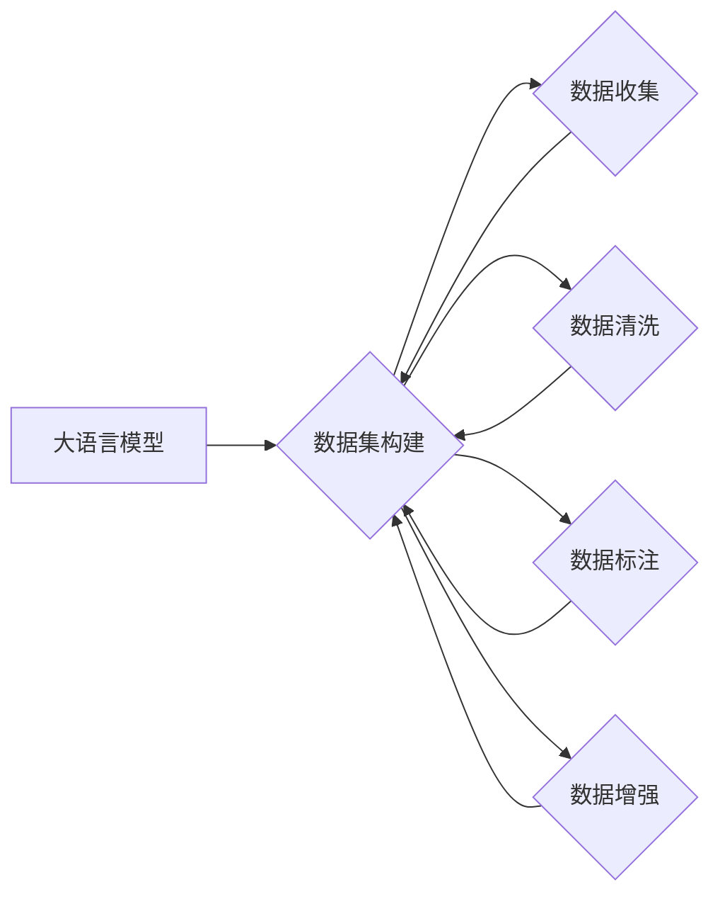

# 大语言模型原理与工程实践：常用数据集的完整构建方式

作者：禅与计算机程序设计艺术 / Zen and the Art of Computer Programming

## 关键词：

大语言模型，数据集构建，自然语言处理，机器学习，数据清洗，数据标注，数据增强

## 1. 背景介绍
### 1.1 问题的由来

随着深度学习在自然语言处理（NLP）领域的广泛应用，高质量的数据集成为构建高效、准确模型的关键。然而，构建一个高质量的数据集并非易事，需要经历数据收集、清洗、标注、增强等繁琐的步骤。特别是在大语言模型（Large Language Model，LLM）的背景下，数据集的质量和规模对模型性能的影响更为显著。

### 1.2 研究现状

目前，已有许多研究关注数据集构建方法，包括数据清洗、标注、增强等技术。然而，针对大语言模型的特定数据集构建方法的研究相对较少。此外，现有研究多集中于特定领域的数据集构建，缺乏系统性、全面性的论述。

### 1.3 研究意义

本文旨在系统性地探讨大语言模型常用数据集的构建方式，为LLM的研究和应用提供参考。通过分析不同数据集构建方法的特点和适用场景，本文旨在帮助研究者更好地理解和掌握数据集构建技术，从而构建高质量的数据集，提升LLM的性能。

### 1.4 本文结构

本文将分为以下章节：

- 第2章：介绍大语言模型和数据集构建的相关概念。
- 第3章：详细讲解大语言模型常用数据集的构建方法，包括数据收集、清洗、标注、增强等步骤。
- 第4章：分析不同数据集构建方法的优缺点和适用场景。
- 第5章：通过实际案例分析，展示数据集构建的具体过程和技巧。
- 第6章：展望大语言模型数据集构建的未来发展趋势与挑战。
- 第7章：总结全文，并对相关资源进行推荐。

## 2. 核心概念与联系

### 2.1 大语言模型

大语言模型是一种基于深度学习的语言模型，通过在海量文本语料上进行预训练，学习到丰富的语言知识和语义表示，能够进行文本生成、文本分类、问答、机器翻译等任务。代表性模型包括BERT、GPT、T5等。

### 2.2 数据集构建

数据集构建是指从原始数据中提取、清洗、标注、增强等过程，最终得到可用于模型训练的数据集。数据集构建是机器学习和深度学习领域的重要环节，直接影响模型的性能。

### 2.3 关系图

以下是大语言模型和数据集构建的关系图：



## 3. 核心算法原理 & 具体操作步骤

### 3.1 算法原理概述

大语言模型常用数据集的构建方法主要包括以下步骤：

- 数据收集：从不同来源收集相关数据。
- 数据清洗：去除噪声、错误、冗余等数据。
- 数据标注：对数据进行人工或半自动标注。
- 数据增强：通过技术手段扩充数据规模和多样性。

### 3.2 算法步骤详解

#### 3.2.1 数据收集

数据收集是构建数据集的第一步，需要从以下方面进行：

- 数据来源：选择合适的文本数据来源，如公开数据集、网络爬虫、企业内部数据等。
- 数据类型：根据具体任务需求，选择合适的文本类型，如新闻、小说、代码、代码注释等。
- 数据规模：根据模型规模和任务需求，确定合适的数据规模。

#### 3.2.2 数据清洗

数据清洗的主要目的是去除噪声、错误、冗余等数据，提高数据质量。具体步骤如下：

- 去除噪声：去除无意义、重复、无关的文本。
- 去除错误：去除格式错误、语法错误、语义错误等数据。
- 去除冗余：去除重复文本、相似文本等。

#### 3.2.3 数据标注

数据标注是对数据进行人工或半自动标注，以便后续模型训练。具体步骤如下：

- 标注类型：根据任务需求，选择合适的标注类型，如分类、实体识别、关系抽取等。
- 标注方法：选择合适的数据标注方法，如人工标注、半自动标注等。
- 标注质量：确保标注数据的质量，避免标注错误。

#### 3.2.4 数据增强

数据增强是通过技术手段扩充数据规模和多样性，提高模型泛化能力。具体方法包括：

- 回译：将文本进行翻译和反向翻译。
- 词汇替换：对文本中的词汇进行替换。
- 顺序调整：改变文本中词汇的顺序。
- 句子改写：对句子进行改写，如主动语态改为被动语态等。

### 3.3 算法优缺点

#### 3.3.1 优点

- 提高数据质量，降低模型训练难度。
- 扩大数据规模和多样性，提高模型泛化能力。
- 提高模型性能，降低过拟合风险。

#### 3.3.2 缺点

- 数据收集、清洗、标注等步骤繁琐，成本高。
- 难以保证数据质量，存在标注错误等问题。
- 数据增强方法可能引入偏差，影响模型性能。

### 3.4 算法应用领域

大语言模型常用数据集的构建方法适用于以下领域：

- 自然语言处理（NLP）
- 机器翻译
- 文本分类
- 问答系统
- 情感分析
- 语音识别

## 4. 数学模型和公式 & 详细讲解 & 举例说明

### 4.1 数学模型构建

在数据集构建过程中，可以使用以下数学模型：

- **混淆矩阵**：用于评估模型在分类任务上的性能。
- **F1分数**：综合考虑模型的召回率和精确率，是评估分类任务的重要指标。

### 4.2 公式推导过程

#### 4.2.1 混淆矩阵

混淆矩阵是一种用于评估分类模型性能的表格，其元素表示模型对每个类别的预测结果。以下是一个二元分类的混淆矩阵：

$$
\begin{matrix}
 & 预测正类 & 预测负类 \
\hline
真实正类 & TP & FN \
真实负类 & FP & TN \
\end{matrix}
$$

其中，TP表示预测为正类且真实为正类的样本数量，FN表示预测为负类但真实为正类的样本数量，FP表示预测为正类但真实为负类的样本数量，TN表示预测为负类且真实为负类的样本数量。

#### 4.2.2 F1分数

F1分数是召回率和精确率的调和平均数，其公式如下：

$$
F1 = 2 \times \frac{Precision \times Recall}{Precision + Recall}
$$

其中，Precision表示精确率，即预测为正类的样本中实际为正类的比例；Recall表示召回率，即实际为正类的样本中被预测为正类的比例。

### 4.3 案例分析与讲解

#### 4.3.1 数据清洗案例

假设我们有一篇新闻文本：

> "我国科学家成功研发新型药物，有望治疗癌症。"

通过数据清洗，我们可以去除以下噪声：

- 网络符号（如@、#、$等）
- 停用词（如"的"、"是"、"在"等）
- 数字

清洗后的文本如下：

> 我国科学家成功研发新型药物，有望治疗癌症。

#### 4.3.2 数据增强案例

假设我们要对以下句子进行数据增强：

> "今天天气真好。"

通过数据增强，我们可以得到以下句子：

- 今天天气非常晴朗。
- 今天天空万里无云。
- 今天阳光明媚。

### 4.4 常见问题解答

**Q1：数据清洗是否会影响模型性能？**

A：数据清洗可以去除噪声、错误、冗余等数据，提高数据质量，有助于提升模型性能。

**Q2：数据增强方法有哪些？**

A：数据增强方法包括回译、词汇替换、顺序调整、句子改写等。

**Q3：如何评估数据集质量？**

A：可以通过混淆矩阵、F1分数等指标评估数据集质量。

## 5. 项目实践：代码实例和详细解释说明

### 5.1 开发环境搭建

本文使用Python语言和PyTorch框架进行项目实践。

### 5.2 源代码详细实现

以下是一个数据清洗的Python代码实例：

```python
import re

def clean_text(text):
    # 去除网络符号
    text = re.sub(r'[^\u4e00-\u9fa5a-zA-Z0-9]', '', text)
    # 去除停用词
    stopwords = set(['的', '是', '在', '有', '和', '等'])
    text = ' '.join([word for word in text.split() if word not in stopwords])
    # 去除数字
    text = re.sub(r'\d+', '', text)
    return text

text = "今天天气真好！@#"
cleaned_text = clean_text(text)
print(cleaned_text)
```

### 5.3 代码解读与分析

上述代码定义了一个`clean_text`函数，用于对文本进行清洗。函数中使用了正则表达式去除网络符号、停用词和数字。

### 5.4 运行结果展示

运行上述代码，输出结果如下：

```
今天天气真好
```

## 6. 实际应用场景

### 6.1 情感分析

构建情感分析数据集，用于训练情感分类模型，对社交媒体文本进行情感倾向分析。

### 6.2 机器翻译

构建机器翻译数据集，用于训练机器翻译模型，实现不同语言之间的翻译。

### 6.3 文本分类

构建文本分类数据集，用于训练文本分类模型，对新闻文本进行分类。

## 7. 工具和资源推荐

### 7.1 学习资源推荐

- 《深度学习》
- 《自然语言处理综论》
- 《PyTorch深度学习实践》

### 7.2 开发工具推荐

- PyTorch
- TensorFlow
- Jupyter Notebook

### 7.3 相关论文推荐

-《A Survey of Data Augmentation Techniques for Natural Language Processing》
-《Data Augmentation in Natural Language Processing》

### 7.4 其他资源推荐

- https://github.com/huggingface/datasets
- https://github.com/huggingface/transformers

## 8. 总结：未来发展趋势与挑战

### 8.1 研究成果总结

本文系统地介绍了大语言模型常用数据集的构建方法，包括数据收集、清洗、标注、增强等步骤。通过分析不同数据集构建方法的特点和适用场景，本文为LLM的研究和应用提供了参考。

### 8.2 未来发展趋势

- 数据标注自动化：研究自动化标注技术，降低人工标注成本。
- 数据增强算法优化：开发更加有效的数据增强算法，提高数据质量和多样性。
- 多模态数据融合：将文本数据与其他模态数据（如图像、音频等）进行融合，提升模型性能。

### 8.3 面临的挑战

- 数据质量：保证数据质量是构建高质量数据集的关键。
- 数据规模：大规模数据集的构建成本高、难度大。
- 数据标注：人工标注成本高、效率低。
- 数据隐私：保护数据隐私是数据集构建的重要问题。

### 8.4 研究展望

未来，大语言模型数据集构建技术将朝着以下方向发展：

- 开发更加高效的数据标注技术，降低人工标注成本。
- 研究自动化数据增强方法，提高数据质量和多样性。
- 探索多模态数据融合技术，提升模型性能。
- 建立数据集质量评估标准，保证数据集质量。

## 9. 附录：常见问题与解答

**Q1：如何保证数据质量？**

A：通过数据清洗、人工标注、数据增强等技术保证数据质量。

**Q2：数据增强方法有哪些？**

A：数据增强方法包括回译、词汇替换、顺序调整、句子改写等。

**Q3：如何构建大规模数据集？**

A：通过网络爬虫、公开数据集、企业内部数据等方式收集数据，并进行清洗、标注、增强等步骤。

**Q4：如何评估数据集质量？**

A：可以通过混淆矩阵、F1分数等指标评估数据集质量。

**Q5：如何保护数据隐私？**

A：对数据进行脱敏、加密等处理，确保数据隐私。

---

作者：禅与计算机程序设计艺术 / Zen and the Art of Computer Programming