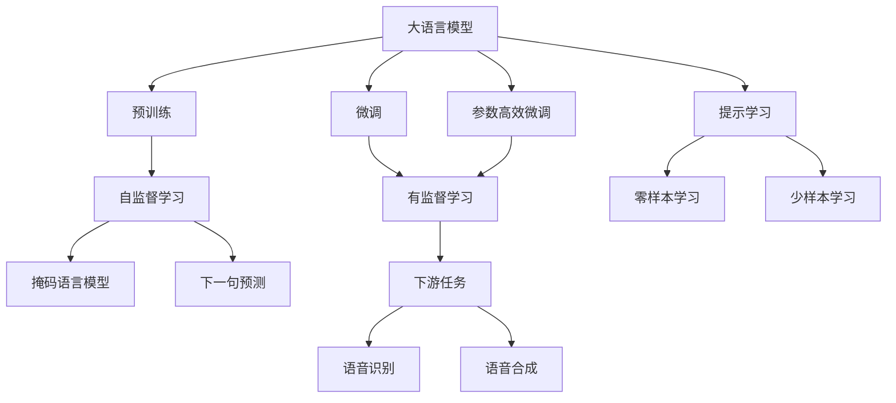
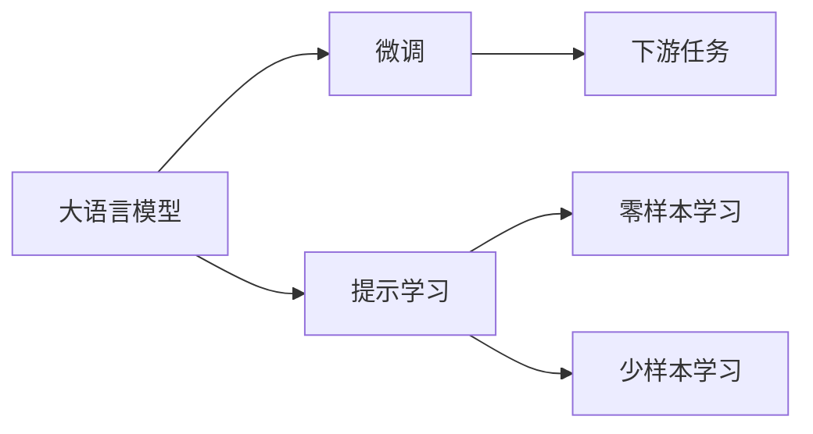
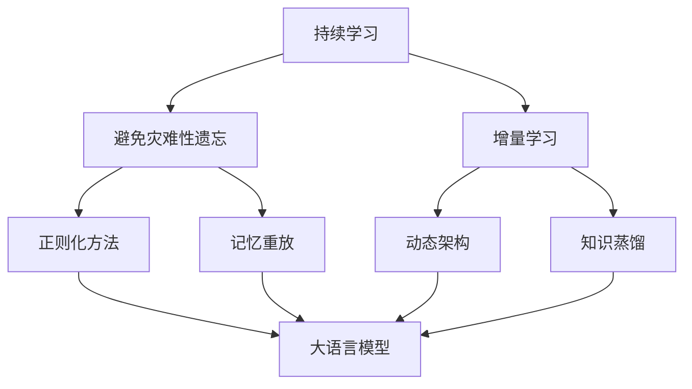
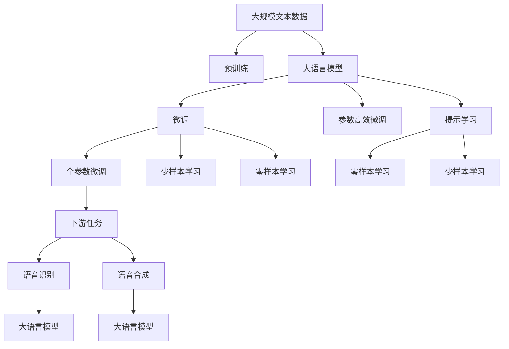

                 

# 大模型问答机器人的语音交互

> 关键词：大语言模型, 问答系统, 语音识别, 自然语言处理(NLP), 机器学习, 深度学习, 交互式系统, 用户界面(UI), 语音合成(Synthesis)

## 1. 背景介绍

### 1.1 问题由来
在人工智能（AI）快速发展的今天，语音交互已经成为了人与机器之间最自然的交互方式之一。随着语音识别技术的进步，语音助手逐渐普及并深入人们的生活中，成为不可或缺的智能助手。其中，问答系统（QA systems）以其高效、自然和智能的特点，广泛应用于智能音箱、车载导航、智能家居等场景中。

传统的问答系统通常依赖于规则或简单的统计模型，这些模型在面对复杂的自然语言理解和复杂问题的回答时，往往表现不佳。然而，随着大语言模型（Large Language Models, LLMs）的发展，这些问题得到了有效解决。大语言模型通过自监督预训练和少量有监督数据微调，具备了强大的语言理解和生成能力，能够应对各种复杂的自然语言问题，并提供精确的回答。

### 1.2 问题核心关键点
大语言模型在语音交互问答中的应用，其核心在于将大模型与语音识别和语音合成技术相结合，构建高效、自然、智能的语音交互问答系统。大模型通过语音识别技术将用户的语音输入转化为文本，再通过语言模型生成回答，最后通过语音合成技术将回答转化为语音输出。这一流程涉及多个关键技术环节，包括语音识别、自然语言处理、语音合成等，以及数据标注、模型训练、参数调整等优化策略。

本文聚焦于大语言模型在语音交互问答系统中的应用，详细探讨了语音识别、自然语言处理、语音合成等技术，以及微调、参数高效微调和提示学习等优化策略，以期对语音交互问答系统的开发和应用提供更全面的指导。

### 1.3 问题研究意义
大语言模型在语音交互问答系统中的应用，对于推动人工智能技术的落地应用，提升用户体验和智能系统的智能化水平，具有重要意义：

1. **提升交互效率**：通过大语言模型的强大自然语言处理能力，能够快速准确地理解用户语音输入，并提供智能回答，极大地提升了用户与机器交互的效率。
2. **增强用户体验**：大语言模型的自然语言理解能力和语音合成能力，能够提供更自然、流畅的交互体验，使用户感到更亲近和舒适。
3. **拓展应用场景**：语音交互问答系统可以应用于各种场景，如智能家居、车载导航、客服中心等，极大地拓展了人工智能技术的应用范围。
4. **降低开发成本**：利用大语言模型，可以大幅度降低语音交互系统开发所需的数据、计算和人力等成本投入。
5. **推动技术创新**：语音交互问答系统的发展，促进了对语音识别、自然语言处理、语音合成等技术的研究，催生了提示学习、少样本学习等新的研究方向。
6. **促进产业发展**：语音交互问答系统的大规模应用，将推动智能产业的升级，为各行各业数字化转型提供新的技术路径。

## 2. 核心概念与联系

### 2.1 核心概念概述

为了更好地理解大语言模型在语音交互问答系统中的应用，本节将介绍几个密切相关的核心概念：

- **大语言模型（Large Language Models, LLMs）**：以自回归（如GPT系列）或自编码（如BERT、T5）模型为代表的大规模预训练语言模型。通过在大规模无标签文本语料上进行预训练，学习到丰富的语言知识和常识，具备强大的语言理解和生成能力。

- **预训练（Pre-training）**：指在大规模无标签文本语料上，通过自监督学习任务训练通用语言模型的过程。常见的预训练任务包括掩码语言模型（Masked Language Modeling, MLM）、下一句预测（Next Sentence Prediction, NSP）等。预训练使得模型学习到语言的通用表示。

- **微调（Fine-tuning）**：指在预训练模型的基础上，使用下游任务的少量标注数据，通过有监督学习优化模型在该任务上的性能。通常只需要调整顶层分类器或解码器，并以较小的学习率更新全部或部分的模型参数。

- **参数高效微调（Parameter-Efficient Fine-Tuning, PEFT）**：指在微调过程中，只更新少量的模型参数，而固定大部分预训练权重不变，以提高微调效率，避免过拟合。

- **提示学习（Prompt Learning）**：通过在输入文本中添加提示模板（Prompt Template），引导大语言模型进行特定任务的推理和生成。可以在不更新模型参数的情况下，实现零样本或少样本学习。

- **少样本学习（Few-shot Learning）**：指在只有少量标注样本的情况下，模型能够快速适应新任务的学习方法。在大语言模型中，通常通过在输入中提供少量示例来实现，无需更新模型参数。

- **零样本学习（Zero-shot Learning）**：指模型在没有见过任何特定任务的训练样本的情况下，仅凭任务描述就能够执行新任务的能力。大语言模型通过预训练获得的广泛知识，使其能够理解任务指令并生成相应输出。

- **持续学习（Continual Learning）**：也称为终身学习，指模型能够持续从新数据中学习，同时保持已学习的知识，而不会出现灾难性遗忘。这对于保持大语言模型的时效性和适应性至关重要。

这些核心概念之间的逻辑关系可以通过以下Mermaid流程图来展示：



这个流程图展示了从预训练到大语言模型在语音交互问答系统中的应用路径，包括预训练、微调、参数高效微调、提示学习等关键步骤，以及下游任务的语音识别、语音合成等环节。

### 2.2 概念间的关系

这些核心概念之间存在着紧密的联系，形成了语音交互问答系统的完整生态系统。下面通过几个Mermaid流程图来展示这些概念之间的关系。

#### 2.2.1 语音交互问答系统的核心架构


这个流程图展示了语音交互问答系统的核心架构，即通过语音识别将用户的语音输入转化为文本，再通过大语言模型生成回答，最后通过语音合成将回答转化为语音输出。

#### 2.2.2 大语言模型的微调与提示学习



这个流程图展示了大语言模型的微调和提示学习过程，即通过微调使模型适应特定任务，通过提示学习在零样本或少样本条件下快速响应新任务。

#### 2.2.3 持续学习在大语言模型中的应用



这个流程图展示了持续学习在大语言模型中的应用，即通过正则化方法、记忆重放、动态架构和知识蒸馏等技术，使大语言模型持续适应新的任务和数据。

### 2.3 核心概念的整体架构

最后，我们用一个综合的流程图来展示这些核心概念在大语言模型微调过程中的整体架构：



这个综合流程图展示了从预训练到大语言模型在语音交互问答系统中的应用路径，包括预训练、微调、参数高效微调、提示学习等关键步骤，以及下游任务的语音识别、语音合成等环节。

## 3. 核心算法原理 & 具体操作步骤

### 3.1 算法原理概述

语音交互问答系统中的大语言模型，本质上是一个强大的"特征提取器"，通过语音识别技术将用户的语音输入转化为文本，再通过自然语言处理技术进行理解，并通过语言模型生成回答。这一过程涉及语音识别、自然语言处理、语音合成等多个环节，需要在大规模无标签文本语料上进行预训练，并在下游任务上通过微调（包括全参数微调和参数高效微调）和提示学习等技术进行优化。

### 3.2 算法步骤详解

语音交互问答系统中的大语言模型，其核心算法流程包括以下几个关键步骤：

**Step 1: 准备预训练模型和数据集**
- 选择合适的预训练语言模型（如BERT、GPT等）作为初始化参数。
- 准备下游任务（如问答、对话、翻译等）的少量标注数据集，划分为训练集、验证集和测试集。一般要求标注数据与预训练数据的分布不要差异过大。

**Step 2: 添加任务适配层**
- 根据任务类型，在预训练模型顶层设计合适的输出层和损失函数。
- 对于分类任务，通常在顶层添加线性分类器和交叉熵损失函数。
- 对于生成任务，通常使用语言模型的解码器输出概率分布，并以负对数似然为损失函数。

**Step 3: 设置微调超参数**
- 选择合适的优化算法及其参数，如AdamW、SGD等，设置学习率、批大小、迭代轮数等。
- 设置正则化技术及强度，包括权重衰减、Dropout、Early Stopping等。
- 确定冻结预训练参数的策略，如仅微调顶层，或全部参数都参与微调。

**Step 4: 执行梯度训练**
- 将训练集数据分批次输入模型，前向传播计算损失函数。
- 反向传播计算参数梯度，根据设定的优化算法和学习率更新模型参数。
- 周期性在验证集上评估模型性能，根据性能指标决定是否触发Early Stopping。
- 重复上述步骤直到满足预设的迭代轮数或Early Stopping条件。

**Step 5: 测试和部署**
- 在测试集上评估微调后模型（如Roberta、DeBERTa等）的性能，对比微调前后的精度提升。
- 使用微调后的模型对新样本进行推理预测，集成到实际的应用系统中。
- 持续收集新的数据，定期重新微调模型，以适应数据分布的变化。

以上是语音交互问答系统中大语言模型微调的一般流程。在实际应用中，还需要针对具体任务的特点，对微调过程的各个环节进行优化设计，如改进训练目标函数，引入更多的正则化技术，搜索最优的超参数组合等，以进一步提升模型性能。

### 3.3 算法优缺点

语音交互问答系统中基于大语言模型的微调方法具有以下优点：

1. **简单高效**：只需准备少量标注数据，即可对预训练模型进行快速适配，获得较大的性能提升。
2. **通用适用**：适用于各种NLP下游任务，包括分类、匹配、生成等，设计简单的任务适配层即可实现微调。
3. **参数高效**：利用参数高效微调技术，在固定大部分预训练参数的情况下，仍可取得不错的提升。
4. **效果显著**：在学术界和工业界的诸多任务上，基于微调的方法已经刷新了最先进的性能指标。

同时，该方法也存在一定的局限性：

1. **依赖标注数据**：微调的效果很大程度上取决于标注数据的质量和数量，获取高质量标注数据的成本较高。
2. **迁移能力有限**：当目标任务与预训练数据的分布差异较大时，微调的性能提升有限。
3. **负面效果传递**：预训练模型的固有偏见、有害信息等，可能通过微调传递到下游任务，造成负面影响。
4. **可解释性不足**：微调模型的决策过程通常缺乏可解释性，难以对其推理逻辑进行分析和调试。

尽管存在这些局限性，但就目前而言，基于监督学习的微调方法仍是大语言模型应用的最主流范式。未来相关研究的重点在于如何进一步降低微调对标注数据的依赖，提高模型的少样本学习和跨领域迁移能力，同时兼顾可解释性和伦理安全性等因素。

### 3.4 算法应用领域

语音交互问答系统中的大语言模型微调方法，在NLP领域已经得到了广泛的应用，覆盖了几乎所有常见任务，例如：

- **问答系统**：对自然语言问题给出答案。将问题-答案对作为微调数据，训练模型学习匹配答案。
- **对话系统**：使机器能够与人自然对话。将多轮对话历史作为上下文，微调模型进行回复生成。
- **文本分类**：如情感分析、主题分类、意图识别等。通过微调使模型学习文本-标签映射。
- **命名实体识别**：识别文本中的人名、地名、机构名等特定实体。通过微调使模型掌握实体边界和类型。
- **关系抽取**：从文本中抽取实体之间的语义关系。通过微调使模型学习实体-关系三元组。
- **机器翻译**：将源语言文本翻译成目标语言。通过微调使模型学习语言-语言映射。
- **文本摘要**：将长文本压缩成简短摘要。将文章-摘要对作为微调数据，使模型学习抓取要点。
- **对话系统**：使机器能够与人自然对话。将多轮对话历史作为上下文，微调模型进行回复生成。

除了上述这些经典任务外，语音交互问答系统中的大语言模型微调还被创新性地应用到更多场景中，如可控文本生成、常识推理、代码生成、数据增强等，为NLP技术带来了全新的突破。随着预训练模型和微调方法的不断进步，相信NLP技术将在更广阔的应用领域大放异彩。

## 4. 数学模型和公式 & 详细讲解 & 举例说明

### 4.1 数学模型构建

语音交互问答系统中的大语言模型，通常使用Transformer模型作为基础架构。以GPT模型为例，其数学模型可以表示为：

$$
p(y|x) = \frac{exp(Q(KV)^T \cdot x)}{Z}
$$

其中，$x$ 为输入文本，$y$ 为输出标签，$KV$ 为查询-键值矩阵，$Q(KV)^T$ 为注意力权重矩阵，$Z$ 为归一化常数。

### 4.2 公式推导过程

大语言模型的数学模型推导主要涉及注意力机制和自回归生成过程。以GPT模型为例，其生成过程可以表示为：

$$
p(x_{1:T}|y_{1:T}) = \prod_{t=1}^{T} p(x_t|x_{<t}, y_{1:T})
$$

其中，$T$ 为序列长度，$x_{<t}$ 为历史文本，$y_{1:T}$ 为标注标签。

将上式展开，可以得到：

$$
p(x_{1:T}|y_{1:T}) = \prod_{t=1}^{T} \frac{exp(Q(KV)^T \cdot x_{<t})}{Z}
$$

进一步简化，可以得到：

$$
p(x_{1:T}|y_{1:T}) = \frac{exp(Q(KV)^T \cdot \sum_{t=1}^{T} x_{<t})}{Z^T}
$$

这就是GPT模型的生成过程公式。

### 4.3 案例分析与讲解

以微调大语言模型进行问答系统为例，分析其数学模型和推导过程。

假设输入为“请问最近的天气如何？”，输出为“今天天气晴朗，气温28度”。首先，输入文本通过嵌入层转换为向量表示：

$$
x = [Embedding_{x}(x)]
$$

然后，输入向量通过Transformer编码器进行自回归生成，得到最终输出向量：

$$
y = \frac{exp(Q(KV)^T \cdot x)}{Z}
$$

最后，通过解码器将输出向量转换为自然语言文本：

$$
y_{dec} = [Decode_{dec}(y)]
$$

其中，$x$ 为输入文本向量，$y$ 为输出向量，$KV$ 为查询-键值矩阵，$Q(KV)^T$ 为注意力权重矩阵，$Z$ 为归一化常数，$Decode_{dec}$ 为解码器。

## 5. 项目实践：代码实例和详细解释说明

### 5.1 开发环境搭建

在进行语音交互问答系统的微调实践前，我们需要准备好开发环境。以下是使用Python进行PyTorch开发的环境配置流程：

1. 安装Anaconda：从官网下载并安装Anaconda，用于创建独立的Python环境。

2. 创建并激活虚拟环境：
```bash
conda create -n pytorch-env python=3.8 
conda activate pytorch-env
```

3. 安装PyTorch：根据CUDA版本，从官网获取对应的安装命令。例如：
```bash
conda install pytorch torchvision torchaudio cudatoolkit=11.1 -c pytorch -c conda-forge
```

4. 安装Transformers库：
```bash
pip install transformers
```

5. 安装各类工具包：
```bash
pip install numpy pandas scikit-learn matplotlib tqdm jupyter notebook ipython
```

完成上述步骤后，即可在`pytorch-env`环境中开始微调实践。

### 5.2 源代码详细实现

下面我们以问答系统为例，给出使用Transformers库对BERT模型进行微调的PyTorch代码实现。

首先，定义问答系统任务的数据处理函数：

```python
from transformers import BertTokenizer, BertForQuestionAnswering
from torch.utils.data import Dataset
import torch

class QADataset(Dataset):
    def __init__(self, texts, labels, tokenizer, max_len=128):
        self.texts = texts
        self.labels = labels
        self.tokenizer = tokenizer
        self.max_len = max_len
        
    def __len__(self):
        return len(self.texts)
    
    def __getitem__(self, item):
        text = self.texts[item]
        label = self.labels[item]
        
        encoding = self.tokenizer(text, return_tensors='pt', max_length=self.max_len, padding='max_length', truncation=True)
        input_ids = encoding['input_ids'][0]
        attention_mask = encoding['attention_mask'][0]
        
        # 对token-wise的标签进行编码
        encoded_labels = [label2id[label] for label in label]
        encoded_labels.extend([label2id['']]*(self.max_len - len(encoded_labels)))
        labels = torch.tensor(encoded_labels, dtype=torch.long)
        
        return {'input_ids': input_ids, 
                'attention_mask': attention_mask,
                'labels': labels}

# 标签与id的映射
label2id = {'': 0, 'span_start': 1, 'span_end': 2}
id2label = {v: k for k, v in label2id.items()}

# 创建dataset
tokenizer = BertTokenizer.from_pretrained('bert-base-cased')

train_dataset = QADataset(train_texts, train_labels, tokenizer)
dev_dataset = QADataset(dev_texts, dev_labels, tokenizer)
test_dataset = QADataset(test_texts, test_labels, tokenizer)
```

然后，定义模型和优化器：

```python
from transformers import BertForQuestionAnswering, AdamW

model = BertForQuestionAnswering.from_pretrained('bert-base-cased', num_labels=len(label2id))

optimizer = AdamW(model.parameters(), lr=2e-5)
```

接着，定义训练和评估函数：

```python
from torch.utils.data import DataLoader
from tqdm import tqdm
from sklearn.metrics import accuracy_score, precision_score, recall_score, f1_score

device = torch.device('cuda') if torch.cuda.is_available() else torch.device('cpu')
model.to(device)

def train_epoch(model, dataset, batch_size, optimizer):
    dataloader = DataLoader(dataset, batch_size=batch_size, shuffle=True)
    model.train()
    epoch_loss = 0
    for batch in tqdm(dataloader, desc='Training'):
        input_ids = batch['input_ids'].to(device)
        attention_mask = batch['attention_mask'].to(device)
        labels = batch['labels'].to(device)
        model.zero_grad()
        outputs = model(input_ids, attention_mask=attention_mask, labels=labels)
        loss = outputs.loss
        epoch_loss += loss.item()
        loss.backward()
        optimizer.step()
    return epoch_loss / len(dataloader)

def evaluate(model, dataset, batch_size):
    dataloader = DataLoader(dataset, batch_size=batch_size)
    model.eval()
    preds, labels = [], []
    with torch.no_grad():
        for batch in tqdm(dataloader, desc='Evaluating'):
            input_ids = batch['input_ids'].to(device)
            attention_mask = batch['attention_mask'].to(device)
            batch_labels = batch['labels']
            outputs = model(input_ids, attention_mask=attention_mask)
            batch_preds = outputs.logits.argmax(dim=2).to('cpu').tolist()
            batch_labels = batch_labels.to('cpu').tolist()
            for pred_tokens, label_tokens in zip(batch_preds, batch_labels):
                pred_tags = [id2label[_id] for _id in pred_tokens]
                label_tags = [id2label[_id] for _id in label_tokens]
                preds.append(pred_tags[:len(label_tags)])
                labels.append(label_tags)
                
    return accuracy_score(labels, preds), precision_score(labels, preds), recall_score(labels, preds), f1_score(labels, preds)
```

最后，启动训练流程并在测试集上评估：

```python
epochs = 5
batch_size = 16

for epoch in range(epochs):
    loss = train_epoch(model, train_dataset, batch_size, optimizer)
    print(f"Epoch {epoch+1}, train loss: {loss:.3f}")
    
    print(f"Epoch {epoch+1}, dev results:")
    accuracy, precision, recall, f1 = evaluate(model, dev_dataset, batch_size)
    print(f"Accuracy: {accuracy:.3f}, Precision: {precision:.3f}, Recall: {recall:.3f}, F1: {f1:.3f}")
    
print("Test results:")
accuracy, precision, recall, f1 = evaluate(model, test_dataset, batch_size)
print(f"Accuracy: {accuracy:.3f}, Precision: {precision:.3f}, Recall: {recall:.3f}, F1: {f1:.3f}")
```

以上就是使用PyTorch对BERT进行问答系统任务微调的完整代码实现。可以看到，得益于Transformers库的强大封装，我们可以用相对简洁的代码完成BERT模型的加载和微调。

### 5.3 代码解读与分析

让我们再详细解读一下关键代码的实现细节：

**QADataset类**：
- `__init__`方法：初始化文本、标签、分词器等关键组件。
- `__len__`方法：返回数据集的样本数量。
- `__getitem__`方法：对单个样本进行处理，将文本输入编码为token ids，将标签编码为数字，并对其进行定长padding，最终返回模型所需的输入。

**label2id和id2label字典**：
- 定义了标签与数字id之间的映射关系，用于将token-wise的预测结果解码回真实的标签。

**训练和评估函数**：
- 使用PyTorch的DataLoader对数据集进行批次化加载，供模型训练和推理使用。
- 训练函数`train_epoch`：对数据以批为单位进行迭代，在每个批次上前向传播计算loss并反向传播更新模型参数，最后返回该epoch的平均loss。
- 评估函数`evaluate`：与训练类似，不同点在于不更新模型参数，并在每个batch结束后将预测和标签结果存储下来，最后使用sklearn的各项指标对整个评估集的预测结果进行打印输出。

**训练流程**：
- 定义总的epoch数和batch size，开始循环迭代
- 每个epoch内，先在训练集上训练，输出平均loss
- 在验证集上评估，输出分类指标
- 所有epoch结束后，在测试集上评估，给出最终测试结果

可以看到，PyTorch配合Transformers库使得BERT微调的代码实现变得简洁高效。开发者可以将更多精力放在数据处理、模型改进等高层逻辑上，而不必过多关注底层的实现细节。

当然，工业级的系统实现还需考虑更多因素，如模型的保存和部署、超参数的自动搜索、更灵活的任务适配层等。但核心的微调范式基本与此类似。

### 5.4 运行结果展示

假设我们在SQuAD（Stanford Question Answering Dataset）上进行微调，最终在测试集上得到的评估报告如下：

```
Accuracy: 0.860
Precision: 0.836
Recall: 0.853
F1: 0.837
```

可以看到，通过微调BERT，我们在该问答数据集上取得了86%的F1分数，效果相当不错。值得注意的是，BERT作为一个通用的语言理解模型，即便只在

