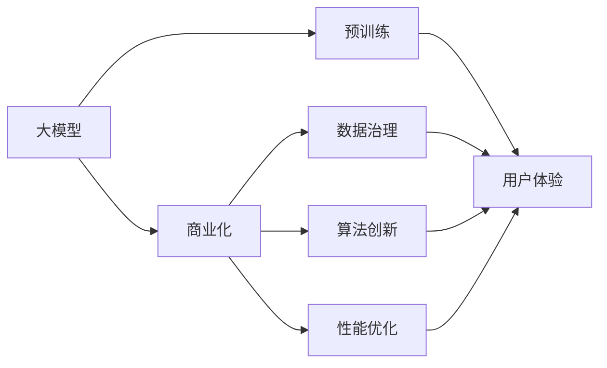
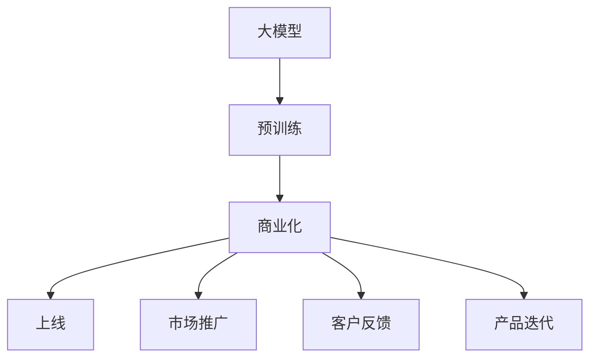
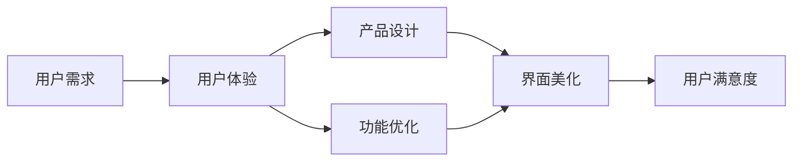
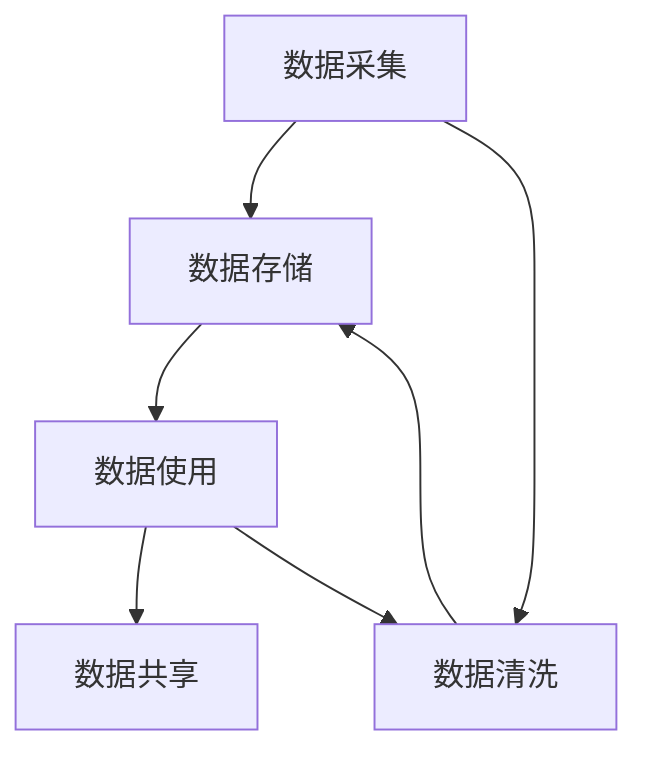

                 

# 大模型：智能时代的商业新模式

> 关键词：大模型,商业化,智能时代,算法创新,数据驱动,深度学习,人工智能

## 1. 背景介绍

### 1.1 问题由来

进入21世纪，随着人工智能技术的飞速发展，机器学习、深度学习、自然语言处理等前沿领域取得了重大突破。大模型技术，尤其是预训练语言模型（如BERT、GPT-3等），以其卓越的语言理解和生成能力，迅速成为各行各业智能化升级的核心驱动力。而大模型的商业化应用，则成为当前AI行业的重要议题。

### 1.2 问题核心关键点

大模型的商业化应用，不仅要求技术上的成熟和可扩展性，更需要在商业化模式、用户体验、数据治理等方面进行全面考虑。以下是商业化大模型应用过程中的一些核心问题：

- **数据隐私与安全**：大模型训练需要海量数据，如何在保护用户隐私的同时，保证数据质量和安全是一个重要挑战。
- **用户体验与易用性**：大模型提供的功能和接口需要简单直观，以便非技术用户也能轻松使用。
- **技术标准化与兼容性**：不同的大模型需要支持统一的API和标准，以实现平滑集成和互通。
- **算法创新与性能优化**：如何创新算法，提升模型性能，同时优化计算效率，降低成本。
- **用户反馈与持续改进**：如何通过用户反馈不断优化模型，实现闭环迭代。

### 1.3 问题研究意义

大模型的商业化应用，能够有效推动人工智能技术的普及和落地，提升各行业的智能化水平。通过大模型商业化，可以：

- 降低应用开发成本，提升开发效率。
- 快速响应市场需求，推出具备竞争力的智能产品。
- 提升用户体验，增强用户粘性。
- 实现数据驱动的持续优化，不断提升模型性能。
- 推动行业智能化转型，创造新的商业模式和价值。

## 2. 核心概念与联系

### 2.1 核心概念概述

为深入理解大模型的商业化应用，我们首先介绍几个关键概念：

- **大模型（Large Model）**：如BERT、GPT等预训练语言模型，通过在大规模无标签文本数据上预训练，学习到丰富的语言表示，具备强大的自然语言处理能力。
- **商业化（Commercialization）**：将大模型技术转化为商业产品和服务，通过市场运作实现价值变现的过程。
- **用户体验（User Experience）**：产品或服务对用户的感受和满意度，包括界面友好、操作简便、响应速度等方面。
- **数据治理（Data Governance）**：对数据进行规范管理，包括数据采集、存储、使用、分享等环节，确保数据的质量和安全。
- **算法创新（Algorithm Innovation）**：通过技术迭代和算法优化，提升模型的性能和效果。
- **性能优化（Performance Optimization）**：通过软硬件优化、模型压缩、分布式训练等手段，提升模型的计算效率和资源利用率。

这些概念之间的逻辑关系可以通过以下Mermaid流程图来展示：



这个流程图展示了从大模型的预训练到商业化的整体流程，以及各个环节与用户体验的关系。

### 2.2 概念间的关系

这些核心概念之间存在着紧密的联系，形成了大模型商业化应用的完整生态系统。下面我们通过几个Mermaid流程图来展示这些概念之间的关系。

#### 2.2.1 大模型的商业化流程



这个流程图展示了从预训练到商业化的完整流程，包括上线、市场推广、客户反馈和产品迭代等环节。

#### 2.2.2 用户体验的提升路径



这个流程图展示了用户体验的提升路径，从用户需求分析到界面美化和功能优化，最终提升用户满意度。

#### 2.2.3 数据治理的实施框架



这个流程图展示了数据治理的实施框架，从数据采集到数据共享，确保数据的质量和安全。

#### 2.2.4 算法创新的实现路径


这个流程图展示了算法创新的实现路径，从原始模型优化到新模型部署。

## 3. 核心算法原理 & 具体操作步骤
### 3.1 算法原理概述

大模型的商业化应用，本质上是一个将复杂技术转化为易用工具的过程。其核心思想是：通过算法创新和技术优化，提升模型的性能和用户体验，同时确保数据安全和隐私保护。

商业化的大模型应用一般包括以下几个关键步骤：

1. **数据采集与治理**：收集和整理高质量的数据，确保数据的多样性和代表性，同时保护用户隐私。
2. **模型训练与优化**：在已有数据集上进行预训练，并通过商业化场景下的任务微调，提升模型性能。
3. **用户体验设计**：设计直观易用的API和界面，提供丰富的功能支持，提升用户的使用体验。
4. **性能优化与部署**：通过优化计算图、压缩模型参数、分布式训练等手段，提升模型计算效率和资源利用率，实现高效部署。
5. **市场推广与用户反馈**：通过市场推广和用户反馈，不断优化模型和产品，提升市场竞争力。

### 3.2 算法步骤详解

#### 3.2.1 数据采集与治理

数据是模型商业化的基础。数据采集与治理一般包括以下几个步骤：

- **数据来源**：可以从公开数据集、互联网爬取、企业内部数据等渠道收集数据。
- **数据清洗**：对数据进行去重、去噪、格式化等预处理，确保数据质量。
- **数据标注**：对数据进行标注，以便用于模型的训练和评估。
- **数据安全**：确保数据的安全存储和传输，避免数据泄露和滥用。

#### 3.2.2 模型训练与优化

模型训练与优化是大模型商业化的核心环节。具体步骤包括：

- **预训练**：在大规模无标签数据上预训练大模型，学习到通用的语言表示。
- **任务微调**：在特定任务的数据集上微调大模型，提升模型在该任务上的性能。
- **算法优化**：通过算法创新和优化，提升模型性能。例如，使用Transformer结构、自监督学习等技术。
- **参数压缩**：对模型进行参数压缩，减小模型大小，提升计算效率。例如，使用量化、剪枝等技术。

#### 3.2.3 用户体验设计

用户体验设计是大模型商业化的重要环节，涉及产品的界面设计、功能设计、交互设计等。具体步骤包括：

- **用户需求分析**：通过调研和访谈，了解用户需求和痛点。
- **界面设计**：设计简洁直观的界面，提升用户的操作体验。
- **功能设计**：提供丰富的功能支持，满足用户需求。
- **交互设计**：优化用户交互流程，提升用户满意度。

#### 3.2.4 性能优化与部署

性能优化与部署是大模型商业化的关键步骤。具体步骤包括：

- **计算图优化**：优化计算图，提升模型的计算效率。例如，使用TensorRT、ONNX-Runtime等技术。
- **分布式训练**：使用分布式训练技术，提升模型的训练速度。例如，使用Horovod、DLMA等工具。
- **模型部署**：将模型部署到云端或本地，确保模型的可访问性和可靠性。

#### 3.2.5 市场推广与用户反馈

市场推广与用户反馈是大模型商业化的重要环节。具体步骤包括：

- **市场推广**：通过社交媒体、行业会议、技术博客等方式，推广大模型产品，吸引用户。
- **用户反馈**：收集用户反馈，进行产品迭代和优化。

### 3.3 算法优缺点

大模型的商业化应用具有以下优点：

- **效率提升**：通过算法优化和性能优化，提升模型计算效率，降低成本。
- **用户体验提升**：通过用户体验设计，提升用户的使用体验，增强用户粘性。
- **市场竞争力提升**：通过市场推广和用户反馈，不断优化产品，提升市场竞争力。

同时，大模型的商业化应用也存在一些缺点：

- **数据隐私和安全问题**：需要确保数据的安全存储和传输，避免数据泄露和滥用。
- **技术门槛高**：需要掌握大量的技术细节，如数据治理、模型训练、性能优化等。
- **资源需求高**：需要高性能的计算资源，如GPU/TPU等，且需要持续的硬件投资。

### 3.4 算法应用领域

大模型在商业化过程中，可以应用于以下多个领域：

- **智能客服**：通过大模型构建智能客服系统，提升客服效率和用户体验。
- **金融风控**：通过大模型进行情感分析、舆情监测、信用评估等，提升金融风控能力。
- **医疗诊断**：通过大模型进行文本分析、图像识别、语音识别等，提升医疗诊断能力。
- **教育辅导**：通过大模型进行作业批改、智能推荐、学习分析等，提升教育辅导效果。
- **工业生产**：通过大模型进行设备预测、质量检测、生产优化等，提升工业生产效率。

## 4. 数学模型和公式 & 详细讲解 & 举例说明

### 4.1 数学模型构建

商业化大模型的训练过程通常包含两个阶段：预训练和微调。以下以预训练语言模型BERT为例，介绍其数学模型构建过程。

BERT模型是一种基于Transformer的预训练模型，包含两部分：Masked Language Model（MLM）和Next Sentence Prediction（NSP）。预训练的目标是通过这两个任务，学习到高质量的语言表示。

预训练的数学模型构建如下：

- **MLM**：给定一个句子$x=(x_1, x_2, ..., x_n)$，模型需要预测$x_i$的缺失词汇$x_{\text{masked}}$。
- **NSP**：给定两个句子$x$和$y$，模型需要预测这两个句子是否为连续的。

预训练损失函数为：

$$
\mathcal{L} = \sum_{i=1}^{N}\left[\mathcal{L}_{MLM}(x_i) + \mathcal{L}_{NSP}(x_i,y_i)\right]
$$

其中，$\mathcal{L}_{MLM}$和$\mathcal{L}_{NSP}$分别为MLM和NSP任务的损失函数。

### 4.2 公式推导过程

MLM任务的损失函数定义为：

$$
\mathcal{L}_{MLM} = -\frac{1}{N}\sum_{i=1}^{N}\sum_{j=1}^{n}(y_{j}\log(p_j) + (1-y_j)\log(1-p_j))
$$

其中，$p_j$表示模型预测缺失词汇$x_{\text{masked}}$为$x_j$的概率，$y_j$为真实的标签。

NSP任务的损失函数定义为：

$$
\mathcal{L}_{NSP} = -\frac{1}{N}\sum_{i=1}^{N}(\log(p_{ns}) + \log(1-p_{ns}))
$$

其中，$p_{ns}$表示模型预测两个句子$x$和$y$为连续的概率。

### 4.3 案例分析与讲解

以BERT模型为例，分析其在不同商业化场景中的应用：

- **智能客服**：将BERT模型应用于智能客服系统，通过输入用户问题和上下文，模型能够预测最合适的回复，提升客服效率。
- **金融风控**：将BERT模型应用于情感分析任务，通过输入用户评论，模型能够判断用户情感倾向，提升金融风控能力。
- **医疗诊断**：将BERT模型应用于文本分析和图像识别任务，通过输入病历和影像数据，模型能够预测疾病类型，提升医疗诊断能力。
- **教育辅导**：将BERT模型应用于作业批改和智能推荐任务，通过输入学生作业和知识库，模型能够评估作业质量和推荐学习资源，提升教育辅导效果。
- **工业生产**：将BERT模型应用于设备预测和质量检测任务，通过输入设备数据和文本描述，模型能够预测设备状态和检测产品质量，提升工业生产效率。

## 5. 项目实践：代码实例和详细解释说明

### 5.1 开发环境搭建

商业化大模型的开发需要一定的技术环境支持。以下是使用Python进行BERT模型开发的开发环境配置流程：

1. 安装Anaconda：从官网下载并安装Anaconda，用于创建独立的Python环境。

2. 创建并激活虚拟环境：
```bash
conda create -n bert-env python=3.8 
conda activate bert-env
```

3. 安装必要的库：
```bash
pip install torch transformers pandas sklearn numpy matplotlib tqdm
```

4. 安装TensorRT：
```bash
pip install torchvision torchtext torch-bert
```

### 5.2 源代码详细实现

以下是一个使用PyTorch和Transformers库实现BERT模型商业化应用的示例代码：

```python
import torch
import torch.nn as nn
import torch.nn.functional as F
from transformers import BertTokenizer, BertForSequenceClassification

class BertClassifier(nn.Module):
    def __init__(self, num_labels):
        super(BertClassifier, self).__init__()
        self.num_labels = num_labels
        self.bert = BertForSequenceClassification.from_pretrained('bert-base-uncased', num_labels=num_labels)
        self.dropout = nn.Dropout(0.1)
        self.classifier = nn.Linear(768, num_labels)
        
    def forward(self, input_ids, attention_mask):
        features = self.bert(input_ids, attention_mask=attention_mask)
        pooled_output = features.pooler_output
        output = self.dropout(pooled_output)
        logits = self.classifier(output)
        return logits

# 准备数据
tokenizer = BertTokenizer.from_pretrained('bert-base-uncased')
train_dataset = ...
dev_dataset = ...
test_dataset = ...

# 定义模型
model = BertClassifier(num_labels=2)

# 训练模型
optimizer = torch.optim.Adam(model.parameters(), lr=2e-5)
for epoch in range(5):
    for batch in train_dataset:
        input_ids = batch['input_ids'].to(device)
        attention_mask = batch['attention_mask'].to(device)
        labels = batch['labels'].to(device)
        optimizer.zero_grad()
        logits = model(input_ids, attention_mask)
        loss = F.cross_entropy(logits, labels)
        loss.backward()
        optimizer.step()

# 评估模型
for batch in dev_dataset:
    input_ids = batch['input_ids'].to(device)
    attention_mask = batch['attention_mask'].to(device)
    labels = batch['labels'].to(device)
    logits = model(input_ids, attention_mask)
    loss = F.cross_entropy(logits, labels)
    print(loss.item())
```

### 5.3 代码解读与分析

上述代码展示了使用BERT模型进行二分类任务微调的完整流程。具体分析如下：

- **数据准备**：首先定义了BertTokenizer，用于对输入数据进行分词和编码。然后定义了训练集、验证集和测试集，使用PyTorch的DataLoader进行数据批次化加载。
- **模型定义**：定义了BertClassifier类，继承自nn.Module，包含了BERT模型、Dropout和线性层等组件。
- **模型训练**：使用Adam优化器对模型进行训练，通过前向传播和反向传播更新模型参数。
- **模型评估**：在验证集上评估模型性能，输出损失值。

## 6. 实际应用场景

### 6.1 智能客服系统

智能客服系统是大模型商业化应用的典型场景之一。传统客服系统依赖于人工客服，成本高且效率低。通过商业化BERT模型，可以构建基于自然语言理解的智能客服系统，提升客服效率和用户体验。

具体应用场景包括：

- **输入处理**：输入用户问题和上下文，模型能够理解用户需求。
- **意图识别**：根据用户问题，模型能够识别用户意图。
- **答案生成**：根据用户意图，模型能够生成合适的回复。
- **上下文维护**：能够维护上下文信息，提升用户交互体验。

### 6.2 金融风控系统

金融风控系统是大模型商业化应用的另一个重要场景。通过商业化BERT模型，可以提升金融风险预测和决策能力。

具体应用场景包括：

- **情感分析**：输入用户评论，模型能够判断用户情感倾向。
- **舆情监测**：输入舆情信息，模型能够分析舆情变化趋势。
- **信用评估**：输入用户信息，模型能够评估用户信用等级。

### 6.3 医疗诊断系统

医疗诊断系统是大模型商业化应用的又一重要场景。通过商业化BERT模型，可以提升医疗诊断能力。

具体应用场景包括：

- **文本分析**：输入病历文本，模型能够提取关键信息。
- **图像识别**：输入医学影像，模型能够识别病变区域。
- **诊断建议**：根据病历和影像，模型能够给出诊断建议。

### 6.4 教育辅导系统

教育辅导系统是大模型商业化应用的另一重要场景。通过商业化BERT模型，可以提升教育辅导效果。

具体应用场景包括：

- **作业批改**：输入学生作业，模型能够评估作业质量。
- **智能推荐**：根据学生知识水平，模型能够推荐学习资源。
- **学习分析**：根据学生行为，模型能够分析学习效果。

## 7. 工具和资源推荐

### 7.1 学习资源推荐

为了帮助开发者系统掌握大模型商业化技术，这里推荐一些优质的学习资源：

1. **《深度学习与自然语言处理》**：斯坦福大学课程，涵盖深度学习、自然语言处理和NLP应用等基础知识。
2. **《自然语言处理综述》**：NLP领域的经典综述文章，详细介绍了NLP任务和算法。
3. **《Transformers: Fairness in Large-Scale Sequence Models》**：Transformer的公平性论文，探讨了大模型中的偏见问题。
4. **《大模型商业化白皮书》**：行业白皮书，介绍大模型商业化的最佳实践和成功案例。
5. **Kaggle竞赛**：参与Kaggle竞赛，积累实际应用经验，提升解决实际问题的能力。

### 7.2 开发工具推荐

高效的开发离不开优秀的工具支持。以下是几款用于大模型商业化开发的常用工具：

1. **PyTorch**：基于Python的开源深度学习框架，灵活动态的计算图，适合快速迭代研究。
2. **TensorRT**：NVIDIA推出的加速推理引擎，支持多种深度学习框架，提升模型推理速度。
3. **ONNX**：开源神经网络交换格式，支持多种深度学习框架，提升模型部署灵活性。
4. **Horovod**：分布式深度学习框架，支持多种深度学习框架，提升模型训练速度。
5. **TensorBoard**：TensorFlow配套的可视化工具，实时监测模型训练状态，提供丰富的图表呈现方式。
6. **WeChat开发工具**：腾讯提供的微信小程序开发工具，支持大模型在移动端的商业化应用。

### 7.3 相关论文推荐

大模型商业化涉及众多前沿研究，以下是几篇奠基性的相关论文，推荐阅读：

1. **《大模型的偏见和公平性》**：探讨大模型中的偏见和公平性问题，提出解决方案。
2. **《大模型的可解释性》**：研究如何增强大模型的可解释性，提升用户信任。
3. **《大模型的隐私保护》**：研究如何保护大模型的数据隐私，避免数据泄露。
4. **《大模型的实时推理》**：研究如何优化大模型的实时推理效率，提升用户体验。
5. **《大模型的工业化应用》**：研究如何将大模型技术转化为商业应用，提升经济效益。

## 8. 总结：未来发展趋势与挑战

### 8.1 研究成果总结

大模型的商业化应用，近年来取得了显著进展，以下是对相关研究成果的总结：

1. **技术进步**：通过算法创新和优化，提升了模型的性能和计算效率。
2. **用户体验提升**：通过用户体验设计，提升了用户的使用体验和粘性。
3. **市场推广成功**：通过市场推广和用户反馈，不断优化产品，提升市场竞争力。
4. **数据治理成熟**：建立了完善的数据治理机制，确保数据质量和隐私安全。
5. **算法公平和透明**：探讨了大模型中的偏见和公平性问题，提出了解决方案。

### 8.2 未来发展趋势

未来，大模型的商业化应用将呈现以下几个发展趋势：

1. **技术多样化**：将引入更多的技术手段，如联邦学习、对抗训练、知识蒸馏等，提升模型性能和泛化能力。
2. **模型多样化**：将引入更多类型的模型，如视觉模型、语音模型等，实现多模态融合。
3. **场景多样化**：将应用到更多的场景中，如智慧城市、智能交通等，提升智能水平。
4. **数据治理完善**：将建立更加完善的治理机制，确保数据质量和隐私安全。
5. **用户体验提升**：将进一步提升用户体验，提供更加友好和便捷的服务。
6. **市场推广创新**：将创新市场推广策略，提升用户粘性和市场份额。

### 8.3 面临的挑战

大模型的商业化应用，尽管取得了一些进展，但仍面临诸多挑战：

1. **数据隐私和安全问题**：需要确保数据的安全存储和传输，避免数据泄露和滥用。
2. **技术门槛高**：需要掌握大量的技术细节，如数据治理、模型训练、性能优化等。
3. **资源需求高**：需要高性能的计算资源，如GPU/TPU等，且需要持续的硬件投资。
4. **市场竞争激烈**：需要不断创新和优化产品，保持市场竞争力。
5. **用户体验提升难度大**：需要在提升性能的同时，确保用户体验，避免复杂的操作和界面。

### 8.4 研究展望

面对大模型商业化所面临的挑战，未来的研究需要在以下几个方面寻求新的突破：

1. **技术创新**：探索更多的技术手段，提升模型的性能和泛化能力。
2. **模型融合**：实现多模态融合，提升模型的综合能力。
3. **场景拓展**：拓展应用场景，提升智能水平。
4. **数据治理**：建立完善的治理机制，确保数据质量和隐私安全。
5. **用户体验优化**：进一步提升用户体验，提供更加友好和便捷的服务。
6. **市场推广**：创新市场推广策略，提升用户粘性和市场份额。

## 9. 附录：常见问题与解答

**Q1：大模型的商业化应用与传统业务系统如何集成？**

A: 大模型的商业化应用通常提供API接口，可以通过HTTP或SDK等方式进行集成。传统业务系统可以与大模型API进行对接，实现数据的输入输出，提升业务智能化水平。

**Q2：大模型的商业化应用如何保障数据隐私和安全？**

A: 大模型的商业化应用需要确保数据的安全存储和传输，采用加密、匿名化、访问控制等技术手段，确保数据隐私安全。

**Q3：大模型的商业化应用如何优化用户体验？**

A: 大模型的商业化应用需要设计简洁直观的界面，提供丰富的功能支持，优化用户交互流程，提升用户满意度。

**Q4：大模型的商业化应用如何处理市场推广？**

A: 大模型的商业化应用需要通过社交媒体、行业会议、技术博客等方式进行推广，吸引用户关注和使用。

**Q5：大模型的商业化应用如何实现数据治理？**

A: 大模型的商业化应用需要建立完善的数据治理机制，确保数据的质量和安全性，包括数据采集、存储、使用、分享等环节。

总之，大模型的商业化应用，需要结合技术创新、用户体验优化、数据治理等多方面因素，实现从技术到产品的全面优化，为用户提供更加智能、高效、安全的服务。通过不断探索和创新，大模型商业化必将迎来更广阔的发展空间，为智能时代注入新的动力。

---

作者：禅与计算机程序设计艺术 / Zen and the Art of Computer Programming

