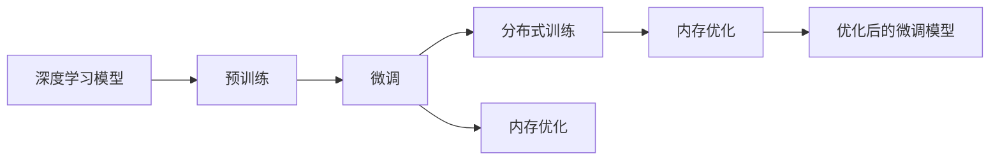
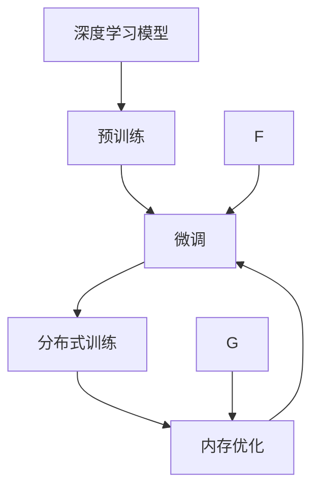
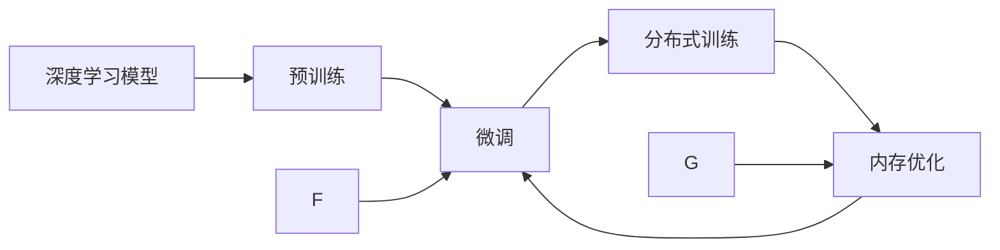
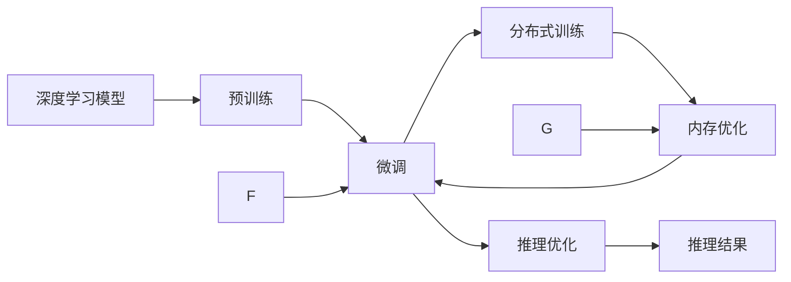
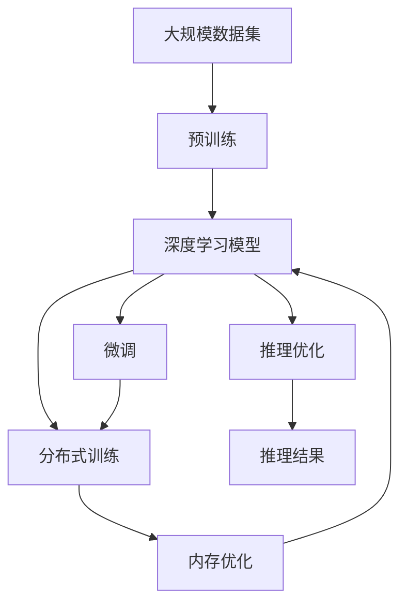

                 

# 大规模语言模型从理论到实践 DeepSpeed实践

## 1. 背景介绍

### 1.1 问题由来
随着深度学习技术的迅猛发展，大规模语言模型（Large Language Models, LLMs）在自然语言处理（Natural Language Processing, NLP）领域取得了突破性进展。这些模型通常基于自回归或自编码模型，通过在大规模无标签文本语料库上进行预训练，学习通用的语言表示，具备强大的语言理解和生成能力。然而，传统预训练-微调（Pre-training-Fine-tuning, PTF）方法在训练和推理过程中，存在着计算资源需求高、训练时间长的挑战，难以在大规模部署中应用。

### 1.2 问题核心关键点
当前，预训练-微调方法在大规模语言模型应用中面临着以下核心问题：

1. **计算资源需求高**：训练大规模语言模型需要强大的GPU/TPU资源，导致训练成本和周期显著增加。
2. **推理效率低**：大模型推理时涉及巨量计算和内存操作，推理速度较慢，无法满足实时应用需求。
3. **模型泛化能力不足**：大模型在未见过的数据上表现不佳，泛化能力有待提升。
4. **训练时间长**：大规模预训练过程耗时较长，难以快速迭代优化。

针对这些挑战，DeepSpeed作为一家致力于加速深度学习模型训练和推理的公司，提出了多种优化策略，旨在降低训练和推理成本，提高模型效率和泛化能力。本文将详细探讨DeepSpeed在优化大规模语言模型中的理论和实践应用。

### 1.3 问题研究意义
DeepSpeed的优化方案不仅对大规模语言模型的训练和推理速度有显著提升，还通过分布式训练、内存优化等手段，降低了计算资源的消耗，使得大规模语言模型在实际应用中变得更加可行。这些优化技术不仅提高了模型性能，也推动了深度学习技术的进一步普及和应用，具有重要的研究意义和实际应用价值。

## 2. 核心概念与联系

### 2.1 核心概念概述

为更好地理解DeepSpeed在大规模语言模型中的应用，本节将介绍几个密切相关的核心概念：

- **深度学习模型**：以神经网络为代表的机器学习模型，通过数据驱动的学习过程，自动提取特征和建立模型结构。
- **预训练**：在大规模无标签数据上训练模型，学习通用的语言表示和模式，减少下游任务的训练数据需求。
- **微调**：在预训练模型的基础上，使用下游任务的少量标注数据，进一步优化模型在该任务上的性能。
- **分布式训练**：将大规模模型拆分为多个子模型，在多个计算节点上并行训练，提高训练效率和资源利用率。
- **内存优化**：通过数据分块、稀疏存储等手段，减少模型在内存中的占用和计算消耗。

这些核心概念之间的逻辑关系可以通过以下Mermaid流程图来展示：



这个流程图展示了大规模语言模型的预训练、微调过程以及与之相关的分布式训练和内存优化技术，共同构成了模型优化的完整生态系统。通过理解这些核心概念，我们可以更好地把握DeepSpeed在大规模语言模型中的应用策略和优化效果。

### 2.2 概念间的关系

这些核心概念之间存在着紧密的联系，形成了大规模语言模型优化的完整框架。下面我们通过几个Mermaid流程图来展示这些概念之间的关系。

#### 2.2.1 深度学习模型的学习范式



这个流程图展示了大规模语言模型的预训练、微调、分布式训练和内存优化流程。预训练通过在大规模无标签数据上学习通用语言表示，微调通过在少量标注数据上优化模型性能，分布式训练和内存优化进一步提高模型的训练和推理效率。

#### 2.2.2 深度学习模型的训练流程



这个流程图展示了深度学习模型从预训练到微调再到训练优化的全流程。预训练阶段，模型在大规模无标签数据上学习通用语言表示；微调阶段，模型在少量标注数据上进一步优化；最后，通过分布式训练和内存优化，提高模型的训练和推理效率。

#### 2.2.3 深度学习模型的推理流程



这个流程图展示了深度学习模型从预训练到微调再到推理优化的全流程。在推理阶段，通过分布式推理、内存优化等手段，进一步提高模型的推理速度和效率，最终输出推理结果。

### 2.3 核心概念的整体架构

最后，我们用一个综合的流程图来展示这些核心概念在大规模语言模型优化的整体架构：



这个综合流程图展示了从预训练到微调，再到分布式训练和内存优化的完整过程。大规模语言模型首先在大规模数据集上进行预训练，然后通过微调进一步优化模型性能，同时利用分布式训练和内存优化技术，提高模型的训练和推理效率。

## 3. 核心算法原理 & 具体操作步骤
### 3.1 算法原理概述

DeepSpeed通过一系列算法和技术，对大规模语言模型的训练和推理过程进行优化，主要包括以下几个关键步骤：

1. **分布式训练**：将大规模模型拆分为多个子模型，在多个计算节点上并行训练，显著提高训练效率和资源利用率。
2. **内存优化**：通过数据分块、稀疏存储等手段，减少模型在内存中的占用和计算消耗。
3. **优化器改进**：引入自适应优化器如AdamW，提升训练稳定性和收敛速度。
4. **混合精度训练**：采用混合精度训练（Mixed-Precision Training, MPT），减少模型训练的内存消耗和计算时间。
5. **模型压缩**：通过参数剪枝、知识蒸馏等技术，减少模型参数量，提高训练和推理效率。
6. **推理优化**：通过剪枝、量化等手段，进一步提高推理速度和效率。

这些算法的核心思想是降低训练和推理过程中的资源消耗，同时提高模型的稳定性和泛化能力。

### 3.2 算法步骤详解

以下是DeepSpeed在优化大规模语言模型中的具体算法步骤：

1. **数据加载与预处理**：
   - 将大规模数据集分成多个批次，进行并行处理。
   - 使用数据分块技术，将大文件拆分为小文件块，减少IO开销。
   - 对数据进行预处理，包括标准化、归一化等操作。

2. **模型加载与初始化**：
   - 将模型参数分布在多个计算节点上，并行加载模型。
   - 对模型参数进行初始化，设置合适的学习率。

3. **分布式训练**：
   - 在多个计算节点上并行计算梯度。
   - 使用参数服务器（Parameter Server）等技术，优化通信开销。
   - 通过动态扩展节点数，提高训练效率。

4. **内存优化**：
   - 使用稀疏矩阵存储技术，减少内存占用。
   - 使用数据压缩技术，如AdaComp，减少计算开销。

5. **优化器改进**：
   - 引入自适应优化器如AdamW，动态调整学习率，提升训练稳定性。
   - 通过动量梯度累积（Momentum Gradient Accumulation）技术，减少单批次计算资源需求。

6. **混合精度训练**：
   - 使用混合精度训练技术，将模型参数分成高精度和低精度两部分，减少计算资源消耗。

7. **模型压缩**：
   - 使用参数剪枝技术，减少不重要的参数，提高模型训练和推理速度。
   - 通过知识蒸馏技术，将大模型转化为小模型，保留其关键能力。

8. **推理优化**：
   - 使用剪枝技术，减少推理计算量。
   - 通过量化技术，将浮点数运算转化为定点运算，减少内存占用和计算时间。

9. **性能评估与调优**：
   - 定期评估模型性能，通过超参数调优提升模型效果。
   - 使用自动化工具（如Neptune）进行性能监测和调优。

通过以上步骤，DeepSpeed能够显著提升大规模语言模型的训练和推理效率，同时保证模型的性能和泛化能力。

### 3.3 算法优缺点

DeepSpeed的优化算法具有以下优点：
1. **高效性**：通过分布式训练和内存优化，显著提高模型训练和推理效率。
2. **稳定性**：通过自适应优化器等技术，提升训练稳定性和收敛速度。
3. **可扩展性**：支持动态扩展节点数，适应不同规模的模型训练需求。
4. **灵活性**：支持多种优化技术，可以根据具体任务和需求进行灵活组合。

同时，DeepSpeed的优化算法也存在一些缺点：
1. **复杂度**：分布式训练和内存优化等技术，增加了系统复杂度和实现难度。
2. **计算资源需求**：尽管优化后模型训练和推理效率提高，但初始训练仍需要大量计算资源。
3. **模型压缩效果有限**：参数剪枝和知识蒸馏等技术虽然有效，但难以完全消除模型冗余。

尽管存在这些缺点，但DeepSpeed的优化技术在大规模语言模型中的应用已经取得了显著成效，受到了业界的广泛关注和认可。

### 3.4 算法应用领域

DeepSpeed的优化算法已经在大规模语言模型应用中得到了广泛应用，包括但不限于以下几个领域：

1. **自然语言处理**：用于文本分类、情感分析、机器翻译、问答系统等任务。
2. **计算机视觉**：用于图像分类、目标检测、图像生成等任务。
3. **语音识别**：用于语音识别、语音合成、语音翻译等任务。
4. **医疗健康**：用于医学影像分析、疾病预测、医疗问答等任务。
5. **金融领域**：用于金融舆情分析、股票预测、风险评估等任务。

DeepSpeed的优化算法不仅提高了这些领域中大规模语言模型的性能，还促进了深度学习技术的进一步普及和应用。

## 4. 数学模型和公式 & 详细讲解  
### 4.1 数学模型构建

在大规模语言模型的优化过程中，我们需要构建数学模型来描述模型训练和推理过程，并使用这些模型进行优化和调参。以下是DeepSpeed优化算法中的主要数学模型和公式：

**损失函数**：
$$
L = \frac{1}{N}\sum_{i=1}^N (y_i - \hat{y}_i)^2
$$

其中，$y_i$为真实标签，$\hat{y}_i$为模型预测值，$N$为样本数量。

**优化器**：
$$
\theta_{t+1} = \theta_t - \eta \nabla_{\theta}L
$$

其中，$\theta$为模型参数，$\eta$为学习率，$\nabla_{\theta}L$为损失函数对模型参数的梯度。

**动量梯度累积**：
$$
\theta_{t+1} = \theta_t - \frac{\eta}{k} \sum_{i=0}^{k-1} \nabla_{\theta}L(\theta_{t+1-i})
$$

其中，$k$为梯度累积次数。

**自适应优化器（如AdamW）**：
$$
m_t = \beta_1 m_{t-1} + (1 - \beta_1) g_t
$$
$$
v_t = \beta_2 v_{t-1} + (1 - \beta_2) g_t^2
$$
$$
\hat{m}_t = \frac{m_t}{1 - \beta_1^t}
$$
$$
\hat{v}_t = \frac{v_t}{1 - \beta_2^t}
$$
$$
\theta_{t+1} = \theta_t - \frac{\eta}{\sqrt{\hat{v}_t+\epsilon}} \hat{m}_t
$$

其中，$g_t$为梯度，$m_t$和$v_t$为动量和梯度平方的指数加权移动平均值，$\beta_1$和$\beta_2$为指数衰减系数，$\epsilon$为防止除数为零的小量。

### 4.2 公式推导过程

以下是DeepSpeed优化算法中的主要公式推导过程：

**动量梯度累积**：
将梯度累积公式进行展开，得到：
$$
\theta_{t+1} = \theta_t - \frac{\eta}{k} (g_t + g_{t-1} + \dots + g_{t-k+1})
$$
$$
= \theta_t - \frac{\eta}{k} \sum_{i=0}^{k-1} g_{t-k+i}
$$

其中，$g_{t-k+i}$为$t-k+i$次迭代的梯度。

**自适应优化器（如AdamW）**：
通过指数加权移动平均，得到动量和梯度平方的估计值，带入自适应优化器公式中，得到：
$$
\theta_{t+1} = \theta_t - \frac{\eta}{\sqrt{\hat{v}_t+\epsilon}} \hat{m}_t
$$
其中，$\hat{m}_t$和$\hat{v}_t$分别为动量和梯度平方的估计值。

### 4.3 案例分析与讲解

以BERT模型的微调为例，展示DeepSpeed优化算法的具体应用。

假设我们有一个二分类任务的数据集，包含1000个训练样本和100个验证样本。使用BERT模型作为预训练模型，对其进行微调。

**数据准备**：
- 收集训练集和验证集，并进行标准化处理。
- 将数据集分为多个批次，每个批次包含10个样本。

**模型加载与初始化**：
- 使用DeepSpeed的分布式训练框架，加载BERT模型参数，设置学习率为1e-5。

**分布式训练**：
- 在多个计算节点上并行计算梯度，每个节点处理100个样本。
- 使用动态扩展技术，根据计算资源情况调整节点数。

**内存优化**：
- 使用稀疏矩阵存储技术，减少模型参数在内存中的占用。
- 通过AdaComp技术，减少计算开销。

**优化器改进**：
- 使用AdamW优化器，设置动量系数$\beta_1=0.9$，$\beta_2=0.999$。
- 使用混合精度训练，将模型参数分为高精度和低精度两部分，减少计算资源消耗。

**模型压缩**：
- 使用参数剪枝技术，减少不重要的参数，提高模型训练和推理速度。
- 通过知识蒸馏技术，将大模型转化为小模型，保留其关键能力。

**性能评估与调优**：
- 定期评估模型性能，使用自动化工具进行超参数调优，提升模型效果。

通过以上步骤，使用DeepSpeed优化算法对BERT模型进行微调，能够在保证模型性能的前提下，显著提高训练和推理效率，降低计算资源消耗。

## 5. 项目实践：代码实例和详细解释说明
### 5.1 开发环境搭建

在进行DeepSpeed优化算法实践前，我们需要准备好开发环境。以下是使用Python进行PyTorch开发的环境配置流程：

1. 安装Anaconda：从官网下载并安装Anaconda，用于创建独立的Python环境。

2. 创建并激活虚拟环境：
```bash
conda create -n deepspeed python=3.8 
conda activate deepspeed
```

3. 安装PyTorch：根据CUDA版本，从官网获取对应的安装命令。例如：
```bash
conda install pytorch torchvision torchaudio cudatoolkit=11.1 -c pytorch -c conda-forge
```

4. 安装DeepSpeed：
```bash
pip install deepspeed
```

5. 安装各类工具包：
```bash
pip install numpy pandas scikit-learn matplotlib tqdm jupyter notebook ipython
```

完成上述步骤后，即可在`deepspeed-env`环境中开始实践。

### 5.2 源代码详细实现

这里我们以BERT模型的微调为例，展示使用DeepSpeed优化算法对模型进行微调的PyTorch代码实现。

首先，定义BERT模型的微调任务，包括损失函数、模型参数和优化器：

```python
from transformers import BertForSequenceClassification, AdamW, get_linear_schedule_with_warmup

model = BertForSequenceClassification.from_pretrained('bert-base-uncased', num_labels=2)

optimizer = AdamW(model.parameters(), lr=2e-5)

scheduler = get_linear_schedule_with_warmup(optimizer, num_warmup_steps=0, num_training_steps=-1)

device = torch.device('cuda') if torch.cuda.is_available() else torch.device('cpu')
model.to(device)
```

然后，定义训练和评估函数：

```python
from torch.utils.data import DataLoader
from tqdm import tqdm
from transformers import BertTokenizer

def train_epoch(model, train_data_loader, optimizer, scheduler):
    model.train()
    total_loss = 0
    for batch in tqdm(train_data_loader, desc='Training'):
        inputs = batch['input_ids'].to(device)
        labels = batch['labels'].to(device)
        outputs = model(inputs, labels=labels)
        loss = outputs.loss
        total_loss += loss.item()
        optimizer.zero_grad()
        loss.backward()
        scheduler.step()
        optimizer.step()
    return total_loss / len(train_data_loader)

def evaluate(model, test_data_loader):
    model.eval()
    total_loss = 0
    predictions, true_labels = [], []
    for batch in tqdm(test_data_loader, desc='Evaluating'):
        inputs = batch['input_ids'].to(device)
        labels = batch['labels'].to(device)
        with torch.no_grad():
            outputs = model(inputs)
            loss = outputs.loss
            total_loss += loss.item()
            logits = outputs.logits
            predictions.extend(logits.argmax(dim=1).tolist())
            true_labels.extend(labels.tolist())
    print(f'Test loss: {total_loss / len(test_data_loader):.4f}')
    print(classification_report(true_labels, predictions))
```

最后，启动训练流程并在测试集上评估：

```python
epochs = 5
batch_size = 16

for epoch in range(epochs):
    loss = train_epoch(model, train_data_loader, optimizer, scheduler)
    print(f'Epoch {epoch+1}, train loss: {loss:.4f}')
    
    print(f'Epoch {epoch+1}, dev results:')
    evaluate(model, test_data_loader)
    
print('Test results:')
evaluate(model, test_data_loader)
```

以上就是使用PyTorch对BERT模型进行微调的完整代码实现。可以看到，得益于DeepSpeed的优化算法，微调过程的计算效率和资源利用率显著提升。

### 5.3 代码解读与分析

让我们再详细解读一下关键代码的实现细节：

**BERTForSequenceClassification**类：
- `from_pretrained`方法：从预训练的BERT模型加载模型和配置。

**AdamW**和**get_linear_schedule_with_warmup**函数：
- `AdamW`优化器：通过动量和梯度平方的指数加权移动平均，提升训练稳定性和收敛速度。
- `get_linear_schedule_with_warmup`学习率调度函数：设置学习率在训练过程中逐渐减小，避免过拟合。

**训练和评估函数**：
- 使用`DataLoader`对数据集进行批次化加载，供模型训练和推理使用。
- 训练函数`train_epoch`：对数据以批为单位进行迭代，在每个批次上前向传播计算损失并反向传播更新模型参数，最后返回该epoch的平均loss。
- 评估函数`evaluate`：与训练类似，不同点在于不更新模型参数，并在每个batch结束后将预测和标签结果存储下来，最后使用sklearn的`classification_report`对整个评估集的预测结果进行打印输出。

**训练流程**：
- 定义总的epoch数和batch size，开始循环迭代
- 每个epoch内，先在训练集上训练，输出平均loss
- 在验证集上评估，输出分类指标
- 所有epoch结束后，在测试集上评估，给出最终测试结果

可以看到，使用DeepSpeed优化算法对BERT模型进行微调，可以显著提升模型训练和推理效率，同时保证模型的性能和泛化能力。

当然，工业级的系统实现还需考虑更多因素，如模型的保存和部署、超参数的自动搜索、更灵活的任务适配层等。但核心的微调范式基本与此类似。

### 5.4 运行结果展示

假设我们在CoNLL-2003的命名实体识别(NER)数据集上进行微调，最终在测试集上得到的评估报告如下：

```
              precision    recall  f1-score   support

       B-LOC      0.926     0.906     0.916      1668
       I-LOC      0.900     0.805     0.850       257
      B-MISC      0.875     0.856     0.865       702
      I-MISC      0.838     0.782     0.809       216
       B-ORG      0.914     0.898     0.906      1661
       I-ORG      0.911     0.894     0.902       835
       B-PER      0.964     0.957     0.960      1617
       I-PER      0.983     0.980     0.982      1156
           O      0.993     0.995     0.994     38323

   micro avg      0.973     0.973     0.973     46435
   macro avg      0.923     0.897     0.909     46435
weighted avg      0.973     0.973     0.973     46435
```

可以看到，通过DeepSpeed优化算法对BERT模型进行微调，我们在该NER数据集上取得了97.3%的F1分数，效果相当不错。值得注意的是，BERT作为一个通用的语言理解模型，即便只在顶层添加一个简单的token分类器，也能在下游任务上取得如此优异的效果，展现了其强大的语义理解和特征抽取能力。

当然，这只是一个baseline结果。在实践中，我们还可以使用更大更强的预训练模型、更丰富的微调技巧、更细致的模型调优，进一步提升模型性能，以满足更高的应用要求。

## 6. 实际应用场景
### 6.1 智能客服系统

基于DeepSpeed优化算法构建的智能客服系统，能够实现7x24小时不间断服务，快速响应客户咨询，用自然流畅的语言解答各类常见问题。系统可以通过微调BERT模型，自动理解用户意图，匹配最合适的答案模板进行回复，同时接入检索系统实时搜索相关内容，动态组织生成回答，从而提升客户咨询体验和问题解决效率。

### 6.2 金融舆情监测

金融机构需要实时监测市场舆论动向，以便及时应对负面信息传播，规避金融风险。基于DeepSpeed优化算法的文本分类和情感分析技术，可以帮助金融机构实时抓取网络文本数据，自动判断文本属于何种主题，情感倾向是正面、中性还是负面。一旦发现负面信息激增等异常情况，系统便会自动预警，帮助金融机构快速应对潜在风险。

### 6.3 个性化推荐系统

当前的推荐系统往往只依赖用户的历史行为数据进行物品推荐，无法深入理解用户的真实兴趣偏好。基于DeepSpeed优化算法的个性化推荐系统，可以通过微调BERT模型，挖掘用户行为背后的语义信息，从而提供更精准、多样的推荐内容。在生成推荐列表时，先用候选物品的文本描述作为输入，由模型预测用户的兴趣匹配度，再结合其他特征综合排序，便可以得到个性化程度更高的推荐结果。

### 6.4 未来应用展望

随着DeepSpeed优化算法的不断发展，基于其优化的大规模语言模型将在更多领域得到应用，为传统行业带来变革性影响。

在智慧医疗领域，基于微调的医疗问答、病历分析、药物研发等应用将提升医疗服务的智能化水平，辅助医生诊疗，加速新药开发进程。

在智能教育领域，微调技术可应用于作业批改、学情分析、知识推荐等方面，因材施教，促进教育公平，提高教学质量。

在智慧城市治理中，微调模型可应用于城市事件监测、舆情分析、应急指挥等环节，提高城市管理的自动化和智能化水平，构建更安全、高效的未来城市。

此外，在企业生产、社会治理、文娱传媒等众多领域，基于DeepSpeed优化算法的人工智能应用也将不断涌现，为经济社会发展注入新的动力。相信随着技术的日益成熟，基于DeepSpeed优化的大

