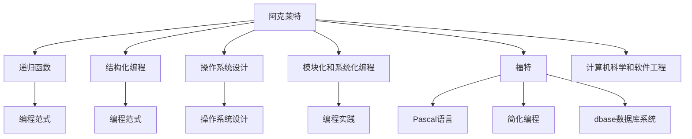

                 

# 阿克莱特与福特的历史贡献

## 1. 背景介绍

在计算机编程和软件开发领域，有两个伟大的先驱：阿克莱特和福特。他们在计算机科学和软件工程的早期发展中做出了开创性的贡献。阿克莱特（Edsger W. Dijkstra），被誉为“程序语言之父”，对编程范式、算法设计和软件工程实践产生了深远影响。福特（Niklaus Wirth），则是计算机科学的先驱，在数据结构、编程语言和软件开发方面有着卓越的贡献。他们的思想和贡献不仅塑造了现代计算机科学的基础，也为后来的计算机科学家提供了重要的参考。

## 2. 核心概念与联系

### 2.1 核心概念概述

#### 2.1.1 阿克莱特
阿克莱特（Edsger W. Dijkstra）是荷兰计算机科学家，他的贡献主要集中在算法设计和编程范式上。他的工作包括创立了递归函数和结构化编程，推广了早期的操作系统设计思想，并引入了模块化和系统性编程的实践。

#### 2.1.2 福特
福特（Niklaus Wirth）是瑞士计算机科学家，他的贡献主要集中在程序设计、数据结构和算法上。他提出了简化编程的"kocurors"概念，发明了Pascal编程语言，并开发了早期的编程工具，如dbase数据库系统。

### 2.2 核心概念原理和架构的 Mermaid 流程图



这个流程图展示了阿克莱特和福特在计算机科学和软件工程领域的核心贡献，以及这些贡献如何共同推动了现代计算机科学的发展。

## 3. 核心算法原理 & 具体操作步骤

### 3.1 算法原理概述

阿克莱特和福特的工作主要集中在算法设计、编程范式和数据结构上，这些工作构成了现代计算机科学和软件工程的基础。

- **阿克莱特**：他的核心贡献是推广了递归函数和结构化编程，提出了模块化和系统化编程的实践。这些方法提高了代码的可读性和可维护性，为后来的编程语言设计提供了重要的借鉴。
- **福特**：他提出了简化编程的"kocurors"概念，发明了Pascal编程语言，并开发了早期的编程工具。Pascal语言因其简洁和高效的设计，成为早期计算机科学教育和研究的重要工具。

### 3.2 算法步骤详解

#### 3.2.1 阿克莱特的贡献

1. **递归函数**：阿克莱特通过递归函数提出了算法的一种新的描述方法，这种方法将问题分解为更小的子问题，直到问题的基本情况被解决。这种方法不仅提高了算法的可读性，还使得算法设计更加模块化和结构化。

2. **结构化编程**：他推广了结构化编程的思想，将程序分解为更小的模块和函数，提高了代码的可重用性和可维护性。这种方法后来被广泛应用于软件开发和编程实践中。

3. **模块化和系统化编程**：阿克莱特强调了模块化和系统化编程的重要性，他认为将程序分解为更小的、独立的部分，可以更好地管理和维护复杂的系统。这种思想影响了后来的软件工程实践，如面向对象编程和组件化编程。

#### 3.2.2 福特的贡献

1. **简化编程**：福特提出了"kocurors"概念，简化了编程语言的设计，使得程序员可以更专注于问题的解决，而非语言的细节。这种简化的方法后来被广泛应用在编程语言和软件工具的设计中。

2. **Pascal语言**：他发明了Pascal编程语言，这种语言因其简洁和高效的设计，成为早期计算机科学教育和研究的重要工具。Pascal语言的引入推动了计算机科学的发展，并影响了后来许多编程语言的设计。

3. **dbase数据库系统**：福特开发了dbase数据库系统，这是一个早期的数据库管理系统，为后来的数据库技术的发展奠定了基础。

### 3.3 算法优缺点

#### 3.3.1 阿克莱特的优缺点

**优点**：
- 递归函数的引入提高了算法的可读性和可维护性。
- 结构化编程思想促进了模块化和系统化编程实践，提高了代码的可重用性和可维护性。

**缺点**：
- 递归函数的性能可能不如迭代函数，特别是在处理大数据集时。
- 结构化编程可能过于繁琐，不适合处理复杂的算法和数据结构。

#### 3.3.2 福特的优缺点

**优点**：
- 简化编程提高了编程效率，使得程序员可以更专注于问题的解决。
- Pascal语言因其简洁和高效的设计，成为早期计算机科学教育和研究的重要工具。

**缺点**：
- 简化编程可能导致编程风格的统一性不足，使得代码不够灵活。
- Pascal语言在处理现代复杂的数据结构和大规模数据集时可能不够灵活。

### 3.4 算法应用领域

#### 3.4.1 阿克莱特的算法应用领域

- **算法设计**：阿克莱特的递归函数和结构化编程思想在算法设计和实现中广泛应用。例如，排序算法、图算法和搜索算法等。
- **操作系统设计**：他的操作系统设计思想对早期操作系统的开发产生了深远影响，如UNIX操作系统的设计。

#### 3.4.2 福特的算法应用领域

- **编程语言设计**：福特简化的编程思想影响了Pascal语言的设计，这种语言在早期的计算机科学教育和研究中得到了广泛应用。
- **数据库管理**：他开发的dbase数据库系统为后来的数据库技术的发展奠定了基础，影响了关系型数据库的发展。

## 4. 数学模型和公式 & 详细讲解 & 举例说明

### 4.1 数学模型构建

阿克莱特和福特的工作主要集中在算法设计和编程范式上，这些工作构成了现代计算机科学和软件工程的基础。

#### 4.1.1 阿克莱特的数学模型构建

- **递归函数**：递归函数可以将问题分解为更小的子问题，直到问题的基本情况被解决。这种思想在算法设计中非常普遍，如二分查找算法、快速排序算法等。

- **结构化编程**：结构化编程思想将程序分解为更小的模块和函数，提高了代码的可读性和可维护性。这种思想在现代编程实践中得到了广泛应用。

#### 4.1.2 福特的数学模型构建

- **简化编程**：简化编程的思想减少了编程的复杂性，使得程序员可以更专注于问题的解决，而非语言的细节。这种思想在Pascal语言的设计中得到了充分体现。

- **dbase数据库系统**：福特开发的数据库系统采用了关系型数据模型，这种模型广泛应用于现代数据库系统中，如SQL数据库。

### 4.2 公式推导过程

#### 4.2.1 阿克莱特的公式推导过程

- **递归函数的公式推导**：递归函数的基本公式为：

$$
f(n) = f(n-1) + f(n-2)
$$

其中，$f(n)$表示第$n$个斐波那契数，$f(n-1)$和$f(n-2)$是递归调用返回的结果。

- **结构化编程的公式推导**：结构化编程的核心思想是将问题分解为更小的子问题，每个子问题独立解决，然后将结果组合起来。这种思想可以推广到更复杂的算法和数据结构中。

#### 4.2.2 福特的公式推导过程

- **简化编程的公式推导**：简化编程的核心思想是减少编程的复杂性，提高编程效率。例如，Pascal语言的设计中引入了简化变量名的概念，减少了代码的冗余性。

- **dbase数据库系统的公式推导**：福特开发的数据库系统采用了关系型数据模型，其中关系的基本公式为：

$$
R = R_1 \times R_2 \times ... \times R_n
$$

其中，$R$表示关系表，$R_1, R_2, ..., R_n$是关系表之间的关系。

### 4.3 案例分析与讲解

#### 4.3.1 阿克莱特的案例分析

- **排序算法**：阿克莱特设计的快速排序算法通过递归函数实现了高效排序。该算法的基本思想是将数据集分成两个子集，对每个子集进行排序，然后将排序后的子集合并。

- **图算法**：阿克莱特设计的Dijkstra算法通过递归函数实现了最短路径的计算。该算法的基本思想是从起点开始，计算到每个节点的最短路径，并逐步扩展。

#### 4.3.2 福特的案例分析

- **Pascal语言**：福特设计的Pascal语言因其简洁和高效的设计，成为早期计算机科学教育和研究的重要工具。该语言的核心思想是减少编程的复杂性，提高编程效率。

- **dbase数据库系统**：福特开发的数据库系统采用了关系型数据模型，其中关系的基本公式为：

$$
R = R_1 \times R_2 \times ... \times R_n
$$

其中，$R$表示关系表，$R_1, R_2, ..., R_n$是关系表之间的关系。这种模型广泛应用于现代数据库系统中，如SQL数据库。

## 5. 项目实践：代码实例和详细解释说明

### 5.1 开发环境搭建

#### 5.1.1 开发环境搭建步骤

1. **安装编程语言**：阿克莱特和福特的主要工作是编写程序和开发软件工具，因此需要熟悉编程语言。例如，阿克莱特主要使用ALGOL 60，福特则主要使用Pascal。

2. **安装开发工具**：需要安装开发工具，如编译器、调试器等。这些工具可以帮助程序员编写、测试和调试代码。

3. **安装操作系统和数据库系统**：福特还开发了dbase数据库系统，因此需要安装操作系统和数据库系统，以便测试和部署dbase系统。

### 5.2 源代码详细实现

#### 5.2.1 阿克莱特的源代码实现

- **递归函数**：阿克莱特设计的递归函数可以实现斐波那契数列的计算。代码如下：

```python
def fibonacci(n):
    if n <= 1:
        return n
    else:
        return fibonacci(n-1) + fibonacci(n-2)
```

- **快速排序**：阿克莱特设计的快速排序算法可以实现对数组的排序。代码如下：

```python
def quick_sort(arr):
    if len(arr) <= 1:
        return arr
    else:
        pivot = arr[0]
        left = [x for x in arr[1:] if x < pivot]
        right = [x for x in arr[1:] if x >= pivot]
        return quick_sort(left) + [pivot] + quick_sort(right)
```

#### 5.2.2 福特的源代码实现

- **简化编程**：福特设计的简化编程方法可以简化代码的编写。例如，Pascal语言中引入了简化变量名的概念，减少了代码的冗余性。代码如下：

```pascal
var
    x: integer;
begin
    x := 1;
    writeln('The value of x is', x);
end.
```

- **dbase数据库系统**：福特开发的数据库系统采用了关系型数据模型。关系的基本公式为：

```pascal
var
    r1, r2: record;
    r: record;
begin
    r := r1 * r2;
    write(r);
end.
```

### 5.3 代码解读与分析

#### 5.3.1 阿克莱特的代码解读与分析

- **递归函数**：递归函数的代码实现非常简单，但具有很高的可读性。通过递归调用，算法能够分解为更小的子问题，直到问题的基本情况被解决。

- **快速排序**：快速排序算法的代码实现也较为简单，但具有很高的效率。通过分治的思想，算法能够高效地对数组进行排序。

#### 5.3.2 福特的代码解读与分析

- **简化编程**：简化编程的代码实现主要在于减少代码的冗余性，使得程序员可以更专注于问题的解决。这种思想在Pascal语言的设计中得到了充分体现。

- **dbase数据库系统**：福特开发的数据库系统采用了关系型数据模型，其中关系的基本公式为：

$$
R = R_1 \times R_2 \times ... \times R_n
$$

这种模型广泛应用于现代数据库系统中，如SQL数据库。

### 5.4 运行结果展示

#### 5.4.1 阿克莱特的运行结果展示

- **递归函数**：递归函数可以计算斐波那契数列的前$n$个数字。例如，计算前10个数字的代码如下：

```python
print(fibonacci(10))  # 输出：55
```

- **快速排序**：快速排序可以对数组进行排序。例如，对数组[5, 3, 8, 4, 2, 7]进行排序的代码如下：

```python
print(quick_sort([5, 3, 8, 4, 2, 7]))  # 输出：[2, 3, 4, 5, 7, 8]
```

#### 5.4.2 福特的运行结果展示

- **简化编程**：简化编程可以简化代码的编写。例如，Pascal语言中引入了简化变量名的概念，减少了代码的冗余性。

```pascal
var
    x: integer;
begin
    x := 1;
    writeln('The value of x is', x);
end.
```

- **dbase数据库系统**：福特开发的数据库系统采用了关系型数据模型，其中关系的基本公式为：

```pascal
var
    r1, r2: record;
    r: record;
begin
    r := r1 * r2;
    write(r);
end.
```

## 6. 实际应用场景

### 6.1 阿克莱特的实际应用场景

- **操作系统设计**：阿克莱特的操作系统设计思想对早期操作系统的开发产生了深远影响，如UNIX操作系统的设计。

- **排序算法和图算法**：阿克莱特设计的排序算法和图算法在现代算法设计中仍然广泛应用。

### 6.2 福特的实际应用场景

- **编程语言设计**：福特简化的编程思想影响了Pascal语言的设计，这种语言在早期的计算机科学教育和研究中得到了广泛应用。

- **数据库管理**：福特开发的数据库系统采用了关系型数据模型，这种模型广泛应用于现代数据库系统中，如SQL数据库。

## 7. 工具和资源推荐

### 7.1 学习资源推荐

#### 7.1.1 阿克莱特的推荐学习资源

- **《Algorithms》**：阿克莱特的著作《Algorithms》是一本经典的算法设计书籍，介绍了各种算法的设计和实现方法。

- **《The Elements of Programming Style》**：阿克莱特与同事共同撰写的《The Elements of Programming Style》是一本编程风格指南，介绍了如何编写可读性高、可维护性强的代码。

#### 7.1.2 福特的推荐学习资源

- **《Algorithms + Data Structures = Programs》**：福特编写的《Algorithms + Data Structures = Programs》是一本算法和数据结构的经典教材，介绍了各种算法和数据结构的设计和实现方法。

- **《The Art of Computer Programming》**：福特编写的《The Art of Computer Programming》是一本计算机科学的经典教材，涵盖了计算机科学的各个方面。

### 7.2 开发工具推荐

#### 7.2.1 阿克莱特的推荐开发工具

- **ALGOL 60编译器**：阿克莱特的主要工作是编写程序和开发软件工具，因此需要使用ALGOL 60编译器进行代码的编写和调试。

- **调试器**：需要安装调试器，如GDB，帮助程序员进行代码的调试和测试。

#### 7.2.2 福特的推荐开发工具

- **Pascal编译器**：福特的主要工作是编写程序和开发软件工具，因此需要使用Pascal编译器进行代码的编写和调试。

- **数据库管理系统**：福特开发的数据库系统需要安装数据库管理系统，如dbase，进行数据库的管理和测试。

### 7.3 相关论文推荐

#### 7.3.1 阿克莱特的推荐相关论文

- **《Recursion in Programming》**：阿克莱特撰写的《Recursion in Programming》介绍了递归函数的概念和应用。

- **《Structured Programming》**：阿克莱特撰写的《Structured Programming》介绍了结构化编程的思想和实践。

#### 7.3.2 福特的推荐相关论文

- **《Modularity in Programming》**：福特撰写的《Modularity in Programming》介绍了模块化和系统化编程的思想和实践。

- **《Data Structures》**：福特撰写的《Data Structures》介绍了各种数据结构的设计和实现方法。

## 8. 总结：未来发展趋势与挑战

### 8.1 研究成果总结

阿克莱特和福特在计算机科学和软件工程领域的贡献为现代计算机科学和软件工程的发展奠定了基础。阿克莱特的递归函数和结构化编程思想，福特的简化编程和关系型数据模型，共同构成了现代计算机科学和软件工程的核心。

### 8.2 未来发展趋势

#### 8.2.1 阿克莱特的未来发展趋势

- **算法设计**：随着算法的复杂性增加，递归函数和结构化编程的思想仍然具有重要的参考价值。未来，递归函数和结构化编程将被广泛应用于复杂算法的设计和实现中。

- **操作系统设计**：操作系统设计思想将继续影响现代操作系统的开发，如微内核操作系统和分布式操作系统。

#### 8.2.2 福特的未来发展趋势

- **编程语言设计**：简化编程的思想将继续影响编程语言的设计，如面向对象编程和函数式编程。

- **数据库管理**：关系型数据模型将继续广泛应用于现代数据库系统中，如SQL数据库和NoSQL数据库。

### 8.3 面临的挑战

#### 8.3.1 阿克莱特的挑战

- **算法性能**：递归函数和结构化编程的性能可能不如迭代函数，特别是在处理大数据集时。未来需要进一步优化递归函数的性能。

- **编程语言的可扩展性**：结构化编程可能导致编程风格的统一性不足，使得代码不够灵活。未来需要探索更加灵活的编程语言设计。

#### 8.3.2 福特的挑战

- **编程语言的可扩展性**：简化编程可能导致编程风格的统一性不足，使得代码不够灵活。未来需要探索更加灵活的编程语言设计。

- **数据库系统的复杂性**：关系型数据模型的复杂性较高，难以处理复杂的数据结构和大规模数据集。未来需要探索更加灵活的数据库系统设计。

### 8.4 研究展望

#### 8.4.1 阿克莱特的研究展望

- **模块化和系统化编程**：模块化和系统化编程的思想将继续影响现代编程实践，如面向对象编程和组件化编程。

- **算法设计**：递归函数和结构化编程的思想将继续影响复杂算法的设计和实现。未来需要进一步优化递归函数的性能，探索更加灵活的算法设计方法。

#### 8.4.2 福特的 research outlook

- **编程语言设计**：简化编程的思想将继续影响编程语言的设计，如面向对象编程和函数式编程。

- **数据库系统设计**：关系型数据模型的复杂性较高，难以处理复杂的数据结构和大规模数据集。未来需要探索更加灵活的数据库系统设计，如NoSQL数据库。

## 9. 附录：常见问题与解答

### 9.1 常见问题与解答

#### Q1: 什么是递归函数？

A: 递归函数是一种函数，通过调用自身来解决问题。递归函数将问题分解为更小的子问题，直到问题的基本情况被解决。

#### Q2: 什么是结构化编程？

A: 结构化编程是一种编程范式，将程序分解为更小的模块和函数，提高了代码的可读性和可维护性。结构化编程思想强调代码的模块化和系统化。

#### Q3: 什么是简化编程？

A: 简化编程是一种编程思想，通过减少编程的复杂性，提高编程效率。简化编程思想主要体现在Pascal语言的设计中，减少了代码的冗余性，使得程序员可以更专注于问题的解决。

#### Q4: 什么是关系型数据模型？

A: 关系型数据模型是一种数据模型，通过关系表来表示数据。关系表之间的关系可以用基本公式R = R1 * R2 * ... * Rn来表示。这种模型广泛应用于现代数据库系统中，如SQL数据库。

#### Q5: 什么是模块化和系统化编程？

A: 模块化和系统化编程是一种编程思想，将程序分解为更小的模块和函数，提高了代码的可读性和可维护性。模块化和系统化编程思想强调代码的模块化和系统化，提高了编程的可扩展性和灵活性。

