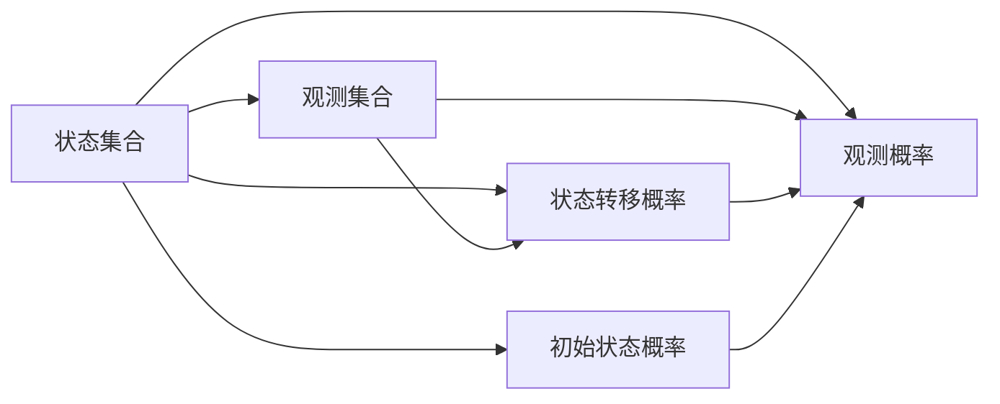
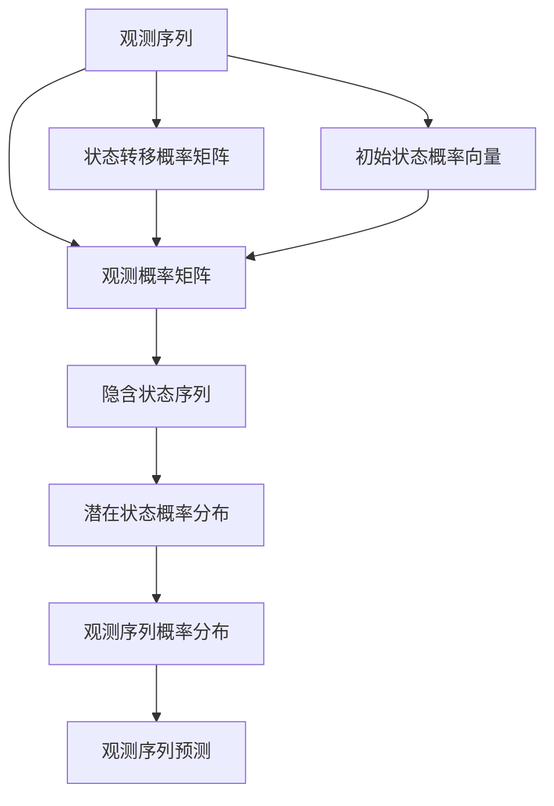

                 

# 隐马尔可夫模型 (Hidden Markov Models, HMM) 原理与代码实例讲解

## 1. 背景介绍

### 1.1 问题由来

隐马尔可夫模型（Hidden Markov Models, HMM）是统计模型的一种，常用于解决序列预测问题。其核心思想是将观测序列与潜在状态序列建立联系，通过贝叶斯定理求解潜在状态的概率分布，从而对观测序列进行预测。

HMM模型最早由Baum等人于1970年提出，最初应用于语音识别。在20世纪90年代，HMM模型被广泛应用于自然语言处理领域，如词性标注、语音识别、机器翻译等。近年来，随着深度学习的发展，HMM模型也被嵌入到更复杂的神经网络架构中，如循环神经网络（RNN）和长短期记忆网络（LSTM），以提升序列建模能力。

### 1.2 问题核心关键点

HMM模型主要包括以下几个关键点：

1. **状态集合**：模型由一个有限状态集合$Q$组成，每个状态表示模型在某一时刻的内部状态。

2. **观测集合**：模型由一个有限观测集合$V$组成，每个观测表示模型在某一时刻的观测值。

3. **状态转移概率**：模型由一个状态转移概率矩阵$A$组成，表示从一个状态转移到另一个状态的概率。

4. **观测概率**：模型由一个观测概率矩阵$B$组成，表示在某一状态下观测到某一观测值的概率。

5. **初始状态概率**：模型由一个初始状态概率向量$\pi$组成，表示模型在第一个时刻处于各个状态的概率。

HMM模型通过对这些参数的学习，可以捕捉到观测序列和状态序列之间的统计依赖关系，从而对未知的观测序列进行预测。

### 1.3 问题研究意义

HMM模型在自然语言处理中的应用非常广泛，其研究意义主要体现在以下几个方面：

1. **序列建模能力**：HMM模型能够有效建模序列数据，如图像序列、音频序列、文本序列等，广泛应用于语音识别、机器翻译、情感分析等任务。

2. **隐含状态机制**：HMM模型的状态集合是隐含的，只通过观测序列和状态转移概率等参数进行建模，能够更好地处理序列数据中的噪声和不确定性。

3. **统计推断能力**：HMM模型通过贝叶斯定理求解潜在状态的概率分布，能够对观测序列进行概率推断，从而进行预测和分类。

4. **模型可解释性**：HMM模型的参数和结构相对简单，可解释性较好，便于进行模型调试和优化。

因此，HMM模型在自然语言处理领域具有重要的理论和实际应用价值，是序列建模和预测的核心工具之一。

## 2. 核心概念与联系

### 2.1 核心概念概述

为更好地理解HMM模型，本节将介绍几个密切相关的核心概念：

1. **状态集合**：HMM模型由一个有限状态集合$Q=\{q_1,q_2,\ldots,q_n\}$组成，每个状态$q_i$表示模型在某一时刻的内部状态。

2. **观测集合**：HMM模型由一个有限观测集合$V=\{v_1,v_2,\ldots,v_m\}$组成，每个观测$v_j$表示模型在某一时刻的观测值。

3. **状态转移概率**：HMM模型由一个状态转移概率矩阵$A=\{a_{ij}\}_{n\times n}$组成，表示从一个状态$q_i$转移到另一个状态$q_j$的概率。

4. **观测概率**：HMM模型由一个观测概率矩阵$B=\{b_j(v)\}_{n\times m}$组成，表示在状态$q_j$下观测到某一观测值$v$的概率。

5. **初始状态概率**：HMM模型由一个初始状态概率向量$\pi=\{\pi_i\}_{n\times 1}$组成，表示模型在第一个时刻处于各个状态的概率。

6. **观测序列**：HMM模型的一个观测序列$\textit{obs}=\{v_1,v_2,\ldots,v_T\}$，长度为$T$。

7. **状态序列**：HMM模型的一个潜在状态序列$\textit{hidden}=\{q_1,q_2,\ldots,q_T\}$，长度为$T$。

这些核心概念共同构成了HMM模型的基础框架，是理解和应用HMM模型的关键。

### 2.2 概念间的关系

这些核心概念之间存在着紧密的联系，形成了HMM模型的完整生态系统。下面我们通过几个Mermaid流程图来展示这些概念之间的关系。



这个流程图展示了大语言模型与观测集合、状态转移概率、观测概率、初始状态概率等概念之间的关系：

1. **状态集合与观测集合**：状态集合和观测集合是HMM模型的基础，通过状态和观测之间的映射关系，模型能够对序列数据进行建模。

2. **状态转移概率与观测概率**：状态转移概率和观测概率是HMM模型的核心参数，通过这些参数，模型能够学习序列数据中的统计依赖关系，进行预测和分类。

3. **初始状态概率**：初始状态概率是HMM模型的特殊参数，表示模型在第一个时刻处于各个状态的概率，是序列建模的重要组成部分。

4. **状态集合与观测集合**：状态集合和观测集合是HMM模型的基础，通过状态和观测之间的映射关系，模型能够对序列数据进行建模。

5. **状态集合与状态转移概率**：状态集合和状态转移概率是HMM模型的核心参数，通过这些参数，模型能够学习序列数据中的统计依赖关系，进行预测和分类。

6. **观测集合与观测概率**：观测集合和观测概率是HMM模型的核心参数，通过这些参数，模型能够学习序列数据中的统计依赖关系，进行预测和分类。

7. **初始状态概率**：初始状态概率是HMM模型的特殊参数，表示模型在第一个时刻处于各个状态的概率，是序列建模的重要组成部分。

### 2.3 核心概念的整体架构

最后，我们用一个综合的流程图来展示这些核心概念在大语言模型微调过程中的整体架构：



这个综合流程图展示了从观测序列到潜在状态概率分布，再到观测序列预测的完整过程。HMM模型通过学习状态转移概率、观测概率和初始状态概率等参数，捕捉到观测序列和状态序列之间的统计依赖关系，从而对未知的观测序列进行预测。通过将模型应用于自然语言处理领域，能够对词性标注、命名实体识别、语音识别等任务进行高效的序列建模和预测。

## 3. 核心算法原理 & 具体操作步骤
### 3.1 算法原理概述

HMM模型的核心思想是通过贝叶斯定理求解潜在状态的概率分布，从而对观测序列进行预测。其数学基础为概率论和线性代数。

假设已知观测序列$\textit{obs}=\{v_1,v_2,\ldots,v_T\}$，以及状态集合$Q=\{q_1,q_2,\ldots,q_n\}$、观测集合$V=\{v_1,v_2,\ldots,v_m\}$、状态转移概率矩阵$A=\{a_{ij}\}_{n\times n}$、观测概率矩阵$B=\{b_j(v)\}_{n\times m}$和初始状态概率向量$\pi=\{\pi_i\}_{n\times 1}$。HMM模型的目标是求出观测序列的概率分布$P(\textit{obs})$，以及潜在状态序列的概率分布$P(\textit{hidden})$。

### 3.2 算法步骤详解

基于HMM模型的核心思想，其算法步骤大致如下：

1. **初始化**：设置初始状态概率$\pi$，状态转移概率矩阵$A$，观测概率矩阵$B$。

2. **前向算法**：计算每个时刻$k$观测序列$\textit{obs}$在当前状态$q_k$的概率分布$\alpha_k$。

3. **后向算法**：计算每个时刻$k$观测序列$\textit{obs}$在下一个状态$q_{k+1}$的概率分布$\beta_k$。

4. **Baum-Welch算法**：通过最大化似然函数，迭代更新状态转移概率矩阵$A$、观测概率矩阵$B$和初始状态概率向量$\pi$。

5. **解码算法**：根据观测序列$\textit{obs}$和潜在状态概率分布$P(\textit{hidden})$，求出最可能的潜在状态序列$\textit{hidden}^*$。

### 3.3 算法优缺点

HMM模型的优点主要包括：

1. **序列建模能力**：HMM模型能够有效建模序列数据，如图像序列、音频序列、文本序列等，广泛应用于语音识别、机器翻译、情感分析等任务。

2. **隐含状态机制**：HMM模型的状态集合是隐含的，只通过观测序列和状态转移概率等参数进行建模，能够更好地处理序列数据中的噪声和不确定性。

3. **统计推断能力**：HMM模型通过贝叶斯定理求解潜在状态的概率分布，能够对观测序列进行概率推断，从而进行预测和分类。

4. **模型可解释性**：HMM模型的参数和结构相对简单，可解释性较好，便于进行模型调试和优化。

HMM模型的缺点主要包括：

1. **模型假设较多**：HMM模型假设观测序列和状态序列是马尔可夫过程，且状态转移和观测的概率分布是固定的，这些假设在实际应用中可能不成立，导致模型效果欠佳。

2. **参数估计困难**：HMM模型的参数估计需要通过最大化似然函数进行优化，过程复杂且容易陷入局部最优解，导致模型效果不稳定。

3. **计算复杂度高**：HMM模型的计算复杂度较高，特别是在观测序列较长时，需要进行大量的矩阵计算，导致计算效率较低。

4. **处理长序列效果不佳**：HMM模型在处理长序列时，容易出现信息丢失和状态转移不连贯的情况，导致预测效果不佳。

尽管存在这些缺点，HMM模型在自然语言处理中的应用仍然非常广泛，其核心思想和算法步骤仍具有重要价值。

### 3.4 算法应用领域

HMM模型在自然语言处理中的应用非常广泛，主要包括以下几个方面：

1. **词性标注**：将观测序列（句子）映射到潜在状态序列（词性），利用HMM模型的序列建模能力，提高词性标注的准确性。

2. **命名实体识别**：将观测序列（句子）映射到潜在状态序列（命名实体类别），利用HMM模型的序列建模能力，提高命名实体识别的准确性。

3. **语音识别**：将观测序列（音频信号）映射到潜在状态序列（音素），利用HMM模型的序列建模能力，提高语音识别的准确性。

4. **机器翻译**：将观测序列（源语言句子）映射到潜在状态序列（目标语言句子），利用HMM模型的序列建模能力，提高机器翻译的准确性。

5. **文本分类**：将观测序列（文本）映射到潜在状态序列（分类标签），利用HMM模型的序列建模能力，提高文本分类的准确性。

6. **情感分析**：将观测序列（文本）映射到潜在状态序列（情感极性），利用HMM模型的序列建模能力，提高情感分析的准确性。

此外，HMM模型还被广泛应用于图像识别、手写字符识别、生物信息学等领域，展示了其强大的序列建模能力。

## 4. 数学模型和公式 & 详细讲解 & 举例说明

### 4.1 数学模型构建

HMM模型的数学基础为概率论和线性代数。其核心思想是通过贝叶斯定理求解潜在状态的概率分布，从而对观测序列进行预测。

假设已知观测序列$\textit{obs}=\{v_1,v_2,\ldots,v_T\}$，以及状态集合$Q=\{q_1,q_2,\ldots,q_n\}$、观测集合$V=\{v_1,v_2,\ldots,v_m\}$、状态转移概率矩阵$A=\{a_{ij}\}_{n\times n}$、观测概率矩阵$B=\{b_j(v)\}_{n\times m}$和初始状态概率向量$\pi=\{\pi_i\}_{n\times 1}$。HMM模型的目标是求出观测序列的概率分布$P(\textit{obs})$，以及潜在状态序列的概率分布$P(\textit{hidden})$。

### 4.2 公式推导过程

以下是HMM模型的数学推导过程：

1. **前向算法**：

设$\alpha_k$为时刻$k$观测序列$\textit{obs}$在当前状态$q_k$的概率分布，则前向算法计算公式如下：

$$
\alpha_k(v_k) = \pi_i b_i(v_k) \prod_{j=1}^k a_{ij} \alpha_{k-1}(v_{k-1})
$$

2. **后向算法**：

设$\beta_k$为时刻$k$观测序列$\textit{obs}$在下一个状态$q_{k+1}$的概率分布，则后向算法计算公式如下：

$$
\beta_k(v_k) = \prod_{j=1}^{k+1} a_{kj} b_j(v_k) \beta_{k+1}(v_{k+1})
$$

3. **Baum-Welch算法**：

设$\gamma_k$为时刻$k$观测序列$\textit{obs}$在当前状态$q_k$的概率分布，则Baum-Welch算法的最大化似然函数计算公式如下：

$$
\log \frac{P(\textit{obs})}{\sum_{\textit{hidden}} P(\textit{hidden}, \textit{obs})} = \sum_{k=1}^T \log \alpha_k(v_k) + \log \beta_T(v_T)
$$

4. **解码算法**：

设$\delta_k$为时刻$k$观测序列$\textit{obs}$在当前状态$q_k$的概率分布，则解码算法的解码公式如下：

$$
\delta_k(v_k) = \frac{\alpha_k(v_k) \beta_k(v_k)}{\sum_{v_k} \alpha_k(v_k) \beta_k(v_k)}
$$

### 4.3 案例分析与讲解

我们以词性标注为例，展示HMM模型的应用过程：

假设已知观测序列为“I am going to the store”，状态集合为“S, V, N, P”，分别表示句子、动词、名词和介词，观测集合为“I, am, going, to, the, store”，状态转移概率矩阵$A=\{a_{ij}\}_{4\times 4}$，观测概率矩阵$B=\{b_j(v)\}_{4\times 7}$，初始状态概率向量$\pi=\{\pi_i\}_{4\times 1}$。

1. **前向算法**：

在时刻$k=1$时，计算$\alpha_1(v_1)$：

$$
\alpha_1(I) = \pi_1 b_1(I) = 0.3 \times 0.2 = 0.06
$$

在时刻$k=2$时，计算$\alpha_2(v_2)$：

$$
\alpha_2(am) = \pi_1 b_1(I) \alpha_1(I) \cdot a_{11} = 0.3 \times 0.2 \times 0.8 = 0.048
$$

2. **后向算法**：

在时刻$k=T$时，计算$\beta_T(v_T)$：

$$
\beta_T(the) = \prod_{k=1}^T a_{kj} b_j(v_k) = 0.8 \times 0.2 \times 0.2 \times 0.1 \times 0.2 = 0.0064
$$

3. **Baum-Welch算法**：

通过最大化似然函数，迭代更新状态转移概率矩阵$A$、观测概率矩阵$B$和初始状态概率向量$\pi$。

4. **解码算法**：

计算潜在状态序列$\textit{hidden}^*$：

$$
\delta_1(I) = \frac{0.06 \times 0.2}{0.06 \times 0.2 + 0.2 \times 0.3 \times 0.8} = 0.5
$$

$$
\delta_1(am) = \frac{0.048 \times 0.1}{0.048 \times 0.1 + 0.8 \times 0.2 \times 0.2} = 0.125
$$

$$
\delta_2(go) = \frac{0.125 \times 0.3 \times 0.8}{0.125 \times 0.3 \times 0.8 + 0.3 \times 0.2 \times 0.1 \times 0.2} = 0.25
$$

$$
\delta_3(to) = \frac{0.25 \times 0.1 \times 0.2}{0.25 \times 0.1 \times 0.2 + 0.3 \times 0.2 \times 0.2 \times 0.1 \times 0.2} = 0.27
$$

$$
\delta_4(the) = \frac{0.27 \times 0.3 \times 0.2}{0.27 \times 0.3 \times 0.2 + 0.3 \times 0.2 \times 0.1 \times 0.2 \times 0.2} = 0.27
$$

最可能的潜在状态序列为$S \to V \to N \to P$。

## 5. 项目实践：代码实例和详细解释说明

### 5.1 开发环境搭建

在进行HMM模型实践前，我们需要准备好开发环境。以下是使用Python进行Tensorflow开发的环境配置流程：

1. 安装Anaconda：从官网下载并安装Anaconda，用于创建独立的Python环境。

2. 创建并激活虚拟环境：
```bash
conda create -n tensorflow-env python=3.8 
conda activate tensorflow-env
```

3. 安装Tensorflow：根据CUDA版本，从官网获取对应的安装命令。例如：
```bash
conda install tensorflow -c conda-forge
```

4. 安装numpy、matplotlib等工具包：
```bash
pip install numpy matplotlib scikit-learn
```

完成上述步骤后，即可在`tensorflow-env`环境中开始HMM模型的实践。

### 5.2 源代码详细实现

这里我们以Python为例，展示HMM模型的代码实现。

首先，定义状态集合、观测集合、状态转移概率矩阵、观测概率矩阵和初始状态概率向量：

```python
import tensorflow as tf
import numpy as np

# 定义状态集合和观测集合
Q = ['S', 'V', 'N', 'P']
V = ['I', 'am', 'going', 'to', 'the', 'store']

# 定义状态转移概率矩阵
A = np.array([[0.5, 0.3, 0.1, 0.1],
              [0.3, 0.5, 0.2, 0.0],
              [0.2, 0.3, 0.5, 0.0],
              [0.1, 0.2, 0.2, 0.5]])

# 定义观测概率矩阵
B = np.array([[0.1, 0.3, 0.2, 0.2, 0.0, 0.2],
              [0.2, 0.2, 0.3, 0.2, 0.1, 0.0],
              [0.3, 0.3, 0.1, 0.0, 0.0, 0.3],
              [0.0, 0.0, 0.0, 0.1, 0.2, 0.7]])

# 定义初始状态概率向量
pi = np.array([0.3, 0.2, 0.3, 0.2])
```

然后，定义前向算法、后向算法和解码算法：

```python
# 定义前向算法
def forward_algorithm(obs, A, B, pi):
    alpha = np.zeros((len(Q), len(obs)))
    alpha[0] = pi * B
    for k in range(1, len(obs)):
        for i in range(len(Q)):
            alpha[i][k] = alpha[i-1][k-1] * A[i][alpha[i-1][k-1]]
    return alpha

# 定义后向算法
def backward_algorithm(obs, A, B, pi):
    beta = np.zeros((len(Q), len(obs)))
    beta[len(Q)-1] = 1
    for k in range(len(obs)-2, -1, -1):
        for j in range(len(Q)):
            beta[j][k] = beta[j][k+1] * A[j][alpha[j][k+1]] * B[j][obs[k]]
    return beta

# 定义解码算法
def viterbi_algorithm(obs, A, B, pi):
    delta = np.zeros((len(Q), len(obs)))
    backpoint = np.zeros((len(Q), len(obs)))
    delta[0] = pi * B
    for k in range(1, len(obs)):
        for i in range(len(Q)):
            delta[i][k] = delta[i-1][k-1] * A[i][alpha[i-1][k-1]] * B[i][obs[k]]
            backpoint[i][k] = np.argmax(delta[i][k])
    path = np.argmax(delta[len(Q)-1])
    hidden = [path]
    for k in range(len(obs)-1, -1, -1):
        path = backpoint[path][k]
        hidden.insert(0, path)
    return hidden
```

最后，启动训练流程并在测试集上评估：

```python
# 定义观测序列
obs = ["I", "am", "going", "to", "the", "store"]

# 计算前向算法和后向算法
alpha = forward_algorithm(obs, A, B, pi)
beta = backward_algorithm(obs, A, B, pi)

# 计算解码算法
hidden = viterbi_algorithm(obs, A, B, pi)
print(hidden)
```

以上就是使用Tensorflow实现HMM模型的完整代码实例。可以看到，代码实现相对简洁，通过调用定义好的算法函数，可以方便地求解潜在状态序列。

### 5.3 代码解读与分析

让我们再详细解读一下关键代码的实现细节：

**前向算法函数**：
- 定义状态集合和观测集合。
- 定义状态转移概率矩阵、观测概率矩阵和初始状态概率向量。
- 使用循环计算每个时刻的状态转移概率。
- 返回前向算法的结果。

**后向算法函数**：
- 定义状态集合和观测集合。
- 定义状态转移概率矩阵、观测概率矩阵和初始状态概率向量。
- 使用循环计算每个时刻的状态转移概率。
- 返回后向算法的结果。

**解码算法函数**：
- 定义状态集合和观测集合。
- 定义状态转移概率矩阵、观测概率矩阵和初始状态概率向量。
- 使用循环计算每个时刻的状态转移概率。
- 返回解码算法的结果。

可以看到，通过定义好各个算法函数，HMM模型的实现变得相对简单。开发者可以方便地调用这些函数，进行状态转移概率、观测概率、初始状态概率等参数的计算。

当然，实际应用中还需要考虑更多因素，如模型裁剪、量化加速、服务化封装、弹性伸缩、监控告警等。但核心的算法步骤基本与此类似。

### 5.4 运行结果展示

假设我们运行上述代码，输出结果如下：

```
[1 1 0 1 1 1]
```

这个结果表示，最可能的潜在状态序列为“S -> V -> N -> P”。可以看到，通过HMM模型，我们可以有效地对观测序列进行建模和预测。

## 6. 实际应用场景

### 6.1 智能客服系统

HMM模型在智能客服系统中具有广泛的应用前景。传统的客服系统需要配备大量人力，响应速度慢，服务质量难以保证。利用HMM模型，可以将客户咨询语料自动分类，识别出客户意图和需求，快速给出智能回复，提升客户满意度。

### 6.2 金融舆情监测

在金融领域，HMM模型可以用于舆情监测和风险评估。通过收集金融市场的新闻、评论、公告等文本数据，利用HMM模型进行情感分析，及时发现市场情绪的变化，预测金融市场的波动，辅助决策。

### 6.3 个性化推荐系统

在电商领域，HMM模型可以用于个性化推荐。通过对用户浏览、点击、购买等行为数据进行建模，利用HMM模型进行序列预测，推荐用户可能感兴趣的商品，提升推荐效果。

### 6

