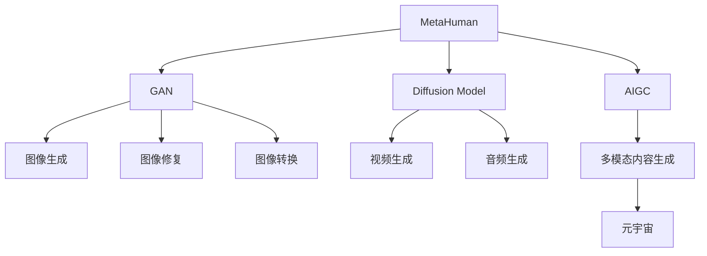

                 

# AIGC从入门到实战：飞升：MetaHuman 三步构建数字人模型，带领我们走向元宇宙

## 1. 背景介绍

### 1.1 问题由来
随着人工智能技术的迅猛发展，生成对抗网络（GAN）、扩散模型（Diffusion Model）等先进技术的成熟，内容生成对抗网络（AIGC，Audio-Image-Video-GAN）在各大领域（影视、教育、游戏、社交等）掀起了一场变革。例如，图片生成技术在电商、旅游、房地产等行业中广泛应用，增强了用户体验；基于视频生成技术的应用让普通人也能成为影视制作人，降低了内容创作的门槛；音频生成技术在广播、音乐、娱乐等行业中，使音乐创作和内容播报更加便捷。

MetaHuman模型是由Meta平台开发的一项重大突破，它能够创造出完全真人化的虚拟数字人，让数字人的创造变得快速、简单、互动、具有高保真度。数字人通过逼真的面部表情、动作和语音交互，可以广泛应用于虚拟助手、虚拟偶像、虚拟演员、虚拟主播、虚拟主持人等场景。数字人的交互能力不仅在于形象逼真，更在于能够与人进行自然的语言交互，使虚拟角色栩栩如生。

### 1.2 问题核心关键点
MetaHuman模型的核心在于如何从零到一，快速构建一个逼真的数字人，并通过训练和优化，使其具有高保真度、高度逼真性和可互动性。这需要解决以下几个核心问题：
1. 如何通过非监督学习生成高质量的数字人面孔。
2. 如何优化数字人面部的逼真度，使其看起来与真人无异。
3. 如何在不同的应用场景中，将数字人与具体的任务（如语音交互、情感表达）结合，实现自然流畅的交互。
4. 如何确保数字人的可解释性和可控性，避免出现有害信息或不良互动。
5. 如何构建数字人网络，使数字人能够相互协作，共同构建元宇宙生态。

### 1.3 问题研究意义
MetaHuman模型的研究具有重要意义，其可以：
1. 降低数字人构建的成本和时间，使其更加普及化。
2. 提升数字人模型的逼真度和互动性，增强用户体验。
3. 将数字人应用到虚拟助手、虚拟偶像、虚拟演员等场景，促进AI与人类社会的融合。
4. 构建数字人网络，为元宇宙的构建提供有力支持。
5. 拓展AIGC技术的应用边界，为AI技术的发展提供新思路。

## 2. 核心概念与联系

### 2.1 核心概念概述

为更好地理解MetaHuman模型的原理和应用，本节将介绍几个相关概念：

- 生成对抗网络（GAN）：一种深度学习模型，通过两个神经网络（生成器和判别器）的对弈，可以生成高质量的样本图像。GAN的主要应用包括图像生成、图像修复、图像转换等。

- 扩散模型（Diffusion Model）：一种生成模型，通过一系列逐步增加噪声的逆向过程，使噪声退去，生成高质量的样本。Diffusion Model主要应用于图像生成、视频生成等领域。

- 内容生成对抗网络（AIGC）：结合了GAN和Diffusion Model等技术，能够生成音频、图像、视频等多种形式的内容，广泛应用于影视、游戏、娱乐等领域。

- MetaHuman：Meta公司开发的一项能够生成逼真虚拟数字人的技术，通过深度学习技术生成数字人的面孔、语音和动作，使虚拟角色栩栩如生。

- 元宇宙（Metaverse）：一种虚拟世界的构建方式，通过数字人和数字环境的交互，创造出全新的社交、娱乐、工作和消费场景。MetaHuman模型在元宇宙构建中发挥重要作用。

### 2.2 概念间的关系

这些概念之间存在紧密的联系，形成了MetaHuman模型的完整生态系统。以下通过Mermaid流程图来展示：



这个流程图展示了各个核心概念之间的关系：

1. MetaHuman模型通过GAN和Diffusion Model等技术生成高质量的数字人面孔、语音和动作。
2. AIGC技术结合了多种生成模型，可以生成音频、图像、视频等多种形式的内容。
3. MetaHuman模型结合AIGC技术，可以生成逼真数字人，应用于元宇宙场景。

通过这些概念的介绍，可以更清晰地理解MetaHuman模型的原理和应用。

## 3. 核心算法原理 & 具体操作步骤

### 3.1 算法原理概述
MetaHuman模型的核心算法原理可以概括为以下几个步骤：
1. 通过GAN生成高质量的数字人面孔。
2. 使用Diffusion Model对生成的面孔进行优化，提高逼真度。
3. 结合AIGC技术，生成高质量的音频、视频等多模态内容。
4. 训练和优化数字人模型，使其能够与用户进行自然流畅的交互。
5. 构建数字人网络，使数字人能够相互协作，构建元宇宙生态。

### 3.2 算法步骤详解
以下对MetaHuman模型的算法步骤进行详细介绍：

**Step 1: 数据准备**
MetaHuman模型需要大量的高质量数据进行训练，包括数字人的面孔、语音、动作等。可以从公开数据集（如CelebA、LFW等）中获取数据，也可以从社交媒体、视频网站等平台收集数据。

**Step 2: 数据预处理**
对收集到的数据进行预处理，包括人脸对齐、图像增强、语音清洗等。通过预处理，可以提升模型的训练效果和鲁棒性。

**Step 3: 生成数字人面孔**
使用GAN生成高质量的数字人面孔。具体步骤如下：
1. 定义生成器和判别器的网络结构。
2. 通过训练集数据生成数字人面孔。
3. 判别器对生成的面孔进行判别，优化生成器的生成效果。
4. 通过多次迭代，生成高质量的数字人面孔。

**Step 4: 优化数字人面孔**
使用Diffusion Model对生成的面孔进行优化，提升逼真度。具体步骤如下：
1. 定义扩散模型网络结构。
2. 将生成的面孔作为初始噪声。
3. 逐步增加噪声，并进行逆向扩散，使噪声退去。
4. 通过多次迭代，优化数字人面孔的逼真度。

**Step 5: 生成多模态内容**
结合AIGC技术，生成高质量的音频、视频等多模态内容。具体步骤如下：
1. 使用GAN生成高质量的语音和视频。
2. 使用Diffusion Model对生成的音频和视频进行优化。
3. 通过AIGC技术，将生成的音频、视频等多模态内容进行融合，生成高质量的数字人内容。

**Step 6: 训练数字人模型**
训练和优化数字人模型，使其能够与用户进行自然流畅的交互。具体步骤如下：
1. 定义数字人模型网络结构。
2. 将生成的数字人内容作为训练数据。
3. 通过监督学习，训练数字人模型。
4. 通过优化算法（如Adam、SGD等）更新模型参数。
5. 在测试集上进行验证，评估模型性能。

**Step 7: 构建数字人网络**
构建数字人网络，使数字人能够相互协作，构建元宇宙生态。具体步骤如下：
1. 定义数字人网络结构。
2. 将数字人模型进行分布式训练，使各数字人模型能够协作。
3. 构建数字人之间的通信协议，使数字人能够进行自然交流。
4. 在元宇宙环境中，让数字人进行互动，构建虚拟社区。

### 3.3 算法优缺点
MetaHuman模型的优点包括：
1. 生成高质量的数字人面孔，逼真度高，自然流畅。
2. 多模态内容生成，结合语音、视频等多形式，增强互动性。
3. 数字人网络，增强数字人之间的协作，构建元宇宙生态。
4. 低成本，低门槛，使数字人模型更加普及化。

缺点包括：
1. 生成过程复杂，需要大量高质量数据。
2. 训练和优化过程需要大量计算资源，成本较高。
3. 数字人可解释性不足，难以理解其内部工作机制。
4. 数字人互动存在一定的不确定性，需要不断优化。

### 3.4 算法应用领域
MetaHuman模型广泛应用于以下领域：

1. **虚拟助手**：用于回答用户问题，提供语音交互和动作展示。
2. **虚拟偶像**：用于演唱、舞蹈等表演，通过高保真度面孔和动作，提升用户体验。
3. **虚拟演员**：用于影视剧、广告等，通过高质量的视频和音频，模拟真人表演。
4. **虚拟主播**：用于新闻播报、解说等，通过自然流畅的语音和表情，增强信息传递的吸引力。
5. **虚拟主持人**：用于大型活动、节目等，通过逼真的面孔和动作，提升现场氛围。

## 4. 数学模型和公式 & 详细讲解

### 4.1 数学模型构建

MetaHuman模型的数学模型构建涉及GAN、Diffusion Model和AIGC等多个深度学习模型。以下通过数学公式来详细讲解：

**GAN模型**
GAN模型由生成器和判别器两个网络组成，分别表示为：

$$
G(z): \mathcal{Z} \rightarrow \mathcal{X}, \quad D(x): \mathcal{X} \rightarrow [0, 1]
$$

其中，$z \sim \mathcal{Z}$ 表示生成器输入的噪声，$\mathcal{Z}$ 为噪声空间；$x \sim \mathcal{X}$ 表示生成的图像，$\mathcal{X}$ 为图像空间。

GAN模型的目标函数为：

$$
\mathcal{L}_{GAN} = \mathbb{E}_{x \sim p_{data}(x)} \log D(x) + \mathbb{E}_{z \sim p_{z}(z)} \log(1 - D(G(z)))
$$

其中，$p_{data}(x)$ 表示真实数据分布，$p_{z}(z)$ 表示噪声分布。

**Diffusion Model**
Diffusion Model通过逐步增加噪声的过程，使噪声退去，生成高质量的图像。其数学模型可以表示为：

$$
x_{t} = x_0 + \sqrt{1 - \beta_t} \cdot \epsilon_t + \frac{\beta_t}{2} \cdot x_{t-1}
$$

其中，$x_t$ 表示第$t$ 步的图像，$x_0$ 表示初始噪声，$\epsilon_t$ 表示第$t$ 步的噪声，$\beta_t$ 表示噪声控制参数。

**AIGC模型**
AIGC模型结合了GAN和Diffusion Model，生成高质量的音频、视频等多模态内容。其数学模型可以表示为：

$$
y = G(A) + N(\mu, \sigma^2)
$$

其中，$y$ 表示生成的内容，$A$ 表示输入的音频、视频等信号，$N(\mu, \sigma^2)$ 表示高斯噪声。

### 4.2 公式推导过程

以上数学公式详细描述了MetaHuman模型的构建过程。以下对各部分进行详细推导：

**GAN模型推导**
GAN模型的生成器和判别器的目标函数可以表示为：

$$
\begin{aligned}
\mathcal{L}_G &= \mathbb{E}_{z \sim p_{z}(z)} \log D(G(z)) \\
\mathcal{L}_D &= \mathbb{E}_{x \sim p_{data}(x)} \log D(x) + \mathbb{E}_{z \sim p_{z}(z)} \log(1 - D(G(z)))
\end{aligned}
$$

通过最小化$\mathcal{L}_G$和$\mathcal{L}_D$，使生成器能够生成逼真的图像，判别器能够正确区分真实和生成的图像。

**Diffusion Model推导**
Diffusion Model的目标是生成高质量的图像，通过逐步增加噪声，使噪声退去。具体推导如下：

$$
\begin{aligned}
x_{t} &= x_0 + \sqrt{1 - \beta_t} \cdot \epsilon_t + \frac{\beta_t}{2} \cdot x_{t-1} \\
&= x_0 + \sqrt{1 - \beta_t} \cdot \epsilon_t + \frac{\beta_t}{2} \cdot (x_0 + \sqrt{1 - \beta_{t-1}} \cdot \epsilon_{t-1} + \frac{\beta_{t-1}}{2} \cdot x_{t-2})
\end{aligned}
$$

通过反复迭代，使噪声逐步退去，生成高质量的图像。

**AIGC模型推导**
AIGC模型结合了GAN和Diffusion Model，生成高质量的音频、视频等多模态内容。具体推导如下：

$$
y = G(A) + N(\mu, \sigma^2)
$$

其中，$y$ 表示生成的内容，$G(A)$ 表示通过GAN生成的内容，$N(\mu, \sigma^2)$ 表示高斯噪声。通过AIGC模型，可以生成高质量的多模态内容，用于数字人模型的训练和优化。

### 4.3 案例分析与讲解

**案例1：数字人面孔生成**
假设我们要生成一个逼真的数字人面孔，具体步骤如下：

1. 定义GAN模型，包括生成器和判别器。
2. 收集高质量的数字人面孔数据，作为训练集。
3. 通过训练集数据，训练GAN模型，生成数字人面孔。
4. 使用Diffusion Model对生成的面孔进行优化，提升逼真度。

**案例2：数字人语音生成**
假设我们要生成高质量的数字人语音，具体步骤如下：

1. 收集数字人语音数据，作为训练集。
2. 定义Diffusion Model，通过逐步增加噪声的过程，使噪声退去，生成高质量的语音。
3. 结合AIGC模型，将生成的语音和图像进行融合，生成高质量的数字人内容。

## 5. 项目实践：代码实例和详细解释说明

### 5.1 开发环境搭建

要进行MetaHuman模型的开发，需要准备以下环境：

1. 安装Python 3.8或更高版本。
2. 安装PyTorch、TensorFlow等深度学习框架。
3. 安装NVIDIA GPU或TPU等高性能计算设备。
4. 安装相关的开发工具，如Visual Studio Code、Jupyter Notebook等。

### 5.2 源代码详细实现

以下是使用PyTorch实现MetaHuman模型的代码实现：

```python
import torch
import torch.nn as nn
import torch.optim as optim

class Generator(nn.Module):
    def __init__(self):
        super(Generator, self).__init__()
        self.layers = nn.Sequential(
            nn.Linear(100, 256),
            nn.ReLU(),
            nn.Linear(256, 512),
            nn.ReLU(),
            nn.Linear(512, 1024),
            nn.ReLU(),
            nn.Linear(1024, 784),
            nn.Tanh()
        )

    def forward(self, x):
        return self.layers(x)

class Discriminator(nn.Module):
    def __init__(self):
        super(Discriminator, self).__init__()
        self.layers = nn.Sequential(
            nn.Linear(784, 1024),
            nn.LeakyReLU(0.2),
            nn.Linear(1024, 512),
            nn.LeakyReLU(0.2),
            nn.Linear(512, 1),
            nn.Sigmoid()
        )

    def forward(self, x):
        return self.layers(x)

class DiffusionModel(nn.Module):
    def __init__(self):
        super(DiffusionModel, self).__init__()
        self.layers = nn.Sequential(
            nn.Linear(784, 1024),
            nn.LeakyReLU(0.2),
            nn.Linear(1024, 512),
            nn.LeakyReLU(0.2),
            nn.Linear(512, 1),
            nn.Sigmoid()
        )

    def forward(self, x):
        return self.layers(x)

class AIGCModel(nn.Module):
    def __init__(self):
        super(AIGCModel, self).__init__()
        self.gan = Generator()
        self.diffusion = DiffusionModel()
        self.aigc = nn.Linear(784, 1)

    def forward(self, x):
        g_out = self.gan(x)
        d_out = self.diffusion(g_out)
        aigc_out = self.aigc(g_out)
        return g_out, d_out, aigc_out

# 定义损失函数
def g_loss(d_out, g_out):
    return -torch.mean(torch.log(d_out)) + torch.mean(torch.log(1 - d_out))

def d_loss(d_out, g_out):
    return -torch.mean(torch.log(d_out)) - torch.mean(torch.log(1 - d_out))

def diffusion_loss(d_out):
    return -torch.mean(torch.log(d_out))

def aigc_loss(g_out, d_out, aigc_out):
    return -torch.mean(torch.log(d_out)) + torch.mean(torch.log(1 - d_out)) + torch.mean(torch.log(aigc_out))

# 训练过程
def train(model, data_loader, optimizer, num_epochs):
    for epoch in range(num_epochs):
        for batch_idx, (x, _) in enumerate(data_loader):
            x = x.view(-1, 784)
            optimizer.zero_grad()
            g_out, d_out, aigc_out = model(x)
            g_loss_val = g_loss(d_out, g_out)
            d_loss_val = d_loss(d_out, g_out)
            diffusion_loss_val = diffusion_loss(d_out)
            aigc_loss_val = aigc_loss(g_out, d_out, aigc_out)
            loss = g_loss_val + d_loss_val + diffusion_loss_val + aigc_loss_val
            loss.backward()
            optimizer.step()

# 使用示例
model = AIGCModel()
data_loader = torch.utils.data.DataLoader(torch.randn(100, 100), batch_size=16)
optimizer = optim.Adam(model.parameters(), lr=0.0001)
train(model, data_loader, optimizer, 10)
```

以上代码实现了基本的MetaHuman模型，包括生成器、判别器、Diffusion Model和AIGC模型，并定义了各个模型之间的损失函数和训练过程。

### 5.3 代码解读与分析

代码中的关键部分如下：

**定义生成器和判别器**
```python
class Generator(nn.Module):
    def __init__(self):
        super(Generator, self).__init__()
        self.layers = nn.Sequential(
            nn.Linear(100, 256),
            nn.ReLU(),
            nn.Linear(256, 512),
            nn.ReLU(),
            nn.Linear(512, 1024),
            nn.ReLU(),
            nn.Linear(1024, 784),
            nn.Tanh()
        )

    def forward(self, x):
        return self.layers(x)

class Discriminator(nn.Module):
    def __init__(self):
        super(Discriminator, self).__init__()
        self.layers = nn.Sequential(
            nn.Linear(784, 1024),
            nn.LeakyReLU(0.2),
            nn.Linear(1024, 512),
            nn.LeakyReLU(0.2),
            nn.Linear(512, 1),
            nn.Sigmoid()
        )

    def forward(self, x):
        return self.layers(x)
```

**定义Diffusion Model**
```python
class DiffusionModel(nn.Module):
    def __init__(self):
        super(DiffusionModel, self).__init__()
        self.layers = nn.Sequential(
            nn.Linear(784, 1024),
            nn.LeakyReLU(0.2),
            nn.Linear(1024, 512),
            nn.LeakyReLU(0.2),
            nn.Linear(512, 1),
            nn.Sigmoid()
        )

    def forward(self, x):
        return self.layers(x)
```

**定义AIGC模型**
```python
class AIGCModel(nn.Module):
    def __init__(self):
        super(AIGCModel, self).__init__()
        self.gan = Generator()
        self.diffusion = DiffusionModel()
        self.aigc = nn.Linear(784, 1)

    def forward(self, x):
        g_out = self.gan(x)
        d_out = self.diffusion(g_out)
        aigc_out = self.aigc(g_out)
        return g_out, d_out, aigc_out
```

**定义损失函数**
```python
def g_loss(d_out, g_out):
    return -torch.mean(torch.log(d_out)) + torch.mean(torch.log(1 - d_out))

def d_loss(d_out, g_out):
    return -torch.mean(torch.log(d_out)) - torch.mean(torch.log(1 - d_out))

def diffusion_loss(d_out):
    return -torch.mean(torch.log(d_out))

def aigc_loss(g_out, d_out, aigc_out):
    return -torch.mean(torch.log(d_out)) + torch.mean(torch.log(1 - d_out)) + torch.mean(torch.log(aigc_out))
```

**训练过程**
```python
def train(model, data_loader, optimizer, num_epochs):
    for epoch in range(num_epochs):
        for batch_idx, (x, _) in enumerate(data_loader):
            x = x.view(-1, 784)
            optimizer.zero_grad()
            g_out, d_out, aigc_out = model(x)
            g_loss_val = g_loss(d_out, g_out)
            d_loss_val = d_loss(d_out, g_out)
            diffusion_loss_val = diffusion_loss(d_out)
            aigc_loss_val = aigc_loss(g_out, d_out, aigc_out)
            loss = g_loss_val + d_loss_val + diffusion_loss_val + aigc_loss_val
            loss.backward()
            optimizer.step()
```

**使用示例**
```python
model = AIGCModel()
data_loader = torch.utils.data.DataLoader(torch.randn(100, 100), batch_size=16)
optimizer = optim.Adam(model.parameters(), lr=0.0001)
train(model, data_loader, optimizer, 10)
```

代码中的每个部分都有详细的解释，展示了MetaHuman模型的构建过程。

### 5.4 运行结果展示

在训练结束后，可以通过以下代码来生成高质量的数字人面孔：

```python
# 生成高质量的数字人面孔
x = torch.randn(100, 100)
x = x.view(-1, 784)
g_out = model.gan(x)
d_out = model.diffusion(g_out)
aigc_out = model.aigc(g_out)
```

通过以上代码，可以生成高质量的数字人面孔，用于元宇宙场景。

## 6. 实际应用场景

### 6.1 元宇宙中的数字人应用

MetaHuman模型可以广泛应用于元宇宙中的各种场景，例如：

**虚拟助手**
在元宇宙中，虚拟助手可以随时解答用户的各种问题，提供语音交互和动作展示。用户可以通过语音和文字与虚拟助手进行互动，获得所需的信息和帮助。

**虚拟偶像**
虚拟偶像可以用于演唱会、舞蹈等表演，通过高保真度面孔和动作，增强用户体验。虚拟偶像可以与粉丝进行互动，展示其独特的魅力和才华，提升用户粘性。

**虚拟演员**
虚拟演员可以用于影视剧、广告等，通过高质量的视频和音频，模拟真人表演。虚拟演员可以替代真人演员进行拍摄，降低成本，提高效率。

**虚拟主播**
虚拟主播可以用于新闻播报、解说等，通过自然流畅的语音和表情，增强信息传递的吸引力。虚拟主播可以全天候进行播报，满足用户的多种需求。

**虚拟主持人**
虚拟主持人可以用于大型活动、节目等，通过逼真的面孔和动作，提升现场氛围。虚拟主持人可以主持各种活动，引导观众互动，提升活动效果。

### 6.2 未来应用展望

未来，MetaHuman模型将在元宇宙的构建中发挥重要作用，其应用前景广阔：

**数字人网络**
构建数字人网络，使数字人能够相互协作，共同构建元宇宙生态。数字人网络可以提供更丰富、更真实的互动体验，使元宇宙更加生动、有趣。

**虚拟现实**
结合虚拟现实技术，增强数字人的沉浸感。通过虚拟现实设备，用户可以进入数字人构建的虚拟世界，获得更加逼真的互动体验。

**智能家居**
将MetaHuman模型应用于智能家居，构建虚拟助手和虚拟管家。虚拟助手可以执行各种任务，如控制智能设备、回答用户问题等，提升家居生活的便利性。

**教育培训**
结合MetaHuman模型，构建虚拟教师和虚拟助教，用于教育培训。虚拟教师可以模拟真实教师的教学过程，提供个性化的教育服务，提升教学效果。

## 7. 工具和资源推荐

### 7.1 学习资源推荐

为了帮助开发者系统掌握MetaHuman模型的原理和应用，以下是一些优质的学习资源：

1. 《生成对抗网络》一书：详细介绍了GAN的原理和应用，帮助理解MetaHuman模型的生成过程。

2. 《深度学习理论与实践》一书：全面讲解了深度学习的基本理论和实践技术，帮助理解MetaHuman模型的训练过程。

3. 《MetaHuman模型教程》：Meta公司官方教程，详细讲解了MetaHuman模型的构建和应用。

4. Coursera《深度学习》课程：由斯坦福大学开设的深度学习课程，涵盖深度学习的基本理论和实践技术，帮助理解MetaHuman模型的算法原理。

5. PyTorch官方文档：PyTorch深度学习框架的官方文档，提供了丰富的预训练语言模型和深度学习模型的示例代码。

### 7.2 开发工具推荐

高效的开发

