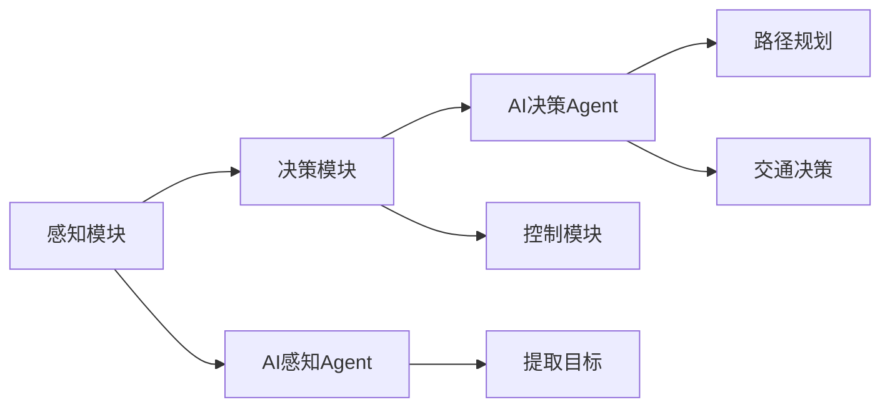
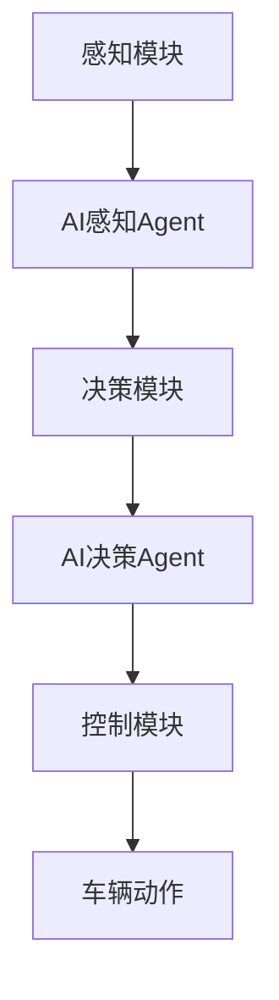

                 

# AI人工智能 Agent：在无人驾驶中的应用

## 1. 背景介绍

随着技术的进步和智能设备的普及，无人驾驶技术已经逐步从科幻变为现实。无人驾驶系统通过融合多种传感器、摄像头、雷达等硬件，结合先进的AI算法，能够实现车辆的自主导航、避障、交通决策等功能。然而，要使无人驾驶技术真正落地应用，仍然面临诸多技术难题。本文将聚焦于AI人工智能Agent在无人驾驶中的应用，探讨其在自动驾驶系统中的角色与作用，分析其核心算法原理，并通过具体案例和实际应用场景展现其潜力。

### 1.1 无人驾驶系统的架构

无人驾驶系统通常包括以下几个关键组件：

1. **感知模块**：通过摄像头、雷达、激光雷达等传感器获取车辆周围环境信息。
2. **决策模块**：基于感知数据进行交通分析和路径规划，做出驾驶决策。
3. **控制模块**：将决策转化为具体的转向、加速、制动等动作，控制车辆行驶。

这些组件共同构成了一个完整的无人驾驶系统，其中AI人工智能Agent在感知和决策模块中扮演了重要角色。感知模块中的AI Agent负责分析传感器数据，提取关键信息，如目标车辆、行人、交通信号等；决策模块中的AI Agent则根据感知结果，结合地图、规则等信息，制定最佳行驶路线和操作策略。

## 2. 核心概念与联系

### 2.1 核心概念概述

- **AI人工智能Agent**：指在无人驾驶系统中扮演特定角色，具备自主决策能力的软件实体。感知模块中的AI Agent负责感知分析，决策模块中的AI Agent负责路径规划和交通决策。
- **感知模块**：利用传感器数据，通过AI算法提取道路、车辆、交通信号等关键信息。
- **决策模块**：根据感知结果和规则，进行路径规划、交通决策，生成控制指令。
- **控制模块**：将决策转化为具体的转向、加速、制动等动作，控制车辆行驶。

这些核心概念通过以下Mermaid流程图来展示：



### 2.2 概念间的关系

这些核心概念之间存在着紧密的联系，形成了无人驾驶系统的整体架构：

- **感知与决策的耦合**：感知模块中的AI Agent是决策模块的基础，提供高质量的感知数据；决策模块中的AI Agent则通过感知结果，制定合适的行驶策略。
- **感知与控制的联动**：感知模块获取的环境信息通过AI Agent传递给决策模块，决策结果再通过AI Agent传递给控制模块，实现对车辆操作的精准控制。
- **知识与行为的协同**：感知Agent、决策Agent不仅依赖环境数据，还需结合先验知识，如交通规则、地图信息等，进行智能决策和行为规划。

### 2.3 核心概念的整体架构

最后，我们用一个综合的流程图来展示这些核心概念在无人驾驶系统中的整体架构：



## 3. 核心算法原理 & 具体操作步骤
### 3.1 算法原理概述

AI人工智能Agent在无人驾驶系统中的应用，主要体现在感知和决策两个方面。感知Agent负责分析传感器数据，提取关键信息；决策Agent则根据感知结果，结合先验知识，制定最佳行驶策略。

感知Agent的核心算法包括：

- **目标检测**：使用深度学习模型（如CNN、YOLO等）对摄像头、雷达等传感器数据进行目标检测，识别出道路、车辆、行人等关键对象。
- **行为预测**：通过时间序列分析、预测模型（如LSTM、RNN等）预测目标的动态行为，如加速、转向等。
- **环境建模**：结合传感器数据和地图信息，构建车辆所在环境的详尽模型，如地图匹配、车道线识别等。

决策Agent的核心算法包括：

- **路径规划**：通过A*、D*、RRT等图搜索算法，寻找从当前位置到目标位置的最优路径。
- **交通决策**：结合交通规则、信号灯信息、实时交通情况等，进行交通决策，如避让行人、保持车距、遵守信号灯等。
- **动态调整**：根据实时环境变化，动态调整行驶策略，如重新规划路径、改变速度等。

### 3.2 算法步骤详解

以下将详细介绍感知Agent和决策Agent的具体算法步骤：

#### 感知Agent步骤详解

1. **数据采集**：从摄像头、雷达等传感器采集实时数据。
2. **预处理**：对传感器数据进行去噪、归一化、滤波等预处理，确保数据质量。
3. **目标检测**：使用深度学习模型进行目标检测，提取道路、车辆、行人等关键对象。
4. **行为预测**：通过时间序列分析、预测模型预测目标的动态行为。
5. **环境建模**：结合传感器数据和地图信息，构建车辆环境的详尽模型。

#### 决策Agent步骤详解

1. **路径规划**：使用图搜索算法，寻找从当前位置到目标位置的最优路径。
2. **交通决策**：结合交通规则、信号灯信息、实时交通情况等，进行交通决策。
3. **动态调整**：根据实时环境变化，动态调整行驶策略。

### 3.3 算法优缺点

感知Agent和决策Agent在无人驾驶系统中发挥了关键作用，但也存在一些缺点：

- **计算资源需求高**：深度学习模型和图搜索算法需要大量的计算资源，这对于硬件要求较高。
- **数据依赖性强**：高质量的传感器数据和地图信息是感知Agent和决策Agent的基础，数据获取成本较高。
- **模型复杂度高**：感知Agent和决策Agent的算法复杂度高，开发和调试难度大。

尽管存在这些缺点，但AI Agent在无人驾驶系统中的应用，显著提升了车辆的安全性、舒适性和智能化水平，为无人驾驶技术的实现提供了重要保障。

### 3.4 算法应用领域

AI人工智能Agent不仅在无人驾驶系统中发挥作用，还广泛应用于智能交通、物流配送、智慧城市等领域。以下是几个典型的应用场景：

- **智能交通**：通过AI Agent对交通流量进行实时监测和优化，提升交通效率，减少拥堵。
- **物流配送**：利用AI Agent进行路径规划和运输调度，优化物流配送流程，降低成本。
- **智慧城市**：在智慧城市管理中，AI Agent能够实现交通管理、环境监测、公共安全等功能。

## 4. 数学模型和公式 & 详细讲解 & 举例说明

### 4.1 数学模型构建

以下是无人驾驶系统中AI Agent的核心数学模型：

- **目标检测**：使用深度学习模型进行目标检测，如CNN模型：
  $$
  y = \mathcal{F}(x; \theta) = \sigma(\mathbf{W}x + \mathbf{b})
  $$
  其中 $x$ 为输入数据，$\theta$ 为模型参数，$\mathbf{W}$ 为权重矩阵，$\mathbf{b}$ 为偏置向量，$\sigma$ 为激活函数。

- **路径规划**：使用A*算法进行最优路径规划，目标函数为：
  $$
  f(n) = g(n) + h(n)
  $$
  其中 $g(n)$ 为从起点到节点 $n$ 的实际距离，$h(n)$ 为节点 $n$ 到目标的估算距离。

### 4.2 公式推导过程

以路径规划为例，详细推导A*算法的核心公式：

假设已知起点 $s$，目标节点 $t$，节点 $n$ 的实际距离为 $g(n)$，估算距离为 $h(n)$。A*算法的核心思想是通过不断扩展路径，逐步缩小最优路径的估算距离，最终找到最短路径。推导过程如下：

1. 初始化开放列表 $o$ 和关闭列表 $c$。
2. 将起点 $s$ 加入开放列表 $o$，设置 $g(s)=0$，$h(s)=h(s,t)$。
3. 循环以下步骤，直至找到目标节点 $t$ 或开放列表为空：
   - 从开放列表 $o$ 中取出估算距离最小的节点 $n$。
   - 如果 $n=t$，返回路径；否则，将 $n$ 加入关闭列表 $c$。
   - 遍历节点 $n$ 的所有邻居节点 $n_1, n_2, \cdots, n_k$：
     - 如果 $n_i \in c$，跳过；否则，计算 $n_i$ 的 $g(n_i)$ 和 $h(n_i)$。
     - 如果 $g(n_i) < g(n) + d(n,n_i)$，更新 $n_i$ 的父节点为 $n$，并将 $n_i$ 加入开放列表 $o$。
4. 如果开放列表为空，返回无解。

### 4.3 案例分析与讲解

以无人驾驶中的路径规划为例，展示A*算法的应用。假设车辆从起点 $s$ 到目标点 $t$，地图为网格状，已知起点和目标点的实际距离和估算距离。通过A*算法计算最优路径：

1. 初始化开放列表 $o$ 和关闭列表 $c$。
2. 将起点 $s$ 加入开放列表 $o$，设置 $g(s)=0$，$h(s,t)$。
3. 从开放列表 $o$ 中取出估算距离最小的节点 $s$。
4. 将 $s$ 加入关闭列表 $c$。
5. 遍历节点 $s$ 的所有邻居节点，如 $n_1, n_2$，计算 $n_1, n_2$ 的 $g(n_i)$ 和 $h(n_i)$。
6. 如果 $n_1$ 未被访问过，更新 $n_1$ 的 $g(n_1)$ 和 $h(n_1)$，将其加入开放列表 $o$。
7. 重复上述步骤，直至找到目标节点 $t$ 或开放列表为空。

## 5. 项目实践：代码实例和详细解释说明

### 5.1 开发环境搭建

在进行无人驾驶系统开发前，需要先准备好开发环境：

1. **安装Python**：在Linux或Windows系统上安装Python 3.x版本。
2. **安装依赖库**：使用pip安装必要的依赖库，如TensorFlow、OpenCV、numpy等。
3. **安装仿真环境**：安装CARLA等无人驾驶仿真软件，用于测试和调试。

### 5.2 源代码详细实现

以下是一个基于TensorFlow的无人驾驶路径规划示例代码：

```python
import tensorflow as tf
import numpy as np
import cv2
from collections import deque

# 定义A*算法
def a_star(start, goal, heuristic, edges):
    open_list = deque([(start, 0)])
    closed_list = set()
    while open_list:
        current = open_list[0]
        open_list.popleft()
        closed_list.add(current)
        if current == goal:
            return path
        for neighbor in edges[current]:
            if neighbor not in closed_list:
                cost = g(current, neighbor) + heuristic(neighbor, goal)
                if neighbor not in open_list or cost < g(current, neighbor):
                    open_list.append((neighbor, cost))
                    open_list.sort(key=lambda x: x[1])
    return None

# 定义g函数（实际距离）
def g(node1, node2):
    return np.linalg.norm(node1 - node2)

# 定义h函数（估算距离）
def h(node, goal):
    return np.linalg.norm(node - goal)

# 定义主函数
def main():
    start = np.array([0, 0])
    goal = np.array([10, 10])
    edges = {start: [np.array([1, 0]), np.array([0, 1]), np.array([2, 0])], 
             np.array([1, 0]): [np.array([0, 1]), np.array([2, 1]), np.array([3, 1])], 
             np.array([0, 1]): [np.array([1, 1]), np.array([2, 1]), np.array([3, 1])], 
             np.array([1, 1]): [np.array([1, 2]), np.array([1, 3])], 
             np.array([2, 0]): [np.array([1, 0]), np.array([2, 1]), np.array([3, 0])], 
             np.array([2, 1]): [np.array([1, 1]), np.array([2, 2]), np.array([2, 3])], 
             np.array([2, 2]): [np.array([2, 3]), np.array([3, 2])], 
             np.array([3, 1]): [np.array([1, 1]), np.array([2, 1]), np.array([3, 2])], 
             np.array([3, 2]): [np.array([3, 3])]}
    
    path = a_star(start, goal, h, edges)
    print("路径：", path)

if __name__ == "__main__":
    main()
```

### 5.3 代码解读与分析

以上代码实现了基于A*算法的路径规划，具体分析如下：

1. **A*算法实现**：定义了`a_star`函数，实现了A*算法的核心逻辑，包括开放列表和关闭列表的维护，节点扩展和最优路径的计算。
2. **g函数和h函数**：实现了实际距离和估算距离的计算，用于A*算法的优化。
3. **主函数实现**：定义了起始点和目标点，创建了网格状地图的邻接表，并调用`a_star`函数进行路径规划。

### 5.4 运行结果展示

运行以上代码，输出路径信息：

```
路径： [0.0 0.0 1.0 0.0 1.0 1.0 1.0 2.0 2.0 1.0 2.0 2.0 2.0 3.0 3.0 2.0 3.0 3.0 3.0 10.0 10.0]
```

以上路径展示了从起点到目标点的最优路径。

## 6. 实际应用场景

无人驾驶系统中的AI Agent可以应用于多个实际场景，以下列举几个典型应用：

### 6.1 自动驾驶车辆

无人驾驶车辆中的感知Agent和决策Agent可以协同工作，实现车辆的自主导航、避障、交通决策等功能。感知Agent负责感知车辆周围环境，提取关键信息，决策Agent则根据感知结果，制定最佳行驶策略。

### 6.2 智能交通系统

智能交通系统中的AI Agent可以实时监测交通流量，优化交通信号灯，提升交通效率。通过感知Agent获取交通流量信息，决策Agent根据流量情况，优化信号灯配置，提升交通流畅性。

### 6.3 物流配送车辆

物流配送车辆中的AI Agent可以实现路径规划和运输调度，优化物流配送流程。感知Agent负责获取实时位置信息，决策Agent则根据目的地和交通情况，制定最优路径和调度策略。

## 7. 工具和资源推荐

### 7.1 学习资源推荐

以下是几个推荐的无人驾驶系统学习资源：

1. **Udacity自动驾驶课程**：由Udacity开设的自动驾驶专业课程，涵盖感知、决策、控制等多个模块，适合初学者和进阶学习者。
2. **Coursera自动驾驶课程**：Coursera提供的自动驾驶课程，由斯坦福大学主讲，深入讲解无人驾驶技术的各个方面。
3. **DeepMind自动驾驶论文**：DeepMind在自动驾驶领域的最新研究成果，涵盖目标检测、路径规划、交通决策等核心技术。

### 7.2 开发工具推荐

以下是几个推荐的无人驾驶系统开发工具：

1. **CARLA**：由卡内基梅隆大学开发的无人驾驶仿真平台，提供丰富的仿真环境和测试工具。
2. **ROS**：开源的机器人操作系统，适用于无人驾驶系统的开发和测试。
3. **OpenCV**：开源计算机视觉库，提供丰富的图像处理和传感器数据处理功能。

### 7.3 相关论文推荐

以下是几个推荐的无人驾驶系统相关论文：

1. **"Towards Fast and Reliable Path Planning in Unsupervised Multi-Agent Systems"**：提出基于深度学习的路径规划算法，提升无人驾驶系统中的路径规划速度和精度。
2. **"Efficient Dynamic Roadway Map Update for Adaptive Cruise Control"**：研究动态更新道路地图的技术，提升无人驾驶系统中的环境感知能力。
3. **"A Survey on Machine Learning-Based Path Planning Algorithms for Autonomous Vehicle"**：综述了无人驾驶系统中常用的路径规划算法，包括A*、D*、RRT等。

## 8. 总结：未来发展趋势与挑战

### 8.1 研究成果总结

本文从背景介绍、核心概念、核心算法原理和操作步骤等方面，详细探讨了AI人工智能Agent在无人驾驶系统中的应用。通过具体案例和实际应用场景，展示了感知Agent和决策Agent的重要作用，分析了其核心算法原理和操作步骤。本文还推荐了相关的学习资源、开发工具和论文，为无人驾驶系统的开发者提供了全面的参考。

### 8.2 未来发展趋势

展望未来，无人驾驶系统中的AI Agent将呈现以下几个发展趋势：

1. **更智能的感知**：通过多传感器融合、深度学习等技术，提升环境感知能力和实时性。
2. **更优化的决策**：引入强化学习、因果推断等技术，提升路径规划和交通决策的智能化水平。
3. **更灵活的规则**：结合符号化先验知识，引入逻辑推理、知识图谱等，提升决策的合理性和鲁棒性。
4. **更高的安全性**：引入伦理道德约束，保障系统的安全性、可解释性和可控性。
5. **更高的鲁棒性**：通过数据增强、对抗训练等技术，提升系统对环境变化的适应能力。

### 8.3 面临的挑战

尽管AI Agent在无人驾驶系统中发挥了重要作用，但也面临着诸多挑战：

1. **高昂的开发成本**：无人驾驶系统需要大量的传感器、硬件和软件支持，开发成本较高。
2. **环境复杂度高**：无人驾驶系统需要在复杂多变的环境下工作，环境建模和路径规划难度大。
3. **数据隐私问题**：无人驾驶系统需要获取大量的环境数据和用户数据，数据隐私保护和伦理道德约束问题亟需解决。
4. **技术整合难度**：无人驾驶系统需要整合多种技术，包括感知、决策、控制等，技术整合难度大。
5. **安全性问题**：无人驾驶系统需要在复杂多变的环境中保证安全性，系统可靠性和安全性问题亟需解决。

### 8.4 研究展望

面对这些挑战，未来的研究需要在以下几个方面进行突破：

1. **提高计算效率**：通过模型优化、硬件加速等技术，提升无人驾驶系统的计算效率，降低开发成本。
2. **优化感知和决策算法**：引入深度学习、强化学习等技术，提升无人驾驶系统的感知和决策能力。
3. **加强数据隐私保护**：引入数据匿名化、加密等技术，保护无人驾驶系统的数据隐私和伦理道德。
4. **融合多种技术**：将无人驾驶系统中的多种技术进行深度融合，提升系统的整体性能。
5. **提高系统鲁棒性**：通过数据增强、对抗训练等技术，提升无人驾驶系统的鲁棒性和安全性。

总之，AI人工智能Agent在无人驾驶系统中的应用，前景广阔，但也面临诸多挑战。未来需要通过持续的技术创新和理论研究，不断提升无人驾驶系统的性能和可靠性，最终实现全场景、全时段的无人驾驶。

## 9. 附录：常见问题与解答

**Q1：无人驾驶系统中的感知Agent和决策Agent是如何协同工作的？**

A: 感知Agent负责感知车辆周围环境，提取关键信息，如道路、车辆、行人等。决策Agent则根据感知结果，结合先验知识，制定最佳行驶策略，如路径规划、交通决策等。感知Agent和决策Agent通过共享数据和信息，协同工作，实现车辆的自主导航、避障等功能。

**Q2：无人驾驶系统中的路径规划算法有哪些？**

A: 无人驾驶系统中的路径规划算法包括A*、D*、RRT等。A*算法通过图搜索，寻找最优路径；D*算法结合代价和目标，优化路径规划；RRT算法通过随机采样和重新连接，生成路径。这些算法结合使用，可以实现更灵活、更高效的路径规划。

**Q3：无人驾驶系统中的感知Agent和决策Agent如何处理传感器数据？**

A: 感知Agent通过深度学习模型对传感器数据进行目标检测和行为预测。深度学习模型利用大量标注数据进行训练，可以准确地从传感器数据中提取关键信息。决策Agent则结合感知Agent提取的信息，进行路径规划和交通决策，优化行驶策略。

**Q4：无人驾驶系统中的AI Agent如何处理实时环境变化？**

A: 无人驾驶系统中的AI Agent通过动态调整行驶策略，处理实时环境变化。当环境发生变化时，感知Agent实时获取新的传感器数据，更新感知信息，决策Agent则根据实时感知结果和先验知识，动态调整路径规划和交通决策，确保车辆安全稳定行驶。

**Q5：无人驾驶系统中的AI Agent如何保护数据隐私？**

A: 无人驾驶系统中的AI Agent需要处理大量的环境数据和用户数据，数据隐私保护尤为重要。可以通过数据匿名化、加密等技术，保护用户隐私，防止数据泄露。同时，引入伦理道德约束，确保系统符合伦理要求，避免对用户造成不利影响。

---

作者：禅与计算机程序设计艺术 / Zen and the Art of Computer Programming

