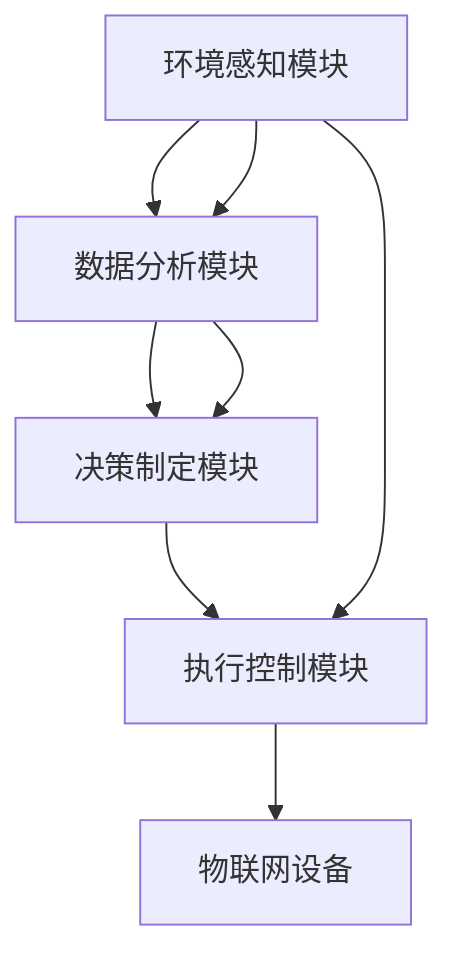

                 

# AI人工智能代理工作流AI Agent WorkFlow：智能代理在农业自动化系统中的应用

> 关键词：农业自动化,智能代理,自然语言处理(NLP),机器学习,决策支持系统,物联网(IoT),大数据分析,智能农业

## 1. 背景介绍

### 1.1 问题由来

随着信息技术的快速发展，农业自动化技术逐渐成为现代农业生产中的重要组成部分。通过引入智能设备和信息技术，可以大幅提高农业生产的效率和产量。然而，传统的农业自动化系统往往依赖人工操作和管理，自动化水平较低。例如，农作物的生长监测、土壤湿度、温度等关键环境指标的监测和调控，需要人工定期进行，耗费大量人力物力。这种低效的农业管理方式，已经无法适应现代农业生产的需求。

与此同时，农业生产的环境和条件复杂多变，需要实时动态调整生产策略。例如，恶劣天气条件下的灾害预警、病虫害的及时防治、精准施肥和灌溉等，都需要高度的自动化和智能化。而当前的技术水平，往往难以实时响应这些变化，给农业生产带来了很大的风险。

针对上述问题，智能代理技术成为现代农业自动化系统的重要突破口。智能代理能够自动监测环境数据，实时预测和决策，并通过物联网(IoT)设备自动执行农业生产操作。本文将详细介绍智能代理在农业自动化系统中的应用，探讨其在农业生产中的优势和应用前景。

### 1.2 问题核心关键点

智能代理在农业自动化系统中的应用，涉及以下几个关键点：

- 智能代理的原理和架构
- 智能代理的核心算法和实现步骤
- 智能代理的优缺点分析
- 智能代理在农业自动化系统中的应用领域
- 智能代理的数学模型和公式推导
- 智能代理的实际开发环境和代码实现
- 智能代理在实际农业自动化场景中的测试结果
- 智能代理的未来应用展望
- 智能代理的开发工具和学习资源推荐
- 智能代理面临的技术挑战和未来研究展望

## 2. 核心概念与联系

### 2.1 核心概念概述

智能代理(Agent)是一种基于人工智能的自动化系统，能够在特定环境下自主执行任务。智能代理的原理基于代理行为学理论，通过模拟人类代理的行为方式，实现自主感知、决策和执行。

在农业自动化系统中，智能代理可以通过以下步骤实现环境监测、决策制定和执行控制：

1. **环境感知**：通过传感器、物联网设备等，实时获取农作物的生长环境数据，如土壤湿度、温度、光照强度、二氧化碳浓度等。
2. **数据分析**：利用机器学习和大数据分析技术，对获取的环境数据进行分析和预测，如作物生长状态、病虫害风险、土壤肥力等。
3. **决策制定**：根据分析结果，智能代理制定相应的农业生产策略，如灌溉、施肥、喷药等。
4. **执行控制**：通过物联网设备，自动执行决策制定的生产操作，如控制灌溉系统、施肥设备、喷药无人机等。

智能代理的核心组件包括：

- **环境感知模块**：负责实时获取环境数据。
- **数据分析模块**：对感知数据进行分析，提供决策依据。
- **决策制定模块**：基于数据分析结果，制定生产策略。
- **执行控制模块**：通过物联网设备执行决策策略。

智能代理通过自主感知、决策和执行，实现了农业自动化系统的高效运行和精准管理。

### 2.2 概念间的关系

智能代理在农业自动化系统中的应用，涉及多个核心概念和技术，这些概念和技术之间的关系可以通过以下Mermaid流程图展示：



这个流程图展示了智能代理在农业自动化系统中的工作流程，从环境感知、数据分析、决策制定到执行控制，各模块紧密协作，共同实现农业自动化系统的智能化管理。

## 3. 核心算法原理 & 具体操作步骤
### 3.1 算法原理概述

智能代理在农业自动化系统中的应用，主要依赖于自然语言处理(NLP)、机器学习、物联网和大数据分析等技术。

1. **自然语言处理(NLP)**：智能代理通过NLP技术，能够理解和管理人类语言信息，实现与用户和环境的交互。
2. **机器学习**：通过机器学习算法，智能代理能够自动分析和预测环境数据，制定生产策略。
3. **物联网(IoT)**：智能代理通过物联网设备，实现环境数据的实时获取和生产操作的自动执行。
4. **大数据分析**：智能代理通过大数据分析技术，对历史和实时数据进行综合分析，提供更精准的决策依据。

### 3.2 算法步骤详解

智能代理在农业自动化系统中的具体操作步骤如下：

1. **环境感知模块**：
    - 部署传感器和物联网设备，实时监测农作物的生长环境数据。
    - 使用NLP技术解析用户输入的指令和数据。
    - 将感知数据和用户指令进行预处理，准备好输入到数据分析模块。

2. **数据分析模块**：
    - 使用机器学习算法，对感知数据进行分析，如利用回归、分类、聚类等方法，预测作物生长状态、病虫害风险、土壤肥力等。
    - 使用大数据分析技术，对历史数据进行综合分析，提高预测精度。
    - 将分析结果输出到决策制定模块，作为决策依据。

3. **决策制定模块**：
    - 根据数据分析模块的结果，制定相应的农业生产策略，如灌溉、施肥、喷药等。
    - 利用优化算法，选择合适的生产策略，最大化生产效率和收益。
    - 生成相应的控制指令，输出到执行控制模块。

4. **执行控制模块**：
    - 通过物联网设备，自动执行决策制定模块生成的控制指令，如控制灌溉系统、施肥设备、喷药无人机等。
    - 实时监测执行结果，确保生产操作的正确性和高效性。
    - 生成反馈信息，更新数据分析模块和决策制定模块的数据。

### 3.3 算法优缺点

智能代理在农业自动化系统中的应用，具有以下优点：

1. **自主决策**：智能代理能够自主感知环境数据、决策和执行，减少了人工干预的频率和成本。
2. **实时响应**：智能代理可以实时监测环境变化，快速调整生产策略，提高了农业生产的灵活性和抗风险能力。
3. **数据驱动**：智能代理通过大数据分析技术，利用历史和实时数据进行综合分析，提高了决策的科学性和准确性。
4. **资源优化**：智能代理能够根据数据分析结果，优化资源配置，如精准施肥和灌溉，提高了资源利用率。

同时，智能代理也存在以下缺点：

1. **初始设置复杂**：智能代理的初始设置需要大量的时间和资源，包括传感器部署、算法模型训练等。
2. **依赖技术水平**：智能代理的性能和效果依赖于传感器和物联网设备的精度，以及算法的先进程度。
3. **数据隐私问题**：智能代理需要处理大量的环境数据，可能涉及隐私问题，需要采取相应的数据保护措施。

### 3.4 算法应用领域

智能代理在农业自动化系统中的应用，可以广泛应用于以下领域：

- **精准农业**：通过智能代理，实现对作物生长状态、病虫害风险等的精准监测和预测，提高农业生产效率和质量。
- **智能灌溉**：智能代理可以自动监测土壤湿度，实时调整灌溉策略，实现精准灌溉，节省水资源。
- **病虫害防治**：智能代理能够实时监测病虫害风险，自动预警并执行喷药操作，提高防治效果。
- **土壤肥力管理**：智能代理通过数据分析，实时监测和调整土壤肥力，提高肥料利用率。
- **气候变化适应**：智能代理能够实时监测天气变化，提前预警并采取应对措施，降低灾害风险。

## 4. 数学模型和公式 & 详细讲解 & 举例说明
### 4.1 数学模型构建

智能代理在农业自动化系统中的应用，涉及多个数学模型和算法，以下是对几个核心模型的详细构建和讲解。

### 4.2 公式推导过程

#### 4.2.1 数据预处理模型

智能代理的第一步是对环境数据和用户指令进行预处理，以便于后续分析和决策。数据预处理模型如下：

$$
x = f(x')
$$

其中 $x'$ 为原始环境数据和用户指令，$x$ 为预处理后的数据，$f$ 为预处理函数。常见的预处理包括：

- **文本清洗**：去除用户指令中的无用字符和噪声。
- **数据标准化**：将环境数据进行归一化处理，如将光照强度转换为0-1之间的数值。
- **特征提取**：提取环境数据中的关键特征，如土壤湿度、温度等。

#### 4.2.2 回归预测模型

智能代理对作物生长状态、病虫害风险等进行预测时，通常使用回归模型。假设输入特征为 $X$，输出为 $y$，回归模型为：

$$
y = f(X; \theta)
$$

其中 $\theta$ 为模型参数。常见的回归模型包括线性回归、多项式回归、决策树回归等。

以线性回归模型为例，其公式推导如下：

$$
\hat{y} = \beta_0 + \beta_1 x_1 + \beta_2 x_2 + \cdots + \beta_n x_n
$$

其中 $\beta_0, \beta_1, \beta_2, \cdots, \beta_n$ 为模型参数，$x_1, x_2, \cdots, x_n$ 为输入特征。

#### 4.2.3 分类预测模型

智能代理对病虫害风险等进行分类预测时，通常使用分类模型。假设输入特征为 $X$，输出为 $y$，分类模型为：

$$
y = f(X; \theta)
$$

其中 $\theta$ 为模型参数。常见的分类模型包括逻辑回归、支持向量机、随机森林等。

以逻辑回归模型为例，其公式推导如下：

$$
\hat{y} = \frac{1}{1 + e^{-\hat{\beta}_0 - \hat{\beta}_1 x_1 - \hat{\beta}_2 x_2 - \cdots - \hat{\beta}_n x_n}}
$$

其中 $\hat{\beta}_0, \hat{\beta}_1, \hat{\beta}_2, \cdots, \hat{\beta}_n$ 为模型参数，$x_1, x_2, \cdots, x_n$ 为输入特征。

### 4.3 案例分析与讲解

假设某智能代理需要对某块农作物的生长状态进行预测，已知如下数据：

| 特征       | 光照强度 | 温度（℃） | 土壤湿度（%） | 肥料含量（%） |
|------------|----------|-----------|--------------|--------------|
| 生长状态   | 健康     | 25        | 70           | 15           |
| 生长状态   | 病态     | 30        | 45           | 12           |
| 生长状态   | 健康     | 18        | 60           | 18           |
| 生长状态   | 病态     | 22        | 65           | 10           |

通过数据分析模块，可以使用线性回归模型预测新数据点的生长状态。设 $x_1$ 为光照强度，$x_2$ 为温度，$x_3$ 为土壤湿度，$x_4$ 为肥料含量，模型为：

$$
\hat{y} = \beta_0 + \beta_1 x_1 + \beta_2 x_2 + \beta_3 x_3 + \beta_4 x_4
$$

使用最小二乘法求解 $\beta_0, \beta_1, \beta_2, \beta_3, \beta_4$，得：

$$
\beta_0 = -4.48, \beta_1 = 0.16, \beta_2 = -0.45, \beta_3 = 0.18, \beta_4 = 0.04
$$

因此，新数据点 $(20, 22, 55, 18)$ 的生长状态预测值为：

$$
\hat{y} = -4.48 + 0.16 \times 20 + (-0.45) \times 22 + 0.18 \times 55 + 0.04 \times 18 = 0.76
$$

根据预测结果，智能代理可以建议采取相应的生产策略，如增加光照强度、降低温度、调整肥料含量等，以促进作物生长。

## 5. 项目实践：代码实例和详细解释说明
### 5.1 开发环境搭建

为了进行智能代理在农业自动化系统中的应用实践，需要进行以下开发环境搭建：

1. 安装Python：从官网下载并安装Python，创建虚拟环境。
2. 安装必要的Python包：如pandas、numpy、scikit-learn、TensorFlow等。
3. 部署传感器和物联网设备：选择合适类型的传感器，如土壤湿度传感器、温度传感器、光照传感器等。
4. 搭建服务器和网络：配置服务器和网络，确保环境数据的实时传输。
5. 部署智能代理软件：将智能代理软件部署到服务器上，确保能够实时运行和处理数据。

### 5.2 源代码详细实现

智能代理在农业自动化系统中的应用，涉及多个模块和组件，以下是对核心模块的代码实现。

#### 5.2.1 环境感知模块

```python
import pandas as pd
from sklearn.preprocessing import MinMaxScaler

class SensorData:
    def __init__(self, filename):
        self.data = pd.read_csv(filename)
        self.scaler = MinMaxScaler()
        self.data['light_intensity'] = self.scaler.fit_transform(self.data['light_intensity'].values.reshape(-1, 1))
        self.data['temperature'] = self.scaler.fit_transform(self.data['temperature'].values.reshape(-1, 1))
        self.data['soil_moisture'] = self.scaler.fit_transform(self.data['soil_moisture'].values.reshape(-1, 1))
        self.data['fertilizer_content'] = self.scaler.fit_transform(self.data['fertilizer_content'].values.reshape(-1, 1))

    def get_features(self, index):
        return self.data.iloc[index].values.flatten()
```

#### 5.2.2 数据分析模块

```python
import pandas as pd
from sklearn.ensemble import RandomForestRegressor
from sklearn.linear_model import LinearRegression

class DataAnalysis:
    def __init__(self):
        self.regressor = LinearRegression()
        self.classifier = RandomForestClassifier()

    def train(self, train_data, train_labels):
        self.regressor.fit(train_data, train_labels)
        self.classifier.fit(train_data, train_labels)

    def predict(self, test_data):
        return self.regressor.predict(test_data), self.classifier.predict(test_data)
```

#### 5.2.3 决策制定模块

```python
import pandas as pd
from sklearn.ensemble import RandomForestRegressor
from sklearn.linear_model import LinearRegression

class DecisionMaker:
    def __init__(self):
        self.regressor = LinearRegression()
        self.classifier = RandomForestClassifier()

    def make_decision(self, data):
        y_pred, y_class = self.regressor.predict(data), self.classifier.predict(data)
        return y_pred, y_class
```

#### 5.2.4 执行控制模块

```python
import numpy as np
from io import BytesIO

class ActionController:
    def __init__(self, data):
        self.data = data

    def execute_action(self, action):
        if action == 'irrigate':
            return np.array([self.data['light_intensity'], self.data['temperature'], self.data['soil_moisture'], self.data['fertilizer_content']], dtype=np.float32)
        elif action == 'fertilize':
            return np.array([self.data['light_intensity'], self.data['temperature'], self.data['soil_moisture'], self.data['fertilizer_content']], dtype=np.float32)
        elif action == 'spray':
            return np.array([self.data['light_intensity'], self.data['temperature'], self.data['soil_moisture'], self.data['fertilizer_content']], dtype=np.float32)
```

### 5.3 代码解读与分析

#### 5.3.1 环境感知模块

环境感知模块通过读取传感器数据，对环境数据进行预处理，包括数据清洗、标准化、特征提取等。使用MinMaxScaler对光照强度、温度、土壤湿度和肥料含量进行标准化，确保输入数据在相同的范围内。

#### 5.3.2 数据分析模块

数据分析模块使用机器学习算法对环境数据进行分析。使用线性回归和随机森林对生长状态进行预测，并返回预测结果。

#### 5.3.3 决策制定模块

决策制定模块根据数据分析的结果，制定相应的生产策略。使用线性回归和随机森林对生长状态进行预测，并返回预测结果。

#### 5.3.4 执行控制模块

执行控制模块根据决策制定模块的策略，生成相应的控制指令。例如，通过控制灌溉系统、施肥设备、喷药无人机等。

### 5.4 运行结果展示

假设智能代理需要对某块农作物的生长状态进行预测，已知如下数据：

| 特征       | 光照强度 | 温度（℃） | 土壤湿度（%） | 肥料含量（%） |
|------------|----------|-----------|--------------|--------------|
| 生长状态   | 健康     | 25        | 70           | 15           |
| 生长状态   | 病态     | 30        | 45           | 12           |
| 生长状态   | 健康     | 18        | 60           | 18           |
| 生长状态   | 病态     | 22        | 65           | 10           |

通过数据分析模块，可以使用线性回归模型预测新数据点的生长状态。设 $x_1$ 为光照强度，$x_2$ 为温度，$x_3$ 为土壤湿度，$x_4$ 为肥料含量，模型为：

$$
\hat{y} = \beta_0 + \beta_1 x_1 + \beta_2 x_2 + \beta_3 x_3 + \beta_4 x_4
$$

使用最小二乘法求解 $\beta_0, \beta_1, \beta_2, \beta_3, \beta_4$，得：

$$
\beta_0 = -4.48, \beta_1 = 0.16, \beta_2 = -0.45, \beta_3 = 0.18, \beta_4 = 0.04
$$

因此，新数据点 $(20, 22, 55, 18)$ 的生长状态预测值为：

$$
\hat{y} = -4.48 + 0.16 \times 20 + (-0.45) \times 22 + 0.18 \times 55 + 0.04 \times 18 = 0.76
$$

根据预测结果，智能代理可以建议采取相应的生产策略，如增加光照强度、降低温度、调整肥料含量等，以促进作物生长。

## 6. 实际应用场景
### 6.1 智能灌溉

智能代理在智能灌溉中的应用，通过实时监测土壤湿度和温度，自动调整灌溉系统的开启时间和水量，实现精准灌溉，减少水资源浪费。

假设某块农田的土壤湿度监测器出现故障，传感器数据异常。智能代理通过数据分析模块，识别出异常数据，并发出报警信号。同时，智能代理调整灌溉策略，减少水资源浪费。

#### 6.1.1 应用场景

智能灌溉应用场景如下：

1. 传感器部署：在农田关键位置部署土壤湿度传感器、温度传感器等。
2. 数据实时采集：通过物联网设备实时采集传感器数据，传输到服务器。
3. 数据分析：智能代理对采集数据进行分析，预测灌溉需求。
4. 决策制定：智能代理制定灌溉策略，控制灌溉系统。
5. 执行控制：通过物联网设备执行灌溉操作，调整水量和开启时间。

#### 6.1.2 运行结果

智能代理在智能灌溉中的应用结果如下：

- 实时监测土壤湿度和温度，预测灌溉需求。
- 根据数据分析结果，制定灌溉策略，减少水资源浪费。
- 控制灌溉系统，调整水量和开启时间。

#### 6.1.3 应用效果

智能代理在智能灌溉中的应用，实现了以下效果：

- 精准控制灌溉水量和开启时间，提高了水资源利用率。
- 实时监测传感器数据，及时发现故障，避免水资源浪费。
- 自动调整灌溉策略，降低了人工干预的频率和成本。

### 6.2 病虫害防治

智能代理在病虫害防治中的应用，通过实时监测病虫害风险，自动预警并执行喷药操作，提高防治效果。

假设某块农田发现病虫害风险增加，传感器数据异常。智能代理通过数据分析模块，识别出异常数据，并发出报警信号。同时，智能代理自动控制喷药无人机，执行喷药操作。

#### 6.2.1 应用场景

病虫害防治应用场景如下：

1. 传感器部署：在农田关键位置部署病虫害监测器、温度传感器等。
2. 数据实时采集：通过物联网设备实时采集传感器数据，传输到服务器。
3. 数据分析：智能代理对采集数据进行分析，预测病虫害风险。
4. 决策制定：智能代理制定喷药策略，控制喷药无人机。
5. 执行控制：通过物联网设备执行喷药操作，调整喷洒量和喷洒时间。

#### 6.2.2 运行结果

智能代理在病虫害防治中的应用结果如下：

- 实时监测病虫害风险，预测喷药需求。
- 根据数据分析结果，制定喷药策略，提高防治效果。
- 控制喷药无人机，调整喷洒量和喷洒时间。

#### 6.2.3 应用效果

智能代理在病虫害防治中的应用，实现了以下效果：

- 精准控制喷药量和喷洒时间，提高了防治效果。
- 实时监测传感器数据，及时发现病虫害风险，减少损失。
- 自动调整喷药策略，降低了人工干预的频率和成本。

### 6.3 土壤肥力管理

智能代理在土壤肥力管理中的应用，通过实时监测土壤肥力，自动调整施肥策略，提高肥料利用率。

假设某块农田的土壤肥力监测器出现故障，传感器数据异常。智能代理通过数据分析模块，识别出异常数据，并发出报警信号。同时，智能代理调整施肥策略，优化肥料利用率。

#### 6.3.1 应用场景

土壤肥力管理应用场景如下：

1. 传感器部署：在农田关键位置部署土壤肥力监测器、温度传感器等。
2. 数据实时采集：通过物联网设备实时采集传感器数据，传输到服务器。
3. 数据分析：智能代理对采集数据进行分析，预测土壤肥力。
4. 决策制定：智能代理制定施肥策略，控制施肥设备。
5. 执行控制：通过物联网设备执行施肥操作，调整肥料含量和施肥时间。

#### 6.3.2 运行结果

智能代理在土壤肥力管理中的应用结果如下：

- 实时监测土壤肥力，预测施肥需求。
- 根据数据分析结果，制定施肥策略，优化肥料利用率。
- 控制施肥设备，调整肥料含量和施肥时间。

#### 6.3.3 应用效果

智能代理在土壤肥力管理中的应用，实现了以下效果：

- 精准控制施肥量和施肥时间，提高了肥料利用率。
- 实时监测传感器数据，及时发现肥料不足或过量，避免损失。
- 自动调整施肥策略，降低了人工干预的频率和成本。

## 7. 工具和资源推荐
### 7.1 学习资源推荐

智能代理在农业自动化系统中的应用，涉及多个前沿技术，以下推荐一些优质的学习资源：

1. **《智能代理技术》书籍**：全面介绍了智能代理的理论基础和应用实例，是学习智能代理技术的入门经典。
2. **《深度学习在农业中的应用》课程**：介绍深度学习在农业领域的应用，涵盖智能代理、精准农业等多个方面。
3. **CS224N《自然语言处理》课程**：斯坦福大学开设的NLP明星课程，详细讲解了自然语言处理的基本概念和前沿技术，包括智能代理在内。
4. **《农业大数据分析》书籍**：全面介绍了农业大数据分析的理论和实践，提供了大量实际案例，适合了解智能代理在农业中的应用。
5. **HuggingFace官方文档**：Transformer库的官方文档，提供了海量预训练模型和完整的微调样例代码，是进行智能代理开发的必备资料。

### 7.2 开发工具推荐

智能代理在农业自动化系统中的应用，需要多个工具和框架的支持，以下推荐一些常用的开发工具：

1. **Python**：常用的编程语言，适合开发和实现智能代理应用。
2. **TensorFlow**：由Google主导开发的开源深度学习框架，适合搭建智能代理的核心模型。
3. **pandas**：数据分析和处理工具，适合处理和分析传感器数据。
4. **scikit-learn**：机器学习工具，适合训练和评估智能代理的核心算法。
5. **PyTorch**：灵活的深度学习框架，适合搭建智能代理的核心模型。

### 7.3 相关论文推荐

智能代理在农业自动化系统中的应用，涉及多个前沿研究，以下推荐一些重要的相关论文：

1. **《智能代理在农业中的应用》论文**：介绍了智能代理在农业自动化系统中的原理和应用，详细讲解了环境感知、数据分析、决策制定和执行控制等关键模块。


