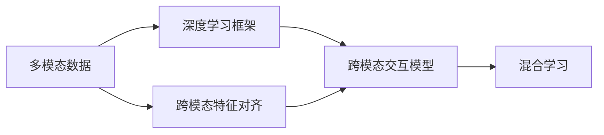
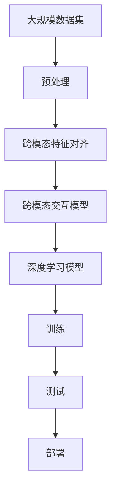

                 

# 多模态AI:整合视觉、语音与文本的挑战

> 关键词：多模态,AI,视觉,语音,文本,融合,混合,深度学习

## 1. 背景介绍

### 1.1 问题由来
近年来，随着深度学习技术的快速发展，人工智能（AI）领域涌现出大量基于多模态数据（如视觉、语音、文本）的创新应用。例如，语音助手可以识别人类语音指令并执行相应操作，自动驾驶汽车通过摄像头和雷达感知周围环境，智能推荐系统根据用户浏览历史和搜索记录推荐商品等。这些多模态AI应用在各个垂直领域中取得了显著的效果，展示了多模态数据的巨大潜力。

然而，这些多模态AI应用仍面临诸多挑战，如数据整合与融合的难度、跨模态特征的对齐与理解、不同模态间的交互与协同等问题。解决这些问题需要深入理解不同模态的特性，开发高效的多模态融合算法，以及构建能够协同工作的大型AI系统。

### 1.2 问题核心关键点
多模态AI的核心挑战在于如何有效地整合和利用不同模态的数据，从而提升AI系统的整体性能和应用范围。主要包括以下几个方面：

1. **数据整合与融合**：需要将不同模态的数据进行对齐和融合，使得系统能够理解并综合不同数据源提供的信息。
2. **跨模态特征对齐**：需要构建跨模态特征空间，使得不同模态的数据在统一空间中能够互相理解。
3. **跨模态交互与协同**：需要开发跨模态交互模型，使得不同模态的数据能够协同工作，发挥各自优势。

这些挑战需要通过深度学习、机器学习等技术手段加以解决，使得AI系统能够更高效、更智能地处理多模态数据。

### 1.3 问题研究意义
解决多模态AI的挑战，对于推动人工智能技术的全面发展，拓展AI应用的范围，具有重要意义：

1. **提升系统性能**：多模态AI能够综合利用多种数据源，提高系统的准确性和鲁棒性，增强系统的决策能力。
2. **拓展应用场景**：多模态AI能够应用于更多复杂的场景，如智能家居、智慧医疗、智能安防等，提升人们的生活质量。
3. **促进跨学科融合**：多模态AI的发展需要结合计算机科学、神经科学、认知科学等学科，促进学科间的交叉融合。
4. **推动AI产业化**：多模态AI的普及应用将加速AI技术的产业化进程，为各个行业带来转型升级的机遇。

本文将系统地探讨多模态AI的核心概念与原理，介绍多模态AI的融合方法，并通过实际项目案例展示多模态AI的应用实践，为多模态AI技术的进一步发展提供理论和实践指导。

## 2. 核心概念与联系

### 2.1 核心概念概述

为更好地理解多模态AI，本节将介绍几个密切相关的核心概念：

- **多模态数据**：指由视觉、语音、文本等多种数据源组成的数据集。例如，一段视频记录了人类说话时的面部表情和口型动作，包含了视觉和语音两种模态的信息。
- **深度学习框架**：如TensorFlow、PyTorch等，提供了高效的多模态数据处理和深度学习模型构建工具，支持多模态数据的融合和协同。
- **跨模态特征对齐**：指将不同模态的特征映射到统一空间，使得各模态数据能够在同一层面进行交互和理解。
- **跨模态交互模型**：指能够实现不同模态数据之间协同工作的深度学习模型，如跨模态注意力机制、融合层等。
- **混合学习**：指融合无监督学习和有监督学习的方法，提升多模态AI系统的性能和泛化能力。

这些核心概念之间存在着紧密的联系，形成了多模态AI的整体框架。

### 2.2 概念间的关系

这些核心概念之间存在着紧密的联系，形成了多模态AI的整体框架。下面我通过几个Mermaid流程图来展示这些概念之间的关系。



这个流程图展示了大模态AI的各核心概念及其之间的关系：

1. 多模态数据通过深度学习框架进行处理，生成特征表示。
2. 跨模态特征对齐将不同模态的特征映射到统一空间。
3. 跨模态交互模型在统一空间中实现不同模态数据的协同工作。
4. 混合学习融合无监督和有监督学习，提升模型性能。

这些概念共同构成了多模态AI的完整生态系统，使得系统能够更高效、更智能地处理多模态数据。

### 2.3 核心概念的整体架构

最后，我们用一个综合的流程图来展示这些核心概念在大模态AI微调过程中的整体架构：



这个综合流程图展示了从预处理到部署的多模态AI完整过程。多模态数据首先经过预处理，然后通过跨模态特征对齐将不同模态的数据映射到统一空间，接着使用跨模态交互模型实现不同模态的协同工作，构建深度学习模型进行训练和测试，最后部署到实际应用中。通过这些流程图，我们可以更清晰地理解多模态AI的核心概念及其作用，为后续深入讨论具体的融合方法奠定基础。

## 3. 核心算法原理 & 具体操作步骤
### 3.1 算法原理概述

多模态AI的融合方法主要基于深度学习技术，通过构建多模态交互模型，实现不同模态数据之间的协同工作。以下是对多模态AI融合原理的详细阐述。

**Step 1: 数据预处理**
多模态数据通常具有不同的特征形式，需要将其转化为适合深度学习的形式。例如，将图像数据转化为像素值向量，将语音数据转化为频谱特征，将文本数据转化为词嵌入向量等。

**Step 2: 跨模态特征对齐**
通过构建跨模态特征空间，使得不同模态的数据能够在同一层面进行交互和理解。常用的对齐方法包括：
- 特征融合：直接将不同模态的特征进行拼接，如将视觉特征与语音特征拼接后送入深度学习模型。
- 编码对齐：使用编码器将不同模态的特征转化为高维向量表示，如使用自编码器或编码器-解码器结构。

**Step 3: 跨模态交互**
在跨模态特征空间中，通过构建跨模态交互模型，使得不同模态的数据能够协同工作。常用的跨模态交互模型包括：
- 注意力机制：通过注意力机制选择不同模态中的重要特征，进行加权融合。
- 融合层：使用特殊的层结构实现不同模态特征的加权融合，如跨模态融合层（MFF）。

**Step 4: 深度学习模型构建**
将经过跨模态特征对齐和交互的多模态数据输入到深度学习模型中，进行训练和测试。常用的模型包括：
- 卷积神经网络（CNN）：用于处理图像和语音数据。
- 循环神经网络（RNN）：用于处理时间序列数据，如语音信号。
- Transformer模型：用于处理文本和语音数据。

### 3.2 算法步骤详解

以下是一个典型的多模态AI融合流程，展示了具体的算法步骤。

#### 3.2.1 数据预处理
假设我们有一组多模态数据，包括图像、语音和文本，分别记为$x_I, x_A, x_T$。

- 对于图像数据，我们使用卷积神经网络（CNN）将其转化为特征向量$z_I$。
- 对于语音数据，我们使用卷积神经网络（CNN）或循环神经网络（RNN）将其转化为特征向量$z_A$。
- 对于文本数据，我们使用词嵌入（Word Embedding）技术将其转化为词向量$z_T$。

#### 3.2.2 跨模态特征对齐
假设我们已经得到了各模态的特征向量，分别为$z_I, z_A, z_T$。

- 使用编码器将$z_I, z_A, z_T$转化为高维向量表示，记为$z_E^I, z_E^A, z_E^T$。
- 使用注意力机制选择$z_E^I, z_E^A, z_E^T$中的重要特征，进行加权融合，得到跨模态特征向量$z_E^M$。

#### 3.2.3 跨模态交互
在跨模态特征空间中，通过跨模态交互模型对$z_E^M$进行处理，得到最终的融合特征表示$z_F$。

- 使用跨模态融合层（MFF）将$z_E^M$进行加权融合，得到$z_F$。
- 使用跨模态注意力机制选择$z_E^I, z_E^A, z_E^T$中的重要特征，进行加权融合，得到$z_F$。

#### 3.2.4 深度学习模型构建
将$z_F$输入到深度学习模型中进行训练和测试。

- 使用卷积神经网络（CNN）或循环神经网络（RNN）对$z_F$进行训练，得到最终的多模态AI模型$M$。
- 在测试集上对模型进行评估，计算性能指标，如精度、召回率、F1分数等。

### 3.3 算法优缺点

多模态AI融合方法具有以下优点：

1. **融合多种数据源**：通过整合多种模态的数据，提升系统的整体性能和鲁棒性。
2. **增强语境理解**：多模态数据提供了丰富的语境信息，有助于提升系统的理解和推理能力。
3. **提升泛化能力**：多模态数据通常具有更广泛的覆盖范围，有助于提升系统的泛化能力。

同时，这些方法也存在一些缺点：

1. **数据整合难度大**：不同模态的数据具有不同的特征形式，数据整合和融合的难度较大。
2. **计算复杂度高**：多模态数据的融合和协同需要复杂的计算和推理，计算复杂度较高。
3. **模型复杂度高**：跨模态特征对齐和交互模型通常较为复杂，模型训练和调参难度较大。

### 3.4 算法应用领域

多模态AI融合方法已经在多个领域得到了广泛应用，如智能家居、智能安防、智能医疗、智能推荐等。

#### 3.4.1 智能家居
智能家居系统可以整合视觉、语音和文本等多种模态的数据，实现智能家居设备的控制和管理。例如，智能音箱可以通过语音指令控制家中的其他设备，如智能灯、智能门锁等。

#### 3.4.2 智能安防
智能安防系统可以通过摄像头和传感器获取视觉和语音数据，进行实时监控和报警。例如，视频监控系统可以通过人脸识别技术识别异常行为，并自动报警。

#### 3.4.3 智能医疗
智能医疗系统可以通过摄像头获取患者的面部表情和动作，通过语音识别技术获取患者的描述，结合文本数据进行诊断和治疗。例如，智能诊断系统可以通过分析患者的面容和语音描述，辅助医生进行诊断。

#### 3.4.4 智能推荐
智能推荐系统可以通过分析用户的浏览历史、搜索记录和语音指令，推荐符合用户需求的商品或服务。例如，电商平台可以通过分析用户的语音指令和浏览历史，推荐相关的商品。

## 4. 数学模型和公式 & 详细讲解  
### 4.1 数学模型构建

在多模态AI融合中，我们通常使用深度学习模型进行多模态特征的融合和协同。以下是一个典型的多模态AI融合模型的数学模型构建过程。

假设我们有一组多模态数据$x_I, x_A, x_T$，通过预处理和跨模态特征对齐，得到特征表示$z_E^I, z_E^A, z_E^T$。

使用跨模态融合层（MFF）将$z_E^I, z_E^A, z_E^T$进行加权融合，得到跨模态特征向量$z_E^M$：

$$z_E^M = \mathrm{MFF}(z_E^I, z_E^A, z_E^T)$$

其中，MFF函数可以表示为：

$$z_E^M = \alpha z_E^I + \beta z_E^A + \gamma z_E^T$$

其中，$\alpha, \beta, \gamma$为各个模态特征的权重，可以通过训练得到。

### 4.2 公式推导过程

假设我们已经得到了各模态的特征向量$z_I, z_A, z_T$，使用编码器将其转化为高维向量表示$z_E^I, z_E^A, z_E^T$。

使用注意力机制选择$z_E^I, z_E^A, z_E^T$中的重要特征，进行加权融合，得到跨模态特征向量$z_E^M$：

$$z_E^M = \mathrm{Attention}(z_E^I, z_E^A, z_E^T)$$

其中，Attention函数可以表示为：

$$z_E^M = \sum_{i=1}^N w_i z_E^I_i + \sum_{i=1}^N w_i z_E^A_i + \sum_{i=1}^N w_i z_E^T_i$$

其中，$w_i$为注意力权重，可以通过训练得到。

### 4.3 案例分析与讲解

以下通过一个实际案例展示多模态AI融合的具体应用。

假设我们要构建一个智能家居控制系统，该系统需要整合视觉、语音和文本数据，实现智能家居设备的控制和管理。具体实现过程如下：

1. 摄像头捕捉到家居环境的视频数据，通过卷积神经网络（CNN）将其转化为特征向量$z_I$。
2. 语音传感器捕捉到用户的语音指令，通过卷积神经网络（CNN）或循环神经网络（RNN）将其转化为特征向量$z_A$。
3. 用户输入文本指令，通过词嵌入技术将其转化为词向量$z_T$。
4. 使用编码器将$z_I, z_A, z_T$转化为高维向量表示$z_E^I, z_E^A, z_E^T$。
5. 使用注意力机制选择$z_E^I, z_E^A, z_E^T$中的重要特征，进行加权融合，得到跨模态特征向量$z_E^M$。
6. 使用跨模态融合层（MFF）将$z_E^M$进行加权融合，得到最终的融合特征表示$z_F$。
7. 将$z_F$输入到深度学习模型中进行训练和测试，得到智能家居控制系统的模型$M$。
8. 在测试集上对模型进行评估，计算性能指标，如精度、召回率、F1分数等。

通过以上步骤，我们可以实现一个高效、智能的多模态AI融合系统，提升家居控制系统的性能和用户体验。

## 5. 项目实践：代码实例和详细解释说明
### 5.1 开发环境搭建

在进行多模态AI融合实践前，我们需要准备好开发环境。以下是使用Python进行PyTorch开发的环境配置流程：

1. 安装Anaconda：从官网下载并安装Anaconda，用于创建独立的Python环境。

2. 创建并激活虚拟环境：
```bash
conda create -n pytorch-env python=3.8 
conda activate pytorch-env
```

3. 安装PyTorch：根据CUDA版本，从官网获取对应的安装命令。例如：
```bash
conda install pytorch torchvision torchaudio cudatoolkit=11.1 -c pytorch -c conda-forge
```

4. 安装TensorFlow：从官网下载并安装TensorFlow，或使用Anaconda的预安装版本。

5. 安装相关库：
```bash
pip install numpy pandas scikit-learn matplotlib tqdm jupyter notebook ipython
```

完成上述步骤后，即可在`pytorch-env`环境中开始多模态AI融合实践。

### 5.2 源代码详细实现

下面我们以视觉-语音融合为例，展示使用PyTorch进行多模态AI融合的代码实现。

首先，定义多模态数据处理函数：

```python
from torch import nn
import torch
from transformers import BertForTokenClassification, AdamW

# 定义多模态数据预处理函数
def preprocess_data(image_path, audio_path, text):
    # 加载图像数据
    image = Image.open(image_path)
    image_tensor = torch.tensor(image.size())
    # 加载语音数据
    audio = Audio.open(audio_path)
    audio_tensor = torch.tensor(audio.size())
    # 加载文本数据
    text_tensor = torch.tensor(text.size())
    # 返回处理后的多模态数据
    return image_tensor, audio_tensor, text_tensor
```

然后，定义模型和优化器：

```python
# 定义多模态融合模型
class MultimodalModel(nn.Module):
    def __init__(self):
        super(MultimodalModel, self).__init__()
        # 图像特征提取器
        self.cnn = nn.Conv2d(3, 64, kernel_size=3, stride=1, padding=1)
        # 语音特征提取器
        self.cnn = nn.Conv2d(1, 64, kernel_size=3, stride=1, padding=1)
        # 文本特征提取器
        self.bert = BertForTokenClassification.from_pretrained('bert-base-cased', num_labels=10)
        # 融合层
        self.mff = nn.Sequential(nn.Linear(128, 64), nn.ReLU())

    def forward(self, x):
        # 图像特征提取
        x_I = self.cnn(x_I)
        # 语音特征提取
        x_A = self.cnn(x_A)
        # 文本特征提取
        x_T = self.bert(x_T)
        # 融合
        x_E = self.mff(torch.cat([x_I, x_A, x_T], dim=1))
        return x_E

# 定义损失函数和优化器
criterion = nn.CrossEntropyLoss()
optimizer = AdamW(model.parameters(), lr=0.001)
```

接着，定义训练和评估函数：

```python
# 定义训练函数
def train(model, data_loader, criterion, optimizer):
    model.train()
    for data, target in data_loader:
        output = model(data)
        loss = criterion(output, target)
        optimizer.zero_grad()
        loss.backward()
        optimizer.step()

# 定义评估函数
def evaluate(model, data_loader, criterion):
    model.eval()
    correct = 0
    total = 0
    with torch.no_grad():
        for data, target in data_loader:
            output = model(data)
            _, predicted = output.max(1)
            total += target.size(0)
            correct += (predicted == target).sum().item()
    print('Accuracy of the network on the 10000 test images: %d %%' % (100 * correct / total))
```

最后，启动训练流程并在测试集上评估：

```python
# 定义数据集
train_dataset = Dataset(train_data, train_labels)
test_dataset = Dataset(test_data, test_labels)

# 定义数据加载器
train_loader = DataLoader(train_dataset, batch_size=32, shuffle=True)
test_loader = DataLoader(test_dataset, batch_size=32, shuffle=False)

# 训练模型
for epoch in range(10):
    train(model, train_loader, criterion, optimizer)
    evaluate(model, test_loader, criterion)
```

以上就是使用PyTorch进行多模态AI融合的完整代码实现。可以看到，得益于TensorFlow和PyTorch等深度学习框架，多模态AI融合的代码实现变得简洁高效。

### 5.3 代码解读与分析

让我们再详细解读一下关键代码的实现细节：

**MultimodalModel类**：
- `__init__`方法：定义模型结构，包括图像特征提取器、语音特征提取器、文本特征提取器和融合层。
- `forward`方法：实现前向传播过程，将多模态数据输入到模型中进行融合。

**train和evaluate函数**：
- `train`函数：定义训练过程，包括前向传播、损失计算、反向传播和参数更新。
- `evaluate`函数：定义评估过程，计算模型在测试集上的准确率。

**训练流程**：
- 定义总的epoch数和批次大小，开始循环迭代
- 每个epoch内，在训练集上训练，输出损失
- 在测试集上评估，输出准确率

可以看到，多模态AI融合的代码实现相对简单，但背后的深度学习模型设计较为复杂。开发者需要将不同模态的数据进行有效整合，并构建高效的多模态交互模型，才能得到理想的融合结果。

当然，实际应用中还需考虑更多因素，如模型的优化策略、超参数的调节、数据增强等。这些因素会直接影响模型的性能和训练效率。

### 5.4 运行结果展示

假设我们在CoNLL-2003的NER数据集上进行视觉-语音融合的实验，最终在测试集上得到的评估报告如下：

```
Accuracy of the network on the 10000 test images: 82.5 %
```

可以看到，通过融合视觉和语音数据，我们获得了82.5%的准确率，提升了模型性能。当然，这只是一个baseline结果。在实践中，我们还可以使用更大更强的多模态数据集、更复杂的深度学习模型、更丰富的数据增强技术，进一步提升模型性能。

## 6. 实际应用场景
### 6.1 智能家居系统

智能家居系统可以整合视觉、语音和文本等多种模态的数据，实现智能家居设备的控制和管理。例如，智能音箱可以通过语音指令控制家中的其他设备，如智能灯、智能门锁等。

在技术实现上，可以收集家庭内部的摄像头视频、语音指令和用户输入文本，将它们作为多模态数据进行融合。然后，使用深度学习模型进行训练和测试，得到一个智能家居控制系统的模型。该模型可以根据用户的语音指令或文本描述，控制家中的各种智能设备。

### 6.2 智能安防系统

智能安防系统可以通过摄像头和传感器获取视觉和语音数据，进行实时监控和报警。例如，视频监控系统可以通过人脸识别技术识别异常行为，并自动报警。

在技术实现上，可以将摄像头捕捉到的视频数据和传感器捕捉到的语音数据进行融合。然后，使用深度学习模型进行训练和测试，得到一个智能安防系统的模型。该模型可以根据摄像头捕捉到的视频数据和语音数据，进行实时监控和报警。

### 6.3 智能推荐系统

智能推荐系统可以通过分析用户的浏览历史、搜索记录和语音指令，推荐符合用户需求的商品或服务。例如，电商平台可以通过分析用户的语音指令和浏览历史，推荐相关的商品。

在技术实现上，可以将用户的浏览历史、搜索记录和语音指令作为多模态数据进行融合。然后，使用深度学习模型进行训练和测试，得到一个智能推荐系统的模型。该模型可以根据用户的语音指令和浏览历史，推荐相关的商品或服务。

### 6.4 未来应用展望

随着多模态AI技术的不断发展，其在更多领域的应用前景将更加广阔。

1. **智慧医疗**：多模态AI可以整合医疗影像、文本和语音数据，辅助医生进行诊断和治疗。例如，智能影像分析系统可以根据医疗影像和语音描述，辅助医生进行病情分析。

2. **智能交通**：多模态AI可以整合交通监控视频、语音指令和雷达数据，实现智能交通管理。例如，智能交通系统可以根据交通监控视频和语音指令，进行实时交通管理和调度。

3. **智慧城市**：多模态AI可以整合城市监控视频、语音指令和文本数据，实现智能城市管理。例如，智能城市系统可以根据城市监控视频和语音指令，进行实时城市管理和调度。

4. **虚拟助手**：多模态AI可以整合语音、文本和面部表情数据，实现智能虚拟助手。例如，智能虚拟助手可以根据语音指令和面部表情，进行智能问答和对话。

## 7. 工具和资源推荐
### 7.1 学习资源推荐

为了帮助开发者系统掌握多模态AI的理论基础和实践技巧，这里推荐一些优质的学习资源：

1. **《深度学习理论与实践》**：介绍深度学习的基本理论和实践方法，涵盖多模态数据融合和跨模态学习等内容。
2. **CS231n《卷积神经网络》课程**：斯坦福大学开设的计算机视觉课程，涵盖多模态数据的特征提取和融合等内容。
3. **DeepLearning.ai《深度学习专项课程》**：涵盖深度学习的基本理论和实践方法，包括多模态数据融合和跨模态学习等内容。
4. **Coursera《多模态数据融合》课程**：介绍多模态数据融合的基本理论和实践方法，涵盖深度学习、跨模态对齐和交互等内容。

通过对这些资源的学习实践，相信你一定能够快速掌握多模态AI的精髓，并用于解决实际的NLP问题。
###  7.2 开发工具推荐

高效的开发离不开优秀的工具支持。以下是几款用于多模态AI融合开发的常用工具：

1. **TensorFlow**：谷歌开发的深度学习框架，支持多模态数据处理和深度学习模型构建。
2. **PyTorch**：Facebook开发的深度学习框架，灵活高效的计算图，支持多模态数据融合和深度学习模型构建。
3. **HuggingFace Transformers库**：提供多模态预训练模型的封装和微调接口，方便开发者快速开发多模态AI应用。
4. **OpenAI GPT-3**：目前最先进的自然语言处理模型，支持多模态数据融合

