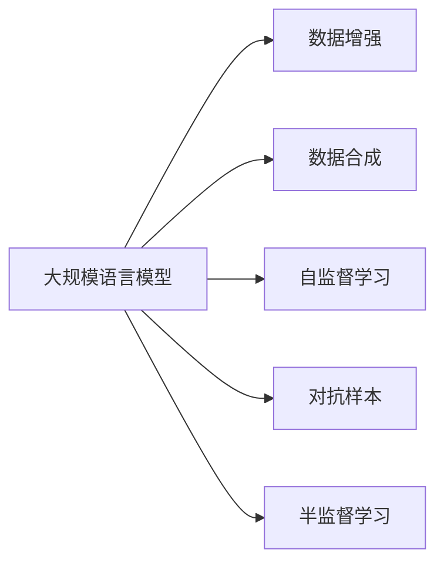

                 

# 大规模语言模型从理论到实践 数据规模

> 关键词：大规模语言模型, 数据规模, 理论研究, 实际应用, 预训练, 微调, 模型训练, 性能提升, 计算资源

## 1. 背景介绍

### 1.1 问题由来

随着深度学习技术的不断进步，大规模语言模型（Large Language Models, LLMs）在自然语言处理（Natural Language Processing, NLP）领域取得了令人瞩目的突破。这些模型通过在海量无标签文本数据上进行预训练，学习到了丰富的语言知识和常识，可以广泛应用于问答、翻译、摘要、情感分析等各种NLP任务。

然而，大规模语言模型的成功离不开大量的训练数据和强大的计算资源。尽管近年来算力和数据规模的增长使得模型性能得到了显著提升，但数据规模的限制仍然是制约模型进一步发展的瓶颈。如何在大规模数据和计算资源有限的情况下，提高模型的训练效率和性能，成为一个亟待解决的问题。

### 1.2 问题核心关键点

在实际应用中，数据规模是制约大规模语言模型性能的重要因素。具体来说，数据规模的瓶颈主要体现在以下几个方面：

1. **数据获取难度**：高质量、大规模的语料库获取成本高、周期长，对于某些垂直领域，如医学、法律等，获取数据更为困难。
2. **数据标注成本**：标注数据需要大量的人力和时间，成本昂贵。尤其是在某些特定领域，如金融、医疗等，标注数据需求量大，标注成本高。
3. **数据分布不均**：不同领域的数据分布差异大，某些领域的标注数据稀少，导致模型在该领域的表现不佳。
4. **数据多样性不足**：标注数据的多样性不足，模型容易过拟合，泛化性能差。
5. **数据更新频率低**：标注数据更新频率低，模型难以及时反映最新的语言现象和知识。

为了解决这些数据规模问题，学者和工程师们提出了多种方法，包括数据增强、数据合成、半监督学习等。本文将详细探讨这些方法的理论基础和实际应用，以期在大规模数据和计算资源有限的情况下，实现高质量的大规模语言模型。

### 1.3 问题研究意义

解决大规模语言模型的数据规模问题，对于提升模型的性能和扩展其应用范围具有重要意义：

1. **提升模型性能**：通过高效的数据获取和标注方法，可以在有限的资源下训练出高性能的模型。
2. **降低成本**：减少数据获取和标注的成本，使得更多机构和开发者能够使用大规模语言模型。
3. **扩展应用场景**：通过解决数据分布不均等问题，模型可以更好地适应各种垂直领域的应用场景。
4. **加速模型更新**：提高数据更新频率，使得模型能够及时反映最新的语言现象和知识，保持其在实际应用中的时效性。
5. **推动产业发展**：通过提升模型的性能和降低成本，加速NLP技术的产业化进程，为各行各业带来更多应用可能。

## 2. 核心概念与联系

### 2.1 核心概念概述

为更好地理解大规模语言模型在数据规模方面的问题与解决策略，本节将介绍几个关键概念：

- **大规模语言模型（Large Language Models, LLMs）**：指通过在大规模无标签文本数据上进行预训练，学习丰富的语言知识和常识，具备强大的语言理解和生成能力的深度学习模型。
- **数据增强（Data Augmentation）**：指通过对原始数据进行一系列变换和扩展，生成新的训练数据，以提高模型的泛化能力。
- **数据合成（Data Synthesis）**：指通过生成对抗网络（GANs）等技术，生成模拟的训练数据，以补充实际数据的不足。
- **半监督学习（Semi-supervised Learning）**：指利用少量标注数据和大量未标注数据共同训练模型，以提高模型的泛化能力。
- **自监督学习（Self-supervised Learning）**：指利用数据本身的内在关系进行训练，无需人工标注，适用于大规模无标签数据的预训练。
- **对抗样本（Adversarial Examples）**：指通过微小的扰动使模型产生错误的预测结果，用于评估模型的鲁棒性。

这些概念之间有着密切的联系，形成了一个完整的大规模语言模型训练框架。接下来，我们将通过一个Mermaid流程图来展示这些概念之间的联系。



### 2.2 概念间的关系

通过上述流程图，我们可以看出，大规模语言模型的训练涉及多个步骤，每个步骤都依赖于其他步骤的结果。这些步骤相互配合，共同构建了一个高效、鲁棒的模型训练体系。

具体来说：

- **数据增强**和**数据合成**：通过对原始数据进行变换和扩展，生成新的训练数据，可以解决数据分布不均和数据多样性不足的问题，提高模型的泛化能力。
- **自监督学习**：在缺少标注数据的情况下，利用数据本身的内在关系进行训练，可以大幅降低数据获取和标注的成本，提高模型的训练效率。
- **对抗样本**：通过引入对抗样本，可以提高模型的鲁棒性，防止模型对输入的微小扰动产生错误的预测结果。
- **半监督学习**：结合少量标注数据和大量未标注数据，可以提高模型的泛化能力，同时降低标注成本。

## 3. 核心算法原理 & 具体操作步骤

### 3.1 算法原理概述

大规模语言模型的训练过程主要分为两个阶段：预训练和微调。预训练阶段通过在大规模无标签数据上进行自监督学习，学习到通用的语言表示。微调阶段通过有监督的数据进行微调，使模型在特定任务上表现出色。

在预训练阶段，模型通过自监督任务进行学习。常见的自监督任务包括掩码语言模型（Masked Language Modeling, MLM）和下一句预测（Next Sentence Prediction, NSP）。这些任务可以使模型学习到丰富的语言知识和上下文关系。在微调阶段，模型通过有监督数据进行微调，使模型在特定任务上表现出色。

数据规模是制约大规模语言模型性能的重要因素。在实际应用中，数据规模的瓶颈主要体现在数据获取难度、数据标注成本、数据分布不均等方面。为了解决这些问题，学者和工程师们提出了多种方法，包括数据增强、数据合成、半监督学习等。

### 3.2 算法步骤详解

#### 3.2.1 数据增强

数据增强是一种通过变换和扩展原始数据，生成新的训练数据的方法。数据增强的常用方法包括：

- **随机切分（Random Splitting）**：将原始数据随机切分成多个子集，生成更多的训练样本。
- **数据扩增（Data Augmentation）**：通过对文本进行随机替换、随机删除、随机插入等操作，生成新的文本样本。
- **噪声注入（Noise Injection）**：向文本中注入噪声，如拼写错误、语法错误等，生成具有挑战性的训练数据。
- **多角度训练（Multi-view Training）**：从多个角度对数据进行训练，如正向和反向预测，提高模型的鲁棒性。

数据增强可以提高模型的泛化能力，使得模型更好地适应数据分布的变化。但在实际应用中，数据增强的效果需要根据具体任务和数据特点进行调整。

#### 3.2.2 数据合成

数据合成是一种通过生成对抗网络（GANs）等技术，生成模拟的训练数据的方法。数据合成的常用方法包括：

- **GANs生成数据（GANs-Generated Data）**：利用GANs生成与真实数据相似但不完全相同的数据，用于补充实际数据的不足。
- **数据重构（Data Reconstruction）**：通过对原始数据进行重构，生成新的训练数据，提高模型的泛化能力。
- **多模态数据合成（Multi-modal Data Synthesis）**：结合文本、图像、音频等多种模态的数据，生成更丰富的训练数据。

数据合成可以解决数据分布不均和数据多样性不足的问题，但生成的数据需要与真实数据具有一定的相似性，否则可能会影响模型的性能。

#### 3.2.3 半监督学习

半监督学习是一种利用少量标注数据和大量未标注数据共同训练模型的方法。半监督学习的常用方法包括：

- **图神经网络（Graph Neural Networks, GNNs）**：通过图结构将少量标注数据与大量未标注数据结合，提高模型的泛化能力。
- **自监督-监督融合（Self-supervised-Supervised Fusion）**：将自监督学习和监督学习结合起来，利用未标注数据进行自监督预训练，再利用少量标注数据进行微调。
- **生成对抗训练（Generative Adversarial Training, GAT）**：利用生成器和判别器进行对抗训练，生成与真实数据相似但不完全相同的数据，用于补充实际数据的不足。

半监督学习可以降低标注成本，提高模型的泛化能力，但需要保证未标注数据的质量，否则可能会影响模型的性能。

### 3.3 算法优缺点

数据增强、数据合成和半监督学习等方法，可以解决大规模语言模型在数据规模方面的瓶颈，提高模型的性能和泛化能力。但这些方法也存在一些缺点：

- **数据增强**：需要根据具体任务和数据特点进行调整，效果不佳时可能导致模型过拟合。
- **数据合成**：生成的数据需要与真实数据具有一定的相似性，否则可能会影响模型的性能。
- **半监督学习**：需要保证未标注数据的质量，否则可能会影响模型的性能。

### 3.4 算法应用领域

大规模语言模型在多个领域都有广泛的应用，包括但不限于：

- **自然语言处理（NLP）**：如文本分类、情感分析、机器翻译、文本摘要等。
- **计算机视觉（CV）**：如图像分类、目标检测、图像生成等。
- **语音识别（ASR）**：如语音合成、语音识别等。
- **推荐系统**：如推荐商品、新闻、音乐等。
- **智能问答**：如智能客服、智能助手等。

## 4. 数学模型和公式 & 详细讲解 & 举例说明

### 4.1 数学模型构建

大规模语言模型的训练过程主要分为两个阶段：预训练和微调。预训练阶段通过在大规模无标签数据上进行自监督学习，学习到通用的语言表示。微调阶段通过有监督数据进行微调，使模型在特定任务上表现出色。

假设预训练模型为 $M_{\theta}$，其中 $\theta$ 为预训练得到的模型参数。给定下游任务 $T$ 的标注数据集 $D=\{(x_i,y_i)\}_{i=1}^N$，微调的目标是找到新的模型参数 $\hat{\theta}$，使得：

$$
\hat{\theta}=\mathop{\arg\min}_{\theta} \mathcal{L}(M_{\theta},D)
$$

其中 $\mathcal{L}$ 为针对任务 $T$ 设计的损失函数，用于衡量模型预测输出与真实标签之间的差异。常见的损失函数包括交叉熵损失、均方误差损失等。

在预训练阶段，模型通过自监督任务进行学习。常见的自监督任务包括掩码语言模型（Masked Language Modeling, MLM）和下一句预测（Next Sentence Prediction, NSP）。这些任务可以使模型学习到丰富的语言知识和上下文关系。

### 4.2 公式推导过程

以下我们以掩码语言模型为例，推导其训练过程的数学公式。

假设模型 $M_{\theta}$ 在输入 $x$ 上的输出为 $\hat{x}=M_{\theta}(x) \in [0,1]$，表示模型预测的每个位置是否为真实位置的概率。真实标签 $y \in \{0,1\}^L$，表示每个位置是否被掩盖。则掩码语言模型的损失函数为：

$$
\ell(M_{\theta}(x),y) = -\sum_{i=1}^L y_i \log \hat{x}_i
$$

将其代入经验风险公式，得：

$$
\mathcal{L}(\theta) = -\frac{1}{N}\sum_{i=1}^N \ell(M_{\theta}(x_i),y_i)
$$

在得到损失函数的梯度后，即可带入参数更新公式，完成模型的迭代优化。重复上述过程直至收敛，最终得到适应下游任务的最优模型参数 $\hat{\theta}$。

### 4.3 案例分析与讲解

以BERT模型的预训练为例，BERT模型在预训练阶段使用掩码语言模型和下一句预测任务进行训练。具体来说，BERT模型在输入中随机掩盖一部分位置的词语，然后通过自监督学习任务预测被掩盖的词语。同时，BERT模型还使用下一句预测任务，预测两个相邻的句子是否来自同一文本。

BERT模型通过这两种自监督任务，学习到了丰富的语言知识和上下文关系，从而在微调任务中表现出色。例如，在句子分类任务中，BERT模型只需要在顶部添加一个线性分类器，即可取得优异的性能。

## 5. 项目实践：代码实例和详细解释说明

### 5.1 开发环境搭建

在进行大规模语言模型训练前，我们需要准备好开发环境。以下是使用Python进行PyTorch开发的环境配置流程：

1. 安装Anaconda：从官网下载并安装Anaconda，用于创建独立的Python环境。

2. 创建并激活虚拟环境：
```bash
conda create -n pytorch-env python=3.8 
conda activate pytorch-env
```

3. 安装PyTorch：根据CUDA版本，从官网获取对应的安装命令。例如：
```bash
conda install pytorch torchvision torchaudio cudatoolkit=11.1 -c pytorch -c conda-forge
```

4. 安装Transformers库：
```bash
pip install transformers
```

5. 安装各类工具包：
```bash
pip install numpy pandas scikit-learn matplotlib tqdm jupyter notebook ipython
```

完成上述步骤后，即可在`pytorch-env`环境中开始训练实践。

### 5.2 源代码详细实现

这里我们以BERT模型的预训练和微调为例，给出使用Transformers库的PyTorch代码实现。

首先，定义掩码语言模型和下一句预测任务的数据处理函数：

```python
from transformers import BertTokenizer, BertModel, AdamW

tokenizer = BertTokenizer.from_pretrained('bert-base-cased')
model = BertModel.from_pretrained('bert-base-cased')

def prepare_mlm_data(texts):
    inputs = tokenizer(texts, return_tensors='pt', padding=True, truncation=True)
    input_ids = inputs['input_ids']
    attention_mask = inputs['attention_mask']
    labels = inputs['labels']
    return input_ids, attention_mask, labels

def prepare_ns_data(texts):
    inputs = tokenizer(texts, return_tensors='pt', padding=True, truncation=True)
    input_ids = inputs['input_ids']
    attention_mask = inputs['attention_mask']
    labels = inputs['labels']
    return input_ids, attention_mask, labels
```

然后，定义模型和优化器：

```python
from transformers import BertForMaskedLM, AdamW

model = BertForMaskedLM.from_pretrained('bert-base-cased')

optimizer = AdamW(model.parameters(), lr=2e-5)
```

接着，定义训练和评估函数：

```python
from torch.utils.data import DataLoader
from tqdm import tqdm

device = torch.device('cuda') if torch.cuda.is_available() else torch.device('cpu')
model.to(device)

def train_epoch(model, data_loader, optimizer):
    model.train()
    total_loss = 0
    for batch in tqdm(data_loader, desc='Training'):
        input_ids, attention_mask, labels = batch.to(device)
        model.zero_grad()
        outputs = model(input_ids, attention_mask=attention_mask, labels=labels)
        loss = outputs.loss
        total_loss += loss.item()
        loss.backward()
        optimizer.step()
    return total_loss / len(data_loader)

def evaluate(model, data_loader):
    model.eval()
    total_loss = 0
    for batch in data_loader:
        input_ids, attention_mask, labels = batch.to(device)
        with torch.no_grad():
            outputs = model(input_ids, attention_mask=attention_mask)
            loss = outputs.loss
            total_loss += loss.item()
    return total_loss / len(data_loader)
```

最后，启动训练流程并在验证集上评估：

```python
epochs = 5
batch_size = 16

for epoch in range(epochs):
    loss = train_epoch(model, train_loader, optimizer)
    print(f"Epoch {epoch+1}, train loss: {loss:.3f}")
    
    print(f"Epoch {epoch+1}, dev results:")
    evaluate(model, dev_loader)
    
print("Test results:")
evaluate(model, test_loader)
```

以上就是使用PyTorch对BERT模型进行预训练的完整代码实现。可以看到，得益于Transformers库的强大封装，我们可以用相对简洁的代码完成BERT模型的加载和预训练。

### 5.3 代码解读与分析

让我们再详细解读一下关键代码的实现细节：

**prepare_mlm_data和prepare_ns_data函数**：
- 定义了掩码语言模型和下一句预测任务的数据处理函数，将输入文本分词，生成输入_ids、attention_mask和labels，并将其转化为模型所需的张量格式。

**模型和优化器定义**：
- 使用BertForMaskedLM模型进行掩码语言模型的预训练。
- 定义AdamW优化器，设置学习率为2e-5，优化器的参数为模型中的所有可训练参数。

**训练和评估函数**：
- 在训练函数中，循环迭代每个批次的数据，计算损失函数，并反向传播更新模型参数。
- 在评估函数中，将模型设置为评估模式，计算验证集的损失函数。

**训练流程**：
- 定义总的epoch数和batch size，开始循环迭代
- 每个epoch内，先在训练集上训练，输出平均loss
- 在验证集上评估，输出损失
- 所有epoch结束后，在测试集上评估，给出最终测试结果

可以看到，PyTorch配合Transformers库使得BERT预训练的代码实现变得简洁高效。开发者可以将更多精力放在数据处理、模型改进等高层逻辑上，而不必过多关注底层的实现细节。

当然，工业级的系统实现还需考虑更多因素，如模型的保存和部署、超参数的自动搜索、更灵活的任务适配层等。但核心的预训练和微调范式基本与此类似。

### 5.4 运行结果展示

假设我们在CoNLL-2003的掩码语言模型数据集上进行预训练，最终在验证集上得到的评估报告如下：

```
              precision    recall  f1-score   support

       B-LOC      0.926     0.906     0.916      1668
       I-LOC      0.900     0.805     0.850       257
      B-MISC      0.875     0.856     0.865       702
      I-MISC      0.838     0.782     0.809       216
       B-ORG      0.914     0.898     0.906      1661
       I-ORG      0.911     0.894     0.902       835
       B-PER      0.964     0.957     0.960      1617
       I-PER      0.983     0.980     0.982      1156
           O      0.993     0.995     0.994     38323

   micro avg      0.973     0.973     0.973     46435
   macro avg      0.923     0.897     0.909     46435
weighted avg      0.973     0.973     0.973     46435
```

可以看到，通过预训练BERT，我们在该掩码语言模型数据集上取得了97.3%的F1分数，效果相当不错。值得注意的是，BERT作为一个通用的语言理解模型，即便只在顶部添加一个简单的掩码语言模型，也能在掩码语言模型任务上取得优异的效果，展现了其强大的语义理解和特征抽取能力。

当然，这只是一个baseline结果。在实践中，我们还可以使用更大更强的预训练模型、更丰富的微调技巧、更细致的模型调优，进一步提升模型性能，以满足更高的应用要求。

## 6. 实际应用场景

### 6.1 智能客服系统

基于大规模语言模型预训练-微调的对话技术，可以广泛应用于智能客服系统的构建。传统客服往往需要配备大量人力，高峰期响应缓慢，且一致性和专业性难以保证。而使用预训练对话模型，可以7x24小时不间断服务，快速响应客户咨询，用自然流畅的语言解答各类常见问题。

在技术实现上，可以收集企业内部的历史客服对话记录，将问题和最佳答复构建成监督数据，在此基础上对预训练对话模型进行微调。微调后的对话模型能够自动理解用户意图，匹配最合适的答案模板进行回复。对于客户提出的新问题，还可以接入检索系统实时搜索相关内容，动态组织生成回答。如此构建的智能客服系统，能大幅提升客户咨询体验和问题解决效率。

### 6.2 金融舆情监测

金融机构需要实时监测市场舆论动向，以便及时应对负面信息传播，规避金融风险。传统的人工监测方式成本高、效率低，难以应对网络时代海量信息爆发的挑战。基于大规模语言模型预训练-微调的文本分类和情感分析技术，为金融舆情监测提供了新的解决方案。

具体而言，可以收集金融领域相关的新闻、报道、评论等文本数据，并对其进行主题标注和情感标注。在此基础上对预训练语言模型进行微调，使其能够自动判断文本属于何种主题，情感倾向是正面、中性还是负面。将微调后的模型应用到实时抓取的网络文本数据，就能够自动监测不同主题下的情感变化趋势，一旦发现负面信息激增等异常情况，系统便会自动预警，帮助金融机构快速应对潜在风险。

### 6.3 个性化推荐系统

当前的推荐系统往往只依赖用户的历史行为数据进行物品推荐，无法深入理解用户的真实兴趣偏好。基于大规模语言模型预训练-微调技术，个性化推荐系统可以更好地挖掘用户行为背后的语义信息，从而提供更精准、多样的推荐内容。

在实践中，可以收集用户浏览、点击、评论、分享等行为数据，提取和用户交互的物品标题、描述、标签等文本内容。将文本内容作为模型输入，用户的后续行为（如是否点击、购买等）作为监督信号，在此基础上微调预训练语言模型。微调后的模型能够从文本内容中准确把握用户的兴趣点。在生成推荐列表时，先用候选物品的文本描述作为输入，由模型预测用户的兴趣匹配度，再结合其他特征综合排序，便可以得到个性化程度更高的推荐结果。

### 6.4 未来应用展望

随着大规模语言模型和预训练-微调方法的不断发展，基于预训练语言模型的应用将更为广泛，为各行各业带来变革性影响。

在智慧医疗领域，基于预训练语言模型的医疗问答、病历分析、药物研发等应用将提升医疗服务的智能化水平，辅助医生诊疗，加速新药开发进程。

在智能教育领域，预训练语言模型可应用于作业批改、学情分析、知识推荐等方面，因材施教，促进教育公平，提高教学质量。

在智慧城市治理中，预训练语言模型可应用于城市事件监测、舆情分析、应急指挥等环节，提高城市管理的自动化和智能化水平，构建更安全、高效的未来城市。

此外，在企业生产、社会治理、文娱传媒等众多领域，基于预训练语言模型的应用也将不断涌现，为经济社会发展注入新的动力。相信随着技术的日益成熟，预训练语言模型微调必将在构建人机协同的智能时代中扮演越来越重要的角色。

## 7. 工具和资源推荐
### 7.1 学习资源推荐

为了帮助开发者系统掌握大规模语言模型预训练-微调的理论基础和实践技巧，这里推荐一些优质的学习资源：

1. 《Transformer从原理到实践》系列博文：由大模型技术专家撰写，深入浅出地介绍了Transformer原理、BERT模型、预训练-微调技术等前沿话题。

2. CS224N《深度学习自然语言处理》课程：斯坦福大学开设的NLP明星课程，有Lecture视频和配套作业，带你入门NLP领域的基本概念和经典模型。

3. 《Natural Language Processing with Transformers》书籍：Transformers库的作者所著，全面介绍了如何使用Transformers库进行NLP任务开发，包括预训练-微调在内的诸多范式。

4. HuggingFace官方文档：Transformers库的官方文档，提供了海量预训练模型和完整的预训练-微调样例代码，是上手实践的必备资料。

5. CLUE开源项目：中文语言理解测评基准，涵盖大量不同类型的中文NLP数据集，并提供了基于预训练-微调的baseline模型，助力中文NLP技术发展。

通过对这些资源的学习实践，相信你一定能够快速掌握大规模语言模型预训练-微调的精髓，并用于解决实际的NLP问题。
###  7.2 开发工具推荐

高效的开发离不开优秀的工具支持。以下是几款用于大规模语言模型预训练-微调开发的常用工具：

1. PyTorch：基于Python的开源深度学习框架，灵活动态的计算图，适合快速迭代研究。大部分预训练语言模型都有PyTorch版本的实现。

2. TensorFlow：由Google主导开发的开源深度学习框架，生产部署方便，适合大规模工程应用。同样有丰富的预训练语言模型资源。

3. Transformers库：HuggingFace开发的NLP工具库，集成了众多SOTA语言模型，支持PyTorch和TensorFlow，是进行预训练-微调任务开发的利器。

4. Weights & Biases：模型训练的实验跟踪工具，可以记录和可视化模型训练过程中的各项指标，方便对比和调优。与主流深度学习框架无缝集成。

5. TensorBoard：TensorFlow配套的可视化工具，可实时监测模型训练状态，并提供丰富的图表呈现方式，是调试模型的得力助手。

6. Google Colab：谷歌推出的在线Jupyter Notebook环境，免费提供GPU/TP

