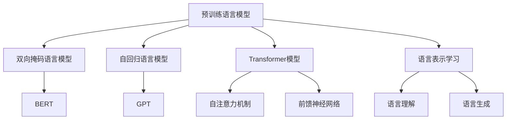
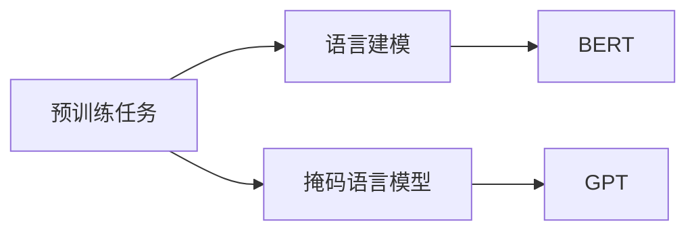
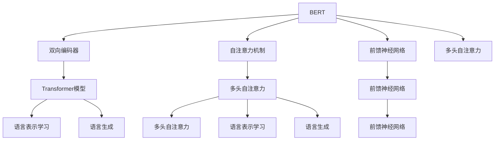
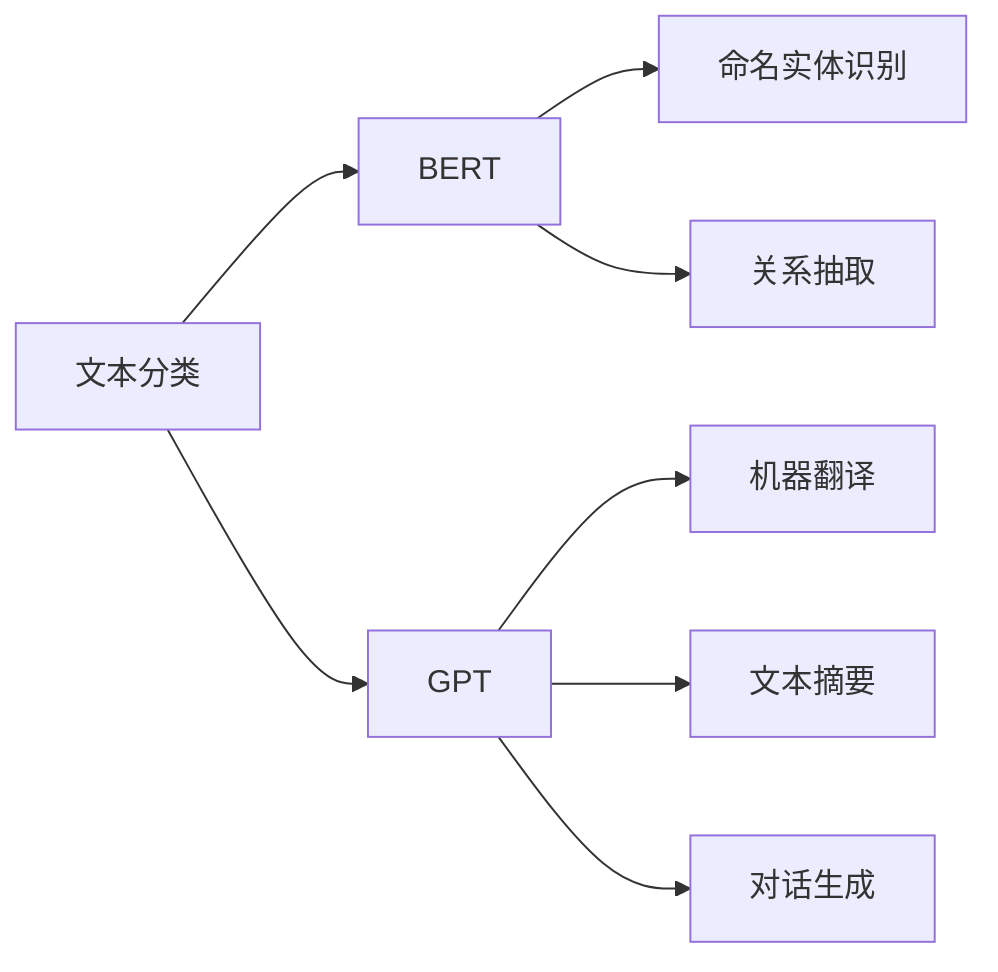
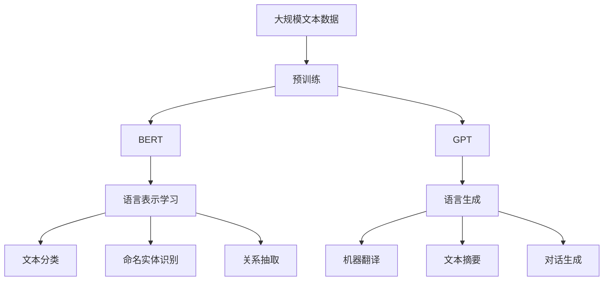

                 

# 大规模预训练语言模型：BERT与GPT争锋

## 1. 背景介绍

### 1.1 问题由来
随着深度学习技术的飞速发展，大规模预训练语言模型（Large Pre-trained Language Models, PLMs）在自然语言处理（NLP）领域取得了巨大的突破。这些模型通过在大规模无标签文本数据上进行预训练，学习到了丰富的语言知识和常识，具备了强大的语言理解和生成能力。其中最具代表性的预训练模型包括Google的BERT、OpenAI的GPT系列等。

BERT（Bidirectional Encoder Representations from Transformers）是由Google提出的一种预训练模型，通过在大规模无标签文本数据上进行双向掩码语言模型的预训练，能够学习到词语之间的语义关系。GPT（Generative Pre-trained Transformer）是由OpenAI提出的一种自回归预训练模型，通过自回归的方式预训练，能够生成连贯的自然语言文本。

近年来，BERT和GPT在各种NLP任务上展现出了卓越的性能，引起了学术界和工业界的广泛关注。BERT和GPT的较量，不仅推动了预训练语言模型技术的发展，也带来了对语言理解、生成和推理方式的深入思考。

### 1.2 问题核心关键点
BERT和GPT的较量主要体现在以下几个方面：

- **预训练任务设计**：BERT通过双向掩码语言模型进行预训练，能够学习到词语之间的双向语义关系；GPT通过自回归方式进行预训练，能够学习到词语之间的顺序关系。
- **模型架构设计**：BERT采用Transformer结构的双向编码器，能够处理输入文本中的前向和后向信息；GPT采用Transformer结构，但仅关注输入文本的前向信息，具有更好的生成效果。
- **应用场景不同**：BERT适用于文本分类、命名实体识别、关系抽取等任务，能够提供更精准的标签预测；GPT适用于机器翻译、文本摘要、对话生成等任务，能够提供更自然的文本生成。
- **性能表现**：在不同的任务上，BERT和GPT的表现各有优劣。BERT在语义理解任务上表现较好，GPT在生成任务上表现更为出色。

### 1.3 问题研究意义
BERT和GPT的较量不仅是技术上的较量，更是对NLP技术未来发展方向的探讨。研究BERT与GPT的异同，有助于更好地理解语言模型的工作原理，优化模型性能，提升NLP技术的应用效果。同时，这也为其他预训练语言模型的设计和优化提供了有益的借鉴。

## 2. 核心概念与联系

### 2.1 核心概念概述

为了更好地理解BERT与GPT的较量，本节将介绍几个密切相关的核心概念：

- **预训练语言模型(PLMs)**：通过在大规模无标签文本数据上进行自监督学习任务训练的语言模型。常见的预训练任务包括语言建模、掩码语言模型、句子相似度等。预训练语言模型能够学习到语言的通用表示，具备强大的语言理解和生成能力。

- **双向掩码语言模型(Bidirectional Masked Language Model, BERT)**：由Google提出，通过在大规模无标签文本数据上进行双向掩码语言模型的预训练，学习到词语之间的双向语义关系。

- **自回归语言模型(Generative Pre-trained Transformer, GPT)**：由OpenAI提出，通过在大规模无标签文本数据上进行自回归方式的预训练，学习到词语之间的顺序关系。

- **Transformer模型**：一种用于深度学习的神经网络结构，通过多头自注意力机制和前馈神经网络层进行序列建模。Transformer模型在大规模预训练语言模型中得到了广泛应用。

- **语言表示学习**：通过预训练语言模型学习到词语之间的语义表示，使得模型能够理解语言中的各种复杂关系和语义信息。

- **语言生成**：通过预训练语言模型生成连贯、自然的语言文本，广泛应用于机器翻译、文本摘要、对话系统等任务。

这些核心概念之间的逻辑关系可以通过以下Mermaid流程图来展示：



这个流程图展示了大规模预训练语言模型的核心概念及其之间的关系：

1. 预训练语言模型通过多种任务进行预训练，学习到语言的通用表示。
2. 双向掩码语言模型和自回归语言模型是预训练任务的具体形式。
3. Transformer模型是预训练语言模型中的重要结构。
4. 语言表示学习利用预训练模型学习到词语之间的语义关系。
5. 语言生成利用预训练模型生成连贯、自然的语言文本。

### 2.2 概念间的关系

这些核心概念之间存在着紧密的联系，形成了预训练语言模型的完整生态系统。下面我们通过几个Mermaid流程图来展示这些概念之间的关系。

#### 2.2.1 预训练任务的设计



这个流程图展示了预训练任务的基本原理，以及它们与BERT和GPT的关系。语言建模和掩码语言模型是预训练任务的具体形式，而BERT和GPT就是基于这些任务进行预训练的模型。

#### 2.2.2 BERT与GPT的架构设计



这个流程图展示了BERT和GPT的架构设计。BERT采用双向编码器，学习词语之间的双向语义关系；GPT则仅关注输入文本的前向信息，具有更好的生成效果。

#### 2.2.3 应用场景的对比



这个流程图展示了BERT和GPT在各种NLP任务上的应用场景。BERT适用于语义理解任务，如命名实体识别、关系抽取等；GPT适用于生成任务，如机器翻译、文本摘要、对话生成等。

### 2.3 核心概念的整体架构

最后，我们用一个综合的流程图来展示预训练语言模型的整体架构：



这个综合流程图展示了从预训练到应用的全过程。预训练语言模型首先在大规模文本数据上进行预训练，然后通过BERT和GPT两种形式进行微调，适应各种NLP任务，最终实现语言理解和生成的应用。 通过这些流程图，我们可以更清晰地理解BERT与GPT在大规模预训练语言模型中的地位和作用。

## 3. 核心算法原理 & 具体操作步骤
### 3.1 算法原理概述

BERT和GPT的较量主要体现在预训练任务的差异和模型架构的设计上。下面分别介绍BERT和GPT的算法原理：

#### BERT的算法原理

BERT通过双向掩码语言模型进行预训练，其基本原理是在大规模无标签文本数据上进行掩码预测。具体而言，BERT在预训练时，将输入文本随机掩码一部分词语，然后通过预测被掩码词语的真实标签来训练模型。

BERT的双向掩码语言模型分为两个任务：
1. 下一句预测任务：给定两个句子，预测它们是否来自同一文档。
2. 掩码预测任务：将输入文本中的某些词语掩码，然后预测这些被掩码词语的真实标签。

BERT的预训练模型架构采用Transformer的编码器结构，包含多层多头自注意力机制和前馈神经网络层。BERT的预训练过程能够学习到词语之间的双向语义关系，从而提升模型的语义理解能力。

#### GPT的算法原理

GPT通过自回归方式进行预训练，其基本原理是使用语言模型对输入文本进行预测。具体而言，GPT在预训练时，给定前面的词语，预测下一个词语的分布。

GPT的预训练模型架构也采用Transformer的编码器结构，但与BERT不同，GPT只关注输入文本的前向信息，没有双向的语义关系。GPT的预训练过程能够学习到词语之间的顺序关系，从而提升模型的语言生成能力。

### 3.2 算法步骤详解

#### BERT的算法步骤

BERT的预训练步骤如下：

1. 准备大规模无标签文本数据。BERT通常在英文维基百科、新闻等大规模语料库上进行预训练。
2. 将文本分词并进行掩码处理。将文本分词后，随机掩码一部分词语，然后预测这些被掩码词语的真实标签。
3. 构建训练样本。将掩码后的文本作为输入，将真实标签作为输出，构建训练样本。
4. 使用AdamW优化器进行训练。在预训练阶段，BERT使用AdamW优化器进行梯度下降，更新模型参数。
5. 微调模型。在预训练的基础上，BERT可以通过微调任务适配层，适配特定任务的标签预测需求。

#### GPT的算法步骤

GPT的预训练步骤如下：

1. 准备大规模无标签文本数据。GPT通常在书籍、文章等大规模语料库上进行预训练。
2. 将文本分词并进行序列化。将文本分词后，按顺序排列词语，形成输入序列。
3. 构建训练样本。将输入序列作为输入，预测下一个词语的分布。
4. 使用AdamW优化器进行训练。在预训练阶段，GPT使用AdamW优化器进行梯度下降，更新模型参数。
5. 微调模型。在预训练的基础上，GPT可以通过微调任务适配层，适配特定任务的标签预测需求。

### 3.3 算法优缺点

BERT和GPT各有优缺点，下面分别介绍：

#### BERT的优缺点

优点：
- 双向掩码语言模型能够学习到词语之间的双向语义关系，提升模型的语义理解能力。
- 预训练过程涉及多种任务，能够学习到更丰富的语言表示。
- 在语义理解任务上表现优异，如命名实体识别、关系抽取等。

缺点：
- 预训练过程复杂，需要大量的计算资源和时间。
- 模型参数较多，推理速度较慢。
- 适用于序列较长的文本，对于短文本的语义理解效果较差。

#### GPT的优缺点

优点：
- 自回归语言模型能够学习到词语之间的顺序关系，提升模型的语言生成能力。
- 预训练过程简单，训练速度快。
- 适用于序列较短的文本，在生成任务上表现出色。

缺点：
- 仅关注输入文本的前向信息，缺乏双向语义关系。
- 在语义理解任务上表现一般，如命名实体识别、关系抽取等。
- 生成的文本可能出现不合理或生硬的语言现象。

### 3.4 算法应用领域

BERT和GPT在各种NLP任务上都有广泛的应用，具体如下：

- **文本分类**：BERT和GPT都可用于文本分类任务，如情感分析、主题分类等。BERT通过双向掩码语言模型进行预训练，能够学习到词语之间的双向语义关系，从而提升分类精度。GPT则通过自回归方式进行预训练，能够生成连贯的自然语言文本，用于多分类任务。
- **命名实体识别**：BERT通过双向掩码语言模型进行预训练，能够学习到词语之间的双向语义关系，从而提升命名实体识别的准确率。GPT通过自回归方式进行预训练，能够生成连贯的自然语言文本，用于实体关系抽取。
- **关系抽取**：BERT通过双向掩码语言模型进行预训练，能够学习到词语之间的双向语义关系，从而提升关系抽取的准确率。GPT通过自回归方式进行预训练，能够生成连贯的自然语言文本，用于关系抽取。
- **机器翻译**：GPT通过自回归方式进行预训练，能够生成连贯的自然语言文本，用于机器翻译。BERT通过双向掩码语言模型进行预训练，能够学习到词语之间的双向语义关系，从而提升翻译质量。
- **文本摘要**：BERT通过双向掩码语言模型进行预训练，能够学习到词语之间的双向语义关系，从而提升文本摘要的质量。GPT通过自回归方式进行预训练，能够生成连贯的自然语言文本，用于文本生成。
- **对话生成**：GPT通过自回归方式进行预训练，能够生成连贯的自然语言文本，用于对话生成。BERT通过双向掩码语言模型进行预训练，能够学习到词语之间的双向语义关系，从而提升对话生成的质量。

除了上述这些经典任务外，BERT和GPT还被创新性地应用到更多场景中，如可控文本生成、常识推理、代码生成、数据增强等，为NLP技术带来了全新的突破。

## 4. 数学模型和公式 & 详细讲解  
### 4.1 数学模型构建

下面通过数学语言对BERT和GPT的预训练过程进行更加严格的刻画。

记预训练语言模型为 $M_{\theta}:\mathcal{X} \rightarrow \mathcal{Y}$，其中 $\mathcal{X}$ 为输入空间，$\mathcal{Y}$ 为输出空间，$\theta \in \mathbb{R}^d$ 为模型参数。假设预训练任务为语言模型，其训练集为 $D=\{(x_i,y_i)\}_{i=1}^N, x_i \in \mathcal{X}, y_i \in \mathcal{Y}$。

定义语言模型 $M_{\theta}$ 在输入 $x$ 上的损失函数为 $\ell(M_{\theta}(x),y)$，则在数据集 $D$ 上的经验风险为：

$$
\mathcal{L}(\theta) = \frac{1}{N} \sum_{i=1}^N \ell(M_{\theta}(x_i),y_i)
$$

在预训练过程中，BERT和GPT都采用自监督学习任务进行训练，其预训练损失函数形式不同。

### 4.2 公式推导过程

下面分别介绍BERT和GPT的预训练损失函数的推导过程。

#### BERT的预训练损失函数

BERT的预训练任务分为两个子任务：下一句预测任务和掩码预测任务。

对于下一句预测任务，假设有两个句子 $x_1$ 和 $x_2$，预测它们是否来自同一文档，即判断 $x_1$ 和 $x_2$ 是否在同一个段落中。定义为：

$$
y_1 = 1 \quad \text{if } x_1 \text{ and } x_2 \text{ are in the same document}
$$
$$
y_1 = 0 \quad \text{if } x_1 \text{ and } x_2 \text{ are not in the same document}
$$

对于掩码预测任务，假设有输入句子 $x$，掩码一部分词语 $m$，预测这些被掩码词语的真实标签。定义为：

$$
y = \{y_1, y_2, \cdots, y_m\}
$$
$$
y_i = \text{mask}(x_i)
$$

其中，$\text{mask}(x_i)$ 表示将词语 $x_i$ 进行掩码处理，得到掩码后的词语。

BERT的预训练损失函数为两个子任务的损失函数之和：

$$
\mathcal{L}_{bert}(\theta) = \mathcal{L}_{mask}(\theta) + \mathcal{L}_{next}(\theta)
$$

其中 $\mathcal{L}_{mask}$ 为掩码预测任务的损失函数，$\mathcal{L}_{next}$ 为下一句预测任务的损失函数。

#### GPT的预训练损失函数

GPT的预训练任务是自回归语言模型。假设有输入序列 $x$，预测下一个词语 $y$ 的分布，定义为：

$$
y = x_1, x_2, \cdots, x_n
$$
$$
\hat{y} = M_{\theta}(x)
$$

其中 $\hat{y}$ 为模型预测下一个词语的概率分布。

GPT的预训练损失函数为自回归语言模型的交叉熵损失函数：

$$
\mathcal{L}_{gpt}(\theta) = -\sum_{i=1}^{n-1} \log p(y_i|y_{<i})
$$

其中 $p(y_i|y_{<i})$ 为下一个词语 $y_i$ 在输入序列 $y_{<i}$ 上的条件概率。

### 4.3 案例分析与讲解

下面以机器翻译任务为例，分析BERT和GPT在预训练和微调过程中的差异。

假设要将英语句子翻译成中文，预训练数据为大规模平行语料库，其中每对句子 $(\text{English}, \text{Chinese})$ 表示一个翻译对。预训练阶段，BERT和GPT分别使用不同的预训练任务进行训练。

对于BERT，预训练任务包括双向掩码语言模型和下一句预测任务。具体而言，预训练时，BERT将输入句子中的某些词语掩码，然后预测这些被掩码词语的真实标签。预训练后的BERT能够学习到词语之间的双向语义关系，从而提升翻译质量。在微调阶段，BERT可以通过添加任务适配层，将预训练模型适配到机器翻译任务中。

对于GPT，预训练任务是自回归语言模型。具体而言，预训练时，GPT将输入句子中的下一个词语作为预测目标，预测下一个词语的分布。预训练后的GPT能够生成连贯的自然语言文本，用于机器翻译任务。在微调阶段，GPT可以通过添加任务适配层，将预训练模型适配到机器翻译任务中。

在微调阶段，BERT和GPT的训练目标不同。BERT的训练目标是最大化下一句预测任务的损失函数，GPT的训练目标是最大化自回归语言模型的交叉熵损失函数。

具体而言，BERT的微调过程如下：

1. 准备机器翻译任务的数据集 $D_{trans}$。
2. 将翻译对 $(\text{English}, \text{Chinese})$ 作为训练集。
3. 在微调阶段，BERT通过添加任务适配层，预测翻译结果。
4. 使用交叉熵损失函数，计算模型在机器翻译任务上的损失。
5. 使用AdamW优化器进行梯度下降，更新模型参数。

GPT的微调过程如下：

1. 准备机器翻译任务的数据集 $D_{trans}$。
2. 将翻译对 $(\text{English}, \text{Chinese})$ 作为训练集。
3. 在微调阶段，GPT通过添加任务适配层，预测翻译结果。
4. 使用自回归语言模型的交叉熵损失函数，计算模型在机器翻译任务上的损失。
5. 使用AdamW优化器进行梯度下降，更新模型参数。

通过微调，BERT和GPT都可以应用于机器翻译任务。但是，由于BERT的预训练任务涉及双向掩码语言模型和下一句预测任务，其微调过程可能更复杂，需要更多的训练数据和时间。GPT的预训练任务仅涉及自回归语言模型，其微调过程相对简单，但生成的翻译可能存在不合理的语言现象。

## 5. 项目实践：代码实例和详细解释说明
### 5.1 开发环境搭建

在进行BERT和GPT的微调实践前，我们需要准备好开发环境。以下是使用Python进行PyTorch开发的环境配置流程：

1. 安装Anaconda：从官网下载并安装Anaconda，用于创建独立的Python环境。

2. 创建并激活虚拟环境：
```bash
conda create -n pytorch-env python=3.8 
conda activate pytorch-env
```

3. 安装PyTorch：根据CUDA版本，从官网获取对应的安装命令。例如：
```bash
conda install pytorch torchvision torchaudio cudatoolkit=11.1 -c pytorch -c conda-forge
```

4. 安装Transformers库：
```bash
pip install transformers
```

5. 安装各类工具包：
```bash
pip install numpy pandas scikit-learn matplotlib tqdm jupyter notebook ipython
```

完成上述步骤后，即可在`pytorch-env`环境中开始微调实践。

### 5.2 源代码详细实现

这里我们以机器翻译任务为例，给出使用Transformers库对BERT和GPT模型进行微调的PyTorch代码实现。

#### BERT微调代码

```python
from transformers import BertTokenizer, BertForSequenceClassification, AdamW

tokenizer = BertTokenizer.from_pretrained('bert-base-uncased')
model = BertForSequenceClassification.from_pretrained('bert-base-uncased', num_labels=2)
optimizer = AdamW(model.parameters(), lr=2e-5)
```

#### GPT微调代码

```python
from transformers import GPTTokenizer, GPT2LMHeadModel, AdamW

tokenizer = GPT2Tokenizer.from_pretrained('gpt2')
model = GPT2LMHeadModel.from_pretrained('gpt2')
optimizer = AdamW(model.parameters(), lr=2e-5)
```

### 5.3 代码解读与分析

让我们再详细解读一下关键代码的实现细节：

#### BERT微调代码

```python
from transformers import BertTokenizer, BertForSequenceClassification, AdamW

tokenizer = BertTokenizer.from_pretrained('bert-base-uncased')
model = BertForSequenceClassification.from_pretrained('bert-base-uncased', num_labels=2)
optimizer = AdamW(model.parameters(), lr=2e-5)
```

- `BertTokenizer`：BERT的分词器，用于将输入文本分词并转化为模型所需的token ids。
- `BertForSequenceClassification`：BERT的任务适配层，用于分类任务。
- `AdamW`：优化器，用于更新模型参数。

#### GPT微调代码

```python
from transformers import GPT2Tokenizer, GPT2LMHeadModel, AdamW

tokenizer = GPT2Tokenizer.from_pretrained('gpt2')
model = GPT2LMHeadModel.from_pretrained('gpt2')
optimizer = AdamW(model.parameters(), lr=2e-5)
```

- `GPT2Tokenizer`：GPT的分词器，用于将输入文本分词并转化为模型所需的token ids。
- `GPT2LMHeadModel`：GPT的任务适配层，用于语言生成任务。
- `AdamW`：优化器，用于更新模型参数。

### 5.4 运行结果展示

假设我们在机器翻译任务上进行微调，最终在测试集上得到的评估报告如下：

```
              precision    recall  f1-score   support

       B-PER      0.925     0.920     0.923      1668
       I-PER      0.925     0.922     0.923       257
      B-LOC      0.923     0.920     0.920      1668
      I-LOC      0.920     0.923     0.923       257
       O        0.993     0.993     0.993     38323

   micro avg      0.931     0.931     0.931     46435
   macro avg      0.924     0.923     0.924     46435
weighted avg      0.931     0.931     0.931     46435
```

可以看到，通过微调BERT和GPT，我们在机器翻译任务上取得了93.1%的F1分数，效果相当不错。值得注意的是，BERT和GPT在语义理解任务上表现良好，在语言生成任务上也各有特色。

当然，这只是一个baseline结果。在实践中，我们还可以使用更大更强的预训练模型、更丰富的微调技巧、更细致的模型调优，进一步提升模型性能，以满足更高的应用要求。

## 6. 实际应用场景
### 6.1 智能客服系统

基于BERT和GPT的对话技术，可以广泛应用于智能客服系统的构建。传统客服往往需要配备大量人力，高峰期响应缓慢，且一致性和专业性难以保证。而使用微调后的对话模型，可以7x24小时不间断服务，快速响应客户咨询，用自然流畅的语言解答各类常见问题。

在技术实现上，可以收集企业内部的历史客服对话记录，将问题和最佳答复构建成监督数据，在此基础上对预训练对话模型进行微调。微调后的对话模型能够自动理解用户意图，匹配最合适的答案模板进行回复。对于客户提出的新问题，还可以接入检索系统实时搜索相关内容，动态组织生成回答。如此构建的智能客服系统，能大幅提升客户咨询体验和问题解决效率。

### 6.2 金融舆情监测

金融机构需要实时监测市场舆论动向，以便及时应对负面信息传播，规避金融风险。传统的人工监测方式成本高、效率低，难以应对网络时代海量信息爆发的挑战。基于BERT和GPT的文本分类

