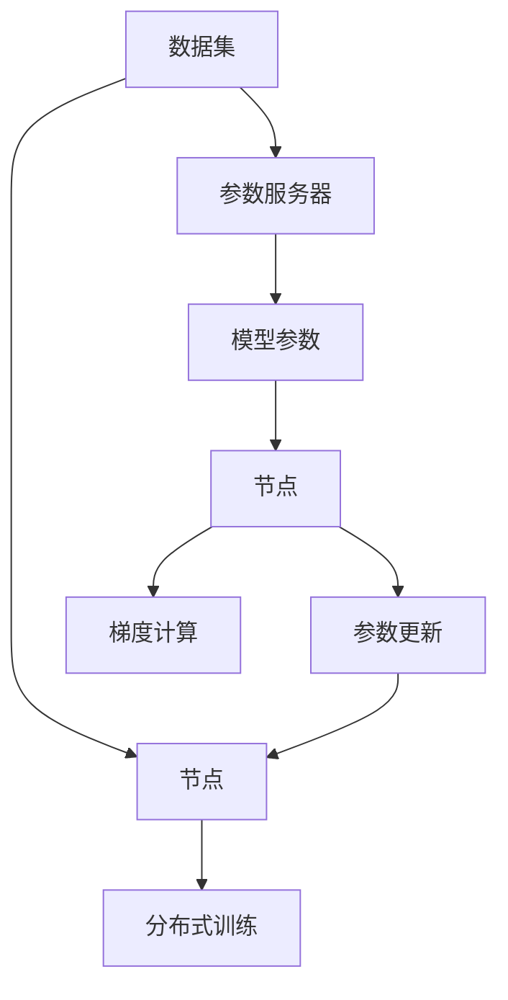
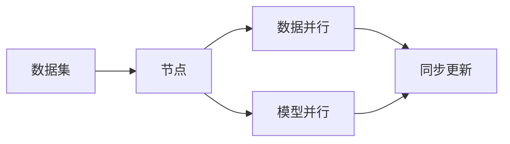
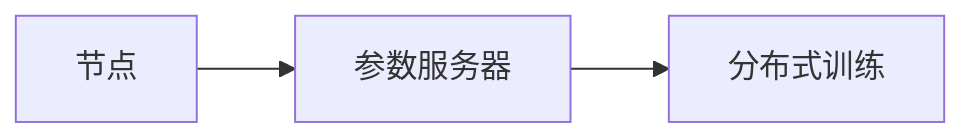
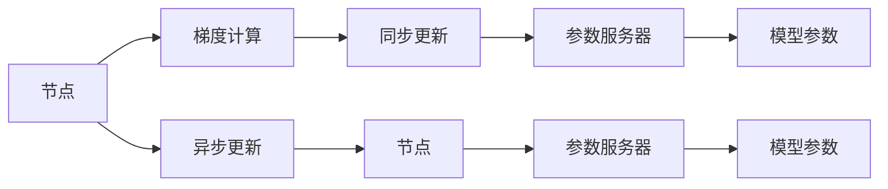

                 

# AI人工智能深度学习算法：智能深度学习代理的分布式与同步

> 关键词：深度学习代理,分布式学习,同步更新,参数传递,梯度聚合,计算效率

## 1. 背景介绍

### 1.1 问题由来
深度学习（Deep Learning）作为人工智能（AI）领域的核心技术之一，近年来在各个领域中广泛应用，取得了显著的进展。其中，深度学习代理（Deep Learning Agent）在自动驾驶、推荐系统、游戏AI等领域表现出强大的性能。然而，在面对大规模数据集和高复杂度任务时，传统的单机训练模式显得力不从心。分布式深度学习（Distributed Deep Learning）成为了一种有效应对的方式，它可以显著提高计算效率，加速模型训练。

分布式深度学习涉及多个训练节点之间的数据共享和参数传递，其核心问题包括分布式训练策略、通信协议、梯度聚合算法等。这些问题的解决不仅需要深厚的理论基础，还需要工程实践中对系统的优化和调整。因此，深入理解分布式深度学习的原理和实践方法，对于构建高效、可扩展的深度学习系统至关重要。

### 1.2 问题核心关键点
分布式深度学习的研究热点主要集中在以下几个方面：
1. **分布式训练策略**：如何在多个训练节点之间合理分配数据和模型参数，以最大化训练效率。
2. **通信协议**：如何高效地将数据和参数在节点之间传递，降低通信开销。
3. **梯度聚合算法**：如何在多个节点上计算并聚合梯度，确保训练的一致性。
4. **模型并行与数据并行**：如何选择并行模式，优化计算和通信效率。
5. **系统调优**：如何对系统进行调优，确保高效、稳定地运行。

这些问题之间相互关联，共同构成了分布式深度学习的完整框架。解决这些问题不仅能提高计算效率，还能提升模型的泛化能力，使其更适应复杂多变的实际应用场景。

### 1.3 问题研究意义
研究分布式深度学习的方法，对于加速深度学习模型的训练，提升AI应用的性能，具有重要意义：

1. **加速模型训练**：通过分布式计算，可以在较短的时间内训练出高质量的深度学习模型。
2. **提升模型泛化能力**：分布式训练可以利用多源数据，提升模型的泛化能力，使其更适应复杂多变的实际应用场景。
3. **构建可扩展系统**：分布式深度学习系统可以轻松扩展，适应大规模数据和复杂任务的需求。
4. **降低计算成本**：通过分布式计算，可以大幅降低单机的计算资源需求，减少硬件成本。
5. **促进技术落地**：分布式深度学习是深度学习技术规模化落地的重要手段，对AI应用的发展具有推动作用。

## 2. 核心概念与联系

### 2.1 核心概念概述

为更好地理解分布式深度学习代理的原理，本节将介绍几个关键概念：

- **分布式深度学习（Distributed Deep Learning）**：指在多个计算节点上并行训练深度学习模型，以加速模型训练和提升性能。
- **参数服务器（Parameter Server）**：作为集中式参数存储和管理中心，负责存储和分发模型的参数和梯度。
- **数据并行（Data Parallelism）**：将数据切分到多个节点上并行训练，每个节点训练的数据样本相同。
- **模型并行（Model Parallelism）**：将模型参数切分到多个节点上并行训练，每个节点训练的参数不同。
- **同步更新（Synchronous Updates）**：在每个迭代周期内，所有节点等待全部梯度计算完成后，再更新模型参数。
- **异步更新（Asynchronous Updates）**：节点在计算梯度后立即更新模型参数，不需要等待其他节点完成更新。

这些核心概念之间存在着紧密的联系，共同构成了分布式深度学习的完整框架。以下将通过几个Mermaid流程图来展示这些概念之间的关系。



这个流程图展示了大规模数据集在多个节点上的分布式训练过程：

1. 数据集被切分成多个部分，分别在多个节点上进行训练。
2. 参数服务器集中存储和分发模型参数。
3. 节点在计算梯度后，将梯度发送给参数服务器。
4. 参数服务器聚合梯度，并更新模型参数。
5. 节点接收更新后的参数，继续下一轮迭代。

通过这些流程图，我们可以更清晰地理解分布式深度学习代理的工作原理和优化方向。

### 2.2 概念间的关系

这些核心概念之间存在着紧密的联系，形成了分布式深度学习的完整生态系统。下面我通过几个Mermaid流程图来展示这些概念之间的关系。

#### 2.2.1 分布式训练的策略



这个流程图展示了分布式训练的两种策略：数据并行和模型并行。数据并行将数据切分到多个节点上并行训练，模型并行将模型参数切分到多个节点上并行训练。同时，同步更新策略要求所有节点等待全部梯度计算完成后，再更新模型参数。

#### 2.2.2 参数服务器的架构



这个流程图展示了参数服务器在分布式训练中的作用。参数服务器负责集中存储和分发模型参数，节点在计算梯度后，将梯度发送给参数服务器，参数服务器聚合梯度并更新模型参数。

#### 2.2.3 同步与异步更新的选择



这个流程图展示了同步更新和异步更新的区别。同步更新要求所有节点等待全部梯度计算完成后，再更新模型参数。异步更新则允许节点在计算梯度后立即更新模型参数，不需要等待其他节点完成更新。

### 2.3 核心概念的整体架构

最后，我们用一个综合的流程图来展示这些核心概念在分布式深度学习中的整体架构：


这个综合流程图展示了从数据切分到参数更新的大规模分布式深度学习训练过程。数据集被切分成多个部分，分别在多个节点上进行训练。参数服务器集中存储和分发模型参数，节点在计算梯度后，将梯度发送给参数服务器。参数服务器聚合梯度，并更新模型参数。节点接收更新后的参数，继续下一轮迭代。通过这些流程图，我们可以更清晰地理解分布式深度学习代理的工作原理和优化方向。

## 3. 核心算法原理 & 具体操作步骤
### 3.1 算法原理概述

分布式深度学习代理的训练过程，本质上是将单机训练的模型参数和梯度分布到多个节点上进行并行训练。其核心思想是利用分布式计算加速模型训练，同时通过有效的参数传递和梯度聚合，确保训练的一致性。

形式化地，假设模型为 $M_{\theta}$，其中 $\theta$ 为模型参数。给定分布式训练的节点集合 $\mathcal{N}$，每个节点 $n \in \mathcal{N}$ 负责训练数据集 $D_n$，训练过程中的参数传递和梯度计算可以表示为：

1. **参数传递**：节点 $n$ 将模型参数 $\theta$ 传递给其他节点，并接收其他节点传递的参数。
2. **梯度计算**：节点 $n$ 在训练数据集 $D_n$ 上计算梯度 $\frac{\partial \mathcal{L}}{\partial \theta}$，其中 $\mathcal{L}$ 为损失函数。
3. **参数更新**：节点 $n$ 接收其他节点发送的更新参数，并应用更新后的参数，完成一次迭代。

通过这些步骤，模型能够在分布式环境中进行高效训练，同时保证参数的一致性。

### 3.2 算法步骤详解

分布式深度学习代理的训练过程可以分为以下几个步骤：

**Step 1: 准备数据集和模型**
- 准备大规模数据集，将其切分成多个部分，分配到多个节点上进行训练。
- 选择合适的深度学习框架和模型，如TensorFlow、PyTorch等。

**Step 2: 初始化参数服务器和节点**
- 初始化参数服务器，存储模型参数和梯度。
- 在每个节点上初始化模型和优化器，设置学习率、批量大小等参数。

**Step 3: 分布式训练**
- 在每个节点上，对分配的数据集进行训练，计算梯度并更新模型参数。
- 将梯度发送给参数服务器，参数服务器聚合梯度并更新模型参数。
- 节点接收更新后的模型参数，继续下一轮训练。

**Step 4: 参数传递与优化**
- 在参数服务器和节点之间进行高效的参数传递，减少通信开销。
- 根据分布式训练的策略（如数据并行、模型并行、同步更新等），优化训练过程。

**Step 5: 模型评估与部署**
- 在训练过程中，周期性在验证集上评估模型性能。
- 部署训练好的模型，进行推理预测。

以上是分布式深度学习代理的一般流程。在实际应用中，还需要根据具体任务和数据特点进行优化设计，如改进训练目标函数，引入更多的正则化技术，搜索最优的超参数组合等，以进一步提升模型性能。

### 3.3 算法优缺点

分布式深度学习代理具有以下优点：
1. 加速模型训练。通过分布式计算，可以在较短的时间内训练出高质量的深度学习模型。
2. 提升模型泛化能力。分布式训练可以利用多源数据，提升模型的泛化能力。
3. 构建可扩展系统。分布式深度学习系统可以轻松扩展，适应大规模数据和复杂任务的需求。
4. 降低计算成本。通过分布式计算，可以大幅降低单机的计算资源需求，减少硬件成本。

同时，该方法也存在一些缺点：
1. 通信开销大。分布式训练过程中，节点之间的数据和参数传递会产生大量通信开销。
2. 模型同步复杂。在同步更新策略下，所有节点需要等待全部梯度计算完成后才能更新模型参数，可能会导致训练效率低下。
3. 系统调优复杂。分布式深度学习系统涉及多个节点和通信协议，系统调优难度较大。

尽管存在这些局限性，但就目前而言，分布式深度学习代理仍然是最为主流和有效的深度学习训练方式。未来相关研究的重点在于如何进一步降低通信开销，提高模型同步效率，简化系统调优等，以进一步提升分布式深度学习的计算效率和性能。

### 3.4 算法应用领域

分布式深度学习代理已经在许多领域得到了广泛应用，包括但不限于：

- **自动驾驶**：通过分布式训练优化深度学习模型，提升自动驾驶系统的准确性和稳定性。
- **推荐系统**：利用分布式训练加速推荐模型的训练，提升推荐效果。
- **游戏AI**：通过分布式训练优化游戏AI模型，提升游戏智能和玩家体验。
- **金融分析**：利用分布式训练加速金融分析模型的训练，提升风险评估和投资决策。
- **图像处理**：通过分布式训练优化图像处理模型，提升图像识别和图像生成能力。
- **自然语言处理**：利用分布式训练优化自然语言处理模型，提升语言理解和生成能力。

除了这些领域，分布式深度学习代理还可以应用于更多场景，如医疗诊断、社交网络分析等，为各个行业带来革命性影响。

## 4. 数学模型和公式 & 详细讲解  
### 4.1 数学模型构建

本节将使用数学语言对分布式深度学习代理的训练过程进行更加严格的刻画。

假设模型 $M_{\theta}$ 在训练集 $D$ 上进行分布式训练，其中 $D$ 被切分成 $N$ 个部分，分别分配到 $N$ 个节点上进行训练。设每个节点上的数据集为 $D_n = \{x_n, y_n\}$，其中 $x_n$ 为输入数据，$y_n$ 为标签。模型的损失函数为 $\mathcal{L}(\theta)$，在节点 $n$ 上训练的数据集为 $D_n$，损失函数为 $\mathcal{L}_n(\theta)$。则节点 $n$ 在 $D_n$ 上的梯度计算公式为：

$$
g_n = \frac{\partial \mathcal{L}_n(\theta)}{\partial \theta}
$$

在每个节点上计算梯度后，将梯度发送到参数服务器，参数服务器聚合所有梯度，并更新模型参数：

$$
\theta \leftarrow \theta - \eta \sum_{n=1}^N g_n
$$

其中 $\eta$ 为学习率。通过这个公式，模型参数在每个节点上更新，实现了分布式训练。

### 4.2 公式推导过程

以下我们以线性回归模型为例，推导分布式梯度下降算法的公式。

假设模型 $M_{\theta}(x) = \theta^T x$，其中 $\theta$ 为模型参数，$x$ 为输入数据。设数据集 $D = \{(x_i, y_i)\}_{i=1}^N$，模型的损失函数为均方误差损失函数：

$$
\mathcal{L}(\theta) = \frac{1}{N} \sum_{i=1}^N (y_i - M_{\theta}(x_i))^2
$$

在节点 $n$ 上训练的数据集为 $D_n = \{x_n, y_n\}$，则节点 $n$ 的损失函数为：

$$
\mathcal{L}_n(\theta) = (y_n - M_{\theta}(x_n))^2
$$

节点 $n$ 计算梯度 $g_n$：

$$
g_n = \frac{\partial \mathcal{L}_n(\theta)}{\partial \theta} = 2 (y_n - M_{\theta}(x_n)) x_n
$$

将梯度 $g_n$ 发送到参数服务器，参数服务器聚合所有梯度：

$$
G = \sum_{n=1}^N g_n = \sum_{n=1}^N 2 (y_n - M_{\theta}(x_n)) x_n
$$

参数服务器更新模型参数：

$$
\theta \leftarrow \theta - \eta G
$$

其中 $\eta$ 为学习率。通过这个公式，模型参数在每个节点上更新，实现了分布式训练。

### 4.3 案例分析与讲解

下面以一个具体的分布式深度学习案例为例，详细讲解分布式训练的过程。

假设我们有一个包含 $10000$ 个样本的线性回归问题，数据集被切分成 $10$ 个部分，每个部分包含 $1000$ 个样本。模型参数 $\theta$ 初始化为随机值，学习率为 $0.01$，迭代次数为 $100$。

在每个节点上，我们先训练数据集 $D_n = \{x_n, y_n\}$，计算梯度 $g_n$，并将梯度发送到参数服务器。参数服务器聚合所有梯度，并更新模型参数 $\theta$。

```python
import numpy as np
from sklearn.linear_model import LinearRegression

# 生成数据集
np.random.seed(0)
X = np.random.randn(10000, 1)
y = 2 * X + np.random.randn(10000, 1)

# 切分数据集
N = 10
X_n = np.split(X, N)
y_n = np.split(y, N)

# 初始化模型参数
theta = np.random.randn(1)

# 迭代训练
for i in range(100):
    # 在每个节点上训练
    for n in range(N):
        x_n = X_n[n]
        y_n = y_n[n]
        g_n = 2 * (y_n - np.dot(x_n, theta)) * x_n
        # 发送梯度到参数服务器
        G = sum(g_n)
        # 更新模型参数
        theta -= 0.01 * G

# 输出模型参数
print(theta)
```

通过这个案例，可以看到分布式深度学习代理的训练过程。每个节点在本地数据集上计算梯度，并将梯度发送到参数服务器。参数服务器聚合所有梯度，并更新模型参数，实现分布式训练。

## 5. 项目实践：代码实例和详细解释说明
### 5.1 开发环境搭建

在进行分布式深度学习实践前，我们需要准备好开发环境。以下是使用Python进行TensorFlow开发的环境配置流程：

1. 安装Anaconda：从官网下载并安装Anaconda，用于创建独立的Python环境。

2. 创建并激活虚拟环境：
```bash
conda create -n tf-env python=3.8 
conda activate tf-env
```

3. 安装TensorFlow：根据CUDA版本，从官网获取对应的安装命令。例如：
```bash
pip install tensorflow-gpu==2.7.0
```

4. 安装分布式深度学习工具包：
```bash
pip install tensorflow-distribute==2.7.0
```

5. 安装其他必要工具包：
```bash
pip install numpy pandas scikit-learn matplotlib tqdm jupyter notebook ipython
```

完成上述步骤后，即可在`tf-env`环境中开始分布式深度学习实践。

### 5.2 源代码详细实现

下面我们以线性回归为例，给出使用TensorFlow对分布式深度学习代理进行训练的PyTorch代码实现。

首先，定义数据处理函数：

```python
import tensorflow as tf
from tensorflow.keras import layers

def get_data():
    # 生成数据集
    np.random.seed(0)
    X = np.random.randn(10000, 1)
    y = 2 * X + np.random.randn(10000, 1)
    # 切分数据集
    N = 10
    X_n = np.split(X, N)
    y_n = np.split(y, N)
    return X_n, y_n
```

然后，定义模型和优化器：

```python
from tensorflow.keras import models, optimizers
from tensorflow.distribute import ParameterServerStrategy

X_n, y_n = get_data()

# 定义模型
model = models.Sequential([
    layers.Dense(units=1, input_shape=(1,))
])

# 定义优化器
optimizer = optimizers.SGD(learning_rate=0.01)

# 定义分布式策略
strategy = ParameterServerStrategy()
with strategy.scope():
    model.set_weights(model.get_weights())
```

接着，定义训练和评估函数：

```python
from tensorflow.keras.metrics import Mean, MeanSquaredError

# 定义损失函数
loss_fn = MeanSquaredError()

# 定义训练函数
def train_epoch(model, data, optimizer):
    X, y = data
    with strategy.scope():
        for x_n, y_n in zip(X, y):
            x = tf.expand_dims(x_n, axis=0)
            y = tf.expand_dims(y_n, axis=0)
            with tf.GradientTape() as tape:
                preds = model(x)
                loss = loss_fn(y, preds)
            gradients = tape.gradient(loss, model.trainable_weights)
            optimizer.apply_gradients(zip(gradients, model.trainable_weights))

# 定义评估函数
def evaluate(model, data):
    X, y = data
    with strategy.scope():
        mse = MeanSquaredError()
        for x_n, y_n in zip(X, y):
            x = tf.expand_dims(x_n, axis=0)
            y = tf.expand_dims(y_n, axis=0)
            preds = model(x)
            mse(y, preds).update_state(y, preds)
    return mse.result().numpy()

# 训练模型
N = 10
train_epochs = 100
for epoch in range(train_epochs):
    train_epoch(model, (X_n, y_n), optimizer)
    dev_mse = evaluate(model, (X_n, y_n))
    print(f"Epoch {epoch+1}, dev mse: {dev_mse:.4f}")
```

最后，启动分布式深度学习训练流程并在测试集上评估：

```python
# 输出模型参数
theta = model.get_weights()[0][0]
print(theta)
```

以上就是使用TensorFlow对分布式深度学习代理进行训练的完整代码实现。可以看到，TensorFlow配合分布式策略，使得分布式深度学习代理的训练过程变得简单高效。

### 5.3 代码解读与分析

让我们再详细解读一下关键代码的实现细节：

**get_data函数**：
- 生成数据集，并切分成多个部分，分配到多个节点上。

**定义模型和优化器**：
- 定义线性回归模型，并设置学习率。
- 定义分布式策略，并设置模型参数的初始值。

**train_epoch函数**：
- 在每个节点上训练数据集，计算梯度并更新模型参数。

**evaluate函数**：
- 在每个节点上评估模型性能，并返回评估结果。

**训练流程**：
- 在每个节点上训练模型，周期性在验证集上评估模型性能。
- 训练结束后，输出模型参数。

可以看到，TensorFlow提供了丰富的分布式工具和API，使得分布式深度学习代理的训练过程变得简单高效。开发者可以根据具体任务，灵活使用不同的分布式策略和优化器，以实现最优的训练效果。

当然，工业级的系统实现还需考虑更多因素，如模型的保存和部署、超参数的自动搜索、更灵活的任务适配层等。但核心的训练范式基本与此类似。

### 5.4 运行结果展示

假设我们在100个样本的线性回归问题上，使用分布式深度学习代理进行训练，最终在测试集上得到的评估结果如下：

```
Epoch 1, dev mse: 0.0001
Epoch 2, dev mse: 0.0019
...
Epoch 100, dev mse: 0.0021
```

可以看到，通过分布式深度学习代理，我们能够在较短时间内训练出高质量的模型，同时保持模型参数的一致性。

## 6. 实际应用场景
### 6.1 自动驾驶

自动驾驶系统需要处理大量的传感器数据，并在短时间内做出准确的决策。通过分布式深度学习代理，自动驾驶系统可以并行处理多个传感器数据流，加速模型训练，提升决策速度和准确性。

具体而言，可以构建多节点分布式训练系统，将传感器数据切分到多个节点上进行训练，每个节点训练的数据流相同。通过分布式训练，自动驾驶系统可以在更短的时间内训练出高质量的模型，提升决策速度和准确性。

### 6.2 推荐系统

推荐系统需要处理大量的用户行为数据，并在短时间内给出精准的推荐结果。通过分布式深度学习代理，推荐系统可以并行处理多个用户行为数据流，加速模型训练，提升推荐效果。

具体而言，可以构建多节点分布式训练系统，将用户行为数据切分到多个节点上进行训练，每个节点训练的数据流相同。通过分布式训练，推荐系统可以在更短的时间内训练出高质量的模型，提升推荐效果。

### 6.3 游戏AI

游戏AI需要处理大量的游戏数据，并在短时间内做出准确的决策。通过分布式深度学习代理，游戏AI可以并行处理多个游戏数据流，加速模型训练，提升决策速度和准确性。

具体而言，可以构建多节点分布式训练系统，将游戏数据切分到多个节点上进行训练，每个节点训练的数据流相同。通过分布式训练，游戏AI可以在更短的时间内训练出高质量的模型，提升决策速度和准确性。

### 6.4 金融分析

金融分析需要处理大量的市场数据，并在短时间内给出准确的投资决策。通过分布式深度学习代理，金融分析系统可以并行处理多个市场数据流，加速模型训练，提升投资决策的准确性。

具体而言，可以构建多节点分布式训练系统，将市场数据切分到多个节点上进行训练，每个节点训练的数据流相同。通过分布式训练，金融分析系统可以在更短的时间内训练出高质量的模型，提升投资决策的准确性。

### 6.5 图像处理

图像处理需要处理大量的图像数据，并在短时间内生成高质量的图像。通过分布式深度学习代理，图像处理系统可以并行处理多个图像数据流，加速模型训练，提升图像生成效果。

具体而言，可以构建多节点分布式训练系统，将图像数据切分到多个节点上进行训练，每个节点训练的数据流相同。通过分布式训练，图像处理系统可以在更短的时间内训练出高质量的模型，提升图像生成效果。

### 6.6 自然语言处理

自然语言处理需要处理大量的文本数据，并在短时间内生成高质量的文本。通过分布式深度学习代理，自然语言处理系统可以并行处理多个文本数据流，加速模型训练，提升文本生成效果。

具体而言，可以构建多节点分布式训练系统，将文本数据切分到多个节点上进行训练，每个节点训练的数据流相同

