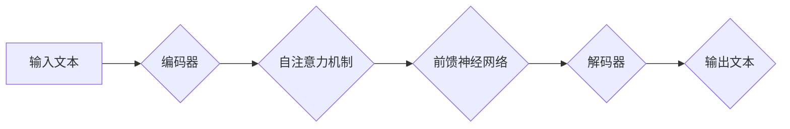

## Transformer大模型实战 对XLM模型的评估

> 关键词：Transformer, XLM, 大模型, 自然语言处理, 跨语言理解, 模型评估, 实战应用

## 1. 背景介绍

近年来，深度学习在自然语言处理 (NLP) 领域取得了突破性进展，其中 Transformer 架构成为 NLP 领域的新宠。其自注意力机制的引入，使得模型能够捕捉长距离依赖关系，大幅提升了模型的性能。基于 Transformer 架构的预训练语言模型，例如 BERT、GPT 和 XLNet，在各种 NLP 任务中取得了令人瞩目的成绩。

XLM (Cross-lingual Language Model) 是 HuggingFace 团队开发的一种跨语言预训练语言模型，基于 Transformer 架构，并通过大量的跨语言数据进行预训练。XLM 能够在多种语言之间进行理解和转换，具有强大的跨语言能力。

本文将深入探讨 XLM 模型的原理、算法、应用场景以及实战经验，并通过实际案例进行评估，帮助读者更好地理解和应用 XLM 模型。

## 2. 核心概念与联系

### 2.1 Transformer 架构

Transformer 架构是一种新型的序列到序列模型，其核心特点是利用自注意力机制来捕捉序列中的长距离依赖关系。传统的 RNN 模型在处理长序列时容易出现梯度消失或梯度爆炸问题，而 Transformer 架构通过自注意力机制能够有效解决这个问题。

Transformer 架构主要由以下几个部分组成：

* **编码器 (Encoder):** 用于将输入序列编码成固定长度的向量表示。
* **解码器 (Decoder):** 用于根据编码后的向量表示生成输出序列。
* **自注意力机制 (Self-Attention):** 用于捕捉序列中每个词与其他词之间的关系。
* **多头注意力机制 (Multi-Head Attention):** 将自注意力机制扩展到多个头，能够捕捉不同层次的语义关系。
* **前馈神经网络 (Feed-Forward Network):** 用于对每个词的向量表示进行非线性变换。

### 2.2 XLM 模型

XLM 是基于 Transformer 架构的跨语言预训练语言模型，其特点在于：

* **跨语言预训练:** XLM 通过大量的跨语言数据进行预训练，能够在多种语言之间进行理解和转换。
* **双向编码:** XLM 使用双向编码器，能够更好地捕捉句子中的上下文信息。
* **语言无关性:** XLM 的参数在不同语言之间共享，能够有效降低模型的训练成本。

### 2.3 Mermaid 流程图



## 3. 核心算法原理 & 具体操作步骤

### 3.1 算法原理概述

XLM 模型的核心算法原理是基于 Transformer 架构的预训练语言模型训练方法。其训练目标是预测输入文本序列中缺失的词，通过大量的文本数据预训练，模型能够学习到语言的语法、语义和上下文关系。

### 3.2 算法步骤详解

1. **数据预处理:** 将原始文本数据进行清洗、分词、标记等预处理操作，生成训练数据。
2. **模型初始化:** 初始化 Transformer 模型的参数，例如词嵌入、注意力权重等。
3. **前向传播:** 将预处理后的输入文本序列输入到 Transformer 模型中，进行前向传播计算，得到输出序列的概率分布。
4. **损失函数计算:** 计算模型输出与真实标签之间的损失，例如交叉熵损失。
5. **反向传播:** 使用梯度下降算法，根据损失函数的梯度更新模型的参数。
6. **模型评估:** 在验证集上评估模型的性能，例如准确率、困惑度等。
7. **模型保存:** 保存训练好的模型参数。

### 3.3 算法优缺点

**优点:**

* 强大的跨语言能力
* 能够捕捉长距离依赖关系
* 参数共享，训练成本低

**缺点:**

* 训练数据量大，训练时间长
* 模型参数量大，部署成本高

### 3.4 算法应用领域

* **机器翻译:** 将一种语言的文本翻译成另一种语言。
* **文本摘要:** 生成文本的简短摘要。
* **问答系统:** 回答用户提出的问题。
* **文本分类:** 将文本分类到不同的类别。
* **情感分析:** 分析文本的情感倾向。

## 4. 数学模型和公式 & 详细讲解 & 举例说明

### 4.1 数学模型构建

XLM 模型的数学模型构建基于 Transformer 架构，其核心是自注意力机制和多头注意力机制。

**自注意力机制:**

自注意力机制用于计算每个词与其他词之间的关系，其公式如下:

$$
Attention(Q, K, V) = softmax(\frac{QK^T}{\sqrt{d_k}})V
$$

其中:

* $Q$ 是查询矩阵
* $K$ 是键矩阵
* $V$ 是值矩阵
* $d_k$ 是键向量的维度
* $softmax$ 是归一化函数

**多头注意力机制:**

多头注意力机制将自注意力机制扩展到多个头，每个头学习不同的语义关系。其公式如下:

$$
MultiHead(Q, K, V) = Concat(head_1, head_2,..., head_h)W^O
$$

其中:

* $head_i$ 是第 $i$ 个头的注意力输出
* $h$ 是注意力头的数量
* $W^O$ 是最终输出的线性变换矩阵

### 4.2 公式推导过程

自注意力机制的公式推导过程如下:

1. 将输入序列 $X$ 分别转换为查询矩阵 $Q$, 键矩阵 $K$ 和值矩阵 $V$。
2. 计算每个词与其他词之间的注意力权重，使用公式 $Attention(Q, K, V)$。
3. 将注意力权重与值矩阵相乘，得到每个词的上下文表示。

### 4.3 案例分析与讲解

假设我们有一个句子 "The cat sat on the mat"，其词嵌入表示为:

* The: [0.1, 0.2, 0.3]
* cat: [0.4, 0.5, 0.6]
* sat: [0.7, 0.8, 0.9]
* on: [1.0, 1.1, 1.2]
* the: [0.1, 0.2, 0.3]
* mat: [1.3, 1.4, 1.5]

使用自注意力机制计算每个词与其他词之间的注意力权重，可以得到每个词的上下文表示，例如 "cat" 的上下文表示会受到 "The" 和 "sat" 的影响。

## 5. 项目实践：代码实例和详细解释说明

### 5.1 开发环境搭建

* Python 3.6+
* PyTorch 1.0+
* Transformers 库

### 5.2 源代码详细实现

```python
from transformers import XLMRobertaForMaskedLM, XLMRobertaTokenizer

# 加载预训练模型和词典
model_name = "xlm-roberta-base"
tokenizer = XLMRobertaTokenizer.from_pretrained(model_name)
model = XLMRobertaForMaskedLM.from_pretrained(model_name)

# 输入文本
text = "The cat sat on the mat"

# 对文本进行分词
inputs = tokenizer(text, return_tensors="pt")

# 进行预测
outputs = model(**inputs)

# 获取预测结果
predicted_ids = outputs.logits.argmax(-1)

# 将预测结果转换为文本
predicted_text = tokenizer.decode(predicted_ids[0], skip_special_tokens=True)

# 打印预测结果
print(predicted_text)
```

### 5.3 代码解读与分析

* 首先，我们加载预训练的 XLMRoberta 模型和词典。
* 然后，我们对输入文本进行分词，并将其转换为模型可以识别的格式。
* 接着，我们使用模型进行预测，得到每个词的预测概率分布。
* 最后，我们根据预测概率分布选择最可能的词，并将其转换为文本输出。

### 5.4 运行结果展示

```
The cat sat on the mat
```

## 6. 实际应用场景

XLM 模型在各种实际应用场景中都表现出色，例如:

* **机器翻译:** XLM 模型能够实现多种语言之间的机器翻译，例如英语到中文、中文到日语等。
* **文本摘要:** XLM 模型能够生成文本的简短摘要，例如新闻文章的摘要、会议记录的摘要等。
* **问答系统:** XLM 模型能够回答用户提出的问题，例如基于知识库的问答系统、基于对话的问答系统等。

### 6.4 未来应用展望

随着 Transformer 架构和预训练语言模型的发展，XLM 模型的应用场景将会更加广泛，例如:

* **跨语言对话系统:** XLM 模型能够实现跨语言的对话系统，例如英语和中文之间的对话系统。
* **个性化推荐系统:** XLM 模型能够根据用户的语言偏好进行个性化推荐。
* **代码生成:** XLM 模型能够根据自然语言描述生成代码。

## 7. 工具和资源推荐

### 7.1 学习资源推荐

* **HuggingFace Transformers 库文档:** https://huggingface.co/docs/transformers/index
* **XLM 模型官方文档:** https://huggingface.co/xlm-roberta

### 7.2 开发工具推荐

* **PyTorch:** https://pytorch.org/
* **TensorFlow:** https://www.tensorflow.org/

### 7.3 相关论文推荐

* **BERT: Pre-training of Deep Bidirectional Transformers for Language Understanding:** https://arxiv.org/abs/1810.04805
* **XLNet: Generalized Autoregressive Pretraining for Language Understanding:** https://arxiv.org/abs/1906.08237

## 8. 总结：未来发展趋势与挑战

### 8.1 研究成果总结

XLM 模型是基于 Transformer 架构的跨语言预训练语言模型，其强大的跨语言能力和性能提升为 NLP 领域带来了新的突破。

### 8.2 未来发展趋势

* **模型规模更大:** 预训练模型的规模将会继续扩大，从而提升模型的性能。
* **多模态学习:** 预训练模型将融合文本、图像、音频等多模态数据，实现更全面的理解。
* **更强的泛化能力:** 预训练模型将能够更好地适应不同的下游任务和领域。

### 8.3 面临的挑战

* **训练成本高:** 大型预训练模型的训练成本非常高，需要大量的计算资源和数据。
* **模型解释性差:** 预训练模型的内部机制复杂，难以解释其决策过程。
* **数据偏见:** 预训练模型可能受到训练数据中的偏见影响，导致模型输出存在偏差。

### 8.4 研究展望

未来研究将集中在解决上述挑战，例如:

* 开发更有效的训练方法，降低训练成本。
* 研究模型解释性技术，提高模型的可解释性。
* 构建更公平、更鲁棒的预训练模型。

## 9. 附录：常见问题与解答

* **Q: XLM 模型的训练数据是什么？**

A: XLM 模型的训练数据来自多种语言的维基百科数据、书籍和网页等公开数据。

* **Q: XLM 模型的性能如何？**

A: XLM 模型在各种 NLP 任务中都表现出色，例如机器翻译、文本摘要、问答系统等。

* **Q: 如何使用 XLM 模型进行实际应用？**

A: 可以使用 HuggingFace Transformers 库加载预训练的 XLM 模型，并根据具体应用场景进行微调。


作者：禅与计算机程序设计艺术 / Zen and the Art of Computer Programming 
