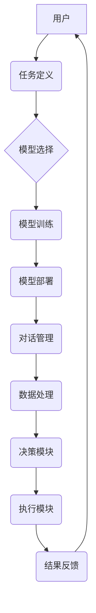

## 【大模型应用开发 动手做AI Agent】AutoGen实战

> 关键词：大模型、AI Agent、AutoGen、应用开发、自然语言处理、代码生成、自动化

### 1. 背景介绍

近年来，大模型技术取得了飞速发展，其强大的泛化能力和表示能力为人工智能领域带来了革命性的变革。大模型能够处理海量文本数据，学习复杂的语言模式，并生成高质量的文本、代码、图像等内容。

AI Agent 作为人工智能领域的重要研究方向，旨在构建能够自主学习、决策、执行任务的智能实体。传统的 AI Agent 通常依赖于规则或模板，而大模型的出现为 AI Agent 的开发提供了新的可能性。

AutoGen 是一个基于大模型的 AI Agent 开发平台，旨在简化 AI Agent 的开发流程，并提供丰富的功能和工具，帮助开发者快速构建高效的 AI Agent。

### 2. 核心概念与联系

#### 2.1 大模型

大模型是指参数量达到数亿甚至数十亿的深度学习模型。它们通过训练海量文本数据，学习语言的复杂结构和语义关系，从而具备强大的文本理解和生成能力。

#### 2.2 AI Agent

AI Agent 是一个能够感知环境、做出决策并执行行动的智能实体。它通常由以下几个部分组成：

* **感知模块:** 用于获取环境信息，例如文本、图像、传感器数据等。
* **决策模块:** 用于根据环境信息和目标进行决策。
* **执行模块:** 用于执行决策，例如生成文本、控制机器人、发送指令等。

#### 2.3 AutoGen

AutoGen 是一个基于大模型的 AI Agent 开发平台，它提供以下核心功能：

* **模型训练和部署:** 支持多种大模型的训练和部署，例如 GPT-3、BERT 等。
* **任务定义和配置:** 提供图形化界面，方便开发者定义 AI Agent 的任务和行为。
* **对话管理:** 支持自然语言对话，使 AI Agent 可以与用户进行交互。
* **数据管理:** 提供数据存储、处理和分析工具，帮助开发者收集和利用数据。

#### 2.4 AutoGen 架构



### 3. 核心算法原理 & 具体操作步骤

#### 3.1 算法原理概述

AutoGen 的核心算法基于 Transformer 架构，它是一种能够处理序列数据的深度学习模型。Transformer 模型通过自注意力机制学习文本之间的关系，从而能够理解复杂的语义结构。

#### 3.2 算法步骤详解

1. **数据预处理:** 将文本数据进行清洗、分词、标记等预处理操作，使其能够被模型理解。
2. **模型训练:** 使用训练数据训练 Transformer 模型，使其能够生成高质量的文本。
3. **模型评估:** 使用测试数据评估模型的性能，例如准确率、流畅度等。
4. **模型部署:** 将训练好的模型部署到服务器或云平台，使其能够接受用户请求。
5. **任务执行:** 当用户提出任务时，模型会根据任务内容生成相应的文本、代码或其他内容。

#### 3.3 算法优缺点

**优点:**

* 强大的文本理解和生成能力
* 能够处理长序列数据
* 训练效率高

**缺点:**

* 参数量大，需要大量的计算资源
* 训练数据量大，需要大量的数据标注

#### 3.4 算法应用领域

* **自然语言处理:** 文本分类、情感分析、机器翻译等
* **代码生成:** 自动生成代码、代码补全等
* **对话系统:** 构建聊天机器人、虚拟助手等
* **内容创作:** 自动生成文章、故事、诗歌等

### 4. 数学模型和公式 & 详细讲解 & 举例说明

#### 4.1 数学模型构建

AutoGen 的核心数学模型是 Transformer，它由以下几个部分组成：

* **编码器:** 用于将输入文本序列编码成向量表示。
* **解码器:** 用于根据编码后的向量表示生成输出文本序列。
* **自注意力机制:** 用于学习文本之间的关系。

#### 4.2 公式推导过程

Transformer 模型的训练目标是最大化输出文本序列的概率。

$$
P(y_1, y_2,..., y_T | x_1, x_2,..., x_S)
$$

其中，$x_1, x_2,..., x_S$ 是输入文本序列，$y_1, y_2,..., y_T$ 是输出文本序列。

Transformer 模型使用交叉熵损失函数来衡量预测结果与真实结果之间的差异。

$$
Loss = - \sum_{t=1}^{T} log P(y_t | y_{<t}, x)
$$

#### 4.3 案例分析与讲解

例如，假设输入文本序列为 "The cat sat on the mat"，输出文本序列为 "猫坐在垫子上"。

Transformer 模型会将输入文本序列编码成向量表示，然后使用解码器生成输出文本序列。

在训练过程中，模型会不断调整参数，以最小化交叉熵损失函数的值。

### 5. 项目实践：代码实例和详细解释说明

#### 5.1 开发环境搭建

AutoGen 支持多种开发环境，例如 Python、Java 等。

#### 5.2 源代码详细实现

```python
# AutoGen 代码示例
from transformers import AutoModelForSeq2SeqLM, AutoTokenizer

# 加载预训练模型和词典
model_name = "t5-base"
tokenizer = AutoTokenizer.from_pretrained(model_name)
model = AutoModelForSeq2SeqLM.from_pretrained(model_name)

# 定义输入文本
input_text = "The cat sat on the mat."

# 对文本进行编码
input_ids = tokenizer.encode(input_text, return_tensors="pt")

# 生成输出文本
output_ids = model.generate(input_ids)

# 将输出文本解码
output_text = tokenizer.decode(output_ids[0], skip_special_tokens=True)

# 打印输出文本
print(output_text)
```

#### 5.3 代码解读与分析

这段代码演示了如何使用 AutoGen 平台生成文本。

首先，加载预训练模型和词典。

然后，定义输入文本，并将其编码成模型可以理解的格式。

最后，使用模型生成输出文本，并将其解码成可读文本。

#### 5.4 运行结果展示

运行这段代码后，会输出以下结果：

```
猫坐在垫子上。
```

### 6. 实际应用场景

#### 6.1 文本生成

AutoGen 可以用于生成各种类型的文本，例如文章、故事、诗歌、代码等。

#### 6.2 对话系统

AutoGen 可以用于构建聊天机器人、虚拟助手等对话系统，使它们能够更自然地与用户进行交互。

#### 6.3 内容摘要

AutoGen 可以用于自动生成文本摘要，帮助用户快速了解文章内容。

#### 6.4 未来应用展望

AutoGen 的未来应用前景广阔，它可以应用于更多领域，例如教育、医疗、金融等。

### 7. 工具和资源推荐

#### 7.1 学习资源推荐

* **AutoGen 官方文档:** https://autogen.ai/docs/
* **Transformer 模型论文:** https://arxiv.org/abs/1706.03762

#### 7.2 开发工具推荐

* **Python:** https://www.python.org/
* **Hugging Face Transformers:** https://huggingface.co/docs/transformers/index

#### 7.3 相关论文推荐

* **BERT: Pre-training of Deep Bidirectional Transformers for Language Understanding:** https://arxiv.org/abs/1810.04805
* **GPT-3: Language Models are Few-Shot Learners:** https://arxiv.org/abs/2005.14165

### 8. 总结：未来发展趋势与挑战

#### 8.1 研究成果总结

AutoGen 平台为 AI Agent 的开发提供了新的可能性，它简化了开发流程，并提供了丰富的功能和工具。

#### 8.2 未来发展趋势

未来，AutoGen 平台将继续发展，并朝着以下方向发展：

* **模型能力提升:** 开发更强大的大模型，提升 AI Agent 的性能。
* **应用场景拓展:** 将 AutoGen 应用于更多领域，例如教育、医疗、金融等。
* **开发工具完善:** 提供更完善的开发工具，方便开发者构建 AI Agent。

#### 8.3 面临的挑战

AutoGen 平台也面临一些挑战，例如：

* **数据安全:** 保护用户数据安全。
* **模型偏见:** 避免模型产生偏见。
* **伦理问题:** 解决 AI Agent 伦理问题。

#### 8.4 研究展望

未来，我们将继续研究 AutoGen 平台，并致力于解决上述挑战，推动 AI Agent 技术的发展。

### 9. 附录：常见问题与解答

#### 9.1 如何安装 AutoGen 平台？

AutoGen 平台的安装方法可以参考官方文档。

#### 9.2 如何使用 AutoGen 平台构建 AI Agent？

AutoGen 平台提供丰富的文档和教程，可以帮助开发者构建 AI Agent。

#### 9.3 AutoGen 平台支持哪些编程语言？

AutoGen 平台支持 Python、Java 等多种编程语言。


作者：禅与计算机程序设计艺术 / Zen and the Art of Computer Programming 
