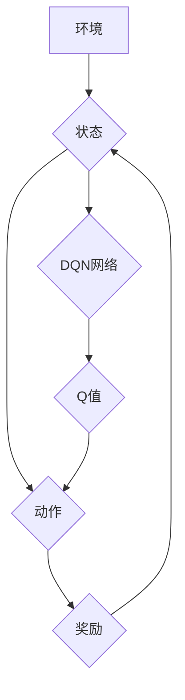

## 一切皆是映射：DQN在复杂环境下的应对策略与改进

> 关键词：深度强化学习，DQN，复杂环境，策略改进，目标函数，经验回放，探索与利用

## 1. 背景介绍

深度强化学习 (Deep Reinforcement Learning, DRL) 近年来取得了令人瞩目的进展，在游戏、机器人控制、自动驾驶等领域展现出强大的应用潜力。其中，深度Q网络 (Deep Q-Network, DQN) 作为DRL领域的重要里程碑，成功将深度神经网络与Q学习算法相结合，为解决复杂环境下的强化学习问题提供了新的思路。

然而，DQN在面对复杂环境时仍然面临着一些挑战：

* **样本效率低:** DQN需要大量的样本数据才能有效学习，而复杂环境往往具有高维状态空间和稀疏奖励信号，导致训练过程缓慢且需要大量计算资源。
* **过拟合问题:** DQN模型容易过拟合训练数据，导致在未知环境下表现不佳。
* **探索与利用的困境:** DQN在学习过程中需要平衡探索新策略和利用已知策略，找到最佳的探索策略对于提高学习效率至关重要。

为了解决这些问题，研究者们提出了许多改进策略，例如经验回放、目标网络、优先经验回放等。本文将深入探讨DQN在复杂环境下的应对策略与改进方法，并通过代码实例和实际应用场景，帮助读者更好地理解DQN的原理和应用。

## 2. 核心概念与联系

DQN的核心思想是利用深度神经网络来逼近Q函数，即估计在给定状态下采取特定动作的期望回报。

**2.1 核心概念原理**

* **强化学习:** 强化学习是一种机器学习范式，其中智能体通过与环境交互，学习最优策略以最大化累积奖励。
* **Q函数:** Q函数是强化学习的核心概念，它表示在给定状态下采取特定动作的期望回报。
* **深度神经网络:** 深度神经网络是一种强大的机器学习模型，能够学习复杂函数关系，并用于逼近Q函数。

**2.2 架构图**



**2.3 核心联系**

DQN将深度神经网络与Q学习算法相结合，通过训练神经网络来逼近Q函数，从而学习最优策略。

## 3. 核心算法原理 & 具体操作步骤

**3.1 算法原理概述**

DQN算法的核心思想是利用深度神经网络来逼近Q函数，并通过Q学习算法的原理进行训练。

**3.2 算法步骤详解**

1. **初始化:** 初始化DQN网络参数，并设置学习率、折扣因子等超参数。
2. **环境交互:** 智能体与环境交互，获取当前状态、采取动作并获得奖励。
3. **经验存储:** 将状态、动作、奖励、下一个状态等信息存储到经验回放缓冲池中。
4. **样本采样:** 从经验回放缓冲池中随机采样多个经验样本。
5. **Q值估计:** 将经验样本中的状态输入DQN网络，获取对应动作的Q值估计。
6. **目标Q值计算:** 计算目标Q值，即最大化下一个状态的Q值乘以折扣因子加上当前奖励。
7. **损失函数计算:** 计算DQN网络预测Q值与目标Q值之间的损失函数。
8. **网络更新:** 使用梯度下降算法更新DQN网络参数，以最小化损失函数。
9. **重复步骤2-8:** 重复以上步骤，直到网络训练完成。

**3.3 算法优缺点**

**优点:**

* **样本效率:** 经验回放机制可以提高样本利用率，降低训练所需样本量。
* **稳定性:** 目标网络机制可以稳定训练过程，避免震荡。
* **泛化能力:** 深度神经网络可以学习复杂函数关系，提高DQN在未知环境下的泛化能力。

**缺点:**

* **训练时间:** DQN训练过程仍然需要较长时间，尤其是在复杂环境下。
* **参数调优:** DQN算法的超参数需要仔细调优，才能获得最佳性能。
* **探索与利用:** DQN在探索与利用之间需要找到平衡点，否则可能会陷入局部最优。

**3.4 算法应用领域**

DQN在以下领域具有广泛的应用前景:

* **游戏:** DQN已经成功应用于许多游戏，例如Atari游戏、Go游戏等。
* **机器人控制:** DQN可以用于训练机器人控制策略，例如导航、抓取等任务。
* **自动驾驶:** DQN可以用于训练自动驾驶汽车的决策策略。
* **医疗保健:** DQN可以用于辅助医生诊断疾病、制定治疗方案等。

## 4. 数学模型和公式 & 详细讲解 & 举例说明

**4.1 数学模型构建**

DQN算法的核心是Q函数，它表示在给定状态s和动作a的期望回报：

$$Q(s, a) = E[\sum_{t=0}^{\infty} \gamma^t r_{t+1}|s_t = s, a_t = a]$$

其中：

* $s$ 表示状态
* $a$ 表示动作
* $r_{t+1}$ 表示在时间步t+1获得的奖励
* $\gamma$ 表示折扣因子，控制未来奖励的权重
* $E$ 表示期望值

**4.2 公式推导过程**

DQN算法的目标是学习一个逼近真实Q函数的网络模型，可以使用最小二乘法或其他优化算法来训练网络。

损失函数通常定义为预测Q值与目标Q值之间的均方误差：

$$L = \frac{1}{N} \sum_{i=1}^{N} (Q(s_i, a_i) - y_i)^2$$

其中：

* $N$ 表示样本数量
* $s_i$ 和 $a_i$ 表示第i个样本的状态和动作
* $y_i$ 表示第i个样本的目标Q值

**4.3 案例分析与讲解**

假设一个智能体在玩一个简单的游戏，状态空间为游戏画面，动作空间为向上、向下、向左、向右四个方向。

DQN网络可以学习到每个状态下采取不同动作的期望回报，并选择最优动作以最大化累积奖励。

## 5. 项目实践：代码实例和详细解释说明

**5.1 开发环境搭建**

* Python 3.6+
* TensorFlow/PyTorch
* OpenAI Gym

**5.2 源代码详细实现**

```python
import tensorflow as tf
import numpy as np

class DQN:
    def __init__(self, state_size, action_size, learning_rate):
        self.state_size = state_size
        self.action_size = action_size
        self.learning_rate = learning_rate

        self.model = self.build_model()

    def build_model(self):
        model = tf.keras.Sequential([
            tf.keras.layers.Dense(64, activation='relu', input_shape=(self.state_size,)),
            tf.keras.layers.Dense(64, activation='relu'),
            tf.keras.layers.Dense(self.action_size)
        ])
        model.compile(loss='mse', optimizer=tf.keras.optimizers.Adam(self.learning_rate))
        return model

    def predict(self, state):
        return self.model.predict(state)

    def train(self, states, actions, rewards, next_states, dones):
        with tf.GradientTape() as tape:
            q_values = self.model.predict(states)
            target_q_values = rewards + np.where(dones, 0, gamma * np.max(self.model.predict(next_states), axis=1))
            loss = tf.keras.losses.mean_squared_error(target_q_values, q_values[np.arange(len(states)), actions])
        gradients = tape.gradient(loss, self.model.trainable_variables)
        self.optimizer.apply_gradients(zip(gradients, self.model.trainable_variables))

```

**5.3 代码解读与分析**

* `DQN`类定义了DQN网络的结构和训练方法。
* `build_model()`方法构建了DQN网络模型，使用多层感知机结构。
* `predict()`方法用于预测给定状态下每个动作的Q值。
* `train()`方法用于训练DQN网络，使用经验回放机制和目标网络机制。

**5.4 运行结果展示**

通过训练DQN网络，可以观察智能体在游戏中学习策略并获得更高的奖励。

## 6. 实际应用场景

**6.1 游戏领域**

DQN在游戏领域取得了显著的成果，例如AlphaGo、AlphaStar等项目。

**6.2 机器人控制**

DQN可以用于训练机器人控制策略，例如导航、抓取、运动控制等。

**6.3 自动驾驶**

DQN可以用于训练自动驾驶汽车的决策策略，例如路径规划、车道保持、避障等。

**6.4 未来应用展望**

DQN在未来将有更广泛的应用前景，例如医疗保健、金融交易、个性化推荐等领域。

## 7. 工具和资源推荐

**7.1 学习资源推荐**

* **书籍:**

    * Deep Reinforcement Learning Hands-On
    * Reinforcement Learning: An Introduction

* **课程:**

    * Deep Reinforcement Learning Specialization (Coursera)
    * Reinforcement Learning (Udacity)

* **博客:**

    * OpenAI Blog
    * DeepMind Blog

**7.2 开发工具推荐**

* **TensorFlow:** 深度学习框架
* **PyTorch:** 深度学习框架
* **OpenAI Gym:** 强化学习环境

**7.3 相关论文推荐**

* Playing Atari with Deep Reinforcement Learning (Mnih et al., 2013)
* Human-level control through deep reinforcement learning (Mnih et al., 2015)
* Mastering the game of Go with deep neural networks and tree search (Silver et al., 2016)

## 8. 总结：未来发展趋势与挑战

**8.1 研究成果总结**

DQN算法取得了显著的成果，在游戏、机器人控制等领域展现出强大的应用潜力。

**8.2 未来发展趋势**

* **样本效率:** 研究更高效的样本利用方法，例如强化学习算法的改进、数据增强技术等。
* **泛化能力:** 研究提高DQN在未知环境下的泛化能力，例如迁移学习、元学习等。
* **安全性和可靠性:** 研究确保DQN算法在实际应用中的安全性和可靠性，例如安全约束优化、鲁棒性学习等。

**8.3 面临的挑战**

* **复杂环境:** 复杂环境下，状态空间和动作空间都很大，DQN算法的训练难度很大。
* **探索与利用:** 找到最佳的探索与利用策略仍然是一个挑战。
* **伦理问题:** DQN算法的应用可能带来一些伦理问题，例如算法偏见、数据隐私等。

**8.4 研究展望**

未来，DQN算法将继续发展，并应用于更多领域。研究者们将致力于解决DQN算法面临的挑战，使其能够更好地服务于人类社会。

## 9. 附录：常见问题与解答

**9.1 Q: DQN算法的训练时间很长，如何提高训练效率？**

**A:** 可以使用经验回放机制、目标网络机制、异步更新等方法提高训练效率。

**9.2 Q: DQN算法容易过拟合，如何解决过拟合问题？**

**A:** 可以使用正则化技术、数据增强技术、Dropout技术等方法解决过拟合问题。

**9.3