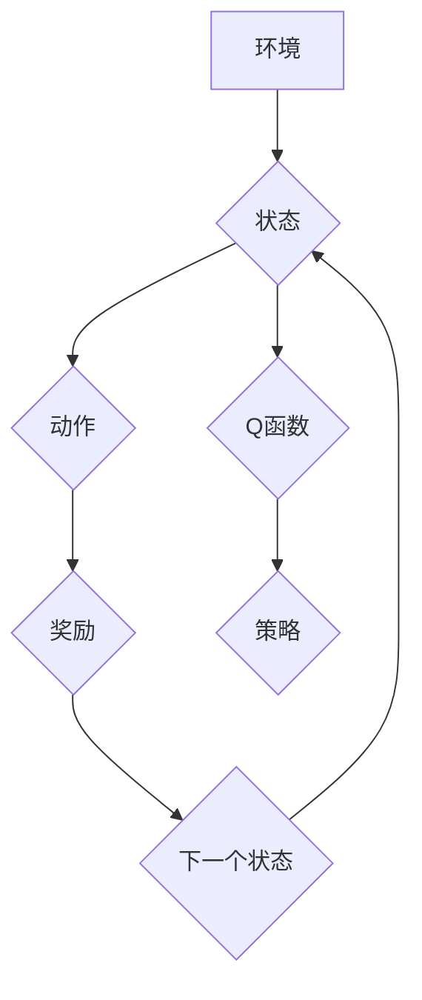

## 一切皆是映射：构建你的第一个DQN模型：步骤和实践

> 关键词：深度强化学习，DQN，Q-learning，神经网络，游戏AI，机器学习

### 1. 背景介绍

深度强化学习（Deep Reinforcement Learning，DRL）近年来在人工智能领域取得了突破性的进展，展现出强大的学习能力和应用潜力。它能够通过与环境交互，学习最优策略，从而解决复杂决策问题。其中，深度Q网络（Deep Q-Network，DQN）作为DRL领域的重要算法之一，凭借其高效性和易于实现的特点，在游戏AI、机器人控制、自动驾驶等领域取得了显著成果。

DQN算法的核心思想是利用深度神经网络来逼近Q函数，Q函数表示在给定状态下采取特定动作的期望回报。通过训练神经网络，学习出最优的Q函数，从而获得最优策略。

### 2. 核心概念与联系

DQN算法的核心概念包括：

* **强化学习（Reinforcement Learning，RL）：**一种机器学习方法，通过奖励机制引导智能体学习最优策略。
* **Q-learning：**一种经典的强化学习算法，通过迭代更新Q函数来学习最优策略。
* **深度神经网络（Deep Neural Network，DNN）：**一种能够学习复杂函数关系的神经网络结构。

DQN算法将Q-learning算法与深度神经网络相结合，利用DNN的学习能力逼近Q函数，从而实现对复杂环境的学习和决策。

**Mermaid 流程图**



### 3. 核心算法原理 & 具体操作步骤

#### 3.1  算法原理概述

DQN算法的核心思想是利用深度神经网络来逼近Q函数，Q函数表示在给定状态下采取特定动作的期望回报。DQN算法通过以下步骤实现对Q函数的学习：

1. **初始化Q网络：**随机初始化深度神经网络的参数。
2. **收集经验：**与环境交互，收集状态、动作、奖励和下一个状态的经验数据。
3. **更新Q网络：**利用收集到的经验数据，通过最小化Q网络预测误差的损失函数来更新Q网络的参数。
4. **选择动作：**根据训练好的Q网络，选择最优动作。

#### 3.2  算法步骤详解

1. **初始化Q网络：**

   DQN算法使用一个深度神经网络来逼近Q函数。该网络的输入是当前状态，输出是每个动作对应的Q值。网络的结构可以根据具体任务进行设计，通常使用卷积神经网络（CNN）或多层感知机（MLP）。

2. **收集经验：**

   智能体与环境交互，根据当前状态选择动作，执行动作后获得奖励和下一个状态。这些信息被存储为经验数据，每个经验数据包含以下信息：

   * **状态（State）：**智能体当前所处的环境状态。
   * **动作（Action）：**智能体在当前状态下采取的动作。
   * **奖励（Reward）：**执行动作后获得的奖励。
   * **下一个状态（Next State）：**执行动作后环境转移到的下一个状态。

3. **更新Q网络：**

   DQN算法使用经验回放（Experience Replay）技术来更新Q网络。经验回放是指从存储的经验数据中随机采样一小批数据进行训练。

   * **目标Q值计算：**对于每个采样的经验数据，计算目标Q值，目标Q值是下一个状态的Q值加上当前奖励。
   * **损失函数计算：**比较Q网络预测的Q值与目标Q值之间的差异，计算损失函数。
   * **参数更新：**利用梯度下降算法，最小化损失函数，更新Q网络的参数。

4. **选择动作：**

   根据训练好的Q网络，选择最优动作。DQN算法通常使用ε-贪婪策略来选择动作，其中ε是一个小的随机概率，用于探索未知动作。

#### 3.3  算法优缺点

**优点：**

* **高效性：**DQN算法能够学习复杂环境中的最优策略，并且训练速度相对较快。
* **易于实现：**DQN算法的实现相对简单，可以使用现有的深度学习框架进行实现。
* **通用性：**DQN算法可以应用于各种强化学习任务，例如游戏AI、机器人控制、自动驾驶等。

**缺点：**

* **样本效率：**DQN算法需要大量的经验数据进行训练，样本效率相对较低。
* **稳定性：**DQN算法在训练过程中可能出现震荡或不稳定现象。
* **探索问题：**DQN算法在探索未知动作方面存在一定的挑战。

#### 3.4  算法应用领域

DQN算法在以下领域具有广泛的应用前景：

* **游戏AI：**DQN算法能够学习玩各种游戏，例如围棋、Go、Atari游戏等。
* **机器人控制：**DQN算法可以用于控制机器人执行复杂任务，例如导航、抓取、组装等。
* **自动驾驶：**DQN算法可以用于训练自动驾驶汽车，使其能够在复杂道路环境中安全驾驶。
* **医疗保健：**DQN算法可以用于辅助医生诊断疾病、制定治疗方案等。

### 4. 数学模型和公式 & 详细讲解 & 举例说明

#### 4.1  数学模型构建

DQN算法的核心是Q函数，Q函数表示在给定状态下采取特定动作的期望回报。数学模型可以表示为：

$$Q(s, a) = E[\sum_{t=0}^{\infty} \gamma^t r_{t+1}|s_t = s, a_t = a]$$

其中：

* $s$ 表示状态。
* $a$ 表示动作。
* $r_{t+1}$ 表示在时间步$t+1$获得的奖励。
* $\gamma$ 表示折扣因子，控制未来奖励的权重。

#### 4.2  公式推导过程

DQN算法使用深度神经网络来逼近Q函数，网络的输出为每个动作对应的Q值。训练目标是最小化Q网络预测的Q值与目标Q值之间的差异。目标Q值可以表示为：

$$Q^*(s, a) = r + \gamma \max_{a'} Q^*(s', a')$$

其中：

* $Q^*(s, a)$ 表示最优Q值。
* $s'$ 表示下一个状态。

DQN算法使用经验回放技术来更新Q网络，每次更新使用一小批经验数据。对于每个经验数据，计算目标Q值，并使用损失函数来衡量Q网络预测误差。

#### 4.3  案例分析与讲解

假设一个智能体在玩一个简单的游戏，游戏环境有两种状态：

* $s_1$：游戏开始状态。
* $s_2$：游戏结束状态。

智能体可以采取两种动作：

* $a_1$：向上移动。
* $a_2$：向下移动。

奖励函数如下：

* 在状态$s_1$下采取动作$a_1$获得奖励$r_1 = 1$。
* 在状态$s_1$下采取动作$a_2$获得奖励$r_2 = -1$。
* 在状态$s_2$下采取任何动作获得奖励$r_3 = 0$。

DQN算法可以学习到最优策略，例如在状态$s_1$下采取动作$a_1$，从而获得更高的奖励。

### 5. 项目实践：代码实例和详细解释说明

#### 5.1  开发环境搭建

构建DQN模型需要以下开发环境：

* Python 3.x
* TensorFlow 或 PyTorch 深度学习框架
* NumPy 科学计算库
* Matplotlib 数据可视化库

#### 5.2  源代码详细实现

以下是一个使用TensorFlow实现DQN模型的简单代码示例：

```python
import tensorflow as tf

# 定义DQN模型
class DQN(tf.keras.Model):
    def __init__(self, state_size, action_size):
        super(DQN, self).__init__()
        self.dense1 = tf.keras.layers.Dense(64, activation='relu')
        self.dense2 = tf.keras.layers.Dense(64, activation='relu')
        self.output = tf.keras.layers.Dense(action_size)

    def call(self, state):
        x = self.dense1(state)
        x = self.dense2(x)
        return self.output(x)

# 创建DQN模型
model = DQN(state_size=80, action_size=4)

# 定义损失函数和优化器
loss_fn = tf.keras.losses.MeanSquaredError()
optimizer = tf.keras.optimizers.Adam(learning_rate=0.001)

# 训练模型
for epoch in range(100):
    # 训练循环
    for batch in data_loader:
        # 获取状态、动作、奖励和下一个状态
        state, action, reward, next_state = batch

        # 计算目标Q值
        target_q = reward + gamma * tf.reduce_max(model(next_state), axis=1)

        # 计算损失
        with tf.GradientTape() as tape:
            q_values = model(state)
            loss = loss_fn(target_q, q_values[tf.range(len(state)), action])

        # 更新模型参数
        gradients = tape.gradient(loss, model.trainable_variables)
        optimizer.apply_gradients(zip(gradients, model.trainable_variables))

# 保存模型
model.save('dqn_model.h5')
```

#### 5.3  代码解读与分析

* **模型定义：**代码定义了一个DQN模型，该模型使用两个全连接层和一个输出层，输出层包含与动作数量相同的节点。
* **损失函数和优化器：**代码使用均方误差损失函数和Adam优化器来训练模型。
* **训练循环：**代码使用经验回放技术来训练模型，每次迭代使用一小批经验数据。
* **目标Q值计算：**代码计算目标Q值，该值是下一个状态的Q值加上当前奖励。
* **参数更新：**代码使用梯度下降算法更新模型参数。

#### 5.4  运行结果展示

训练完成后，可以将模型应用于新的环境中，例如玩游戏或控制机器人。

### 6. 实际应用场景

DQN算法在实际应用场景中展现出强大的潜力，例如：

* **游戏AI：**DQN算法可以训练智能体玩各种游戏，例如AlphaGo、Atari游戏等。
* **机器人控制：**DQN算法可以用于控制机器人执行复杂任务，例如导航、抓取、组装等。
* **自动驾驶：**DQN算法可以用于训练自动驾驶汽车，使其能够在复杂道路环境中安全驾驶。
* **医疗保健：**DQN算法可以用于辅助医生诊断疾病、制定治疗方案等。

#### 6.4  未来应用展望

DQN算法在未来将有更广泛的应用前景，例如：

* **个性化推荐：**DQN算法可以用于个性化推荐产品、服务或内容。
* **金融交易：**DQN算法可以用于自动交易股票、债券或其他金融资产。
* **自然语言处理：**DQN算法可以用于机器翻译、文本摘要、对话系统等自然语言处理任务。

### 7. 工具和资源推荐

#### 7.1  学习资源推荐

* **书籍：**
    * Deep Reinforcement Learning Hands-On by Maxim Lapan
    * Reinforcement Learning: An Introduction by Richard S. Sutton and Andrew G. Barto
* **在线课程：**
    * Deep Reinforcement Learning Specialization by DeepLearning.AI
    * Reinforcement Learning by David Silver (University of DeepMind