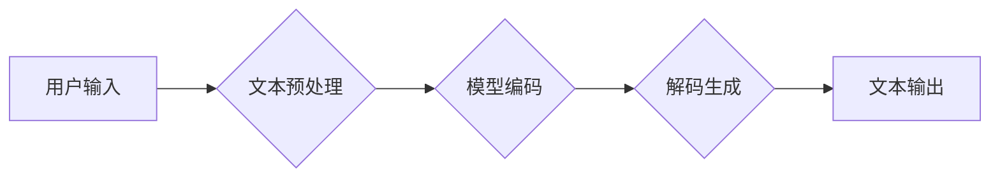

## 基于AI大模型的自然语言生成：写作的未来

> 关键词：自然语言生成、AI大模型、Transformer、GPT、BERT、文本生成、写作辅助、未来趋势

### 1. 背景介绍

人类文明的进步离不开语言的传播和交流。写作作为语言表达的重要形式，在记录历史、传递知识、表达情感等方面发挥着至关重要的作用。然而，传统的写作方式往往耗时费力，需要大量的专业知识和写作技巧。随着人工智能技术的飞速发展，基于AI大模型的自然语言生成技术应运而生，为写作领域带来了革命性的变革。

近年来，深度学习技术取得了突破性进展，特别是Transformer模型的出现，为自然语言处理领域带来了新的曙光。Transformer模型能够有效捕捉文本中的长距离依赖关系，并展现出强大的文本生成能力。基于此，许多研究机构和科技公司开发了基于Transformer模型的AI写作助手，例如OpenAI的GPT系列模型、Google的BERT模型等。这些模型能够根据用户的输入，自动生成高质量的文本内容，包括文章、故事、诗歌、代码等。

### 2. 核心概念与联系

**2.1 自然语言生成 (Natural Language Generation, NLG)**

自然语言生成是指机器能够根据给定的数据或知识，自动生成流畅、自然的文本内容的过程。它是一个跨学科的研究领域，涉及自然语言处理、机器学习、人工智能等多个领域。

**2.2 AI大模型 (Large Language Model, LLM)**

AI大模型是指拥有大量参数的深度学习模型，通过训练海量文本数据，能够学习语言的语法、语义和上下文关系。这些模型具有强大的泛化能力，能够应用于各种自然语言处理任务，包括文本生成、翻译、问答等。

**2.3 Transformer模型**

Transformer模型是一种新型的深度学习架构，其核心是“注意力机制”，能够有效捕捉文本中的长距离依赖关系。与传统的循环神经网络 (RNN) 相比，Transformer模型具有更快的训练速度和更好的性能。

**2.4 流程图**



### 3. 核心算法原理 & 具体操作步骤

**3.1 算法原理概述**

基于AI大模型的自然语言生成主要基于Transformer模型的解码器结构。解码器通过自注意力机制和前馈神经网络，将输入的文本序列编码为隐藏状态，并根据隐藏状态生成下一个词。

**3.2 算法步骤详解**

1. **文本预处理:** 将用户输入的文本进行清洗、分词、标记等操作，使其能够被模型理解。
2. **模型编码:** 将预处理后的文本序列输入到Transformer模型的编码器中，编码器将文本序列转换为隐藏状态表示。
3. **解码生成:** 将编码后的隐藏状态输入到Transformer模型的解码器中，解码器根据隐藏状态和之前生成的词，预测下一个词。
4. **文本输出:** 将预测出的词依次连接起来，形成最终的文本输出。

**3.3 算法优缺点**

**优点:**

* **生成高质量文本:** Transformer模型能够学习复杂的语言模式，生成流畅、自然的文本内容。
* **处理长距离依赖:** 注意力机制能够有效捕捉文本中的长距离依赖关系，生成更准确的文本。
* **可扩展性强:** Transformer模型的参数量可以根据任务需求进行调整，能够处理不同长度和复杂度的文本。

**缺点:**

* **训练成本高:** Transformer模型的参数量巨大，训练需要大量的计算资源和时间。
* **数据依赖性强:** 模型的性能取决于训练数据的质量和数量。
* **可解释性差:** Transformer模型的内部机制复杂，难以解释其生成文本的逻辑。

**3.4 算法应用领域**

* **写作辅助:** 自动生成文章、故事、诗歌等文本内容。
* **机器翻译:** 将一种语言翻译成另一种语言。
* **聊天机器人:** 与用户进行自然语言对话。
* **代码生成:** 自动生成代码片段。
* **摘要生成:** 自动生成文本的摘要。

### 4. 数学模型和公式 & 详细讲解 & 举例说明

**4.1 数学模型构建**

Transformer模型的核心是注意力机制和多头注意力机制。注意力机制能够学习文本中不同词之间的重要程度，并根据重要程度调整词的权重。多头注意力机制则使用多个注意力头，分别关注文本的不同方面，并融合多个头的输出结果，提高模型的表达能力。

**4.2 公式推导过程**

注意力机制的计算公式如下：

$$
Attention(Q, K, V) = softmax(\frac{QK^T}{\sqrt{d_k}})V
$$

其中：

* $Q$：查询矩阵
* $K$：键矩阵
* $V$：值矩阵
* $d_k$：键向量的维度
* $softmax$：softmax函数

**4.3 案例分析与讲解**

假设我们有一个句子：“The cat sat on the mat”。

* $Q$：查询矩阵表示每个词的上下文信息。
* $K$：键矩阵表示每个词的词义信息。
* $V$：值矩阵表示每个词的语义向量。

通过注意力机制，模型可以学习到“cat”和“sat”之间存在着语义上的关联，并将它们赋予更高的权重。

### 5. 项目实践：代码实例和详细解释说明

**5.1 开发环境搭建**

* Python 3.7+
* TensorFlow/PyTorch
* CUDA/cuDNN

**5.2 源代码详细实现**

```python
import tensorflow as tf

# 定义Transformer模型
class Transformer(tf.keras.Model):
    def __init__(self, vocab_size, embedding_dim, num_heads, num_layers):
        super(Transformer, self).__init__()
        self.embedding = tf.keras.layers.Embedding(vocab_size, embedding_dim)
        self.transformer_layers = tf.keras.layers.StackedRNNCells([
            tf.keras.layers.MultiHeadAttention(num_heads=num_heads, key_dim=embedding_dim)
            for _ in range(num_layers)
        ])

    def call(self, inputs):
        # Embedding
        embedded = self.embedding(inputs)
        # Transformer layers
        output = self.transformer_layers(embedded)
        return output

# 实例化模型
model = Transformer(vocab_size=10000, embedding_dim=512, num_heads=8, num_layers=6)

# 训练模型
model.compile(optimizer='adam', loss='sparse_categorical_crossentropy', metrics=['accuracy'])
model.fit(train_data, train_labels, epochs=10)
```

**5.3 代码解读与分析**

* 代码定义了一个Transformer模型，包含嵌入层、多头注意力层和前馈神经网络层。
* 嵌入层将词索引转换为词向量。
* 多头注意力层能够捕捉文本中的长距离依赖关系。
* 前馈神经网络层对隐藏状态进行进一步的处理。
* 模型使用Adam优化器、交叉熵损失函数和准确率作为评估指标进行训练。

**5.4 运行结果展示**

训练完成后，模型能够根据输入的文本序列，生成新的文本内容。

### 6. 实际应用场景

**6.1 写作辅助工具**

AI写作助手可以帮助用户克服写作障碍，提高写作效率。例如，可以自动生成文章开头、段落连接、总结等内容，并提供语法和风格建议。

**6.2 内容创作平台**

AI大模型可以为内容创作平台提供自动生成内容的功能，例如新闻报道、产品描述、广告文案等。

**6.3 教育领域**

AI写作助手可以帮助学生练习写作，并提供个性化的反馈和指导。

**6.4 其他应用场景**

* 机器翻译
* 聊天机器人
* 代码生成
* 文本摘要

**6.5 未来应用展望**

随着AI技术的不断发展，基于AI大模型的自然语言生成技术将应用于更广泛的领域，例如：

* 个性化教育
* 智能客服
* 创意写作
* 科学研究

### 7. 工具和资源推荐

**7.1 学习资源推荐**

* **书籍:**

    * 《深度学习》
    * 《自然语言处理》
    * 《Transformer模型详解》

* **在线课程:**

    * Coursera: 自然语言处理
    * Udacity: 深度学习

* **博客:**

    * The Gradient
    * Towards Data Science

**7.2 开发工具推荐**

* **TensorFlow:** 开源深度学习框架
* **PyTorch:** 开源深度学习框架
* **Hugging Face:** 提供预训练模型和开发工具

**7.3 相关论文推荐**

* 《Attention Is All You Need》
* 《BERT: Pre-training of Deep Bidirectional Transformers for Language Understanding》
* 《GPT-3: Language Models are Few-Shot Learners》

### 8. 总结：未来发展趋势与挑战

**8.1 研究成果总结**

基于AI大模型的自然语言生成技术取得了显著的进展，能够生成高质量、流畅的文本内容。

**8.2 未来发展趋势**

* 模型规模和能力的进一步提升
* 更强大的泛化能力和适应性
* 更注重可解释性和安全性
* 更广泛的应用场景

**8.3 面临的挑战**

* 数据获取和标注的成本
* 模型训练的计算资源需求
* 模型的偏见和误导性
* 伦理和社会影响

**8.4 研究展望**

未来研究将重点关注以下方面：

* 开发更小、更高效的AI大模型
* 提高模型的泛化能力和鲁棒性
* 增强模型的可解释性和安全性
* 探索AI大模型在更多领域的新应用

### 9. 附录：常见问题与解答

**9.1 如何选择合适的AI写作助手？**

选择AI写作助手时，需要考虑以下因素：

* 功能需求
* 使用场景
* 价格
* 用户评价

**9.2 AI写作助手会取代人类作家吗？**

AI写作助手可以帮助人类作家提高效率和创意，但不会完全取代人类作家。人类作家仍然需要负责内容的构思、逻辑和情感表达。

**9.3 如何避免AI写作助手生成低质量或不准确的文本？**

* 使用高质量的训练数据
* 仔细选择合适的AI写作助手
* 对生成的文本进行人工审核和修改


作者：禅与计算机程序设计艺术 / Zen and the Art of Computer Programming 
