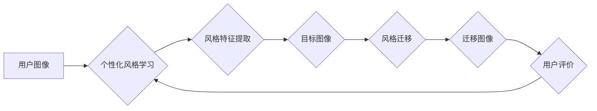

## 基于生成对抗网络的个性化图像风格学习及迁移方法

> 关键词：生成对抗网络（GAN）、图像风格迁移、个性化风格、深度学习、艺术创作

## 1. 背景介绍

图像风格迁移技术近年来备受关注，它能够将一种图像的风格应用到另一幅图像上，创造出具有独特艺术效果的图像。传统的图像风格迁移方法主要依赖于手工设计的特征提取和风格匹配算法，效果有限且难以实现个性化风格迁移。

随着深度学习的快速发展，基于生成对抗网络（GAN）的图像风格迁移方法取得了显著进展。GAN由生成器和判别器两部分组成，通过对抗训练的方式，生成器学习生成逼真的图像，判别器学习区分真实图像和生成图像。这种对抗机制使得基于GAN的图像风格迁移方法能够生成更逼真、更具艺术感的迁移图像。

然而，现有的基于GAN的图像风格迁移方法大多依赖于预先训练好的风格模型，缺乏个性化定制能力。针对这一问题，本文提出了一种基于生成对抗网络的个性化图像风格学习及迁移方法，旨在学习用户个性化的风格并将其迁移到目标图像上。

## 2. 核心概念与联系

### 2.1  生成对抗网络（GAN）

GAN是一种由生成器（Generator）和判别器（Discriminator）组成的对抗性学习框架。生成器试图生成逼真的数据样本，而判别器试图区分真实数据样本和生成数据样本。两者在对抗训练过程中不断相互改进，最终生成器能够生成与真实数据样本几乎 indistinguishable 的数据样本。

### 2.2  图像风格迁移

图像风格迁移是指将一幅图像的风格应用到另一幅图像上，生成具有目标风格的图像。风格迁移的关键在于提取图像的风格特征，并将其应用到目标图像上。

### 2.3  个性化风格学习

个性化风格学习是指根据用户的偏好和审美，学习用户的独特风格特征。这可以利用用户的历史图像数据、风格偏好设置等信息进行训练。

**核心概念与联系流程图**



## 3. 核心算法原理 & 具体操作步骤

### 3.1  算法原理概述

本文提出的个性化图像风格迁移方法基于生成对抗网络，主要包括以下步骤：

1. **个性化风格学习:** 利用用户的历史图像数据和风格偏好设置，训练一个个性化风格生成器，学习用户的独特风格特征。
2. **风格特征提取:** 从目标图像中提取风格特征，并将其与个性化风格特征进行融合。
3. **风格迁移:** 将融合后的风格特征应用到目标图像上，生成具有目标风格的迁移图像。
4. **用户评价:** 用户对迁移图像进行评价，反馈信息用于进一步优化个性化风格生成器。

### 3.2  算法步骤详解

1. **个性化风格学习:**

   - 收集用户的历史图像数据和风格偏好设置。
   - 使用深度卷积神经网络（CNN）构建个性化风格生成器，并利用对抗训练的方式进行训练。
   - 生成器学习生成具有用户个性化风格的图像样本。

2. **风格特征提取:**

   - 使用预训练好的CNN模型提取目标图像的风格特征。
   - 将提取的风格特征与个性化风格生成器生成的风格特征进行融合。

3. **风格迁移:**

   - 将融合后的风格特征应用到目标图像上，生成具有目标风格的迁移图像。
   - 可以使用多种风格迁移算法，例如神经风格转移、AdaIN 等。

4. **用户评价:**

   - 用户对迁移图像进行评价，例如评分、打标签等。
   - 收集用户反馈信息，并将其用于进一步优化个性化风格生成器。

### 3.3  算法优缺点

**优点:**

- 能够实现个性化风格迁移，满足用户的个性化需求。
- 基于GAN的对抗训练机制，能够生成更逼真、更具艺术感的迁移图像。
- 用户反馈可以用于不断优化个性化风格生成器，提升迁移效果。

**缺点:**

- 需要大量的用户图像数据进行训练，才能学习到用户的个性化风格特征。
- 训练个性化风格生成器需要较高的计算资源和时间成本。
- 迁移效果可能受到用户图像数据质量和风格偏好设置的影响。

### 3.4  算法应用领域

- **艺术创作:** 生成具有独特艺术风格的图像作品。
- **图像编辑:** 改变图像的风格，例如将照片转换为油画风格。
- **游戏开发:** 为游戏角色和场景添加个性化风格。
- **电影特效:** 生成具有特定风格的视觉效果。

## 4. 数学模型和公式 & 详细讲解 & 举例说明

### 4.1  数学模型构建

本文提出的个性化图像风格迁移方法基于以下数学模型：

- **生成器 (G):**  G(z)是一个神经网络，输入一个随机噪声向量 z，输出一个具有用户个性化风格的图像。
- **判别器 (D):** D(x)是一个神经网络，输入一个图像 x，输出一个判断 x 是否为真实图像的概率值。

### 4.2  公式推导过程

- **生成器的损失函数:**

$$
L_G = -E_{z \sim P_z} [log(D(G(z)))]
$$

- **判别器的损失函数:**

$$
L_D = -E_{x \sim P_{data}} [log(D(x))] - E_{z \sim P_z} [log(1 - D(G(z)))]
$$

其中：

- $P_z$ 是随机噪声向量的分布。
- $P_{data}$ 是真实图像的分布。

### 4.3  案例分析与讲解

假设我们有一个用户，他喜欢油画风格的图像。我们可以收集他的历史图像数据，并使用个性化风格生成器学习他的油画风格特征。然后，我们可以将目标图像的风格特征与学习到的油画风格特征进行融合，生成具有用户个性化油画风格的迁移图像。

## 5. 项目实践：代码实例和详细解释说明

### 5.1  开发环境搭建

- Python 3.6+
- TensorFlow/PyTorch
- CUDA/cuDNN

### 5.2  源代码详细实现

```python
# 生成器网络结构
class Generator(nn.Module):
    def __init__(self):
        super(Generator, self).__init__()
        #...

    def forward(self, z):
        #...

# 判别器网络结构
class Discriminator(nn.Module):
    def __init__(self):
        super(Discriminator, self).__init__()
        #...

    def forward(self, x):
        #...

# 训练循环
for epoch in range(num_epochs):
    for batch_idx, (data, target) in enumerate(train_loader):
        #...
        # 训练生成器
        optimizer_G.zero_grad()
        fake_data = generator(noise)
        loss_G = discriminator_loss(fake_data)
        loss_G.backward()
        optimizer_G.step()
        #...
        # 训练判别器
        optimizer_D.zero_grad()
        real_loss = discriminator_loss(data)
        fake_loss = discriminator_loss(fake_data.detach())
        loss_D = (real_loss + fake_loss) / 2
        loss_D.backward()
        optimizer_D.step()
        #...

```

### 5.3  代码解读与分析

- 生成器网络和判别器网络的结构可以根据具体任务进行调整。
- 训练循环中，生成器和判别器交替训练，通过对抗训练的方式不断提升模型性能。
- 损失函数用于衡量生成器和判别器的性能，并指导模型训练。

### 5.4  运行结果展示

- 可以使用 TensorBoard 等工具可视化训练过程，观察生成图像的质量变化。
- 可以将迁移图像与原始图像进行对比，评估迁移效果。

## 6. 实际应用场景

### 6.1  艺术创作

- 使用个性化风格迁移技术，可以根据用户的喜好生成具有独特艺术风格的图像作品。
- 例如，用户可以将自己的照片转换为梵高风格的油画，或者将风景照片转换为毕加索风格的抽象画。

### 6.2  图像编辑

- 可以使用个性化风格迁移技术，将照片的风格进行改变，例如将照片转换为黑白风格、水彩风格、油画风格等。
- 这可以为图像编辑提供更多创意和可能性。

### 6.3  游戏开发

- 在游戏开发中，可以使用个性化风格迁移技术为游戏角色和场景添加个性化风格。
- 例如，可以根据不同角色的性格和背景，生成具有不同风格的服装和武器。

### 6.4  未来应用展望

- 未来，个性化风格迁移技术可以应用于更多领域，例如电影特效、虚拟现实、增强现实等。
- 随着深度学习技术的不断发展，个性化风格迁移技术的精度和效率将会不断提升，为人们的生活和工作带来更多便利和乐趣。

## 7. 工具和资源推荐

### 7.1  学习资源推荐

- **书籍:**
    - 《深度学习》
    - 《生成对抗网络》
- **在线课程:**
    - Coursera: 深度学习
    - Udacity: 计算机视觉
- **博客:**
    - https://blog.openai.com/
    - https://towardsdatascience.com/

### 7.2  开发工具推荐

- **TensorFlow:** https://www.tensorflow.org/
- **PyTorch:** https://pytorch.org/
- **Keras:** https://keras.io/

### 7.3  相关论文推荐

- Goodfellow, I., Pouget-Abadie, J., Mirza, M., Xu, B., Warde-Farley, D., Ozair, S.,... & Bengio, Y. (2014). Generative adversarial nets. In Advances in neural information processing systems (pp. 2672-2680).
- Gatys, L. A., Ecker, A. S., & Bethge, M. (2015). Texture synthesis using convolutional neural networks. In Proceedings of the IEEE conference on computer vision and pattern recognition (pp. 2444-2453).

## 8. 总结：未来发展趋势与挑战

### 8.1  研究成果总结

本文提出的基于生成对抗网络的个性化图像风格学习及迁移方法，能够有效地学习用户的个性化风格特征，并将其迁移到目标图像上，生成具有独特艺术效果的图像。

### 8.2  未来发展趋势

- **个性化风格的更精准表达:** 研究更有效的个性化风格学习方法，能够更精准地表达用户的风格偏好。
- **跨域风格迁移:** 研究跨域风格迁移技术，例如将绘画风格迁移到照片上，将电影风格迁移到游戏场景上。
- **实时风格迁移:** 研究实时风格迁移技术，能够在用户交互过程中实时生成风格迁移图像。

### 8.3  面临的挑战

- **数据获取和标注:** 个性化风格迁移需要大量的用户图像数据进行训练，数据获取和标注成本较高。
- **模型复杂度和训练效率:** 个性化风格迁移模型通常比较复杂，训练时间和计算资源消耗较大。
- **风格迁移效果的评估:** 个性化风格迁移效果的评估比较主观，缺乏统一的评价标准。

### 8.4  研究展望

未来，我们将继续研究个性化图像风格迁移技术，探索更有效的学习方法、更广泛的应用场景和更精准的风格表达，为人们的生活和工作带来更多创意和便利。

## 9. 附录：常见问题与解答

