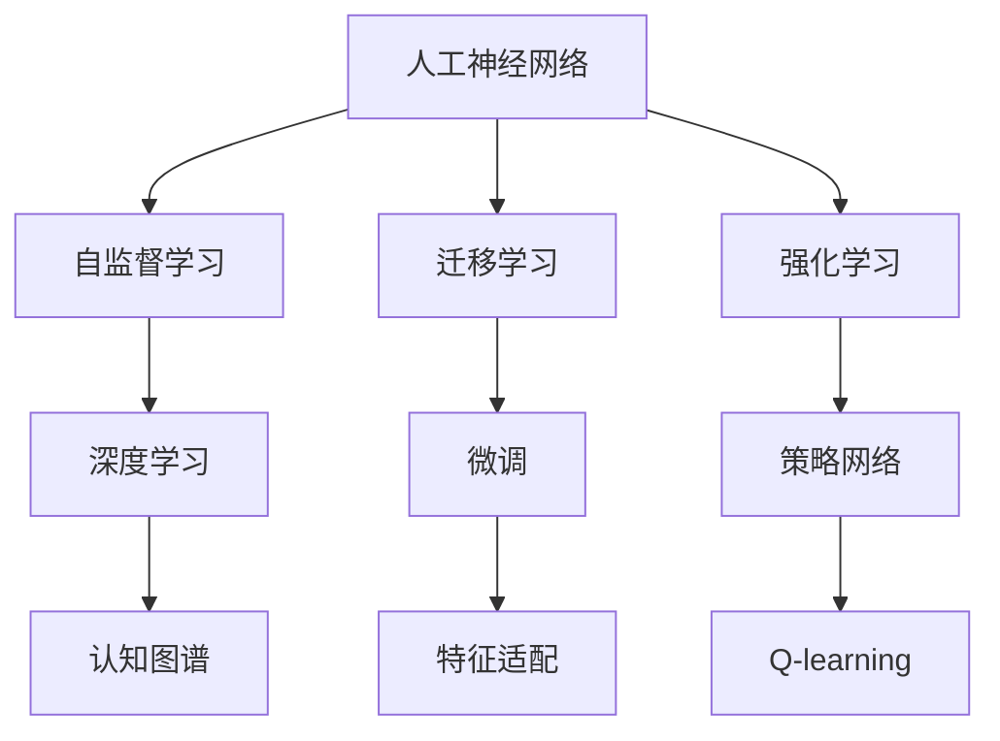
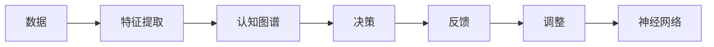
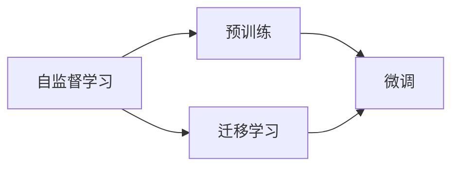
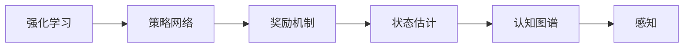
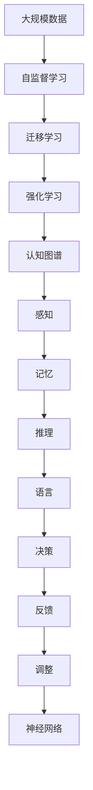

                 

# 认知发展的三阶段模型路径

> 关键词：认知发展, 人工神经网络, 自监督学习, 迁移学习, 强化学习, 深度学习, 认知图谱

## 1. 背景介绍

### 1.1 问题由来
认知科学是研究人类认知过程和心理活动的学科，包括知觉、记忆、语言、思维等多个方面。随着人工智能技术的快速发展，模拟人类认知过程，构建认知模型成为了当前研究的热点。认知模型可以应用在诸如自然语言理解、计算机视觉、推荐系统等领域，辅助计算机更好地理解世界，进行智能决策。

但是，传统的认知模型往往是基于经典认知科学理论构建的，这些理论大多是在20世纪上半叶提出的。随着认知科学研究的不断深入，对于认知过程的理解也在不断更新。因此，构建更加符合现代认知科学理论的认知模型，成为了新的挑战。

### 1.2 问题核心关键点
认知发展模型主要关注人类认知过程的演变，包括感知、记忆、推理和语言等。常见的认知发展模型包括皮亚杰提出的认知发展阶段理论、霍德华·加德纳的多重智能理论、史蒂文·平克等的认知科学理论等。这些理论通常以阶段性发展的形式描述认知过程，提出了不同阶段中认知的特点和表现。

认知模型需要将认知科学理论应用到计算机中，使其能够自动学习和适应，模拟人类认知过程。因此，构建认知模型需要关注以下几个核心问题：
- 认知模型如何学习感知和记忆过程？
- 认知模型如何通过迁移学习获得新的认知能力？
- 认知模型如何在复杂环境中进行智能决策？

本文将围绕认知科学理论，介绍三种典型的认知发展模型，即自监督学习模型、迁移学习模型和强化学习模型，并对其实现原理和操作步骤进行详细阐述。

## 2. 核心概念与联系

### 2.1 核心概念概述

为了更好地理解认知发展模型，本节将介绍几个密切相关的核心概念：

- 人工神经网络(Artificial Neural Network, ANN)：由一系列节点组成的计算模型，能够通过反向传播算法进行训练，以逼近任意连续函数。ANN被广泛应用于图像识别、语音识别、自然语言处理等领域。
- 自监督学习(Self-Supervised Learning)：一种无需标注数据，通过自身数据的特点进行学习的方法。常见的自监督任务包括掩码语言模型、对比预测等。
- 迁移学习(Transfer Learning)：指将一个领域学到的知识迁移到另一个不同但相关的领域进行学习。常见的迁移学习方法包括特征适配、微调等。
- 强化学习(Reinforcement Learning)：通过与环境的交互，学习如何在一个复杂环境中进行智能决策。常见的强化学习算法包括Q-learning、深度Q网络(DQN)等。
- 深度学习(Deep Learning)：一种使用多层神经网络进行学习的技术，可以处理大规模高维数据。深度学习在认知建模中发挥了重要作用，提供了更为强大的表征学习能力。
- 认知图谱(Cognitive Map)：用于描述人类认知过程的结构化模型，包括感知、记忆、推理等多个环节。认知图谱的构建有助于更好地理解认知模型的工作原理。

这些核心概念之间的逻辑关系可以通过以下Mermaid流程图来展示：



这个流程图展示了人工神经网络、自监督学习、迁移学习和强化学习之间的联系，以及它们在认知建模中的作用。

### 2.2 概念间的关系

这些核心概念之间存在着紧密的联系，形成了认知模型的工作框架。下面我通过几个Mermaid流程图来展示这些概念之间的关系。

#### 2.2.1 认知模型的工作流程



这个流程图展示了认知模型的一般工作流程，即从数据到特征提取，再经过认知图谱的处理，最后输出决策并反馈调整。

#### 2.2.2 自监督学习与迁移学习的关系



这个流程图展示了自监督学习和迁移学习之间的关系。自监督学习通过预训练获得通用的表征，而迁移学习则利用这些表征对特定任务进行微调。

#### 2.2.3 强化学习与认知图谱的关系



这个流程图展示了强化学习与认知图谱之间的关系。强化学习通过策略网络进行决策，并通过状态估计反馈感知过程，从而调整认知图谱。

### 2.3 核心概念的整体架构

最后，我们用一个综合的流程图来展示这些核心概念在大规模认知模型中的整体架构：



这个综合流程图展示了从数据到认知图谱，再到感知、记忆、推理、语言和决策的认知模型工作流程。

## 3. 核心算法原理 & 具体操作步骤

### 3.1 算法原理概述

认知发展模型通常以人工神经网络为基础，通过不同的学习方式模拟人类的认知过程。以下我们将分别介绍自监督学习、迁移学习和强化学习的原理。

#### 3.1.1 自监督学习
自监督学习通过自身数据的特点进行学习，不需要外部标注数据。常见的自监督任务包括掩码语言模型、对比预测等。

以掩码语言模型为例，模型在输入中随机删除一些词，然后预测这些被删除词的正确词汇。通过反向传播算法不断调整网络权重，使得模型能够学习到词汇间的关联关系，从而获得通用表征。

#### 3.1.2 迁移学习
迁移学习是指将一个领域学到的知识迁移到另一个不同但相关的领域。常见的迁移学习方法包括特征适配和微调。

特征适配指的是在目标领域中只微调顶层网络，保留预训练模型的大部分权重，从而减少计算资源消耗。微调则是在目标领域上训练整个模型，通过反向传播算法调整模型参数，以适应新的任务。

#### 3.1.3 强化学习
强化学习通过与环境的交互，学习如何在一个复杂环境中进行智能决策。常见的强化学习算法包括Q-learning和深度Q网络(DQN)。

Q-learning算法通过状态-动作-奖励的序列进行训练，学习如何最大化长期奖励。DQN算法则通过深度神经网络进行状态表示，从而获得更强大的泛化能力。

### 3.2 算法步骤详解

#### 3.2.1 自监督学习模型
自监督学习模型的主要步骤如下：

1. 准备数据集：收集未标注的数据集，用于自监督学习任务的训练。
2. 构建模型：设计并训练自监督学习模型，如掩码语言模型、对比预测等。
3. 特征提取：将模型提取的特征用于下游任务。

以下是一个基于掩码语言模型的自监督学习模型示例代码：

```python
from transformers import BertTokenizer, BertForMaskedLM
import torch

tokenizer = BertTokenizer.from_pretrained('bert-base-cased')
model = BertForMaskedLM.from_pretrained('bert-base-cased')

inputs = tokenizer.encode("The dog never [MASK] apple.", return_tensors="pt")
labels = inputs[0][inputs[0].index([tokenizer.mask_token_id])] = 0

outputs = model(**inputs)
loss = outputs.loss
```

#### 3.2.2 迁移学习模型
迁移学习模型的主要步骤如下：

1. 准备数据集：收集目标任务的标注数据集，用于迁移学习的微调。
2. 特征适配：在目标领域中只微调顶层网络，保留预训练模型的大部分权重。
3. 微调模型：在目标领域上训练整个模型，调整模型参数以适应新的任务。

以下是一个基于BERT的迁移学习模型示例代码：

```python
from transformers import BertTokenizer, BertForSequenceClassification
from transformers import Trainer, TrainingArguments

tokenizer = BertTokenizer.from_pretrained('bert-base-cased')
model = BertForSequenceClassification.from_pretrained('bert-base-cased', num_labels=2)
training_args = TrainingArguments(output_dir="./results", per_device_train_batch_size=16, per_device_eval_batch_size=16, num_train_epochs=3, weight_decay=0.01)

trainer = Trainer(
    model=model,
    args=training_args,
    train_dataset=train_dataset,
    eval_dataset=test_dataset,
)

trainer.train()
```

#### 3.2.3 强化学习模型
强化学习模型的主要步骤如下：

1. 构建环境：设计环境模型，包括状态、动作、奖励等。
2. 设计策略：设计强化学习算法，如Q-learning、DQN等。
3. 训练模型：在环境中不断迭代训练，优化策略网络。

以下是一个基于DQN的强化学习模型示例代码：

```python
import gym
import torch
import torch.nn as nn
import torch.optim as optim

class DQN(nn.Module):
    def __init__(self, input_dim, output_dim):
        super(DQN, self).__init__()
        self.fc1 = nn.Linear(input_dim, 64)
        self.fc2 = nn.Linear(64, output_dim)

    def forward(self, x):
        x = self.fc1(x)
        x = torch.relu(x)
        x = self.fc2(x)
        return x

class QNetwork:
    def __init__(self, input_dim, output_dim, learning_rate):
        self.input_dim = input_dim
        self.output_dim = output_dim
        self.learning_rate = learning_rate
        self.model = DQN(input_dim, output_dim)
        self.optimizer = optim.Adam(self.model.parameters(), lr=self.learning_rate)
        self.loss_fn = nn.MSELoss()

    def choose_action(self, state):
        with torch.no_grad():
            q_values = self.model(torch.tensor(state, dtype=torch.float))
            action = q_values.argmax().item()
        return action

    def update_model(self, state, action, reward, next_state, done):
        q_values = self.model(torch.tensor(state, dtype=torch.float))
        q_values_next = self.model(torch.tensor(next_state, dtype=torch.float))
        max_q_next = q_values_next.max().item()
        loss = self.loss_fn(q_values, torch.tensor([max_q_next], dtype=torch.float))
        self.optimizer.zero_grad()
        loss.backward()
        self.optimizer.step()

env = gym.make('CartPole-v0')
state_dim = env.observation_space.shape[0]
action_dim = env.action_space.n
input_dim = state_dim + action_dim
output_dim = env.action_space.n

model = QNetwork(input_dim, output_dim, learning_rate=0.001)

for episode in range(100):
    state = env.reset()
    done = False
    while not done:
        action = model.choose_action(state)
        next_state, reward, done, _ = env.step(action)
        model.update_model(state, action, reward, next_state, done)
        state = next_state
```

### 3.3 算法优缺点

#### 3.3.1 自监督学习模型
优点：
- 无需外部标注数据，训练成本较低。
- 学习到的通用表征具有较强的泛化能力。

缺点：
- 对数据质量要求较高，无法处理噪声数据。
- 学习到的特征可能与具体任务不太相关。

#### 3.3.2 迁移学习模型
优点：
- 利用预训练模型的知识，提高微调效果。
- 减少训练时间，提升模型性能。

缺点：
- 迁移效果依赖于预训练数据与目标任务的相似性。
- 保留的预训练权重可能影响微调效果。

#### 3.3.3 强化学习模型
优点：
- 能够处理复杂环境，实现智能决策。
- 通过与环境交互，学习经验丰富。

缺点：
- 训练复杂度较高，收敛速度慢。
- 对环境建模要求较高，需要设计合适的奖励函数。

### 3.4 算法应用领域

#### 3.4.1 自然语言处理
自监督学习、迁移学习、强化学习在自然语言处理领域有广泛应用。例如：

- 掩码语言模型：通过掩码语言模型进行自监督学习，学习语言的结构和语义信息。
- 机器翻译：通过迁移学习在特定领域微调语言模型，提升翻译效果。
- 对话系统：通过强化学习设计对话策略，实现智能问答和对话。

#### 3.4.2 计算机视觉
自监督学习、迁移学习、强化学习在计算机视觉领域也有重要应用。例如：

- 自监督学习：通过图像分类、目标检测等自监督任务进行预训练，学习图像特征。
- 迁移学习：在特定领域上微调预训练模型，实现目标检测、图像分割等任务。
- 强化学习：设计智能游戏环境，训练生成对抗网络（GAN）生成高质量图像。

#### 3.4.3 推荐系统
自监督学习、迁移学习、强化学习在推荐系统领域也有广泛应用。例如：

- 自监督学习：通过用户行为数据进行特征学习，提升推荐效果。
- 迁移学习：在不同用户群体间进行知识迁移，提高推荐系统的通用性。
- 强化学习：设计推荐策略，根据用户反馈进行智能推荐。

## 4. 数学模型和公式 & 详细讲解 & 举例说明

### 4.1 数学模型构建

为了更好地理解认知发展模型，本节将介绍几个重要的数学模型。

#### 4.1.1 自监督学习模型
以掩码语言模型为例，模型的数学模型可以表示为：

$$
p(x) = \prod_{i=1}^n p(x_i|x_{<i})
$$

其中 $x$ 为输入序列，$x_i$ 为第 $i$ 个单词，$x_{<i}$ 为 $x$ 的前 $i-1$ 个单词。

模型通过掩码语言模型进行训练，输入序列 $x$ 中的某些单词被掩码，模型需要预测这些单词的正确词汇。通过最大化似然函数，可以训练出能够预测未掩码单词的概率模型。

#### 4.1.2 迁移学习模型
迁移学习模型通过微调来适应目标任务。假设目标任务的标注数据集为 $D=\{(x_i,y_i)\}_{i=1}^N$，模型的数学模型可以表示为：

$$
\mathcal{L}(\theta) = -\frac{1}{N}\sum_{i=1}^N \ell(y_i,f(x_i;\theta))
$$

其中 $f(x;\theta)$ 为模型在输入 $x$ 上的输出，$\ell(y_i,f(x_i;\theta))$ 为损失函数，用于衡量模型预测输出与真实标签之间的差异。

模型通过反向传播算法不断调整参数 $\theta$，最小化损失函数 $\mathcal{L}(\theta)$，使得模型在目标任务上取得良好的效果。

#### 4.1.3 强化学习模型
强化学习模型通过与环境的交互进行训练。假设环境的状态空间为 $S$，动作空间为 $A$，奖励函数为 $r:S\times A \rightarrow \mathbb{R}$，模型的数学模型可以表示为：

$$
Q(s,a) = r(s,a) + \gamma \max_{a'} Q(s',a')
$$

其中 $Q(s,a)$ 为在状态 $s$ 下采取动作 $a$ 的Q值，$r(s,a)$ 为在状态 $s$ 下采取动作 $a$ 的即时奖励，$\gamma$ 为折扣因子，$s'$ 为下一个状态。

模型通过Q-learning算法进行训练，最大化长期奖励。

### 4.2 公式推导过程

以下我们以掩码语言模型为例，推导其训练过程。

假设掩码语言模型的输入序列 $x$ 中的某些单词被掩码，模型需要预测这些单词的正确词汇。模型的输出为 $y$，表示单词的正确词汇。则掩码语言模型的训练过程可以表示为：

$$
\mathcal{L}(\theta) = -\frac{1}{N}\sum_{i=1}^N \log p(x;\theta)
$$

其中 $p(x;\theta)$ 为模型在输入序列 $x$ 上的输出概率分布。

通过最大化似然函数，可以训练出能够预测未掩码单词的概率模型。具体的训练过程如下：

1. 准备数据集：收集未标注的数据集，用于自监督学习任务的训练。
2. 构建模型：设计并训练自监督学习模型，如掩码语言模型、对比预测等。
3. 特征提取：将模型提取的特征用于下游任务。

以下是一个基于掩码语言模型的自监督学习模型示例代码：

```python
from transformers import BertTokenizer, BertForMaskedLM
import torch

tokenizer = BertTokenizer.from_pretrained('bert-base-cased')
model = BertForMaskedLM.from_pretrained('bert-base-cased')

inputs = tokenizer.encode("The dog never [MASK] apple.", return_tensors="pt")
labels = inputs[0][inputs[0].index([tokenizer.mask_token_id])] = 0

outputs = model(**inputs)
loss = outputs.loss
```

### 4.3 案例分析与讲解

#### 4.3.1 掩码语言模型
掩码语言模型是一种自监督学习方法，通过在输入序列中随机掩码一些单词，然后预测这些单词的正确词汇，学习词汇之间的关联关系。例如：

- 输入："The dog [MASK] apple."
- 输出："The dog eats an apple."
- 掩码位置：3

模型通过反向传播算法不断调整权重，使得模型能够学习到词汇之间的关联关系，从而获得通用表征。

#### 4.3.2 迁移学习
迁移学习是指将一个领域学到的知识迁移到另一个不同但相关的领域。例如，在自然语言处理中，可以通过迁移学习在特定领域微调预训练模型，提升翻译效果。

以机器翻译为例，可以使用掩码语言模型进行自监督学习，然后迁移学习到机器翻译任务中。具体的训练过程如下：

1. 准备数据集：收集机器翻译任务的标注数据集，用于迁移学习的微调。
2. 特征适配：在目标领域中只微调顶层网络，保留预训练模型的大部分权重。
3. 微调模型：在目标领域上训练整个模型，调整模型参数以适应新的任务。

以下是一个基于BERT的迁移学习模型示例代码：

```python
from transformers import BertTokenizer, BertForSequenceClassification
from transformers import Trainer, TrainingArguments

tokenizer = BertTokenizer.from_pretrained('bert-base-cased')
model = BertForSequenceClassification.from_pretrained('bert-base-cased', num_labels=2)
training_args = TrainingArguments(output_dir="./results", per_device_train_batch_size=16, per_device_eval_batch_size=16, num_train_epochs=3, weight_decay=0.01)

trainer = Trainer(
    model=model,
    args=training_args,
    train_dataset=train_dataset,
    eval_dataset=test_dataset,
)

trainer.train()
```

#### 4.3.3 强化学习
强化学习是一种通过与环境交互进行训练的方法，通过奖励机制学习如何在复杂环境中进行智能决策。例如，在机器人控制中，可以使用强化学习训练机器人进行路径规划。

以DQN为例，模型的训练过程如下：

1. 构建环境：设计环境模型，包括状态、动作、奖励等。
2. 设计策略：设计强化学习算法，如Q-learning、DQN等。
3. 训练模型：在环境中不断迭代训练，优化策略网络。

以下是一个基于DQN的强化学习模型示例代码：

```python
import gym
import torch
import torch.nn as nn
import torch.optim as optim

class DQN(nn.Module):
    def __init__(self, input_dim, output_dim):
        super(DQN, self).__init__()
        self.fc1 = nn.Linear(input_dim, 64)
        self.fc2 = nn.Linear(64, output_dim)

    def forward(self, x):
        x = self.fc1(x)
        x = torch.relu(x)
        x = self.fc2(x)
        return x

class QNetwork:
    def __init__(self, input_dim, output_dim, learning_rate):
        self.input_dim = input_dim
        self.output_dim = output_dim
        self.learning_rate = learning_rate
        self.model = DQN(input_dim, output_dim)
        self.optimizer = optim.Adam(self.model.parameters(), lr=self.learning_rate)
        self.loss_fn = nn.MSELoss()

    def choose_action(self, state):
        with torch.no_grad():
            q_values = self.model(torch.tensor(state, dtype=torch.float))
            action = q_values.argmax().item()
        return action

    def update_model(self, state, action, reward, next_state, done):
        q_values = self.model(torch.tensor(state, dtype=torch.float))
        q_values_next = self.model(torch.tensor(next_state, dtype=torch.float))
        max_q_next = q_values_next.max().item()
        loss = self.loss_fn(q_values, torch.tensor([max_q_next], dtype=torch.float))
        self.optimizer.zero_grad()
        loss.backward()
        self.optimizer.step()

env = gym.make('CartPole-v0')
state_dim = env.observation_space.shape[0]
action_dim = env.action_space.n
input_dim = state_dim + action_dim
output_dim = env.action_space.n

model = QNetwork(input_dim, output_dim, learning_rate=0.001)

for episode in range(100):
    state = env.reset()
    done = False
    while not done:
        action = model.choose_action(state)
        next_state, reward, done, _ = env.step(action)
        model.update_model(state, action, reward, next_state, done)
        state = next_state
```

## 5. 项目实践：代码实例和详细解释说明

### 5.1 开发环境搭建

在进行认知发展模型实践前，我们需要准备好开发环境。以下是使用Python进行PyTorch开发的环境配置流程：

1. 安装Anaconda：从官网下载并安装Anaconda，用于创建独立的Python环境。

2. 创建并激活虚拟环境：
```bash
conda create -n pytorch-env python=3.8 
conda activate pytorch-env
```

3. 安装PyTorch：根据CUDA版本，从官网获取对应的安装命令。例如：
```bash
conda install pytorch torchvision torchaudio cudatoolkit=11.1 -c pytorch -c conda-forge
```

4. 安装Transformers库：
```bash
pip install transformers
```

5. 安装各类工具包：
```bash
pip install numpy pandas scikit-learn matplotlib tqdm jupyter notebook ipython
```

完成上述步骤后，即可在`pytorch-env`环境中开始认知发展模型的实践。

### 5.2 源代码详细实现

下面我们以掩码语言模型和机器翻译为例，给出使用Transformers库进行认知发展模型微调的PyTorch代码实现。

#### 5.2.1 掩码语言模型
```python
from transformers import BertTokenizer, BertForMaskedLM
import torch

tokenizer = BertTokenizer.from_pretrained('bert-base-cased')
model = BertForMaskedLM.from_pretrained('bert-base-cased')

inputs = tokenizer.encode("The dog never [MASK] apple.", return_tensors="pt")
labels = inputs[0][inputs[0].index([tokenizer.mask_token_id])] = 0

outputs = model(**inputs)
loss = outputs.loss
```

#### 5.2.2 机器翻译
```python
from transformers import BertTokenizer, BertForSequenceClassification
from transformers import Trainer, TrainingArguments

tokenizer = BertTokenizer.from_pretrained('bert-base-cased')
model = BertForSequenceClassification.from_pretrained('bert-base-cased', num_labels=2)
training_args = TrainingArguments(output_dir="./results", per_device_train_batch_size=16, per_device_eval_batch_size=16, num_train_epochs=3, weight_decay=0.01)

trainer = Trainer(
    model=model,
    args=training_args,
    train_dataset=train_dataset,
    eval_dataset=test_dataset,
)

trainer.train()
```

### 5.3 代码解读与分析

让我们再详细解读一下关键代码的实现细节：

#### 5.3.1 掩码语言模型
```python
from transformers import BertTokenizer, BertForMaskedLM
import torch

tokenizer = BertTokenizer.from_pretrained('bert-base-cased')
model = BertForMaskedLM.from_pretrained('bert-base-cased')

inputs = tokenizer.encode("The dog never [MASK] apple.", return_tensors="pt")
labels = inputs[0][inputs[0].index([tokenizer.mask_token_id])] = 0

outputs = model(**inputs)
loss = outputs.loss
```

这个代码片段展示了掩码语言模型的实现。首先，我们加载了预训练的BertTokenizer和BertForMaskedLM模型。然后，我们通过tokenizer.encode方法对输入序列进行编码，得到token ids。接下来，我们在编码结果中随机掩码一个单词，并将其标签设置为0。最后，我们通过forward方法计算模型输出，并计算损失。

####

