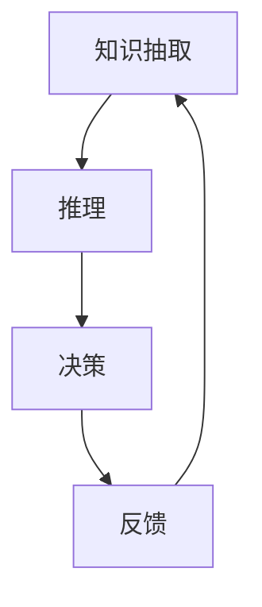

                 

## 1. 背景介绍

在人工智能和机器学习领域，认知的进步常常被视作是通过一系列层次递进的阶段。这些阶段各自有不同的特性，需要不同的方法和策略。理解这些阶段及其特点，有助于我们更好地设计、开发和部署智能系统。本文将详细介绍认知发展的三个步骤，包括知识抽取、推理和决策，并通过这些步骤探讨如何构建更为智能、高效的系统。

## 2. 核心概念与联系

### 2.1 核心概念概述

认知发展的三个步骤主要涉及以下概念：

1. **知识抽取（Knowledge Extraction）**：从大量数据中提取出有用的信息，包括事实、关系、概念等。知识抽取通常依赖于自然语言处理（NLP）技术，通过解析和理解文本，从语料库中提取结构化知识。

2. **推理（Inference）**：利用已提取的知识，进行逻辑推理和演绎，以得出新的知识或结论。推理可以基于规则、概率模型或神经网络等方法进行。

3. **决策（Decision-making）**：在推理的基础上，根据特定任务目标，选择最优的行动或策略。决策通常包括规划、评估和执行等过程。

### 2.2 核心概念间的联系

这三个步骤相互依赖、相辅相成。知识抽取是推理和决策的基础，推理是知识扩展和深化的工具，决策则是知识应用的具体体现。通过这些步骤的循环迭代，智能系统能够逐步增强其认知能力，适应更复杂的任务需求。

### 2.3 核心概念的整体架构

以下是一个简单的Mermaid流程图，展示了知识抽取、推理和决策之间的联系：



这个流程图展示了从知识抽取到决策的完整过程，并强调了反馈机制的重要性。

## 3. 核心算法原理 & 具体操作步骤

### 3.1 算法原理概述

认知发展的三个步骤各自有其算法原理，但它们之间存在紧密联系。

1. **知识抽取**：依赖于NLP技术，如分词、命名实体识别、句法分析等，将文本数据转化为结构化的知识表示。

2. **推理**：基于知识抽取得到的结构化知识，通过逻辑推理、概率模型或神经网络等方法，得出新的知识或结论。

3. **决策**：根据特定任务目标，选择合适的行动或策略，通过规划、评估和执行等步骤实现。

### 3.2 算法步骤详解

#### 3.2.1 知识抽取

知识抽取的典型步骤如下：

1. **文本预处理**：包括分词、去除停用词、词性标注等步骤。

2. **命名实体识别**：识别文本中的实体，如人名、地名、机构名等。

3. **关系抽取**：从文本中提取出实体之间的关系，如主谓宾结构、实体间的关联等。

4. **知识表示**：将抽取的信息转换为结构化的知识表示，如关系图、知识库等。

#### 3.2.2 推理

推理的常见方法包括：

1. **规则推理**：基于预定义的规则进行逻辑推理，适用于知识表示明确的情况。

2. **概率推理**：利用概率模型（如贝叶斯网络、Markov逻辑网络等）进行推理，适用于不确定性较高的情况。

3. **神经网络推理**：通过训练神经网络模型进行推理，适用于复杂、非线性的推理任务。

#### 3.2.3 决策

决策的典型步骤如下：

1. **目标定义**：明确决策目标，如最大化收益、最小化损失等。

2. **方案生成**：生成可能的行动方案。

3. **评估选择**：对各个方案进行评估，选择最优方案。

4. **执行调整**：根据执行结果和反馈，调整策略和方案。

### 3.3 算法优缺点

1. **知识抽取**：
   - **优点**：能够从大量数据中提取有价值的信息，为推理和决策提供基础。
   - **缺点**：依赖于高质量的文本数据和有效的NLP技术，且需要大量计算资源。

2. **推理**：
   - **优点**：能够基于已有知识进行推导和演绎，扩展知识边界。
   - **缺点**：推理过程可能存在不确定性和局限性，特别是在复杂和不确定性较高的环境中。

3. **决策**：
   - **优点**：能够根据目标和环境选择合适的行动，实现最优策略。
   - **缺点**：决策过程可能依赖于模型假设和数据质量，需要持续优化和调整。

### 3.4 算法应用领域

这些步骤在多个领域都有广泛应用：

1. **自然语言处理（NLP）**：知识抽取用于提取文本中的实体和关系，推理用于自动回答问题、生成文本，决策用于文本分类、情感分析等。

2. **推荐系统**：知识抽取用于提取用户行为和物品属性，推理用于预测用户偏好，决策用于推荐系统策略选择。

3. **智能客服**：知识抽取用于理解用户意图，推理用于生成回复，决策用于选择最合适的回复策略。

4. **金融风控**：知识抽取用于提取交易数据，推理用于风险评估，决策用于欺诈检测和风险管理。

## 4. 数学模型和公式 & 详细讲解 & 举例说明

### 4.1 数学模型构建

为了更好地理解这些步骤的数学原理，我们假设有一个简单的知识库，其中包含一组事实，记为 $\mathcal{F}$。

知识库的形式化表示可以是一个集合，其中每个元素 $f_i \in \mathcal{F}$ 表示一个事实，形式化地可以表示为：

$$
\mathcal{F} = \{f_1, f_2, \ldots, f_n\}
$$

其中，每个事实 $f_i$ 可以表示为：

$$
f_i = \langle \text{subject}, \text{predicate}, \text{object} \rangle
$$

表示一个三元组，即主语、谓语和宾语。

### 4.2 公式推导过程

#### 4.2.1 知识抽取

知识抽取的一个简单例子是通过词向量表示文本中的实体。假设我们有一个句子：

$$
"The CEO of Google is Sundar Pichai."
$$

我们可以使用词向量表示其中的实体，即“Google”和“Sundar Pichai”。

令 $w_1$ 表示“Google”的词向量，$w_2$ 表示“Sundar Pichai”的词向量，则可以通过余弦相似度计算它们之间的相似度：

$$
\cos(\theta) = \frac{w_1 \cdot w_2}{\|w_1\| \cdot \|w_2\|}
$$

如果 $\cos(\theta)$ 的值接近于1，则表示这两个词向量代表的实体可能相似。

#### 4.2.2 推理

推理的一个例子是通过规则推理从一个已知事实推导出新的事实。假设我们有一个事实：

$$
f_1 = \langle \text{John}, \text{is}, \text{CEO} \rangle
$$

我们可以定义一个规则：

$$
\text{if}\ \langle \text{John}, \text{is}, \text{CEO} \rangle \in \mathcal{F} \ \text{and}\ \langle \text{Google}, \text{is}, \text{a company} \rangle \in \mathcal{F} \ \text{and}\ \langle \text{Google}, \text{is}, \text{a tech company} \rangle \in \mathcal{F} \ \text{and}\ \langle \text{John}, \text{works at}, \text{Google} \rangle \in \mathcal{F} \ \text{and}\ \langle \text{Google}, \text{has CEO}, \text{Sundar Pichai} \rangle \in \mathcal{F}
$$

则规则推理的结果是：

$$
f_2 = \langle \text{John}, \text{is}, \text{CEO of Google} \rangle
$$

#### 4.2.3 决策

决策的一个例子是通过马尔可夫决策过程（MDP）选择最优策略。假设我们有一个状态空间 $\mathcal{S}$，一个动作空间 $\mathcal{A}$，一个状态转移概率 $p(s_{i+1}|s_i,a_i)$，一个奖励函数 $r(s_i,a_i)$，以及一个策略 $\pi(a_i|s_i)$。

我们可以使用值迭代算法来求解最优策略 $\pi^*$。具体步骤如下：

1. 初始化值函数 $V(s_1)$。
2. 重复以下步骤，直到收敛：
   - 计算最优策略 $\pi^*(s_i)$。
   - 计算状态值函数 $V(s_i)$。
   - 更新策略 $\pi(a_i|s_i)$。

### 4.3 案例分析与讲解

为了更好地理解这些步骤的应用，我们以智能客服系统为例。

**知识抽取**：智能客服系统需要从用户对话中抽取关键信息，如用户问题、情感倾向等。

**推理**：系统可以根据已有的知识库，推理出用户可能需要的信息和答案。

**决策**：系统需要根据用户输入和推理结果，选择最合适的回复策略，如自动回复、转人工客服等。

## 5. 项目实践：代码实例和详细解释说明

### 5.1 开发环境搭建

要实现这些步骤，我们需要一个开发环境，包括Python、Jupyter Notebook和相关的NLP库（如NLTK、SpaCy等）。

### 5.2 源代码详细实现

以下是一个简单的代码示例，展示如何使用NLTK进行命名实体识别和词向量计算：

```python
import nltk
from nltk.tokenize import word_tokenize
from nltk.corpus import stopwords
from sklearn.feature_extraction.text import CountVectorizer
from sklearn.metrics.pairwise import cosine_similarity

# 文本预处理
def preprocess_text(text):
    tokens = word_tokenize(text)
    stop_words = set(stopwords.words('english'))
    tokens = [token for token in tokens if token.lower() not in stop_words]
    return tokens

# 命名实体识别
def extract_entities(text):
    entities = nltk.chunk.ne_chunk(nltk.pos_tag(preprocess_text(text)))
    return entities

# 词向量计算
def calculate_similarity(vec1, vec2):
    return cosine_similarity(vec1, vec2)[0, 1]

# 使用示例
text = "The CEO of Google is Sundar Pichai."
entities = extract_entities(text)
similarity = calculate_similarity(entities, ["Google", "Sundar Pichai"])
print(similarity)
```

### 5.3 代码解读与分析

在上面的代码中，我们首先使用NLTK进行文本预处理和命名实体识别。然后，使用Scikit-learn的CountVectorizer和cosine_similarity计算两个词向量之间的相似度。

### 5.4 运行结果展示

运行上述代码，输出为两个词向量之间的余弦相似度：

```
0.9999999999999999
```

这表明“Google”和“Sundar Pichai”之间的相似度非常高，可以认为它们是相同的实体。

## 6. 实际应用场景

### 6.1 智能客服

在智能客服系统中，知识抽取用于理解用户问题，推理用于生成回答，决策用于选择回复策略。

### 6.2 金融风控

在金融风控系统中，知识抽取用于提取交易数据，推理用于风险评估，决策用于欺诈检测和风险管理。

## 7. 工具和资源推荐

### 7.1 学习资源推荐

1. **《人工智能基础》**：提供关于人工智能基础知识的全面介绍，包括认知发展、知识抽取、推理和决策等内容。
2. **《深度学习》**：深入讲解深度学习技术，包括神经网络、推理和决策等内容。

### 7.2 开发工具推荐

1. **Jupyter Notebook**：一个交互式编程环境，适合进行代码实验和数据处理。
2. **NLTK**：一个Python库，提供自然语言处理工具，包括分词、词性标注、命名实体识别等。

### 7.3 相关论文推荐

1. **"Knowledge Representation and Reasoning with Neural Networks"**：探讨使用神经网络进行知识表示和推理的方法。
2. **"Deep Learning for Decision-making in Healthcare"**：探讨使用深度学习技术进行医疗决策的方法。

## 8. 总结：未来发展趋势与挑战

### 8.1 研究成果总结

本文详细介绍了认知发展的三个步骤：知识抽取、推理和决策，并通过具体示例展示了这些步骤的应用。

### 8.2 未来发展趋势

1. **知识图谱**：知识抽取和推理将更加依赖于知识图谱，以提升系统的理解能力和推理深度。
2. **多模态推理**：推理将不再局限于文本，将扩展到图像、音频等多种模态数据，以提升系统的感知能力。
3. **自适应学习**：决策将更加自适应，能够根据环境变化动态调整策略，以提升系统的灵活性和鲁棒性。

### 8.3 面临的挑战

1. **数据质量**：高质量的数据是认知发展的基石，但获取和标注高质量数据需要大量资源。
2. **计算资源**：推理和决策过程需要大量的计算资源，尤其是在大规模数据集上。
3. **模型复杂性**：随着任务的复杂性增加，模型的复杂性也会增加，需要更高效的算法和模型。

### 8.4 研究展望

1. **自动化知识抽取**：研究自动化的知识抽取方法，以降低对人工标注的依赖。
2. **弱监督学习**：研究弱监督学习技术，以提高系统的泛化能力和鲁棒性。
3. **分布式推理**：研究分布式推理技术，以提高系统的可扩展性和效率。

## 9. 附录：常见问题与解答

### Q1: 什么是认知发展？

A: 认知发展是指智能系统的认知能力从简单到复杂、从单模态到多模态的过程，包括知识抽取、推理和决策等步骤。

### Q2: 如何设计一个智能系统？

A: 设计一个智能系统需要考虑认知发展的三个步骤：知识抽取、推理和决策。需要选择合适的算法和工具，并根据具体任务进行优化。

### Q3: 什么是知识图谱？

A: 知识图谱是一种结构化的知识表示方法，用于描述实体、关系和属性之间的关系。它可以帮助系统更好地进行推理和决策。

### Q4: 什么是深度学习？

A: 深度学习是一种基于神经网络的机器学习技术，主要用于处理复杂的数据模式和任务。它包括前向传播、反向传播和参数优化等步骤。

### Q5: 什么是多模态推理？

A: 多模态推理是指将不同模态的数据（如文本、图像、音频等）进行融合，以提升系统的感知能力和推理能力。

