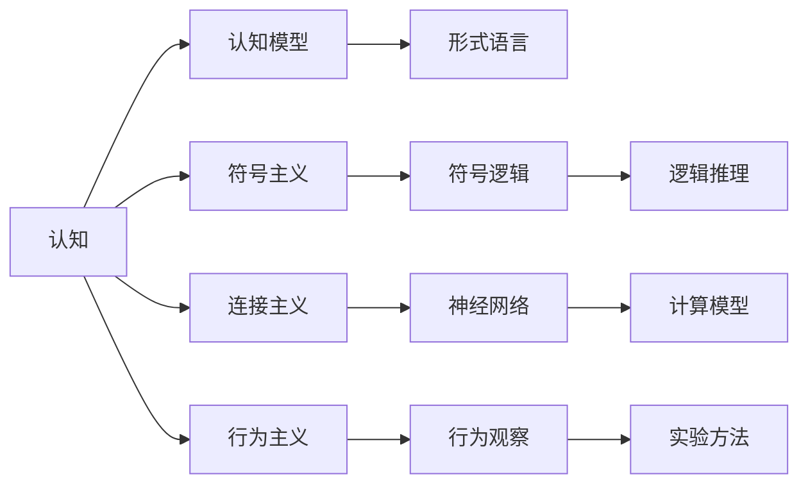
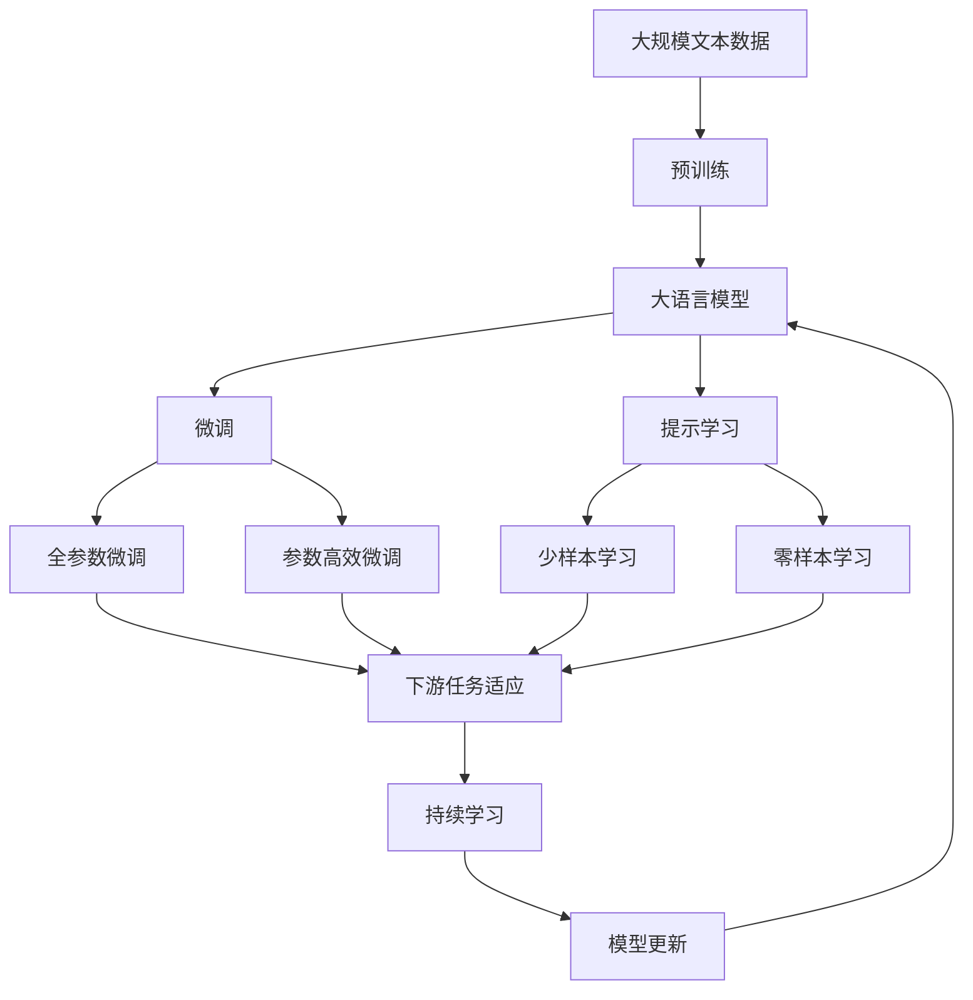

                 

# 认知的形式化：纯粹的数学构造使我们能够发现概念和联系这些概念的规律

## 1. 背景介绍

### 1.1 问题由来
认知科学是一门研究人类认知过程和心理活动的学科。在认知科学中，形式化是至关重要的工具，它使得我们可以通过精确的数学表达，对复杂的心理现象进行建模和推理。形式化认知科学的核心目标，是使我们能够对人类认知进行科学的解释和预测，从而在医学、教育、人工智能等领域产生实际应用。

形式化认知科学起源于上个世纪50年代，受到数学逻辑和计算机科学的影响。形式化方法在自然语言处理、逻辑推理等领域得到了广泛应用。近年来，随着人工智能技术的迅猛发展，形式化认知科学在认知科学、人工智能、脑科学等领域的应用前景愈加广阔。

### 1.2 问题核心关键点
形式化认知科学的关键点在于：
- 如何用数学语言精确表达认知现象。
- 如何构建有效的认知模型，解释认知过程。
- 如何在真实实验数据基础上，验证和修正认知模型。
- 如何将认知模型应用于实际领域，解决问题。

形式化认知科学的核心理论包括符号逻辑、形式语言理论、认知计算理论等，它们共同构成了认知科学的形式化基础。形式化认知科学的方法论包括符号主义、连接主义、行为主义等，这些方法论在实际应用中有着不同的优势和局限。

### 1.3 问题研究意义
形式化认知科学的研究意义在于：
- 提供科学的认知解释。形式化认知科学使得我们能够通过精确的数学模型，对认知过程进行解释，从而更好地理解人类思维。
- 构建有效的认知模型。形式化方法提供了严密的逻辑推理框架，帮助构建稳定的认知模型。
- 推动认知科学和人工智能的融合。形式化认知科学为人工智能技术提供了科学的认知基础，推动其在各领域的应用。

## 2. 核心概念与联系

### 2.1 核心概念概述

为了更好地理解形式化认知科学，我们需要介绍几个关键概念：

- **认知(cognition)**：指人类在思维、感知、学习等方面的认知过程。形式化认知科学致力于通过数学方法精确表达和解释这些过程。

- **认知模型(cognitive model)**：指用数学语言构建的、用于解释和预测认知现象的模型。常见的认知模型包括符号主义模型、神经网络模型、图灵机模型等。

- **形式语言(formal language)**：指有明确定义的、用于精确表达思维的符号系统。形式语言包括布尔逻辑、一阶逻辑、线性代数等。

- **符号主义(symbolism)**：指通过符号逻辑来表达认知过程的认知理论。符号主义是形式化认知科学的起源，提供了严格的逻辑推理基础。

- **连接主义(connectionism)**：指通过神经网络模型来模拟人脑的认知过程。连接主义为认知科学提供了计算模型，推动了认知计算理论的发展。

- **行为主义(behaviorism)**：指通过行为观察来解释认知过程的认知理论。行为主义在认知科学中占有重要地位，提供了认知科学的实验方法。

这些概念之间相互联系，共同构成了形式化认知科学的理论基础和方法体系。下面通过Mermaid流程图来展示这些概念之间的关系：



### 2.2 概念间的关系

这些概念之间存在着紧密的联系，形成了一个完整的认知科学形式化体系。下面通过几个Mermaid流程图来展示这些概念之间的联系：

#### 2.2.1 认知与认知模型的关系


这个流程图展示了认知与认知模型的关系。认知模型是认知的数学表达，通过形式语言来精确表达认知现象。

#### 2.2.2 符号主义与认知模型的关系


这个流程图展示了符号主义与认知模型的关系。符号主义通过符号逻辑来构建认知模型，使得认知模型能够进行逻辑推理和精确表达。

#### 2.2.3 连接主义与认知模型的关系


这个流程图展示了连接主义与认知模型的关系。连接主义通过神经网络模型来构建认知模型，使得认知模型具备计算能力，能够进行复杂的认知过程模拟。

#### 2.2.4 行为主义与认知模型的关系


这个流程图展示了行为主义与认知模型的关系。行为主义通过行为观察来构建认知模型，使得认知模型能够从实验数据中学习并预测行为。

### 2.3 核心概念的整体架构

最后，我们用一个综合的流程图来展示这些核心概念在大语言模型微调过程中的整体架构：



这个综合流程图展示了从预训练到微调，再到持续学习的完整过程。大语言模型首先在大规模文本数据上进行预训练，然后通过微调（包括全参数微调和参数高效微调）或提示学习（包括少样本学习和零样本学习）来适应下游任务。最后，通过持续学习技术，模型可以不断学习新知识，同时避免遗忘旧知识。

## 3. 核心算法原理 & 具体操作步骤
### 3.1 算法原理概述

形式化认知科学的核心算法原理是符号主义和计算理论。形式化认知科学通过符号逻辑来构建认知模型，解释认知过程。具体的算法流程包括符号推理、语义分析、认知计算等。

符号主义方法通过逻辑符号来表达认知过程，包括布尔逻辑、一阶逻辑等。这些逻辑符号可以进行精确的推理，从而构建稳定的认知模型。

计算理论方法通过神经网络模型来模拟认知过程，包括神经元模型、连接主义模型等。这些计算模型具备强大的计算能力，可以模拟复杂的认知过程。

### 3.2 算法步骤详解

形式化认知科学的算法步骤包括以下几个关键步骤：

**Step 1: 收集数据**
- 收集与认知现象相关的数据，包括行为数据、实验数据、文本数据等。数据必须具备高质量、多样性、代表性等特点。

**Step 2: 定义形式语言**
- 定义用于表达认知现象的形式语言。常用的形式语言包括布尔逻辑、一阶逻辑、线性代数等。

**Step 3: 构建认知模型**
- 根据定义的形式语言，构建认知模型。常见的认知模型包括符号主义模型、神经网络模型等。

**Step 4: 训练和优化**
- 在收集的数据上训练认知模型，优化模型参数。常见的训练方法包括梯度下降、期望最大化等。

**Step 5: 测试和验证**
- 在新的数据集上测试认知模型的性能，验证模型的泛化能力。常见的方法包括交叉验证、留一法等。

**Step 6: 应用和优化**
- 将认知模型应用于实际问题中，进一步优化模型性能。常见的优化方法包括参数调整、结构优化等。

### 3.3 算法优缺点

形式化认知科学的优点包括：
- 精确性高：符号主义方法提供了严格的逻辑推理基础，使得认知模型能够进行精确的推理。
- 灵活性强：形式语言和方法灵活多样，可以适应不同类型的认知现象。
- 应用广泛：形式化认知科学在人工智能、医学、教育等领域有着广泛的应用前景。

形式化认知科学的缺点包括：
- 过于复杂：形式语言和方法过于复杂，难以理解和应用。
- 数据需求大：收集高质量、多样性、代表性强的数据成本高，数据需求大。
- 难以解释：形式化方法缺乏直观的解释，难以理解模型决策过程。

尽管形式化认知科学存在一些缺点，但其精确性和灵活性使其在认知科学和人工智能领域有着重要的应用价值。

### 3.4 算法应用领域

形式化认知科学在多个领域有着广泛的应用，以下是几个主要应用领域：

**自然语言处理(NLP)**
- 形式化认知科学在自然语言处理中有着广泛的应用，包括文本分类、情感分析、语义理解等。形式化方法能够精确表达语言现象，从而构建有效的语言模型。

**认知计算**
- 形式化认知科学为认知计算提供了理论基础，推动了认知计算技术的发展。认知计算旨在通过计算模型来模拟人脑的认知过程，解决复杂的认知问题。

**人工智能**
- 形式化认知科学为人工智能提供了科学的认知基础，推动了人工智能技术的发展。形式化方法能够精确表达认知过程，为人工智能系统提供了科学的认知模型。

**脑科学**
- 形式化认知科学为脑科学研究提供了精确的数学模型，推动了脑科学的研究进展。形式化方法能够精确表达脑神经活动，从而构建有效的脑科学模型。

## 4. 数学模型和公式 & 详细讲解 & 举例说明

### 4.1 数学模型构建

形式化认知科学的核心数学模型包括符号逻辑、一阶逻辑、神经网络模型等。以下是几个常见的数学模型及其构建过程。

**布尔逻辑**
- 布尔逻辑是形式化认知科学中最基本的形式语言，用于表达真值逻辑关系。布尔逻辑的符号系统包括命题符号、逻辑符号等。

**一阶逻辑**
- 一阶逻辑是形式化认知科学中常用的逻辑系统，用于表达关系逻辑。一阶逻辑的符号系统包括个体符号、谓词符号、函数符号等。

**神经网络模型**
- 神经网络模型是形式化认知科学中常用的计算模型，用于模拟人脑的认知过程。神经网络模型的符号系统包括神经元符号、连接符号等。

**图灵机模型**
- 图灵机模型是形式化认知科学中常用的计算模型，用于模拟计算过程。图灵机模型的符号系统包括读写符号、状态符号等。

### 4.2 公式推导过程

以下以布尔逻辑和一阶逻辑为例，展示形式化认知科学的数学公式推导过程。

**布尔逻辑**
布尔逻辑的符号系统包括命题符号、逻辑符号等。布尔逻辑的公式包括合取公式、析取公式、否定公式等。以下是布尔逻辑的公式推导过程：

1. 合取公式
   - 合取公式的基本形式为：$(A \land B)$
   - 合取公式的推理规则包括：
     - 结合律：$(A \land B) \land C = (A \land (B \land C))$
     - 分配律：$(A \lor B) \land C = (A \land C) \lor (B \land C)$

2. 析取公式
   - 析取公式的基本形式为：$(A \lor B)$
   - 析取公式的推理规则包括：
     - 结合律：$(A \lor B) \lor C = (A \lor (B \lor C))$
     - 分配律：$(A \land B) \lor C = (A \lor C) \land (B \lor C)$

3. 否定公式
   - 否定公式的基本形式为：$\neg A$
   - 否定公式的推理规则包括：
     - 德摩根律：$\neg (A \land B) = (\neg A) \lor (\neg B)$
     - 德摩根律：$\neg (A \lor B) = (\neg A) \land (\neg B)$

**一阶逻辑**
一阶逻辑的符号系统包括个体符号、谓词符号、函数符号等。一阶逻辑的公式包括存在公式、全称公式等。以下是一阶逻辑的公式推导过程：

1. 存在公式
   - 存在公式的基本形式为：$\exists x (P(x))$
   - 存在公式的推理规则包括：
     - 存在规则：$\exists x (P(x)) \land Q(x) \rightarrow Q(c)$，其中$c$是任意个体符号。

2. 全称公式
   - 全称公式的基本形式为：$\forall x (P(x))$
   - 全称公式的推理规则包括：
     - 全称规则：$\forall x (P(x)) \land Q(x) \rightarrow P(c)$，其中$c$是任意个体符号。

### 4.3 案例分析与讲解

**案例1：布尔逻辑**
- 任务：给定两个布尔变量$A$和$B$，求$(A \land B) \land (\neg A) \lor B$的值。
- 解答：根据布尔逻辑的规则，进行公式推导：
  - $(A \land B) \land (\neg A) \lor B = ((A \land B) \land \neg A) \lor B = ((A \land \neg A) \land B) \lor B = B \land B = B$

**案例2：一阶逻辑**
- 任务：给定个体符号$a$和$b$，求$\exists x (P(x) \land Q(x))$的值。
- 解答：根据一阶逻辑的规则，进行公式推导：
  - $\exists x (P(x) \land Q(x)) \rightarrow P(a) \land Q(a)$
  - $\exists x (P(x) \land Q(x)) \rightarrow P(b) \land Q(b)$
  - 因此，$\exists x (P(x) \land Q(x))$的值为真。

## 5. 项目实践：代码实例和详细解释说明
### 5.1 开发环境搭建

在进行形式化认知科学实践前，我们需要准备好开发环境。以下是使用Python进行Prolog（一种形式语言）开发的环境配置流程：

1. 安装Anaconda：从官网下载并安装Anaconda，用于创建独立的Python环境。

2. 创建并激活虚拟环境：
```bash
conda create -n prolog-env python=3.8 
conda activate prolog-env
```

3. 安装Prolog库：
```bash
pip install clingo
```

4. 安装各类工具包：
```bash
pip install numpy pandas scikit-learn matplotlib tqdm jupyter notebook ipython
```

完成上述步骤后，即可在`prolog-env`环境中开始形式化认知科学的实践。

### 5.2 源代码详细实现

下面我们以布尔逻辑为例，给出使用Prolog进行布尔逻辑推理的Python代码实现。

首先，定义布尔逻辑的符号和规则：

```python
from clingo import Control

def parse_clingo_program(file_path):
    with open(file_path, 'r') as f:
        program = f.read()
    control = Control()
    control.add programs(program.splitlines(), format='p')
    return control

def run_clingo(query, control):
    result = control.model()
    if result is not None:
        return [sol for sol in result.solutions()]
    else:
        return []

# 定义布尔逻辑符号
A = Symbol('A')
B = Symbol('B')
C = Symbol('C')

# 定义布尔逻辑规则
rule1 = '(A, B) :- not(A, not(B)).'
rule2 = '(~A, B) :- not(A, B).'
rule3 = '(A, ~B) :- not(A, B).'

# 构建Prolog程序
program = f"""
{rule1}
{rule2}
{rule3}
"""

control = parse_clingo_program(program)
```

接着，使用Prolog推理查询结果：

```python
# 定义布尔逻辑查询
query = 'A, not(A, B).'

# 运行Prolog程序
solutions = run_clingo(query, control)

# 输出查询结果
for sol in solutions:
    print(sol)
```

以上就是使用Prolog进行布尔逻辑推理的完整代码实现。可以看到，Prolog提供了强大的符号逻辑推理能力，能够方便地表达和求解复杂的逻辑问题。

### 5.3 代码解读与分析

让我们再详细解读一下关键代码的实现细节：

**parse_clingo_program函数**
- 定义了将Prolog程序文件解析为Prolog控制器的函数。该函数将文件中的规则解析为Prolog控制器的程序，并返回控制器的对象。

**run_clingo函数**
- 定义了在Prolog控制器的基础上运行查询并返回解的函数。该函数首先调用控制器的模型函数，获取查询结果，然后遍历结果，输出查询解。

**布尔逻辑符号**
- 定义了布尔逻辑中的符号变量，使用Sympy库中的Symbol类。

**布尔逻辑规则**
- 定义了布尔逻辑中的规则，使用字符串形式表示。

**构建Prolog程序**
- 将布尔逻辑规则以字符串形式拼接起来，构建完整的Prolog程序。

**运行Prolog程序**
- 使用Prolog控制器的add_programs函数将程序文件加载到控制器的程序中，然后运行查询，获取查询结果。

以上代码展示了如何使用Prolog进行布尔逻辑推理。通过简单的符号定义和规则编写，Prolog能够自动进行复杂的逻辑推导和求解。

## 6. 实际应用场景

### 6.1 逻辑推理系统

逻辑推理系统是形式化认知科学的一个重要应用场景。逻辑推理系统能够根据已知规则和数据，自动进行逻辑推导和决策。常见的逻辑推理系统包括专家系统、智能助手等。

在医疗领域，逻辑推理系统可以用于病理学诊断、药物推荐等任务。通过定义各种疾病的诊断规则和症状数据，逻辑推理系统可以自动诊断疾病，推荐治疗方案。

在金融领域，逻辑推理系统可以用于风险评估、投资策略等任务。通过定义各种金融产品的市场规则和历史数据，逻辑推理系统可以自动评估风险，推荐投资策略。

### 6.2 自然语言理解

形式化认知科学在自然语言理解中也有广泛应用。自然语言理解系统能够理解自然语言文本，提取关键信息，并进行语义分析。常见的自然语言理解系统包括机器翻译、语音识别等。

在机器翻译中，形式化认知科学可以用于语义分析和语言生成。通过定义各种语言的语法和语义规则，自然语言理解系统可以自动翻译文本，生成流畅自然的语言表达。

在语音识别中，形式化认知科学可以用于语音语义转换。通过定义各种语言的语音规则和语义规则，自然语言理解系统可以自动识别语音，生成文本表达。

### 6.3 认知计算

形式化认知科学为认知计算提供了理论基础，推动了认知计算技术的发展。认知计算旨在通过计算模型来模拟人脑的认知过程，解决复杂的认知问题。

在认知计算中，形式化认知科学可以用于认知建模和认知计算。通过定义各种认知模型的符号系统和推理规则，认知计算系统可以模拟人脑的认知过程，解决复杂的认知问题。

例如，在情绪识别中，认知计算系统可以模拟人类的情绪反应和情绪推理过程，通过计算模型分析用户的情绪状态，提供情感支持。

## 7. 工具和资源推荐
### 7.1 学习资源推荐

为了帮助开发者系统掌握形式化认知科学理论基础和实践技巧，这里推荐一些优质的学习资源：

1. 《逻辑基础》（George Boole）：经典逻辑学著作，奠定了逻辑学的理论基础。
2. 《一阶逻辑导论》（Hao Zhang）：介绍一阶逻辑的基本概念和推理规则，适合初学者学习。
3. 《Prolog程序设计》（Herbert Simon）：介绍Prolog编程语言的原理和应用，适合形式化认知科学实践者学习。
4. 《认知科学基础》（Mara Selman）：介绍认知科学的基本概念和理论，适合深入学习认知科学理论。
5. 《认知计算导论》（Timothy Smith）：介绍认知计算的基本概念和应用，适合了解认知计算技术。

通过对这些资源的学习实践，相信你一定能够系统掌握形式化认知科学的基本理论和实践技巧。

### 7.2 开发工具推荐

形式化认知科学的开发工具包括Prolog、Python等。以下是几款常用的开发工具：

1. Prolog：Prolog是一种强大的符号逻辑编程语言，能够进行精确的逻辑推理和求解。Prolog的库包括CLINGO、SWI-Prolog等。
2. Python：Python是一种灵活的编程语言，能够方便地与Prolog等形式语言结合使用。Python的库包括Sympy、SymPy、SymPy等。

合理利用这些工具，可以显著提升形式化认知科学的开发效率，加速创新迭代的步伐。

### 7.3 相关论文推荐

形式化认知科学的发展依赖于学界的持续研究。以下是几篇奠基性的相关论文，推荐阅读：

1. "On the logical basis of computation"（Alan Turing）：经典论文，奠定了计算理论的基础。
2. "Foundations of formalized mathematics"（Clifford A. Pickover）：介绍形式化数学的基本概念和方法，适合理解形式化认知科学的基本原理。
3. "The structure of scientific revolutions"（Thomas Kuhn）：介绍科学革命的理论基础，适合理解科学认知的基本机制。
4. "Artificial Intelligence: A Modern Approach"（Stuart Russell & Peter Norvig）：介绍人工智能的基本概念和方法，适合了解人工智能技术的发展历程。
5. "Cognitive Modeling: Principles and Applications"（Michal Tomasik）：介绍认知建模的基本概念和应用，适合了解认知科学的最新研究进展。

这些论文代表了形式化认知科学的研究脉络，帮助研究者把握学科前进方向，激发更多的创新灵感。

## 8. 总结：未来发展趋势与挑战

### 8.1 总结

本文对形式化认知科学的理论基础和实践技巧进行了全面系统的介绍。首先阐述了形式化认知科学的研究背景和意义，明确了形式化认知科学在认知科学、人工智能、脑科学等领域的应用价值。其次，从原理到实践，详细讲解了形式化认知科学的数学原理和关键步骤，给出了形式化认知科学实践的完整代码实例。同时，本文还探讨了形式化认知科学在实际领域的应用前景，展示了其广阔的应用潜力。此外，本文精选了形式化认知科学的各类学习资源，力求为读者提供全方位的技术指引。

通过本文的系统梳理，可以看到，形式化认知科学的研究意义在于：提供科学的认知解释、构建有效的认知模型、推动认知科学和人工智能的融合。形式化认知科学的理论基础包括符号主义、计算理论等，这些基础使得形式化认知科学能够通过精确的数学模型，对认知现象进行建模和推理。形式化认知科学的应用领域包括自然语言处理、认知计算、人工智能等，这些领域为形式化认知科学提供了广阔的应用前景。

### 8.2 未来发展趋势

展望未来，形式化认知科学将呈现以下几个发展趋势：

1. 符号主义与计算理论的融合。符号主义和计算理论是形式化认知科学的两大支柱，未来需要更加紧密地融合，形成更加强大的认知模型。

2. 多模态形式化方法的兴起。形式化认知科学在多模态数据处理和融合方面有广阔前景，未来需要开发更多多模态的形式化方法，以适应更复杂的认知任务。

3. 形式化认知科学与其他人工智能技术的融合。形式化认知科学与其他人工智能技术如知识表示、因果推理、强化学习等需要进行更深层次的融合，形成更加全面的人工智能系统。

4. 形式化认知科学在脑科学中的应用。形式化认知科学为脑科学研究提供了精确的数学模型，未来需要进一步加强脑科学和认知科学的融合，推动认知科学的发展。

5. 形式化认知科学的工程应用。形式化认知科学在实际工程应用中需要进一步优化，以适应大规模数据处理和复杂认知任务的需求。

6. 形式化认知科学的可解释性。形式化认知科学需要在模型解释性方面进行更多探索，以增强模型的透明性和可信性。

### 8.3 面临的挑战

尽管形式化认知科学在理论和应用上取得了重要进展，但在迈向更加智能化、普适化应用的过程中，仍面临诸多挑战：

1. 数据需求高。形式化认知科学需要大量高质量的数据进行训练和验证，数据收集成本高，数据需求量大。

2. 模型复杂度高。形式化认知科学模型复杂度高，难以理解和调试，模型构建和维护成本高。

3. 应用场景多样。形式化认知科学在实际应用中需要适应多种场景，如自然语言处理、认知计算、脑科学等，应用场景多样性大。

4. 技术门槛高。形式化认知科学需要较高的技术门槛，需要研究者具备深厚的数学和计算机科学背景。

5. 可解释性不足。形式化认知科学模型缺乏直观的解释，难以理解模型决策过程，模型的可解释性不足。

6. 多模态处理难度大。形式化认知科学在多模态数据处理和融合方面有挑战，需要开发更多多模态的形式化方法。

正视这些挑战，积极应对并寻求突破，将是形式化认知科学未来发展的关键。相信随着学界和产业界的共同努力，这些挑战终将一一被克服，形式化认知科学必将在构建人机协同的智能系统中发挥更大作用。

### 8.4 研究展望

未来的形式化认知科学需要在以下几个方面进行更多探索：

1. 符号主义与计算理论的融合。符号主义和计算理论是形式化认知科学的两大支柱，未来需要更加紧密地融合

